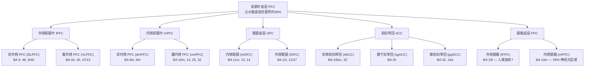
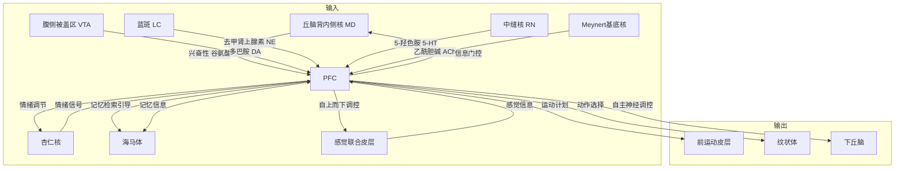

# 前额叶皮层 (Prefrontal Cortex)

---

## 一、解剖位置与宏观结构

前额叶皮层（PFC）位于大脑额叶的最前端，占人类大脑皮层总面积约 **30%**，是人脑与其他灵长类动物相比最显著扩增的区域。PFC 的前界是额极（frontal pole），后界以初级运动皮层（BA 4）和前运动皮层（BA 6）为界。

从大体解剖看，PFC 覆盖以下脑回：
- **额上回**（superior frontal gyrus）的大部分
- **额中回**（middle frontal gyrus）
- **额下回**（inferior frontal gyrus）的大部分
- **眶回**（orbital gyri）
- **扣带回前部**（anterior cingulate gyrus）
- 半球内侧面额上回及额极区域

### 三种宏观分区

| 分区 | 英文 | 位置 | 核心 Brodmann 区 |
|------|------|------|-----------------|
| **外侧前额叶** | Lateral PFC | 额叶外侧面 | BA 8, 9, 10, 44, 45, 46, 47 |
| **内侧前额叶** | Medial PFC | 半球内侧面+扣带回前部 | BA 8m, 9m, 10m, 12, 14, 24, 25, 32 |
| **眶额皮层** | Orbital PFC | 额叶底面，眼眶上方 | BA 11, 12, 13, 14 |

---

## 二、细胞构筑与分层结构

### 2.1 PFC 的定义标准

PFC 的定义在历史上经历了多次演变，目前有三种主流定义标准：

1. **细胞构筑标准**（最经典）：具有清晰的 **第 IV 层（颗粒层）**——即"颗粒化皮层"（granular cortex）。这是灵长类 PFC 区别于无颗粒运动皮层的关键标志。人类 PFC 主要是**同型六层皮层**（eulaminate / homotypical isocortex）。

2. **连接性标准**：与**丘脑背内侧核**（mediodorsal nucleus of thalamus, MD）有主要投射关系的额叶区域。这个标准最早由 Rose & Woolsey (1948) 提出。

3. **功能标准**：额叶中除去运动/前运动皮层的所有区域。

> **关键矛盾**：啮齿类动物完全没有颗粒化额叶皮层（整个额叶都是无颗粒的），但按连接性标准，其前边缘皮层（prelimbic, PL）和下边缘皮层（infralimbic, IL）被认为是灵长类 PFC 的功能同源物。

### 2.2 六层细胞结构详解

PFC 由六层水平排列的神经元层构成，从软脑膜表面到白质：

| 层次 | 名称 | 细胞类型 | 主要投射目标 |
|------|------|---------|------------|
| **第 I 层** | 分子层 (Molecular) | 少量 Cajal-Retzius 细胞、中间神经元 | 接收来自丘脑的基质输入、反馈投射 |
| **第 II 层** | 外颗粒层 (External Granular) | 小锥体细胞、星状细胞 | 同侧/对侧皮层（皮层-皮层连接） |
| **第 III 层** | 外锥体层 (External Pyramidal) | 中型至大型锥体细胞（**PFC 中特别发达**） | 同侧/对侧皮层；**IIIc 亚层是 PFC 工作记忆的核心** |
| **第 IV 层** | 内颗粒层 (Internal Granular) | 星状细胞、颗粒细胞 | 接收丘脑 MD 核的输入（**PFC 的标志性层次**） |
| **第 V 层** | 内锥体层 (Internal Pyramidal) | 大型锥体细胞 | 投射至纹状体、脑干、脊髓 |
| **第 VI 层** | 多形层 (Multiform) | 多种形态锥体细胞 | 投射至丘脑（包括 MD 核，形成丘脑-皮层环路） |

```
软脑膜 (Pial Surface)
────────────────────────────
  I     分子层 ──── 接收丘脑基质输入、反馈轴突
────────────────────────────
  II    小锥体细胞 ─┐
─────────────────────┤ 皮层-皮层投射
  III   中/大锥体   ─┘  (IIIc 亚层: 工作记忆核心)
────────────────────────────
  IV    颗粒细胞 ──── 接收丘脑 MD 核输入  ← PFC 标志
────────────────────────────
  V     大锥体细胞 ── 投射至纹状体/脑干/脊髓
────────────────────────────
  VI    多形细胞 ──── 投射回丘脑 MD 核 (闭合环路)
────────────────────────────
         白质 (White Matter)
```

### 2.3 细胞类型与比例

- **锥体神经元 (Pyramidal Neurons)**：约占 75%，是兴奋性投射神经元。使用谷氨酸作为神经递质。
  - 第 II/III 层锥体细胞 → 皮层-皮层投射（胼胝体连接）
  - 第 V 层锥体细胞 → 皮层下投射（纹状体、脑干）
  - 第 VI 层锥体细胞 → 丘脑投射

- **中间神经元 (Interneurons)**：约占 25%，使用 GABA 作为抑制性神经递质。主要亚型：
  - **PV+ (Parvalbumin)** 篮状细胞/枝形灯细胞 — 靶向锥体细胞的胞体和轴突起始段，调控 gamma 振荡
  - **SST+ (Somatostatin)** Martinotti 细胞 — 靶向锥体细胞的远端树突
  - **VIP+ (Vasoactive Intestinal Peptide)** — 去抑制其他中间神经元
  - **CR+ (Calretinin)** — 功能尚不完全清楚

### 2.4 颗粒化程度的梯度：从后到前

PFC 内部存在沿**后-前轴**的细胞构筑梯度：

```
后部 (Caudal) ───────────────────→ 前部 (Rostral)
无颗粒 (Agranular) → 发育不良颗粒 (Dysgranular) → 颗粒化 (Granular)
      ↑                        ↑                        ↑
   ACC / 后部 OFC          BA 44, 45, 47           BA 9, 10, 46
   边缘系统关联最强          过渡区                   抽象认知最高
```

- **无颗粒区**：第 IV 层缺失或隐约可见。包括前扣带回（ACC）和后部眶额皮层。进化上最古老。
- **发育不良颗粒区**：第 IV 层薄且不连续。包括 BA 44/45（Broca 区）、腹外侧 PFC (BA 47)。
- **颗粒化区**：第 IV 层宽广且密集。包括 DLPFC (BA 9, 46) 和额极 (BA 10)。进化上最新。

---

## 三、功能分区详解

### 3.1 亚区总览



### 3.2 背外侧前额叶 (DLPFC: BA 9, 46, 9/46)

**解剖位置**：额中回及其周围区域，沿额上沟和额中沟延伸。

**细胞构筑特征**：
- 清晰的颗粒化皮层，第 IV 层发达
- 第 III 层有巨大锥体细胞（尤其在 BA 46），树突棘密度极高
- BA 9/46 过渡区位于额上沟和额中沟深处，兼具两者特征

**核心功能**：
- **工作记忆**（最经典的 DLPFC 功能）：延迟期持续放电
- **认知控制与计划**：自上而下偏置信号的源头（Miller & Cohen 理论）
- **抽象推理**：规则表征、类别处理
- **认知灵活性**：任务切换、策略更新

**最新发现**（Nee & D'Esposito, 2025）：
- DLPFC 内存在**层级化组织**：中段 DLPFC（mid-dlPFC，位于额下沟附近）是**层级顶端**，不对称地影响其他 lPFC 区域
- 皮质-纹状体交互是层级化处理的关键机制
- 额极（rlPFC）虽然更靠前，但在层级中处于 mid-dlPFC 之下

### 3.3 腹外侧前额叶 (VLPFC: BA 44, 45, 47/12)

**解剖位置**：额下回，包含 Broca 区（BA 44/45）。

**细胞构筑特征**：
- 发育不良颗粒化（dysgranular），第 IV 层较薄
- 猕猴同源区（area 47/12）可细分为 12l, 12r, 12o, 12m

**核心功能**：
- **反应抑制**：右侧 VLPFC（rIFG）是停止信号任务的核心脑区
- **语言生成**：左侧 BA 44/45（Broca 区）
- **共情**：BA 47 在共情与自动化动作中激活
- **刺激-奖赏关联检索**：利用条件信息指导行为

### 3.4 眶额皮层 (OFC: BA 11, 12, 13, 14)

**解剖位置**：额叶底面，眼眶上方。

**细胞构筑特征**：
- 后部 OFC (BA 13) 为无颗粒皮层（agranular）
- 前部 OFC (BA 11) 为颗粒化皮层
- 体现 PFC 的后-前演化梯度

**内外侧功能分离**（Rolls et al., 2024）：

| 分区 | 功能 | MDD 中的异常 |
|------|------|------------|
| **内侧 OFC (mOFC)** | 奖赏加工、主观价值表征 | 连接性**降低**、奖赏敏感性下降 → 快感缺失 |
| **外侧 OFC (lOFC)** | 非奖赏/惩罚加工、负性偏差 | 连接性**升高**、对厌恶刺激过度敏感 → 负性偏差 |

**核心功能**：
- 奖赏评估与预期、结果值编码
- 冲动控制、社会行为规范
- **反转学习**（reversal learning）：当刺激-奖赏关联变化时更新行为

### 3.5 前扣带回 (ACC: BA 24, 25, 32, 33)

**解剖位置**：扣带回前部，胼胝体上方和前方。

**细胞构筑特征**：
- 无颗粒皮层（agranular），无第 IV 层
- 含有**冯·埃科诺莫神经元**（von Economo Neurons, VENs）— 一种大型双极/梭形投射神经元
- VENs 在 dACC 和前岛叶密度最高，在右侧半球更多

**VENs 的重要性**：
- 仅在类人猿、人类、鲸豚类、大象中发现
- 人类 VEN 数量远多于类人猿
- 在额颞叶痴呆（bvFTD）中选择性丢失 → 与社会认知障碍直接相关
- 表达 DISC1（精神分裂症相关基因）和神经调节素肽（NMB/GRP，参与食欲调节）

**核心功能**：
- **错误监测**与冲突检测
- **认知努力分配**：决定为任务付出多少心智努力
- **社会认知**：尤其是 dACC 与心理理论和共情相关
- **疼痛的情感成分**（非感觉成分）

### 3.6 腹内侧前额叶 (VMPFC: BA 10m, 14, 25, 32)

**解剖位置**：额叶内侧面下部，包括膝下扣带回 (sgACC, BA 25)。

**核心功能**：
- **自我参照加工**（self-referential processing）：默认模式网络（DMN）的核心节点
- **情绪调节**：通过调控杏仁核来下调恐惧和负面情绪
- **价值判断**与风险-奖赏权衡
- **躯体标记假说**（Damasio）：将情绪信号（躯体状态）与决策选项关联

### 3.7 额极皮层 (FPC / BA 10)

**解剖位置**：额叶最前端，是人类 PFC 中最大的单一细胞构筑区。

**细胞构筑特征**：
- 宽广而密集的第 IV 层（颗粒层）
- 人类 BA 10 可细分为外侧部（Fp1）和内侧部（Fp2）— Fp1 有更宽的第 IV 层
- 猕猴 BA 10 可细分为 4 个亚区（10d, 10o, 10md, 10mv）
- **外侧额极 (lFPC)** 可能是人类独有的亚区（Neubert et al., 2014）
- FPC 锥体细胞的树突棘密度和数量高于 OFC 锥体细胞（人类尤其突出）

**核心功能**：
- **元认知**（metacognition）：思考关于思考的思考
- **探索-利用权衡**（exploration-exploitation trade-off）：决定是坚持当前策略还是探索新策略
- **多任务协调**：追踪子目标与主目标的层级关系
- **反事实思维**（counterfactual thinking）："如果当时...就会..."
- **社会规范仲裁**：在不同社会情境间切换合作策略（Zoh et al., 2021）

**FPC 的关键发现**（Mansouri et al., 2022；Tang et al., 2022）：
- 猕猴 FPC 在**反馈时**而非选择时编码目标信息（与更后部 PFC 相反）
- FPC 采用**稀疏编码**（sparse encoding），适合灵活调用抽象信息
- lFPC 在人类中极度扩增，可能支持人类独有的合作和社会认知能力

---

## 四、神经环路与连接组

### 4.1 PFC 的连接全景

PFC 是全脑连接最密集的枢纽之一。其连接可以按方向和功能分为几大类。



### 4.2 皮质-纹状体-丘脑-皮质环路 (CSTC Loops)

CSTC 环路是理解 PFC 功能的核心框架。这些环路从 PFC → 纹状体 → 苍白球 → 丘脑 → 回到 PFC，形成闭合回路。

**五条平行的 CSTC 环路**（Alexander et al., 1986 经典模型，后续继续细化）：

| 环路 | PFC 起源 | 纹状体目标 | 核心功能 |
|------|---------|-----------|---------|
| **运动环路** | SMA / 运动皮层 | 壳核 | 运动执行 |
| **眼球运动环路** | FEF / DLPFC | 尾状核体部 | 眼球运动控制 |
| **背外侧前额叶环路** | DLPFC (BA 9, 46) | 背外侧尾状核头 | 执行功能、工作记忆 |
| **外侧眶额环路** | lOFC (BA 11, 12) | 腹内侧尾状核 | 冲动控制、行为抑制 |
| **前扣带回环路** | ACC (BA 24, 32) | 腹侧纹状体（伏隔核） | 动机、努力分配、奖赏 |

**OFC CSTC 环路在精神疾病中的关键作用**（Frontiers, 2017）：
- OCD：OFC-纹状体环路过度活跃（第一个被认识的环路精神障碍）
- MDD：mOFC 连接性降低 + lOFC 连接性升高
- 物质成瘾 (SUDs)：OFC 功能低下导致无法评估长期后果

### 4.3 层级化连接原理

**Barbas 模型**（"结构模型", Structural Model）：

按颗粒化程度，PFC 区域分为两类，形成信息处理的级联架构：

```
外界感觉信息 ──→ 颗粒化 PFC (eulaminate)
                  DLPFC / 感觉关联皮层
                  │
                  │  整合外部状态
                  │
                  ▼
              发育不良颗粒 PFC (dysgranular)
              VLPFC / 过渡区
                  │
                  │
                  ▼
              无颗粒 PFC (agranular / limbic)
              OFC后部 / ACC / vmPFC
                  │
                  │  整合内部状态 (价值、情绪、动机)
                  │
                  ▼
              边缘系统 / 下丘脑 / 脑干
                  行动输出
```

- **颗粒化区** → 主要处理**外部世界**信息（感觉、抽象规则）
- **边缘区**（无颗粒） → 主要处理**内部状态**信息（价值、情绪、动机、内感受）
- 两类区域之间直接连接，实现内外信息的整合

**PFC 层级化组织的最新修正**（Nee & D'Esposito, 2025）：
- 后-前轴的抽象梯度已从简单线性模型修正为**层级交互网络**模型
- mid-dlPFC 是 lPFC 层级顶端（而非最前端的 rlPFC）
- **皮质-纹状体交互**是层级化处理的核心机制
- lPFC 层级嵌入更广阔的脑网络中，从具体的感觉运动功能一直延伸到抽象认知功能

### 4.4 猕猴与人 PFC 连接组的跨物种比较

Uylings et al. (2003) 提出跨物种 PFC 比较的五个标准维度：

1. 细胞构筑相似性
2. **连接模式**（连接的密度和分布）
3. 神经化学分布和受体表达
4. 胚胎发育过程
5. **功能属性**（电生理和行为）

**核心结论**（Wise, 2021）：
- 啮齿类 mPFC (PL/IL) → 灵长类 ACC/后部 OFC 的功能同源物（无颗粒边缘区）
- 啮齿类**没有**灵长类颗粒化 PFC (DLPFC/FPC) 的同源物
- 人类 PFC 的扩增主要体现为：灰质体积是猕猴的 4.5 倍，白质体积比例更是猕猴的 2.4 倍
- 有争议的是人类是否增加**全新的 PFC 区域**——目前证据支持的是**既有区域的极度扩增**和连接重组

---

## 五、核心认知功能详解

### 5.1 执行功能与偏置信号理论

Miller & Cohen (2001) 的影响力最大的 PFC 理论：PFC 通过**偏置信号**（bias signals）调控后部皮层的加工，使大脑优先处理与当前任务相关的信息。

**核心执行功能三角**：

| 功能 | 神经基础 | 实验范式 | 日常表现 |
|------|---------|---------|---------|
| **抑制控制** | 右侧额下回 (rIFG) + pre-SMA | Go/No-Go, Stop-Signal | 忍住不看手机、克制冲动消费 |
| **工作记忆更新** | DLPFC (BA 46) | N-back, 延迟反应任务 | 心算时暂存中间结果 |
| **认知灵活性** | DLPFC + ACC + 纹状体 | Wisconsin Card Sorting, 任务切换 | 计划变更时快速切换思路 |

### 5.2 工作记忆的细胞机制

**延迟期持续放电**（Delay-period persistent activity）是工作记忆的细胞基础：

- **发现者**：Fuster & Alexander (1971) 和 Kubota & Niki (1971) 在灵长类 PFC 首次记录到
- **机制**：锥体神经元通过 NMDA 受体介导的反复兴奋网络维持持续放电
- **多巴胺调节**：D1 受体精细调控——过低（ADHD）↔ 适中（最优）↔ 过高（急性应激时"脑子一片空白"）

**工作记忆的神经元分类**（2025 年最新研究，Communications Biology）：

| 类型 | 特性 |
|------|------|
| **WM-选择性神经元** (WM-selective) | 对特定刺激特征（如空间位置）有选择性 |
| **WM-维持性神经元** (WM-sustained) | 不编码特定刺激特征，但参与任务维持和抽象规则表征 |

两者都与 alpha/beta 频段的 LFP 振荡锁相。

**PFC 亚区编码策略差异**（2025, macaque 研究）：

| 区域 | 工作记忆阶段 | 编码模式 |
|------|-----------|---------|
| **DLPFC (PFdl)** | WM 维持 → 选择监测 | 静态 → **动态**（任务阶段转换时改变） |
| **OFC (PFo)** | 全程 | **动态** |
| **FPC (PFp)** | 选择监测 | **静态**（唯一保持静态编码的区域） |

**回路组织原则**（2025 年猕猴研究发现）：
- PFC 工作记忆涉及两个子回路：**编码回路**（弱反复连接，刺激存在时活跃）和**存储回路**（强反复连接，吸引子动力学）
- 前馈抑制防止存储回路在刺激呈现时过早激活
- 这种非随机混合选择性（categorical mixed selectivity）在灵长类和啮齿类 PFC 中都存在，暗示一种通用的皮层组织原则

### 5.3 决策与价值表征

PFC 采用两种互补决策系统：

1. **证据累积模型**（DLPFC）：逐渐整合感觉证据，达到阈值后触发决策。2024 年 Nature Neuroscience 研究揭示，PFC 神经元群体在模糊感官输入时**先形成知觉选择**（抽象命题），**再转换至运动计划**的神经表征。这两个过程发生在同一神经元群体的**正交维度**中。

2. **价值导向选择**（VMPFC / OFC）：

| 区域 | 编码维度 |
|------|---------|
| mOFC / vmPFC | 主观价值、奖赏预期 |
| lOFC | 非奖赏/惩罚、负性结果 |
| DLPFC | 跨期选择中的自我控制（延迟满足） |

**dmPFC 的价值-效价-显著性多维编码**（Nature, 2026）：
- dmPFC 同时编码刺激的**价值**（value）、**效价**（valence）和**显著性**（salience）
- 这三个维度在神经群体活动中沿**正交信息轴**组织
- 价值编码驱动食欲和厌恶动机行为

### 5.4 前瞻性脑模拟与计划

DLPFC 和 FPC 协同支持**前瞻性脑模拟**——在大脑中预演未来情景。关键神经机制包括：

- FPC (BA 10) 追踪**子目标与主目标**的层级关系
- 制定多步计划时，FPC 采用**稀疏编码**方式维持抽象目标表征
- FPC 在**反馈时**（而非选择时）编码目标信息（Tang et al., 2022）——暗示其角色是**事后更新**行为策略，而非实时决策

### 5.5 自上而下注意力调控

PFC → 感觉皮层的自上而下偏置信号：
- 选择性增强任务相关的感觉处理
- 同时抑制无关感觉信息
- alpha/beta 频段（10-30 Hz）振荡在保持当前认知状态和屏蔽干扰中发挥关键作用

### 5.6 社会认知

PFC 是社会脑的核心枢纽（Zoh et al., 2021）：

- **内侧网络**（mPFC/ACC）：编码**自我与他人**的价值表征——人与非人灵长类共享
- **外侧网络**（lPFC/VLPFC）：调节价值表征以适应当地**社会规范**
- **前部网络**（FPC）：在**不同社会规范之间仲裁**——可能是人类独有的合作能力基础

---

## 六、神经调控系统

PFC 极度依赖精确的神经化学环境。Cools & Arnsten (2021) 指出：**"耗竭 PFC 的去甲肾上腺素和多巴胺，其效果如同移除 PFC 本身"**。

### 6.1 四大神经调控系统概览

| 系统 | 起源核团 | 投射通路 | PFC 主要受体 | 核心功能 |
|------|---------|---------|-------------|---------|
| **多巴胺 DA** | VTA (A10) | 中脑皮层通路 | D1 (主导), D2 | 工作记忆稳定化、认知控制 |
| **去甲肾上腺素 NE** | 蓝斑 LC (A6) | 背侧 NE 束 | α2A (主导), α1, β | 警觉性、信噪比增强 |
| **5-羟色胺 5-HT** | 中缝核 (B7/B8) | 广泛皮层投射 | 5-HT1A (抑制), 5-HT2A (兴奋) | 认知灵活性、冲动控制 |
| **乙酰胆碱 ACh** | Meynert 基底核 | 直接皮层投射 | nAChR (α7), mAChR | NMDA 神经传递的必要辅助 |

### 6.2 多巴胺的倒 U 曲线——PFC 药理的核心原理

$$ \text{认知表现} \propto f(\text{D1 受体激活水平}), \quad f \text{ 为倒 U 型函数} $$

| D1 激活水平 | 状态 | 表现 |
|-----------|------|------|
| 过低 | ADHD、多巴胺不足 | 工作记忆差、注意涣散 |
| 适中 | **最优状态** | 最佳认知表现 |
| 过高 | 急性应激 | 认知崩溃、"脑子一片空白" |

**PFC 多巴胺的独特之处**：
- PFC 中**多巴胺转运体（DAT）密度极低**——多巴胺的再摄取主要依靠**去甲肾上腺素转运体（NET）**
- 因此 PFC 的多巴胺信号持续时间更长、扩散更广（不同于纹状体的精确时空信号）

### 6.3 D1 受体的分子机制

| 机制 | 效应 |
|------|------|
| D1 → cAMP↑ → PKA → 增强 NMDA 受体功能 | 增强持续性放电（工作记忆的细胞基础）|
| D1 → 降低 HCN 通道介导的 Ih 电流 | 减少无关输入干扰，提高**信噪比** |
| D2 受体（次要） | 促进认知灵活性、任务切换 |

### 6.4 各亚区的神经化学依赖性差异

| PFC 亚区 | 关键神经调质 | 证据 |
|---------|------------|------|
| **DLPFC** | DA + NE + ACh | 耗竭 DA 或 NE 严重损害工作记忆和注意力 |
| **眶额/腹侧 PFC** | 5-HT + DA | 5-HT 耗竭损害反转学习（刺激-奖赏重映射）——但不对工作记忆产生影响 |
| **ACC** | DA + NE | 错误监测和冲突检测高度依赖 DA |

### 6.5 蓝斑-去甲肾上腺素系统的异质性（新发现）

传统观点认为 LC-NE 系统是均匀、同步的。但最新研究（Chandler et al., 2014）发现：
- LC 神经元**按其投射目标**存在分子和功能异质性
- 特定亚群可能独立调控 PFC，而不影响其他皮层区域
- 某些 PFC 区域还接受**非 LC 来源**的 NE 纤维（sub-coeruleus, A1, A2）
- 这种组织模式类似于 VTA-DA 系统的中脑皮层 vs. 中脑边缘分工

### 6.6 5-HT 受体在 PFC 微环路中的精细表达

Puig & Gulledge 的经典综述（2011）：

| 受体 | 表达位置 | 效应 |
|------|---------|------|
| **5-HT1A** | 锥体细胞 + PV 中间神经元 | 主要**抑制性** |
| **5-HT2A** | 锥体细胞亚群 + 约半数 PV 中间神经元 + VIP 中间神经元 | 促进兴奋性 |
| **5-HT3A** | 特定 GABA 中间神经元亚群 | 快速兴奋 |
| **5-HT1B** | 突触前（皮质-纹状体终端） | 抑制谷氨酸释放 |

5-HT 对 PFC 的净效应以**抑制为主**，但通过 5-HT2A 受体为特定神经元亚群提供兴奋性调节。这种精细的受体分布模式使其能够精确调节 PFC 微环路的振荡和同步。

---

## 七、进化历史

### 7.1 PFC 的演化时间线

Wise (2021) 的系统性综述揭示了 PFC 的分阶段演化：

| 演化阶段 | 时间 | 出现的新区域 | 代表物种 |
|---------|------|------------|---------|
| **早期哺乳动物** | ~2 亿年前 | 无颗粒 PFC（OFC 后部、ACC 原型） | 所有哺乳动物共享 |
| **早期灵长类**或灵长类+树鼩共祖 | ~8000 万年前 | **第一批颗粒化 PFC 区域** | 灵长类 + 树鼩 |
| **灵长类主干谱系** | ~6000 万年前 | 额外颗粒化 PFC 区域 | 原猴（strepsirrhines） |
| **类人猿下目 (Simians)** | ~4000 万年前 | 更多颗粒化 PFC 区域 | 猴、猿、人 |
| **人科 (Hominidae)** | ~1500 万年前 | VENs 大量出现、特定亚区的精细化 | 类人猿 + 人类 |
| **人类谱系** | ~600 万年前至今 | lFPC 的出现(?)、既有区域的极度扩增 | 人类独有 |

> **关键原则**：PFC 的演化遵循**大致的后→前方向**——越靠前的区域越是演化晚期出现的。无颗粒区最古老（所有哺乳动物都有），颗粒化区是灵长类创新，而 FPC/BA 10 在类人猿和人类中达到极致。

### 7.2 人类 PFC 的独特性——量化证据

Donahue et al. (2018) PNAS — 基于 MRI 皮层表面的定量比较：

| 指标 | 人类 vs. 猕猴 | 人类 vs. 黑猩猩 |
|------|------------|--------------|
| PFC 灰质体积比例 | **1.9 倍** | **1.2 倍** |
| PFC 白质体积比例 | **2.4 倍** | **1.7 倍** |
| PFC 绝对灰质体积 | **4.5 倍** | — |
| 初级视觉皮层 (V1) 绝对灰质体积 | 1.9 倍 | — |

**关键洞察**：
- PFC 的扩增远超初级感觉皮层，说明不是大脑整体按比例的等距放大（allometric scaling）
- 白质比例的更大扩增意味着 **PFC 的连通性**是演化选择的关键维度
- 人类 PFC 锥体神经元的树突复杂性（基底树突大小、分支、棘密度）远高于感觉皮层——反映了**信息处理能力的提升**而非简单神经元数量的增加

### 7.3 冯·埃科诺莫神经元 (VENs) 与"社会脑"

VENs 是在前扣带回、前岛叶、内侧 BA9 和内侧 BA10 中发现的大型梭形投射神经元：

- **分布**：仅在人类、类人猿、鲸豚类、大象中发现的**大量** VENs（跨物种趋同进化）
- **时间**：胚胎 36 周首次出现，出生后前 8 个月数量大幅增加
- **不对称性**：右侧半球 VEN 数量显著多于左侧
- **病理关联**：
  - bvFTD（行为变异型额颞叶痴呆）患者 VENs 选择性丢失——发病率与早期社会认知退化同步
  - VENs 表达 DISC1 基因（精神分裂症风险基因）
  - VENs 选择性表达神经调节素 B (NMB) 和胃泌素释放肽 (GRP)——两种参与饱腹感信号的肽
- **人类内侧额极 BA10** 中 VENs 的发现（Fajardo et al., 2018）：右侧 VEN 数量是左侧的 7 倍，脑回冠比沟壁多 2.5 倍

---

## 八、发展过程

### 8.1 发展时间线

```mermaid
gantt
    title 前额叶皮层发展时间线
    dateFormat YYYY
    axisFormat %Y
    section 神经元增殖
      神经发生           :0, 0.5y
    section 突触形成
      突触爆发增长       :0.5y, 2.5y
    section 突触修剪
      灰质减少/白质增加   :2y, 25y
    section 髓鞘化
      髓鞘形成           :0y, 30y
    section 关键节点
      5岁基础执行功能建立 :milestone, 5y, 0
      青春期加速修剪     :milestone, 12y, 0
      约25岁基本成熟      :milestone, 25y, 0
```

### 8.2 青春期悖论

| 系统 | 成熟时间 | 神经基础 | 行为影响 |
|------|---------|---------|---------|
| **边缘系统** | 青春期早期 (~13-15岁) | 杏仁核、腹侧纹状体、伏隔核 | 对奖赏和情绪刺激高度敏感 |
| **前额叶皮层** | ~25岁 | DLPFC、OFC、ACC | 冲动控制、判断力、长期规划 |

结果：青少年"知道危险但还是要做"。这不是意志力薄弱——是 PFC 这个刹车系统还没装好。

### 8.3 分子层面的发育机制

**人类 PFC 发育的单细胞转录组图谱**（Nature Neuroscience, 2025 最新）：

- 比较人类和猕猴产后 PFC 的基因表达、染色质可及性和空间转录组
- **关键发现**：人类胶质祖细胞增殖能力强于猕猴，与独特的基因表达谱相关
- 人类 PFC 的成熟过程通过**转录组调控的延长**和**人类富集的神经元亚型**实现
- 神经发育和精神疾病的遗传风险集中于特定的细胞类型和谱系
- 人类 PFC 的延长发育为更高认知功能提供了时间窗口，但也增加了疾病易感性

**寿命运程转录组图谱**（2024/2025, PsychAD 项目，284 例 0-97 岁）：
- 三个转录组阶段：发育重塑 → 中年稳定 → 晚年分子再激活
- 神经元"弹性程序"在青春期早期达到峰值，此后逐渐下降
- 晚年胶质细胞出现免疫活化和昼夜节律重编程
- 确定了与神经退行性疾病风险相关的特定基因模块

---

## 九、相关疾病与功能障碍

### 9.1 经典案例：Phineas Gage (1848)

- **事故**：铁路工人 Gage 被铁棍（长 1.1m，重 6kg）穿透左侧脸颊，从颅顶穿出——**双侧 VMPFC 被破坏**
- **变化**：存活，智力/语言/运动正常——但人格根本转变：从"最能干、最有效率的工头"变成"反复无常、不敬、无法坚持计划、对他人漠不关心"
- **意义**：首次证明**特定脑区损伤可以选择性损害人格与社会行为，而保留智力**。现代神经影像学证实（Damasio et al., 1994）损伤集中在 VMPFC/OFC。

### 9.2 精神分裂症 (Schizophrenia)

**Kraepelin 的名言**：精神分裂症是"没有指挥的乐团"——这个"指挥"就在额叶。

**DLPFC 功能障碍是核心**（Carter, 2021 综述）：

| 层面 | 发现 |
|------|------|
| **细胞层面** | 第 III 层锥体细胞树突棘密度减少、GAD67（GABA 合成酶）表达降低 |
| **GABA 能系统** | PV+ 和 SST+ 中间神经元异常是最一致的发现之一 |
| **谷氨酸系统** | NMDA 受体功能低下假说——NMDA 拮抗剂可诱导精神分裂样症状 |
| **多巴胺** | PFC 低多巴胺能（hypofrontality）→ 纹状体高多巴胺能（精神症状） |
| **突触修剪** | 青春期补体介导的突触修剪过度 → 第 III 层锥体细胞突触丧失 |
| **gamma 振荡** | gamma 功率降低（依赖 PV 中间神经元的同步化），与 WM 损伤相关 |

**GWAS 证据**：SLC32A1（编码囊泡 GABA 转运体 vGAT）是精神分裂症风险基因。

### 9.3 抑郁症 (MDD)

PFC 在 MDD 中表现出**亚区特异性的双向异常**（Pizzagalli & Roberts, 2021；Rolls et al., 2024）：

| 亚区 | MDD 中的异常 | 临床关联 | 治疗方法 |
|------|------------|---------|---------|
| **vmPFC / sgACC (BA 25)** | **过度活跃** | 反刍思维、负性自我参照 | DBS 靶点（BA 25 深部脑刺激） |
| **DLPFC** | **功能低下** | 执行功能障碍、注意力缺陷 | rTMS（经颅磁刺激）激活 DLPFC |
| **mOFC** | 连接性降低、奖赏敏感性下降 | 快感缺失（anhedonia） | 氯胺酮可能作用于 mOFC 恢复奖赏 |
| **lOFC** | 连接性升高、非奖赏敏感性升高 | 负性偏差 | SSRIs 可能通过正常化 lOFC 过度活跃发挥作用 |

**核心回路层面**：
- PFC-杏仁核有效连接减弱 → 情绪调节失败（"自上而下调控崩溃"）
- 氯胺酮快速抗抑郁：通过恢复前额叶连接的谷氨酸传递

### 9.4 ADHD

| 涉及的 PFC 亚区 | 机制 | 治疗 |
|--------------|------|------|
| DLPFC | 工作记忆缺陷、注意维持失败 | 哌甲酯增加 PFC 儿茶酚胺水平 |
| ACC | 错误监测减少、努力分配异常 | α2A 激动剂（胍法辛）增强 PFC 功能 |
| rIFG (VLPFC) | 反应抑制失败（冲动控制缺陷） | — |
| OFC | 延迟满足困难 | — |

**关键机制**：ADHD 中 PFC 儿茶酚胺能神经传递不足，哌甲酯（利他林）通过阻断 NET 增加 PFC 中的 DA 和 NE 水平。

### 9.5 额颞叶痴呆 (FTD)

**行为变异型 FTD (bvFTD)** 是最典型的前额叶退行性疾病：

| 受损区域 | 早期核心表现 | 关键发现 |
|---------|------------|---------|
| dACC | 社会认知障碍、冷漠 | dACC 是**最早受影响的区域**之一；是区分 bvFTD 和精神疾病的关键 |
| OFC / vmPFC | 人格改变、社交失范、脱抑制 | VENs 选择性丢失 |
| DLPFC | 执行功能障碍 | 与冷漠（apathy）的"认知/计划"子成分最相关 |
| 额极 | 目标规划丧失 | — |

**冷漠的三分法神经环路模型**（Levy & Dubois, 基于 bvFTD 证据）：

| 冷漠子类型 | 解剖基础 | 核心缺损 |
|----------|---------|---------|
| **认知/计划** | DLPFC → 背侧尾状核 | 无法生成和执行计划 |
| **启动/自主动作** | ACC / MCC / 内侧 SFG → 认知+边缘基底节 | 缺乏自主动作 |
| **情绪-情感/动机** | vmPFC / OFC → 腹侧纹状体 | 对奖赏无反应、情感淡漠 |

### 9.6 成瘾 (Addiction)

- OFC 功能低下 → 无法评估长期后果、"冲动→行动"的去抑制
- ACC 异常 → 对药物的认知控制失败
- PFC → 纹状体 CSTC 环路被药物劫持 —— 从目标导向行为变为**习惯驱动**的强迫行为
- 青少年 PFC 未成熟 → 对成瘾性物质特别脆弱（髓鞘化被干扰）

### 9.7 应激对 PFC 的影响

Arnsten 的经典发现（2025 综述更新）：

**快速效应**（数分钟）：
- 应激释放大量 NE 和 DA → 超过 D1 受体最优水平 → PFC 功能"瘫痪"
- 钙-cAMP-K+ 通道开放 → 第 III 层突触连接被快速削弱
- 杏仁核和习惯系统接管 → 情绪化反应、自动行为

**慢性效应**（数周至数月）：
- 持续高皮质醇 → PFC 锥体细胞树突萎缩、突触丢失
- 前额叶灰质体积减少

**炎症效应**（Arnsten, 2025 最新综述）：
- 犬尿喹啉酸（KYNA）阻断 NMDA 受体和 α7 烟碱受体 → 这两个正是 **DLPFC 最依赖**的受体
- 灵长类 DLPFC 对 KYNA 特别敏感（比啮齿类更严重）
- GCPII 信号异常 → mGluR3 对 cAMP-钙-K+ 信号的调控失效
- 这些机制与长新冠（long COVID）的认知障碍相关
- **治疗策略**：α2A 激动剂胍法辛（guanfacine）可恢复 PFC 功能

### 9.8 疾病谱系总结

| 障碍 | 核心受损亚区 | 关键分子/回路异常 | 核心表现 |
|------|-----------|----------------|---------|
| **精神分裂症** | DLPFC 第 III 层 | PV/SST 中间神经元↓、NMDA 功能低下、gamma 振荡↓ | WM 衰退、思维混乱、阴性症状 |
| **抑郁症** | sgACC↑ / DLPFC↓ / mOFC↓ / lOFC↑ | 单胺系统失调、PFC-杏仁核连接减弱 | 反刍思维、快感缺失、负性偏差 |
| **ADHD** | DLPFC, ACC, rIFG | 儿茶酚胺不足 | 注意缺陷、冲动、执行功能受损 |
| **bvFTD** | dACC, OFC, vmPFC, DLPFC | VENs 丢失、tau/TDP-43 病理 | 人格改变、社会失范、冷漠 |
| **成瘾** | OFC, ACC | OFC-纹状体环路被药物劫持 | 冲动控制丧失、强迫性用药 |
| **创伤性脑损伤 (TBI)** | 任意亚区（OFC/vmPFC 最常受损）| 弥漫性轴索损伤 | 根据损伤位置表现各异 |

---

## 十、前沿研究方向 (2024-2026)

### 10.1 单细胞多组学与空间转录组学

这是当前 PFC 研究中最活跃的前沿领域。

**人类 PFC 寿命运程转录组图谱**（2024/2025, medRxiv → 正式发表）：
- 首个覆盖人生全程（0-97 岁）的 DLPFC 单核转录组图谱
- **1,300,000+** 核，284 例死后样本
- 识别出 10 种不同的基因表达轨迹
- 发现神经元"弹性程序"和胶质细胞衰老程序
- 晚年出现**昼夜节律重编程**：神经元核心时钟节律丧失，应激适应性胶质节律出现

**人-猕猴 PFC 发育比较**（Nature Neuroscience, 2025）：
- snRNA-seq + snATAC-seq + 空间转录组的整合分析
- 揭示人类 PFC 延长发育的**基因调控网络**（GRNs）
- 识别出具有**人类特异性**表达特征的转录因子
- 为神经发育和精神疾病的细胞类型特异性脆弱性提供了新线索

**灵长类 DLPFC 分子和细胞演化**（Science, 2026）：
- 跨人类、黑猩猩、猕猴、狨猴的单细胞转录组比较
- 揭示灵长类 DLPFC 的细胞分类学（cell taxonomy）和物种差异

**小鼠 PFC 产后发育时空转录组**（PLoS Biology, 2026）：
- 揭示端脑内投射（IT）神经元在产后早期经历了最剧烈的转录组变化
- 详细描绘了轴突发育和突触形成相关基因的动态表达

### 10.2 单神经元分辨率的功能图谱

**PFC 基于单神经元活动的功能图谱**（Nature Neuroscience, 2026）：
- 使用 Neuropixels 高密度探针记录 >24,000 个小鼠 PFC 神经元
- **核心发现**：自发活动和任务调谐与**连接性层级**（intra-PFC hierarchy）相关，而非与细胞构筑分区相关
- 低频率、规则的自发放电是高层级 PFC 的标志
- 但任务调谐的神经元恰恰是不规则、高频放电的群体
- **启示**：连接性，而非细胞构筑，塑造了 PFC 的活动景观（activity landscape）

### 10.3 光遗传学与化学遗传学

**dmPFC 延迟折扣决策研究**（2024）：
- 光遗传沉默大鼠 dmPFC 在 8 秒延迟（但非 4 秒）时增加冲动选择
- 揭示 dmPFC 在需要**深思熟虑**（deliberation）的决策中独特参与
- 编码模式从"图式驱动"（4 秒）转变为"深思熟虑驱动"（8 秒）

**mPFC 社会选择研究**（2025）：
- 光遗传刺激 mPFC 锥体神经元可增强社会偏好
- 揭示了 mPFC 在社会价值编码中的因果作用

**dmPFC 动机行为**（Nature, 2026）：
- 单细胞钙成像揭示 dmPFC 同时编码刺激的价值、效价和显著性
- 这三个维度沿正交信息轴组织
- 光遗传学证实 dmPFC 神经几何动态塑形食欲和厌恶动机行为

### 10.4 深部脑刺激 (DBS) 与非侵入性刺激

| 技术 | PFC 靶点 | 适应症 | 机制 |
|------|---------|--------|------|
| **DBS** | sgACC (BA 25) | 难治性抑郁症 | 正常化 sgACC 过度活跃 |
| **DBS** | OFC-纹状体环路 | 难治性 OCD | 调控 OFC-纹状体过度活跃 |
| **rTMS** | 左侧 DLPFC (高频) | 抑郁症 | 增强 DLPFC 功能 |
| **rTMS** | 右侧 DLPFC (低频) | 焦虑症 | 降低右侧 PFC 过度活跃 |
| **tDCS** | DLPFC | 工作记忆增强 | 阈下膜电位变化 |

OFC CSTC 环路是精神疾病神经调节治疗最有前途的靶点（Frontiers, 2017）。

### 10.5 PFC 层级化组织的重新定义

Nee & D'Esposito (2025) 的综述全面修订了 PFC 层级化理论：

- 后-前轴从线性梯度 → 修正为**层级交互网络**模型
- **mid-dlPFC**（而非更前端的 rlPFC）是层级顶端
- **皮质-纹状体交互**是层级化处理的核心机制，而非仅靠皮层-皮层连接
- 层级嵌入从感觉运动到抽象认知的更广阔脑网络中

### 10.6 炎症与 PFC——新兴的前沿

Arnsten (2025) 的最新综述揭示了炎症如何靶向 DLPFC：

| 炎症机制 | 效应 | 关联疾病 |
|---------|------|---------|
| 犬尿喹啉酸 (KYNA) ↑ | 阻断 NMDA-R 和 α7 nAChR → DLPFC 神经传递崩溃 | 精神分裂症、长新冠 |
| GCPII ↑ | 失活 mGluR3 → cAMP-钙-K+ 信号失控 → 突触丧失 | 长新冠、神经退行性疾病 |
| 小胶质细胞活化 | 补体介导的突触修剪过度 | 精神分裂症、阿尔茨海默病 |

### 10.7 人工智能与计算建模的启示

- PFC 的层级化抽象处理启发了一系列 AI 架构研究（分层强化学习中的选项框架）
- 工作记忆中的吸引子动力学模型被应用于 RNN 和 Transformer 的可解释性分析
- PFC 的"偏置信号"理论对应于现代 AI 中**门控机制**（gating）和**注意力偏置**的概念
- 稀疏编码（FPC 的特性）与 AI 中的**稀疏激活**（Mixture of Experts 等）有深层对应

### 10.8 开放问题

1. **人类是否有全新的 PFC 区域**（vs. 既有区域的极度扩增）？证据仍不充分。
2. **啮齿类颗粒化 PFC 的缺失意味着什么**？对精神疾病模型的可转化性构成根本限制。
3. **PFC 信息的"存储 vs. 控制"之争**：WM 表征是存储在 PFC 本身，还是 PFC 提供控制信号指向存储在后部皮层的信息？证据指向两者共存。
4. **PFC 的功能组织原则**：按过程（process-based）还是按内容（content-based）？连接性层级模型正在挑战传统的细胞构筑分区。
5. **意识**：PFC 是否是意识的"所在地"？证据矛盾——PFC 损伤不必然消除意识，但 PFC 在元认知和自我意识中起关键作用。

---

## 十一、日常生活的实际意义

### 11.1 增强前额叶功能

| 方法 | 证据质量 | 建议 |
|------|---------|------|
| **有氧运动** | 强 — 增加 BDNF、促进 PFC 灰质体积 | 每周 150 分钟中等 + 2 次高强度 |
| **正念冥想** | 强 — 8 周后 DLPFC 增厚、杏仁核缩小 | 每天 10-20 分钟，持续 8 周+ |
| **充足睡眠** | 强 — 慢波睡眠中胶质淋巴系统清除代谢废物 | 7-9 小时，固定作息 |
| **认知训练** | 中等 — N-back 可改善流体智力 | 关键是持续挑战，非简单重复 |
| **学习新技能**（语言、乐器等） | 中等 — 促进 PFC 神经可塑性 | 每周多次，持续 3 个月+ |
| **社会互动** | 新兴 — 积极社交刺激内侧 PFC | 保持丰富的社交活动 |

### 11.2 损害前额叶功能的行为

| 行为 | 机制 |
|------|------|
| **长期睡眠不足** | 单次熬夜降低 PFC 葡萄糖代谢 10-15% |
| **慢性应激** | 持续高皮质醇损伤 PFC 锥体细胞树突 + KYNA/GCPII 炎症通路 |
| **高强度多任务切换** | 频繁任务切换消耗 DLPFC 资源（切换成本远高于直觉估计） |
| **酒精/药物滥用** | 青少年 PFC 对酒精特别敏感，长期使用损伤髓鞘化 |

### 11.3 基于神经科学的实用原则

1. **一次只做一件事** — 多任务切换消耗 PFC 资源，切换成本不容忽视
2. **把决策外包给环境** — 减少 PFC 不必要的决策消耗（Steve Jobs 同款穿搭的神经逻辑）
3. **睡好是第一优先级** — 睡眠不足直接削弱 PFC→杏仁核的调控，让你更情绪化、更冲动
4. **延迟反应** — 感到愤怒/冲动时，等 10 秒。10 秒足够 PFC 从杏仁核手中夺回控制权
5. **有氧运动是 PFC 最强的非药理学增强剂** — 效果优于任何"益智补充剂"
6. **警惕慢性低度炎症** — KYNA/GCPII 通路意味着炎症（感染后、肥胖、不良饮食）可以直接损害 PFC 功能

---

## 总结

前额叶皮层是大脑进化的顶峰，是"人之所以为人"的生物学基础。它占人类皮层 30%，通过颗粒化皮层的六层精密结构、层级化的连接网络和四种神经递质系统的精确调控，实现了工作记忆、认知控制、决策、社会认知和元认知等高级功能。

PFC 的演化遵循后→前的轨迹：无颗粒边缘区（所有哺乳动物共享）→ 颗粒化区（灵长类创新）→ 额极 FPC（人类极度扩增）。VENs 和 FPC 的人类特异性特征暗示了社会认知和自我意识的神经基础。

PFC 是所有主要精神疾病的核心病理部位。精神分裂症的 GABA/NMDA 异常、抑郁症的亚区特异性双向异常、bvFTD 的 VENs 丢失——理解这些疾病的 PFC 病理对于开发靶向治疗至关重要。前沿研究正在通过单细胞多组学、大规模电生理记录、光遗传学和非侵入性脑刺激重新定义对 PFC 的理解。

PFC 是大脑中最晚成熟（~25 岁）、最脆弱（对应激和炎症高度敏感）的区域，但也最具可塑性。运动、冥想、充足睡眠和丰富的认知挑战构成了 PFC 的日常维护方案，任何年龄都可以从中受益。