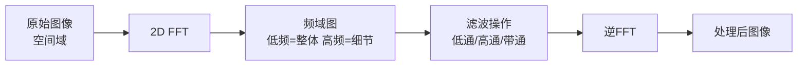
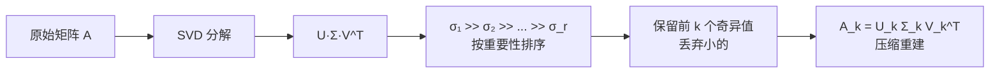

# FFT 与 SVD — 两大矩阵分解方法对比

## 核心问题

对同一张图像（或同一个矩阵），FFT 和 SVD 都能做分解，但它们选择不同的"坐标系"来重新表达数据——**一个用固定基，一个用自适应基**。

## 一、二维 FFT：固定基分解

### 分解形式

对 $m \times n$ 的图像矩阵 $\mathbf{A}$，2D FFT 将其分解为固定的 sin/cos 基函数的叠加：

$$\mathbf{A}(x, y) = \sum_{u=0}^{M-1}\sum_{v=0}^{N-1} \mathbf{F}(u, v)\, e^{j2\pi(ux/M + vy/N)}$$

其中 $\mathbf{F}(u, v)$ 是频域系数，表示频率 $(u, v)$ 分量的强度。

**关键特征**：基函数 $e^{j2\pi(ux/M + vy/N)}$ 是**预定义的**，不依赖 $\mathbf{A}$ 的内容。不管什么图像，用的都是同一套 sin/cos。

### 频域含义

| 频率分量 | 对应图像特征 | 值大说明 |
|---------|------------|---------|
| $\mathbf{F}(0,0)$（DC分量） | 整体平均亮度 | 图像偏亮或偏暗 |
| 低频区域 | 大面积渐变（天空、肤色） | 图像有明显的整体色调变化 |
| 高频区域 | 边缘、纹理、噪声 | 图像细节丰富/噪点多 |

### 压缩方式：JPEG

JPEG 压缩本质上就是 FFT（实际用的是 DCT，离散余弦变换，FFT 的实数版）：

1. 图像分块 → 8×8 小块
2. 每块做 DCT → 得到 64 个频率系数
3. **量化**：人眼不敏感的高频系数用更大的步长量化 → 很多变为 0
4. 只存非零系数 → 体积大幅缩小

**压缩逻辑**：一刀砍掉人眼不敏感的高频，不管这些高频里有没有重要内容。

### 计算复杂度

$$O(mn \log(mn))$$

FFT 之所以统治图像处理和信号处理，核心优势就是**快**。

## 二、SVD：自适应基分解

### 分解形式

$$\mathbf{A} = \mathbf{U}\Sigma\mathbf{V}^T = \sum_{i=1}^{r} \sigma_i \mathbf{u}_i \mathbf{v}_i^T$$

其中：
- $\mathbf{U} \in \mathbb{R}^{m \times r}$：左奇异向量，行空间的正交基
- $\mathbf{V} \in \mathbb{R}^{n \times r}$：右奇异向量，列空间的正交基
- $\Sigma = \text{diag}(\sigma_1, \sigma_2, \ldots, \sigma_r)$：奇异值，**按重要性从大到小排列**
- $r = \text{rank}(\mathbf{A})$

**关键特征**：$\mathbf{U}$ 和 $\mathbf{V}$ 是**由 $\mathbf{A}$ 本身算出来的**，为这个矩阵量身定制的最优正交基。

### 奇异值的含义

奇异值 $\sigma_i$ 按**递减排列**：$\sigma_1 \geq \sigma_2 \geq \cdots \geq \sigma_r > 0$

- $\sigma_1$：最重要的"模式"（图像中最显著的结构）
- $\sigma_k$（小的）：次要细节
- 前 $k$ 个奇异值包含了矩阵绝大部分信息

### 压缩方式：低秩近似

用前 $k$ 个奇异值重建：

$$\mathbf{A}_k = \sum_{i=1}^{k} \sigma_i \mathbf{u}_i \mathbf{v}_i^T$$

**压缩逻辑**：按奇异值大小排，小的先丢——是"精切"，信息损失最小。

Eckart-Young 定理保证了：$\mathbf{A}_k$ 是秩为 $k$ 的矩阵中与 $\mathbf{A}$ 误差最小的（Frobenius 范数意义下）。

$$\|\mathbf{A} - \mathbf{A}_k\|_F = \sqrt{\sum_{i=k+1}^{r}\sigma_i^2}$$

### 计算复杂度

$$O(mn \cdot \min(m, n))$$

比 FFT 慢很多，尤其对大矩阵。

## 三、核心对比

| | FFT | SVD |
|---|---|---|
| **基函数** | 固定 sin/cos（预定义） | $\mathbf{u}_i, \mathbf{v}_i$（由数据决定） |
| **分解形式** | 频率分量叠加 | 奇异值 × 外积叠加 |
| **压缩思路** | 丢弃高频分量（盲切） | 丢弃小奇异值（精切） |
| **最优性** | 不保证最优压缩 | Eckart-Young：最优低秩近似 |
| **物理意义** | 频域解释清晰 | 奇异值=信息重要性排序 |
| **速度** | $O(n\log n)$（极快） | $O(n^3)$（慢） |
| **适用场景** | 实时处理、标准压缩 | 精准压缩、降维、推荐系统 |

## 四、类比理解

### 用"尺子"类比

- **FFT**：用**固定尺子**量所有东西——不管量桌子还是量房子，都用同一把尺子。好处是尺子随时可用，量得快。坏处是可能不够精准。

- **SVD**：为每个东西**量身定做尺子**——量桌子做一把桌尺，量房子做一把房尺。好处是量得精准。坏处是每次都得先做尺子，费时间。

### 用级数类比（回到微积分两大支柱）

- **FFT ↔ 傅立叶级数**：固定基函数（sin/cos），通用展开
- **SVD ↔ 泰勒级数**的思想：为每个函数找最优展开方式

两者的哲学分歧就是**通用性 vs 精准性**。

## 五、实际选择指南

### 选 FFT 的场景

- **JPEG 压缩**：需要实时处理万张图片，速度优先
- **信号滤波**：音频去噪、通信系统——实时性要求高
- **卷积加速**：大核卷积在频域变成乘法（CNN 里的 FFT 卷积）
- **标准化的场景**：不需要最优压缩，需要快速处理

### 选 SVD 的场景

- **PCA 降维**：找到数据最重要的方向（$\mathbf{U}$ 的前几列就是主成分）
- **推荐系统**：用户-物品矩阵的低秩分解（协同过滤）
- **图像精准压缩**：需要最高压缩比，不在乎计算时间
- **数据去噪**：小奇异值对应噪声，去掉最干净
- **伪逆计算**：$\mathbf{A}^+ = \mathbf{V}\Sigma^{-1}\mathbf{U}^T$，求解最小二乘

## 六、两者结合的可能性

在实际中有时会**组合使用**：

1. **FFT 先预处理**：把图像转到频域，快速去掉明显的高频噪声
2. **SVD 再精压缩**：对频域系数做 SVD，进一步压缩

这种"先粗后精"的策略在遥感图像压缩中有应用。

## 术语表

| 缩写 | 全称 | 中文 |
|------|------|------|
| FFT | Fast Fourier Transform | 快速傅里叶变换 |
| DCT | Discrete Cosine Transform | 离散余弦变换 |
| SVD | Singular Value Decomposition | 奇异值分解 |
| PCA | Principal Component Analysis | 主成分分析 |
| DC | Direct Current Component | 直流分量（频域零频） |
| $\sigma_i$ | Singular Value | 奇异值 |
| $\mathbf{u}_i$ | Left Singular Vector | 左奇异向量 |
| $\mathbf{v}_i$ | Right Singular Vector | 右奇异向量 |
| $r$ | Matrix Rank | 矩阵秩 |

## 相关概念

- [[傅立叶级数与拉普拉斯变换]] — FFT 的数学根基
- [[SVD 奇异值分解详解]] — SVD 深入讲解
- [[特征值与特征向量]] — SVD 和特征分解的关系
- [[正定矩阵 & 半正定矩阵]] — 矩阵性质与分解

## 参考资料

1. Strang, G. *Linear Algebra and Its Applications* — SVD 与 FFT 的统一视角
2. Gonzalez & Woods. *Digital Image Processing* — 图像频域处理
3. Eckart-Young 定理 — SVD 低秩近似的最优性证明