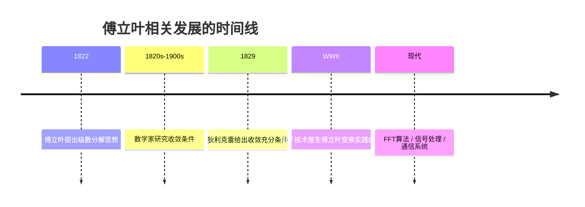
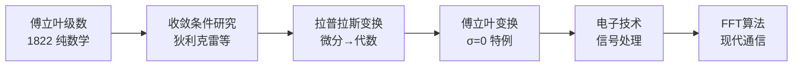

# 傅立叶级数与拉普拉斯变换

## 一、傅立叶级数

### 1.1 历史背景

1822 年，法国数学家、物理学家 **傅立叶**（Jean-Baptiste Joseph Fourier）在《热的分析》（*Théorie analytique de la chaleur*）一书中提出：**函数可以被分解为正弦函数的叠加**。

这个发现虽然不加限制条件的表述是错误的，但不影响其伟大。傅立叶级数从此成为微积分中与**泰勒级数**并肩的两大发现——几乎所有微积分的发展，都依赖这两个认知：

```
微积分大厦的两大支柱：
├── 泰勒级数：局部逼近（多项式展开）
└── 傅立叶级数：全局分解（正弦叠加）
```

### 1.2 核心思想

任何满足一定条件的周期函数 $f(x)$，都可以表示为正弦和余弦函数的无穷级数：

$$f(x) = \frac{a_0}{2} + \sum_{n=1}^{\infty}\left(a_n \cos nx + b_n \sin nx\right)$$

其中系数由积分确定：

$$a_n = \frac{1}{\pi}\int_{-\pi}^{\pi} f(x)\cos nx\, dx, \quad b_n = \frac{1}{\pi}\int_{-\pi}^{\pi} f(x)\sin nx\, dx$$

**直觉理解**：把一个复杂的波形拆成一系列简单正弦波的叠加——就像把一首乐曲拆成各个频率的纯音。

### 1.3 收敛问题：两个世纪的探索

傅立叶不加条件地声称"任何函数都可以展开"，这是错误的。**傅立叶级数何时收敛**，成为此后近两个世纪数学家研究的基本问题。

- **拉格朗日**（Joseph-Louis Lagrange）：给出了该定理的特殊情况，并暗示方法的通用性，但未深入研究
- **狄利克雷**（Peter Gustav Lejeune Dirichlet）：第一个在某些限制条件下得到满意结果，其工作为今天所知的傅立叶变换奠定了基础

**狄利克雷收敛条件**（充分条件）：

1. $f(x)$ 在一个周期内只有有限个间断点
2. $f(x)$ 在一个周期内只有有限个极值点
3. $f(x)$ 在一个周期内绝对可积：$\int_{-\pi}^{\pi}|f(x)|\, dx < \infty$

满足这些条件时，傅立叶级数在连续点收敛到 $f(x)$，在间断点收敛到左右极限的平均值 $\frac{f(x^+)+f(x^-)}{2}$。

### 1.4 从级数到变换

> **重要历史事实**：1822 年乃至此后很长一段时间，只有傅立叶级数，**没有傅立叶变换**。

"变换"这个动作，需要另外的实践来积累。直到二战时期，变换的实践才达到可用和成熟——**战争催发了电子技术的发展**，电子技术极度依赖傅立叶级数和用它实现的积分变换，以至于电子专业必修这里的数学。



---

## 二、拉普拉斯变换

### 2.1 定义

**拉普拉斯变换**是一种积分变换，将实变量 $t$（通常是时间）的函数变换到复变量 $s$（复频率）的函数：

$$\mathcal{L}\{f(t)\} = F(s) = \int_0^{\infty} f(t)\, e^{-st}\, dt$$

其中 $s = \sigma + j\omega$ 是复频率。

### 2.2 核心作用

拉普拉斯变换在科学和工程中有广泛应用，因为它改变了微分方程的"游戏规则"：

| 原域（时域） | 变换域（s域） |
|------------|-----------|
| 微分方程 | **代数方程** |
| 卷积 $f * g$ | **乘法** $F(s) \cdot G(s)$ |

$$\mathcal{L}\{f'(t)\} = sF(s) - f(0)$$

$$\mathcal{L}\{f * g\} = F(s) \cdot G(s)$$

**直觉**：微分变成乘以 $s$，积分变成除以 $s$——求解微分方程就像解代数方程一样简单。

### 2.3 与傅立叶变换的关系

当把傅立叶级数放入拉普拉斯变换的框架中，它在物理——尤其是电子技术中得到了良好应用。**傅立叶变换本质上就是拉普拉斯变换的简化版**：

$$\text{傅立叶变换} = \text{拉普拉斯变换在 } \sigma = 0 \text{ 时的特例}$$

$$\mathcal{F}\{f(t)\} = \int_{-\infty}^{\infty} f(t)\, e^{-j\omega t}\, dt = \mathcal{L}\{f(t)\}\big|_{s=j\omega}$$

```mermaid
flowchart TD
    A[拉普拉斯变换 F(s)] --> B["s = σ + jω<br/>双边复频率"]
    C["σ = 0 特例"] --> D[傅立叶变换 F(ω)]
    B --> C
    E[傅立叶级数<br/>周期函数 → 频域离散] --> F[傅立叶变换<br/>非周期函数 → 频域连续]
```

### 2.4 常用变换表

对大部分常用函数的拉氏变换可以通过查表得到：

| $f(t)$ | $F(s) = \mathcal{L}\{f(t)\}$ |
|---------|-------------------------------|
| $1$ | $\frac{1}{s}$ |
| $e^{at}$ | $\frac{1}{s-a}$ |
| $\sin \omega t$ | $\frac{\omega}{s^2+\omega^2}$ |
| $\cos \omega t$ | $\frac{s}{s^2+\omega^2}$ |
| $t^n$ | $\frac{n!}{s^{n+1}}$ |
| $e^{at}\sin \omega t$ | $\frac{\omega}{(s-a)^2+\omega^2}$ |
| $e^{at}\cos \omega t$ | $\frac{s-a}{(s-a)^2+\omega^2}$ |

---

## 三、级数 → 变换 → 工程应用的逻辑链



**从纯数学到工程实践的完整路径**：
1. 傅立叶提出级数分解（数学发现）
2. 数学家确定收敛条件（数学严谨化）
3. 拉普拉斯变换将微分方程化为代数方程（数学工具化）
4. 傅立叶变换作为拉氏变换特例（物理简化）
5. 电子技术需要频域分析（工程需求驱动）
6. FFT 等算法让变换实时可用（计算实现）

---

## 术语表

| 缩写 | 全称 | 中文 |
|------|------|------|
| $\mathcal{L}$ | Laplace Transform | 拉普拉斯变换 |
| $\mathcal{F}$ | Fourier Transform | 傅立叶变换 |
| FFT | Fast Fourier Transform | 快速傅立叶变换 |
| $s$ | Complex Frequency | 复频率 ($s = \sigma + j\omega$) |
| $\omega$ | Angular Frequency | 角频率 |
| $\sigma$ | Damping Factor | 衰减因子 |

---

## 相关概念

- [[傅里叶变换]] — 频域分析核心工具
- [[泰勒级数]] — 局部逼近的另一个支柱
- [[行列式]] — 线性代数基础
- [[特征值与特征向量]] — 与频域分析相关

---

## 参考资料

1. Fourier, J.B.J. *Théorie analytique de la chaleur* (1822)
2. Dirichlet, P.G.L. "Sur la convergence des séries trigonométriques" (1829)
3. Lagrange, J.L. — 早期特殊情形的研究