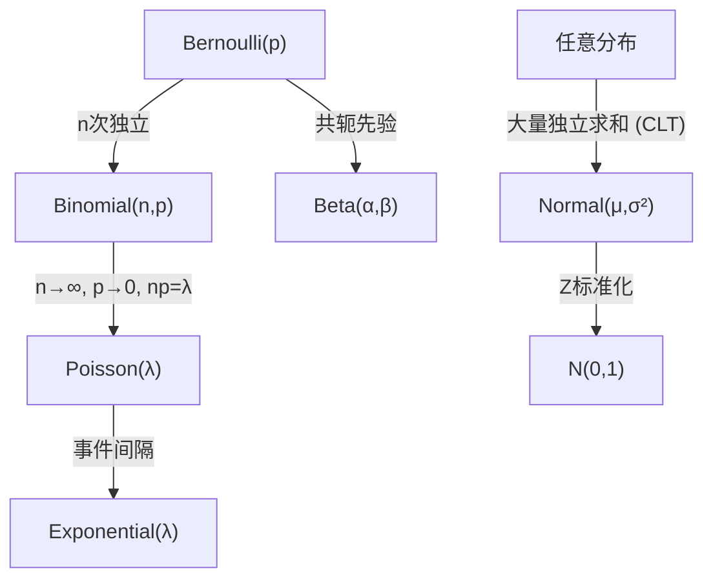

# 常见概率分布与统计推断

> 面试核心：能画出每种分布的大致形状，说出期望/方差，解释适用场景

---

## 一、离散分布

### 1. 伯努利分布 $Bern(p)$

最简单的分布——一次实验只有两个结果。

$$P(X = 1) = p, \quad P(X = 0) = 1-p$$

- $E[X] = p$
- $\text{Var}(X) = p(1-p)$
- 直觉：抛硬币、点击广告、是否患病

### 2. 二项分布 $Bin(n, p)$

$n$ 次独立伯努利实验中成功的次数。

$$P(X = k) = \binom{n}{k} p^k (1-p)^{n-k}$$

- $E[X] = np$
- $\text{Var}(X) = np(1-p)$
- 直觉：100次广告曝光，有多少人点击？
- 与伯努利的关系：$Bin(1, p) = Bern(p)$

### 3. 泊松分布 $Pois(\lambda)$

单位时间/空间内稀有事件发生的次数。

$$P(X = k) = \frac{\lambda^k e^{-\lambda}}{k!}$$

- $E[X] = \lambda$, $\text{Var}(X) = \lambda$（期望 = 方差，这是泊松的特征！）
- 直觉：一小时客服电话数、一天服务器崩溃数
- **泊松极限定理**：当 $n \to \infty, p \to 0, np = \lambda$ 时，$Bin(n, p) \to Pois(\lambda)$

### 4. 几何分布 $Geom(p)$

第一次成功前失败的次数。

$$P(X = k) = (1-p)^k \cdot p$$

- $E[X] = \frac{1-p}{p}$
- 直觉：第几次抽奖才中奖？无记忆性

---

## 二、连续分布

### 1. 正态（高斯）分布 $N(\mu, \sigma^2)$ — 面试最高频

$$f(x) = \frac{1}{\sigma\sqrt{2\pi}} \exp\left(-\frac{(x - \mu)^2}{2\sigma^2}\right)$$

- $E[X] = \mu$, $\text{Var}(X) = \sigma^2$
- **68-95-99.7 规则**：
  - $\mu \pm 1\sigma$ 覆盖 ~68.3%
  - $\mu \pm 2\sigma$ 覆盖 ~95.4%
  - $\mu \pm 3\sigma$ 覆盖 ~99.7%
- **为什么这么重要**：[[中心极限定理（CLT）& 蒙特卡罗方法|CLT]] 保证大量独立变量之和趋向正态
- 标准正态：$Z = \frac{X - \mu}{\sigma} \sim N(0, 1)$

### 2. 指数分布 $Exp(\lambda)$

两次泊松事件之间的等待时间。

$$f(x) = \lambda e^{-\lambda x}, \quad x \ge 0$$

- $E[X] = \frac{1}{\lambda}$, $\text{Var}(X) = \frac{1}{\lambda^2}$
- 直觉：下一辆公交车多久来？具有**无记忆性**：$P(X > s+t \mid X > s) = P(X > t)$
- 与泊松的关系：泊松看"次数"，指数看"间隔"，两者互为正反面

### 3. 均匀分布 $U(a, b)$

$$f(x) = \frac{1}{b-a}, \quad a \le x \le b$$

- $E[X] = \frac{a+b}{2}$, $\text{Var}(X) = \frac{(b-a)^2}{12}$
- 直觉：完全随机选择，贝叶斯中常作"无信息先验"

### 4. Beta 分布 $Beta(\alpha, \beta)$

$$f(x) = \frac{x^{\alpha-1}(1-x)^{\beta-1}}{B(\alpha, \beta)}$$

- 定义域 $[0, 1]$，天然适合建模概率
- 直觉：先验分布专用 — "我觉得成功率大概在 60% 左右"
- $\alpha > \beta$ 峰偏右，$\alpha < \beta$ 偏左，$\alpha = \beta = 1$ 就是均匀分布
- 与伯努利的关系：伯努利的自然共轭先验

---

## 三、分布之间的转换关系图

---

## 四、统计推断核心概念

### 1. 期望与方差

$$E[X] = \sum_x x \cdot P(x) \quad\text{（离散）} \qquad E[X] = \int x \cdot f(x) dx \quad\text{（连续）}$$

$$\text{Var}(X) = E[(X - \mu)^2] = E[X^2] - (E[X])^2$$

> **面试技巧**：方差公式 $\text{Var}(X) = E[X^2] - \mu^2$ 比直接算 $(X-\mu)^2$ 的期望更方便。

### 2. 协方差与相关系数

$$\text{Cov}(X, Y) = E[(X - \mu_X)(Y - \mu_Y)] = E[XY] - \mu_X \mu_Y$$

$$\rho = \frac{\text{Cov}(X,Y)}{\sigma_X \sigma_Y}$$

- $\rho \in [-1, 1]$，衡量线性相关程度
- $\rho = 0$ 只说明**线性无关**，不代表独立！

### 3. 置信区间

对于 $X \sim N(\mu, \sigma^2)$，样本均值 $\bar{X}$ 的 95% 置信区间：

$$\bar{X} \pm 1.96 \cdot \frac{\sigma}{\sqrt{n}}$$

- 直觉：如果重复抽样 100 次，约 95 次区间会包含真实 $\mu$
- **面试常见误解**：不是说"μ 有 95% 概率落在这个区间"——μ 是固定的，区间是随机的

### 4. 大数定律 vs CLT

| | 大数定律 | [[中心极限定理（CLT）& 蒙特卡罗方法|中心极限定理]] |
|---|---|---|
| **说了什么** | $\bar{X}_n \to \mu$（收敛到真值） | $\bar{X}_n$ 的**分布**趋向正态 |
| **关注点** | 估计的准确性 | 估计的分布形状 |
| **用途** | 保证蒙特卡罗收敛 | 构造置信区间 |

---

## 五、面试速查表

| 分布 | 期望 | 方差 | 一句话直觉 |
|---|---|---|---|
| $Bern(p)$ | $p$ | $p(1-p)$ | 单次成功/失败 |
| $Bin(n,p)$ | $np$ | $np(1-p)$ | n次伯努利 |
| $Pois(\lambda)$ | $\lambda$ | $\lambda$ | 单位时间事件数 |
| $Geom(p)$ | $(1-p)/p$ | $(1-p)/p^2$ | 首次成功前失败数 |
| $N(\mu,\sigma^2)$ | $\mu$ | $\sigma^2$ | 万物趋向的分布 |
| $Exp(\lambda)$ | $1/\lambda$ | $1/\lambda^2$ | 泊松事件间隔 |
| $U(a,b)$ | $(a+b)/2$ | $(b-a)^2/12$ | 完全随机 |
| $Beta(\alpha,\beta)$ | $\alpha/(\alpha+\beta)$ | — | 概率的概率 |

---

## 六、手推 Checklist

- [ ] 伯努利 → 二项分布的推导（组合数展开）
- [ ] 二项分布 → 泊松分布的极限推导（泊松极限定理）
- [ ] 正态分布 PDF 手写 + 解释为什么指数里有 $(x-\mu)^2$
- [ ] Var(X) = E[X²] - μ² 的推导（从定义出发）
- [ ] Cov → 相关系数的公式，说明 ρ=0 ≠ 独立（举反例）
- [ ] 95% 置信区间公式推导 + 纠正常见误解