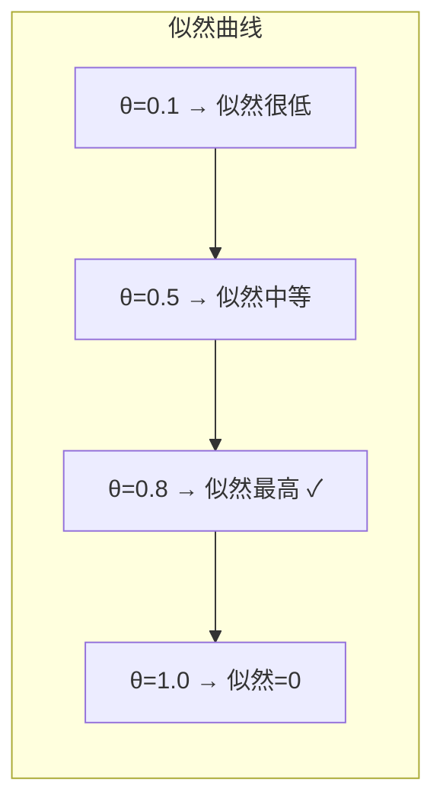
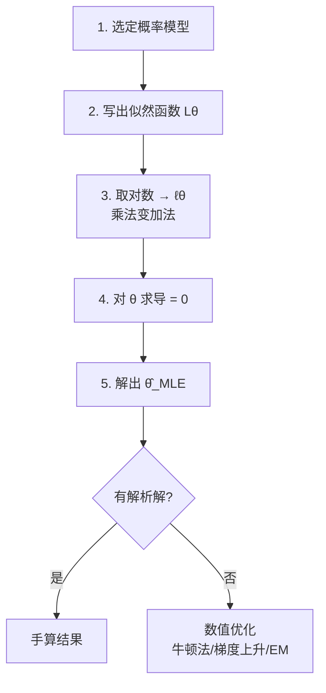

# 最大似然估计 MLE 详解

> 统计推断的灵魂：用观测数据反推最可能生成它们的参数

---

## 一、为什么 MLE 如此重要

MLE 由 20 世纪统计学奠基人 **费舍尔**（R.A. Fisher）提出，构成了今天几乎所有统计模型的核心：

- 线性回归 → MLE（高斯噪声下等价于最小二乘）
- 逻辑回归 → 最大化对数似然
- 神经网络的交叉熵损失 → MLE 的等价形式
- GMM → EM 算法本质在最大化似然

从回归分析到深度学习，底层逻辑都指向同一个思想：**找到最能够解释观测数据的参数**。

---

## 二、参数与模型的关系

所有统计模型都有参数——它们是模型的"旋钮"，决定模型的具体形状：

| 模型 | 参数 | 旋钮的作用 |
|------|------|-----------|
| 线性回归 | 斜率 $\beta$、截距 $\alpha$ | 控制 $Y$ 随 $X$ 变化的趋势 |
| 逻辑回归 | 权重向量 $\mathbf{w}$ | 控制曲线弯曲程度，决定"是/否"边界 |
| 生存分析 | 风险系数 $\gamma$ | 每个因子对寿命的影响强度 |

旋钮扭得越精准，模型与现实数据越贴合。本质都是在做同一件事：**在一堆可能的参数中，找到最能让模型解释现实的参数**。

> 真值就像"上帝开发世界时写好的设定值"，我们无法直接看到，只能通过样本反推。

---

## 三、MLE 的核心思想

**通过观测到的数据，寻找最有可能生成这些数据的参数值。**

比喻：你吃到一块味道独特的饼干，但不知道原配方。你试着用不同甜度烤饼干来还原味道，当甜度参数 = 0.8 时最接近原味——于是原配方甜度大概是 0.8，它的**似然最高**。

---

## 四、概率与似然：一个思维翻转

| | 概率论 | 似然 |
|---|---|---|
| **已知** | 参数 $\theta$ | 数据 $X$ |
| **未知** | 数据 $X$ | 参数 $\theta$ |
| **问的是** | 给定 $\theta$，数据出现的概率？ | 给定数据，哪组 $\theta$ 最可能产生它们？ |
| **函数** | $f(x \mid \theta)$ — 概率分布 | $L(\theta \mid x)$ — 似然函数 |

**关键区别**：概率密度 $f(x \mid \theta)$ 对 $x$ 积分为 1；似然函数 $L(\theta \mid x)$ 对 $\theta$ **不需要积分为 1**，严格来说不是概率密度。

参见 → [[似然函数（Likelihood Function）]]

---

## 五、似然函数的构建

### 独立样本的联合似然

每个观测值在参数 $\theta$ 下有自己出现的概率，整个数据集同时出现的概率是乘积：

$$L(\theta \mid x_1, \dots, x_n) = \prod_{i=1}^{n} f(x_i \mid \theta)$$

**直觉**：每个样本都在为参数 $\theta$ "投票"。如果 $\theta$ 让所有样本都觉得合理，乘积变大；反之迅速变小。

### 选择概率模型

计算似然需先选一个分布：

| 问题 | 分布选择 |
|------|---------|
| 抛硬币 | 伯努利分布 $Bern(p)$ |
| 测量误差 | 正态分布 $N(\mu, \sigma^2)$ |
| 事件发生时间 | 指数分布 $Exp(\lambda)$ |

---

## 六、实例：抛硬币的 MLE

抛一枚硬币 10 次，出现 8 次正面、2 次反面。估计正面概率 $p$。

### 1. 写出似然函数

每次抛硬币是独立伯努利实验，似然函数：

$$L(p) = p^8 (1-p)^2$$

### 2. 取对数似然

$$\ell(p) = 8 \ln p + 2 \ln(1-p)$$

### 3. 求导置零

$$\frac{d\ell}{dp} = \frac{8}{p} - \frac{2}{1-p} = 0$$

$$8(1-p) = 2p \implies \hat{p} = \frac{8}{10} = 0.8$$

> 当 $\theta = 0.8$ 时，抛出 8 正 2 反的概率最大——这就是 MLE 的结果。

---

## 七、MLE 计算步骤（通用）

对数似然的关键性质：

- **单调递增**：$\log$ 不改变最大值位置，$\arg\max_\theta L(\theta) = \arg\max_\theta \ell(\theta)$
- **乘法变加法**：便于求导，避免数值下溢

---

## 八、MLE 的三大优良性质

| 性质 | 含义 | 意义 |
|------|------|------|
| **一致性** | 样本量 → ∞ 时，$\hat{\theta}_{MLE} \to \theta_{真值}$ | 数据越多越接近真相 |
| **渐近正态性** | 大样本下，$\hat{\theta}_{MLE} \sim N(\theta_{真值}, \frac{1}{nI(\theta)})$ | 可直接用正态分布做推断 |
| **有效性** | 达到 Cramér-Rao 下界 $Var(\hat{\theta}) \geq \frac{1}{nI(\theta)}$ | 所有无偏估计中方差最小 |

其中 $I(\theta)$ 是 **费雪信息量**（Fisher Information），衡量数据携带了多少关于 $\theta$ 的信息。

> MLE 在大样本时，以最小方差、最高效率逼近真值——统计估计的黄金标准。

---

## 九、MLE 的局限性

| 局限 | 说明 | 对策 |
|------|------|------|
| **小样本不稳定** | 样本少 → 估计方差大，似然结果波动 | 增加数据；考虑 MAP 加入先验 |
| **局部最优** | 复杂模型（神经网络、混合模型）似然有多个极值 | 多次初始化、随机优化 |
| **依赖模型假设** | 分布假设错了 → 参数估计也错 | 检验分布假设；考虑半参数/非参数方法 |

---

## 十、MLE 与其他估计方法的关系

参见 → [[概率基础与贝叶斯定理]]

$$\hat{\theta}_{MLE} = \arg\max_\theta P(X \mid \theta)$$

$$\hat{\theta}_{MAP} = \arg\max_\theta P(\theta \mid X) = \arg\max_\theta P(X \mid \theta) \cdot P(\theta)$$

**当先验 $P(\theta)$ 为均匀分布时，MAP = MLE**——先验退化为常数，后验完全由似然决定。

| | MLE | MAP |
|---|---|---|
| 思路 | 只用数据说话 | 数据 + 先验信念 |
| 适用 | 数据量大、先验不明 | 数据量小、有领域知识 |

---

## 十一、深度学习中的 MLE

最小化损失函数 = 最大化似然函数：

| 模型 | 损失函数 | 等价 MLE |
|------|---------|---------|
| 线性回归（高斯噪声） | MSE | $\arg\max_\theta$ 高斯似然 |
| 逻辑回归 | 交叉熵 | $\arg\max_\theta$ 伯努利对数似然 |
| Softmax 分类 | 交叉熵 | $\arg\max_\theta$ 多项分布对数似然 |

参见 → [[Logits 详解]]

---

## 手推 Checklist

- [ ] 抛硬币 MLE：写出似然 → 取对数 → 求导 → 解出 $\hat{p}$
- [ ] 正态分布 MLE：推导 $\hat{\mu} = \bar{x}$，$\hat{\sigma}^2 = \frac{1}{n}\sum(x_i - \bar{x})^2$
- [ ] MLE → MAP 关系：说明 MAP = MLE 的条件（均匀先验）
- [ ] 三大性质：一致性 / 渐近正态性 / 有效性的直觉解释