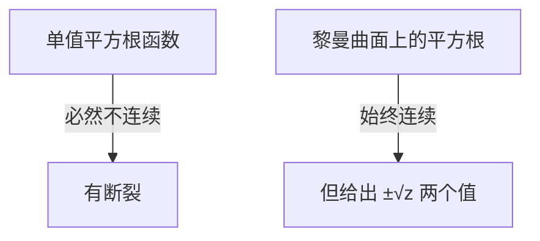
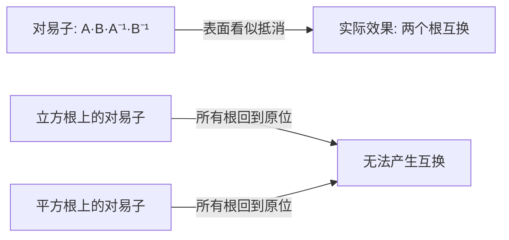
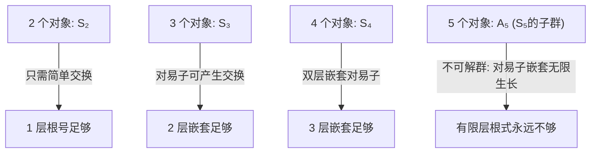
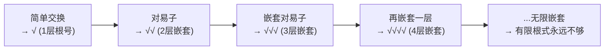

# 为什么五次方程没有求根公式：从置换群到 Abel-Ruffini 定理

> 视频来源：YouTube — 关于 Galois 理论与 Abel-Ruffini 定理的可视化讲解
> 核心思想：方程的根能否用根式表达，取决于根的置换群能否被有限层嵌套的交换子结构所覆盖。五次方程的置换群 $A_5$ 太复杂，任何有限层根式嵌套都无法表达其置换结构。

---
title: 为什么五次方程没有求根公式
type: concept
created: 2026-05-04
updated: 2026-05-04
sources: [YouTube Galois 理论可视化视频]
tags: [伽罗瓦理论, Abel-Ruffini, 置换群, 根式求解, 黎曼曲面, 对易子, 多项式]
---

## 一、问题的起点：系数与根的不对称性

### 1.1 系数有序，根无序

一次方程 $Ax + B = 0$ 简单明了。但当多项式次数升高，一个根本性的**不对称性**浮现：

- **系数**是按特定顺序排列的一组数，交换 $B$ 和 $C$ 的位置 → 函数完全改变
- **根**之间没有自然的先后之分，因式分解形式中可以任意交换因式顺序，乘法不在乎先后

> 系数是有区别的（有序），而根缺乏类似的区分性（无序）。

### 1.2 不存在连续的"选根函数"

这种不对称性导致一个违背直觉的结果：**不存在连续函数可以根据系数来选定某一个特定的根**。

证明思路（反证法）：

1. 假设存在连续函数 $f(a,b,c)$，输入系数，输出一个指定的根
2. 我们可以交换两个根的位置，系数却回到原来的排列
3. 此时 $f$ 应该输出和最初相同的根
4. 但实际上 $f$ 会给出另一个根 → **矛盾**

因此这样的连续函数不可能存在。

### 1.3 这一结论的深远含义

仅靠基本运算（加减乘除），甚至加上所有常见的单值连续函数（sin, cos, exp 等），都无法锁定某一个根。

**若要保持连续性，就必须让两个根一同存在。** 这才是数学的本质规律。

---

## 二、平方根与黎曼曲面

### 2.1 平方根不是单值函数

"4 的平方根是 2"——这只是约定。数学上 $x^2 = 4$ 有两个解：$2$ 和 $-2$。

平方根函数本质上不是唯一的，而是**一整组根据选择不同而变化的函数**。无论怎么选择符号，它的图像都会出现断裂。

### 2.2 虚数单位的对称性

当方程系数为实数时，根总呈现上下对称（共轭）结构。因此定义 $i$ 的同时必须包含 $-i$——它们在代数上毫无差别，谁是 $\sqrt{-1}$ 只是符号选择。

### 2.3 黎曼曲面：让不连续变连续

在复平面上以立体方式呈现平方根函数，不连续区域变为一个**双层曲面**，改变符号选择时，曲面会平滑延展并自我对接。

这就是**黎曼曲面**的核心：将函数提升到一个更高维的几何对象上，使它变得连续，代价是函数不再单值。

> 核心洞察：**单值 → 不连续，连续 → 多值**，这是平方根（也是所有根式函数）的根本特性。

---

## 三、平方根为什么能求解二次方程

### 3.1 根的置换 vs 根式的分支

二次方程有 2 个根，可以互换位置。平方根有 2 个分支，输入值绕关键点一圈 → 两个输出互换位置。

**平方根的分支行为与二次方程根的置换行为完全一致** → 平方根是构建二次求根公式的关键环节。

---

## 四、三次方程：为什么立方根还不够

### 4.1 立方根有三层分支

三次方程有 3 个根，立方根的黎曼曲面有 3 层，可以让三个根依序轮转——看起来很有希望。

### 4.2 交换 vs 轮转：关键差异

三次方程的 3 个根之间，可以**交换任意两个**。但立方根只能实现三个根的**整体循环轮转**，不能独立交换其中任意两个。

### 4.3 对易子（Commutator）

**对易子**是一种精巧的四步循环操作：

$$[A, B] = A \cdot B \cdot A^{-1} \cdot B^{-1}$$

执行过程：先做 $A$，再做 $B$，然后撤销 $A$（做 $A^{-1}$），再撤销 $B$（做 $B^{-1}$）。

表面上所有步骤都被抵消，但实际上**两个根已经完成了位置互换**。

**对易子在平方根和立方根上都无法产生净效果**——因为绕原点才有循环，对易子的路径不绕原点，一切归零。

### 4.4 关键技巧：嵌套根式 + 关键点错位

解决方法是：**将平方根的输出作为立方根的输入，并使两个关键点在空间上错位**。

这样，对易子操作中，一步 → 绕第一个关键点旋转，下一步 → 绕第二个关键点旋转。撤销步骤无法完全抵消，留下了一次完整的轮转。

> 这正是三次方程求根公式（Cardano 公式）中嵌套根式的巧妙设计。

---

## 五、四次方程：双层嵌套对易子

四次方程的 4 个根之间存在**嵌套交换操作**：

- 第一层交换
- 第二层交换（嵌套在第一层内）
- 第一道"枷锁"由此解开，第二道也随之瓦解

这种**嵌套交换子**能把根的排列彻底打乱，就像单一交换子足以扰动三次方程的根一样。

要表达这种结构，需要在链条中再引入一个新的根式，形成**三层嵌套**：

| 多项式次数 | 根数 | 嵌套对易子层级 | 根式嵌套层级 |
|---|---|---|---|
| 二次 | 2 | 0（简单交换即可） | 1 层根号 |
| 三次 | 3 | 1 层对易子 | 2 层根号嵌套 |
| 四次 | 4 | 2 层嵌套对易子 | 3 层根号嵌套 |

规律：**每增加一层嵌套，就能承载更高一级的交换运算。**

---

## 六、五次方程：为什么根式永远不够

### 6.1 五个根的置换能力

当对象数量达到 5，局面发生根本变化。我们可以构造：

- 循环 $A$：涉及 3 个根的循环变换
- 循环 $B$：涉及另外 3 个根的循环变换（与 $A$ 只在中心交叠）

### 6.2 双层嵌套对易子产生循环本身

构造双层嵌套对易子：

$$[[A, B], [A^{-1}, B^{-1}]] = [A, B] \cdot [A^{-1}, B^{-1}] \cdot [A,B]^{-1} \cdot [A^{-1},B^{-1}]^{-1}$$

结果：**只保留了 $A$（或 $B$）的效果本身**！

这意味着我们可以继续嵌套下去：构造 4 层、6 层、8 层乃至任意深度的对易子结构，它们**依然能保持错位的性质**。

### 6.3 根式嵌套的有限天花板

每当嵌套层级增加一次，求根公式就必须多引入一层根式。但五次方程不仅需要第 3 层交换结构，还涉及第 4 层、第 5 层……乃至更高层级的复合交换方式。

**有限层级的根式嵌套永远无法触及这种复杂度。**

无论引入多少层平方根、立方根或其他有限形式的根式组合，总会有某些由 5 个根构成的交换结构**无法被表达**。

### 6.4 5 个对象的置换群 $S_5$ 的本质

关键数学事实：$A_5$（5 个对象的交错群）是**不可解群**——它的对易子序列不会收敛到平凡群，而是无限循环生长。这正是 Abel-Ruffini 定理的核心。

---

## 七、Abel-Ruffini 定理

> **五次及更高次数的多项式，不存在适用于所有情况的代数求根公式。**

这不是说五次方程没有解，而是说**解不能用有限层根式嵌套来表达**。

| 次数 | 根式可解？ | 原因 |
|---|---|---|
| 1, 2, 3, 4 | 可解 | 置换群是可解群，对易子序列有限步收敛 |
| 5 及以上 | 不可解 | $A_n$ ($n \geq 5$) 不可解，对易子嵌套无限生长 |

---

## 八、总结：根式求解的阶梯

根式求解的本质是**用根式的分支行为去模拟根的置换行为**。二次、三次、四次方程的置换群足够"简单"，有限层嵌套就能覆盖其所有交换结构。五次方程的置换群 $A_5$ 太复杂——对易子嵌套可以无限生长，有限层根式永远追不上。

---

## 关联笔记

- [[欧拉公式与初等群论]] — 群论基础：群、同态、对称性
- [[中国剩余定理与剩余坐标系]] — 数论中的结构性问题