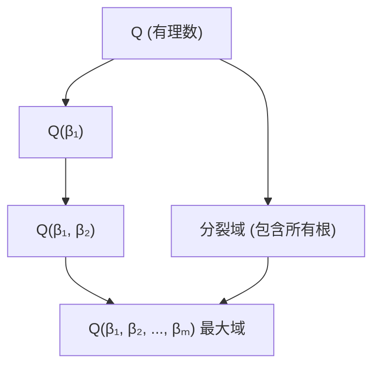
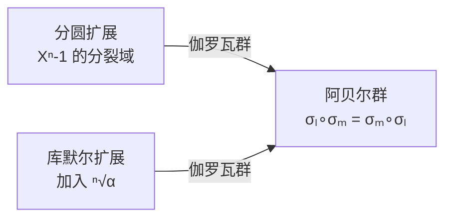
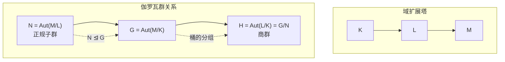
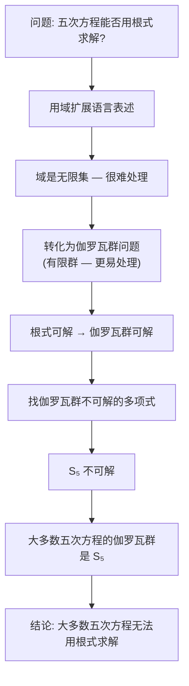

# 伽罗瓦理论：为什么五次方程无法用根式表达

> 视频来源：YouTube — Galois Theory: 从域扩展、自同构到 Abel-Ruffini 定理的完整推导
> 核心思想：方程能否用根式求解，取决于其伽罗瓦群是否可解。五次方程的伽罗瓦群通常是 $S_5$——一个不可解群，因此大多数五次方程无法用根式表达。

---
title: 伽罗瓦理论为什么五次方程无法用根式表达
type: concept
created: 2026-05-04
updated: 2026-05-04
sources: [YouTube Galois Theory 视频]
tags: [伽罗瓦理论, Abel-Ruffini, 域扩展, 自同构, 可解群, S₅, 分裂域, 正规子群]
---

## 一、域与域扩展

### 1.1 域的定义

**域** (Field) 是一个数的集合，其中可以进行加减乘除运算，结果仍然属于该集合（除以零除外）。

- 有理数集合 $\mathbb{Q}$ 构成一个域：任意两个有理数的加减乘除结果仍是有理数
- 实数 $\mathbb{R}$、复数 $\mathbb{C}$ 也都是域

### 1.2 根式扩展

域本身不支持开 $n$ 次方运算。但我们可以对域进行**扩展**。

例子：$\sqrt{2}$ 不是有理数，不属于 $\mathbb{Q}$。将它加入 $\mathbb{Q}$ 后，为使集合仍是域，需要加入所有形如 $a + b\sqrt{2}$ 的数（$a, b \in \mathbb{Q}$）。这个新域记作 $\mathbb{Q}(\sqrt{2})$——包含 $\mathbb{Q}$ 和 $\sqrt{2}$ 的最小域。

> 可以验证：两个 $a + b\sqrt{2}$ 形式的数相除，结果仍具有此形式。

同理可加入 $\sqrt[5]{23}$，再加入 $\sqrt[3]{1 + 2\sqrt[5]{23}}$……只要每次加入的是此前已存在数的 $n$ 次方根即可。这种扩展称为**根式扩展** (Radical Extension)。

### 1.3 根式求解 = 构造根式扩展塔

如果方程的根能用根式表示，那么即使根式很复杂，我们仍然可以依次加入平方根、立方根等，使整个表达式包含在某个最大的域中。

因此：**方程可根式求解 $\Longleftrightarrow$ 能构造一个根式扩展塔，其顶端域包含所有根**。

---

## 二、分裂域：问题的系统化表述

### 2.1 分裂域的定义

与其说塔包含多项式 $f$ 的所有根，不如构造另一个域——将 $f$ 的所有根都加入 $\mathbb{Q}$ 中。这个域称为 $f$ 的**分裂域** (Splitting Field)。

分裂域自然包含 $\mathbb{Q}$，且被包含在最大的根式扩展域中，因此形成了额外的扩展塔。

> 这使得问题更系统化：根式可解 $\Longleftrightarrow$ 根式扩展塔的顶端包含分裂域。

---

## 三、自同构：保持结构的映射

### 3.1 定义

**自同构** (Automorphism) $\sigma$：从域 $L$ 到自身的函数，满足：

1. **保持代数关系**：$\sigma(x + y) = \sigma(x) + \sigma(y)$，$\sigma(xy) = \sigma(x)\sigma(y)$ 等
2. **固定较小域 $K$**：若 $x \in K$，则 $\sigma(x) = x$
3. **一一对应**：$\sigma$ 是可逆的

### 3.2 复共轭：最熟悉的例子

从 $\mathbb{R}$ 扩展到 $\mathbb{C}$ 时，**复共轭**就是一个自同构：

- 对实数不起作用（固定 $\mathbb{R}$）
- 保持所有代数关系：$\overline{z_1 + z_2} = \overline{z_1} + \overline{z_2}$，$\overline{z_1 z_2} = \overline{z_1} \cdot \overline{z_2}$
- 是一一对应的（只改变虚部符号，容易逆转）

---

## 四、分裂域中的自同构 = 根的排列

### 4.1 核心论点

当 $L$ 是多项式 $f$ 在 $K$ 上的分裂域时，自同构有一个关键性质：

$$f(\alpha) = 0 \implies f(\sigma(\alpha)) = 0$$

推导：对 $f(\alpha) = 0$ 应用 $\sigma$，利用保持代数关系和固定 $K$ 的性质，得到 $f$ 中 $\alpha$ 变为 $\sigma(\alpha)$，其余不变。因此 $\sigma(\alpha)$ 也是 $f$ 的根。

**自同构将根映射到根——它只是对根进行排列，除此之外没有其他作用。**

### 4.2 为什么自同构完全由根的排列决定

$L$ 中的任何元素都可以用 $K$ 和所有根来表示。既然 $\sigma$ 保持代数关系且固定 $K$，知道 $\sigma$ 对所有根的作用就能推出 $\sigma$ 对 $L$ 中任意元素的作用。

> **自同构 = 根的有效排列**（仅当 $L$ 是分裂域时成立）

---

## 五、伽罗瓦群与伽罗瓦扩展

### 5.1 定义

当 $L$ 是 $f$ 在 $K$ 上的分裂域时，域扩展 $L/K$ 称为**伽罗瓦扩展** (Galois Extension)。

所有自同构的集合 $\text{Aut}(L/K)$ 称为该扩展的**伽罗瓦群** (Galois Group)：

- 两个排列的复合仍是有效排列（群的封闭性）
- 排列的逆排列也是自同构（群的逆元）

---

## 六、两个重要例子

### 6.1 分圆扩展：$X^n - 1$

多项式 $X^n - 1$ 的根均匀分布在单位圆上：$1, \zeta, \zeta^2, \ldots, \zeta^{n-1}$（$\zeta$ 是第一个根）。

分裂域为 $\mathbb{Q}(\zeta)$。自同构将 $\zeta$ 映射到 $\zeta^l$（$l \neq 0$），记为 $\sigma_l$。

关键性质：$\sigma_l \circ \sigma_m = \sigma_{lm}$，且**交换顺序结果不变** $\sigma_l \circ \sigma_m = \sigma_m \circ \sigma_l$。

> **伽罗瓦群是阿贝尔群** (Abelian Group)——交换运算顺序不影响结果。

### 6.2 库默尔扩展：$\alpha$ 的 $n$ 次方根

考虑 $\sqrt[n]{\alpha}$，从包含 $n$ 次单位根 $\zeta$ 的域 $K$ 开始扩展。根为 $\alpha, \alpha\zeta, \alpha\zeta^2, \ldots, \alpha\zeta^{n-1}$。

分裂域为 $K(\alpha)$。自同构 $\sigma_l$ 将 $\alpha$ 映射到 $\alpha\zeta^l$，$\zeta$ 固定不动。

关键性质：$\sigma_l \circ \sigma_m = \sigma_{l+m}$，**同样是阿贝尔群**。

> 注意：自同构已由 $\alpha$ 的映射位置决定，排除了许多排列可能性。伽罗瓦群规模很小——根之间关系密切（只差 $\zeta$ 的幂），可用的自同构不多。

---

## 七、域扩展塔中的伽罗瓦群关系

### 7.1 正规子群

设有域扩展塔 $K \subseteq L \subseteq M$，三者都是伽罗瓦扩展：

- $N = \text{Aut}(M/L)$：固定 $L$ 的自同构
- $G = \text{Aut}(M/K)$：固定 $K$ 的自同构

因为固定 $L$ 隐含固定 $K$，所以 $N \subseteq G$，即 **$N$ 是 $G$ 的子群**。

进一步，由于 $L$ 是 $f$ 在 $K$ 上的分裂域，$G$ 中的自同构会将 $L$ 的元素映射回 $L$。由此可证：对任意 $g \in G, n \in N$：

$$g \circ n \circ g^{-1} \in N$$

这称为**共轭** (Conjugation)，满足此条件的子群称为**正规子群** (Normal Subgroup)，记作 $N \trianglelefteq G$。

### 7.2 商群

$H = \text{Aut}(L/K)$ 可以看作 $G$ 的元素按"在 $L$ 上表现相同"分组——如果 $g_1^{-1} \circ g_2 \in N$，则 $g_1$ 和 $g_2$ 落入同一"桶"。

这种分组构成的群称为**商群** (Quotient Group)，记作 $G/N$。

> 比喻：$L$ 的自同构像不同的桶，$M$ 的自同构像不同的球。球放入桶中——在 $L$ 上表现相同的球进入同一个桶。

---

## 八、根式扩展塔 → 可解群

### 8.1 确保每个扩展既是伽罗瓦扩展又是根式扩展

从 $\mathbb{Q}$ 扩展到 $\mathbb{Q}(\sqrt[3]{2})$ 不是伽罗瓦扩展（只加入了一个根，缺少三次单位根）。解决方案：先加入 $\zeta$（分圆扩展），再加入所有 $\sqrt[3]{2}$ 的根（库默尔扩展）。

这样每个阶段都是伽罗瓦扩展 + 根式扩展，伽罗瓦群都是阿贝尔群。

### 8.2 正规子群链

对主要的根式扩展塔：

$$\mathbb{Q} \subseteq \mathbb{Q}(\zeta) \subseteq \mathbb{Q}(\zeta, \beta_1) \subseteq \cdots \subseteq E_{\max}$$

每一步的伽罗瓦群关系为：

$$\{e\} \trianglelefteq G_k \trianglelefteq G_{k-1} \trianglelefteq \cdots \trianglelefteq G_1 \trianglelefteq G$$

且每个商群 $G_i / G_{i+1}$ 都是**阿贝尔群**（因为每步都是分圆或库默尔扩展）。

### 8.3 可解群的定义

如果存在这样的正规子群链，使得每个商群都是阿贝尔群，则 $G$ 称为**可解群** (Solvable Group)。

**核心结论**：如果方程可根式求解，则其伽罗瓦群必须可解。

> **逆否命题**：如果伽罗瓦群不可解，则方程无法用根式求解。

---

## 九、从可解群到分裂域的伽罗瓦群

扩展塔的另一部分：$\mathbb{Q} \subseteq \text{分裂域} \subseteq E_{\max}$

- $N = \text{Aut}(E_{\max}/\text{分裂域})$ 是 $G = \text{Aut}(E_{\max}/\mathbb{Q})$ 的正规子群
- $H = \text{Aut}(\text{分裂域}/\mathbb{Q}) = G/N$

因为 $G$ 可解，$G/N$ 也可解（正规子群链通过"桶操作"传递到商群）。

> 因此**分裂域的伽罗瓦群也必须是可解的**。

关键：这个伽罗瓦群由五次多项式 $f$ 决定。**目标是找到一个 $f$，使其伽罗瓦群不可解。**

---

## 十、$S_5$ 为什么不可解

### 10.1 五阶对称群 $S_5$

五次多项式的伽罗瓦群包含所有可能对 5 个根的排列，即**五阶对称群 $S_5$**（120 个元素）。

### 10.2 正规子群的约束

正规子群 $N \trianglelefteq G$ 要求：$g \circ n \circ g^{-1} \in N$ 对所有 $g \in G, n \in N$ 成立。

**共轭的直观含义**：$g \circ n \circ g^{-1}$ 与 $n$ 非常相似，只是将 $n$ 中的 $x \mapsto y$ "重命名"为 $g(x) \mapsto g(y)$。

例子：如果 $n$ 是一个五循环（将根依次轮转），$g$ 只是交换两个根，则 $g \circ n \circ g^{-1}$ **仍然是五循环**——只是被 $g$ 重命名了。

> **只要一个五循环进入 $N$，共轭性质迫使所有五循环都进入 $N$。**

再由群的封闭性：两个五循环的复合可能生成三循环 → 三循环也必须进入 $N$ → 所有三循环都进入……连锁反应使得正规子群必须包含大量元素。

### 10.3 可解群的额外约束

可解群还要求每个商群是阿贝尔群，最终最小的群也是阿贝尔群。所有这些限制叠加，使得可解群极为稀少。

> $S_5$ 不是可解群——这些约束太过严格，无法满足。

### 10.4 为什么 $S_4$, $S_3$, $S_2$ 是可解的

较小阶的对称群中，排列数量更少，共轭引入的约束也更少，使得正规子群链更容易构造。

---

## 十一、大多数五次方程的伽罗瓦群是 $S_5$

### 11.1 根之间几乎没有关系

伽罗瓦群是根之间关联程度的度量：

- 库默尔扩展中：根之间关系密切（只差 $\zeta$ 的幂），伽罗瓦群很小（5 个自同构）
- $S_5$ 中：允许所有排列，意味着根之间**几乎没有代数关系**

> 随机选择一个五次多项式，没有理由认为根之间有特殊关系——大多数情况下伽罗瓦群就是 $S_5$。

### 11.2 具体例子

$X^5 - 6X + 3$ 的伽罗瓦群是 $S_5$（证明不容易，但这是最简单的已知例子）。

> "几乎所有"五次多项式的伽罗瓦群都是 $S_5$，因此大多数五次方程不可根式求解。

---

## 十二、全流程总结

核心思路：**将域的无限问题转化为群的有限问题**。

1. 用域扩展语言重新表述"根式求解"
2. 通过伽罗瓦群将域问题转化为有限群问题
3. 根式可解 → 伽罗瓦群可解（正规子群链 + 阿贝尔商群）
4. $S_5$ 不可解 → 存在不可根式求解的五次方程

---

## 关联笔记

- [[为什么五次方程没有求根公式]] — 从置换、对易子、黎曼曲面的直观视角
- [[欧拉公式与初等群论]] — 群论基础：群、同态、对称性