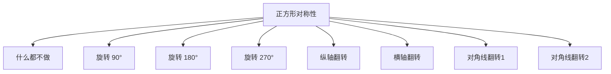
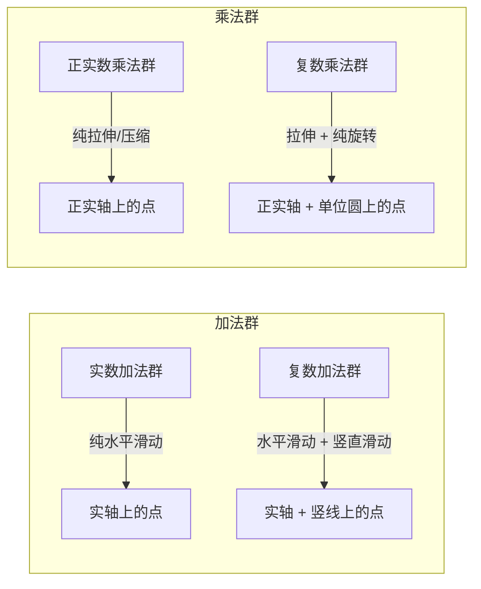
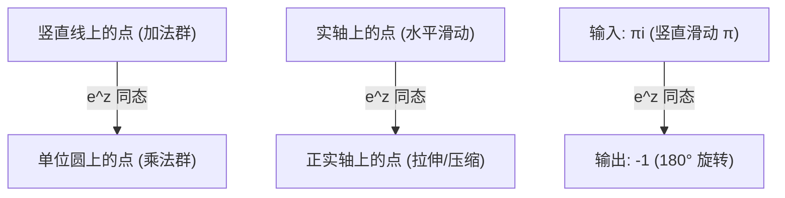

# 欧拉公式与初等群论：从对称性理解 $e^{\pi i} = -1$

> 视频来源：3Blue1Brown · "Euler's formula with group theory" (频道两周年纪念)
> 核心思想：欧拉公式不只是数字之间的巧合联系，而是群论中同态关系的自然结果——指数函数将加法群中的滑动作用映射为乘法群中的旋转作用。

---
title: 欧拉公式与初等群论
type: concept
created: 2026-05-03
updated: 2026-05-03
sources: [3Blue1Brown 视频: Euler's formula with group theory]
tags: [群论, 欧拉公式, 对称性, 同态, 复数, 指数函数]
---

## 前置知识：代数结构的层级

代数结构是"带运算的集合"的统称，根据运算的多少和性质，分为不同等级：

| 代数结构 | 运算数 | 核心要求 | 典型例子 |
|---|---|---|---|
| **群** (Group) | 1 种运算 | 运算可复合、有逆、有单位元 | 对称群 $(\mathbb{R}, +)$ |
| **环** (Ring) | 2 种运算（加法 + 乘法） | 加法成群、乘法满足分配律 | 整数 $\mathbb{Z}$ |
| **域** (Field) | 2 种运算（加法 + 乘法） | 环 + 乘法可除（非零元素有逆） | 有理数 $\mathbb{Q}$、实数 $\mathbb{R}$、复数 $\mathbb{C}$ |

简记：**群 < 环 < 域**，一层比一层要求多，一层比一层更丰富。

本笔记讨论的"实数加法群""复数乘法群"都属于**群**这一最基础层级。

---

## 一、群 = 对称性的集合

### 1.1 对称性是什么

一个几何对象的**对称性**，是指能让该对象"看上去和原来相同"的作用（变换）。例如：

- **正方形**：逆时针旋转 90° 后外观不变 → 这是正方形的一个对称性
- 正方形共有 **8 种对称性**：1 个"什么都不做" + 3 种旋转 (90°, 180°, 270°) + 4 种翻转 → 组成**八阶二面体群** $D_8$

### 1.2 群的定义（直观版）

**群** = 一个对称作用的集合 + 一种运算（作用的复合）

核心性质：取任意两个作用 $A$, $B$，先做 $A$ 再做 $B$，总效果一定等于群中某个单独的作用 $C$：

$$A \circ B = C$$

这组潜在关系——**两个作用与它们复合后形成的单个作用之间的对应**——才是让一组东西成为群的本质。现代数学的很大一部分，都起源于理解这种关系结构。

### 1.3 有限群与无限群

| 群 | 对象 | 作用数 | 特点 |
|---|---|---|---|
| $D_8$（八阶二面体群） | 正方形 | 8 | **有限群** |
| 圆的旋转群 | 圆 | 无限（$0 \sim 2\pi$ 连续） | **无限群**，连续 |

---

## 二、圆的旋转群：作用与点的关联

圆上所有旋转构成一个群。它的特殊之处在于：**每个旋转作用可以与圆上的一个点唯一关联**。

方法：先选定圆上一个标记点（如右边那个点），每种旋转会将标记点带到圆上的唯一位置，而旋转本身也完全由那个位置决定。

> 这不是所有群都能做到的性质，但能做到时非常有用——它提供了一种标记作用的方式。

---

## 三、数字的双重身份：加法群与乘法群

### 3.1 实数加法群（滑动）

考虑数轴沿自身**滑动**的所有方式——将0向左或向右滑动不同距离：

- 与 3 关联的作用 → 向右滑动 3 个单位
- 与 -2 关联的作用 → 向左滑动 2 个单位
- 与 0 关联的作用 → 什么也不做

两个滑动作用相继进行 = 距离相加：

$$\text{滑动 3} \circ \text{滑动 2} = \text{滑动 5} \quad \Longleftrightarrow \quad 3 + 2 = 5$$

这就是**实数加法群** $(\mathbb{R}, +)$。

**要点**：数字不只是计数工具，它们是群的一个实例，加法只是群运算的具体表现。

### 3.2 复数加法群（二维滑动）

拓展到复平面——竖线上的 $i$, $2i$, $3i$ 等对应竖直滑动：

- 与 $3 + 2i$ 关联 → 向右上方滑动，使 0 移到 $3+2i$
- 可以分解：先向右滑 3（实轴），再竖直滑 2（$2i$）

复合规则 = 分量相加：

$$\text{滑}(3+2i) \circ \text{滑}(1-3i) = \text{滑}(4-i) \quad \Longleftrightarrow \quad (3+2i) + (1-3i) = 4-i$$

这就是**复数加法群** $(\mathbb{C}, +)$。

### 3.3 正实数乘法群（拉伸与压缩）

考虑数轴上所有保持均匀分布且 0 不动的**拉伸/压缩**作用：

- 与 3 关联 → 拉伸为 3 倍（1 移到 3）
- 与 $\frac{1}{2}$ 关联 → 压缩为 $\frac{1}{2}$ 倍

两个伸缩作用相继进行 = 伸缩倍数相乘：

$$\text{拉伸 3 倍} \circ \text{拉伸 2 倍} = \text{拉伸 6 倍} \quad \Longleftrightarrow \quad 3 \times 2 = 6$$

这就是**正实数乘法群** $(\mathbb{R}^+, \times)$。

### 3.4 复数乘法群（拉伸 + 旋转）

拓展到复平面——固定 0，拖动 1：

- 与 $i$ 关联 → 90° 旋转（将 1 移到 $i$）
- 连续两次 $i$ 的作用 = 180° 旋转 = 与 $-1$ 关联的作用 → $i \times i = -1$

与 $2+i$ 关联的作用可分解为：先旋转 26.6°，再拉伸 $\sqrt{5}$ 倍。

一般而言，每个复数乘法作用 = **拉伸（正实数作用）+ 纯旋转（单位圆上点的作用）**。

这就是**复数乘法群** $(\mathbb{C}^*, \times)$。

### 3.5 四个群的对比

> **关键类比**：在加法群中，竖直滑动 = 垂直于实轴的加法作用；在乘法群中，纯旋转 = 垂直于实数的拉伸作用。两者互为对偶。

---

## 四、指数函数 = 群之间的同态

### 4.1 从指数运算性质出发

指数的初等定义 $2^3 = 2 \times 2 \times 2$（多次相乘）只对自然数有意义。但分数指数、负指数、复指数的定义都在确保一条性质成立：

$$2^{x+y} = 2^x \cdot 2^y$$

### 4.2 群论视角的解读

这条性质说的是：**输入值相加 → 输出值相乘**。

从群论看：
- 输入 = 加法群中的滑动作用
- 输出 = 乘法群中的伸缩/旋转作用

函数 $2^x$ 将一个群中的作用映射为另一个群中的作用，而且**保持群运算**——输入端复合滑动 = 输出端复合伸缩。

这样的函数叫做**同态**（homomorphism）：从群到群、保持运算结构的映射。

### 4.3 同态的几何意义

指数函数将加法群中的作用映射到乘法群中的作用：

| 加法群作用 | 乘法群作用 |
|---|---|
| 纯水平滑动（实数） | 纯拉伸/压缩（正实数） |
| 纯竖直滑动（$i$ 的倍数） | 纯旋转（单位圆上的点） |

> **核心洞察**：指数函数将"竖直滑动"映射为"纯旋转"——将垂直于实轴的加法作用，映射为垂直于实数拉伸的乘法作用。

---

## 五、为什么底数是 $e$

### 5.1 不同底数的效果

| 底数 | 向上滑动 1 单位 ($i$) → 映射为的旋转弧度 | 沿单位圆走过的距离 |
|---|---|---|
| $2^x$ | ≈ 0.693 弧度 | 0.693 单位 |
| $5^x$ | ≈ 1.609 弧度 | 1.609 单位 |
| $e^x$ | **恰好 1 弧度** | **1 单位** |

### 5.2 $e$ 的特殊之处

以 $e$ 为底时，$e^x$ 将竖直滑动映射为旋转时，**滑动 1 个单位 → 旋转 1 弧度**，比例系数恰好为 1。

这意味着：
- 向上滑动 $\pi$ 个单位（输入 $\pi i$） → 映射为 $\pi$ 弧度的旋转
- $\pi$ 弧度 = 走过半个圆周 = 与 $-1$ 关联的 180° 旋转

$$e^{\pi i} = -1$$

### 5.3 为什么 $e$ 而不是别的底数？

完整答案在微积分：所有指数函数 $a^x$ 都与其自身导数成比例，但**只有 $e^x$ 等于其导数**：

$$\frac{d}{dx} e^x = e^x$$

这使得 $e$ 成为同态中"比例系数恰好为 1"的那个底数。

---

## 六、$e^z$ 的几何全景

将 $e^z$ 看作复平面上的变换：

1. 将整个平面**卷成圆筒**：所有竖直线绕成一个个圆圈
2. 在 0 附近将圆筒**压扁到平面上**：形成呈指数间隔的同心圆

这些同心圆对应于最初的竖直线——每条竖直线上的等距点，在映射后变成同心圆上呈指数间隔的点。

---

## 七、总结：欧拉公式的群论意义

欧拉公式 $e^{\pi i} = -1$ 的深层含义：

> **指数函数是将加法群映射到乘法群的同态**。它将竖直滑动映射为纯旋转。底数 $e$ 恰好使滑动 1 单位 → 旋转 1 弧度。因此竖直滑动 $\pi$ 单位 → $\pi$ 弧度旋转 → 半圆 → 与 $-1$ 关联。

从这个视角看，$-1$ 不是某个神秘数字运算的结果，而是**乘法群中与 180° 旋转对应的那个作用**；$\pi i$ 也不是什么奇怪的指数输入，而是**加法群中竖直滑动 $\pi$ 单位的作用**；$e^x$ 则是将二者精确桥接的那个同态。

---

## 关联笔记

- [[欧拉公式物理意义-弹簧系统视角]] — 从弹簧/拉普拉斯变换理解 $e^{st}$
- [[欧拉公式的物理意义-拉普拉斯变换前奏]] — 拉普拉斯三部曲第一章
- [[抽象向量空间]] — 另一种"跳出具体实例看结构"的思维方式
- [[傅里叶变换——从坐标系到频谱的完整推导]] — 傅里叶变换也是一种群同态