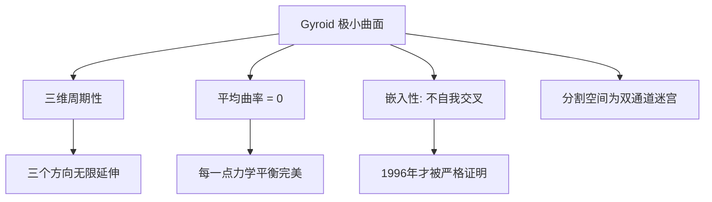
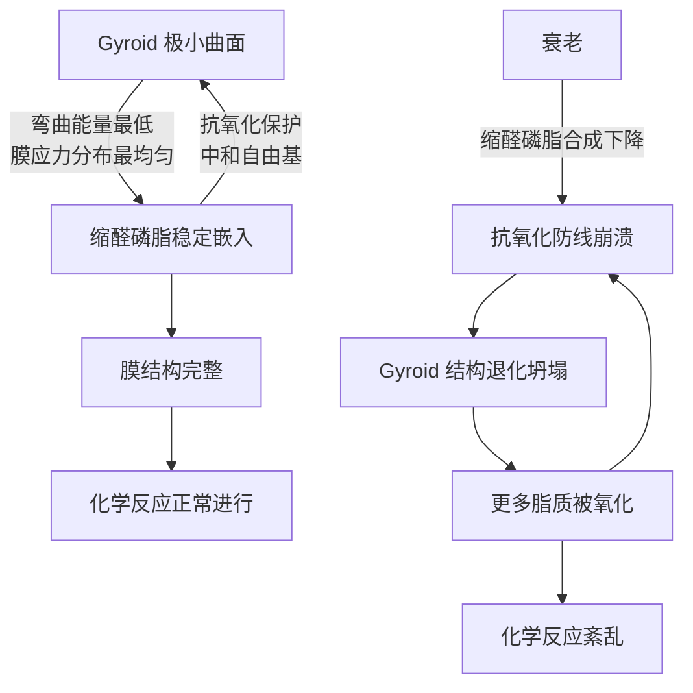
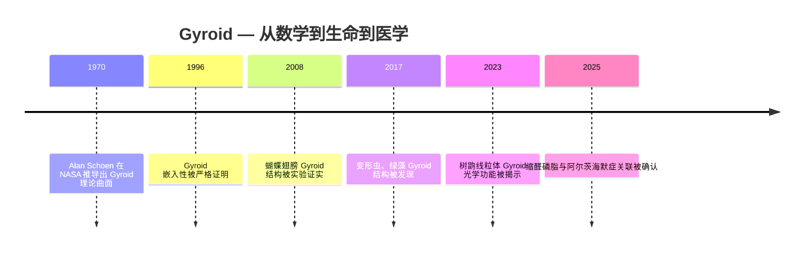

## 视频信息

- **来源**: B站 [BV1GydMBDExS](https://www.bilibili.com/video/BV1GydMBDExS)
- **UP主**: 王立杰
- **标题**: 极小曲面 | 生命底层的几何神作 | 为什么蝴蝶和你的眼球拥有同一种结构
- **时长**: 约 15 分 38 秒

---

## Gyroid 极小曲面 — 数学定义

### 极小曲面 (Minimal Surface)

> **极小曲面**：在给定边界条件下，表面积的**局部极小值**所对应的曲面。其核心特征是**平均曲率处处为零** ($H = 0$)。

**直觉理解**：想象肥皂膜挂在铁丝圈上——肥皂膜自动找到的形状就是极小曲面。这不是人为设计的，而是物理力量（表面张力）自动找到的"最省能量"答案。

Gyroid 要解决的问题进一步升级：**极小曲面在三维空间里无限延伸、周期性重复时，是什么样子？**

### Alan Schoen 与 Gyroid 的发现

| 时间 | 事件 |
|------|------|
| 1967 | Alan Schoen 加入 NASA 电子研究中心，任几何应用办公室负责人 |
| 1970 | 在 NASA 技术报告中发表 Gyroid 曲面 |
| 1996 | 两位德国数学家完成 Gyroid 的嵌入性证明（不自我交叉） |

- Schoen 花了三年时间，用**注塑成型**制作金属塑料模型，借助早期计算机图形学验证
- 他证明了 Gyroid 的数学性质，但**没有证明它是嵌入的（不会穿插交叉）**——这个证明等了 26 年
- 大自然不需要等这个证明：几亿年前的蝴蝶已经在用它了

### Gyroid 的几何特征

Gyroid 是一张**无穷大的弯曲薄膜**，它把整个三维空间精确地分割成两个互相缠绕、但永远不接触的迷宫通道。

关键特性：
- **没有任何直线段**
- **没有任何平面对称性**
- **不需要支撑就能自己站稳**——每个点上的力学平衡都是完美的
- 它是三维空间里弯曲薄膜能找到的**"最轻松的姿势"**：水往低处流，膜往 Gyroid 方向弯

---

## 生物学中的 Gyroid — 跨物种的几何收敛

### 1. 蝴蝶翅膀的结构色

**发现**：2008 年，英国皇家学会界面杂志（*Journal of the Royal Society Interface*）研究证实——多种蝴蝶翅膀鳞片的内部结构，**精确匹配** Gyroid 曲面的数学模型。

**机制**：
1. 蝴蝶翅膀在发育过程中，细胞内质网膜**自发折叠**成 Gyroid 形态
2. 没有任何基因说"折成 Gyroid"——基因只提供了膜的脂质组成和蛋白质环境
3. 膜在物理条件下**自动找到能量最低的折叠方式**
4. 细胞凋亡后，角质蛋白沉积，把这个"活的几何形状"永久定格为**固态光子晶体**
5. 光进入周期性结构 → 布拉格衍射 → 只有特定波长的光被选择性反射

**结果**：蝴蝶翅膀上那些不可思议的金属蓝、翡翠绿——**不是颜料，是建筑出来的**。

> 2017 年《科学进展》（*Science Advances*）进一步指出：蝴蝶翅膀里的 Gyroid 结构，是**细胞内膜发育过程的一个时间冻结快照**。你看到的蝴蝶翅膀颜色，其实是**一个细胞在死亡瞬间的模样**。

### 2. 树鼩眼球的微透镜系统

**树鼩**（Tree Shrew）：东南亚热带森林小型哺乳动物，灵长目近亲。

| 特征 | 普通线粒体 | 树鼩视锥细胞线粒体 |
|------|-----------|-------------------|
| 直径 | 0.5-1 μm | 6-8 μm（~10倍） |
| 脊的结构 | 板层状（层叠） | **Gyroid 立方体膜**（8-12层） |

**三重光学功能**（2023 年魔科学期刊三维模拟研究）：

1. **多焦点透镜**：像微型变焦镜头，把不同波长光聚焦到不同焦平面
2. **角度无关的干涉滤光片**：选择性阻挡紫外线，保护感光色素不被 UV 损伤
3. **波导光子晶体**：把光精确引导到感光色素分子所在位置

> 线粒体在教科书里是"细胞的发电站"——但在树鼩视锥细胞里，它**同时变成了精密光学透镜系统**。一个细胞器，既产能又处理光信号。实现这个奇迹的唯一秘诀：把内膜折叠成 Gyroid 形状。

### 3. 更多跨物种案例

| 生物 | 分类 | Gyroid 出现条件 |
|------|------|----------------|
| 蝴蝶 | 节肢动物门 | 翅膀鳞片发育过程 |
| 树鼩 | 哺乳纲 | 视锥细胞线粒体 |
| 变形虫 | 原生生物界 | 应激条件（营养匮乏、渗透压突变） |
| 绿藻水绵 | 植物界 | 紫外线胁迫 |

这四种生物覆盖了**真核生命的几乎所有大类**，最近共同祖先在 **~15 亿年前**。它们面对**完全不同的功能需求**——产生颜色、聚焦光线、稳定膜结构、抵抗 UV 损伤——最终全部收敛到同一种几何形状。

> **这绝不是某个基因被传了 15 亿年的故事，这是物理定律本身在做选择。**

---

## 物理学原理：为什么是 Gyroid？

一张薄膜在三维空间里，要同时满足三个条件：

1. **最大程度增加表面积**
2. **每个点上的应力完全均匀**
3. **能量代价最小**

> 你能找到的唯一答案就是 Gyroid。不是因为有人帮你选择了它，而是**除了它之外，没有别的形状能同时满足这三个条件**。

这不是超自然存在的审美选择，而是物理定律本身的结构限制：
- 它不需要被编码在任何基因里
- 只需要：**膜存在 + 三维空间存在 + 能量守恒存在**
- 它就必然涌现

$$H = 0 \quad \text{(平均曲率处处为零)}$$

$$\delta A = 0 \quad \text{(表面积变分为零 — 极小曲面的变分定义)}$$

---

## 缩醛磷脂与衰老 — Gyroid 的医学意义

### 缩醛磷脂（Plasmalogen）

Gyroid 立方体膜结构中富含一种特殊的脂质分子——**缩醛磷脂**，其化学结构含有一个**烯醚键**，极其特殊：

- 当自由基攻击细胞膜时，缩醛磷脂**优先牺牲**自己的烯醚键来中和自由基
- 保护膜上其他功能性脂质不被氧化损伤
- 像一个主动替队友挡子弹的卫兵

### Gyroid + 缩醛磷脂的正反馈循环

### 阿尔茨海默症关联

| 发现 | 来源 |
|------|------|
| 缩醛磷脂在阿尔茨海默症患者大脑中**显著下降** | FASEB BioAdvances, 2025 |
| 下降程度与认知损伤严重性**相关** | 同上 |
| 补充缩醛磷脂可降低 **γ-分泌酶** 活性（催化 β-淀粉样蛋白合成的关键酶） | 同上 |
| 血浆缩醛磷脂水平更高的老年人**痴呆风险明显更低** | 拉什大学记忆与衰老项目（多年追踪） |

### 新视角：衰老的本质之一是几何退化

我们通常认为衰老是化学层面的事——基因表达变了、蛋白质错误折叠了、自由基积累了。但如果再往下挖一层：

> 这些化学事件的**容器**就是膜的几何结构。容器的形状决定了里面的化学反应能否正常发生。当容器的形状从 Gyroid 退化为普通无序结构，容器里的化学也就跟着乱了。

**衰老的本质之一，也许是几何退化——物理形态先崩溃，化学功能再跟着崩溃。**

---

## 总结：一条跨越尺度的线索

- 一个**数学家的笔尖** → 一只**蝴蝶的翅膀** → 一个**阿尔茨海默症患者正在坍塌的大脑**
- 他们之间的距离，原来只有**一张极小曲面的厚度**

### 开放问题

一个纯粹从**能量最小化原则**推导出来的数学形状，为什么恰好是生命解决光学难题、结构难题、生化难题的万能钥匙？

两种可能：
1. 宇宙的数学底层恰好适合生命（生命是后来的适应者）
2. 这种数学结构本身就是**生命的必要条件**之一——就像水和碳一样，只是我们还没把它写进教科书

---

## 相关概念

- [[Transformer注意力机制详解]] — 数学结构决定功能的另一个例子
- [[布朗运动]] — 物理学底层对生物系统的约束
- [[球极投影-Stereographic-Projection]] — 几何变换的另一视角
- [[抽象代数入门]] — 对称性与群论基础