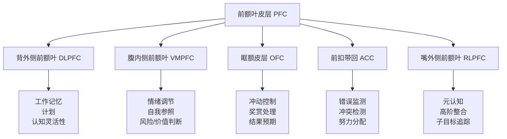
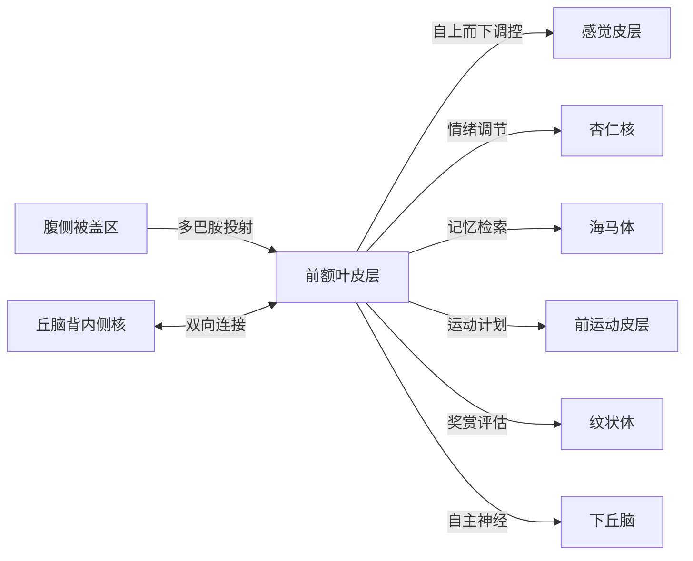

# 前额叶皮层 (Prefrontal Cortex)

---

## 一、解剖位置与分区

前额叶皮层（PFC）位于大脑额叶的最前端，占人类大脑皮层总面积约 **30%**，是人脑与其他灵长类动物相比最显著扩增的区域。



| 亚区 | Brodmann 分区 | 核心功能 |
|------|--------------|---------|
| **DLPFC** 背外侧前额叶 | BA 9, 46 | 工作记忆、计划、认知灵活性、抽象推理 |
| **VMPFC** 腹内侧前额叶 | BA 10, 14, 25, 32 | 情绪调节、自我参照加工、价值判断 |
| **OFC** 眶额皮层 | BA 11, 12, 13, 14 | 冲动控制、奖赏评估、结果预期、社会行为 |
| **ACC** 前扣带回 | BA 24, 32, 33 | 错误监测、冲突检测、认知控制 |
| **RLPFC** 嘴外侧前额叶 | BA 10 前端 | 元认知、多任务协调、最抽象的认知整合 |

---

## 二、核心功能

### 2.1 执行功能（Executive Function）

执行功能是 PFC 的统领性能力，本质是**目标导向行为的神经控制中枢**。Miller & Cohen (2001) 提出了影响力最大的理论：PFC 通过**偏置信号**（bias signals）调控后部皮层的加工，使大脑优先处理与当前任务相关的信息。

核心执行功能三角：

| 功能 | 神经基础 | 日常表现 |
|------|---------|---------|
| **抑制控制** | 右侧额下回 (rIFG) | 忍住不看手机、克制冲动消费 |
| **工作记忆更新** | DLPFC | 心算时暂存中间结果 |
| **认知灵活性** | DLPFC + ACC | 计划变更时快速切换思路 |

### 2.2 工作记忆（Working Memory）

前额叶神经元具有**延迟期持续放电**特性——这是工作记忆的细胞基础。

- Fuster & Alexander (1971) 和 Kubota & Niki (1971) 在灵长类研究中首次发现：PFC 神经元在刺激消失后仍持续放电，直到做出反应
- Goldman-Rakic 的经典实验：DLPFC 损伤的猴子无法完成延迟反应任务（delayed-response task）
- 人类 fMRI 研究：N-back 任务中，DLPFC 激活强度随记忆负荷递增

**关键机制**：锥体神经元通过 NMDA 受体介导的反复兴奋网络维持持续放电，而多巴胺 D1 受体精细调控这个过程。

### 2.3 决策（Decision-Making）

PFC 使用两种互补的决策系统：

1. **证据累积模型**：DLPFC 逐渐整合感觉证据，达到阈值后触发决策
2. **价值导向选择**：VMPFC / OFC 编码主观价值，跨期选择中 DLPFC 负责自我控制（延迟满足 vs 即时奖赏）

Damasio 的**躯体标记假说**（Somatic Marker Hypothesis）：VMPFC 将情绪信号（躯体状态）与决策选项关联。VMPFC 损伤患者智力正常，但无法做出有利的日常决策——他们"知道"什么是正确的，却"感受"不到。

### 2.4 冲动控制

OFC 是冲动控制的神经哨兵。经典实验：

- **棉花糖实验**（Mischel）：能延迟满足的儿童，40 年后 PFC 激活模式更高效
- **Go/No-Go 任务**：右侧额下回在需要抑制反应时强烈激活
- 青春期高风险行为与 PFC 未成熟密切相关——边缘系统（情绪/奖赏）发育完成，但 PFC 的刹车系统还没装好

### 2.5 计划与前瞻

DLPFC 和 RLPFC 协同支持**前瞻性脑模拟**——在大脑中预演未来情景的能力，是人类独有的高级功能。

- 制定多步计划时，RLPFC (BA 10) 追踪子目标和主目标的层级关系
- 旅行规划、项目管理、烹饪一道复杂菜品，都是 PFC 计划功能的日常体现

### 2.6 注意力调控

PFC 通过**自上而下**的偏置信号，选择性增强任务相关的感觉处理，同时抑制无关信息。这就是为什么你能在嘈杂的咖啡馆里专注于一本书——PFC 告诉听觉皮层"别管那些背景噪音"。

---

## 三、与其他脑区的连接与协作

PFC 几乎是全脑连接最密集的枢纽：



| 连接通路 | 方向 | 功能 |
|---------|------|------|
| PFC → 感觉皮层 | 自上而下 | 注意调控，增强相关信号 |
| PFC → 杏仁核 | 调控 | 情绪调节，恐惧消退 |
| PFC ↔ 海马体 | 双向 | 工作记忆与长时记忆的交互 |
| 腹侧被盖区 (VTA) → PFC | 中脑皮层通路 | 多巴胺供给，认知功能调节 |
| 丘脑背内侧核 ↔ PFC | 双向 | 信息门控，意识状态维持 |
| PFC → 纹状体 | 额叶-纹状体环路 | 动作选择、习惯形成 |

**关键洞察**：PFC 不直接产生感觉或运动——它**塑造**其他脑区做什么。它是指挥官，不是士兵。

---

## 四、发展过程

前额叶皮层是**人脑最晚成熟的区域**，发展时间线贯穿整个青春期：

```mermaid
gantt
    title 前额叶皮层发展时间线
    dateFormat YYYY
    axisFormat %Y
    section 神经元增殖
      神经发生           :0, 0.5y
    section 突触形成
      突触爆发增长       :0.5y, 2.5y
    section 突触修剪
      灰质减少/白质增加   :2y, 25y
    section 髓鞘化
      髓鞘形成           :0y, 30y
    section 关键节点
      5岁基础执行功能建立 :milestone, 5y, 0
      青春期加速修剪     :milestone, 12y, 0
      约25岁基本成熟      :milestone, 25y, 0
```

**分阶段变化**：

| 阶段 | 变化 | 行为影响 |
|------|------|---------|
| 0-5 岁 | 突触爆发增殖，基础执行功能建立 | 开始能延迟满足、理解规则 |
| 6-12 岁 | 灰质持续增厚 | 工作记忆、注意力显著提升 |
| 13-18 岁 | 灰质加速修剪 + 髓鞘化进展 | 冒险行为增加，情绪波动大 |
| 19-25 岁 | 前额叶髓鞘化收尾 | 判断力、冲动控制趋于成熟 |

**青春期悖论**：边缘系统（杏仁核、腹侧纹状体）在青春期早期就发育成熟 → 对奖赏和情绪刺激高度敏感。但 PFC 的刹车系统要到 25 岁才装好。这就是青少年"知道危险但还是要做"的神经根源。

---

## 五、损伤/功能障碍的表现

### 5.1 经典案例：Phineas Gage (1848)

神经科学史上最重要的病例之一。

- **事故**：铁路工人 Gage 被一根铁棍（长 1.1m，重 6kg）穿透左侧脸颊，从颅顶穿出，**双侧 VMPFC 被破坏**
- **变化**：存活下来，智力、语言、运动正常——但人格发生了根本转变。从"最能干、最有效率的工头"变成"反复无常、不敬、无法坚持计划、对他人漠不关心"的人
- **意义**：首次证明**特定脑区损伤可以选择性损害人格与社会行为，而保留智力**。为"前额叶是社会脑"理论奠定了基石
- 现代神经影像学（Damasio 团队 1994 年重建）证实损伤集中在 VMPFC / OFC

### 5.2 常见功能障碍谱系

| 障碍 | 涉及的 PFC 亚区 | 核心表现 |
|------|---------------|---------|
| **ADHD** | DLPFC, ACC | 注意力缺陷、冲动、执行功能受损 |
| **精神分裂症** | DLPFC (hypofrontality) | 工作记忆衰退、思维混乱、阴性症状 |
| **抑郁症** | VMPFC, ACC (过度活跃) | 反刍思维、决策瘫痪、快感缺失 |
| **成瘾** | OFC, ACC | 冲动控制丧失、对长期后果无感 |
| **额颞叶痴呆** | OFC, VMPFC | 人格改变、社交失范、脱抑制行为 |
| **创伤性脑损伤 (TBI)** | 任意亚区 | 根据损伤位置表现各异 |

**核心 pattern**：前额叶损伤 ≠ 智力下降，而是**失去了"有效运用智力"的能力**——知道什么是对的，但做不到。

---

## 六、与多巴胺系统的关系

PFC 与多巴胺的关系是神经科学中研究最多的神经递质-脑区耦合之一：

### 6.1 中脑皮层通路

- 多巴胺神经元从**腹侧被盖区 (VTA)** 直接投射到 PFC，构成**中脑皮层多巴胺通路**
- 与著名的中脑边缘通路（VTA → 伏隔核，负责奖赏）不同，中脑皮层通路侧重**认知功能**

### 6.2 D1 受体的倒 U 曲线

PFC 中多巴胺 D1 受体遵循**倒 U 型剂量-反应曲线**——这是理解 PFC 药理的钥匙：

$$ \text{认知表现} = f(\text{D1 激活水平}) $$

- **过低**（如未经治疗的 ADHD）→ 工作记忆差、注意力涣散
- **适中**→ 最优认知表现
- **过高**（如急性应激）→ 认知功能崩溃，"脑子一片空白"

### 6.3 工作机制

| 机制 | 效果 |
|------|------|
| D1 激活 → 增强 NMDA 受体功能 | 增强锥体神经元的持续放电（工作记忆的细胞基础） |
| D1 激活 → 降低 cAMP 门控阳离子电流 (Ih) | 减少不相关输入的干扰，提高信噪比 |
| D2 受体 (次要) | 促进认知灵活性、任务切换 |

### 6.4 应激与 PFC

Arnsten 的经典发现：**应激导致的大量去甲肾上腺素和多巴胺释放会瘫痪 PFC**。在应激状态下：
- PFC 功能被抑制 → 决策能力下降
- 杏仁核和习惯系统接管 → 情绪化反应、自动行为
- 这就是为什么考试紧张时"什么都想不起来"的神经基础

---

## 七、日常生活的实际意义

### 7.1 如何训练/增强前额叶功能

| 方法 | 证据 | 建议剂量 |
|------|------|---------|
| **有氧运动** | 增加 BDNF、促进 PFC 灰质体积 | 每周 150 分钟中等强度 + 2 次高强度 |
| **正念冥想** | 8 周后 DLPFC 皮层增厚，杏仁核缩小 | 每天 10-20 分钟，坚持 8 周以上 |
| **充足睡眠** | 慢波睡眠中胶质淋巴系统清除 PFC 代谢废物 | 7-9 小时，固定作息 |
| **认知训练** | 工作记忆训练、双 N-back 任务可改善流体智力 | 变剂量，关键在持续挑战 |
| **学习新技能** | 新语言、乐器等促进 PFC 神经可塑性 | 每周多次，至少 3 个月 |

### 7.2 损害 PFC 的行为

| 行为 | 机制 |
|------|------|
| **长期睡眠不足** | 单次熬夜即可降低 PFC 葡萄糖代谢 10-15% |
| **慢性应激** | 持续高皮质醇损伤 PFC 锥体神经元树突 |
| **多任务分心** | 频繁任务切换降低 DLPFC 效率（切换成本） |
| **酒精/药物滥用** | 青少年 PFC 对酒精尤其敏感，长期使用损伤髓鞘化 |

### 7.3 实用原则

1. **一次只做一件事** — 多任务切换消耗 PFC 资源，切换成本 (switch cost) 远高于直觉估计
2. **把决策外包给环境** — 减少 PFC 不必要的决策消耗（Steve Jobs 的同款穿搭原则背后的神经逻辑）
3. **睡好是第一优先级** — 睡眠不足直接削弱 PFC 对杏仁核的调控，让你更情绪化、更冲动
4. **延迟反应** — 感到愤怒或冲动时，等 10 秒。这 10 秒足够 PFC 从杏仁核手中夺回控制权
5. **运动是 PFC 最强的非药理学增强剂** — 效果优于任何"益智补充剂"

---

## 总结

前额叶皮层定义了"人之所以为人"的许多特质——控制冲动、计划未来、做出明智选择、理解他人。它是大脑进化最晚、成熟最晚、也最脆弱的部分。PFC 发育的时间窗口（到 25 岁）意味着青少年时期的行为特征有其物质基础；PFC 对多巴胺的精细依赖解释了 ADHD 和成瘾的神经机理；而运动、冥想、睡眠作为 PFC 的"日常维护方案"，是任何年龄都可以从中受益的实践。