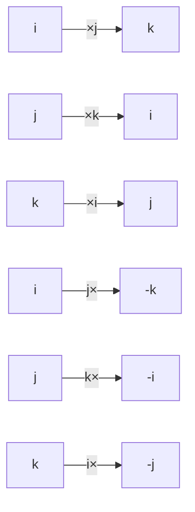

## 一句话

四元数是复数的"复数"——在 $a+bi$ 的基础上再加两个虚单位 $j,k$，得到一个 4 维数系。代价是**乘法不再交换**（$ij \neq ji$），因此它不是域，只是除环。

---

## 一、Hamilton 的灵光一闪（1843）

### 1.1 问题：怎么把复数推广到三维？

复数 $a+bi$ 可以表示平面上的旋转（乘 $i$ = 转 90°）。William Rowan Hamilton（哈密顿）想知道：有没有一个"三维复数" $a+bi+cj$ 能表示三维旋转？

他试了十多年，失败了。

### 1.2 1843 年 10 月 16 日，Brougham 桥上的顿悟

Hamilton 陪妻子走过都柏林的 Brougham 桥时突然意识到：**不能加一个虚部，必须加两个！** 不是三维，是**四维**。而且必须放弃乘法交换律。

他当场掏出小刀，在桥的石头上刻下了：

$$i^2 = j^2 = k^2 = ijk = -1$$

> 这座桥至今有一块纪念牌。数学史上极少有哪个公式的诞生是刻在石头上的。

---

## 二、定义与运算规则

### 2.1 基本形式

四元数 $q \in \mathbb{H}$（$\mathbb{H}$ 纪念 Hamilton）：

$$q = a + bi + cj + dk, \quad a,b,c,d \in \mathbb{R}$$

- $a$ → 实部 (scalar part)
- $bi + cj + dk$ → 虚部 (vector part)，是个三维向量

也可以写成：$q = (a, \mathbf{v})$，其中 $\mathbf{v} = (b, c, d)$。

### 2.2 虚单位的乘法表

$$i^2 = j^2 = k^2 = -1$$

$$ij = k, \quad jk = i, \quad ki = j$$
$$ji = -k, \quad kj = -i, \quad ik = -j$$

顺时针方向相乘得正，逆时针得负——像叉积一样。

### 2.3 加法和乘法

**加法**：逐分量相加（跟向量一样）

$$(a+bi+cj+dk) + (a'+b'i+c'j+d'k) = (a+a') + (b+b')i + (c+c')j + (d+d')k$$

**乘法**：按分配律展开 + 使用乘法表化简。结果用向量形式写很简洁：

$$(a, \mathbf{u})(b, \mathbf{v}) = (ab - \mathbf{u} \cdot \mathbf{v},\; a\mathbf{v} + b\mathbf{u} + \mathbf{u} \times \mathbf{v})$$

标量部分包含点积，向量部分包含叉积。叉积天然反交换（$\mathbf{u} \times \mathbf{v} = -\mathbf{v} \times \mathbf{u}$）→ 这正是四元数乘法不交换的几何来源。

### 2.4 共轭、模、逆

**共轭**：$\bar{q} = a - bi - cj - dk = (a, -\mathbf{v})$

**模**：$|q| = \sqrt{a^2 + b^2 + c^2 + d^2}$

**逆**：$q^{-1} = \frac{\bar{q}}{|q|^2}$（跟复数一模一样）

任何非零四元数都有逆 → 所以四元数是**除环（Division Ring）**——有除法，只是乘法不交换。

---

## 三、与复数的关系：Cayley-Dickson 构造

四元数可以用复数构造：

$$\mathbb{H} = \mathbb{C} \times \mathbb{C}$$

一个四元数 = 一对复数 $(z_1, z_2)$，乘法定义为：

$$(z_1, z_2)(w_1, w_2) = (z_1 w_1 - \bar{w_2} z_2,\; w_2 z_1 + z_2 \bar{w_1})$$

这就是 **Cayley-Dickson 构造**——一种递归地把数系翻倍的方法：

$$\mathbb{R} \xrightarrow{\text{CD}} \mathbb{C} \xrightarrow{\text{CD}} \mathbb{H} \xrightarrow{\text{CD}} \mathbb{O} \xrightarrow{\text{CD}} \mathbb{S} \xrightarrow{\text{CD}} \dots$$

每做一次，维度翻倍，丢失一条代数性质。

---

## 四、代数地位：除环但不是域

| 性质 | $\mathbb{R}$ | $\mathbb{C}$ | $\mathbb{H}$ |
|------|:---:|:---:|:---:|
| 加法封闭 | ✓ | ✓ | ✓ |
| 加法交换 | ✓ | ✓ | ✓ |
| 乘法封闭 | ✓ | ✓ | ✓ |
| 乘法结合 | ✓ | ✓ | ✓ |
| 乘法交换 | ✓ | ✓ | **✗** |
| 非零元有逆 | ✓ | ✓ | ✓ |
| **结构类型** | **域** | **域** | **除环** |

**Frobenius 定理（1877）**：$\mathbb{R}$、$\mathbb{C}$、$\mathbb{H}$ 是**仅有的三个**有限维实数域上的结合除代数。

> 你想找一个"有除法、结合律成立"但是维度大于 4 的数系？不存在。

---

## 五、核心应用：三维旋转 ⭐⭐⭐

这是四元数最重要的实际用途。

### 5.1 问题：旋转矩阵的缺陷

用 $3 \times 3$ 旋转矩阵表示三维旋转，有两个致命问题：

- **万向节死锁 (Gimbal Lock)**：欧拉角在特定角度下会丢失一个自由度
- **插值困难**：两个旋转矩阵之间怎么"线性插值"？直接插值矩阵分量得到的不是合法旋转矩阵

### 5.2 四元数方案

**单位四元数**（$|q|=1$）可以表示三维旋转：

$$q = \cos\frac{\theta}{2} + \sin\frac{\theta}{2}(u_x i + u_y j + u_z k)$$

- $\theta$ = 旋转角度
- $\mathbf{u} = (u_x, u_y, u_z)$ = 旋转轴的单位向量

旋转一个三维向量 $\mathbf{p}$（写成纯虚四元数 $p = (0, \mathbf{p})$）：

$$p' = q p q^{-1}$$

### 5.3 为什么四元数比矩阵好

| | 旋转矩阵 | 欧拉角 | 四元数 |
|---|:---:|:---:|:---:|
| 万向节死锁 | 无 | **有** | 无 |
| 平滑插值 (SLERP) | 难 | 难 | **天然支持** |
| 存储 | 9 个数 | 3 个数 | **4 个数** |
| 组合旋转 | 矩阵乘法 | 角度相加（复杂） | **四元数乘法** |
| 数值漂移修正 | 需正交化 | 需归一化角度 | 归一化模长即可 |

### 5.4 SLERP (Spherical Linear Interpolation)

两个旋转 $q_1$ 和 $q_2$ 之间的平滑过渡：

$$SLERP(q_1, q_2, t) = q_1 (q_1^{-1} q_2)^t = \frac{\sin((1-t)\Omega)}{\sin\Omega} q_1 + \frac{\sin(t\Omega)}{\sin\Omega} q_2$$

其中 $\cos\Omega = q_1 \cdot q_2$（四元数点积）。

动画、相机过渡、机器人路径规划全在用。

---

## 六、其他重要应用

### 6.1 计算机图形学与游戏引擎

Unity、Unreal Engine 的底层旋转全是四元数。游戏角色的转身、骨骼动画、摄像机控制——你每次操作角色旋转，背后都在算四元数乘法。

### 6.2 姿态控制

无人机、卫星的姿态估计（AHRS/Madgwick/Mahony 滤波器）使用四元数，避免了欧拉角的万向节死锁。

### 6.3 狭义相对论

Lorentz 变换可以用双四元数（biquaternions）优雅地表示。

### 6.4 Maxwell 方程的四元数形式

Maxwell 最初写电磁学方程用的就是四元数！后来 Heaviside 和 Gibbs 才简化成向量形式（散度 + 旋度分开写）。Maxwell 的原版 20 个方程，四元数写法只要 2 个。

### 6.5 量子力学

自旋 (spin) 用 Pauli 矩阵表示，而 Pauli 矩阵与四元数的虚单位 $i,j,k$ 有直接的代数对应关系：

$$\sigma_x \sim i,\quad \sigma_y \sim j,\quad \sigma_z \sim k$$

---

## 七、为什么四元数不是"复数的复数"

你可能会想：复数 = 实数 + 实数$\cdot i$，四元数 = 复数 + 复数$\cdot j$，那四元数不就是"复数的复数"吗？

$$q = (a+bi) + (c+di)j = a + bi + cj + dk$$

不完全是——关键在于 $ij \neq ji$。普通的"复数的复数"如果假设 $i$ 和 $j$ 交换，会得到交换环；但 Hamilton 的关键洞察恰恰是**必须让它们反交换**，这样才能得到一个有除法的结构。

如果让 $ij = ji$，那么非零元素就不一定都有逆元了——代数结构会崩成有零因子的环。

---

## 八、总结

| 维度 | 对比 |
|------|------|
| 定义 | $a + bi + cj + dk$，$i^2=j^2=k^2=ijk=-1$ |
| 维度 | 4（1 实部 + 3 虚部） |
| 代数结构 | 除环（不是域，乘法不交换） |
| 与复数的关系 | 复数 → Cayley-Dickson 构造 → 四元数 |
| 核心几何意义 | 三维旋转（单位四元数） |
| 最关键的应用 | 计算机图形学、游戏引擎、姿态控制、SLERP 插值 |
| 标志性发现 | Hamilton 1843 年 Brougham 桥上顿悟 |

---

## 相关笔记

- [[复数与二维向量的本质区别]] — 复数作为域与向量空间的对比
- [[虚数的诞生与真实应用]] — 虚数从 Bombelli 到量子力学的历程
- [[抽象代数入门]] — 群、环、域、除环的代数结构层级
- [[球极投影-Stereographic-Projection|球极投影 (Stereographic Projection)]] — Riemann 球面与复数的几何表示
