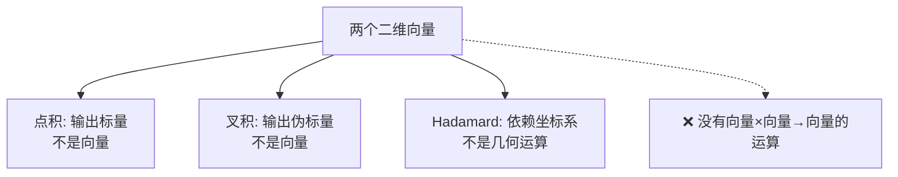
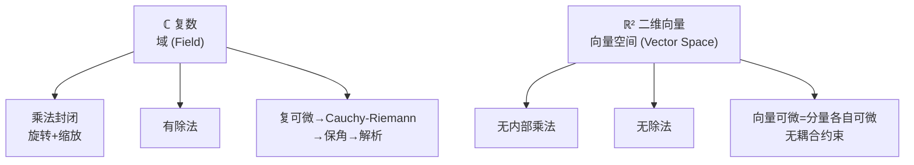

## 一句话

复数和二维向量在**加法**上完全等价，但复数是**域（field）**——有乘法、有除法、乘法的几何意义是旋转+缩放；二维向量只是**向量空间**——只有加法和数乘，"向量乘向量"没有良定义。

---

## 一、相同之处：加法

复数加法：

$$(a + bi) + (c + di) = (a+c) + (b+d)i$$

向量加法：

$$(a, b) + (c, d) = (a+c,\; b+d)$$

**完全等价。** 这是它们总是被拿来比较的原因。

---

## 二、不同之处：乘法

这是全部区别的根源。

### 2.1 复数乘法：旋转 + 缩放

$$(a + bi)(c + di) = (ac - bd) + (ad + bc)i$$

展开：$ac + adi + bci + bd(i^2) = (ac - bd) + (ad + bc)i$

几何意义：<b>模长相乘，幅角相加</b>。

| 复数 | 极坐标形式 |
|------|-----------|
| $z_1 = a+bi$ | $r_1 e^{i\theta_1}$ |
| $z_2 = c+di$ | $r_2 e^{i\theta_2}$ |
| $z_1 z_2$ | $r_1 r_2 e^{i(\theta_1 + \theta_2)}$ |

乘上 $i$ = 逆时针转 90° → 这就是复数的"旋转变换"，直接由乘法完成。

### 2.2 向量的 "乘法"：根本不存在从 $\mathbb{R}^2 \times \mathbb{R}^2 \to \mathbb{R}^2$ 的良定义乘法

你只能用替代品，但**都不是真正的向量乘法**：

**点积（Dot Product）**：

$$\mathbf{u} \cdot \mathbf{v} = ac + bd$$

- 输入两个向量 → 输出一个**标量**（退化了一维）
- 几何意义：投影长度（$\mathbf{u} \cdot \mathbf{v} = |\mathbf{u}||\mathbf{v}|\cos\theta$）
- `(vector, vector) → scalar`

**叉积（Cross Product）**：

$$\mathbf{u} \times \mathbf{v} = ad - bc$$

- 在二维中输出一个<b>伪标量</b>——它实际是三维叉积的 $z$ 分量
- 几何意义：有向面积（$|\mathbf{u} \times \mathbf{v}| = |\mathbf{u}||\mathbf{v}|\sin\theta$）
- `(vector, vector) → scalar`（不是向量）

**逐分量相乘（Hadamard Product）**：

$$(a,b) \odot (c,d) = (ac, bd)$$

- 坐标轴相关的——转一下坐标系结果就变了，**不是几何运算**

### 2.3 核心差异表

| | 复数乘法 | 向量 |
|---|---|---|
| 结果类型 | 复数（仍是二维） | 标量或伪标量（退化） |
| 几何意义 | 旋转+缩放 | 投影（点积）/面积（叉积） |
| 封闭性 | 封闭 | 不封闭 |
| 交换律 | 满足 | 点积满足，叉积反交换 |
| 结合律 | 满足 | 无"两个向量乘第三个" |
| 单位元 | $1 = 1+0i$ | 没有 |
| 逆元 | 非零复数都有倒数 | 不存在 |

---

## 三、除法

### 复数有除法

$$(a+bi) \div (c+di) = \frac{(a+bi)(c-di)}{c^2+d^2}$$

几何意义：**模长相除，幅角相减**。

任何非零复数都有倒数：

$$\frac{1}{z} = \frac{\bar{z}}{|z|^2}$$

### 向量没有除法

"$\mathbf{u} \div \mathbf{v}$" 没有定义。你最多说"用点积和叉积来算分量"，但如果你想把除法理解为乘法的逆操作——而向量根本没有内部乘法——那除法就不可能有。

---

## 四、代数结构：域 vs 向量空间

这是**最根本**的区别。

### 4.1 什么是"域 (Field)"？

域是抽象代数里对<b>能做完整四则运算</b>的集合的正式称呼。一个集合 $F$ 配上加法 $+$ 和乘法 $\times$，满足以下所有条件，就叫域。

**加法群（Abel 群）**：

| 条件 | 含义 |
|------|------|
| 封闭 | $a,b \in F \Rightarrow a+b \in F$ |
| 结合律 | $(a+b)+c = a+(b+c)$ |
| 交换律 | $a+b = b+a$ |
| 存在零元 | $\exists 0,\; a+0 = a$ |
| 存在相反数 | $\forall a,\; \exists(-a),\; a+(-a)=0$ |

**乘法群（非零元构成 Abel 群）**：

| 条件 | 含义 |
|------|------|
| 封闭 | $a,b \in F \Rightarrow a \times b \in F$ |
| 结合律 | $(ab)c = a(bc)$ |
| 交换律 | $ab = ba$ |
| 存在单位元 | $\exists 1 \neq 0,\; a \times 1 = a$ |
| 存在倒数 | $\forall a \neq 0,\; \exists a^{-1},\; a \times a^{-1} = 1$ |

**分配律**：

$$a(b+c) = ab + ac$$

> 域 = <b>你从小学到大的算术规则全部有效</b>。加减乘除，封闭、有逆——跟实数一模一样。

### 4.2 逐条对比：$\mathbb{C}$ vs $\mathbb{R}^2$

| 条件 | $\mathbb{C}$（复数） | $\mathbb{R}^2$（二维向量） |
|------|:---:|:---:|
| 加法封闭 | ✓ | ✓ |
| 加法结合/交换 | ✓ | ✓ |
| 有零元 | $0+0i$ ✓ | $(0,0)$ ✓ |
| 有相反数 | $-a-bi$ ✓ | $(-a,-b)$ ✓ |
| **乘法封闭** | ✓ $(a+bi)(c+di)\in\mathbb{C}$ | **✗ 没有内部乘法** |
| **乘法结合律** | ✓ | **✗** |
| **乘法交换律** | ✓ $(ab=ba)$ | **✗** |
| **存在单位元 1** | $1+0i$ ✓ | **✗** |
| **存在倒数** | $\frac{1}{a+bi}$ ✓ | **✗** |
| 分配律 | ✓ | **✗**（没有乘法，谈不上分配） |

$\mathbb{R}^2$ 缺的就是中间那个"乘"——没有内部乘法，后面所有跟乘法有关的性质全崩。点积、叉积只是替代品，它们的结果不在 $\mathbb{R}^2$ 里，不构成封闭运算，更谈不上单位元和逆元。

### 4.3 域的威力

正因为是域，复数才能：

- 做多项式（$z^n + a_{n-1}z^{n-1} + \dots$ 有意义）
- 做幂级数 / Taylor 展开
- 定义极限、连续性、导数
- 做复积分 / 留数定理
- 满足代数基本定理（复多项式必有根）

这些**全部依赖域结构**。向量空间没有乘法，多项式 $\mathbf{v}^2$ 根本写不出来，上面的东西全崩。

> **域 = 能像对待实数一样对待这个集合。** 这就是 $\mathbb{C}$ 是域、$\mathbb{R}^2$ 不是域的全部含义。

---

## 五、解析性质：复可微 vs 向量可微

### 5.1 复可微 = 巨强的约束

复数函数 $f(z)$ 在某点<b>可导</b>（复可微），意味着：

$$\lim_{h \to 0} \frac{f(z+h) - f(z)}{h} \quad \text{存在，无论 }h\text{ 从哪个方向趋近}$$

这比实可微严格得多。它导出了 **Cauchy-Riemann（柯西-黎曼）方程**：

若 $f(z) = u(x,y) + iv(x,y)$，则：

$$\frac{\partial u}{\partial x} = \frac{\partial v}{\partial y}, \quad \frac{\partial u}{\partial y} = -\frac{\partial v}{\partial x}$$

**后果惊人**：如果 $f(z)$ 复可微一次 → 自动无限次可微 → 自动解析（等于幂级数）→ 自动满足调和方程。

### 5.2 向量可微：松散得多

向量函数 $\mathbf{F}(x,y): \mathbb{R}^2 \to \mathbb{R}^2$ 的可微只需要两个分量各自可微——**分量之间没有耦合约束**。

$$\mathbf{F}(x,y) = (u(x,y),\; v(x,y))$$

$u$ 和 $v$ 可以完全独立变化。没有 "Cauchy-Riemann" 式的约束把它们绑在一起。

### 5.3 后果对比

| 性质 | 复解析函数 | 光滑向量场 |
|------|:---------:|:---------:|
| 一次可微 → 无限次可微 | ✓ | ✗ |
| 局部等于幂级数 | ✓ | ✗（除非解析） |
| 调和性（$\nabla^2 u = 0$） | ✓ | ✗ |
| 保角性 | ✓ | ✗ |
| 最大模原理 | ✓ | ✗ |
| 零点孤立 | ✓ | ✗ |

> 复可微函数是一个**非常小**的贵族俱乐部——而光滑向量场几乎随便写都是。

---

## 六、矩阵表示：同一个对象，不同视角

### 6.1 复数乘 $a+bi$ 等价于左乘矩阵 $\begin{pmatrix} a & -b \\ b & a \end{pmatrix}$

将 $z = x + yi$ 写成列向量 $(x, y)^T$，乘 $a+bi$ 作用于 $z$：

$$(a+bi)(x+yi) = (ax-by) + (bx+ay)i$$

对应矩阵乘法：

$$\begin{pmatrix} a & -b \\ b & a \end{pmatrix} \begin{pmatrix} x \\ y \end{pmatrix} = \begin{pmatrix} ax - by \\ bx + ay \end{pmatrix}$$

### 6.2 这个矩阵的形式揭示了关键约束

矩阵 $\begin{pmatrix} a & -b \\ b & a \end{pmatrix}$ 是**反对称 + 缩放**的组合：

$$\begin{pmatrix} a & -b \\ b & a \end{pmatrix} = a\begin{pmatrix} 1 & 0 \\ 0 & 1 \end{pmatrix} + b\begin{pmatrix} 0 & -1 \\ 1 & 0 \end{pmatrix}$$

- $\begin{pmatrix} 1 & 0 \\ 0 & 1 \end{pmatrix}$ = 乘以 1（等值映射）
- $\begin{pmatrix} 0 & -1 \\ 1 & 0 \end{pmatrix}$ = 乘以 $i$（90° 旋转）

而**一般的二维线性变换**可以写为：

$$\begin{pmatrix} a & b \\ c & d \end{pmatrix}$$

有 4 个独立参数——自由度是复数的**两倍**。

### 6.3 几何含义

- **复数乘法** = 旋转 + 均匀缩放（保角，保形）
- **一般 $2\times2$ 矩阵** = 旋转、不同方向不同缩放、剪切……什么都能做

$$复数乘法 \subsetneq 2\times2 \text{ 矩阵}$$

复数是二维线性变换的一个<b>极其特殊的子集</b>——它只有旋转和均匀缩放，没有剪切（shear），没有各向异性缩放。

---

## 七、总结

| 维度 | 复数 $\mathbb{C}$ | 二维向量 $\mathbb{R}^2$ |
|------|-------------------|------------------------|
| 加法 | 分量相加 | 分量相加（相同） |
| 内部乘法 | ✓ 封闭 | ✗ |
| 除法 | ✓ | ✗ |
| 代数结构 | **域** | **向量空间** |
| 乘法的几何 | 旋转 + 均匀缩放 | — |
| 复可微/向量可微 | Cauchy-Riemann（强耦合） | 分量独立可微 |
| $2\times2$ 矩阵表示 | 2 自由度（特定形式） | 4 自由度（任意矩阵） |
| 能做什么 | 复分析 → 围道积分、留数定理 | 可用任意线性变换 |

**一句话：** 复数是多了乘法结构的二维向量——这个乘法不是打补丁加上的，而是**核心结构**。有了它，复数从一个"平面上的点"升级成了一个完整的数系，能做加减乘除、能分析、能微积分。二维向量始终只能加法和数乘，缺少了这个内部乘法，所以它只是一个空间，不是代数。

---

## 相关笔记

- [[虚数的诞生与真实应用]] — 虚数如何被三次方程逼出来，以及后续在物理/工程中的核心应用
- [[球极投影-Stereographic-Projection|球极投影 (Stereographic Projection)]] — 将复数平面紧化为 Riemann 球面的关键几何工具
