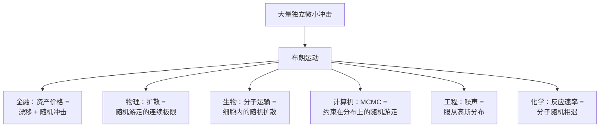

## 一句话

布朗运动是自然界和人类社会中最普遍的随机模型——从股票价格、药物扩散到搜索引擎排名，无不可用"随机游走的连续极限"来描述。

---

## 一、金融：定价一切的核心引擎 ⭐⭐⭐

### 1.1 股票价格模型 — 几何布朗运动 (GBM)

股票价格 $S_t$ 被建模为：

$$dS_t = \mu S_t dt + \sigma S_t dW_t$$

- $\mu$：漂移率（预期收益率）
- $\sigma$：波动率
- $dW_t$：布朗运动增量（随机冲击）

解为：

$$S_t = S_0 \exp\left((\mu - \frac{\sigma^2}{2})t + \sigma W_t\right)$$

> 这就是 Black-Scholes（布莱克-斯科尔斯）期权定价公式的基础。1973 年这个公式问世后，期权市场从零膨胀到百万亿美元规模。1997 年 Merton 和 Scholes 因此获诺贝尔经济学奖。

### 1.2 期权定价

欧式看涨期权价格（Black-Scholes 公式）：

$$C = S_0 N(d_1) - Ke^{-rT} N(d_2)$$

其中 $N(\cdot)$ 是标准正态累积分布——正态分布之所以出现，正是因为布朗运动的增量是正态的。

### 1.3 利率模型

| 模型 | SDE | 特点 |
|------|-----|------|
| Vasicek | $dr = a(b-r)dt + \sigma dW$ | 均值回归，可能为负 |
| CIR | $dr = a(b-r)dt + \sigma\sqrt{r}dW$ | 均值回归，始终非负 |
| Hull-White | $dr = a(\theta(t)-r)dt + \sigma dW$ | 拟合任意初始利率曲线 |

全部以布朗运动为噪声源。

### 1.4 风险管理

- **VaR (Value at Risk)**：组合在给定置信度下的最大损失——计算依赖资产收益率的正态假设（来自布朗运动）
- **CVA/DVA**：交易对手信用风险的定价——用布朗运动建模违约概率的演化

---

## 二、物理学：从证明原子存在到纳米技术

### 2.1 爱因斯坦 1905：证明原子存在

19 世纪末，"原子是否真实存在"还是激烈争论的话题。Einstein（爱因斯坦）用布朗运动给出了决定性答案：

$$\langle x^2 \rangle = 2Dt = \frac{k_B T}{3\pi\eta r} t$$

如果布朗运动由分子碰撞引起，均方位移应与时间成正比、与颗粒半径成反比，与温度成正比。

1908 年 Perrin（佩兰）用实验精确验证了这些预测 → **1926 年诺贝尔物理学奖**。这一实验终结了"原子是否真实存在"的百年争论。

### 2.2 扩散现象

物质在介质中的扩散 (Fick 定律) 宏观上是浓度梯度驱动的确定性过程，微观上就是无数粒子各自做布朗运动。

| 场景 | 粒子 | 介质 |
|------|------|------|
| 香水扩散 | 香精分子 | 空气 |
| 墨水扩散 | 染料分子 | 水 |
| 热传导 | 声子/电子 | 固体 |
| 半导体掺杂 | 杂质原子 | 硅晶体 |

### 2.3 统计力学 — 涨落-耗散定理

布朗运动的**Langevin（朗之万）方程**揭示了自然界最深刻的关系之一：

$$m\frac{dv}{dt} = -\gamma v + \xi(t)$$

- $-\gamma v$：摩擦力（耗散——把能量散出去）
- $\xi(t)$：随机力（涨落——分子碰撞的随机冲击）

**涨落-耗散定理**：摩擦系数 $\gamma$ 和随机力的强度由**同一个温度** $T$ 决定：

$$\langle \xi(t)\xi(t')\rangle = 2\gamma k_B T \delta(t-t')$$

> 耗散和涨落是同源的——都是一个系统与热浴（heat bath）相互作用的两面。

### 2.4 纳米技术与生物物理

- 光镊（Optical Tweezers）捕获单个 DNA 分子，测量其在溶液中的布朗运动 → 推算分子的弹性常数。2018 年 Ashkin 因此获诺贝尔奖
- 分子马达（如 kinesin 在微管上的行走）的热噪声就是布朗运动

---

## 三、生物学与医学

### 3.1 药物输送与扩散

药物在血液和组织中的扩散 → 用扩散方程建模，微观基础是布朗运动。

控释药物的设计：药物分子从聚合物基质中通过布朗运动逐步释放。释放速率用 Higuchi 方程描述，基础就是 $\langle x^2 \rangle \propto t$。

### 3.2 细胞内的分子运输

细胞内没有"高速公路"——大分子（蛋白质、mRNA）靠布朗运动在细胞质中随机扩散到达目的地。细胞越小，靠扩散运输越高效（这也是为什么细胞不能无限大的原因之一）。

### 3.3 种群遗传学 — 遗传漂变

等位基因在种群中的频率变化 → 用**扩散近似**。当种群较小时，基因频率的随机漂移（遗传漂变）可以用布朗运动描述。Kimura（木村资生）的中性理论因此获数学基础。

### 3.4 神经元放电

Hodgkin-Huxley 模型的随机版本：离子通道的开闭是随机的 → 膜电位变成一个带布朗运动噪声的扩散过程。神经元的随机放电模式直接影响大脑的信息编码。

---

## 四、计算机科学

### 4.1 PageRank 随机游走视角

Google 的 PageRank 算法可以理解为一个**带重启的随机游走**：

- 随机游走者以概率 $\alpha$ 沿链接跳到相邻页面
- 以概率 $1-\alpha$ 随机跳转到任意页面

每个页面的 PageRank = 随机游走者在该页面的稳态概率。连续极限下这收敛于布朗运动在图上的一种推广。

### 4.2 蒙特卡洛方法

- **MCMC (Markov Chain Monte Carlo)**：用随机游走探索高维概率分布 → 贝叶斯推断、物理模拟、机器学习的基础
- **随机梯度下降 (SGD)** 的噪声：mini-batch 梯度相对于全量梯度的误差 → 可近似为布朗运动噪声，这解释了为什么 SGD 能逃逸局部极小

### 4.3 网络流量与排队论

数据包到达路由器的时间间隔是随机的 → 用带漂移的布朗运动近似（重流量极限定理）。互联网骨干网的路由和缓存设计依赖这个模型。

### 4.4 推荐系统 — 探索与利用

用户兴趣的演化 → 用布朗运动建模。系统需要持续注入随机探索（对抗"漂移"），否则推荐会锁定在过时的偏好上。

---

## 五、工程与控制

### 5.1 Kalman 滤波与信号处理

Kalman（卡尔曼）滤波器假设系统状态带有高斯噪声（本质是离散时间的布朗运动噪声）。从阿波罗登月导航到手机 GPS 定位，全在用。

### 5.2 随机控制

飞机在湍流中的最优控制、机器人手臂在噪声环境中的轨迹规划 → Hamilton-Jacobi-Bellman 方程加一个来自布朗运动的二阶项。

### 5.3 半导体制造 — 良率分析

晶圆上的缺陷分布 → 用带漂移的布朗运动建模。缺陷密度决定了芯片的良率和成本。台积电 3nm 工艺的良率优化背后有随机过程理论。

---

## 六、化学

### 6.1 化学反应速率

分子必须在溶液中随机扩散相遇才能发生反应 → **扩散控制反应**的速率常数由 Smoluchowski（斯莫鲁霍夫斯基）方程给出：

$$k = 4\pi (D_A + D_B)(r_A + r_B)$$

其中 $D_A, D_B$ 是两个反应物的扩散系数。扩散系数来自布朗运动的 Einstein 关系。

### 6.2 电化学 — 电极反应

离子在电极表面的扩散和反应 → 循环伏安法的数学基础。电池、电解、电镀等行业的设计都依赖这个。

---

## 七、气象与地球科学

### 7.1 污染物扩散

工厂烟囱排放的烟羽在大气中的扩散 → **湍流扩散模型**。污染物浓度的空间分布是一个三维扩散方程的解，基础是粒子在大气湍流中的布朗运动。

### 7.2 花粉与气溶胶

PM2.5 颗粒在大气中的扩散和沉积 → 布朗运动模型。这也是空气中病毒传播（气溶胶途径）的物理基础。

### 7.3 古气候重建

冰芯和海洋沉积物中氧同位素比率的时间序列 → 可以用带漂移的布朗运动建模，用来推断过去的温度和冰量变化。

---

## 八、社会学与经济学

### 8.1 舆论动力学

社会网络中观点/信息的传播 → 随机游走的图扩散模型。一个人的观点可以视为在社交网络上做带噪声的随机游走，最终收敛于稳态分布。

### 8.2 经济周期

宏观变量（GDP、通胀、失业率）的时间序列常被建模为带漂移的布朗运动或均值回归过程（Ornstein-Uhlenbeck 过程）。

---

## 九、方法论总结

布朗运动出现于所有这些领域的共同原因：**当某种变化受到大量微小、独立、不可预测的因素同时影响时，其极限行为就是布朗运动。** 这是中心极限定理在路径空间上的推广（Donsker 定理 / 泛函中心极限定理）。

---

## 相关笔记

- [[布朗运动]] — 布朗运动的物理本质、数学定义、模拟代码与基本性质
- [[虚数的诞生与真实应用]] — $i$ 在量子力学 Schrodinger 方程中的核心角色（量子力学也用路径积分，本质是复布朗运动）
- [[抽象代数入门]] — 群环域的结构层级
