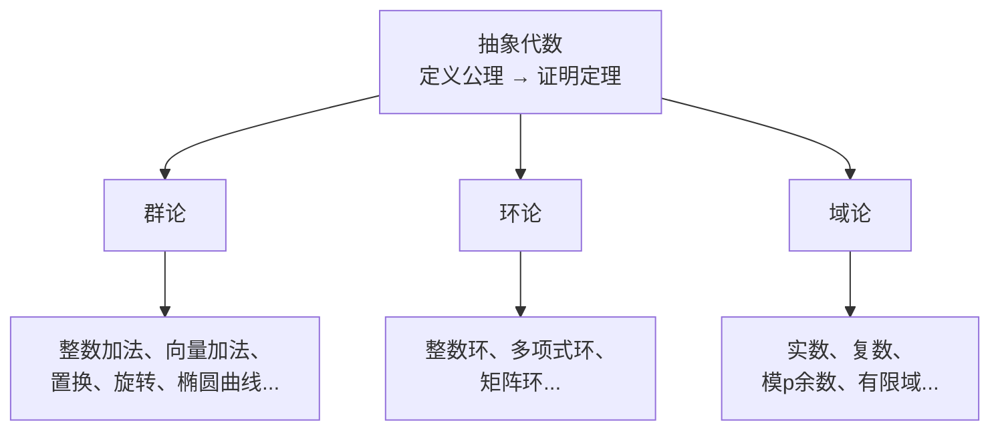
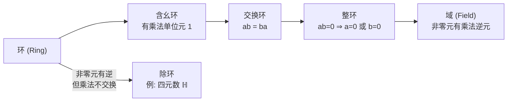
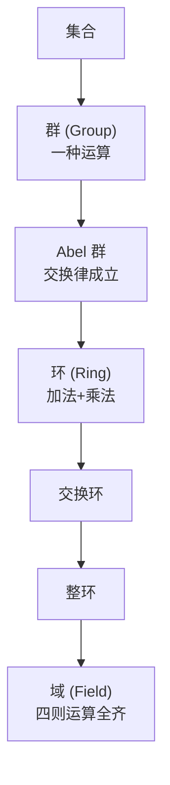

## 一句话

抽象代数不问"元素是什么"，只问"元素之间怎么运算，满足什么规则"。它研究的是**代数结构本身**——一旦证明一条定理，所有满足这些规则的具体系统全部自动适用。

---

## 一、为什么需要抽象代数？

### 从具体到抽象的动机

在初等数学中，你会发现很多看似不同的东西遵守相同的规则：

| 对象 | 运算 | 封闭 | 结合 | 交换 | 有 e | 有逆 |
|------|------|:---:|:---:|:---:|:---:|:---:|
| 整数 | $+$ | ✓ | ✓ | ✓ | 0 | $-a$ |
| 正实数 | $\times$ | ✓ | ✓ | ✓ | 1 | $1/a$ |
| 二维向量 | $+$ | ✓ | ✓ | ✓ | $(0,0)$ | $-\mathbf{v}$ |
| 模 12 | $+$ | ✓ | ✓ | ✓ | 0 | 补到 12 |
| 方阵旋转 | 复合 | ✓ | ✓ | ✗ | 不旋转 | 逆旋转 |

前四行满足完全一样的规则（交换群），第五行也是一个群（但不交换）。如果你证明了"群论"中的 Lagrange 定理，上面**五行全适用**，不需要每行单独证明一次。

> 抽象代数 = <b>数学里的"面向对象编程"</b>：先定义接口（公理），后写通用库（定理），只要一个具体实现（例子）满足了接口，所有库函数全生效。

---

## 二、三大核心结构

### 2.1 群 (Group) — 一种运算

**定义**：集合 $G$ 配上一种运算 $*$，满足四条公理：

| 公理  | 含义               | 形式                                                                 |
| --- | ---------------- | ------------------------------------------------------------------ |
| 封闭性 | 运算结果还在集合里        | $a,b \in G \Rightarrow a * b \in G$                                |
| 结合律 | 括号可以随便加          | $(a*b)*c = a*(b*c)$                                                |
| 单位元 | 存在"不改变任何元素"的特殊元素 | $\exists e \in G, \forall a \in G,\; e*a = a*e = a$                |
| 逆元  | 每个元素都有"抵消者"      | $\forall a \in G, \exists a^{-1} \in G,\; a*a^{-1} = a^{-1}*a = e$ |

**如果还满足交换律** $a*b = b*a$，就叫 **Abel 群（交换群）**。

**典型例子**：

| 群 | 运算 | 交换？ | 大小 |
|----|------|:----:|:----:|
| $\mathbb{Z}$（整数） | $+$ | ✓ | 无限 |
| $\mathbb{Z}_n$（模 n 余数） | $+$ | ✓ | $n$ |
| $\mathbb{R}^+$（正实数） | $\times$ | ✓ | 无限 |
| $\mathbb{R}^n$（向量） | $+$ | ✓ | 无限 |
| $S_n$（n 个元素的排列） | 复合 | ✗（$n \ge 3$） | $n!$ |
| 正方体旋转 | 复合 | ✗ | 24 |
| $\mathbb{Z}_p^*$（模 p 非零余数） | $\times$ | ✓ | $p-1$ |
| 椭圆曲线上的点 | $+$（几何定义） | ✓ | 有限或无限 |

**关键定理**：
- **Lagrange 定理**：子群的大小一定整除原群的大小
- **Cayley 定理**：任何有限群都可以表示为置换群
- 群论是所有代数结构的基础

---

### 2.2 环 (Ring) — 两种运算（加法 + 乘法）

**定义**：集合 $R$ 加上加法 $+$ 和乘法 $\times$，满足：

- $(R, +)$ 是 Abel 群
- $(R, \times)$ 是半群（封闭 + 结合，不一定有单位元或逆元）
- 乘法对加法分配：$a(b+c) = ab + ac$，$(a+b)c = ac + bc$

**乘法可能有、也可能没有的性质**：

| 附加性质 | 额外条件 |
|------|------|
| 有乘法单位元 | $\exists 1,\; a \cdot 1 = 1 \cdot a = a$ |
| 乘法交换 | $ab = ba$ |
| 无零因子 | $ab = 0 \Rightarrow a=0 \text{ 或 } b=0$ |

**重要分类**：

| 环类型 | 条件 | 例子 |
|------|------|------|
| 环 | 基本公理 | 偶数集（无单位元） |
| 含幺环 | + 有单位元 1 | $\mathbb{Z}$ |
| 交换环 | + 乘法交换 | $\mathbb{Z}, \mathbb{R}[x]$ |
| 整环 (Integral Domain) | 含幺 + 交换 + 无零因子 | $\mathbb{Z}$，但不是 $\mathbb{Z}_6$（$2 \times 3 = 0 \bmod 6$） |
| 除环 (Division Ring) | 含幺 + 非零元有逆 | 四元数 $\mathbb{H}$（不交换！） |
| **域 (Field)** | 含幺 + 交换 + 非零元有逆 | $\mathbb{Q}, \mathbb{R}, \mathbb{C}, \mathbb{Z}_p$ |

**关键概念**：
- **理想 (Ideal)**：环里的一种特殊子集，可以用来做模运算——是环论最重要的概念
- **商环 (Quotient Ring)**：环 / 理想 → 类似整数除以 n 得模运算
- $\mathbb{C} \cong \mathbb{R}[x] / (x^2+1)$ 就是"多项式环除以理想 $(x^2+1)$"的结果

---

### 2.3 域 (Field) — 四则运算全齐

**定义**：集合 $F$，加法 $+$ 和乘法 $\times$，满足：
- $(F, +)$ 是 Abel 群（零元 $0$）
- $(F \setminus \{0\}, \times)$ 是 Abel 群（单位元 $1 \neq 0$）
- 分配律

> 域 = **你从小学到大的所有算术规则全部有效**。加减乘除、封闭、有逆，跟实数一模一样。

**典型域**：

| 域 | 元素个数 | 特征 | 例子 |
|----|:----:|:---:|------|
| $\mathbb{Q}$ | 无限 | 0 | 有理数 |
| $\mathbb{R}$ | 无限 | 0 | 实数（完备，但非代数闭） |
| $\mathbb{C}$ | 无限 | 0 | 复数（**代数闭**——多项式必有根） |
| $\mathbb{Z}_p$（$p$ 为素数） | $p$ | $p$ | 模 $p$ 余数（有限域 / Galois 域） |
| $\mathbb{F}_{p^n}$ | $p^n$ | $p$ | 扩域，用于编码理论和密码学 |

---

## 三、结构的层级关系

---

## 四、域扩张：从 $\mathbb{R}$ 到 $\mathbb{C}$ 的抽象版本

### 4.1 核心问题

给定一个域 $F$ 和一个系数在 $F$ 中的多项式 $p(x)$，如果 $p(x)$ 在 $F$ 中没有根，能不能"扩大" $F$ 使得 $p(x)$ 有根——同时保持域结构不崩溃？

### 4.2 复数是最经典的例子

$x^2+1$ 在 $\mathbb{R}$ 中无根。构造：

$$\mathbb{C} \cong \mathbb{R}[x] / (x^2+1)$$

取所有以 $x^2+1$ 为模的多项式：即**把 $x^2+1$ 当成"零"**，等价于加了一条规则 $x^2 = -1$。这就是 $i$。

### 4.3 抽象化之后

| 概念 | 含义 |
|------|------|
| **代数扩张** | 往域里添加一个多项式的根 |
| **分裂域** | 让某个多项式"完全裂开"（全部根都加入）的最小域 |
| **代数闭包** | 一个域的最大代数扩张——$\mathbb{C}$ 是 $\mathbb{R}$ 的代数闭包 |
| **Galois 群** | 域扩张中根的对称性群——解答"为什么五次方程无公式解"的关键 |

---

## 五、重要应用

### 5.1 密码学

| 应用 | 代数结构 |
|------|------|
| RSA | $\mathbb{Z}_n$ 环，$\varphi(n)$（欧拉函数） |
| Diffie-Hellman | $\mathbb{Z}_p^*$ 乘法群（离散对数困难） |
| ECDSA（比特币签名） | 椭圆曲线群（离散对数更困难） |
| AES | $\mathbb{F}_{2^8}$ 有限域上的运算 |

### 5.2 编码理论

- Reed-Solomon 码（CD、DVD、QR 码的纠错）→ $\mathbb{F}_{2^8}$ 有限域
- 没有有限域就没有现代通信和存储

### 5.3 Galois 理论 — 五次方程为什么无公式解

1824 年 Abel 证明：一般的五次及以上方程**不能用根式求解**（不像二/三/四次有公式）。

Galois 的突破：把解方程的困难翻译成了**域扩张的对称性群**的性质。根式可解 ↔ Galois 群是可解群。$n \ge 5$ 时 $S_n$ 不可解 → 无公式。

> 这是抽象代数历史上最辉煌的成就之一——一个人在一个截然不同的领域（群论）里找到了一条定理，然后"翻译"回方程理论，解释了一个悬了两个世纪的难题。

### 5.4 代数几何

Fermat 大定理（$x^n + y^n = z^n$ 对 $n \ge 3$ 无整数解）——Wiles 的证明用了模形式、椭圆曲线、Galois 表示，全部建立在抽象代数之上。

### 5.5 物理学

- 粒子物理的标准模型→ $SU(3) \times SU(2) \times U(1)$ 规范群
- 晶体分类 → 230 种空间群
- 量子力学中的对称性与守恒量 → 群表示论

---

## 六、常见代数结构速查

| 结构 | 加法 | 加法逆 | 乘法 | 乘法交换 | 乘法逆 | 典型例子 |
|------|:---:|:---:|:---:|:---:|:---:|------|
| 半群 | — | — | 封闭+结合 | 可选 | 无 | 自然数加法 |
| 幺半群 | — | — | + 有单位元 | 可选 | 无 | 字符串拼接 |
| 群 | — | — | 封闭+结合+e+逆 | 可选 | ✓ | 整数加法 |
| Abel 群 | ✓ | ✓ | — | ✓ | — | 向量加法 |
| 环 | ✓ Abel | ✓ | 封闭+结合+分配 | 可选 | 无 | $\mathbb{Z}$ |
| 交换环 | ✓ Abel | ✓ | + 交换 | ✓ | 无 | $\mathbb{Z}[x]$ |
| 整环 | ✓ Abel | ✓ | + 无零因子 | ✓ | 无 | $\mathbb{Z}$ |
| **域** | ✓ Abel | ✓ | ✓ | ✓ | ✓（非零元） | $\mathbb{Q}, \mathbb{R}, \mathbb{C}, \mathbb{Z}_p$ |

---

## 七、群-环-域 速记

| | 群 | 环 | 域 |
|---|:---:|:---:|:---:|
| 运算数 | 1 | 2 | 2 |
| 加法 | — | Abel 群 | Abel 群 |
| 乘法 | 就是那个运算 | 封闭+结合+分配 | 非零元构成 Abel 群 |
| 补丁 | — | — | — |
| 能做 | 对称性分析 | 多项式运算 | 所有算术 + 域扩张 + 复分析 |
| 类比 | 旋转、置换 | 整数、多项式 | 实数、复数 |

---

## 相关笔记

- [[复数与二维向量的本质区别]] — 域 vs 向量空间的逐条对比，$\mathbb{C}$ 为什么是域而 $\mathbb{R}^2$ 不是
- [[虚数的诞生与真实应用]] — 虚数从 Bombelli 的三次方程到量子力学的完整历程
- [[球极投影-Stereographic-Projection|球极投影 (Stereographic Projection)]] — $\mathbb{C} \cong S^2 \setminus \{\infty\}$ 的几何构造
