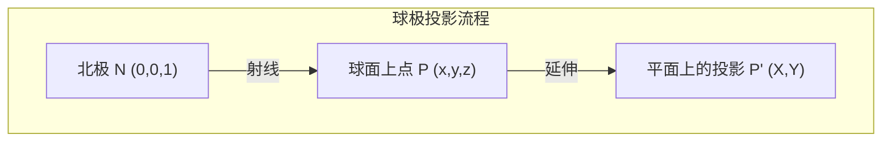
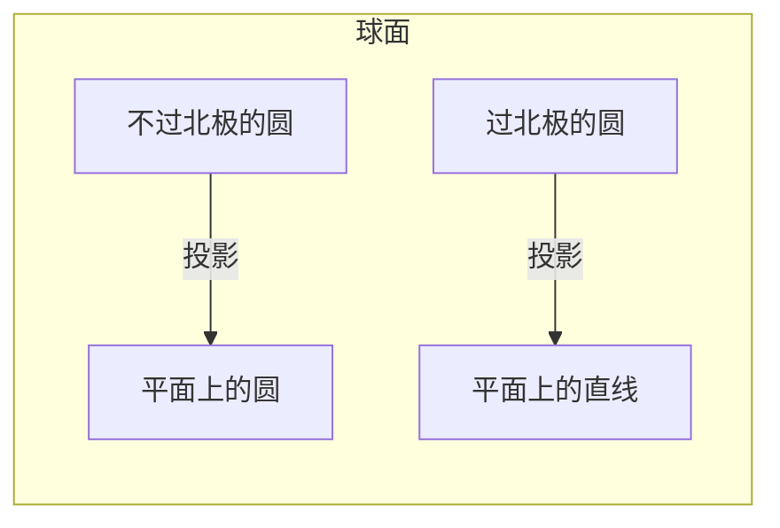

## 直观理解

**球极投影**是把球面（除一个极点外）一一映射到平面的方法。

想象一个地球仪放在桌面上，南极点刚好接触桌面。从**北极**发出一根针，刺穿地球仪表面上的任意一点 P，针继续延伸到桌面——桌面上那个交点 P' 就是 P 的球极投影。

## 数学构造

### 设定

- 单位球面: $S^2 = \{(x,y,z) \mid x^2 + y^2 + z^2 = 1\}$
- 北极: $N = (0, 0, 1)$
- 投影平面: $z = 0$（即 xy-平面）

### 投影公式

从北极 N 出发到球面上点 $P = (x, y, z)$ 的射线参数方程:

$$\gamma(t) = N + t(P - N) = (0,0,1) + t(x, y, z-1), \quad t \in \mathbb{R}$$

当 $t=0$ 时在 N，$t=1$ 时在 P，$t>1$ 时射线继续延伸到平面。

求与平面 $z=0$ 的交点：令 $\gamma_z(t) = 1 + t(z-1) = 0$，解得:

$$t = \frac{1}{1-z}$$

代入得到投影坐标:

$$\boxed{(X, Y) = \left(\frac{x}{1-z},\; \frac{y}{1-z}\right)}$$

### 逆映射

从平面点 $(X, Y)$ 反求球面点 $(x, y, z)$:

$$\boxed{(x, y, z) = \left(\frac{2X}{1+X^2+Y^2},\; \frac{2Y}{1+X^2+Y^2},\; \frac{X^2+Y^2-1}{1+X^2+Y^2}\right)}$$

验证: $x^2+y^2+z^2 = 1$ 恒成立。

### 北极点

当 $z \to 1$（靠近北极）时，$1-z \to 0$，$X,Y \to \infty$——北极在平面上**没有对应点**，对应的是"无穷远"。

反之，当 $X^2+Y^2 \to \infty$ 时，$(x,y,z) \to (0,0,1) = N$。

## 核心性质

### 1. 保圆性 — 球面上的圆 ↔ 平面上的圆或直线

球面上**不经过北极**的任意圆 → 投影到平面上仍为圆。

球面上**经过北极**的圆（大圆或小圆）→ 投影到平面上为**直线**。

> 直觉: 经过北极的圆在投影时，北极那个点"射向无穷远"，因此圆在平面上被"拉开"成了直线。

### 2. 保角性 (Conformal) ⭐

球极投影是**保角映射**：球面上两条曲线的交角 = 投影后平面上两条曲线的交角。

这意味着小范围内，球极投影**保持形状**，不扭曲局部几何（只缩放）。

> 为什么保角？球极投影的 Jacobian 是标量乘以旋转矩阵，即局部是相似变换。这源自于它是反演 (inversion) 与反射的复合。

### 3. 保向性 (Orientation-Preserving)

球极投影保持定向——球面上的逆时针方向对应平面上的逆时针方向（当北极在上、南极点在下时）。

### 4. 一一对应 (Bijection)

$$S^2 \setminus \{N\} \longleftrightarrow \mathbb{R}^2$$

北极 N → 无穷远点 $\infty$

加上无穷远点后:

$$S^2 \longleftrightarrow \hat{\mathbb{C}} = \mathbb{C} \cup \{\infty\}$$

## 与其他变换的关系

球极投影可以分解为以下变换的复合:

1. **平移**: 将球心移到原点（若尚未在原点）
2. **反演 (Inversion)**: 以北极 N 为中心、半径为 $\sqrt{2}$ 的球面反演
3. **反射**: 关于平面 $z=0$ 的反射

这也是球极投影保圆的深层原因——反演和反射都保圆（或把圆变成直线）。

## 球极投影的两种常见构造

### 构造 A: 北极投影到赤道面 (本文使用的)

- 投影中心: 北极 $(0,0,1)$
- 投影面: $z=0$
- 公式: $(X,Y) = (\frac{x}{1-z}, \frac{y}{1-z})$

### 构造 B: 北极投影到南极点切平面

- 投影中心: 北极 $(0,0,1)$
- 投影面: $z=-1$
- 公式: $(X,Y) = (\frac{2x}{1-z}, \frac{2y}{1-z})$

两种构造只差一个常数因子 2，性质完全相同。

## 重要应用

### 1. Riemann 球面与复分析

在复平面上引入**唯一的无穷远点** $\infty$，通过球极投影将 $\hat{\mathbb{C}} = \mathbb{C} \cup \{\infty\}$ 等同于球面 $S^2$。

复变量 $z = X + iY \in \mathbb{C}$ 对应球面点:

$$(x, y, z) = \left(\frac{2\,\text{Re}(z)}{1+|z|^2},\; \frac{2\,\text{Im}(z)}{1+|z|^2},\; \frac{|z|^2-1}{1+|z|^2}\right)$$

**作用**:
- **Mobius 变换** $z \mapsto \frac{az+b}{cz+d}$ 可以理解为球面的刚体旋转后重新投影——这是球极投影最优雅的应用之一
- 无穷远点有了具体的几何对应，极限/奇点行为可视化
- 复函数 $f: \hat{\mathbb{C}} \to \hat{\mathbb{C}}$ 成为球面到球面的映射

### 2. 墨卡托投影的中间步骤

Mercator 投影 = **球极投影** + **对数映射**:

$$\text{Mercator}(x,y,z) = \ln\left(\frac{x+iy}{1-z}\right)$$

### 3. 物理学

- **Bloch 球**: 量子比特的纯态对应球面上的点，球极投影给出 Bloch 球坐标
- **磁单极子 (Dirac Monopole)**: Dirac 弦的位置正好是球极投影的投影中心
- **Penrose 图 / Twistor 理论**: 时空的共形紧化

### 4. 晶体学与地质学

- **Wulff 网 (Wulff Net)**: 晶体方向的球极投影图，广泛用于 X 射线衍射分析
- **Schmidt 网**: 等面积变体，用于构造地质学中节理/层理的统计分析

### 5. 计算机图形学

- 天空盒/环境贴图的参数化
- 鱼眼镜头的数学模型

## 球面上的度量

球极投影在平面上诱导出的度量:

$$ds^2 = \frac{4}{(1+X^2+Y^2)^2}(dX^2 + dY^2)$$

这是球面度量在投影坐标下的表示，分母中的系数反映了投影造成的面积缩放——离原点越远（靠近北极），缩放越大。

## 与其他投影的对比

| 投影 | 保角 | 保面积 | 保圆 |
|------|:----:|:-----:|:----:|
| **球极投影** | ✓ | ✗ | ✓ |
| Lambert 等面积投影 | ✗ | ✓ | ✗ |
| 正交投影 | ✗ | ✗ | ✗ |
| 心射投影 (Gnomonic) | ✗ | ✗ | ✗ (测地线→直线) |

球极投影是**唯一**同时保角且保圆的球面到平面的映射。

---

## 相关笔记

- [[虚数的诞生与真实应用]] — 虚数从三次方程到量子力学的完整历程
- [[复数与二维向量的本质区别]] — 复数作为域与二维向量作为向量空间的根本差异
- [[抽象代数入门]] — 群、环、域的完整入门，复数作为域扩张的经典案例
