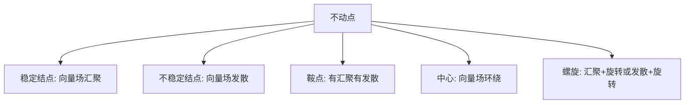

## 一句话概括

**相空间是"舞台"，向量场是舞台上的"风向图"** —— 告诉你站在每个位置该往哪走、走多快。

---

## 定义

### 相空间（Phase Space）

对于 $n$ 自由度系统，相空间是 $2n$ 维流形，由广义坐标 $q_i$ 和广义动量 $p_i$ 共同张成：

$$
\mathcal{M} = \{ (q_1, \dots, q_n,\; p_1, \dots, p_n) \}
$$

每个点代表系统在某一时刻的**完整状态**。

### 向量场（Vector Field）

哈密顿方程在相空间每一点定义一个切向量：

$$
\dot{q}_i = \frac{\partial H}{\partial p_i}, \qquad \dot{p}_i = -\frac{\partial H}{\partial q_i}
$$

写成向量场形式：

$$
\mathbf{V}(\mathbf{q}, \mathbf{p}) = 
\begin{pmatrix}
\partial H / \partial p_1 \\
\vdots \\
\partial H / \partial p_n \\
-\partial H / \partial q_1 \\
\vdots \\
-\partial H / \partial q_n
\end{pmatrix}
$$

这个 $\mathbf{V}$ 就是**哈密顿向量场**，它是相空间切丛的一个截面。

---

## 三层关系

| 层面 | 相空间 | 向量场 |
|:---|:---|:---|
| 几何 | 底流形（舞台） | 流形上切丛的截面 |
| 物理 | 系统所有可能状态 | 系统演化的瞬时方向与速率 |
| 动力学 | 轨迹存在的空间 | 轨迹上任一点的切线方向 |

---

## 三个核心性质

### 1. 积分曲线 = 轨迹

向量场通过解微分方程产生**流（flow）**。从任一初态出发，向量场给出唯一的一条积分曲线 —— 这就是系统在相空间中的演化轨迹。

$$
\gamma(t) = \Phi_t(\mathbf{x}_0), \quad \dot{\gamma}(t) = \mathbf{V}(\gamma(t))
$$

### 2. 零散度（刘维尔定理）

哈密顿向量场的散度恒为零：

$$
\nabla \cdot \mathbf{V} = \sum_{i=1}^{n} \left( \frac{\partial^2 H}{\partial q_i \partial p_i} - \frac{\partial^2 H}{\partial p_i \partial q_i} \right) \equiv 0
$$

**物理含义**：相空间体积在演化中守恒。没有"源"也没有"汇"，流体不可压缩。这是保守系统区别于耗散系统的本质特征。

### 3. 不动点 = 向量场零点

平衡点处 $\mathbf{V} = \mathbf{0}$。不动点附近的向量场局部结构决定系统的定性行为：

---

## 保守系统 vs 耗散系统

| 性质 | 保守（哈密顿）系统 | 耗散系统 |
|:---|:---|:---|
| 向量场散度 | $\nabla \cdot \mathbf{V} = 0$ | $\nabla \cdot \mathbf{V} < 0$（局部） |
| 相体积 | 守恒（刘维尔定理） | 收缩 |
| 吸引子 | 无（至多有中心） | 有（不动点、极限环、混沌吸引子） |
| 能量 | 守恒 | 耗散 |
| 长期行为 | 准周期或混沌 | 落入吸引子 |

---

## 直观类比

> 把相空间想象成一片地形图：相空间是整张地图，每个点是一个可能状态；向量场是每个点上画的小箭头，指示水流方向；轨迹是扔一片树叶进去，它沿箭头流动的路径。

- **保守系统**：水流不可压缩，树叶永远漂着，不会沉到某个点
- **耗散系统**：水中有漩涡（吸引子），树叶最终会被吸入不动点或极限环

---

## 相关概念

- [[哈密顿力学]] — 哈密顿方程与相空间
- [[刘维尔定理]] — 相体积守恒
- [[庞加莱截面]] — 降维观察相空间流
- [[不动点稳定性分析]] — 向量场零点附近的定性分类
- [[吸引子]] — 耗散系统的归宿