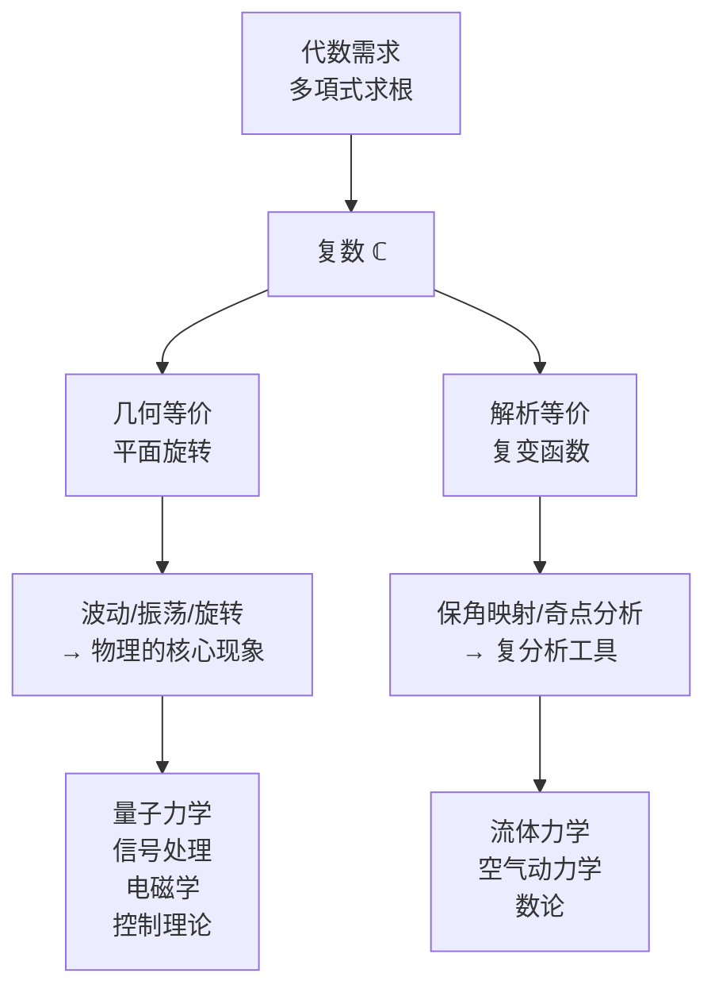

## 一句话

虚数不是数学家凭空想象的概念游戏——它是在求解**三次方程**时被强行逼出来的，此后在物理和工程的几乎每一个角落证明了自己的不可或缺。

---

## 一、虚数的诞生：一个尴尬的"中间人"

### 1.1 背景：三次方程的求根公式

16 世纪意大利，解三次方程是数学界的"顶级竞技"。1530 年代，Tartaglia（塔尔塔利亚）发现了三次方程 $x^3 + px = q$ 的解法，1545 年 Cardano（卡尔达诺）将其发表于 *Ars Magna*（《大术》）：

$$x = \sqrt[3]{\frac{q}{2} + \sqrt{\frac{q^2}{4} + \frac{p^3}{27}}} + \sqrt[3]{\frac{q}{2} - \sqrt{\frac{q^2}{4} + \frac{p^3}{27}}}$$

### 1.2 尴尬：公式算不出实根

方程 **$x^3 = 15x + 4$** 有三个实根，其中一个显然是 $x=4$（验算：$4^3 = 64 = 15 \times 4 + 4$）。

但代入 Cardano 公式：

$$x = \sqrt[3]{2 + \sqrt{-121}} + \sqrt[3]{2 - \sqrt{-121}}$$

出现了 $\sqrt{-121}$。在当时的观念里，负数开平方是"无意义的"——公式失效了。

这个困境叫 **casus irreducibilis**（不可约情形）。

### 1.3 Bombelli 的大胆操作（1572）

Rafael Bombelli（拉斐尔·邦贝利）在 *L'Algebra*（《代数学》）中做了一个前无古人的举动——**假装 $\sqrt{-1}$ 存在，并按正常代数规则运算**。

他命名了运算规则（世界历史上第一次）：

$$\sqrt{-1} \cdot \sqrt{-1} = -1$$
$$(-\sqrt{-1}) \cdot \sqrt{-1} = 1$$

然后假设：

$$\sqrt[3]{2 + \sqrt{-121}} = 2 + \sqrt{-1}$$
$$\sqrt[3]{2 - \sqrt{-121}} = 2 - \sqrt{-1}$$

两项相加：$\sqrt{-1}$ 和 $-\sqrt{-1}$ 抵消：

$$x = (2 + \sqrt{-1}) + (2 - \sqrt{-1}) = 4$$

**完美！** 虚数作为"中间桥梁"，最终互相抵消，产出了一个真实的根。

> Bombelli 的原话大意：*这东西初看像诡辩，但我找到了证明。*

### 1.4 接受之路：两百年的怀疑

| 时期 | 人物 | 态度 |
|------|------|------|
| 1572 | Bombelli（邦贝利） | 首次系统运算，给出四则运算规则 |
| 1637 | Descartes（笛卡尔） | 造"imaginary"一词（贬义："想象中的、不真实的"） |
| 1702 | Leibniz（莱布尼茨） | "虚数是圣灵在存在与非存在之间的奇妙飞翔" |
| 1748 | Euler（欧拉） | 引入 $i$ 符号，证明 $e^{i\theta} = \cos\theta + i\sin\theta$ |
| 1797 | Wessel（韦塞尔） | 首次用平面上点表示复数 |
| 1806 | Argand（阿尔冈） | 独立提出 Argand 图（复平面），给出几何解释 |
| 1831 | Gauss（高斯） | 正式建立复数的几何基础，命名"复数" |

关键转折是 **几何解释**：一旦复数被理解为平面上的点（$a+bi$ 对应坐标 $(a,b)$），它就不再是"想象"出的怪物，而是一个自然且完整的几何对象。

---

## 二、复数真正发挥不可替代作用的场景

从"可有可无的计算技巧"变成"没有它理论就崩溃"的核心工具。

### 2.1 量子力学 ⭐⭐⭐

**复数在量子力学中不是可选工具——是必需的。**

Schrodinger（薛定谔）方程：

$$i\hbar\frac{\partial}{\partial t}\psi = \hat{H}\psi$$

波函数 $\psi$ 本身是**复数**。没有 $i$，量子力学无法描述干涉、叠加、相位演化。

**Bell（贝尔）不等式实验（2022 年诺贝尔物理学奖）** 证明了：任何只用实数的理论都无法重现量子力学的预测。复数在量子理论中不是方便——是**本质**。

> 2022 年 Aspect（阿斯派克特）、Clauser（克劳泽）、Zeilinger（塞林格）诺奖工作的核心结论之一：自然是复数的，不是实数的。

### 2.2 信号处理与 Fourier（傅里叶）分析

任意实信号 $f(t)$ 的频谱 $F(\omega)$ 是**复数**：

$$F(\omega) = \int_{-\infty}^{\infty} f(t) e^{-i\omega t} dt$$

复数承载了两种物理信息：
- **幅度** $|F(\omega)|$ — 该频率有多强
- **相位** $\arg F(\omega)$ — 该频率的波形在时间轴上的偏移

没有复数，你只能知道"有这个频率"，不知道"这个频率的波在什么位置"——相位信息丢失，信号无法还原。

> MP3 压缩、JPEG 图像、MRI 成像、地震勘探数据处理的底层全是复数 FFT。

### 2.3 电磁学与交流电路

**阻抗** 是复数——电阻是实部，电抗（电感+电容的"反抗"）是虚部：

$$Z = R + i\left(\omega L - \frac{1}{\omega C}\right)$$

交流电路分析中，$i$ 自动处理**相位差**：电感使电流落后电压 90°，电容使电流超前 90°。没有复数，你必须用微分方程手动处理这些偏移；有了复数，欧姆定律 $V = IZ$ 原封不动照用。

> 你家里每个电器的电源适配器、电网的功率因数校正，设计时都在算复数。

### 2.4 控制理论

Laplace（拉普拉斯）域和 $s$ 平面是复平面。控制系统是否**稳定**，取决于传递函数的极点是否全部在左半复平面（$\text{Re}(s) < 0$）。

$$G(s) = \frac{Y(s)}{U(s)}$$

**Nyquist（奈奎斯特）判据**、**Bode（伯德）图**、**根轨迹**——所有控制理论的经典工具都建立在复数上。

没有复数 = 没有自动控制 = 没有自动驾驶、工业机器人、飞行器稳定系统。

### 2.5 流体力学与空气动力学

**保角映射（conformal mapping）** 是复分析的核心应用。

Joukowski（茹科夫斯基）变换：

$$z' = z + \frac{a^2}{z}$$

将一个圆映射为**机翼截面**，同时保持流线不变。复分析让你用简单的"绕圆柱流动"来精确计算复杂翼型上的升力。

> 你每次坐飞机，飞机能飞起来背后的升力计算，是靠复变函数。

### 2.6 量子计算

量子比特的状态：

$$|\psi\rangle = \alpha|0\rangle + \beta|1\rangle, \quad \alpha,\beta \in \mathbb{C}, \quad |\alpha|^2 + |\beta|^2 = 1$$

量子门是**酉矩阵**（复数矩阵，$U^\dagger U = I$）。量子态的干涉和纠缠——量子计算比经典计算快的**全部来源**——本质是复数振幅的叠加与抵消。

### 2.7 数论

Riemann（黎曼）$\zeta$ 函数：

$$\zeta(s) = \sum_{n=1}^{\infty} \frac{1}{n^s}, \quad s \in \mathbb{C}$$

Riemann 假设（"$\zeta(s)$ 的所有非平凡零点的实部都是 $1/2$"）是数学界最大的未解问题。但 $\zeta$ 函数的非平凡零点与**素数分布**直接相关——破解它就能精确理解素数的统计规律。

> 复分析是通往数论最深秘密的钥匙。

### 2.8 广义相对论与宇宙学

Penrose 的 **twistor 理论**、Hawking 的 **欧氏量子引力**、引力波数据分析，核心工具都是复几何与复分析。

### 2.9 代数基本定理

$$n \text{ 次复系数多项式在 } \mathbb{C} \text{ 中恰好有 } n \text{ 个根（计重数）}$$

这个定理只有在复数域中才成立。在实数域中，$x^2+1=0$ 无根。复数让多项式方程"不再有无解的尴尬"——**复数是代数运算的自然终点**。

---

## 三、深层逻辑：复数为什么如此普遍？

核心原因是两件事的**巧合**：

1. **代数上**，引入 $\sqrt{-1}$ 让所有多项式都有根（代数封闭）
2. **几何上**，$\sqrt{-1}$ 恰好对应**90° 旋转**（$i \cdot z$ 就是把 $z$ 转 90°）

而自然界的几乎所有基本现象——波、振动、旋转、振荡——都涉及"相位"，而相位本质上就是旋转。所以复数自然成为描述自然界最简洁的语言。

---

## 四、时间线总结

| 年代 | 事件 |
|------|------|
| 1545 | Cardano 发表三次方程公式，遭遇 casus irreducibilis |
| 1572 | Bombelli 首次系统运算虚数，从 $\sqrt{-121}$ 算出 $x=4$ |
| 1637 | Descartes 命名"imaginary" |
| 1748 | Euler 公式 $e^{i\theta}=\cos\theta+i\sin\theta$ |
| 1797-1806 | Wessel 和 Argand 发现复平面 |
| 1831 | Gauss 奠定复数几何基础 |
| 1860s | Maxwell 用复数建立电磁学 |
| 1926 | Schrodinger 方程中的 $i$——复数进入量子力学 |
| 2022 | 诺奖实验确认：量子力学本质是复数的 |

从 Bombelli 发现 $\sqrt{-1}$ 到今天量子计算，走过了 450 年。一个最初被嘲笑为"诡辩"的数学技巧，最终成为描述宇宙最基本的语言。
