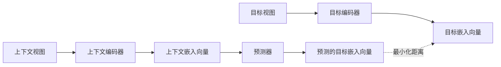
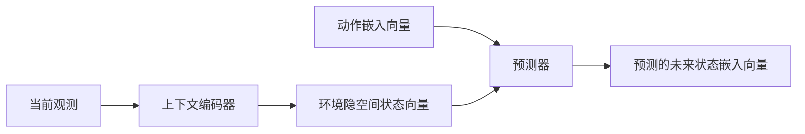

# JEPA 详解 — 联合嵌入预测架构核心原理

## 1. JEPA 的核心概念：视图 (View)

### 1.1 什么是视图

**视图** = 对输入的变换、掩码或局部观测，保留底层语义状态的同时隐藏或删除部分信息。

示例：一只猫坐在沙发上——
- 完整图像
- 左半部分 / 右半部分 / 放大裁切局部
- 加掩码的版本
- 不同相机角度拍摄
- 视频中的不同帧

尽管感官观测不同，它们的表征大致对应同一个底层世界状态："猫坐在沙发上"。

### 1.2 隐空间的统一性

所有展现同一概念的各类句子或图像，在高维隐空间中指向**同一个位置**。不同视图的嵌入向量虽不完全相同，但彼此接近，共同指向底层语义。

## 2. JEPA 的训练逻辑

### 2.1 核心机制

- 一个视图作为**上下文** (context)
- 另一个视图作为**目标** (target)
- JEPA **不重建像素、不预测 token**，而是将两类视图都转换成隐空间嵌入向量
- 学习从上下文嵌入向量**预测**目标嵌入向量

### 2.2 为什么不预测像素/token

**像素/token 预测的问题——目标充满熵 (噪声)**：

| 问题 | 具体表现 |
|------|---------|
| 文本多表述性 | 同一语义有多种表述方式，没有唯一正确答案 |
| 图像无关细节 | 背景噪声、光照变化、纹理随机性 |
| 重建误差噪声 | 始终充满不可预测的信息 |

模型被迫适配所有内容，包括本质不可预测的信息——**噪声让预测难度无端升高**。

**隐空间预测的优势**：

| 隐空间预测 | 效果 |
|-----------|------|
| 噪声自然过滤 | 目标嵌入向量只包含压缩后的抽象信息和语义 |
| 预测器最小化与目标嵌入的距离 | 只被引导建模不同视图间的稳定结构 |
| 不受噪声干扰 | 学习重心从"像素具体是什么"转向"有哪些潜在因素可以解释两种观测状态" |

> 注意：JEPA 不代表模型无法识别像素或文本内容，只是训练目标不在像素级重建。

## 3. JEPA 的三大核心组件

### 3.1 上下文编码器 (Context Encoder)

- 接收上下文视图 (可见图像块、文本等)
- 输出对应的嵌入向量
- 通过梯度直接训练

### 3.2 目标编码器 (Target Encoder)

- 接收目标视图 (被掩码的图像块、未来片段等)
- 输出目标嵌入向量——代表"接下来实际会发生的内容"
- 与上下文编码器处于同一表征空间

### 3.3 预测器 (Predictor)

- 接收上下文嵌入向量
- 生成对应的目标嵌入向量
- 本质：预测下一阶段或缺失观测的表征

**训练目标**：唯一的目标是在表征空间中实现对齐——没有像素重建损失，没有 token 交叉熵损失。

**长期效果**：编码器会学习表征物体位置、空间结构、运动、动态场景、物理关系等核心信息，而非仅学习表层统计特征或靠暴力拟合语义。

**推理阶段**：通常只需要上下文编码器，作为特征提取器或隐空间状态估计器使用。

## 4. JEPA 的三种应用场景

### 4.1 表征提取

输入图像/视频片段 → 上下文编码器 → 嵌入向量 → 用于分类、检索、相似度搜索、下游有监督微调

JEPA 相当于一个**基础表征模型**。

### 4.2 世界建模的隐空间预测

加入预测器后：当前状态嵌入向量 → 预测未来状态嵌入向量

- 不需要预测未来视频帧，只预测未来隐空间状态
- 计算成本更低，聚焦语义动态而非纹理细节
- 不需要生成额外视觉 token，节省大量成本

典型：Video JEPA (VJEPA)

### 4.3 隀空间规划模型 (Latent Planning)

加入动作条件后：

- 规划过程中**不生成任何像素**
- 系统在执行动作前，在内部推演可能的结果
- 动作序列和状态转换都以嵌入向量形式表征
- 所有计算在表征空间而非像素空间进行
- 效率高，还能捕捉环境底层动态规律

## 5. 隐空间的三项必要条件

JEPA 能正常工作的前提——隐空间必须满足：

### 5.1 信息充分性

嵌入向量必须包含物体位置、速度、交互约束等关键变量。缺失重要变量 → 预测毫无意义。

### 5.2 一致性与可预测性

两个相似但有细微差异的状态，生成的嵌入向量不应相差过大。否则预测器无法学习稳定动态规律。

### 5.3 支持规划的结构

预测器需要学习在条件动作作用下，不同状态之间的平滑过渡。嵌入空间几何结构不合理 → 预测轨迹偏移、累积误差、无法对应现实结果。

> **最关键的一点**: 表征必须包含足够信息，不能发生坍塌。

## 6. 表示坍塌 (Representation Collapse)

### 6.1 什么是坍塌

JEPA 不需要重建像素，也没有内置噪声机制。两个编码器可能找到捷径：

- 上下文编码器 → 所有输入输出同一个固定向量 $\mathbf{z}_c$
- 目标编码器 → 所有输入输出同一个固定向量 $\mathbf{z}_t$
- 预测器 → 不管上下文是什么，输出同一个 $\mathbf{z}_c$

结果：汽车、建筑生成完全一样的向量，训练损失极低，但模型**没有学到任何信息**。

类比：考试只检查答案一致性，学生全填"A"满分——但什么也没学到。

### 6.2 为什么坍塌容易发生

坍塌能让损失保持在很低水平 → 模型天然倾向于这条捷径 → **非常容易发生**。

## 7. 防坍塌方案演进

### 7.1 方案一：指数移动平均 (EMA)

**机制**：
- 目标编码器不通过梯度直接训练
- 通过上下文编码器权重的**滑动平均**缓慢更新
- 目标编码器变化极慢，像上下文编码器的延迟版本

**效果**：
- 系统无法立刻坍塌到输出固定嵌入向量
- 预测器需不断适配持续缓慢变化的表征

**局限**：
- 只是训练技巧，**不是有理论依据的优化目标**
- 没有对应损失函数，无法直接最小化优化
- 基于启发式规则
- 稳定性取决于 EMA 更新策略、权重共享和训练动态
- 需要手动调参，比较脆弱

**使用 EMA 的早期 JEPA**：I-JEPA (图像)、V-JEPA (视频)、DINO (自监督视觉)

### 7.2 方案二：信息最大化 (Information Maximization)

**起源**：Bell & Sejnowski (1995) — 好的表征应尽可能保留输入的全部信息，最大化输入和表征之间的**互信息**。

**优势**：不需要 EMA，添加正则项强制嵌入空间保持信息丰富度。

分两个子方向：

#### (A) 样本对比法 (Sample Contrastive)

**代表**：SimCLR (2020)

- 同一图像生成两个增强视图 → 嵌入向量拉近
- 其他图像的嵌入向量 → 推远 (负样本)
- 嵌入空间自动调整：相似内容接近，无关样本分开

**缺点**：
- 高度依赖负样本，需大批次其他图像
- 训练计算成本高，难以扩展

#### (B) 维度对比法 (Dimensional Contrastive)

**代表**：Barlow Twins、VICReg

- 关注嵌入向量本身的结构，不与不同样本对比
- 确保表征的每个维度捕捉输入的不同信息 (形状、位置、纹理、运动状态)
- 惩罚不同维度间的冗余，强制各维度具备多样性

**进步**：不再需要大批次负样本

**局限**：仍依赖多个损失项 + 仔细平衡的超参数

### 7.3 方案三：LeJEPA (2025年11月) — 直接约束几何结构

**核心思路**：直接约束嵌入向量空间的整体几何结构，引导嵌入向量服从**各项同性高斯分布** (isotropic Gaussian)。

**直觉**：
- 嵌入空间像一个点云，每个输入对应一个点
- 坍塌时 → 所有点缩成一个点、一条线或一个平面，很多维度不再承载信息
- LeJEPA → 引导嵌入向量呈现**均匀的圆球**，所有维度的方差相近

**效果**：
- 不需要依赖 EMA 就能训练，同时避免坍塌
- 目标函数更简单
- 标准视觉基准上，表现与 VICReg、Barlow Twins、SimCLR 相当甚至更好
- ImageNet 上准确率与 DINO 持平

> LeJEPA 的 SIGReg 实现细节见 [[LeWorldModel 详解 — 极简世界模型与 JEPA 的收敛定律]]

### 方案演进总览

| 方案 | 年份 | 核心机制 | 超参数 | 负样本需求 | 理论基础 |
|------|------|---------|--------|-----------|---------|
| EMA | ~2023 | 滑动平均目标编码器 | 多 (更新率等) | 无 | 启发式 |
| SimCLR | 2020 | 样本对比 | 多 | 大批次 | 信息最大化 |
| Barlow Twins / VICReg | 2021 | 维度去相关 | 多 | 无 | 信息最大化 |
| **LeJEPA** | 2025 | 各项同性高斯约束 | **1** | **无** | **Cramér-Wold 定理** |

## 8. JEPA 为什么不适合大语言模型

### 8.1 语言 vs 感知数据的本质差异

| 维度 | 语言 | 图像/视频 |
|------|------|----------|
| 数据性质 | 符号化、压缩后的表征 | 感知数据，充满底层噪声 |
| 噪声程度 | 极低 (token 已去掉感知噪声) | 极高 (纹理、光照、背景) |
| 不可预测细节 | 很少 | 大量 |
| 自回归训练 | 成熟、高信噪比反馈信号 | — |

### 8.2 核心结论

JEPA 设计要解决的"去掉不可预测的感知噪声"问题，在文本场景**不突出**。下一个 token 预测本身已在高语义层面运作，且语序等约束天然隐含在自回归目标中。

**JEPA 大概率不是预测文本的最优设计**，但它不是为语言设计的——杨立昆说"大语言模型注定有局限"是指拓展到语言之外 (真实世界数据) 的场景。

## 9. JEPA 的前沿应用：医学影像

### 9.1 EchoJEPA — 超声心动图

**医学影像的特殊性**：

- 大量噪声和伪影：斑点噪声、传感器伪影、探头角度不一致、设备失真
- 医生不关心像素分布，关心稳定解剖学信号：心腔大小、心肌壁运动、瓣膜开合速度
- 这些恰恰是 JEPA 擅长学习的——不可预测的噪声无法从上下文稳定预测，模型被迫关注解剖结构中的稳定特征

**EchoJEPA 的训练**：

- 从前面的帧预测后续心脏运动的表征
- 编码心脏几何结构、运动模式
- 不记忆超声图像中的噪声纹理
- 表征与心脏真实生理结构高度对齐
- 对诊断测量等下游任务非常有用

> **JEPA 有潜力成为医学领域主流方法**——医学影像充满不可预测噪声，而临床关心的恰好是稳定的结构和动态。

## 10. 核心要点总结

1. **视图是 JEPA 的基础概念**：不同观测对应同一底层语义，JEPA 在隐空间对齐它们
2. **不预测像素/token**：因为目标充满熵/噪声，隐空间预测自然过滤噪声
3. **三大组件**：上下文编码器 + 目标编码器 + 预测器，唯一目标是在表征空间中对齐
4. **坍塌是致命弱点**：模型可能给所有输入输出同一向量，损失极低但什么也没学到
5. **防坍塌方案在演进**：从启发式 EMA → 信息最大化 (样本/维度对比) → LeJEPA 的几何约束
6. **LeJEPA 是当前最优方案**：1 个超参数、理论基础坚实 (Cramér-Wold)、效果与 DINO 持平
7. **不适合 LLM**：语言本身已是压缩表征，噪声极少，自回归已足够
8. **医学影像是最佳应用场景**：噪声高、临床关注稳定结构，JEPA 天然适配

## 相关概念

- [[LeWorldModel 详解 — 极简世界模型与 JEPA 的收敛定律]] — LeJEPA 的 SIGReg 实现与世界模型应用
- [[表示坍塌]] — Representation Collapse 详解 (待创建)
- [[Cramér-Wold 定理]] — 高维分布的投影判定 (待创建)
- [[SimCLR]] — 样本对比自监督方法 (待创建)
- [[VICReg]] — 维度对比防坍塌方法 (待创建)
- [[Barlow Twins]] — 维度去相关方法 (待创建)
- [[DINO]] — 自监督视觉方法，使用 EMA (待创建)
- [[Sora]] — 生成式世界模型代表