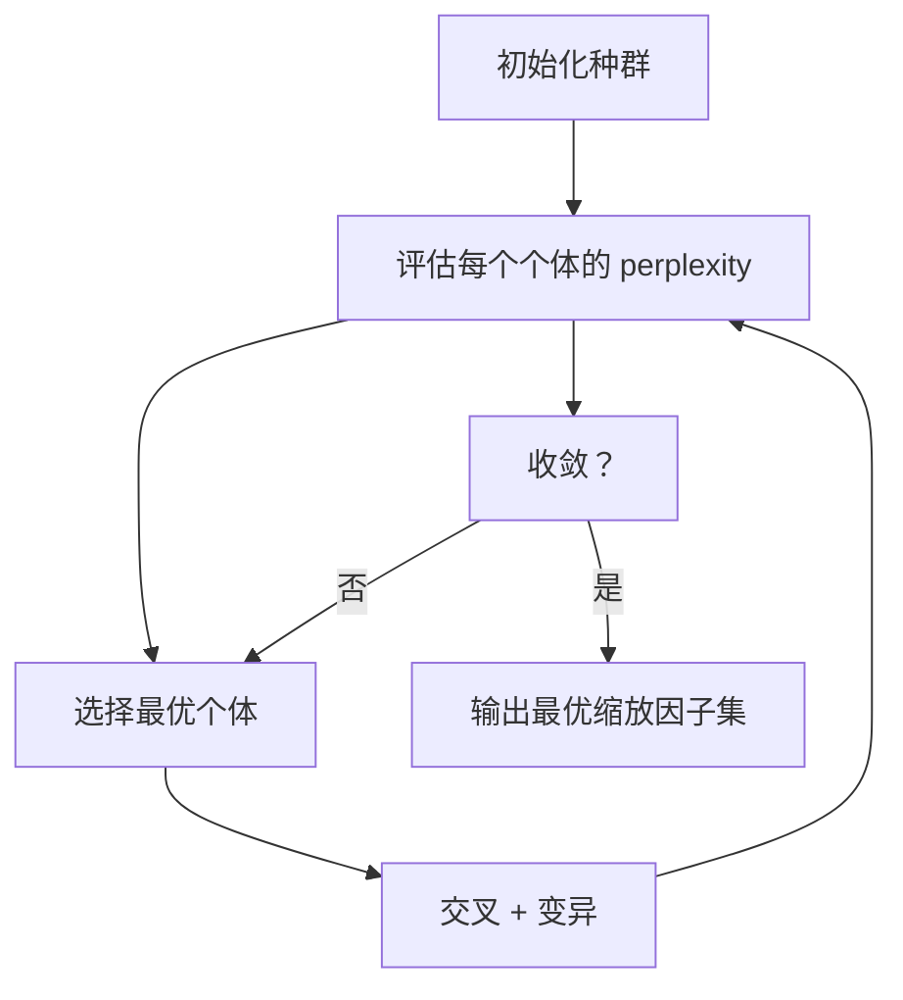
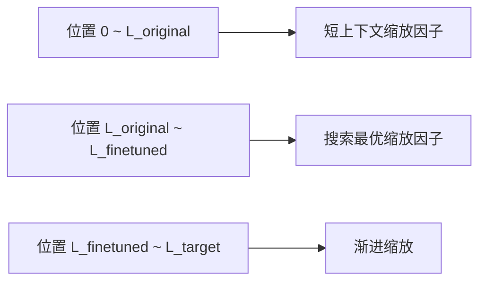

# LongRoPE: Extending Large Language Model Context Beyond 2M Tokens

> 论文：LongRoPE: Extending Large Language Model Context Beyond 2M Tokens
> 作者：Yiran Ding, Likai Tang, Zhuowei Du, Di Liu, Zihan Wang, Zhiyuan Liu, Yuzhe Ma, Hao Peng, Maosong Sun
> 机构：清华大学、微软研究院、伊利诺伊大学香槟分校
> 发表时间：2024 年 2 月
> Arxiv：[2402.13753](https://arxiv.org/abs/2402.13753)
> PDF：[本地下载](LongRoPE.pdf) | [Arxiv PDF](https://arxiv.org/pdf/2402.13753)

---

## 一、问题背景

使用 RoPE 的 LLM（如 LLaMA、Mistral）在训练时有固定上下文长度（如 2048 或 4096）。直接外推到更长序列会导致性能急剧下降——注意力分数分布混乱，困惑度飙升。

已有方案的问题：

| 方法 | 缩放策略 | 最大扩展 | 问题 |
|------|---------|---------|------|
| **Position Interpolation (PI)** | 均匀缩放所有维度 | ~8K | 均匀缩放导致短上下文性能损失 |
| **NTK-aware** | 只缩放低频分量 | ~32K | 仍假设单调重要性递减 |
| **YaRN** | 单调分段缩放 + 温度调整 | ~128K | 需微调，短上下文性能仍有损失 |
| **Dynamic NTK** | 动态调整 base | ~32K | 不够精细 |

**核心矛盾**：先前所有方法都假设 RoPE 维度的重要性是<b>单调递减</b>的（高频维度重要，低频维度不重要），并据此做均匀或单调缩放。但这个假设是错误的。

---

## 二、核心发现：RoPE 维度的非单调性

LongRoPE 发现了两个此前被忽略的 RoPE 性质：

### 2.1 非单调位置增量

不同维度的位置 ID 不必单调递增。某些维度可以在扩展时使用**较小的位置值**，即使它们在原始模型中对应较大的位置值。这意味着：

- 不需要把所有维度的位置都均匀压缩
- 有些维度可以保留原始频率，有些需要大幅压缩
- 最优缩放因子的分布不是单调的

### 2.2 不均匀的维度重要性

不同维度对上下文扩展的重要性不同，且这种重要性**不是单调的**：

- **传统假设**：$\text{dim}_0$（最高频）最重要 → $\text{dim}_d$（最低频）最不重要
- **实际发现**：$\text{dim}_3$ 比 $\text{dim}_1$ 更重要，$\text{dim}_7$ 比 $\text{dim}_5$ 更重要...

这意味着需要对**每个维度单独搜索最优缩放因子**，而非统一缩放。

---

## 三、方法：进化搜索算法

### 3.1 搜索目标

为 RoPE 的每个维度 $i$ 搜索最优缩放因子 $\lambda_i$：

$$
\theta_i' = \frac{\theta_i}{\lambda_i}
$$

其中 $\theta_i = \text{base}^{-2i/d}$ 是原始频率，$\lambda_i$ 是维度 $i$ 的缩放因子。

目标：最小化扩展上下文窗口上的困惑度（perplexity）。

### 3.2 进化搜索流程

**关键设计**：

1. **搜索空间**：每个维度 $i$ 的缩放因子 $\lambda_i$ 的范围是 $[1, s]$，其中 $s$ 是目标扩展比例
2. **种群初始化**：包含已知方案（PI、NTK-aware、YaRN）作为种子个体
3. **评估指标**：使用模型在扩展上下文上的 perplexity
4. **约束**：搜索过程需要高效（几分钟内完成）

### 3.3 搜索 vs 手动设计

| 对比   | 手动设计 (YaRN) | 进化搜索 (LongRoPE) |
| ---- | ----------- | --------------- |
| 缩放因子 | 手动公式，单调递减   | 搜索结果，非单调        |
| 优化目标 | 直觉 + 经验规则   | perplexity 最小化  |
| 精细度  | 分段（3段）      | 逐维度             |
| 最优性  | 可能接近最优      | 理论上更接近全局最优      |

---

## 四、两阶段渐进扩展策略

### 4.1 为什么需要渐进？

直接从 2K 扩展到 128K/2M 会造成：
- 缩放因子范围过大，搜索空间爆炸
- 微调数据需要覆盖极长上下文，成本高
- 性能难以同时保持短上下文和长上下文

### 4.2 Stage 1：微调扩展到中等长度

原始：$2\text{K} \xrightarrow{\text{Stage 1 微调}} 128\text{K}$

- 使用进化搜索找到 128K 的最优缩放因子
- 在 128K 长度的数据上微调模型
- 微调只需少量长上下文数据

### 4.3 Stage 2：无微调渐进扩展至 2M

$128\text{K} \xrightarrow{\text{Stage 2 无微调}} 2048\text{K} (2\text{M})$

- 利用 Stage 1 发现的缩放因子
- 通过渐进缩放（progressive extension）进一步扩展
- **无需额外微调**

### 4.4 混合缩放策略

在不同位置范围应用不同缩放：

- **短上下文范围**：使用专门的短上下文缩放因子，保持原始窗口内性能
- **微调范围**：使用进化搜索找到的最优缩放因子
- **超微调范围**：使用渐进缩放（逐步增大缩放因子）

---

## 五、短上下文性能恢复

### 5.1 问题

长上下文扩展后，模型在原始短上下文窗口内的性能可能下降（因为缩放因子改变了原始位置编码的行为）。

### 5.2 解决方案：双缩放因子

为原始上下文窗口内的位置使用**不同的缩放因子**：

$$
\lambda_i^{\text{short}} = \text{进化搜索找到的短上下文最优因子}
$$

$$
\lambda_i^{\text{long}} = \text{进化搜索找到的长上下文最优因子}
$$

实际推理时，根据当前序列长度动态切换缩放因子集。

---

## 六、实验结果

### 6.1 上下文扩展规模

| 模型         | 原始窗口 | 扩展后窗口         | 扩展倍数        |
| ---------- | ---- | ------------- | ----------- |
| LLaMA2-7B  | 2K   | **128K → 2M** | 64x → 1000x |
| LLaMA2-70B | 4K   | **128K**      | 32x         |

### 6.2 困惑度（Perplexity）对比

在长上下文任务上，LongRoPE 的 perplexity 显著低于 YaRN 和 PI：

| 方法           | LLaMA2-7B 128K PPL | LLaMA2-7B 2M PPL |
| ------------ | ------------------ | ---------------- |
| PI           | ~10+               | 爆炸               |
| YaRN         | ~5-6               | ~8+              |
| **LongRoPE** | **~3-4**           | **~4-5**         |

### 6.3 短上下文性能

关键：LongRoPE 在原始上下文窗口内的任务上**几乎没有性能损失**：

- 常规 benchmark（MMLU、HumanEval 等）得分与原始模型一致
- 短上下文困惑度保持在原始水平
- 这是通过双缩放因子策略实现的

### 6.4 下游任务

- **Passkey Retrieval**：在 128K/2M 长度的文本中检索隐藏的密钥，成功率接近 100%
- **LongBench**：在长上下文问答和摘要任务上表现优异
- **Perplexity 曲线**：在整个扩展范围内保持平滑，无突变

---

## 七、与其他方法的详细对比

### 7.1 缩放因子分布

- **PI**：$\lambda_i = s$（所有维度相同）→ 均匀
- **NTK-aware**：$\lambda_i \approx s^{2i/d}$（单调递增）→ 单调
- **YaRN**：$\lambda_i$ 为分段函数（单调递增，3段过渡）→ 单调分段
- **LongRoPE**：$\lambda_i$ 为进化搜索结果（非单调，逐维度优化）→ 非单调精细

### 7.2 综合对比

| 特性     | PI  | NTK-aware | YaRN  | **LongRoPE**   |
| ------ | --- | --------- | ----- | -------------- |
| 缩放精细度  | 全统一 | 粗分段       | 3段单调  | **逐维度搜索**      |
| 是否需要微调 | 是   | 部分        | 是     | **Stage 1 仅需** |
| 短上下文恢复 | 差   | 一般        | 一般    | **优秀**         |
| 最大扩展   | ~8K | ~32K      | ~128K | **2M**         |
| 非单调性   | 无   | 无         | 无     | **有**          |
| 搜索成本   | 无   | 无         | 无     | **几分钟**        |

---

## 八、关键公式速查

### 原始 RoPE 频率

$$
\theta_i = \text{base}^{-2i/d}
$$

### LongRoPE 缩放频率

$$
\theta_i' = \frac{\theta_i}{\lambda_i}
$$

其中 $\lambda_i$ 通过进化搜索获得，**不保证单调**。

### 混合缩放

$$
\theta_i'(m) = \frac{\theta_i}{\lambda_i(m)}
$$

$$
\lambda_i(m) = \begin{cases}
\lambda_i^{\text{short}} & m \leq L_{\text{original}} \\
\lambda_i^{\text{search}} & L_{\text{original}} < m \leq L_{\text{finetuned}} \\
\lambda_i^{\text{progressive}}(m) & m > L_{\text{finetuned}}
\end{cases}
$$

---

## 九、一句话总结

> LongRoPE 通过进化搜索发现 RoPE 各维度的最优非单调缩放因子，结合渐进扩展和双缩放策略，将 LLM 上下文从 2K 扩展至 2M tokens，同时完美保持短上下文性能。

---

## 相关概念

- [[RoPE旋转位置编码详解]] — RoPE 基础原理
- [[YaRN - RoPE 上下文扩展]] — YaRN 方法详解
- [[Transformer架构从零理解]] — Transformer 整体架构
- [[注意力机制详解]] — 注意力核心原理

---

## 术语表

| 缩写          | 全称                                        | 中文            |
| ----------- | ----------------------------------------- | ------------- |
| RoPE        | Rotary Position Embedding                 | 旋转位置编码        |
| PPL         | Perplexity                                | 困惑度           |
| PI          | Position Interpolation                    | 位置插值          |
| NTK         | Number Theoretic Transform-aware          | 数论变换感知缩放      |
| YaRN        | Yet another RoPE extensioN method         | 另一种 RoPE 扩展方法 |
| LLM         | Large Language Model                      | 大语言模型         |
| MMLU        | Massive Multitask Language Understanding  | 大规模多任务语言理解    |
| L           | Context Window Length                     | 上下文窗口长度       |
| $\lambda_i$ | Rescaling Factor for dimension $i$        | 维度 $i$ 的缩放因子  |
| $\theta_i$  | Original RoPE Frequency for dimension $i$ | 维度 $i$ 的原始频率  |

---

## 参考资料

1. LongRoPE Paper: "LongRoPE: Extending Large Language Model Context Beyond 2M Tokens" (Ding et al., 2024) — [arxiv 2402.13753](https://arxiv.org/abs/2402.13753)
2. YaRN Paper: "YaRN: Efficient Context Window Extension of Large Language Models" (Peng et al., 2023)
3. PI Paper: "Extending Context Window of Large Language Models via Position Interpolation" (Chen et al., 2023)
4. RoPE Paper: "RoFormer: Enhanced Transformer with Rotary Position Embedding" (Su et al., 2021)