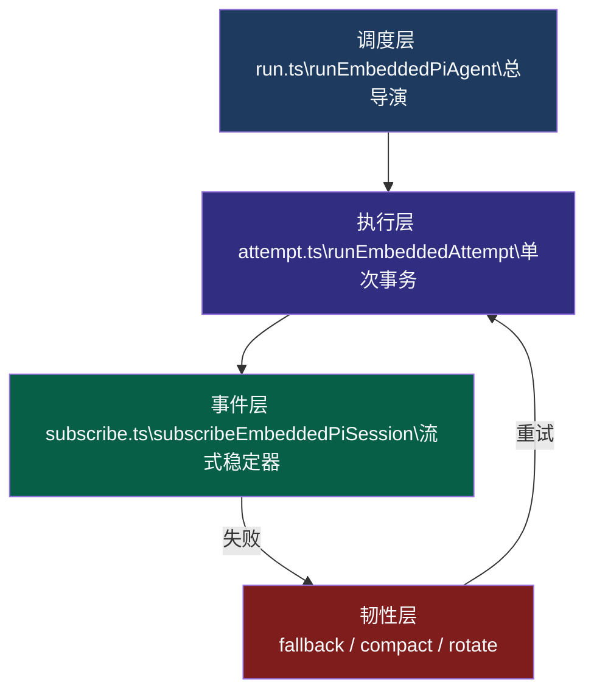
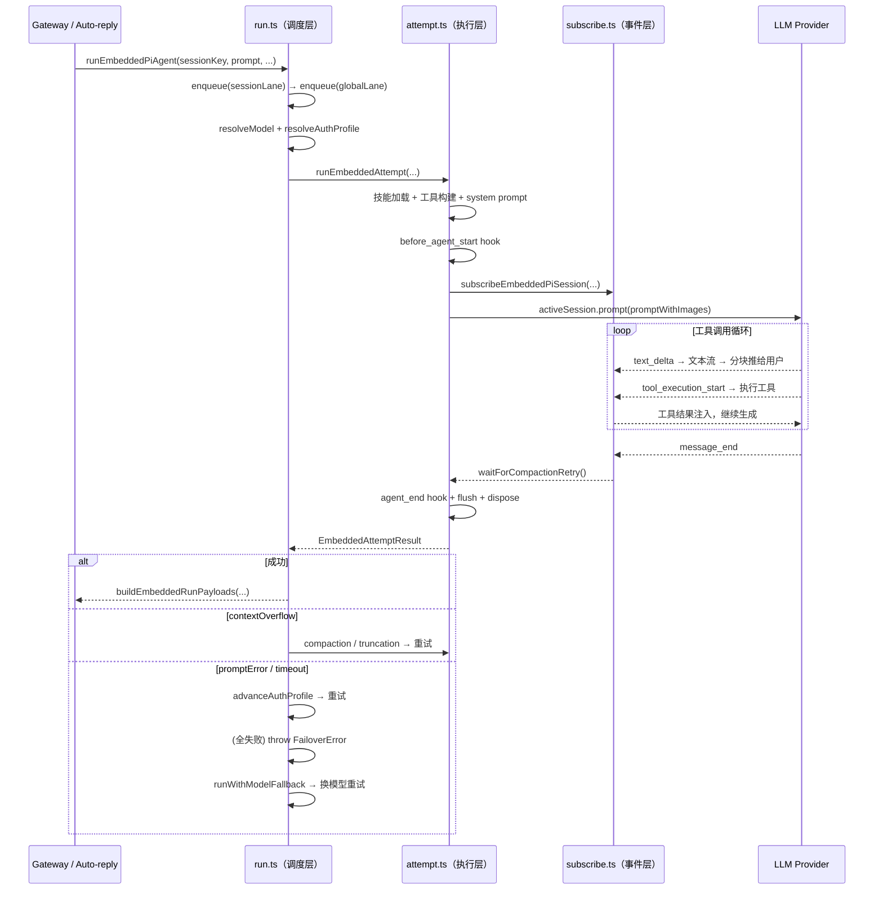

# pi-agent-core 是什么

> 一句话：**pi-agent-core 是 OpenClaw 自研的 Agent 执行引擎**，是整个系统"真正和 LLM 对话"的那一层。Gateway、通道、路由、插件、技能——这些都是外壳，pi 才是核。

---

## 一、为什么叫 "pi"

"pi" 是 OpenClaw 内部对这套 Agent 执行运行时的代号。你在源码里会看到大量带 `pi` 前缀的文件和函数：

```
src/agents/
├── pi-embedded.ts               ← pi 的嵌入式入口
├── pi-embedded-runner/
│   ├── run.ts                   ← 调度层（runEmbeddedPiAgent）
│   ├── run/attempt.ts           ← 执行层（runEmbeddedAttempt）
│   ├── run/payloads.ts          ← 回复拼装
│   ├── lanes.ts                 ← 并发 Lane 解析
│   └── runs.ts                  ← 活跃 Run 注册表
├── pi-embedded-subscribe.ts     ← 流式事件订阅
└── pi-embedded-helpers/
    ├── errors.ts                ← 错误分类
    └── thinking.ts              ← thinking 降级
```

**"Embedded"（嵌入式）** 这个词的意思是：pi-agent-core 直接运行在 Gateway 进程内部，与之对应的还有 `runCliAgent` 路径（把 AI 调用委托给外部 CLI 进程）。两条路径对称设计，上层统一处理结果。

---

## 二、pi 在系统中处于什么位置

```
用户消息
    ↓
通道（Telegram / 飞书 / Discord）
    ↓
Gateway（路由、鉴权、分发）
    ↓
auto-reply / agent RPC
    ↓
┌─────────────────────────────────┐
│         pi-agent-core           │  ← 你问的这层
│                                 │
│  调度层 → 执行层 → 事件层          │
│  工具调用循环 / 流式输出 / 压缩     │
└─────────────────────────────────┘
    ↓
LLM Provider（Anthropic / OpenAI / 阿里百炼 / Gemini / Ollama ...）
```

<span style="color:rgb(255, 77, 77)">pi 是 OpenClaw 和 LLM 之间的 "翻译层 + 编排层"</span>。它<span style="color:rgb(195, 117, 255)">对上屏蔽了各家 LLM 的协议差异</span>，<span style="color:rgb(195, 117, 255)">对下统一输出事件流。</span>

---

## 三、pi 做了哪些事

### 3.1 多 Provider 统一抽象

pi 内部处理了各家 LLM 的细节差异。比如在 `sanitizeSessionHistory` 里，针对不同 provider 有不同的对话格式清洗逻辑：

```ts
// Gemini 严格要求 user → assistant 交替
const validatedGemini = transcriptPolicy.validateGeminiTurns
  ? validateGeminiTurns(prior)
  : prior;

// Anthropic 同样严格交替，但规则略有不同
const validated = transcriptPolicy.validateAnthropicTurns
  ? validateAnthropicTurns(validatedGemini)
  : validatedGemini;
```

这些差异对 Gateway 和上层调用方完全透明。

---

### 3.2 三层状态机架构

pi-agent-core 的执行结构是一个三层状态机，每层职责分明：



| 层 | 函数 | 职责 |
|----|------|------|
| **调度层** | `runEmbeddedPiAgent` | 双层排队、上下文窗口预检、外层错误决策 |
| **执行层** | `runEmbeddedAttempt` | 单次完整 LLM 调用、技能加载、工具构建、Hook 注入 |
| **事件层** | `subscribeEmbeddedPiSession` | 把底层 SSE 流稳定为上层事件（文本流 / 工具流 / 压缩流） |
| **韧性层** | 三层恢复机制 | 失败后自动恢复（见下一节） |

---

### 3.3 工具调用循环

pi 内部实现了完整的工具调用循环（Tool Use Loop）：

```
prompt(用户消息)
    ↓
LLM 生成 → 发现 tool_call
    ↓
执行工具（bash / 浏览器 / 文件 / 消息发送 ...）
    ↓
把工具结果注入对话历史
    ↓
LLM 继续生成 → 直到 stop_reason = "end_turn"
    ↓
返回最终回复
```

这个循环在 `activeSession.prompt()` 内部自动处理，调用方只需等待最终结果。

---

### 3.4 流式事件输出

pi 把 LLM 的 SSE 流转成稳定的三类事件，推送给上层：

```
LLM 原始 SSE
    │
    ├─ text_delta → 文本流 → assistantTexts[]
    │                └─ 分块推送（BlockChunker）→ 提前显示给用户
    │
    ├─ tool_execution_start → 工具流 → toolMetas[]
    │                          └─ 先 flush 文本，再显示"正在执行工具"
    │
    └─ compaction → 压缩流 → waitForCompactionRetry()
                     └─ 防止压缩期间"假完成"
```

**关键设计**：`tool_execution_start` 是 async fire-and-forget，失败只记 debug 日志，不阻断工具执行本身。

---

### 3.5 三层失败恢复

这是 <span style="color:rgb(195, 117, 255)">pi 最核心的"工业级能力"</span>。一次 LLM 调用失败后，pi 会按顺序尝试三层恢复：

```
LLM 调用失败
    │
    ▼
第一层：thinking 降级
    从错误消息里解析 "supported values: none, low" 这类提示
    → 同一模型，降低 thinking level 重试
    │
    ▼（无可降级 level）
第二层：auth profile 轮换
    同一 provider 可配多个 key/账号
    → 切到下一个未在冷却期的 profile，重试
    │
    ▼（所有 profile 冷却/耗尽）
第三层：模型 fallback
    按 agents.defaults.model.fallbacks 列表
    → 依次尝试备用模型（如 claude → gpt-4.1 → qwen）
    │
    ▼（全部失败）
    抛出汇总错误（含每次尝试的 FallbackAttempt[] 记录）
```

**设计精髓**：只有 `FailoverError` 才会触发 fallback，业务逻辑错误（用户问题）直接报给用户，不被恢复链吞掉。

---

### 3.6 上下文溢出恢复

当<span style="color:rgb(195, 117, 255)">上下文超出模型窗口时</span>，pi 有独立的恢复链（和失败恢复链并行）：

```
contextOverflowError
    │
    ▼
第一步：compaction（最多 3 次）
    把历史对话压缩成摘要，腾出 token 空间
    │
    ▼（compaction 失败 or 已达 3 次）
第二步：toolResult 截断（仅一次）
    超过 context 30% 或 40 万字符的工具结果 → 截断保留前 2000 字符
    截断成功后 → 重置 compaction 计数，允许再 compact
    │
    ▼（全部无效）
返回用户可读错误
    "Context overflow: prompt too large for the model."
```

---

## 四、并发设计：双 Lane 模型

pi 通过<span style="color:rgb(195, 117, 255)">"双层队列"保证并发安全：</span>

```ts
// 每次调用都排两次队，不是一次
const sessionLane = `session:${sessionKey}`;  // 同 session 串行
const globalLane  = CommandLane.Main;          // 全局限流

return enqueue(sessionLane, () =>
  enqueue(globalLane, async () => {
    // ... 实际执行
  })
);
```

| Lane                                                             | 作用                                         |
| ---------------------------------------------------------------- | ------------------------------------------ |
| <span style="color:rgb(255, 77, 77)"><b>session lane</b></span>  | 同一用户的消息严格串行，不会乱序                           |
| <span style="color:rgb(195, 117, 255)"><b>global lane</b></span> | 保护全局资源（model registry / auth store），控制总并发数 |

`ACTIVE_EMBEDDED_RUNS` 注册表跟踪每个 sessionId 当前的 Run 句柄，支持：
- `queueMessage()` — <span style="color:rgb(195, 117, 255)">向正在运行的 session 注入消息（steer）</span>
- `abort()` — <span style="color:rgb(195, 117, 255)">中断当前 run</span>
- 带 handle 匹配的清理（防止新 run 被旧 finally 块误删）

---

## 五、完整数据流



---

## 六、最小复刻骨架

来自 TrackB `07-AI框架总原理.md` 的精华总结：

```ts
// 第一版：先抄 3 层
async function runAgentTurn(req: Req) {
  return enqueue(req.sessionLane, () =>
    enqueue(req.globalLane, async () => {
      const handle = registerActive(req.sessionId);
      try {
        return await runAttempt(req);   // 单次 LLM 调用
      } catch (err) {
        return await runWithFallback(err, req);  // 失败恢复
      } finally {
        clearActive(req.sessionId, handle);  // 必须带 handle 匹配
      }
    }),
  );
}
```

**第二版再补 2 层**：
1. `runs`（active run 注册表 + steer/abort 能力）
2. `model-fallback`（跨模型兜底）

---

## 七、自检：你真正理解了吗

1. **为什么 run/attempt/subscribe 要三层分离？**
   - <span style="color:rgb(255, 77, 77)">run 负责"什么时候跑、跑多少次"</span>，<span style="color:rgb(195, 117, 255)">attempt 负责"一次怎么跑完"</span>，<span style="color:rgb(0, 176, 240)">subscribe 负责"把流稳定下来"</span>。三层各管一件事，互不干扰。

2. **为什么工具策略必须代码层约束，不能靠提示词？**
   - <span style="color:rgb(195, 117, 255)">提示词是建议，模型可以忽略</span>；<span style="color:rgb(255, 77, 77)">代码层策略是硬约束</span>，<span style="color:rgb(0, 176, 240)">模型根本拿不到被过滤掉的工具定义</span>。

3. **为什么 compaction 必须等稳定后才能"完成"？**
   - 如果压缩还在飞行中就返回"完成"，上层会认为 run 结束，导致压缩结果丢失、下次调用上下文不一致。

4. **为什么 clearActiveEmbeddedRun 要做 handle 匹配？**
   - 防止新 run 启动后，旧 run 的 `finally` 块把新 run 的注册记录误删，导致新 run 无法被 abort/steer。

5. **为什么超时不触发 auth profile 轮换？**
   - <span style="color:rgb(255, 77, 77)">超时是"服务暂时慢"</span>，<span style="color:rgb(195, 117, 255)">不是"这个 key 坏了"</span>；<span style="color:rgb(0, 176, 240)">轮换 profile 解决不了网络超时</span>，反而浪费了 key 的使用机会。
