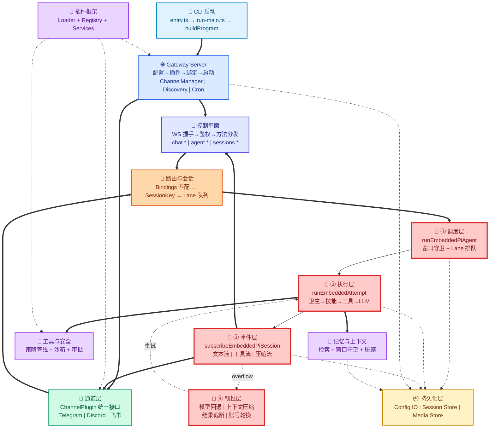
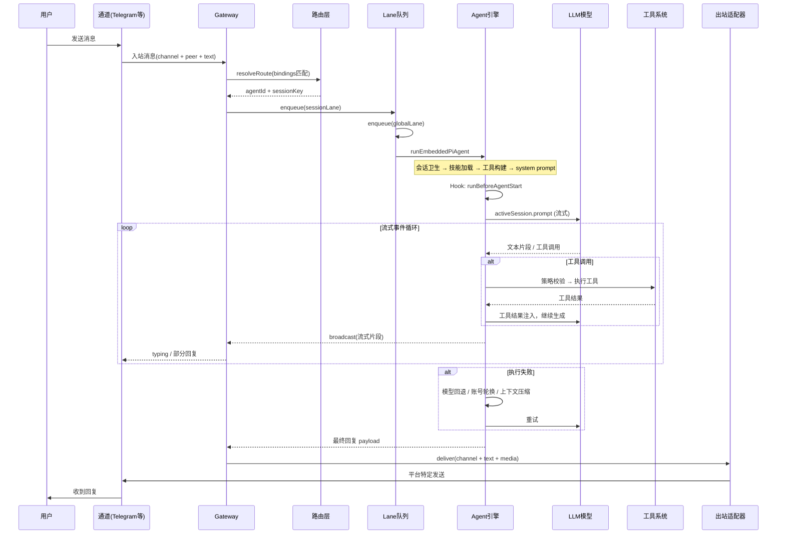
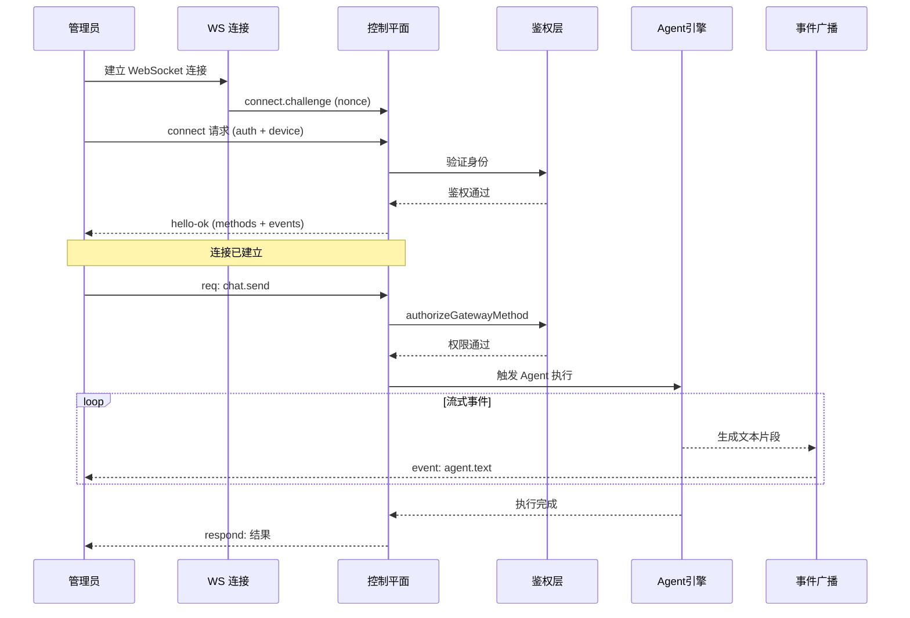

# OpenClaw 架构总览与学习路线

## 一、系统全景架构图

### 架构分层说明

```
┌─────────────────────────────────────────────────────────────┐
│  🚀 入口层: CLI 启动与命令路由                                │
├─────────────────────────────────────────────────────────────┤
│  🌐 Gateway 层: 配置加载、插件初始化、服务编排                │
├─────────────────────────────────────────────────────────────┤
│  🔐 控制平面 (WS RPC)  |  💬 通道层 (平台消息)  ← 双入口      │
├─────────────────────────────────────────────────────────────┤
│  🔀 路由层: Bindings 匹配 → SessionKey → Lane 队列            │
├─────────────────────────────────────────────────────────────┤
│  🧠 Agent 引擎: 调度→执行→事件→韧性 (核心)                   │
├─────────────────────────────────────────────────────────────┤
│  🔧 工具  |  💾 记忆  |  🔌 插件  ← 支撑系统                  │
├─────────────────────────────────────────────────────────────┤
│  📦 持久化层: Config / Session / Media                       │
└─────────────────────────────────────────────────────────────┘
```

### 详细架构图



### 核心模块详解

| 层级 | 模块 | 核心职责 | 关键文件 |
|------|------|---------|---------|
| **L1 入口** | CLI | 命令路由与环境初始化 | `entry.ts`, `run-main.ts` |
| **L2 网关** | Gateway | 服务编排与运行时管理 | `server.impl.ts` |
| **L3 双入口** | 控制平面 | WS RPC 远程管理 | `ws-connection.ts`, `server-methods.ts` |
| **L3 双入口** | 通道层 | 多平台消息适配 | `types.plugin.ts`, `server-channels.ts` |
| **L4 路由** | 路由与会话 | 消息路由与会话隔离 | `resolve-route.ts`, `session-key.ts` |
| **L5 核心** | Agent 引擎 | AI 执行的四层状态机 | `run.ts`, `attempt.ts`, `subscribe.ts` |
| **L6 支撑** | 工具系统 | 策略过滤与安全审批 | `pi-tools.ts`, `tool-policy-pipeline.ts` |
| **L6 支撑** | 记忆系统 | 长期记忆与上下文管理 | `memory/`, `compaction.ts` |
| **L6 支撑** | 插件框架 | 动态扩展能力 | `loader.ts`, `registry.ts` |
| **L7 持久化** | 存储层 | 配置、会话、媒体存储 | `config-io.ts`, `session-store.ts` |

## 二、控制平面详解

### 什么是控制平面

**控制平面（Control Plane）是 OpenClaw Gateway 的远程管理和控制中心**，通过 WebSocket RPC 协议提供对整个系统的远程操作能力。

### 通俗理解

- **通道层**：用户和 AI 对话的入口（Telegram/Discord 等平台）
- **控制平面**：管理员操作系统的入口（通过 WebSocket RPC）

### 核心职责

#### 1. 连接管理

```
客户端 → WS 连接 → connect.challenge → 握手验证 → hello-ok
```

- 处理 WebSocket 连接的建立
- 发送 `connect.challenge`（带 nonce）
- 验证客户端身份（协议版本/origin/auth/device）
- 握手成功返回 `hello-ok`（包含可用方法、事件、快照）

#### 2. 协议校验

- 使用 AJV Schema 校验所有请求帧
- 统一错误码和参数格式
- 确保通信协议的正确性

#### 3. 权限鉴权

- `authorizeGatewayMethod` 进行 role + scope 校验
- 只有通过鉴权的方法才能执行
- 防止未授权操作

#### 4. 方法分发

提供丰富的 RPC 方法，允许远程控制系统：

| 方法类别 | 功能 | 典型场景 |
|---------|------|---------|
| `chat.*` | 发送消息、中止、查看历史 | 远程发送消息给 AI |
| `agent.*` | 启动/等待 Agent | 触发 AI 执行任务 |
| `sessions.*` | 列出/修改/重置会话 | 管理所有对话会话 |
| `node.*` / `device.*` | 节点和设备管理 | 多节点协同 |
| `config.*` / `skills.*` | 配置和技能管理 | 热更新配置 |
| `send` / `channels.*` | 消息发送和通道管理 | 主动推送消息 |
| `exec.approval.*` | 命令审批 | 审批高风险命令 |
| 运维方法 | logs/usage/cron | 监控和运维 |

#### 5. 事件广播
- 通过 `broadcast` 推送实时事件
- 支持 agent/chat/presence/heartbeat 等事件
- 实现流式响应和状态同步

### 三个 "总闸"

1. **连接总闸**：`connect` 握手必须成功，否则直接关闭
2. **权限总闸**：`authorizeGatewayMethod` 不通过直接拒绝
3. **带宽总闸**：限制 payload 大小，防止单连接拖垮系统

### 控制平面的四层架构

| 层级 | 模块 | 职责 |
|------|------|------|
| 连接层 | `ws-connection.ts` | 谁能连进来，连进来后身份是什么 |
| 协议层 | `protocol/index.ts` | 帧结构校验（AJV），错误码统一 |
| 方法层 | `server-methods.ts` | 这个 method 是否允许执行，以及执行逻辑 |
| 状态与事件层 | `server-runtime-state.ts` | 连接集合、幂等缓存、流式事件、慢消费者丢弃 |

### 控制平面 vs 通道层

| 对比维度 | 控制平面 | 通道层 |
|---------|---------|--------|
| **协议** | WebSocket RPC | 各平台原生协议（HTTP/WebSocket） |
| **用户** | 管理员/开发者 | 终端用户 |
| **功能** | 系统管理和控制 | 消息收发 |
| **鉴权** | role + scope 细粒度鉴权 | 通道平台鉴权 |
| **典型场景** | 远程管理、监控、配置 | 用户与 AI 对话 |

### 核心源码入口

- `src/gateway/server/ws-connection.ts` - 连接生命周期
- `src/gateway/server/ws-connection/message-handler.ts` - 消息处理
- `src/gateway/server-methods.ts` - 方法分发
- `src/gateway/auth.ts` - 鉴权逻辑
- `src/gateway/protocol/index.ts` - 协议定义

### 什么是 RPC 方法

**RPC = Remote Procedure Call(远程过程调用)**

**核心理念**: 像调用本地函数一样调用远程服务器上的函数。

#### 本地调用 vs RPC 调用

```javascript
// 本地函数调用
const result = calculateSum(1, 2);

// RPC 远程调用(看起来一样,但在远程服务器执行)
const result = await rpcClient.call('calculateSum', [1, 2]);
```

#### OpenClaw 的 RPC 请求格式

```json
{
  "id": "req-123",
  "method": "chat.send",
  "params": {
    "agentId": "default",
    "text": "Hello AI"
  }
}
```

#### OpenClaw 的 RPC 方法完整列表

| 方法类别 | 方法名 | 功能说明 | 使用场景 |
|---------|--------|---------|---------|
| **chat.*** | `chat.send` | 发送消息给 AI | 远程触发对话 |
| | `chat.abort` | 中止当前对话 | 停止执行中的任务 |
| | `chat.history` | 查看对话历史 | 获取历史消息 |
| **agent.*** | `agent.start` | 启动 Agent | 触发 AI 执行任务 |
| | `agent.wait` | 等待 Agent 完成 | 同步等待结果 |
| **sessions.*** | `sessions.list` | 列出所有会话 | 查看活跃会话 |
| | `sessions.patch` | 修改会话配置 | 动态调整参数 |
| | `sessions.reset` | 重置会话 | 清空对话历史 |
| **node.*** | `node.register` | 注册节点 | 多节点协同 |
| | `node.unregister` | 注销节点 | 节点下线 |
| **device.*** | `device.pair` | 设备配对 | 授权新设备 |
| | `device.unpair` | 取消配对 | 撤销设备授权 |
| **config.*** | `config.get` | 获取配置 | 查看当前配置 |
| | `config.set` | 修改配置 | 热更新配置 |
| **skills.*** | `skills.list` | 列出技能 | 查看可用技能 |
| | `skills.reload` | 重载技能 | 热更新技能 |
| **send** | `send` | 主动推送消息 | 向通道发送消息 |
| **channels.*** | `channels.list` | 列出通道 | 查看已配置通道 |
| | `channels.status` | 通道状态 | 检查通道健康 |
| **exec.approval.*** | `exec.approval.approve` | 批准高风险命令 | 人工审批通过 |
| | `exec.approval.reject` | 拒绝高风险命令 | 人工审批拒绝 |
| | `exec.approval.list` | 列出待审批项 | 查看审批队列 |
| **运维方法** | `logs` | 获取日志 | 查看系统日志 |
| | `usage` | 获取使用统计 | 监控资源使用 |
| | `cron.list` | 列出定时任务 | 查看 cron 任务 |
| | `cron.trigger` | 手动触发任务 | 立即执行定时任务 |

#### RPC vs REST API 对比

| 对比项 | RPC | REST API |
|--------|-----|----------|
| **调用方式** | `client.call('chat.send', params)` | `POST /api/chat/send` |
| **协议** | WebSocket / gRPC / JSON-RPC | HTTP |
| **连接** | 长连接,双向通信 | 短连接,单向请求 |
| **实时性** | 高(可推送事件) | 低(需要轮询) |
| **流式响应** | 原生支持 | 需要 SSE 或 WebSocket |
| **适用场景** | 实时管理、流式响应 | 简单的 CRUD 操作 |

#### OpenClaw 为什么选择 RPC

1. **实时事件推送**: 服务器可以主动推送 AI 生成的文本片段
2. **长连接管理**: 一次连接,多次调用,减少握手开销
3. **流式响应**: AI 生成内容时实时推送给客户端
4. **双向通信**: 客户端调用方法 + 服务器推送事件

#### RPC 调用完整示例

```typescript
// 客户端代码
const ws = new WebSocket('ws://localhost:3000');

// 发送 RPC 请求
function callRPC(method: string, params: any) {
  const request = {
    id: generateId(),
    method: method,
    params: params
  };
  ws.send(JSON.stringify(request));
}

// 调用 chat.send 方法
callRPC('chat.send', {
  agentId: 'default',
  text: 'Hello, AI!'
});

// 监听响应和事件
ws.onmessage = (event) => {
  const data = JSON.parse(event.data);
  
  // 流式事件
  if (data.event === 'agent.text') {
    console.log('AI 回复:', data.data.text);
  }
  
  // 方法调用结果
  if (data.result) {
    console.log('调用结果:', data.result);
  }
};
```

#### 服务器端处理流程

```typescript
// server-methods.ts
async function handleChatSend(params: ChatSendParams) {
  // 1. 鉴权检查
  if (!hasPermission('chat.send')) {
    throw new Error('Permission denied');
  }
  
  // 2. 触发 Agent 执行
  const result = await runAgent({
    agentId: params.agentId,
    prompt: params.text
  });
  
  // 3. 返回结果
  return {
    messageId: result.messageId,
    status: 'sent'
  };
}
```

---

## 三、两种请求路径对比

### 路径 1：通过通道层（用户对话）

```
用户 → Telegram → 通道适配器 → 路由层 → Agent 引擎 → 回复 → Telegram → 用户
```

**特点**：
- 用户在聊天平台发消息
- 通过通道插件接入
- 自动路由到对应 Agent
- 异步执行，流式返回

### 路径 2：通过控制平面（远程管理）

```
管理员 → WS RPC → 控制平面 → chat.send → Agent 引擎 → 事件广播 → 管理员
```

**特点**：
- 管理员通过 RPC 调用
- 需要鉴权和权限校验
- 可以操作任意会话
- 实时事件推送

---

## 四、一次请求的完整生命周期

### 场景 1：用户通过 Telegram 发消息



### 场景 2：管理员通过控制平面发送消息



---

## 五、10 大核心模块速查表

|     | 模块             | 一句话                         | 核心源码入口                                          | Track A       | Track B        |
| --- | -------------- | --------------------------- | ----------------------------------------------- | ------------- | -------------- |
| 1   | **CLI 入口**     | 命令从输入到业务函数                  | `entry.ts` → `run-main.ts` → `build-program.ts` | 01            | —              |
| 2   | **Gateway 编排** | 配置→插件→通道→WS/HTTP一次性拉起       | `server.impl.ts`                                | 03            | 01             |
| 2.5 | **控制平面**       | WS RPC 远程管理和控制中心            | `ws-connection.ts` → `server-methods.ts`        | 27-29         | —              |
| 3   | **通道适配器**      | 多平台统一为 ChannelPlugin 接口     | `types.plugin.ts` → `server-channels.ts`        | 04, 53        | —              |
| 4   | **路由与会话**      | 消息→agent+session 的匹配与隔离     | `resolve-route.ts` → `session-key.ts`           | 05            | —              |
| 5   | **Agent 执行引擎** | run→attempt→subscribe 三层状态机 | `pi-embedded-runner/run.ts` → `attempt.ts`      | 12, 13, 21-25 | 07, 17         |
| 6   | **工具与安全**      | 策略管线过滤 + 高风险审批              | `pi-tools.ts` → `tool-policy-pipeline.ts`       | 14            | 09, 18         |
| 7   | **模型与回退**      | 多 Provider + 别名 + 失败自动切换    | `model-catalog.ts` → `model-fallback.ts`        | 07, 19        | 10             |
| 8   | **记忆与上下文**     | 长期记忆检索 + 上下文压缩恢复            | `memory/` → `compaction.ts`                     | 20            | 08, 13, 16, 19 |
| 9   | **插件框架**       | 不改核心代码扩展一切                  | `loader.ts` → `registry.ts`                     | 08            | 14, 15, 20     |
| 10  | **并发与 Lane**   | 同会话串行 + 全局限流                | `command-queue.ts` → `lanes.ts`                 | 15            | 21             |

## 六、模块化学习路线（建议顺序）

> 原则：**先能跑通，再理解为什么，最后能复刻。**

---

### 阶段 A：系统骨架（第 1-3 天）

**目标**：画出"消息从进来到出去"的完整链路图。

```
模块 1 → 模块 2 → 模块 3 → 模块 4
CLI入口    Gateway    通道适配器    路由
```

| 序号 | 读什么 | 搞清楚什么 |
|------|--------|-----------|
| 1 | TrackA `01-CLI启动与命令框架` | 程序怎么启动、命令怎么分发 |
| 2 | TrackA `03-Gateway运行时编排` | 网关怎么把所有东西一次性组装 |
| 3 | TrackA `04-通道适配器框架与账号生命周期` | 消息怎么进来、怎么出去 |
| 4 | TrackA `05-路由与会话键` | 消息怎么找到正确的 Agent 和 Session |
| 5 | TrackA `02-命令执行与消息发送链路` | CLI 直接发消息的链路（补充） |

**验收**：能徒手画出 `用户发消息 → Telegram → Gateway → Route → Agent → 回复` 的时序图。

---

### 阶段 B：AI 执行主链（第 4-7 天）

**目标**：吃透 run/attempt/subscribe 三层分离 + 错误恢复。

```
模块 5：Agent 执行引擎
  ├── 调度层 (run.ts)
  ├── 执行层 (attempt.ts)
  ├── 事件层 (subscribe.ts)
  └── 韧性层 (fallback + compact + auth rotate)
```

| 序号 | 读什么 | 搞清楚什么 |
|------|--------|-----------|
| 1 | TrackB `06-术语翻译-小白版` | lane/attempt/run/steer 等术语是什么意思 |
| 2 | TrackA `06-自动回复与Agent执行流水线` | 消息到 Agent 的调度全流程 |
| 3 | TrackA `12-智能体框架总览` | Agent 引擎全景图 |
| 4 | TrackB `07-AI框架总原理` | 五层架构的设计哲学 |
| 5 | TrackA `13-runEmbeddedPiAgent运行链路` | 调度层详解 |
| 6 | TrackA `21-函数级剖析-runEmbeddedPiAgent` | 调度层源码级 |
| 7 | TrackA `22-函数级剖析-runEmbeddedAttempt` | 执行层源码级 |
| 8 | TrackA `23-函数级剖析-流式订阅处理器` | 事件层源码级 |

**验收**：能解释"为什么要 run/attempt/subscribe/fallback 四层分离"，并能写出最小复刻骨架。

---

### 阶段 C：安全与工具（第 8-10 天）

**目标**：理解"AI 为什么不会乱调工具"。

```
模块 6：工具策略 ──→ 模块 10：并发 Lane
```

| 序号 | 读什么 | 搞清楚什么 |
|------|--------|-----------|
| 1 | TrackA `14-工具系统与策略管线` | 工具怎么构建、怎么过滤 |
| 2 | TrackB `09-工具策略与安全原理` | 为什么必须代码层约束而非提示词 |
| 3 | TrackB `18-工具策略与审批状态机实现实战` | 审批两阶段协议实现 |
| 4 | TrackA `15-并发队列与Session-Lane模型` | 双层排队怎么保证有序 |
| 5 | TrackB `21-并发队列与Lane状态机实现实战` | Lane 状态机源码级 |

**验收**：能解释策略管线六层过滤链，能解释 exec 审批流程。

---

### 阶段 D：记忆、上下文与模型（第 11-13 天）

**目标**：理解"AI 怎么记住/忘掉/恢复上下文"。

```
模块 7：模型回退 ──→ 模块 8：记忆与上下文
```

| 序号 | 读什么 | 搞清楚什么 |
|------|--------|-----------|
| 1 | TrackA `07-模型与Provider体系` | 多 Provider、别名、白名单 |
| 2 | TrackB `10-模型回退与鲁棒性原理` | 失败怎么自动切换模型 |
| 3 | TrackB `08-上下文工程原理` | 上下文窗口管理设计哲学 |
| 4 | TrackB `16-上下文管理实现实战` | 历史清洗 + 配对修复 + 压缩恢复 |
| 5 | TrackB `13-AI记忆框架原理与实现` | memory_search / memory_get |
| 6 | TrackB `19-AI记忆系统状态机实现实战` | qmd/builtin 回退实现 |
| 7 | TrackA `26-函数级剖析-压缩与截断恢复` | 压缩源码级 |

**验收**：能画出上下文管理的完整流程（清洗→限制→压缩→恢复→截断）。

---

### 阶段 E：可扩展性（第 14-16 天）

**目标**：理解"怎么在不改核心的前提下扩展一切"。

```
模块 9：插件框架
  ├── Hook 注入
  ├── 插件治理
  └── 子智能体
```

| 序号 | 读什么 | 搞清楚什么 |
|------|--------|-----------|
| 1 | TrackA `08-插件系统` | loader → registry → services |
| 2 | TrackB `14-AI-Hook与插件注入框架原理与实现` | Hook 调度链路 |
| 3 | TrackB `20-Hook插件注入状态机实现实战` | 优先级 + 故障隔离 |
| 4 | TrackB `15-多插件冲突治理与优先级规范实战` | 冲突裁决规则 |
| 5 | TrackB `11-子智能体与技能系统原理` | 多 Agent 协作 + 技能热更新 |
| 6 | TrackA `17-子智能体编排与生命周期` | subagent spawn + 递归限制 |
| 7 | TrackA `18-skills快照与注入机制` | 技能如何注入 system prompt |

**验收**：能解释"为什么子智能体必须隔离会话并限制递归"。

---

### 阶段 F：控制面与生产化（第 17-21 天）

**目标**：掌握 Gateway RPC 协议 + 生命周期管理 + 复刻清单。

```
控制平面 → HTTP 面 → 生命周期 → 复刻落地
```

| 序号 | 读什么 | 搞清楚什么 |
|------|--------|-----------|
| 1 | TrackA `27-Gateway控制平面总览` | 连接→协议→方法→事件四层 |
| 2 | TrackA `28-函数级剖析-WS握手与connect认证` | 握手协议细节 |
| 3 | TrackA `29-函数级剖析-方法鉴权与请求分发` | role + scope 鉴权 |
| 4 | TrackA `37-函数级剖析-OpenAI兼容端点` | HTTP API 兼容层 |
| 5 | TrackA `39-函数级剖析-配置热重载与重启判定` | 热更 vs 重启 |
| 6 | TrackA `40-函数级剖析-启动侧车与优雅关停` | 优雅关停流程 |
| 7 | TrackA `42-函数级剖析-协议帧与Schema验证` | AJV 协议设计 |
| 8 | TrackA `43-复刻项目实操清单-网关与智能体版` | 从零复刻的完整清单 |
| 9 | TrackA `44-核心重点功能标记与遗漏补齐` | 查漏补缺 |
| 10 | TrackB `12-AI优秀实现五件套-从原理到复刻` | 五套可复刻模板 |

**验收**：满足 TrackB roadmap 的全部 8 条硬验收标准。

---

## 七、硬验收标准（来自你的笔记）

- [ ] 能跑通：`connect → req(chat.send) → agent reply → event broadcast`
- [ ] 同一 `sessionKey` 下两条消息不会乱序
- [ ] `exec` 高风险命令能触发审批，超时有明确结果
- [ ] 配置改动能区分"热更"与"重启"
- [ ] 关停时客户端能收到 `shutdown`
- [ ] 能解释"为什么要 run/attempt/subscribe/fallback 四层分离"
- [ ] 能解释"为什么工具策略必须代码层约束而不是靠提示词"
- [ ] 能解释"为什么子智能体必须隔离会话并限制递归"

---

## 八、上下文压缩(Compact)原理详解

### 什么是 Compact

**Compact(压缩)** 是一种上下文窗口管理技术,当对话历史接近模型的 token 上限时,将**较旧的对话摘要化**为一个紧凑的摘要条目,同时保持最近的消息完整。

### 为什么需要 Compact

每个 LLM 模型都有上下文窗口限制(例如 128K tokens),长时间对话会累积:
- 用户消息
- AI 回复  
- 工具调用和结果

如果不处理,最终会超出窗口导致调用失败。

### 压缩的核心原理

#### 1. 摘要化策略

```
原始历史: [msg1][msg2][msg3]...[msg50][msg51][msg52]...[msg100]
                    ↓ 压缩
压缩后:   [摘要:msg1-50][msg51][msg52]...[msg100]
```

- **旧消息**: 被摘要成一条紧凑的总结
- **新消息**: 保持完整,不压缩

#### 2. 持久化特性

压缩结果会**持久化到 session 的 JSONL 文件**中,后续请求使用:
- 压缩摘要
- 压缩点之后的最近消息

#### 3. 触发时机

**自动触发(默认)**:
- 当会话接近或超过模型上下文窗口时
- 系统自动触发压缩并重试原始请求
- 显示 `🧹 Auto-compaction complete`

**手动触发**:
```bash
/compact Focus on decisions and open questions
```

### Context Overflow 恢复决策树

```
context overflow 触发
    ↓
[Step 1] 尝试压缩 (最多 3 次)
    ├─ 压缩成功 → 重试请求
    └─ 无内容可压缩
        ↓
[Step 2] 检查是否有超大工具结果
    ├─ 没有 → 返回错误,提示用户 reset
    └─ 有
        ↓
[Step 3] 截断超大工具结果
    ├─ 截断成功 → 重试请求
    └─ 截断失败 → 返回错误
```

### 压缩的完整执行流程

```typescript
async function compactEmbeddedPiSessionDirect() {
  // 1. 修复可能损坏的 session 文件
  await repairSessionFileIfNeeded();
  
  // 2. 加载技能和工具
  const skills = await loadWorkspaceSkillEntries();
  const tools = buildTools();
  
  // 3. 构建完整的 system prompt
  const systemPrompt = buildEmbeddedSystemPrompt();
  
  // 4. 打开 session
  const session = await SessionManager.open();
  
  // 5. 确保保留足够的 token 预算
  await ensurePiCompactionReserveTokens();
  
  // 6. 执行压缩(完整的 LLM 调用)
  await runHook('before_compaction');
  await generateSummary(); // 调用 LLM 生成摘要
  await runHook('after_compaction');
  
  return { compacted: true };
}
```

**关键点**: 压缩不是简单的文本处理,而是**完整的 LLM 调用**,需要加载技能、工具、system prompt。

### 上下文管理技术对比

| 技术 | 作用 | 持久化 | 触发时机 |
|------|------|--------|---------|
| **Compaction(压缩)** | 摘要化旧对话 | ✅ 持久化到 JSONL | 接近窗口上限 |
| **Session Pruning(修剪)** | 删除旧工具结果 | ❌ 仅内存 | 每次请求 |
| **Truncation(截断)** | 裁剪超大工具结果 | ✅ 创建新分支 | overflow 恢复 |
| **History Limit(历史限制)** | 只保留最近 N 轮 | ❌ 仅内存 | 请求前 |

### 工具结果截断细节

#### 硬性上限

```typescript
// 单条工具结果最大 400K 字符 (~100K tokens)
const HARD_MAX_TOOL_RESULT_CHARS = 400_000;

// 最少保留 2000 字符,确保模型能理解
const MIN_KEEP_CHARS = 2_000;
```

#### 动态计算

```typescript
// 工具结果最多占用上下文窗口的 30%
function calculateMaxToolResultChars(contextWindowTokens) {
  const maxTokens = contextWindowTokens * 0.3;
  const maxChars = maxTokens * 4; // 4 字符 ≈ 1 token
  return Math.min(maxChars, HARD_MAX_TOOL_RESULT_CHARS);
}
```

#### 智能截断

```typescript
// 尽量在换行处切断,不切到单词中间
let cutPoint = blockBudget;
const lastNewline = textBlock.text.lastIndexOf("\n", blockBudget);
if (lastNewline > blockBudget * 0.8) {
  cutPoint = lastNewline; // 最后 20% 有换行就用换行处
}

// 添加截断提示
const suffix = "\n\n⚠️ [Content truncated — use offset/limit for large content]";
```

### 分支策略

截断超大工具结果时,不是原地修改,而是**创建新分支**:

```
原分支: [msg0][msg1][msg2-oversized][msg3][msg4]
                       ↓ 从 msg1 创建新分支
新分支: [msg0][msg1][msg2-truncated][msg3][msg4]
```

这样可以保留历史,便于追溯。

### 上下文稳定的完整公式

```
上下文稳定 = 窗口预检 + 历史卫生 + 配对修复 + 压缩重试 + 超时快照兜底
```

#### 执行顺序(关键!)

```typescript
// 1. 窗口预检 - 运行前拦截
if (contextWindow < 16000) throw Error("window too small");

// 2. 历史清洗
const cleaned = sanitizeSessionHistory(messages);

// 3. Provider 特定校验
const validated = validateProviderTurns(cleaned);

// 4. 限制历史轮数
const limited = limitHistoryTurns(validated, historyLimit);

// 5. 配对修复 - 必须在截断后再跑一次!
const repaired = sanitizeToolUseResultPairing(limited);
```

**为什么第 5 步要在截断后再跑?**

因为 `limitHistoryTurns` 可能删掉某个 `tool_use`,却留下 `tool_result`,变成孤儿消息,Anthropic 等接口会直接返回 400 错误。

### 压缩超时保护

压缩期间如果超时,系统会:
- 优先返回**压缩前的快照**
- 避免返回"半压缩"的脏状态
- 确保返回可用的消息历史

```typescript
function selectCompactionTimeoutSnapshot(params) {
  if (params.timedOutDuringCompaction && params.preCompactionSnapshot) {
    return params.preCompactionSnapshot; // 优先用压缩前快照
  }
  return params.currentSnapshot; // 否则用当前快照
}
```

### 配置示例

```json5
{
  "agents": {
    "defaults": {
      "compaction": {
        "mode": "auto",           // 自动压缩
        "targetTokens": 50000,    // 压缩后目标 token 数
        "memoryRefresh": true     // 压缩前刷新记忆
      },
      "historyLimit": 50,         // 最多保留 50 轮对话
      "dmHistoryLimit": 100       // DM 对话保留 100 轮
    }
  }
}
```

### 核心源码入口

- `src/agents/pi-embedded-runner/compact.ts` - 压缩主逻辑
- `src/agents/pi-embedded-runner/tool-result-truncation.ts` - 工具结果截断
- `src/agents/compaction.ts` - 压缩核心
- `src/agents/context-window-guard.ts` - 窗口守卫
- `src/agents/session-transcript-repair.ts` - 配对修复
- `src/agents/pi-embedded-runner/history.ts` - 历史管理
- `src/agents/pi-embedded-runner/run/compaction-timeout.ts` - 超时处理

### 自检清单

- [ ] 长会话 100 轮后仍能稳定回复
- [ ] 不存在孤儿 `toolResult`
- [ ] 压缩期间超时能返回一致快照
- [ ] 窗口过小模型在 run 前被拦截
- [ ] overflow 按"压缩→截断→报错"顺序执行
- [ ] 压缩结果持久化到 JSONL
- [ ] 截断后添加提示标记
- [ ] 截断使用分支策略,保留历史

### 常见错误

1. **先截断再修复配对** → 导致孤儿 `toolResult`
2. **把 cacheRead/cacheWrite 累计成当前上下文** → 误判成 200K
3. **压缩超时后继续用当前快照** → 返回脏状态
4. **不做窗口硬下限检查** → 线上才发现某模型不可用
5. **原地修改而不是创建分支** → 历史不可追溯

---

## 九、Track0 当字典用

遇到不懂的概念，按类别去 Track0 查：

| 类别 | 路径 | 典型查询 |
|------|------|---------|
| 核心概念 | `Track0-安装教程/核心概念/` | compaction, session, memory, streaming, agent-loop |
| Gateway 配置 | `Track0-安装教程/Gateway配置/` | authentication, tailscale, protocol, sandboxing |
| 通道接入 | `Track0-安装教程/通道接入/` | telegram, discord, feishu, pairing, groups |
| AI Provider | `Track0-安装教程/AI模型Provider/` | openai, anthropic, qwen, ollama, custom |
| 工具系统 | `Track0-安装教程/工具系统/` | exec, browser, skills, subagents, exec-approvals |
| 自动化 | `Track0-安装教程/自动化/` | cron-jobs, webhook, hooks, gmail-pubsub |
| 安装部署 | `Track0-安装教程/安装部署/` | docker, bun, nix, hetzner |
| 故障排查 | `Track0-安装教程/故障排查/` | troubleshooting, debugging, faq |
