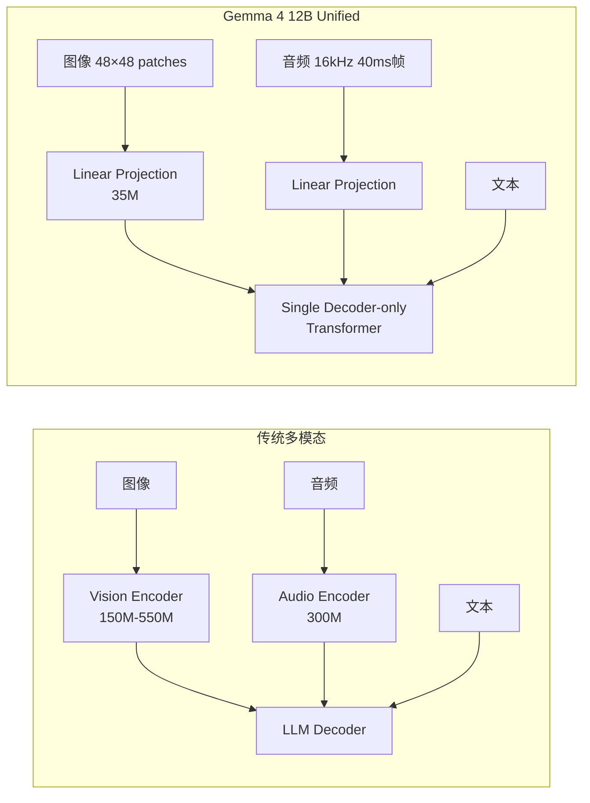

# Gemma 4 12B 全面调研报告

> **调研日期**: 2026-06-04 | **模型发布时间**: 2026-06-03（12B 正式发布）；2026-04-02（Gemma 4 系列发布）

## 一、概述

Gemma 4 是 Google DeepMind 于 2026 年 4 月发布的最新一代开源模型系列，12B 版本于 2026 年 6 月 3 日正式推出。Gemma 4 定位为"**字节对字节最具能力的开放模型**"（byte for byte, the most capable open models），主打**高智能密度**（intelligence-per-parameter），在相同参数规模下提供 SOTA 级别的推理能力。

**Gemma 4 全系列**：

| 模型 | 参数量 | 架构 | 上下文 | 模态 |
|------|--------|------|--------|------|
| Gemma 4 E2B | ~2.3B 有效 / 5.1B 含嵌入 | Dense | 128K | 文本+图像+音频 |
| Gemma 4 E4B | ~4.5B 有效 / 8B 含嵌入 | Dense | 128K | 文本+图像+音频 |
| **Gemma 4 12B Unified** | **~12B** | **Dense, encoder-free** | **256K** | **文本+图像+音频** |
| Gemma 4 26B A4B | 26B 总参 / 4B 激活 | MoE | 256K | 文本+图像 |
| Gemma 4 31B | 31B | Dense | 256K | 文本+图像 |

**许可证**: Apache 2.0（完全开放，可商用）

---

## 二、架构设计 — Encoder-Free Unified Multimodal

### 2.1 核心创新：去除独立编码器

Gemma 4 12B 最大的架构亮点是 **encoder-free unified architecture（无编码器统一架构）**。传统多模态模型（包括同系列的 E2B/E4B）依赖独立的视觉编码器和音频编码器：

**具体机制**：

- **视觉输入**: 原始图像被切分为 48×48 像素的 patch，通过单层 `matmul` 直接投影到 LLM 的 hidden dimension。空间位置信息通过**分解坐标查找**（factorized coordinate lookup，分离 X 和 Y 矩阵）附加，仅需 **35M 参数**替代传统 27 层 ViT。
- **音频输入**: 16kHz 原始音频切片为 40ms 帧（每帧 640 个 float），通过线性投影直接进入 LLM 输入空间，省去了 E2B/E4B 中使用的 12 层 conformer 音频编码器（300M 参数）。
- **统一训练**: 所有模态共享同一套权重，微调时无需分别调整冻结的编码器——LoRA 或全量微调一次覆盖全部模态。

### 2.2 模型结构参数

| 参数 | 值 |
|------|-----|
| 总参数量 | 11.95B |
| 层数 | 48 |
| 上下文窗口 | 256K tokens |
| 词表大小 | 262K |
| 注意力机制 | Hybrid：局部滑动窗口（1024 tokens）+ 全局注意力，尾层始终为全局 |
| 位置编码 | p-RoPE（Proportional RoPE），全局层使用 unified Keys/Values |
| 视觉嵌入参数 | 35M（替代传统 ViT） |
| 多 Token 预测 | 支持 MTP 变体，加速本地推理 |

### 2.3 Encoder-Free 架构的优势

1. **低延迟**: 绕过重量级多阶段编码器，多模态数据直达 LLM backbone，显著降低多模态推理延迟
2. **内存友好**: 无需在显存中同时维护独立编码器参数，更适合消费级硬件部署
3. **统一微调**: 全模态共享权重，一次微调覆盖文本/图像/音频
4. **架构简洁**: 单一 decoder-only transformer，与纯文本模型架构一致，社区工具链兼容性好

---

## 三、Benchmark 性能评估

### 3.1 文本推理与知识

| Benchmark | Gemma 4 12B | Gemma 4 31B | Gemma 3 27B | 提升(vs Gemma3) |
|-----------|-------------|-------------|-------------|-----------------|
| **MMLU Pro** | 77.2% | 85.2% | 67.6% | **+9.6pp** |
| **GPQA Diamond** | 78.8% | 84.3% | 42.4% | **+36.4pp** |
| **AIME 2026** (数学) | 77.5% | 89.2% | 20.8% | **+56.7pp** |
| **MMMLU** (多语言) | 83.4% | 88.4% | 70.7% | **+12.7pp** |
| **BigBench Extra Hard** | 53.0% | 74.4% | 19.3% | **+33.7pp** |
| **Tau2** (Agent工具使用) | 69.0% | 76.9% | 16.2% | **+52.8pp** |

> **关键发现**: 12B 模型在几乎所有文本推理 benchmark 上**大幅超越**上一代旗舰 Gemma 3 27B（2.25 倍参数），尤其在数学推理（AIME）和 Agent 工具使用（Tau2）上提升超过 50 个百分点。

### 3.2 编程能力

| Benchmark | Gemma 4 12B | Gemma 4 31B | Gemma 3 27B |
|-----------|-------------|-------------|-------------|
| **LiveCodeBench v6** | 72.0% | 80.0% | 29.1% |
| **Codeforces ELO** | 1659 | 2150 | 110 |
| **HLE** (no tools) | 5.2% | 19.5% | - |

编程能力同样远超 Gemma 3，LiveCodeBench 从 29.1% 跃升至 72.0%。

### 3.3 视觉理解

| Benchmark | Gemma 4 12B | Gemma 4 31B | Gemma 3 27B |
|-----------|-------------|-------------|-------------|
| **MMMU Pro** (多模态推理) | 69.1% | 76.9% | 49.7% |
| **MATH-Vision** | 79.7% | 85.6% | 46.0% |
| **OmniDocBench 1.5** (↓越低越好) | 0.164 | 0.131 | 0.365 |

视觉能力显著优于 Gemma 3 27B，尽管使用了更轻量的视觉处理（35M 线性投影 vs 传统 ViT 编码器）。

### 3.4 音频能力

| Benchmark | Gemma 4 12B | Gemma 4 E4B | Gemma 4 E2B |
|-----------|-------------|-------------|-------------|
| **CoVoST** (语音翻译) | 38.5 | 35.54 | 33.47 |
| **FLEURS** (↓越低越好) | 0.069 | 0.08 | 0.09 |

12B 是三款支持音频的模型中表现最好的，且是 Gemma 系列中**首款中型音频模型**（此前音频仅限边缘小模型）。

### 3.5 长上下文能力

| Benchmark | Gemma 4 12B | Gemma 4 31B | Gemma 3 27B |
|-----------|-------------|-------------|-------------|
| **MRCR v2** (8 needle, 128K) | 43.4% | 66.4% | 13.5% |

256K 上下文窗口配合长文本检索能力的大幅提升，适合文档分析、代码库理解等场景。

---

## 四、训练技术

### 4.1 SWA-LR（Sliding Window Alternating Learning Rate）

尽管官方 model card 未详细展开，早期资料显示 Gemma 4 系列采用了 **SWA-LR** 训练技术——一种滑动窗口交替学习率策略。该技术据称带来了相当于 **2 倍模型规模** 的性能提升，且无需额外计算成本。具体机制推测为在训练过程中交替使用不同学习率窗口，促进模型在多个尺度上学习更鲁棒的表示。

### 4.2 蒸馏

Gemma 4 系列基于 Gemini 2.5 的研究和技术积累构建，部分使用教师蒸馏（teacher distillation），使小模型在预训练之外获得额外性能增益。

### 4.3 训练数据

- **截止日期**: 2025 年 1 月
- **数据组成**: 网页文档、代码、图像、音频，覆盖 140+ 语言
- **安全过滤**: 多阶段 CSAM 过滤、自动敏感数据过滤、内容质量与安全过滤

---

## 五、部署与生态

### 5.1 硬件需求

| 部署方式 | 要求 |
|----------|------|
| **本地 GPU** | 16GB VRAM（消费级 GPU 如 RTX 3080/4080） |
| **Mac** | Apple Silicon 统一内存，原生离线运行 |
| **边缘设备** | Raspberry Pi 5（E2B/E4B），Qualcomm NPU 加速 |
| **云端** | 单张 H100 80GB 可运行未量化 bf16 权重 |

### 5.2 推理引擎支持

完整的社区和官方支持矩阵：

| 引擎/框架 | 状态 |
|-----------|------|
| Hugging Face Transformers | ✅ 官方支持 |
| llama.cpp | ✅ |
| MLX (Apple Silicon) | ✅ |
| vLLM / SGLang | ✅ |
| Ollama / LM Studio | ✅ |
| LiteRT-LM (Google 官方) | ✅ 推荐，支持前缀缓存 |
| Unsloth (微调) | ✅ |
| WebGPU | ✅ |

### 5.3 官方工具链

- **LiteRT-LM CLI**: `litert-lm serve` 一键启动 OpenAI 兼容 API，支持无状态前缀缓存
- **Google AI Edge Gallery**: macOS 原生桌面应用，离线运行，内置沙盒 Python 执行环境
- **Google AI Edge Eloquent**: macOS 语音交互应用，支持 Gemma 12B 对话式输入
- **AICore**: Android 内置 Gemma 4 支持（开发者预览）
- **Gemma Skills**: `github.com/google-gemma/gemma-skills`，Agent 开发技能库

### 5.4 微调

- **LoRA**: 由于统一架构，单次 LoRA 覆盖全部模态
- **全量微调**: Hugging Face Transformers / Unsloth 均支持
- **预训练 + 指令微调**两种 checkpoint 均开放下载

---

## 六、竞争对比

### 6.1 同规模对比

| 维度 | Gemma 4 12B | Gemma 3 27B | Qwen3 (同规模) | Llama 4 (同规模) |
|------|-------------|-------------|----------------|------------------|
| 参数 | 12B | 27B | ~8-14B | ~8B (Scout 为 MoE) |
| 上下文 | 256K | 128K | 128-256K | 128K-256K |
| 模态 | 文+图+音 | 文+图 | 文+图 | 文+图 |
| 许可证 | Apache 2.0 | Gemma | Apache 2.0 | Llama Community |
| 架构创新 | Encoder-Free | ViT+SigLIP | MoE/Dense | MoE |

### 6.2 核心优势

1. **智能密度领先**: 12B 击败上一代 27B 模型，在多个 benchmark 上接近 31B 旗舰水平
2. **真·多模态**: 文本+图像+音频三模态统一，且音频是中型开源模型中的稀缺能力
3. **Encoder-Free 架构**: 推理延迟更低，部署更简单，微调更统一
4. **Apache 2.0 完全开源**: 无商业限制，对比 Llama 的社区许可更友好
5. **256K 上下文**: 在同规模模型中属于顶级，适合长文档和代码库场景
6. **多 Token 预测**: 通过 MTP 变体进一步加速本地推理

### 6.3 局限性

1. **HLE（Hardest Logic Ever）仅 5.2%**: 超难推理任务仍与 31B 旗舰有差距
2. **长上下文检索（MRCR 43.4%）**: 不如 31B 的 66.4%，在极长上下文中检索精度有提升空间
3. **MedXPertQA 48.7%**: 医疗专业视觉问答表现一般
4. **部分 benchmark 缺失**: 12B 未报告 HLE with search 结果

---

## 七、与 Gemma 3 的关键变化总结

| 维度 | Gemma 3 (2025.03) | Gemma 4 (2026.04/06) |
|------|-------------------|----------------------|
| 旗舰尺寸 | 27B | 31B Dense / 26B MoE |
| 中型主力 | 12B (ViT 编码) | **12B Unified (Encoder-Free)** |
| 多模态 | 文本+图像 | 文本+图像+**音频** |
| 许可证 | Gemma 许可 | **Apache 2.0** |
| 上下文 | 128K | **256K** |
| 架构 | 独立 ViT 编码器 | **统一 Decoder-Only** |
| 下载量 | 数亿次 | 累计 **4 亿+** |
| 社区变体 | 数万 | **10 万+** (Gemmaverse) |

---

## 八、结论与建议

### 8.1 定位

Gemma 4 12B 是当前 **12B 参数级别最全面的开源多模态模型**。它的核心价值在于：

- **高智能密度**：用 12B 实现了超越上代 27B 的性能，接近当前 31B 旗舰水平
- **全模态覆盖**：文本+图像+音频的统一处理能力，在中型开源模型中独树一帜
- **部署友好**：Encoder-Free 架构 + 16GB VRAM 可运行 + Apache 2.0 许可，几乎无门槛

### 8.2 适用场景

| 场景 | 适合度 | 说明 |
|------|--------|------|
| 本地 Agent 开发 | ⭐⭐⭐⭐⭐ | Agent 工具使用（Tau2 69%），16GB 可本地运行 |
| 多模态应用（文+图+音） | ⭐⭐⭐⭐⭐ | 中型模型中唯一支持音频的 |
| 编程辅助 | ⭐⭐⭐⭐ | LiveCodeBench 72%，本地 IDE 集成 |
| 长文档处理 | ⭐⭐⭐⭐ | 256K 上下文，MRCR 43.4% |
| 多语言任务 | ⭐⭐⭐⭐ | 140+ 语言，MMMLU 83.4% |
| 数学推理 | ⭐⭐⭐⭐ | AIME 77.5%，数学能力突出 |
| 边缘/IoT 部署 | ⭐⭐⭐ | 需量化，小模型更适合边缘（用 E2B/E4B） |

### 8.3 推荐关注

- 🔥 **MTP 变体**: 多 Token 预测版本的推理速度值得测试
- 🔥 **Encoder-Free 架构论文**: 35M 视觉嵌入达到甚至超越传统 ViT 的效果，思路值得研究
- 🔥 **Gemma Skills 生态**: Agent 开发工具链的成熟度将影响实际落地效果

---

## 参考来源

1. [Gemma 4 Launch Blog](https://blog.google/innovation-and-ai/technology/developers-tools/gemma-4/) — Google Blog, 2026-04-02
2. [Gemma 4 12B: The Developer Guide](https://developers.googleblog.com/gemma-4-12b-the-developer-guide/) — Google Developers Blog, 2026-06-03
3. [Gemma 4 Model Card](https://ai.google.dev/gemma/docs/core/model_card_4) — Google AI for Developers
4. [Welcome Gemma 4 (Hugging Face)](https://huggingface.co/blog/gemma4) — Hugging Face Blog, 2026-04-02
5. [Gemma 4 — Google DeepMind](https://deepmind.google/models/gemma/gemma-4/) — DeepMind 官方页面
6. [Bring state-of-the-art agentic skills to the edge with Gemma 4](https://developers.googleblog.com/bring-state-of-the-art-agentic-skills-to-the-edge-with-gemma-4/) — Google Developers Blog, 2026-04-02