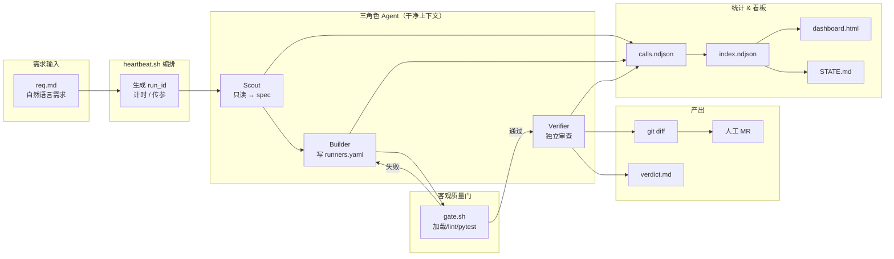

# hil_auto_test Loop — 架构与使用指南

> 仓库路径：`/home/dr/code/hil_auto_test/.loop/`
> 当前阶段：**0~2（脚手架 + 手动验证）**
> 首个 Loop 场景：**平台 / Runner 配置自动适配**（改 `pipeline/config/yaml/runners.yaml`）
> 支持 Agent：**Claude Code**（默认）+ **Cursor Agent**（同一套 SKILL / 编排）

---

## 1. 设计定位

### 1.1 这是什么

这不是「每次手动 prompt agent」，而是按 [[Loop Engineering-14步指南]] 落地的一个**小系统**：

- 你设计一次编排（heartbeat + skill + gate + state）
- 系统自己发现任务、派 agent、跑质量门、记录统计、更新进度
- 你只在最后 review diff / verdict，人工决定是否提交 MR

对应笔记里的**最小可行 Loop 四件套**：

| 件 | 本仓库实现 |
|:---|:---|
| 1 Automation | `bin/heartbeat.sh` |
| 1 Skill | `skills/{scout,builder,verifier}/SKILL.md` |
| 1 State File | `STATE.md` + `VISION.md` |
| 1 Gate | `bin/gate.sh` |

### 1.2 设计原则（来自 Loop Engineering 笔记）

- **干中学**：先手动跑通 → 写成 Skill → 包进 Loop → 排程（跳步 = 生产事故）
- **写 / 查分离**：Scout 只读、Builder 写、Verifier 独立审查（防 Self-preferential Bias）
- **一个合同 = 一个 session**：不在一个 24h session 里堆所有任务
- **客观 gate**：没有 gate 的 loop = Ralph Wiggum（静默失败还烧钱）
- **接受率优先**：KPI 第一位是「被合 MR / 总尝试」，不是 token 消耗；**< 50% 停 loop 复盘**
- **少即是多**：编排层不感知 claude / cursor 差异，统一 `run_agent.sh` 接口

### 1.3 当前不做的事（红线，见 `VISION.md`）

- 不碰真机 / 台架 / FOTA / 部署
- 不改测试来「凑绿」
- 不自动 merge MR / push 保护分支
- 变更范围默认仅限 `runners.yaml`（除非 spec 明确要求）

---

## 2. 总体架构

### 2.1 五站流水线

融合 [[Rahul 软件工厂蓝图]] 的 Scout → Builder → Verifier 拆分：



### 2.2 单次 heartbeat 时序

```
1. 读取 req.md + 生成 run_id
2. Scout   → tmp/<id>.spec.md
3. loop (最多 5 轮):
     Builder → gate.sh
     失败则把 gate.log 喂回 Builder 再试
4. Verifier → tmp/<id>.verdict.md
5. _summary.py → summary.json + index.ndjson + 回写 STATE.md
6. dashboard.py → dashboard.html
7. 打印 diff 摘要，exit 0/1（不自动 MR）
```

### 2.3 双 Agent 适配层

编排层只认 `run_agent.sh`，不感知后端：

| 能力 | Claude Code | Cursor Agent |
|:---|:---|:---|
| 无头执行 | `claude -p ... --output-format json` | `cursor-agent -p ... --output-format json --force` |
| 项目知识 | `.claude/skills/` → 软链 | `.cursor/skills/` → 软链 |
| SKILL 真身 | `.loop/skills/`（写一次，两边读） | 同上 |
| 成本字段 | `total_cost_usd`（权威） | 无金额，按 `prices.json` 折算 |
| Token | `usage.input_tokens` 等 | `usage.inputTokens` 等 |

**关键约束（本机实测）**：

- Claude 走代理时，磁盘 transcript **不含成本** → 必须从 `--output-format json` 的 result 采集
- Cursor 任何输出都**无美元金额** → 靠 `config/prices.json` 单价表折算

---

## 3. 目录与组件说明

```
hil_auto_test/.loop/
├── VISION.md              # 不变目标 + 红线（每轮 agent 必读，防 Goal Drift）
├── STATE.md               # 进度脊柱（heartbeat 自动回写）
├── CONTRACT.md.tmpl       # 完成合约模板（DoD 清单）
├── README.md              # 仓库内快速参考
├── config/
│   └── prices.json        # 模型单价表（Cursor 成本折算）
├── bin/
│   ├── run_agent.sh       # 双后端适配器 + JSON 采集
│   ├── gate.sh            # 四步客观质量门
│   ├── heartbeat.sh       # 主编排脚本
│   ├── _metrics.py        # 单次调用 → calls.ndjson
│   ├── _summary.py        # run 聚合 → index.ndjson + STATE.md
│   └── dashboard.py       # index → dashboard.html
├── skills/
│   ├── scout/SKILL.md     # 侦察：读需求 + grep → 写 spec（只读）
│   ├── builder/SKILL.md   # 施工：按 spec 改 runners.yaml
│   └── verifier/SKILL.md  # 质检：独立审查 + 跑 gate（只读）
├── runs/                  # 统计账本（gitignore）
│   ├── index.ndjson       # 主账本：一行 = 一次 heartbeat run
│   └── <run_id>/
│       ├── calls.ndjson   # 一行 = 一次 agent 调用
│       └── summary.json   # 本 run 汇总
├── tmp/                   # 单轮临时态（gitignore）
├── dashboard.html         # 生成的看板（gitignore）
.claude/skills → ../.loop/skills
.cursor/skills → ../.loop/skills
```

### 3.1 三角色 Skill 职责

| 角色 | 权限 | 输入 | 输出 |
|:---|:---|:---|:---|
| **Scout** | 只读 | req.md | `## SPEC: ...` markdown（精确到字段级） |
| **Builder** | 写 `runners.yaml` | spec + 上轮 gate 失败日志 | 改完的文件 + 自检结果 |
| **Verifier** | 只读 | spec + diff + gate 结果 | `## VERDICT: PASS\|FAIL` |

### 3.2 gate.sh（四步客观门）

退出码 **0 = 通过**，非 0 = 拒绝本轮产出：

1. **平台配置加载**：`platforms.py` 能 load 全部 vehicle
2. **重复 key 检测**：`runners.yaml` 不能有重复 vehicle/platform/runner（PyYAML safe_load 会静默覆盖）
3. **静态检查**：`python3 scripts/lint.py`（ruff + mypy，非 warn-only）
4. **相关测试**：`pytest -k "platform or config or runner"`

> 第一个真实 bug 就是 gate 抓到的：`vehicles.P03` 重复定义。

### 3.3 统计采集层

**每次 agent 调用**（`calls.ndjson` 一行）：

```json
{
  "ts": "2026-06-29T03:38:32+00:00",
  "run_id": "20260629-1130-LPA20",
  "role": "builder",
  "backend": "claude",
  "model": "deepseek-v4-pro",
  "session_id": "bde2229e-...",
  "is_error": false,
  "subtype": "success",
  "cost_usd": 0.2224,
  "tok_in": 44414,
  "tok_out": 15,
  "tok_cache_read": 5,
  "tok_cache_write": 10,
  "duration_ms": 1964,
  "num_turns": 1
}
```

**每次 heartbeat run**（`index.ndjson` 一行）：

```json
{
  "run_id": "20260629-1130-LPA20",
  "task_id": "LPA20",
  "backend": "claude",
  "status": "pass",
  "verdict": "PASS",
  "gate_pass": true,
  "rounds": 2,
  "duration_s": 73,
  "cost_usd": 0.319652,
  "tok_in": 121721,
  "tok_out": 49,
  "calls": 4,
  "session_ids": ["...", "..."]
}
```

### 3.4 Dashboard KPI

`dashboard.py` 读 `runs/index.ndjson`，生成自包含 `dashboard.html`（零依赖、内联 CSS）：

| KPI | 含义 | 笔记优先级 |
|:---|:---|:---|
| 接受率 | pass run / 总 run | **最高**（< 50% 标红提示停 loop） |
| Gate 通过率 | gate_pass / 总 run | 高 |
| 平均轮数 | Builder 迭代次数 | 中 |
| Triage 积压 | 非 pass 运行数 | 中 |
| 总成本 / 总 Token | 资源消耗 | 辅助 |

附带：成本趋势折线、通过/失败状态条、最近 50 次运行明细表。

---

## 4. 领域上下文（平台配置适配）

Loop 当前服务的业务域是 HIL 台架配置，单一数据源：

**`pipeline/config/yaml/runners.yaml`**

| 段 | 内容 |
|:---|:---|
| `platforms` | 平台模板（orin/x86/cockpit 内网 IP、chip、fota、鉴权） |
| `vehicles` | 车型 → platform + 密码（唯一凭据来源） |
| `runners` | Runner 公网 IP + 服务的 vehicles/platforms |
| `runner_id_mapping` | GitLab runner ID → 配置名 |

查询链：

```
vehicle_id → vehicles[id].platform → platforms[platform]
runner_id  → runners[id].vehicles  → vehicles[vehicle]（拿密码）
```

加载代码：`pipeline/config/platforms.py` → `PlatformConfig` dataclass。

---

## 5. 使用方法

### 5.1 前置条件

```bash
# 必需
claude --version          # Claude Code CLI（默认后端）
python3 scripts/lint.py   # lint 脚本
uv run python -c "from pipeline.config.platforms import list_supported_vehicles; print(len(list_supported_vehicles()))"

# 可选
cursor-agent --version    # 切 Cursor 后端时需要
```

环境变量：

| 变量 | 默认 | 说明 |
|:---|:---|:---|
| `LOOP_BACKEND` | `claude` | `claude` 或 `cursor` |
| `LOOP_MODEL` | 空 | 指定模型（如 `composer-2.5-fast`） |

### 5.2 标准流程：跑一轮 Loop

**Step 1 — 写需求文件**

```bash
cat > .loop/tmp/req.md <<'EOF'
新增车型 LPA20，平台 lp_8650，orin_passwords 为空，
driver_vehicle_type=LP8650-V1-SHARE。归到 Runner LP8650-1 服务列表。
EOF
```

**Step 2 — 执行 heartbeat**

```bash
cd /home/dr/code/hil_auto_test

# 默认 Claude 后端
.loop/bin/heartbeat.sh --task .loop/tmp/req.md --id LPA20-demo

# 或指定 Cursor 后端
.loop/bin/heartbeat.sh --task .loop/tmp/req.md --id LPA20-demo --backend cursor

# 隔离 worktree（并行多任务）
.loop/bin/heartbeat.sh --task .loop/tmp/req.md --id LPA20-demo --worktree

# 调整最大 Builder 轮数（默认 5）
.loop/bin/heartbeat.sh --task .loop/tmp/req.md --id LPA20-demo --max-rounds 3
```

**Step 3 — 查看结果**

| 产物 | 路径 | 内容 |
|:---|:---|:---|
| 技术方案 | `.loop/tmp/<id>.spec.md` | Scout 产出 |
| 质检判定 | `.loop/tmp/<id>.verdict.md` | Verifier 产出 PASS/FAIL |
| Gate 日志 | `.loop/tmp/<id>.gate.log` | 最后一轮 gate 输出 |
| 代码变更 | `git diff` 或 `../wt-<id>/` | Builder 改动 |
| Run 汇总 | `.loop/runs/<run_id>/summary.json` | 成本/轮数/状态 |
| 看板 | `.loop/dashboard.html` | KPI + 趋势 + 明细 |

**Step 4 — 人工 review + 提交 MR**

heartbeat **不会**自动 commit / push / merge。确认 diff 和 verdict 后手动提交。

### 5.3 查看 Dashboard

```bash
# heartbeat 跑完会自动重建；也可手动：
python3 .loop/bin/dashboard.py

# 浏览器预览（file:// 可能被拦截，用 http）
cd .loop && python3 -m http.server 8799
# 访问 http://localhost:8799/dashboard.html
```

### 5.4 调试：单独跑某一站

```bash
# 只跑 Scout
.loop/bin/run_agent.sh --role scout \
  --prompt .loop/tmp/req.md \
  --out .loop/tmp/spec.md

# 只跑质量门
.loop/bin/gate.sh

# 只跑 Builder（需先有 spec）
.loop/bin/run_agent.sh --role builder \
  --prompt .loop/tmp/LPA20.build.md \
  --cwd /home/dr/code/hil_auto_test

# 手动重建看板
python3 .loop/bin/dashboard.py
```

### 5.5 heartbeat 参数一览

```
.loop/bin/heartbeat.sh \
  --task <需求文件>     # 必需：自然语言需求 markdown
  --id <任务ID>         # 必需：如 LPA20、LP-8797
  [--backend claude|cursor]
  [--max-rounds N]      # 默认 5
  [--worktree]          # 在 ../wt-<id>/ 隔离执行
```

### 5.6 run_agent 参数一览

```
.loop/bin/run_agent.sh \
  --role scout|builder|verifier \
  --prompt <任务文件> \
  [--backend claude|cursor] \
  [--cwd <工作目录>] \
  [--out <输出文件>] \
  [--model <模型名>] \
  [--run-id <run_id>] \
  [--runs-dir <runs目录>]
```

---

## 6. 失败模式与应对

来自 [[Loop Engineering-实践框架]]，本 Loop 的对策：

| 失败模式 | 症状 | 本 Loop 对策 |
|:---|:---|:---|
| Ralph Wiggum | 半成品就退出 | `gate.sh` 硬门 + `CONTRACT.md.tmpl` |
| Goal Drift | 长跑丢目标 | 每轮重读 `VISION.md`；一任务一 session |
| Self-preferential | Builder 自评虚高 | Verifier 独立 agent |
| Comprehension Debt | 没人懂改了什么 | 必须人工 review diff 才合 MR |
| Cognitive Surrender | 全盘接受 agent 输出 | 抽查 gate 是否真抓 bug |

**常见运维场景：**

| 现象 | 处理 |
|:---|:---|
| gate 第 2 步报重复 key | 修 `runners.yaml` 重复 vehicle/platform |
| gate 第 3 步 lint 失败 | `python3 scripts/lint.py --fix` 或让 Builder 再迭代 |
| Builder 5 轮仍不过 gate | 落入 Triage Inbox（STATE.md），等人工 |
| Scout 标 NEEDS-INPUT | 需求信息不足，补全 req.md 后重跑 |
| 接受率 < 50% | **停 loop**，复盘 skill / gate / 任务粒度 |

---

## 7. 演进路线

| 阶段 | 内容 | 状态 |
|:---|:---|:---|
| 0 | 手动跑通 Scout→Builder→gate 全链路 | ✅ |
| 1 | 三角色 SKILL.md 固化 | ✅ |
| 2 | run_agent + gate + heartbeat + dashboard | ✅ |
| 3 | 接 GitLab issue 作需求源 + worktree 并行 | ⬜ |
| 4 | cron / GitLab scheduled pipeline 心跳 | ⬜ |

**阶段 3~4 预留接口：**

- 需求源：GitLab MCP 拉 `label:loop-ready` issue → 自动生成 req.md
- 排程：`0 18 * * 0` cron 或 GitLab schedule 调 `heartbeat.sh`
- 原生 worktree：Claude/Cursor 均支持 `-w/--worktree`，可替代手搓 `git worktree`
- 预算硬门：Claude `--max-budget-usd` 可直接接入 `run_agent.sh`

---

## 8. 相关笔记

- [[Loop Engineering-实践框架]] — 四件套、失败模式速查
- [[Loop Engineering-14步指南]] — 14 步完整 roadmap、接受率 KPI
- [[Loop Engineering-Addy Osmani]] — Loop Engineering 源头
- [[Rahul 软件工厂蓝图]] — Scout/Builder/Verifier 五站流水线
- [[Agentic-Engineering-世界级工程师指南]] — 干净上下文、精准 spec
- [[04-Agent架构与模式/Cursor SDK Pipeline方案]] — Cursor SDK CI 集成参考
- [[longhu-state.md]] / [[timing-state.md]] — 状态文件 + 累计指标范例

---

## 9. 快速命令备忘

```bash
# === 跑一轮 ===
.loop/bin/heartbeat.sh --task .loop/tmp/req.md --id MY-TASK

# === 看板 ===
python3 .loop/bin/dashboard.py
cd .loop && python3 -m http.server 8799

# === 只看 gate ===
.loop/bin/gate.sh

# === 看进度 ===
cat .loop/STATE.md
cat .loop/runs/index.ndjson | tail -1 | python3 -m json.tool

# === 校准 Cursor 成本 ===
vim .loop/config/prices.json
```
