# Toy Models of Superposition

1. Background & Motivation
2. Demonstrating Superposition
3. Superposition as a Phase Change
4. The Geometry of Superposition
5. Learning Dynamics
6. Relationship to Adversarial Examples
7. Superposition in a Privileged Basis
8. Computation in Superposition
9. The Strategic Picture
10. Discussion
11. Related Work
12. Comments &amp; Replications

### Authors
[Nelson Elhage∗](https://nelhage.com/), Tristan Hume∗, Catherine Olsson∗, Nicholas Schiefer∗, [Tom Henighan](https://tomhenighan.com), Shauna Kravec, [Zac Hatfield-Dodds](https://zhd.dev), Robert Lasenby, Dawn Drain, Carol Chen, Roger Grosse, Sam McCandlish, Jared Kaplan, Dario Amodei, [Martin Wattenberg](https://www.bewitched.com/)∗, [Christopher Olah‡](https://colah.github.io/)

### Affiliations
[Anthropic,](https://www.anthropic.com/) [Harvard](https://www.harvard.edu/)

### Published
Sept 14, 2022

* Core Research Contributor; ‡ Correspondence to [colah@anthropic.com](https://transformer-circuits.pub/2022/toy_model/colah@anthropic.com); [Author contributions statement below](index.html#).

如果人工神经网络的单个神经元能够对应到清晰可解释的输入特征，那将会非常方便。例如，在一个"理想"的 ImageNet 分类器中，每个神经元应该只在存在特定视觉特征时激活，比如红色、向左的曲线或狗鼻子。根据经验，在我们研究过的模型中，确实有一些神经元能清晰地映射到特征。但并非总是如此，特征并不总能如此清晰地对应到神经元，尤其是在大型语言模型中，神经元对应清晰特征的情况实际上似乎很罕见。这引出了许多问题：为什么神经元有时与特征对齐，有时却不对齐？为什么有些模型和任务有许多这种清晰的神经元，而在其他模型中却极其罕见？

在本文中，我们使用 toy models（小型 ReLU 网络，在具有稀疏输入特征的合成数据上训练）来研究模型如何以及何时表示比它们维度更多的特征。我们将这种现象称为 **superposition**（叠加）。当特征稀疏时，superposition 允许压缩超越线性模型所能达到的程度，但代价是需要非线性过滤的"干扰"。

考虑一个 toy model，我们训练一个五特征的嵌入，这些特征具有不同的重要性[^1]，嵌入到二维空间中，之后添加 ReLU 进行过滤，并改变特征的稀疏性。对于密集特征，模型学习表示最重要的两个特征的正交基（类似于主成分分析 PCA 可能给出的结果），而其他三个特征未被表示。但如果我们使特征稀疏，情况就会改变：


此图及其他一些图可以使用我们 [Github repo](https://github.com/anthropics/toy-models-of-superposition) 中的 [toy model framework Colab notebook](https://colab.research.google.com/github/anthropics/toy-models-of-superposition/blob/main/toy_models.ipynb) 复现。

模型不仅可以通过容忍一些干扰来在 superposition 中存储额外特征，而且我们将展示，至少在某些有限情况下，模型可以在 superposition 中执行计算。（特别是，我们将展示模型可以将计算绝对值函数的简单电路放入 superposition 中。）这使我们假设，我们实际观察到的神经网络在某种意义上是嘈杂地模拟更大的、高度稀疏的网络。换句话说，我们训练的模型可以被认为是做"与"一个想象的大得多的模型"相同的事情"，表示完全相同的特征但没有干扰。

Feature superposition 并不是一个新想法。许多之前的可解释性论文已经考虑过它，它与数学中长期研究的 **compressed sensing**（压缩感知）主题非常密切相关，也与神经科学和深度学习中的 **distributed**、**dense** 和 **population codes** 的概念密切相关。那么，本文的贡献是什么？

对于可解释性研究人员，我们的主要贡献是直接证明了 superposition 在相对自然的设置下确实发生在人工神经网络中，表明这也可能在实际中发生。也就是说，我们展示了一种情况，其中将神经网络解释为在 superposition 中具有稀疏结构不仅仅是一种有用的事后解释，而是模型的"真实情况"。我们提供了一个关于何时以及为何发生这种情况的理论，揭示了 superposition 的 [phase diagram](index.html#phase-change)（相图）。这 [解释了](index.html#privileged-basis) 为什么神经元有时是"monosemantic"（单语义的），响应单个特征，而有时是"polysemantic"（多语义的），响应许多不相关的特征。我们还发现，至少在我们的 toy model 中，superposition 展现出 [复杂的几何结构](index.html#geometry)。

但我们的结果也可能具有更广泛的兴趣。我们发现了初步证据表明 superposition 可能与 adversarial examples（对抗样本）和 grokking 相关联，也可能为 mixture of experts（专家混合）模型的性能提供理论。更广泛地说，我们研究的 toy model 具有出乎意料丰富的结构，展现出 [phase changes](index.html#phase-change)（相变）、基于均匀多胞形的 [几何结构](index.html#geometry)、训练过程中的 ["能级"式跳跃](index.html#learning-jumps)，以及一个在性质上类似于物理学中 **fractional quantum Hall effect**（分数量子霍尔效应）的 [现象](index.html#geometry-uniform) 以及其他显著现象。我们最初研究这个主题是为了理解更大模型中清晰可解释的神经元，但我们发现这些 toy models 本身就非常有趣。

#### [Key Results From Our Toy Models](index.html#key-results)

在我们的 toy models 中，我们能够证明：

- Superposition 是一个真实存在的现象。
- Monosemantic 和 polysemantic 神经元都可以形成。
- 至少某些类型的计算可以在 superposition 中执行。
- 特征是否存储在 superposition 中由 phase change（相变）控制。
- Superposition 将特征组织成几何结构，如 digons（二角形）、triangles（三角形）、pentagons（五边形）和 tetrahedrons（四面体）。

我们的 toy models 是简单的 ReLU 网络，所以说神经网络至少在某种机制下展现出这些特性似乎是公平的，但很不清楚应该将什么推广到真实网络。

## [Definitions and Motivation: Features, Directions, and Superposition](index.html#motivation)

在我们的工作中，我们经常将神经网络视为将输入的特征表示为激活空间中的 **directions**（方向）。这并非一个平凡的断言。我们不应该期望神经网络表示具有什么样的结构并不明显。当我说"word embeddings（词嵌入）有一个 gender direction（性别方向）"或"视觉模型有 curve detector neurons（曲线检测神经元）"时，人们隐式地对网络表示的结构做出了强有力的断言。

尽管如此，我们相信这种"linear representation hypothesis"（线性表示假设）得到了大量实证发现和理论论证的支持。人们可以将这视为两个独立的属性，我们将在稍后更详细地探讨：

- **Decomposability**（可分解性）：网络表示可以用独立可理解的特征来 **描述**。
- **Linearity**（线性）：特征由方向表示。

如果我们希望 reverse engineer（逆向工程）神经网络，我们 **需要** 像 decomposability 这样的属性。Decomposability 是 [使我们能够在不将整个模型装入大脑的情况下推理模型](https://transformer-circuits.pub/2022/mech-interp-essay/index.html) 的关键！但仅仅可分解是不够的：我们需要能够以某种方式访问这种分解。为了做到这一点，我们需要识别表示中的单个特征。在线性表示中，这对应于确定激活空间中的哪些方向对应于输入的哪些独立特征。

有时，识别特征方向非常容易，因为特征似乎对应于神经元。例如，InceptionV1 早期层中的许多神经元清楚地对应于特征（例如 curve detector neurons）。为什么我们有时会得到这种非常有用的属性，但在其他情况下却没有？我们假设实际上有两种相互对抗的力量在驱动这一点：

- **Privileged Basis**（特权基）：只有一些表示具有 privileged basis，这鼓励特征与基方向对齐（即对应于神经元）。
- **Superposition**（叠加）：线性表示可以使用我们称为 superposition 的策略来表示比维度更多的特征。这可以看作是神经网络模拟更大的网络。这推动特征远离对应于神经元。

Superposition 在之前的工作中已被假设，在某些情况下，假设类似 superposition 的东西已被证明有助于发现可解释的结构。然而，我们不知道 feature superposition 之前是否在神经网络中被明确无误地证明过（展示了模型 superposition 的 closely related phenomenon）。本文的目标就是改变这一点，证明 superposition 并探索它如何与 privileged bases 相互作用。如果 superposition 发生在网络中，它深刻影响了可解释性研究的哪些方法是有意义的，因此明确的证明似乎很重要。

本节的目标将是对这些想法进行动机阐述并详细展开。

值得注意的是，本节中的许多想法与其他可解释性研究路线（尤其是 disentanglement）、神经科学（distributed representations、population codes 等）、compressed sensing 以及许多其他工作路线有着密切的联系。本节将重点阐述我们对该问题的视角。我们将在 [Related Work](index.html#related-work) 中详细讨论这些其他工作路线。

### [Empirical Phenomena](index.html#motivation-empirical)

当我们谈论"特征"以及它们如何被表示时，这最终是围绕几个观察到的经验现象的理论构建。在描述我们如何概念化这些结果之前，我们将简单地描述一些激发我们思考的主要结果：

- **Word Embeddings** — Mikolov 等人的一项著名结果发现，word embeddings 似乎具有对应于语义属性的方向，允许 embedding arithmetic 向量运算，如 V("king") - V("man") + V("woman") = V("queen")（但也见）。
- **Latent Spaces** — 类似的"向量算术"和可解释方向结果也在 generative adversarial networks（生成对抗网络）中被发现（例如）。
- **Interpretable Neurons** — 有大量结果发现似乎可解释的神经元（在 RNNs 中；在 CNNs 中；在 GANs 中），响应某些可理解的属性而激活。这项工作面临一些质疑。作为回应，几篇论文旨在对少数特定神经元进行极其详细的描述，希望确定性地建立真正检测某些可理解属性的神经元示例（ notably Cammarata et al.，但也有）。
- **Universality** — 许多响应相同属性的类似神经元可以在不同网络中找到。
- **Polysemantic Neurons** — 同时，也有许多神经元似乎不对输入的可解释属性做出响应，特别是许多 **polysemantic neurons**，它们似乎响应不相关的输入混合。

因此，我们倾向于认为神经网络表示由 **特征** 组成，这些特征被表示为方向。我们将在以下部分展开这个想法。

### [What are Features?](index.html#motivation-features)

我们使用"特征"这个术语是受到我们观察到的神经元（或 word embedding 方向）响应的输入的可解释属性的启发。有各种各样的此类观察到的属性！在视觉背景下，这些范围从低级神经元如 [curve detectors](https://distill.pub/2020/circuits/curve-detectors/) 和 [high-low frequency detectors](https://distill.pub/2020/circuits/frequency-edges/)，到更复杂的神经元如 [oriented dog-head detectors](https://distill.pub/2020/circuits/zoom-in/#claim-2-dog) 或 [car detectors](https://distill.pub/2020/circuits/zoom-in/#claim-2-superposition)，到极其抽象的神经元对应于 [famous people](https://distill.pub/2021/multimodal-neurons/#person-neurons)、[emotions](https://distill.pub/2021/multimodal-neurons/#emotion-neurons)、[geographic regions](https://distill.pub/2021/multimodal-neurons/#region-neurons) 和 [更多](https://distill.pub/2021/multimodal-neurons/#guided-tour-of-neuron-families)。在语言模型中，研究人员发现了 word embedding 方向，如 male-female（男性 - 女性）或 singular-plural（单数 - 复数）方向，消歧出现在多种语言中的单词的低级神经元，更抽象的神经元，以及帮助产生某些单词的"action"输出神经元。我们希望使用"特征"这个术语来涵盖所有这些属性。

但即使有了这种动机，创建一个令人满意的特征定义仍然相当具有挑战性。我们不提供我们有信心的单一定义，而是考虑三个潜在的工作定义：

- **Features as arbitrary functions**（特征作为任意函数）。一种方法是将特征定义为输入的任何函数（如在中）。但这似乎并不完全符合我们的动机。我们观察到的这些特征有一些特殊之处：它们在某种意义上似乎是推理数据的基本抽象，相同的特征在不同模型中可靠地形成。特征似乎也是可识别的：cat 和 car 是两个特征，而 cat+car 和 cat-car 看起来更像是特征的组合，而不是某种重要意义上的特征。
- **Features as interpretable properties**（特征作为可解释属性）。我们描述的所有特征对人类来说都显著地可理解。人们可以尝试用这个来定义：特征是输入中人类可理解"概念"的存在。但允许我们可能不理解的特征似乎很重要。如果 AlphaFold 发现了一些重要的化学结构来预测 protein folding（蛋白质折叠），它很可能不是我们最初理解的东西！
- **Neurons in Sufficiently Large Models**（足够大模型中的神经元）。最后一种方法是将特征定义为足够大的神经网络将可靠地专门用一个神经元来表示的输入属性。这个定义比看起来更棘手。具体来说，如果存在足够大的模型尺寸使得它获得一个专用神经元，那么某物就是一个特征。这创建了一种类似"epsilon-delta"的定义。我们目前的理解——正如我们将在后面部分看到的——是任意大的模型仍然可以有大部分特征处于 superposition 中。然而，对于任何给定的特征，假设特征重要性曲线不是平坦的，它最终应该被赋予一个专用神经元。这个定义在说明某物 **是** 一个特征方面可能有帮助——curve detectors 是一个特征，因为你在大于某个最小尺寸的各种模型中都能找到它们——但对于我们只在 polysemantic neurons 中假设或观察到的更常见的特征情况则无帮助。例如，curve detectors 似乎在足够复杂的视觉模型中可靠地出现，因此是一个特征。对于我们目前只在 polysemantic neurons 中观察到的可解释属性，希望是足够大的模型会为它们专门分配一个神经元。这个定义略微循环，但避免了之前定义的问题。

我们写这篇论文时心中想着最后的"足够大模型中的神经元"定义。但我们并不过分执着于它，实际上认为不 premature attach（过早依附）到一个定义可能很重要。Lakatos 的一本名著说明了关于定义的不确定性的重要性，以及在研究背景下重新思考定义往往有多重要。

### [Features as Directions](index.html#motivation-directions)

正如我们在前面部分提到的，我们通常认为特征被表示为方向。例如，在 word embeddings 中，"gender"和"royalty"似乎对应于方向，允许像 V("king") - V("man") + V("woman") = V("queen") 这样的算术。可解释神经元的例子也是特征作为方向的例子，因为神经元激活的量对应于表示中的基方向。

让我们称一个神经网络表示为 **linear**（线性的），如果特征对应于激活空间中的方向。在线性表示中，每个特征 $f\_i$ 有一个对应的表示方向 $W\_i$。多个特征 $f\_1, f\_2\ldots$ 以值 $x_{f\_1}, x_{f\_2}\ldots$ 激活的存在由 $x_{f\_1}W_{f\_1} + x_{f\_2}W_{f\_2}\ldots$ 表示。需要明确的是，被表示的特征几乎肯定是输入的非线性函数。只有从特征到激活向量的映射是线性的。注意，某物是否是线性表示取决于你认为什么是特征。

我们不认为神经网络经验上似乎具有线性表示是巧合。神经网络由线性函数与非线性交错构建。在某种意义上，线性函数构成了绝大多数计算（例如，按 FLOPs 衡量）。线性表示是神经网络表示信息的自然格式！具体来说，有三个主要好处：

- **线性表示是层可能实现的明显算法的自然输出**。如果一个人设置一个神经元来模式匹配特定的权重模板，它将随着刺激更好地匹配模板而更多地激活，随着匹配变差而更少激活。
- **线性表示使特征"线性可访问"**。典型的神经网络层是线性函数后跟非线性。如果前一层中的特征被线性表示，下一层中的神经元可以"选择它"并使其一致地激发或抑制该神经元。如果特征被非线性表示，模型将无法在单一步骤中做到这一点。
- **Statistical Efficiency**（统计效率）。将特征表示为不同方向可能允许具有线性变换的模型（如神经网络的权重）中的 **non-local generalization**（非局部泛化），相对于只能局部泛化的模型提高其统计效率。这种观点在 Bengio 的一些著作中特别被提倡（例如）。一个更易理解的论证可以在 [这篇博客文章](https://colah.github.io/posts/2014-07-NLP-RNNs-Representations/#word-embeddings) 中找到。

如果你使用多层，可以构建非线性表示并从中检索信息（尽管这些例子也可以被视为具有更奇特特征的线性表示）。我们在附录中提供了一个例子。然而，我们的直觉是，非线性表示对神经网络来说通常是低效的。

人们可能认为线性表示只能存储与其维度一样多的特征，但事实证明并非如此！我们将看到我们称为 **superposition** 的现象将允许模型在线性表示中存储更多特征——可能多得多。

关于这种特征观点如何与特征作为多维流形的概念相一致，请参见附录"What about Multidimensional Features?"。

### [Privileged vs Non-privileged Bases](index.html#motivation-privileged)

即使特征被编码为方向，一个自然的问题是：哪些方向？在某些情况下，考虑 **basis** 方向似乎有用，但在其他情况下则不然。为什么会这样？

当研究人员研究 word embeddings 时，分析基方向没有意义。没有理由期望一个基维度与任何其他可能的方向不同。看到这一点的一种方法是想象对 word embedding 应用某个随机线性变换 $M$，并对后续权重应用 $M^{-1}$。这将产生一个相同的模型，其中基维度完全不同。这就是我们所说的 **non-privileged basis**（非特权基）。当然，可以在没有 privileged basis 的情况下研究激活，你只需要以某种方式识别有趣的方向来研究，例如通过在 word embedding 中取"man"和"woman"之间的差向量来创建 gender direction。

但许多神经网络层并非如此。通常，架构的某些东西使基方向变得特殊，例如应用 activation function（激活函数）。这"打破了对称性"，使这些方向变得特殊，并可能鼓励特征与基维度对齐。我们称此为 **privileged basis**，并称基方向为"neurons"（神经元）。通常，这些神经元对应于可解释的特征。

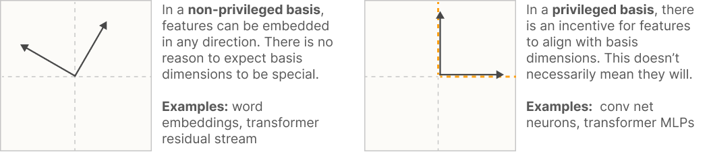

[^1]: 其中"重要性"是均方误差损失上的标量乘数。
从这个角度来看，只有当一个神经元处于特权基（privileged basis）中时，询问它是否可解释才有意义。实际上，我们通常只为处于特权基中的基方向保留"神经元"这个词。（参见更长的讨论 [这里](https://transformer-circuits.pub/2022/solu/index.html#section-3-2)。）

注意，拥有特权基并不能保证特征会与基对齐——我们会看到它们通常并不对齐！但这至少是让问题有意义的最小条件。

### [超位置假说](index.html#motivation-superposition)

即使存在特权基，神经元也常常是"多语义的"（polysemantic），对几个不相关的特征都有响应。对此的一种解释是 [超位置假说](https://distill.pub/2020/circuits/zoom-in/#claim-2-superposition)。粗略地说，超位置的思想是神经网络"想要表示的特征比它们拥有的神经元更多"，因此它们利用高维空间的性质来模拟一个拥有更多神经元的模型。


数学中的几个结果表明这样的事情可能是合理的：

- 几乎正交向量（Almost Orthogonal Vectors）。虽然在 n 维空间中只能有 n 个正交向量，但在高维空间中可以有 \exp(n) 个"几乎正交"（余弦相似度）的向量。参见 [Johnson–Lindenstrauss 引理](https://en.wikipedia.org/wiki/Johnson%E2%80%93Lindenstrauss_lemma)。
- 压缩感知（Compressed sensing）。一般来说，如果将一个向量投影到更低维的空间，就无法重构原始向量。然而，如果知道原始向量是稀疏的，情况就会改变。在这种情况下，通常可以恢复原始向量。

具体来说，在超位置假说中，特征被表示为神经元输出向量空间中的几乎正交方向。由于特征只是几乎正交的，一个特征的激活看起来像其他特征轻微激活。容忍这种"噪声"或"干扰"是有代价的。但对于具有高度稀疏特征的神经网络，这种代价可能被能够表示更多特征的好处所抵消！（关键是，稀疏性大大降低了成本，因为稀疏特征很少激活从而相互干扰，而非线性激活函数创造了过滤少量噪声的机会。）

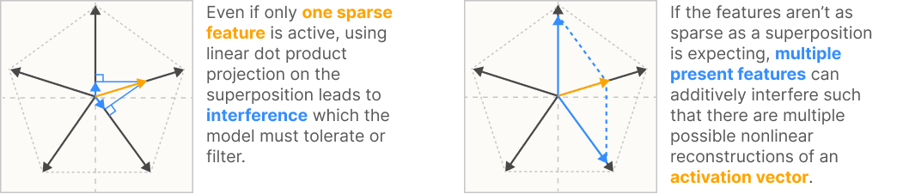

一种思考方式是，一个小型神经网络可能能够噪声性地"模拟"一个稀疏的更大模型：


虽然我们是针对神经元来描述超位置的，但它也可能发生在具有非特权基的表示中，例如词嵌入（word embedding）。超位置仅仅意味着特征比维度更多。

### [总结：特征属性的层次结构](index.html#motivation-summary)

本节中的思想可以根据神经网络表示可能具有的四个渐进更严格的属性来思考。

- 可分解性（Decomposability）：神经网络激活如果可分解，就可以分解为特征，其含义不依赖于其他特征的值。（这个属性最终是最重要的——参见分解在击败维度灾难中的作用。）
- 线性（Linearity）：特征对应于方向。每个特征 f_i 有一个对应的表示方向 W\_i。多个特征 f_1, f_2… 以值 x_{f\_1}, x_{f\_2}… 激活的表示为 x_{f\_1}W_{f\_1} + x_{f\_2}W_{f\_2}....
- 超位置与非超位置（Superposition vs Non-Superposition）：如果 W^TW 不可逆，则线性表示表现出超位置。如果 W^TW 可逆，则不表现出超位置。
- 基对齐（Basis-Aligned）：如果所有 W\_i 都是 one-hot 基向量，则表示是基对齐的。如果所有 W\_i 都是稀疏的，则表示是部分基对齐的。这需要一个特权基。

前两个（可分解性和线性）是我们假设广泛存在的属性，而后两个（非超位置和基对齐）是我们认为只偶尔发生的属性。

## [演示超位置](index.html#demonstrating)

如果认真对待超位置假说，一个自然的第一个问题是：神经网络是否真的能够噪声性地表示比它们拥有的神经元更多的特征。如果不能，超位置假说就可以被舒适地抛弃。

来自线性模型的直觉会认为这是不可能的：线性模型能做的最好的事情就是存储主成分。但我们会看到，添加一点非线性可以让模型表现出完全不同的行为！这将是我们对超位置的第一个演示。（这也将是对即使是非常简单神经网络的复杂性的一个实物教训。）

### [实验设置](index.html#demonstrating-setup)

我们的目标是探索神经网络是否可以将高维向量 x \in R^n 投影到更低维的向量 h\in R^m 中，然后恢复它。这个实验设置也可以看作是一个自编码器（autoencoder）在重构 x。


#### [特征向量 (x)](index.html#demonstrating-setup-x)

我们首先描述高维向量 x：我们理想化的、解缠结的更大模型的激活。我们将每个元素 x\_i 称为"特征"，因为我们想象特征在假设的更大模型中与神经元完美对齐。在视觉模型中，这可能是 Gabor 滤波器、曲线检测器或松垂耳朵检测器。在语言模型中，它可能对应于指代特定名人的 token，或子句是特定类型的描述。

由于我们没有任何特征的真实情况（ground truth），我们需要为 x 创建合成数据，模拟我们认为特征在建模时具有的任何重要属性。我们做出三个主要假设：

- 特征稀疏性（Feature Sparsity）：在自然界中，许多特征似乎是稀疏的，意思是它们很少出现。例如，在视觉中，图像中的大多数位置不包含水平边缘、曲线或狗头。在语言中，大多数 token 不指代 Martin Luther King 或不是描述音乐的子句的一部分。这个想法可以追溯到关于视觉和自然图像统计学的经典工作（参见例如 Olshausen, 1997，"Why Sparseness?" 一节）。出于这个原因，我们将为特征选择稀疏分布。
- 特征多于神经元（More Features Than Neurons）：模型可能表示的潜在有用特征数量巨大。一个足够通用的视觉模型可能受益于表示它可能看到的每一种植物和动物以及每个人造物体。一个语言模型可能受益于表示每个曾在书面中提到过的人。这些只是合理特征的冰山一角，但已经看起来比任何模型拥有的神经元都多。事实上，大型语言模型明显确实知道非常普通的人——大概比它们拥有的神经元更多的这样的人。这一点在神经科学中讨论"祖母神经元"（grandmother neurons）的合理性时是一个常见的论点，但对于人工神经网络来说似乎更强。真实模型中特征和神经元之间的这种不平衡似乎是神经网络表示中的一个核心张力。
- 特征重要性不同（Features Vary in Importance）：并非所有特征对给定任务都同样有用。有些比其他特征更能减少损失。对于 ImageNet 模型，分类不同种类的狗是核心任务，松垂耳朵检测器可能是它拥有的最重要的特征之一。相比之下，另一个特征可能只会略微提高性能。出于计算原因，我们在这篇文章中不会重点关注它，但我们经常想象有无限数量的特征，其重要性渐近地趋近于零。

具体来说，我们的合成数据定义如下：输入向量 x 是合成数据，旨在模拟我们认为任务的真实潜在特征具有的属性。我们将每个维度 x\_i 视为一个"特征"。每个特征有关联的稀疏度 S_i 和重要性 I_i。我们以概率 S_i 让 x\_i=0，否则在 [0,1] 之间均匀分布。选择让特征均匀分布是任意的。指数或幂律分布也会很自然。在实践中，我们关注所有特征具有相同稀疏度的情况，S_i = S。

#### [模型 (x \to x')](index.html#demonstrating-setup-model)

我们实际上将考虑两个模型，我们在下面给出动机。第一个"线性模型"是一个 хорошо理解的基线，不表现出超位置。第二个"ReLU 输出模型"是一个非常简单的模型，确实表现出超位置。两个模型仅在最终激活函数上有所不同。

线性模型：
h~=~Wx
x'~=~W^Th~+~b
x' ~=~W^TWx ~+~ b

ReLU 输出模型：
h~=~Wx
x'~=~\text{ReLU}(W^Th+b)
x' ~=~\text{ReLU}(W^TWx + b)

为什么选择这些模型？

超位置假说表明，高维模型中的每个特征对应于低维空间中的一个方向。这意味着我们可以将下投影表示为线性映射 h=Wx。注意，每一列 W\_i 对应于低维空间中表示特征 x\_i 的方向。

为了恢复原始向量，我们将使用相同矩阵的转置 W^T。这避免了关于低维空间中什么方向真正对应于特征的任何歧义。这也看起来相对数学上有原则。回想一下，如果 W 是正交的，则 W^T = W^{-1}。虽然 W 不能字面上是正交的，但我们来自压缩感知的直觉是，它将在 Candes & Tao 的意义上"几乎正交"，并且在经验上有效。

我们还添加了一个偏置。这样做的一个动机是它允许模型将它不表示的特征设置为它们的期望值。但我们会稍后看到，设置负偏置的能力对于超位置很重要，出于第二组原因——粗略地说，它允许模型丢弃少量噪声。

最后一步是是否添加激活函数。事实证明，这对于超位置是否发生至关重要。在真实的神经网络中，当特征实际上被模型用于计算时，会有一个激活函数，因此在最后包含一个看起来是有原则的。

#### [损失](index.html#demonstrating-setup-loss)

我们的损失是以上述特征重要性 I_i 加权的均方误差：L = \sum_x \sum_i I_i (x\_i - x'_i)^2

### [基本结果](index.html#demonstrating-basic-results)

我们的第一个实验将是训练几个具有不同稀疏度级别的 ReLU 输出模型并可视化结果。（我们也会训练一个线性模型——如果优化得足够好，线性模型解不依赖于稀疏度级别。）

主要问题是如何可视化结果。最简单的方法是可视化 W^TW（一个特征×特征矩阵）和 b（一个特征长度向量）。注意，特征从最重要到最不重要排列，所以结果有相当好的结构。这是一个这种可视化可能看起来的例子，对于一个小型模型（n=20; m=5），它以"预期的线性模型式"行为，只表示与它拥有的维度一样多的特征：

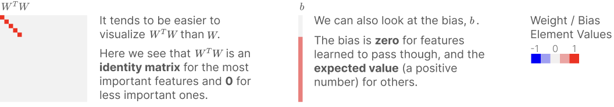

但我们真正关心的是这个假设的超位置现象——模型是否通过非正交存储来表示"额外特征"？有没有办法更明确地获取它？嗯，一个问题就是模型学会表示多少个特征。对于任何特征，无论它是否被表示，都由 ||W\_i|| 决定，即其嵌入向量的范数。

我们还想了解给定特征是否与其他特征共享其维度。为此，我们计算 \sum_{j\neq i} (\hat{W\_i}\cdot W\_j)^2，将所有其他特征投影到 W\_i 的方向向量上。如果特征与其他特征正交，它将为 0（下方深蓝色）。另一方面，值 \geq 1 意味着存在其他特征的某个组，它们激活 W\_i 的强度与特征 i 本身一样强！

我们可以用这种方式可视化我们之前看过的模型：


现在我们有了可视化模型的方法，我们可以开始实际做实验了。我们将首先考虑只有几个特征的模型（n=20; m=5; I_i=0.7^i）。这将使我们很容易直观地看到发生了什么。我们考虑一个线性模型，以及在具有不同特征稀疏度级别的数据上训练的几个 ReLU 输出模型：


正如我们的标准直觉所预期的那样，线性模型总是学习最重要的前 m 个特征，类似于学习前几个主成分。ReLU 输出模型在密集特征上表现相同（1-S=1.0），但随着稀疏度增加，我们看到超位置出现。模型通过让它们彼此不正交来表示更多特征。它从较不重要的特征开始，逐渐影响最重要的特征。最初这涉及将它们排列成对跖对（antipodal pairs），其中一个特征的表示向量正好是另一个的负值，但我们观察到随着它表示更多特征，它逐渐过渡到其他几何结构。我们将在后面的 [超位置的几何](index.html#geometry) 部分进一步讨论特征几何。

对于具有更多特征和隐藏维度的模型，结果在性质上是相似的。例如，如果我们考虑一个具有 m=20 隐藏维度和 n=80 特征的模型（重要性增加到 I_i=0.9^i 以考虑拥有更多特征），我们基本上观察到上述可视化的缩放版本：


### [数学理解](index.html#demonstrating-math)

在上一节中，我们观察到一个令人惊讶的经验结果：在模型输出中添加 ReLU 允许完全不同的解——超位置——这在线性模型中不会发生。

发生这种情况的模型在数学上仍然非常简单。我们能否分析地理解为什么超位置正在发生？而且，为什么添加单个非线性会使事情与线性模型情况如此不同？事实证明，我们可以得到一个相当令人满意的答案，揭示我们的模型由平衡两种竞争力量控制——特征收益（feature benefit）和干扰（interference）——这将是有用的直觉。我们还将发现与化学中著名的 Thomson 问题的联系。

让我们从线性情况开始。这已经被先前的工作很好地理解了！如果想理解为什么线性模型不表现出超位置，简单的答案是观察线性模型本质上执行 PCA。但这并不完全令人满意：如果我们暂时放下所有关于线性函数的知识和直觉，为什么超位置不能发生？

更深入的理解可以来自 Saxe et al. 的结果，他们研究线性神经网络的学习动态——即没有激活函数的神经网络。这样的模型最终是线性函数，但因为它们是多个线性函数的组合，动态可能相当复杂。他们论文的要点揭示了神经网络权重可以被认为是优化一个简单的闭式解。我们可以调整他们的问题，使其与我们的线性情况更相似，我们让模型为 x' = W^TWx，但让 x 像 Saxe 中那样高斯分布。揭示了以下方程：


Saxe 的结果揭示了在所考虑的模型中，有两种根本的竞争力量控制学习动态。首先，模型可以通过表示更多特征来获得更好的损失（我们将其标记为"特征收益"）。但如果它表示超过它可以正交拟合的特征，由于特征之间的"干扰"，它也会获得更差的损失。作为一个简短的旁注，有趣的是对比线性模型干扰 \sum_{i\neq j}|W\_i \cdot W_J|^2 与压缩感知中的 [相干性](https://en.wikipedia.org/wiki/Mutual_coherence_(linear_algebra)) 概念 \max_{i\neq j}|W\_i \cdot W_J|。我们可以将它们视为同一向量的 L^2 和 L^\infty 范数。事实上，这使得线性模型表示比其维度更多的特征永远不值得。为了证明超位置在线性模型中永远不是最优的，求解损失梯度为零或咨询 Saxe et al.。

我们能否对 ReLU 输出模型实现类似的理解？具体来说，我们想了解 L=\int_x ||I(x-\text{ReLU}(W^TWx+b))||^2 d\textbf{p}(x)，其中 x 的分布使得 x\_i=0 的概率为 S。

对 x 的积分根据 ((1\!-\!S)+S)^n 的二项式展开分解为每个稀疏模式的项。我们可以将稀疏的项分组，将损失重写为 L = (1\!-\!S)^n L\_n +\ldots+ (1\!-\!S)S^{n-1} L\_1+ S^n L\_0，每个 L_k 对应于输入是 k-稀疏向量时的损失。注意，当 S\to 1 时，L\_1 和 L\_0 占主导地位。L\_0 项对应于零向量上的损失，只是对正偏置的惩罚 \sum_i \text{ReLU}(b_i)^2。所以有趣的项是 L\_1，即 1-稀疏向量上的损失：

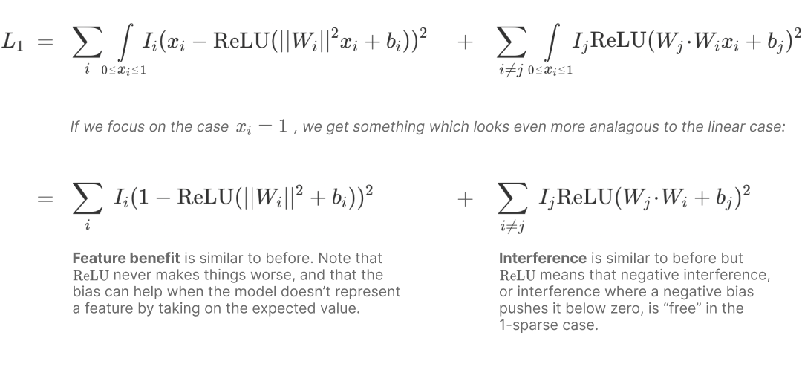

这个新方程与化学中著名的 [Thomson 问题](https://en.wikipedia.org/wiki/Thomson_problem) 有些相似。特别是，如果我们假设统一重要性并且有固定数量的特征，||W\_i|| = 1，其余的 ||W\_i|| = 0，并且 b_i = 0，那么特征收益项是常数，干扰项成为广义 Thomson 问题——我们只是用稍微不寻常的能量函数在球体表面上打包点。（当我们恢复下一节的经验调查时，我们会看到这可以是一个富有成效的类比！）

另一个有趣的特性是 ReLU 在 1-稀疏情况下使负干扰免费。这解释了我们看到的解在可能时更喜欢只有负干扰。此外，使用负偏置可以将小的正干扰基本上转换为负干扰。

那对应于较不稀疏向量的项呢？我们将明确写出这些留给读者，但主要思想是有多个复合干扰，"激活特征"可能会经历干扰。在 [后面的部分](index.html#geometry-dimensionality) 中，我们会看到特征经常将自己组织成稀疏干扰图，使得只有少数特征干扰另一个特征——有趣的是注意这减少了复合干扰的概率，使 1-稀疏损失项相对于其他项更重要。

## [超位置作为相变](index.html#phase-change)

上一节的结果似乎表明，当我们训练模型时，特征有三种结果：(1) 特征可能根本不学习；(2) 特征可能被学习，并以超位置表示；或 (3) 模型可能用专用维度表示特征。这三种结果之间的转变似乎是急剧的。可能，有某种相变。在这里，我们在"不连续变化"的广义意义上使用"相变"，而不是在无限系统大小极限中出现不连续的更技术意义上。

更好地理解这一点的一种方法是探索是否有来自物理学的"相图"之类的东西，这可以帮助我们理解什么时候特征预计处于这些状态之一。虽然我们在 [之前的实验](index.html#demonstrating-basic-results) 中可以看到这方面的线索，但很难真正隔离发生了什么，因为许多特征同时变化并且可能存在交互效应。因此，我们设置以下实验以更好地隔离效应。

作为初始实验，我们考虑具有 2 个特征但只有 1 个隐藏层维度的模型。我们仍然考虑 ReLU 输出模型 \text{ReLU}(W^T W x - b)。第一个特征的重要性为 1.0。在一个轴上，我们将第 2 个"额外"特征的重要性从 0.1 变化到 10。在另一个轴上，我们将所有特征的稀疏度从 1.0 变化到 0.01。然后我们绘制第 2 个"额外"特征是未学习、以超位置学习、还是学习并正交表示。为了减少噪声，我们为每个点训练十个模型并对结果取平均，丢弃损失最高的模型。

我们可以将其与理论的"玩具模型的玩具模型"进行比较，我们可以得到不同权重配置的损失的闭式解，作为重要性和稀疏度的函数。在 1 维中存储 2 特征有三种自然方式：W=[1,0]（忽略 [0,1]，丢弃额外特征），W=[0,1]（忽略 [1,0]，丢弃第一个特征以给额外特征专用维度），以及 W=[1,-1]（以超位置存储特征，失去表示 [1,1] 的能力，即两个特征同时的组合）。我们称最后一个解为"对跖"（antipodal），因为两个基向量 [1, 0] 和 [0, 1] 被映射到相反方向。事实证明，我们可以分析地确定这些解的损失（详情可以在 [这个 notebook](https://github.com/wattenberg/superposition/blob/main/Exploring_Exact_Toy_Models.ipynb) 中找到）。


正如预期的那样，稀疏性对于超位置发生是必要的，但我们可以看到它以有趣的方式与相对特征重要性相互作用。但最有趣的是，在经验和理论图中似乎都存在真正的相变！最优权重配置在大小和超位置上不连续地变化。（在理论模型中，我们可以分析地确认存在一阶相变：函数之间存在交叉，导致最优损失的导数不连续。）

我们可以对嵌入三维特征到二维空间提出同样的问题。这个问题仍然有一个"额外特征"（现在是第三个）我们可以研究，询问当我们改变其相对于其他两个的重要性并改变稀疏度时会发生什么。

对于理论模型，我们现在考虑四种自然解。我们可以通过询问"W 忽略了什么特征方向？"来描述解。例如，W 可能只是不表示额外特征——我们将其写为 W \perp [0, 0, 1]。或者 W 可能忽略其他特征之一，W \perp [1, 0, 0]。但有趣的是，有两种使用超位置来制造对跖对的方法。我们可以将"额外特征"与另一个特征放入对跖对（W \perp [0, 1, 1]），或者将其他两个特征放入超位置并给额外特征专用维度（W \perp [1, 1, 0]）。这些解的闭式损失详情可以在 [这个 notebook](https://github.com/wattenberg/superposition/blob/main/Exploring_Exact_Toy_Models.ipynb) 中找到。我们不考虑最后一个解，即将所有特征放入联合超位置 W \perp [1, 1, 1]。

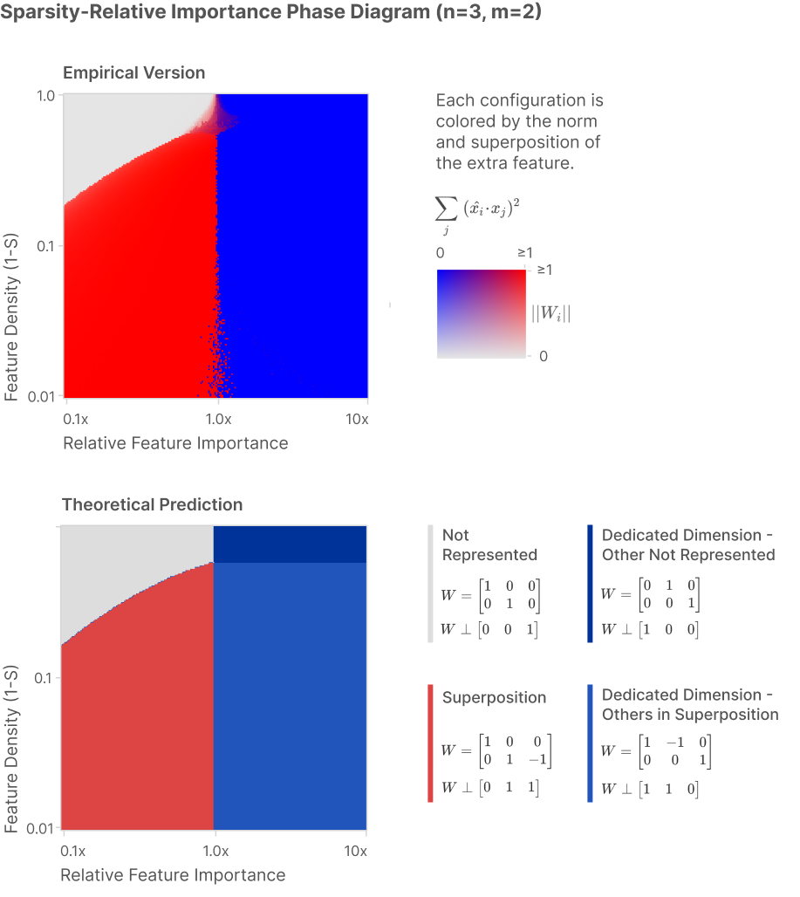

这些图表明，在不同特征编码策略之间确实存在相变。然而，我们将在下一节中看到，这个初步视图没有捕捉到更复杂的结构。

## [超位置的几何](index.html#geometry)

我们已经看到超位置允许模型表示额外特征，并且额外特征的数量随着我们增加稀疏度而增加。在本节中，我们将更详细地研究这种关系，发现一个意想不到的几何故事：特征似乎将自己组织成几何结构，如五边形和四面体！在某种程度上，本节中描述的结构似乎"太优雅而不真实"，我们认为它至少部分是我们正在研究的玩具模型特有的。但它似乎值得研究，因为如果有任何关于这个推广到真实模型的东西，它可能会给我们在理解它们的表示方面很大的杠杆作用。

我们将首先研究均匀超位置，其中所有特征都是相同的：独立、同等重要和同等稀疏。事实证明，均匀超位置与均匀多胞形（uniform polytopes）的几何有惊人的联系！稍后，我们将继续研究非均匀超位置，其中特征不相同。事实证明，这至少在一定程度上可以理解为均匀超位置的变形。

### [均匀超位置](index.html#geometry-uniform)

如上所述，我们从均匀超位置开始我们的研究，其中所有特征具有相同的重要性和稀疏度。我们稍后会看到这种情况有一些意想不到的结构，但也有一个更基本的原因来研究它：它比非均匀情况更容易推理，并且在实验中需要担心的变量更少。

我们想了解当我们改变特征稀疏度 S 时会发生什么。由于所有特征都同样重要，我们将不失一般性地假设每个特征的重要性 I_i = 1。我们将研究具有 n=400 特征和 m=30 隐藏维度的模型，但事实证明特征和隐藏维度的数量并不重要。特别是，事实证明，输入特征的数量 n 并不重要，只要它远大于隐藏维度的数量，n \gg m。事实证明，隐藏维度的数量也并不真正重要，只要我们对学习特征与隐藏特征的比例感兴趣。将隐藏维度的数量加倍只会使模型学习的特征数量加倍。

测量模型已学习特征数量的一个方便方法是查看 Frobenius 范数 ||W||_F^2。由于如果特征被表示则 ||W\_i||^2\simeq 1，如果未被表示则 ||W\_i||^2\simeq 0，这大致是模型已学习表示的特征数量。方便的是，这个范数是基独立的，所以它在密集状态 S=0 下仍然表现良好，其中特征基不被任何东西特权化，模型用任意方向表示特征。

我们将绘制 D^* = m / ||W||_F^2，我们可以将其视为"每个特征的维度"：


令人惊讶的是，我们发现这个图在 1 和 1/2 处是"粘性的"。（这非常模糊地类似于分数量子霍尔效应——参见例如 [这个图](https://www.researchgate.net/profile/Charles-Dunkl/publication/318205131/figure/fig3/AS:512607505350656@1499226561051/Fractional-quantum-Hall-effect.png)。）为什么会这样？经检查，1/2"粘点"似乎对应于一个精确的几何排列，特征以"对跖对"出现，每个正好是另一个的负值，允许将两个特征打包到每个隐藏维度中。似乎对跖对非常有效，以至于模型在稀疏状态的广泛范围内优先使用它们。

事实证明，对跖对只是冰山一角。隐藏在这个曲线下面的是许多极其特定的特征几何配置。

#### [特征维度](index.html#geometry-dimensionality)

在上一节中，我们看到存在一个粘性状态，模型在某种意义上具有"每个特征半个维度"。这是模型表示的特征的平均统计属性，但它似乎暗示了一些有趣的事情。有没有办法理解特定特征获得"维度的分数"？

我们将第 i 个特征的维度 D_i 定义为：

D_i ~=~ \frac{||W\_i||^2}{\sum_j (\hat{W\_i} \cdot W\_j)^2}

其中 W\_i 是与第 i 个特征关联的权重向量列，\hat{W\_i} 是该向量的单位版本。

直观地说，分子表示给定特征被表示的程度，而分母是"有多少特征共享它嵌入的维度"，通过将每个特征投影到其维度上。在对跖情况下，参与对跖对的每个特征将具有维度 D = 1 / (1+1) = 1/2，而未学习的特征将具有维度 0。经验上，当特征在某种意义上"高效打包"时，所有特征的维度似乎加起来等于嵌入维度的数量。

我们现在可以在每个特征的基础上分解上述图。这揭示了更多这些"粘点"！为了更好地理解这一点，我们将创建一个用一些额外信息注释的散点图：

- 我们从上一节中的线图开始。
- 我们用每个模型在每个稀疏度级别中每个特征的单独特征维度散点图覆盖它。
- 特征维度聚集在某些分数处，所以我们为这些绘制线。（事实证明，每个分数对应于特定的权重几何——我们稍后将讨论这个。）
- 我们用"特征几何图"可视化几个模型的权重几何，其中每个特征是一个节点，边权重基于特征嵌入向量的点积的绝对值。所以如果特征不正交，它们就会连接。

让我们看看结果图，然后我们将尝试弄清楚它向我们展示了什么：


这些点为什么聚集在特定的分数上？？我们很快就会看到，模型倾向于创建特定的权重几何结构，并在不同配置之间跳跃。

在上一节中，我们发展了关于叠加作为相变的理论。但这个图上 0（不学习特征）和 1（为特征分配一个维度）之间的一切都是叠加。当特征具有分数维度时就会发生叠加。也就是说——叠加不是单一的现象！

我们如何将其与对相变的原始理解联系起来？我们通常认为水只有三种相：冰、水和水蒸气。但这是一种简化：实际上存在许多种冰的相，通常对应于不同的晶体结构（例如六方冰与立方冰）。以类似的方式，神经网络特征似乎在"叠加"这个一般类别内也有许多其他相。

#### [为什么是这些几何结构？](index.html#geometry-structures)

在前面的图中，我们发现存在对应于以下维度的不同线条：¾（四面体）、⅔（三角形）、½（反向对）、⅖（五边形）、⅜（方反棱柱）和 0（特征未学习）。如果不是因为基特征在密集区域中与其他方向无法区分，我们相信还会有一条 1（为特征分配专用维度）的线。

这些配置中的几个可能会作为著名的 [Thomson 问题](https://en.wikipedia.org/wiki/Thomson_problem) 的解而脱颖而出。（特别是，[方反棱柱](https://en.wikipedia.org/wiki/Square_antiprism) 比立方体不那么著名，主要因其 [在分子几何中的作用](https://en.wikipedia.org/wiki/Square_antiprismatic_molecular_geometry) 而引人注目，因为它是 Thomson 问题的解。）正如我们之前看到的，在非常真实的意义上，我们的模型可以被理解为求解广义版本的 Thomson 问题。当我们的模型选择表示一个特征时，该特征被嵌入为 m 维球体上的一个点。

第二个线索是，存在对应于均匀多面体（例如四面体）的 Thomson 解的线条，但在我们期望看到非均匀解的地方似乎存在分裂的线条（例如，我们期望看到三角双锥的 ⅗ 线，但看到的却是 ⅔ 处的三角形点和 ½ 处的反向点共存）。在均匀多面体中，所有顶点具有相同的几何结构，因此如果我们将特征嵌入其中，每个特征具有相同的维度。但如果我们将特征嵌入为非均匀多面体，不同特征将与其它特征产生或多或少的干扰。

特别是，许多 Thomson 解可以被理解为 [tegum 积](https://polytope.miraheze.org/wiki/Tegum_product)（一种通过在正交子空间中嵌入两个多胞形来构造多胞形的操作）的较小均匀多胞形。（在之前的特征几何图形可视化中，当且仅当两个子图位于不同的 tegum 因子中时，它们是不连通的。）因此，我们应该期望它们的维度实际上对应于底层因子均匀多胞形。


这也表明了一个可能的原因，为什么我们观察到 3D Thomson 问题解，尽管我们实际上在研究更高维版本的问题。就像许多 3D Thomson 解是 2D 和 1D 解的 tegum 积一样，也许更高维的解通常是 1D、2D 和 3D 解的 tegum 积。

tegum 积中因子的正交性具有有趣的含义。就叠加而言，这意味着 tegum 因子之间不能有任何"干扰"。这可能是玩具模型所偏好的：让许多特征同时干扰可能对它非常不利。（参见 [我们早期的数学分析](index.html#demonstrating-math) 中的相关讨论。）

### 附注：多胞形与低秩矩阵

至此，有必要明确指出，多胞形与对称、正定、低秩矩阵（即形式为 W^TW 的矩阵）之间存在对应关系。这种对应关系是我们上一节结果的基础，通常对思考叠加很有用。

在某些方面，这种对应关系是平凡的。如果有一个形式为 W^TW 的秩为 m 的 n×n 矩阵，那么 W 是一个 n×m 矩阵。我们可以将 W 的列解释为 m 维空间中的 n 个点。这开始变得有趣的地方在于，它清楚地表明 W^TW 由几何结构驱动。特别是，我们可以看到非对角项如何由点的几何结构驱动。

换句话说，多胞形与叠加策略之间存在精确的对应关系。例如，在 2 维空间中将三个特征置于叠加状态的每种策略都对应一个三角形，每个三角形都对应这样的策略。从这个角度来看，如果我们有三个同等重要且同等稀疏的特征，最优策略是等边三角形就不足为奇了。

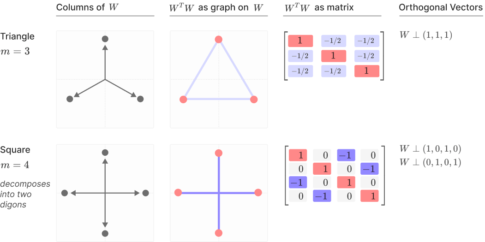

这种对应关系也可以反向进行。假设我们有一个形式为 W^TW 的秩为 (n-i) 的矩阵。我们可以通过 W 未表示的维度来表征它——也就是说，哪些方向与 W 正交？例如，如果我们有一个 (n-1) 矩阵，我们可能会问 W 未表示的单个方向是什么？如果我们假设 W^TW 在不表示某些向量的约束下尽可能"像单位矩阵"，这就特别有信息量。

事实上，给定这样一组正交向量，我们可以通过从 n 个基向量开始并将它们投影到与给定向量正交的空间来构造一个多胞形。例如，如果我们在三维空间中开始，然后投影使得 W ⊥ (1,1,1)，我们得到一个三角形。更一般地，设置 W ⊥ (1,1,1,...) 给我们一个 [正则 n-单纯形](https://polytope.miraheze.org/wiki/Simplex)。这很有趣，因为在某种意义上这是"最小可能的叠加"。假设特征同等重要且稀疏，不表示的最佳方向是全密集向量 (1,1,1,...)！

### [非均匀叠加](index.html#geometry-non-uniform)

到目前为止，本节一直关注均匀叠加的几何结构，其中所有特征具有同等重要性、同等稀疏性且独立。模型本质上是在求解 Thomson 问题的变体。因为所有特征都相同，对应于均匀多面体的解获得特别低的损失。在本小节中，我们将研究非均匀叠加，其中特征在某种程度上不是均匀的。它们可能在重要性和稀疏性上有所不同，或者具有使它们不独立的相关结构。这会扭曲我们之前看到的均匀几何结构。

在实践中，真实神经网络中的叠加似乎是非均匀的，因此发展对它的理解似乎很重要。不幸的是，我们目前远未形成关于非均匀叠加几何结构的全面理论。因此，本节的目标仅仅是强调我们观察到的一些更引人注目的现象：

- 特征在重要性或稀疏性上的变化会导致多胞形随着不平衡的积累而平滑变形，直到达到临界破裂点，此时它们跳转到另一个多胞形。
- 相关特征倾向于正交，通常形成于不同的 tegum 因子中。因此，相关特征可能形成正交局部基。当它们不能正交时，它们倾向于并排排列。在某些情况下，相关特征合并为单个特征：这暗示了某种"叠加类行为"和"PCA 类行为"之间的相互作用。
- 反相关特征在需要叠加时倾向于位于同一 tegum 因子中。它们倾向于具有负干扰，理想情况下是反向的。

我们尝试通过一些代表性实验来说明这些现象。

#### [扰动单个特征](index.html#geometry-perturb)

最简单的非均匀叠加类型是变化一个特征而保持其他特征均匀。作为一个实验，让我们考虑一个实验，我们在 m=2 维中表示 n=5 个特征。在均匀情况下，重要性 I=1 且激活密度 1-S=0.05，我们得到一个正五边形。但如果我们变化一个点——在这种情况下我们使其更稀疏或更密集——我们看到五角星拉伸以适应新值。如果我们使其更密集，更频繁地激活（黄色），其他特征会排斥它，给它更多空间。另一方面，如果我们使其更稀疏，激活频率更低（蓝色），它占用更少的空间，其他点会向它推挤。

如果我们使其足够稀疏，就会发生相变，它从五边形坍缩为一对二角形，较稀疏的点位于零。相变对应于对应于两种不同几何结构的损失曲线交叉。（这一观察使我们能够直接确认它确实是真正的一阶相变。）

为了可视化解，我们将它们规范化，以一致的方式旋转它们以相互对齐。

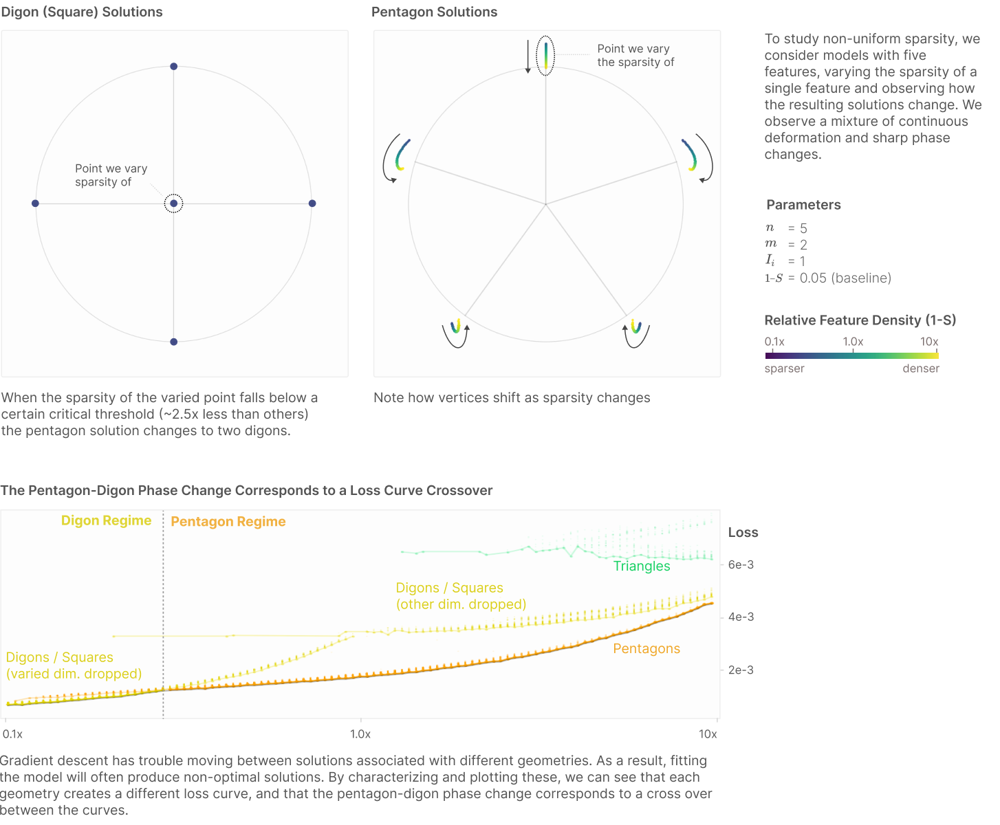

这些结果似乎表明，至少在某些情况下，非均匀叠加可以被理解为均匀叠加的变形以及在均匀叠加配置之间跳跃，而不是完全不同的机制。由于均匀叠加具有许多可理解的结构，而现实世界的叠加几乎肯定是非均匀的，这似乎非常有希望！

五边形解不在单位圆上的原因是模型减少了正干扰的影响，设置轻微的负偏置以截断噪声，并设置其权重为 ||W\_i|| = 1 / (1-b_i) 以补偿。距离单位圆的距离可以解释为主要由正干扰量驱动。

对于重新实现的说明：使用二维隐藏空间进行优化使这更容易研究，但实际的优化过程对梯度下降来说真的很有挑战性——甚至比只有三个维度还要难得多。获得清晰的结果需要多次拟合每个模型并取损失最低的解。然而，这有一线希望：在散点图上可视化次优解（如上所示）使我们能够看到不同几何结构的损失曲线，并获得对相变的更深入理解。

### [相关和反相关特征](index.html#geometry-correlated)

当特征之间存在相关性时，会出现更复杂的非均匀叠加形式。这对于理解现实世界中的叠加似乎至关重要，因为许多特征是相关或反相关的。

例如，一个非常实际的问题是，我们是否应该期望多义神经元在不同模型中将相同的特征分组在一起。如果分组是随机的，你可以通过跨模型比较来检测多义神经元！然而，我们将看到相关结构强烈影响哪些特征在叠加中分组在一起。

这种行为似乎非常微妙，具有某种"偏好顺序"来决定相关特征在叠加中如何表现。模型理想地将相关特征正交表示，在单独的 tegum 因子中，它们之间没有相互作用。当这失败时，它倾向于将它们排列得尽可能靠近——它更偏好相关特征之间的正干扰而不是负干扰。最后，当没有足够的空间来表示所有相关特征时，它将坍缩它们并表示它们的主成分！相反，当特征反相关时，模型倾向于让它们干扰，特别是负干扰。我们将在下面的几个实验中演示这一点。

#### [探索相关和反相关特征的设置](index.html#geometry-correlated-setup)

在本节中，我们将引用"相关特征集"和"反相关特征集"。

**相关特征集**。我们的相关特征集可以被认为是共现特征的"束"。可以想象图像分类器中可能发生的理想化版本：可能有一束特征用于识别动物（毛皮、耳朵、眼睛），另一束用于识别建筑物（角落、窗户、门）。来自这些束之一的特征可能会一起出现。在数学上，我们通过将相关特征集中所有特征是否为零的选择链接在一起来表示这一点。回想一下，我们 [最初定义](index.html#demonstrating-setup-x) 我们的合成分布，使特征以概率 S 为零，否则在 [0,1] 之间均匀分布。我们简单地让相同的样本决定它们是否为零。

**反相关特征集**。人们也可以想象极不可能一起出现的反相关特征。为了模拟这些，我们将拥有反相关特征集，其中集合中一次只能有一个特征激活。为了模拟这一点，我们将使特征集以概率 S 完全为零，但如果它激活，则集合中只有一个随机选择的特征从 [0,1] 中均匀采样，其他特征为零。

#### [相关和反相关特征的组织](index.html#geometry-organization)

对于我们的初步调查，我们简单地训练一些具有相关和反相关特征的小型玩具模型并观察发生了什么。为了便于研究，我们将自己限制在 m=2 的情况下，我们可以将权重明确可视化为 2D 空间中的点。一般来说，这样的解可以被理解为单元圆上点的集合。为了使解易于比较，我们旋转和翻转解以相互对齐。

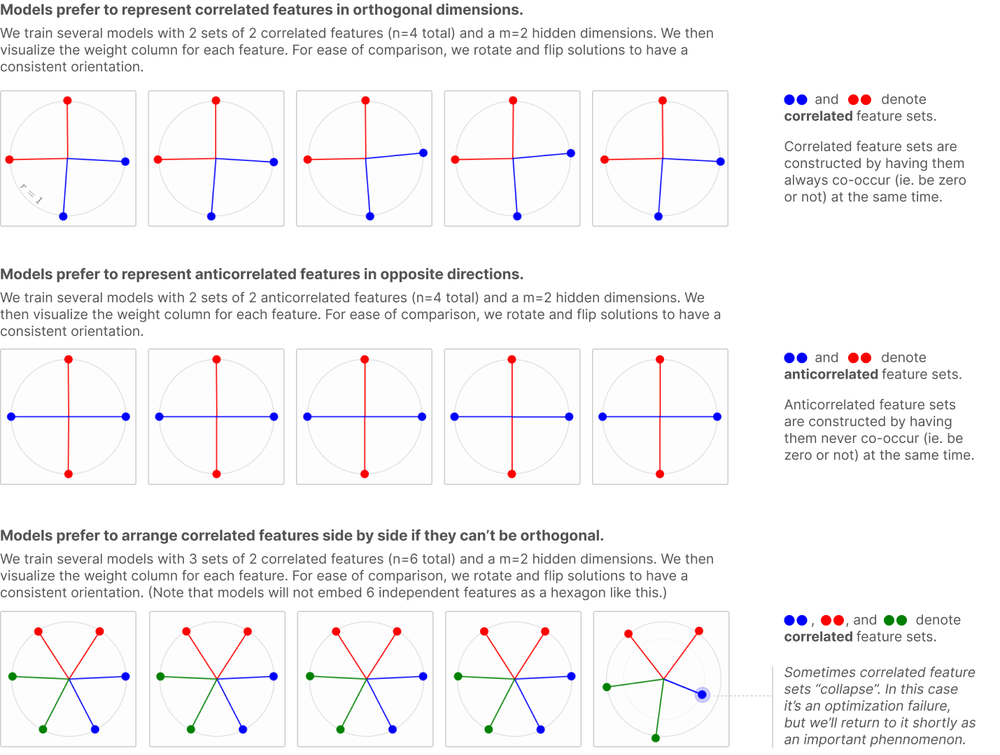

#### [局部近似正交基](index.html#geometry-local-bases)

事实证明，模型将相关特征排列为正交的倾向实际上是一个非常强烈的现象。特别是，对于较大的模型，它似乎产生一种"局部近似正交基"，其中，即使模型整体处于叠加状态，单独考虑的相关特征集是（几乎）正交的，可以理解为具有非常少的叠加。

为了研究这一点，我们训练了一个具有两组相关特征的较大模型并可视化 W^TW。

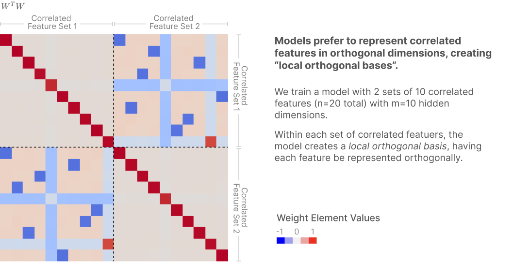

如果这个结果在真实神经网络中成立，它表明我们可能能够做出一种"局部非叠加"假设，其中对于某些子分布，我们可以假设激活的特征不在叠加中。这可能是一个强大的结果，使我们能够自信地使用诸如 PCA 之类的方法，这些方法在叠加的背景下通常使用可能没有原则。

#### [相关特征的坍缩](index.html#geometry-collapsing)

最有趣的特性之一是，似乎存在与主成分分析 (PCA) 和叠加的权衡。如果有两个相关特征 a 和 b，但模型只有容量表示一个，模型将表示它们的主成分 (a+b)/√2，这是一个稀疏变量，对损失的影响比单独任何一个都大，并忽略第二主成分 (a-b)/√2。

作为一个实验，我们考虑六个特征，组织成三组相关对。每个相关对中的特征由给定颜色表示（红色、绿色和蓝色）。相关性是通过让两个特征总是同时激活而产生的——它们要么都为零，要么都不为零。（当它们激活时采取的确切非零值是不相关的。）

随着我们改变特征的稀疏性，我们发现在非常稀疏的区域，我们观察到预期的叠加，特征排列在六边形中，相关特征并排。随着我们减少稀疏性，特征逐渐"坍缩"到它们的主成分中。在非常密集的区域，解变得等同于 PCA。


这些结果似乎暗示 PCA 和叠加在某种意义上是互补的策略，彼此权衡。随着特征变得更加相关，PCA 成为更好的策略。随着特征变得更加稀疏，叠加成为更好的策略。当特征既稀疏又相关时，似乎会出现每种策略的混合。能够更深入地理解这个权衡空间会很好。

在连续 [等变特征](https://distill.pub/2020/circuits/equivariance/) 的背景下思考这也很有趣，例如以不同旋转出现的特征。

## [叠加与学习动态](index.html#learning)

本文的重点是叠加如何对完全训练的神经网络的功能做出贡献，但作为一个简短的迂回，有趣的是询问我们的玩具模型——以及由此产生的叠加——如何在训练过程中演变。

有几个原因使这些模型看起来是研究学习动态的特别有趣的案例。首先，与大多数神经网络不同，完全训练的模型收敛到一个简单但非平凡的结构，这与神经网络的权重结构可能具有我们可以理解的几何权重结构的证据相呼应。人们可能希望理解最终结构会使我们更容易理解训练过程中的演变。其次，叠加暗示了令人惊讶的离散结构（各种规则多胞形！）。我们将发现底层学习动态也令人惊讶地离散，延续了神经网络学习可能不如看起来那么连续的越来越多的证据趋势。最后，由于叠加对可解释性有重要意义，能够理解它如何在训练过程中出现会很好——我们应该期望模型在早期就使用叠加，还是它只在训练后期出现，当模型努力适应更多特征时？

不幸的是，在本文的范围内，我们无法对这些问题进行它们应得的详细调查。相反，我们将把自己限制在几个特别引人注目的现象上，将更详细的调查留给未来的工作。

#### [现象 1：离散"能级"跳跃](index.html#learning-jumps)

也许我们注意到的最引人注目的现象是，具有大量特征的玩具模型的学习动态似乎由"能级跳跃"主导，其中特征在不同特征维度之间跳跃。（回想一下，特征的 [维度](index.html#geometry-dimensionality) 是专用于表示特征的维度分数。）

让我们考虑我们在 [前一节](index.html#geometry-dimensionality) 中研究均匀叠加几何时研究的问题设置，其中我们有大量同等重要性和稀疏性的特征。正如我们之前看到的，特征最终将自己排列成具有分数维度的少数多胞形。

一个自然的问题是，这些特征维度在训练过程中会发生什么。让我们选择一个所有特征都收敛到二角形的模型并观察。在第一个图中，每条彩色线对应于单个特征的维度。第二个图显示了损失曲线在同一持续时间内的变化。


注意一些特征的维度如何在不同值之间"跳跃"并交换位置。当这种情况发生时，损失曲线也经历突然下降（第一次跳跃时非常小，第二次跳跃时较大）。

这些结果使我们怀疑，较大模型中看似平滑的损失曲线下降实际上是由特征在不同配置之间的许多小跳跃组成的。（对于类似机制突然变化的结果，参见 Olsson 等人的 induction head 相变，以及 Nanda 和 Lieberum 关于模算术中相变的结果。更广泛地说，考虑 grokking 现象。）

#### [现象 2：学习作为几何变换](index.html#learning-geometric)

我们的许多玩具模型解可以被理解为对应于几何结构。当只有 m=3 隐藏维度时，这特别容易看到和研究，因为我们可以直接将特征嵌入可视化为 3D 空间中形成多面体的点。

事实证明，至少在某些情况下，导致这些结构的学习动态可以被理解为一系列简单、独立的几何变换！

一个特别有趣的例子发生在 [相关特征](index.html#geometry-correlated-setup) 的背景下，如前一节所研究。考虑在 m=3 维度内的叠加中表示 n=6 特征的问题。如果我们有 6 个特征是 2 组 3 个相关特征，我们观察到一个非常有趣的模式。学习以不同的机制进行，这些机制在损失曲线中可见，每个机制对应于一个不同的几何变换：


（虽然最后的解——一个具有来自不同相关集的特征排列成反向对的八面体——似乎是一个强大的吸引子，但上面可视化的学习轨迹似乎是吸引模型的几个不同学习轨迹之一。不同的轨迹在步骤 C 处有所不同：有时模型从一开始就被直接拉入反棱柱配置，或者将特征组织成反向对。据推测，这取决于当步骤 B 结束时模型最接近哪个特征几何结构。）

我们在这里观察到的学习动态似乎与之前关于简单模型的发现直接相关。发现两层神经网络在训练早期倾向于学习问题的线性近似。虽然我们数据生成过程的技术细节与他们的定理假设不完全匹配，但相同的基本机制很可能在起作用。在我们的情况下，我们看到玩具网络在学习更好的非线性解之前学习线性 PCA 解。第二个相关发现来自，他们研究了层次特征集，具有与我们考虑的数据生成过程相似的数据生成过程。他们通过经验发现某些网络（非线性和深度线性）以与我们观察到的非常相似的方式"分裂"嵌入向量。他们还根据底层动力系统提供了理论分析。一个关键区别是他们关注拓扑——新兴特征表示的分支结构——而不是几何结构。尽管存在这种差异，但他们的分析似乎可以推广到我们的情况。

## [与对抗鲁棒性的关系](index.html#adversarial)

虽然我们对叠加对可解释性的影响最感兴趣，但似乎存在与对抗样本的联系。如果稍加思考，这种联系实际上可以非常直观。

在没有叠加的模型中，第一个特征的端到端权重为：

(W^TW)_0 ~~==~~ (1, 0, 0, 0, ...)

但在具有叠加的模型中，它类似于：

(W^TW)_0 ~~==~~ (1, ε, -ε, ε, ...)

ε 条目（纯粹是叠加"干扰"的产物）为对手攻击最重要的特征创造了一个明显的方式。注意，即使在无限数据极限下这可能仍然成立：拟合稀疏无限数据的模型的最优行为是使用叠加来表示更多特征，使其容易受到攻击。

为了测试这一点，我们生成了 L2 对抗样本（允许最大 L2 攻击范数为平均输入范数的 0.1）。我们最初使用梯度下降生成攻击，但发现对于 ReLU 神经元 99% 的时间处于零状态的极稀疏样本，攻击很困难，实际上是由于梯度掩蔽。相反，我们发现通过考虑每个特征的最优 L2 攻击 (λ(W^TW)_i / ||(W^TW)_i||_2) 并取这些攻击中对模型性能损害最大的一个来分析推导对抗攻击效果更好。

我们发现，随着叠加的形成，对抗样本的脆弱性急剧增加（增加>3 倍），并且脆弱性水平密切跟踪每维特征数（[特征维度](index.html#geometry-dimensionality) 的倒数）。

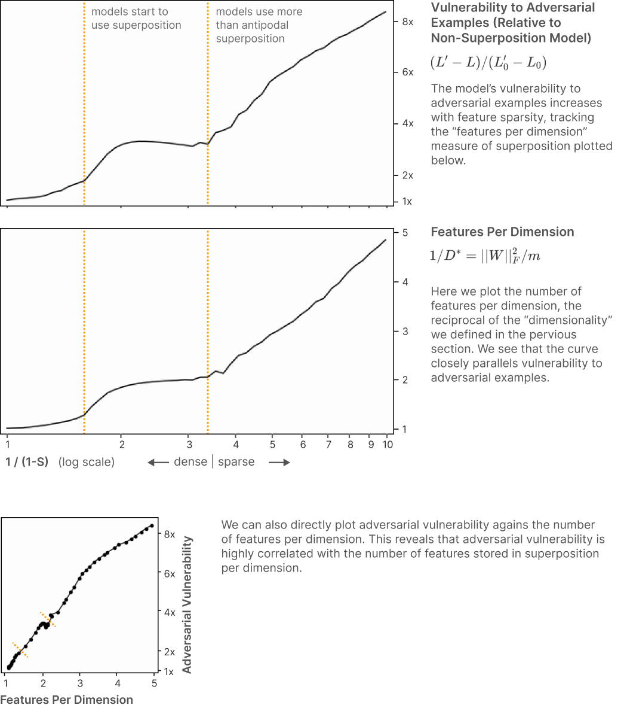

我们不愿推测叠加在实际中对对抗样本的出现有多大责任。有关于为什么对抗样本出现而不参考叠加的引人注目的理论（例如）。但有趣的是注意，如果一个人想要论证"叠加最大化立场"，许多与对抗样本相关的有趣现象确实可以从叠加中预测。如上所见，叠加可以用来解释为什么对抗样本存在。它还预测对抗鲁棒模型将具有更差的性能，因为使模型鲁棒需要放弃叠加并表示更少的特征。它预测更多对抗鲁棒模型可能更具可解释性（参见例如）。最后，如果叠加中特征的排列受到哪些特征相关或反相关的强烈影响（参见 [关于此的早期结果](index.html#geometry-correlated)），它可以说可以预测对抗样本的迁移（参见例如）。未来的工作可能会很有趣，看看叠加是对抗样本的重要贡献者这一假设能走多远。

除了观察到叠加会导致模型容易受到对抗样本攻击外，我们还简要实验了对抗训练，看看这种关系是否可以反向使用以减少叠加。为了保持训练合理高效，我们使用针对随机特征的分析最优攻击。我们发现这确实减少了叠加，但攻击必须变得不合理地大（80% 输入 L2 范数）才能完全消除它，这似乎不令人满意。也许更强的对抗攻击会效果更好。我们没有进一步探索这一点，因为对抗训练增加的成本和复杂性使我们想要优先处理叠加的其他攻击路线。

## [特权基中的叠加](index.html#privileged-basis)

到目前为止，我们在没有特权基的模型中探索了叠加。我们可以任意旋转隐藏激活，只要我们旋转所有权重，就有完全相同的模型行为。也就是说，对于任何具有权重 W 的 ReLU 输出模型，我们可以采用任意正交矩阵 O 并考虑模型 W' = OW。由于 (OW)^T(OW) = W^TW，结果将是一个相同的模型！

没有特权基的模型是优雅的，可以作为某些没有特权基的神经网络表示的有趣类比——词嵌入，或 transformer 残差流。但我们也（也许主要）想要理解存在确实强加特权基的神经元的神经网络表示，例如 transformer MLP 层或卷积网络神经元。

我们在本节的目标是探索给我们特权基的最简单玩具模型。我们至少可以通过两种方式做到这一点：我们可以向隐藏层添加激活函数或应用 L1 正则化。我们将专注于添加激活函数，因为我们最感兴趣理解的表示是具有神经元的隐藏层，例如 transformer MLP 层。

这给了我们以下"ReLU 隐藏层"模型：

h = ReLU(Wx) 
x' = ReLU(W^T h + b)

我们将在与之前相同的数据上训练这个模型。

从可解释性的角度来看，在隐藏层添加 ReLU 从根本上改变了模型。关键在于，虽然我们之前模型中的 W 难以解释（回想一下我们可视化 W^TW 而不是 W），但 ReLU 隐藏层模型中的 W 可以直接解释，因为它将特征与基对齐的神经元连接起来。

我们很快就会更详细地讨论这一点，但这里是从线性隐藏层模型和 ReLU 隐藏层模型产生的权重的比较：


回想一下，我们将输入中的基元素视为"特征"，将中间层中的基元素视为"神经元"。因此 W 是从特征到神经元的映射。

我们在上面的图中看到的是，特征正在以结构化的方式与神经元对齐！许多神经元只是专用于表示一个特征！（这是证明为什么以神经元为中心的可解释性方法——例如原始 Circuits 线程中的许多工作——在某些情况下可以有效的关键属性。）

让我们更详细地探索这一点。

#### 用神经元可视化叠加

拥有特权基为我们的模型可视化开辟了新的可能性。正如我们上面看到的，我们可以简单地检查 W。我们还可以制作每个神经元的堆叠条形图，其中对于每个神经元，我们将权重可视化为彼此堆叠的矩形堆栈：
- 堆叠图中的每一列可视化了 W 的一列。
- 每个矩形代表一个权重条目，高度对应其绝对值。
- 每个矩形的颜色对应于它所作用的特征（即它在 W 的哪一行）。
- 负值位于 x 轴下方。
- 矩形的顺序并不重要。

当模型变大时，这种堆叠图可视化会很漂亮。它还能让多义神经元（polysemantic neurons）变得明显：它们简单地对应于拥有多个权重。

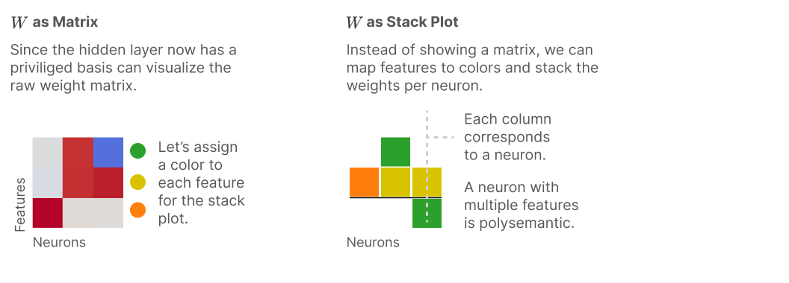

我们现在将可视化一个 ReLU 隐藏层 toy model，其中 n=10，m=5，I^i = 0.75^i，并变化特征稀疏度水平。我们选择了一个非常小的模型（只有 5 个神经元），既为了便于可视化，也为了规避这个 toy model 的一些问题，我们将在下面讨论。

然而，我们发现这些小模型更难优化。对于每个展示的模型，我们训练了 1000 个模型并可视化了损失最低的那个。虽然典型解通常与所示的最小损失解相似，但选择最小损失解揭示了特征如何与神经元对齐的更多结构。它还揭示出存在一些稀疏度范围，其中所有在该稀疏度数据上训练的模型的最优解都具有相同的权重配置。

解在下面可视化，既可视化了原始 W，也展示了神经元堆叠条形图。我们根据特征是否处于叠加态（superposition）来给堆叠条形图中的特征着色，并根据神经元存储的是否多于一个特征，将神经元着色为单义（monosemantic）或多义（polysemantic）。神经元顺序是手工选择的（因为它是任意的）。


最重要的是要注意，随着稀疏度增加，存在从单义神经元到多义神经元的转变。单义神经元确实在某些机制中存在！多义神经元存在于其他机制中。它们可以同时存在于同一个模型中！此外，虽然不太清楚如何形式化这一点，但看起来很像存在一个神经元级别的相变（phase change），与我们之前看到的特征相变相呼应。

检查多义解的结构也很有趣，结果证明它们具有惊人的结构性和神经元对齐性。特征通常对应于神经元集合（单义神经元可以被视为特征仅对应于单元素集合的特例）。多义神经元也存在结构。它们从单义过渡到仅表示少数几个特征，再到逐渐表示更多特征。然而，尚不清楚这其中有多少可以推广到真实模型。

#### ReLU 隐藏层 Toy Model 模拟 Identity 的局限性

不幸的是，本节中描述的 toy model 有一个显著的弱点，这限制了它显示有趣结果的机制。问题在于模型无法从 ReLU 隐藏层中受益——它除了限制模型如何编码信息外没有任何作用。如果有任何机会，模型会规避它。例如，给定隐藏层偏置，模型会将所有偏置设为正数，将神经元shift 到它们表现为线性的正区间。如果移除偏置但给模型足够的特征，它将通过平均多个特征来模拟偏置。模型只有在绝对被迫时才会使用 ReLU 激活函数，这是研究这个 toy model 的一个显著缺点。

我们将在下一节介绍一个没有这个问题的模型，但想将这个模型作为一个更简单的案例研究来研究。

## [叠加态中的计算](index.html#computation)

到目前为止，我们已经展示了神经网络可以在叠加态中存储稀疏特征然后恢复它们。但我们实际上认为叠加态比这更强大——我们认为神经网络可以完全在叠加态中执行计算，而不仅仅是将其用作存储。这个模型还将为我们提供一种更原则性的方式来研究特权基（privileged basis），即特征与基维度对齐的情况。

为了探索这一点，我们考虑一个新设置，其中我们将输入层和输出层想象为我们假设的解耦模型（disentangled model）的层，但将隐藏层设为更小的层，我们想象它是可能使用叠加态的观测模型。然后我们将尝试计算一个简单的非线性函数，并探索它是否可以使用叠加态来完成这个任务。由于模型将具有（并且需要使用）隐藏层非线性，我们还将看到特征与特权基对齐。


具体来说，我们将让模型计算 y=\text{abs}(x)。绝对值是一个有吸引力的函数，因为有一个非常简单的方法用 ReLU 神经元计算它：\text{abs}(x) = \text{ReLU}(x) + \text{ReLU}(-x)。这个简单结构将使我们很容易研究隐藏层如何被用于计算的几何结构。

由于这个模型需要 ReLU 来计算绝对值，它没有上一节模型试图避免激活函数的问题。

### [实验设置](index.html#computation-setup)

输入特征向量 x 仍然是稀疏的，每个特征 x\_i 有概率 S_i 为 0。然而，由于我们想让模型计算绝对值，我们需要允许它取非正值，这样这才是一个非平凡的任务。因此，如果它非零，其值现在从 [-1,1] 均匀采样。目标输出 y 是 y=\text{abs}(x)。

按照上一节，我们将考虑"ReLU 隐藏层"toy model 变体，但不再将两个权重绑定为相同：

h = \text{ReLU}(W_1x) 
y' = \text{ReLU}(W_2h+b)

损失仍然是均方误差，按特征重要性 I_i 加权，与之前相同。

### [基本结果](index.html#computation-basic)

使用这个模型，研究单个特征如何嵌入变得不那么直接了；由于隐藏层上的 ReLU，我们不能只研究 W_2^TW_1。而且因为 W_2 和 W_1 现在是独立学习的，我们不能只研究 W_1 的列。我们相信通过一些操作，我们可以通过独立考虑"正特征"和"负特征"来恢复早期模型的大部分简单性，但我们将专注于另一种视角。

正如我们在上一节看到的，拥有隐藏层激活函数意味着从神经元角度可视化权重是有意义的。我们可以直接可视化 W，或者像之前那样作为神经元堆叠图。我们也可以将其可视化为图，这有时有助于理解计算。


让我们看看当我们训练一个具有 n=3 个特征的模型在 m=6 个隐藏层神经元上执行绝对值时会发生什么。如果没有叠加态，模型需要两个隐藏层神经元来为一个特征实现绝对值。

所得模型——除了一个关于重新缩放输入和输出权重的微妙问题[^note]——完全按照人们预期的方式执行绝对值。对于每个输入特征 x\_i，它构建一个"正侧"神经元 \text{ReLU}(x\_i) 和一个"负侧"神经元 \text{ReLU}(-x\_i)。然后将它们相加以计算绝对值：

[^note]: 注意模型在学习 W_1 时有一个自由度：我们可以通过将 W_1 的该行乘以 \alpha，将 W_2 的该列乘以 \alpha^{-1} 来重新缩放任何隐藏单元，并得到相同的模型。为了可视化的一致性，我们在可视化之前重新缩放每个隐藏单元，使得从 W_1 到该神经元的最大幅度权重的幅度为 1。


### [叠加态 vs 稀疏度](index.html#computation-super-v-sparsity)

我们已经看到——正如预期的那样——我们的 toy model 可以学习实现绝对值。但它可以使用叠加态来为更多特征计算绝对值吗？为了测试这一点，我们训练具有 n=100 个特征和 m=40 个神经元的模型，特征重要性曲线为 I_i = 0.8^i，变化特征稀疏度。[^note2]

[^note2]: 这些特定值被选择用来说明我们感兴趣的现象：当有更多神经元时，绝对值模型学习得更容易，但我们希望保持数字足够小以便于可视化。

关于可视化的几点说明：由于我们主要感兴趣的是理解叠加态和多义神经元，我们将展示权重绝对值的堆叠权重图。特征按叠加态着色。为了使图表更易读，神经元根据它们的多义程度（根据图表目测判断）进行淡色着色。神经元顺序按最大特征的重要性排序。

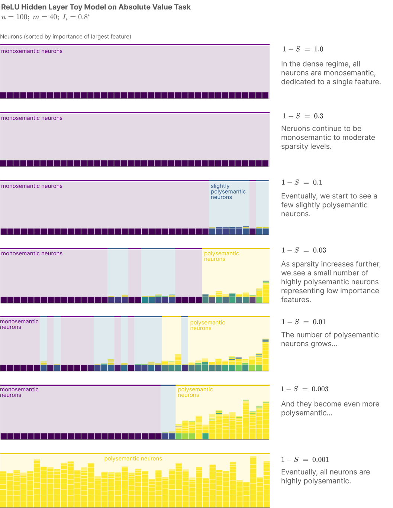

就像我们在 ReLU 隐藏层模型中看到的那样，这些结果表明，在适当的情况下，激活函数会创建特权基并导致特征与基维度对齐。在密集机制中，我们最终得到每个神经元表示一个单一特征，我们可以直接从神经元激活中读取特征值。

然而，一旦特征变得足够稀疏，这个模型也使用叠加态来表示比它拥有的神经元更多的特征。这个结果值得注意，因为它展示了神经网络甚至在以叠加态表示的数据上执行计算的能力。[^note3]

[^note3]: 你可能会问的一个问题是，我们是否可以通过检查损失来量化叠加态实现额外计算的能力。不幸的是，我们不能轻易做到这一点。当我们改变任务使其更稀疏时，叠加态就会发生。因此，具有不同叠加态量的模型的损失是不可比较的——它们在测量不同任务的损失！记住，模型需要使用隐藏层 ReLU 来计算绝对值；梯度下降设法找到有用的近似计算的解，即使每个神经元编码多个特征的混合。

关注中间稀疏度机制，我们发现几个额外的定性行为，我们发现它们迷人地类似于在真实、全尺寸神经网络中观察到的行为：


首先，我们发现在某些机制中，模型的许多神经元将编码纯特征，但其中一部分将是高度多义的。这类似于我们之前在 ReLU 输出模型中看到的[相变](index.html#phase-change)。然而，在那种情况下，相变是相对于特征的，更重要的特征不被放入叠加态。在这个实验中，神经元没有任何内在重要性，但我们看到表示最重要特征的神经元（在左侧）往往是单义的。

我们发现这与[之前在视觉模型中的一些工作](https://distill.pub/2020/circuits/zoom-in/#claim-2-superposition)有暗示性的相似之处，该工作发现一些层包含"大部分纯"特征神经元，但一些神经元在不同尺度上表示额外特征。

我们还注意到，许多神经元似乎与单个"主要"特征相关联——由相对较大的权重编码—— coupled with 一个或多个"次要"特征，以较小幅度的权重编码到该神经元。如果我们在一系列输入示例上观察这样一个神经元的激活，我们会发现该神经元的最大激活都或几乎都与"主要"特征的存在相关联，但较低幅度的激活则更加多义。

有趣的是，这个描述与研究人员之前在语言模型工作中发现的非常吻合——许多神经元在我们在数据集上检查它们的最强激活时似乎是可解释的，但进一步调查显示它们会为其他含义或模式激活，通常是在较低幅度。虽然只是暗示性的，但我们的 toy model 能够重现这些更大神经网络的定性特征，这提供了一个令人兴奋的迹象，表明这些模型正在阐明一般现象。

### [非对称叠加态基序](index.html#computation-asymmetric-motif)

如果神经网络可以在叠加态中执行计算，一个自然的问题是询问它们究竟是如何做到的。这在权重方面机械地看起来是什么样子？在本小节中，我们将（主要）研究这样一个模型，并看到一个有趣的非对称叠加态基序（motif）。（我们使用"基序"一词是在[原始电路线程的意义上](https://distill.pub/2020/circuits/zoom-in/#claim-2-motifs)，受其在系统生物学中使用的启发。）

我们试图理解的模型如下左图所示，可视化为神经元权重堆叠图，特征对应于颜色。该模型只进行有限量的叠加态，许多权重可以理解为简单地以预期方式实现绝对值。

然而，有一些神经元在做其他事情……


这些其他神经元实现了两个非对称叠加态和抑制（inhibition）的实例。每个实例由两个神经元组成：

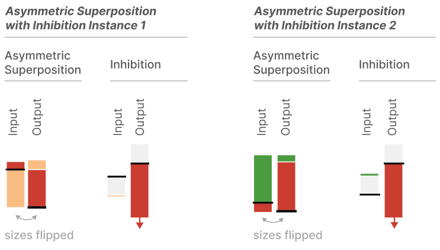

一个神经元进行非对称叠加态。在正常叠加态中，人们可能会以相等权重存储特征（例如 W=[1,-1]），然后具有相等输出权重（W=[1,1]）。在非对称叠加态中，人们以不同幅度存储特征（例如 W=[2,-\frac{1}{2}]），然后具有互逆输出权重（例如 W=[\frac{1}{2}, 2]）。这导致一个特征严重干扰另一个特征，但避免另一个干扰第一个！

为了避免这种干扰的后果，模型有另一个神经元在本来会有正干扰的情况下强烈抑制该特征。这本质上将正干扰（可能会大大增加损失）转换为负干扰（由于输出 ReLU，后果有限）。


还有一些其他权重这无法解释。（我们相信它们实际上是小的条件偏置。）但这种非对称叠加态和抑制模式似乎是主要故事。

## [叠加态的战略图景](index.html#strategic)

虽然叠加态在科学上很有趣，但我们的许多兴趣来自务实的动机：我们认为叠加态与利用可解释性对 AI 系统安全性做出主张的挑战密切相关。特别是，它对我们看到的最有希望的路径构成了明确的挑战，即能够说神经网络不会执行某些有害行为或捕捉"未知的未知"安全问题。这是因为叠加态与识别和枚举模型中所有特征的能力密切相关，而枚举所有特征的能力将是关于模型行为做出主张的强大原语。

我们本节首先描述如何在某种意义上"解决叠加态"等同于许多可能对安全有用的强可解释性属性。接下来，我们将描述人们可能采取的三种高级策略来"解决叠加态"。最后，我们将描述一些其他额外的战略考虑。

### [安全性、可解释性与"解决叠加态"](index.html#strategic-safety)

我们希望有一种方式可以确信模型永远不会执行某些行为，如"故意欺骗"或"操纵"。目前，尚不清楚如何展示这一点，但我们认为一个有希望的工具将是识别和枚举所有特征的能力。拥有对神经网络计算基本单元的全称量词是朝着说某些类型的电路不存在迈出的重要一步。[^note4]

[^note4]: 最终我们想说模型不实现某些类别的行为。枚举所有特征使得说一个特征不存在变得容易（例如"没有'欺骗行为'特征"），但这不完全是我们想要的。我们期望需要表示世界的模型会表示一些令人不快的行为。但可能可以构建更微妙的主张，如"所有'欺骗行为'特征不参与电路 X、Y 和 Z。"它似乎也是解决"未知的未知"的强大工具，因为这是一种在某种意义上完全覆盖网络行为的方式。

这与叠加态有何关系？事实证明，枚举特征的能力与叠加态密切相关。看到这一点的一种方式是想象一个具有特权基且没有叠加态的神经网络（如在早期 InceptionV1 中发现的单义神经元，例如：）：特征将简单地对应于神经元，你可以通过枚举神经元来枚举特征。叠加态还使得在没有特权基的模型中找到可解释方向变得更加困难。没有叠加态，人们可以尝试做类似 Gram–Schmidt 过程的事情，逐步识别可解释方向然后移除它们以使未来特征更容易识别。但有了叠加态，即使人们知道某个方向是特征方向，也不能简单地移除一个方向。联系也是双向的：如果人们有能力枚举特征，人们可以使用特征方向进行压缩感知（compressed sensing），以（高概率）将叠加态模型的激活"展开"为更大的非叠加态模型的激活。

因此，我们将任何给我们枚举特征能力的方法——等价地，展开激活——称为"叠加态的解"。任何解都在考虑范围内，从创建根本没有叠加态的模型，到事后识别哪些方向对应于特征。我们稍后将讨论可能性空间。

我们已经用特征枚举来激励"解决叠加态"，但值得注意的是，它等同于（或对）许多其他人们可能关心的可解释性属性是必要的：

- **分解激活空间（Decomposing Activation Space）**。任何可解释性议程的最根本挑战是击败维度诅咒。对于机械可解释性，这最终归结为[我们是否可以分解激活空间](https://transformer-circuits.pub/2022/mech-interp-essay/index.html)为独立可理解的组件，类似于计算机程序内存可以分解为变量。识别特征是使我们能够根据它们分解模型的东西。

- **用纯特征描述激活（Describing Activations in Terms of Pure Features）**。叠加态最明显的受害者之一是我们不能用纯特征描述激活。当特征相对基对齐时，我们可以获取一个激活——比如说视觉模型中狗头的激活——并将它们分解为单个底层特征，如垂耳、短金色皮毛和口鼻部。（参见[Building Blocks](https://distill.pub/2018/building-blocks/)中的"语义词典"接口。）解决叠加态将允许我们对每个模型都这样做。

- **理解权重（即电路分析）（Understanding Weights (ie. Circuit Analysis)）**。神经网络权重通常只有在它们连接可理解的特征时才能被理解。原始电路线程中看到的所有电路分析（特别是参见），从根本上说只有在权重连接非多义神经元时才可能。我们需要解决叠加态才能使其在一般情况下工作。

- **甚至非常基本的方法在叠加态下也变得危险（Even very basic approaches become perilous with superposition）**。不仅仅是复杂的可解释性方法受到叠加态的损害。甚至人们可能考虑的非常基本的方法也变得不可靠。例如，如果人们担心语言模型表现出操纵行为，人们可能会问输入是否与欺骗行为其他示例的表示具有显著的余弦相似度。不幸的是，叠加态意味着余弦相似度有可能产生误导，因为不相关的特征开始彼此嵌入正点积。然而，如果我们解决叠加态，这不会成为问题——要么我们将拥有一个特征与神经元对齐的模型，要么有一种方法可以使用压缩感知将特征提升到一个它们不再有正点积的空间。

### [三条出路](index.html#strategic-ways-out)

在非常高级的层面上，似乎有三种潜在方法来解决叠加态：

- **创建没有叠加态的模型（Create models without superposition）**。
- **找到一个过完备基（Find an overcomplete basis）**，描述特征如何在具有叠加态的模型中表示。
- **混合方法（Hybrid approaches）**，其中人们改变模型，不解决叠加态，但使第二阶段分析更容易找到描述它的过完备基。

我们的感觉是，如果不关心拥有竞争性模型，所有这些方法都是可能的。例如，我们相信可以为本文中描述的 toy models 完成任何这些方法。然而，当人们开始考虑严肃的神经网络，更不用说现代大型语言模型时，所有这些方法开始看起来非常困难。我们将在以下部分概述我们对每种方法看到的挑战。

话虽如此，在我们关注挑战之前，值得强调一个亮点。你可能认为叠加态是你永远无法完全摆脱的东西，但情况似乎并非如此。我们所有的结果似乎都表明叠加态和多义性是具有急剧转变的相。也就是说，**可能存在每个模型没有叠加态或多义性的机制**。问题很大程度上在于摆脱或以其他方式解决叠加态的成本是否太高。

#### [方法 1：创建没有叠加态的模型](index.html#strategic-approach-no-super)

在本文中描述的 toy models 中摆脱叠加态实际上相当容易，尽管以更高损失为代价。只需对隐藏层激活应用 L1 正则化项（即在损失中添加 \lambda ||h||_1）。这实际上在杀死低于某个重要性阈值的特征方面有很好的解释，特别是如果它们不是基对齐的。将其推广到真实神经网络并不简单，但我们认为它可以完成。（这种方法将类似于尝试使用稀疏性来鼓励基对齐词嵌入的工作。）

然而，模型似乎从叠加态中显著受益。粗略地说，特征越稀疏，每个神经元可以挤入的特征就越多。语言模型中的许多特征似乎非常稀疏！例如，语言模型了解只有适度公众存在感的个人，如本文的几位作者。据推测，我们出现的频率显著低于百万分之一 token。因此，叠加态实际上可能使模型大得多。

所有这些都描绘了一幅图景，即摆脱叠加态可能相当可实现，但这样做将有很大的性能成本。对于具有固定神经元数量的模型，叠加态有帮助——可能很多。

但这只有在约束被认为是神经元方面才是真的。也就是说，具有 n 个神经元的叠加态模型可能具有与显著更大的具有 kn 个神经元的单义模型相同的性能。但神经元不是根本约束：flops 才是。在最常见的模型架构中，flops 和神经元有严格的对应关系，但这不必是这样，而且在更广泛的可能性空间中，叠加态是否最优要不太清楚。

改变 flop-神经元关系的一系列模型是专家混合（Mixture of Experts, MoE）模型（参见综述）。直觉是大多数神经元用于特殊情况，不需要大多数时间激活。例如，特定于德语的神经元不需要在法语文本上激活。Harry Potter 神经元不需要在科学论文上激活。因此 MoE 模型将神经元组织成块或专家，这些块或专家只激活一小部分时间。这实际上允许模型在相似的 flop 预算下拥有 k 倍更多的神经元，给定约束即在给定示例中只有 1/k 的神经元激活，并且它们必须成块激活。换句话说，只要稀疏性以某些方式组织，MoE 模型就可以将神经元稀疏性恢复为自由 flops。

尚不清楚这可以推多远，特别是考虑到困难的工程约束。但有一个明显的下界，可能过于乐观但值得思考：如果模型只将 flops 用于神经元激活，并恢复所有非激活神经元的计算呢？在这个世界中，叠加态似乎不太可能是最优的：你总是可以将多义神经元拆分为每个特征的专用神经元，成本相同，除了本来会有干扰损害模型的情况。我们初步比较各种类型叠加态的"每次激活频率的损失减少"的调查似乎表明，在这些方面叠加态不是最优的，尽管它渐近地变得与专用特征维度一样好。思考这个问题的另一种方式是，叠加态利用了神经元稀疏性和底层特征稀疏性之间的差距；MoE 利用了同样的差距，因此我们应该预期 MoE 模型具有更少的叠加态。

需要明确的是，MoE 模型已经被充分研究，我们不认为这改变了它们的能力案例。（如果有的话，叠加态提供了一个理论，说明为什么 MoE 模型在能力方面没有证明更有效，尽管它们的案例最初看起来如此引人注目！）但如果一个人的目标是创建没有叠加态的竞争性模型，MoE 模型变得有趣。我们不一定认为它们特别是正确的前进道路——我们这里的目标是将它们用作一个例子，说明为什么我们认为仍然可能存在构建竞争性无叠加态模型的方法。

#### [方法 2：找到过完备基](index.html#strategic-approach-overcomplete)

创建无叠加态模型的相反策略是采用具有叠加态的常规模型，并事后找到描述特征如何嵌入的过完备基。这似乎是一个相对标准的稀疏编码（sparse coding）（或字典学习）问题，我们想获取神经网络层的激活并找出哪些方向对应于特征。[^note5]

[^note5]: 更正式地说，给定隐藏层激活 h \sim [m] 的矩阵 H \sim [d,m] ~=~[h_0, h_1, …] 在 d 个刺激上采样，如果我们相信有 n 个底层特征，我们可以尝试找到矩阵 A\sim [d,n] 和 B \sim [n,m] 使得 A 是稀疏的。一些先前的工作已经探索了这种方法。

这样做的好处是我们不需要担心是否损害模型性能。另一方面，许多其他事情变得更难：

- **不再容易知道你必须枚举多少特征**。单义模型每个神经元表示一个特征，但当找到过完备基时，还有一个额外的挑战是识别要为它使用多少特征。
- **解不再集成到表面计算结构中**。神经网络可以根据它们的表面结构——神经元、注意力头等——和隐式出现的虚拟结构（例如虚拟注意力头）来理解。由过完备基描述的模型具有"虚拟神经元"：表面和虚拟结构之间存在进一步的差距。
- **这是一个不同的主要工程挑战**。认真尝试通过对真实神经网络应用稀疏编码来解决叠加态，表明一个巨大的稀疏编码问题。对于真正的大型语言模型，人们将从类似百万（神经元）乘十亿（token）的矩阵开始，然后尝试进行极度过完备的分解，也许尝试将其分解为一千倍或更多倍大。这是一个主要的工程挑战，不同于 ML 实验室设置的标准分布式训练挑战。
- **干扰不再有利于你**。如果你尝试训练没有叠加态的模型，特征之间的干扰会推动训练过程具有更少的叠加态。如果你改为事后解码叠加态，无论训练过程"烘焙"了多少叠加态，你都没有部分目标推动有利于你。

#### [方法 3：混合方法](index.html#strategic-approach-hybrid)

除了纯粹在训练时或纯粹事后解决叠加态的方法外，还可以采取"混合方法"进行混合。例如，即使人们不能改变没有叠加态的模型，也可能产生具有更少叠加态的模型，然后更容易解码。[^note6]

[^note6]: 特别是，我们似乎应该期望能够通过基本上对性能没有影响来至少减少一点叠加态，只需做类似 L1 正则化而没有任何架构改变。注意模型应该具有一个叠加态水平，其中损失相对于叠加态量的导数为零——否则，它们会使用更多或更少的叠加态。因此，应该至少存在一些边际，我们可以在不影响模型性能的情况下减少叠加态量。或者，架构改变可能使找到过完备基更容易或在大型模型中计算上更可行，与尝试减少叠加态分开。

### [额外的考虑](index.html#strategic-additional)

**相变作为希望的原因（Phase Changes as Cause For Hope）**。完全摆脱叠加态是一个现实的希望吗？人们可以很容易地想象一个世界，其中它只能渐近地减少，永远无法完全消除。虽然本文中的结果似乎表明叠加态很难摆脱，因为它实际上非常有用，但对应于相变的优点是存在一个它完全不存在的机制。如果我们能找到一种方法将模型推入非叠加态机制，它似乎很可能可以完全消除。

**任何无叠加态模型都将是强大的研究工具（Any superposition-free model would be a powerful tool for research）**。我们相信大部分研究风险在于是否可以制造高性能的无叠加态模型，而不是是否可能制造无叠加态模型。当然，最终，我们需要制造高性能模型。但非高性能的无叠加态模型仍然可以是研究正常模型中叠加态的非常有用的研究工具。目前，在模型中研究叠加态具有挑战性，因为我们没有关于特征是什么的 ground truth。（这也是本文中描述的 toy models 可以被研究的原因——我们确实知道特征是什么！）如果我们有一个无叠加态模型，我们也许能够用它作为 ground truth 来研究常规模型中的叠加态。

**局部基不够（Local bases are not enough）**。之前，当我们考虑[非均匀叠加态的几何](index.html#geometry-non-uniform)时，我们观察到模型通常形成局部正交基，其中共现特征是正交的。这表明了一种在足够窄的子分布上局部理解模型的策略。然而，如果我们的目标是最终对模型的安全性做出有用的陈述，我们需要对完整分布（和分布外）成立的机械解释。局部基似乎不太可能给我们这个。

## [讨论](index.html#discussion)

### [叠加态在多大程度上存在于真实模型中？](index.html#real-models)

为什么我们对 toy models 感兴趣？我们相信它们是研究我们怀疑可能存在于真实神经网络中的叠加态的有用代理。但我们如何知道它们是否真的是有用的 toy model？我们最好的验证是它们的预测是否与关于多义性的经验观察一致。据我们所知，它们是一致的。特别是：

- **多义神经元存在（Polysemantic neurons exist）**。多义神经元在我们的第三个模型中形成，就像它们在广泛的神经网络中被观察到一样。
- **神经元有时"清晰可解释"有时"多义"，通常在同一层中（Neurons are sometimes "cleanly interpretable" and sometimes "polysemantic", often in the same layer）**。我们的第三个模型同时表现出多义和非多义神经元，通常同时。这类似于真实神经网络通常在同一层中具有多义和非多义神经元的混合。
- **InceptionV1 在后续层中有更多多义神经元（InceptionV1 has more polysemantic neurons in later layers）**。经验上，InceptionV1 中多义神经元的比例随深度增加。一个自然的解释是，随着特征变得更高级，它们检测的刺激变得更罕见，因此更稀疏（例如，在视觉中，高级垂耳特征比低级 Gabor 滤波器的边缘更不常见）。我们模型的一个主要预测是，随着稀疏度增加，叠加态和多义性增加。
- **早期 Transformer MLP 神经元极度多义（Early Transformer MLP neurons are extremely polysemantic）**。我们的经验是，Transformer 语言模型中第一个 MLP 层的神经元通常极度多义。如果第一个 MLP 层的目标是区分同一 token 的不同解释（例如，英语中的"die"vs 德语 vs 荷兰语 vs 南非荷兰语），这样的特征将非常稀疏，我们的 toy model 将预测大量多义性。

这并不意味着我们 toy model 的所有内容都反映真实神经网络。我们的直觉是，我们观察到的一些现象（叠加态、单义 vs 多义神经元，也许与对抗样本的关系）可能会推广，而其他现象（特别是几何和学习动态结果）则更加不确定。

### [开放问题](index.html#open-questions)

本文已经证明了叠加态假设在某些 toy models 中是正确的。但如果有的话，我们留下的问题比开始时更多。在本最后部分，我们回顾了一些对我们来说最重要的问题：我们知道什么，我们希望未来的工作澄清什么？
- 是否存在一种统计检验可以捕捉超定位（superposition）？
- 我们如何控制超定位和多元语义性（polysemanticity）是否发生？换句话说，我们能否改变相图（phase diagram），使得特征不会落入超定位机制？从实际角度来看，这似乎是最重要的问题。激活的 L1 正则化、对抗训练（adversarial training）和改变激活函数（activation function）都看起来很有希望。
- 是否有任何关于超定位的模型具有闭式解（closed-form solution）？Saxe 等人 证明了可以为线性神经网络创建漂亮的闭式解。我们在 n=2; m=1 ReLU 输出模型方面取得了一些进展（Tom McGrath 在他的评论中取得了进一步进展），但更通用地解决这个问题会更好。
- 这些玩具模型有多现实？它们在多大程度上捕捉到了真实模型关于超定位的重要属性？我们如何判断？
- 我们能否估计真实模型的特征重要性曲线（feature importance curve）或特征稀疏性曲线（feature sparsity curve）？如果认真对待我们的玩具模型，理解这个问题最重要的属性就是特征重要性和稀疏性曲线。有没有方法可以为真实模型估计它们？（可能，这需要训练不同规模或不同正则化量的模型，观察损失和神经元稀疏性，并尝试推断一些东西。）
- 我们是否应该期望如果仅仅扩展足够多，超定位就会消失？特征重要性曲线和稀疏性需要满足什么假设才能出现这种情况？或者，我们是否应该期望超定位保持为所表示特征的恒定比例，甚至随着扩展而增加？
- 我们测量的是最大原则性的东西吗？例如，超定位/多元语义性的最原则性定义是什么？
- 多元语义神经元有多重要？如果模型的 X% 是可解释神经元，1-X% 是多元语义的，那么从理解这 x% 可解释神经元中，我们应该相信我们理解了多少？（另见上面建议的"特征打包原理"（feature packing principle）。）
- 我们应该期望有多少特征存储在超定位中？这在前一节中简要讨论过。看起来压缩感知（compressed sensing）的结果应该能够给我们有用的上界，但能有更清晰的理解会更好——也许还有更紧的界！
- 我们在特征/神经元中观察到的明显相变（phase change）与压缩感知中的相变有任何联系吗？
- 超定位与非鲁棒特征（non-robust features）有何关系？Gabriel Goh 的一篇有趣的 [论文](https://distill.pub/2019/advex-bugs-discussion/response-3/)（[archive.org 备份](https://web.archive.org/web/20190811044354/https://distill.pub/2019/advex-bugs-discussion/response-3/)）根据数据的主成分（principal components）探索线性模型中的特征。它关注主成分特征中"有用性"和"鲁棒性"之间的权衡，但看起来也可以将其与特征的可解释性联系起来。如果一个人相信超定位假说，这个观点会有多大改变——是否有用、非鲁棒的特征可能是超定位的产物？
- 神经网络在多大程度上可以对超定位中的特征"进行有用的计算"？绝对值问题（absolute value problem）是否代表了超定位中的一般计算，还是特异的？哪类计算适合在超定位中执行？它是否需要计算具有稀疏结构？
- 如果特征不是独立的，超定位如何变化？如果特征是负相关的（anti-correlated），超定位能否更有效地打包特征？
- 模型能否有效使用非线性表示？我们怀疑模型往往不会使用它们，但进一步的实验可以提供很好的证据。参见关于非线性压缩的附录。例如，研究在随机不相关数据上具有多层编码器和解码器且瓶颈非常小的自编码器（autoencoders）所使用的表示。

## [相关工作](index.html#related)

#### [可解释特征](index.html#related-interpretable-features)

我们的工作受到探索神经网络中自然出现的特征的研究启发。许多模型至少形成一些可解释的特征。词嵌入（Word embeddings）具有语义方向（参见 ）。有证据表明 RNN 中存在可解释神经元（例如 ），卷积神经网络（一般参见 ；单个神经元族 ），以及在一些有限情况下，transformer 语言模型（参见我们之前论文中的详细讨论）。然而，这项工作也发现了许多"多元语义"神经元，它们不能被解释为单一概念。

#### [超定位](index.html#related-interpretable-features)

我们意识到的人工神经网络中超定位的最早参考文献是 Arora 等人的工作，他们提出具有多个不同词义的词的词嵌入可能是不同含义向量的超定位。Arora 在那里将这个想法扩展到存在许多稀疏的"话语原子"（atoms of discourse）处于超定位中，这个想法被 Goh 推广到其他种类的嵌入向量并更详细地探索。

与此同时，对具有特权基（privileged bases）的模型中单个神经元的调查开始着手处理"多元语义"神经元，这些神经元对不相关的输入产生响应。一个自然的假说是这些多元语义神经元通过其他神经元的组合激活来消除歧义。这条思路最终成为电路的"超定位假说"（superposition hypothesis）。

与此完全独立，Cheung 等人 探索了一个稍有不同的想法，可以描述为"模型级别"的超定位：神经网络参数能否表示多个完全独立的模型？他们的调查由灾难性遗忘（catastrophic forgetting）驱动，但似乎与本文研究的问题相当相关。模型级别的超定位可以看作是高度相关特征集的特征级别超定位，类似于我们上面考虑的 ["几乎正交基"实验](index.html#geometry-local-bases)。

#### [解耦](index.html#related-disentanglement)

学习解耦表示（disentangled representations）的目标源于 Bengio 等人关于表示学习的有影响力的立场论文："我们希望我们的表示能够解耦变化因素……学习分离各种解释性来源的表示。"从那时起，围绕这个目标发展了一批文献，倾向于专注于创建生成模型，在其潜在空间中分离出主要的变化因素。这项研究与超定位相关的问题有所接触，但在许多方面也非常不同。

具体来说，解耦研究经常探索是否可以训练一个 VAE 或 GAN，其中基维度对应于人们可能用来描述问题的主要特征（例如旋转、光照、性别……视情况而定）。早期工作通常专注于半监督方法，其中特征预先已知，但完全无监督的方法在 2016 年左右开始发展。

换句话说，解耦的目标可以描述为对默认旋转不变的表示施加强烈的特权基。这有助于理解多元语义性和超定位的问题与解耦有些不同。考虑到当我们处理神经元而不是嵌入时，我们默认就有一个特权基。它因模型而异，但许多神经元只是干净地响应特征。这意味着多元语义性作为一种异常行为出现，而超定位作为解释它的假说出现。那么问题就不是如何施加特权基，而是如何消除超定位作为访问特征的根本问题。

当然，如果超定位假说是正确的，仍然有许多与解耦的联系。一方面，超定位似乎很可能发生在生成模型的潜在空间中，即使这不是我们调查过的领域。如果是这样，超定位可能是解耦困难的主要原因。超定位可能使生成模型比否则有效得多。换句话说，解耦通常假设少量重要的潜在变量来解释数据。显然存在这样的变量示例，如物体的方向——但如果大量稀疏、罕见、单独不重要的特征集体非常重要呢？超定位将是模型表示这种情况的自然方式。一个更微妙的问题是，GAN 和 VAE 通常假设它们的潜在空间是高斯分布的。稀疏潜在变量非常非高斯，但中心极限定理意味着许多此类变量的超定位将逐渐看起来更像高斯分布。因此，一些生成模型的潜在空间实际上可能迫使模型使用超定位！另一方面，人们可以想象来自解耦文献的想法有助于创建通过创建甚至更强的特权基来抵抗超定位的架构。

#### [压缩感知](index.html#related-compressed)

我们考虑的玩具问题与 [压缩感知](https://en.wikipedia.org/wiki/Compressed_sensing) 领域考虑的问题非常相似，也称为压缩传感和稀疏恢复（sparse recovery）。然而，存在一些重要差异：

- 压缩感知通过使用通用技术解决优化问题来恢复向量，而我们的玩具模型必须使用神经网络层。原则上，压缩感知算法比我们的玩具模型强大得多。
- 压缩感知使用非零条目数作为稀疏性的度量，而我们使用每个维度为零的概率作为稀疏性。这些并非完全无关：测度集中（concentration of measure）意味着我们的向量以高概率具有有界数量的非零条目。
- 压缩感知要求嵌入矩阵（通常称为测量矩阵）具有某种"不相干"（incoherent）结构，如受限等距性（restricted isometry property）或零空间性质（nullspace property）。我们的玩具模型学习嵌入矩阵，并且通常简单地忽略许多输入维度以使其他维度更容易恢复。
- 我们玩具模型中的特征具有不同的"重要性"，这意味着模型通常更喜欢能够更准确地恢复"重要"特征，代价是完全无法恢复"不太重要"的特征。

一般来说，我们的玩具模型使用比压缩感知算法更不强大的方法解决类似问题，特别是因为计算模型受到更多限制（仅单个线性变换和非线性），而压缩感知算法可能使用任意计算。

因此，压缩感知下界——给出嵌入维度的下界使得恢复仍然可能——可以解释为给出我们玩具模型中超定位量的上界。特别是，在各种压缩感知设置中，当且仅当 m = \Omega(k \log (n/k)) 时，可以从 m 维投影恢复 n 维 k-稀疏向量。虽然联系并不完全直接，我们将这样一个结果应用到玩具模型 [在附录中](index.html#compressed-sensing-connection-proof)。

起初，这个界允许的特征数量在 m 维嵌入空间中是指数级的。然而，在我们的设置中，所有向量最多有 k 个非零条目的整数 k 由固定密度参数 S 确定为 k = O((1 - S)n)。因此，我们的界实际上是 m = \Omega(-n (1 - S) \log(1 - S))。因此，特征数量与 m 成线性关系，但受稀疏性调节。注意这有一个很好的信息论解释：\log(1 - S) 是给定维度非零的惊喜度（surprisal），并乘以非零的期望数量。如果我们希望消除超定位现象，这是个好消息！然而，这些界也允许超定位量随着稀疏性急剧增加——希望这是证明技术的产物，而不是减少或消除超定位的固有障碍。

我们的玩具模型和压缩感知之间的一个显著相似之处是相变的存在。注意在压缩感知情况下，相变是在维度数量变得很大时的极限——对于有限维空间，转变很快但不是不连续的。在压缩感知中，如果考虑由向量的稀疏性和维度定义的二维空间，存在尖锐的相变，在一个机制中向量几乎可以肯定地被恢复，在另一个机制中几乎肯定不能被恢复。目前尚不清楚如何将这些压缩感知中的相变——适用于整个向量的恢复，而不是一个特定分量——与我们在特征和神经元中观察到的相变联系起来。但这种相似之处值得怀疑。

另一条有趣的工作线试图使用神经网络构建有用的稀疏恢复算法。虽然我们出于分析目的发现将玩具模型视为稀疏恢复算法很有用，这样我们可以应用稀疏恢复下界，但我们不期望玩具模型对稀疏恢复问题有用。然而，可能存在一个令人兴奋的机会，将我们对超定位现象的理解与这些和其他技术联系起来。

#### [稀疏编码和字典学习](index.html#related-sparse-coding)

[稀疏编码](https://en.wikipedia.org/wiki/Sparse_dictionary_learning) 研究寻找密集数据的稀疏表示的问题。可以认为它像压缩感知，只是将稀疏向量投影到较低维空间的矩阵也是未知的。这个主题有许多不同的名称，包括稀疏编码（在神经科学中最常见）、字典学习（在计算机科学中）和稀疏框架设计（在数学中）。对于一般介绍，我们推荐读者参考 Michael Elad 的教科书。

经典稀疏编码算法采用期望最大化方法（这包括 Olshausen 等人早期的工作、MOD 算法 和 k-SVD 算法）。最近，基于梯度下降和自编码器的新方法开始在这些想法上构建。

从我们的角度来看，稀疏编码很有趣，因为它可能是尝试通过发现哪些方向对应于特征来"解决超定位"的最自然数学公式。有趣的是，这与稀疏编码在神经科学中的通常思考方式相反。神经科学通常认为生物神经元对其输入进行稀疏编码，而我们感兴趣的是将其应用于相反方向，在神经元上寻找超定位中的特征。但我们真的可以在实践中使用这些方法来解决超定位吗？先前的工作曾尝试使用稀疏编码来寻找稀疏结构。最近，Sharkey 等人 的 [研究](https://www.lesswrong.com/posts/z6QQJbtpkEAX3Aojj/interim-research-report-taking-features-out-of-superposition) 跟进本文的原始发表，在使用稀疏自编码器从玩具模型的超定位中提取特征方面取得了初步成功。一般来说，我们只是处于以这种方式使用稀疏编码和字典学习的非常初步调查阶段，但情况看起来相当乐观。参见 [方法 2：寻找过完备基](index.html#strategic-approach-overcomplete) 一节了解更多讨论。

#### [神经编码和表示理论](index.html#related-codes)

我们的工作探索人工"神经元"中的表示。神经科学家在生物神经元中研究类似问题。关于信息如何由一群神经元编码，有各种理论。一个极端是局部编码（local code），其中每个单独的刺激的表示由一个单独的神经元表示。另一个极端是最大密度分布式编码（maximally-dense distributed code），其中群体的信息论容量被充分利用，群体中的每个神经元在表示每个输入中都发挥必要作用。

比较我们的工作与神经科学文献的一个挑战是，"分布式表示"（distributed representation）似乎意味着不同的事情。考虑一个过于简化的例子，一个神经元群体，每个神经元采用活跃或不活跃的二进制值，以及十六个项目的刺激集：四种形状，四种颜色（示例借用自 ）。"局部编码"将是一个具有"红色三角形"神经元、"红色正方形"神经元等的编码。在什么意义上可以使表示更加"分布式"？一种意义是通过单独表示独立特征——例如四个"形状"神经元和四个"颜色"神经元。第二种意义是通过表示比神经元更多的项目——即在四个神经元上使用二进制编码来编码 2^4 = 16 个刺激。在我们的框架中，这些意义对应于可分解性（decomposability）（将刺激表示为独立特征的组合）和超定位（表示比神经元更多的特征，代价是如果特征共同出现则产生干扰）。

可分解性不一定意味着每个特征获得自己的神经元。相反，可能是每个特征对应于"激活空间中的一个方向"我们尚未在分布式编码文献中遇到专门对应于这个假说的特定术语，尽管"激活空间中的方向"的想法在文献中很常见，这可能是由于我们的无知。我们称这个假设为线性性（linearity）。，给定标量"激活"（在生物神经元中将是发放率）。那么，只有存在特权基时，"特征神经元"才会被激励发展。在生物神经元中，代谢考虑通常被假设诱导特权基，从而产生"稀疏编码"（sparse code）。如果神经系统的能量支出随发放率线性或次线性增加，则可以预期这一点。实验证据似乎支持这一点 此外，神经元是生物神经网络实现非线性变换的单位，因此如果特征需要非线性变换，"特征神经元"是实现这一目标的好方法。

任何使用正交特征向量的可分解线性代码从线性读取的角度来看在功能上是等价的。因此，代码可以同时是"最大分布式"——在某种意义上每个神经元参与表示每个输入，使每个神经元极其多元语义——并且也没有比其维度更多的特征。在这个概念中，很明显代码可以完全"分布式"并且也没有超定位。

我们的工作与我们遇到的神经科学文献之间的一个显著区别是，我们将特征以某种概率共同出现的可能性作为中心概念。神经科学文献中一个相关但不同的概念是"绑定问题"（binding problem），其中例如红色三角形是恰好一种形状和恰好一种颜色的共同出现，这不是表示挑战，但如果分解编码需要同时表示蓝色正方形，则会出现绑定问题——哪个形状特征与哪个颜色特征配对？我们的工作不参与绑定问题，仅将其视为"蓝色"、"红色"、"三角形"和"正方形"的共同出现。"最大密度分布式编码"在项目从不共同出现的情况下最有意义；如果网络只需要一次表示一个项目，它可以容忍非常极端的超定位程度。相比之下，一个可能需要在一次表示所有项目的网络，如果使用没有超定位的代码，可以在没有项目间干扰的情况下这样做。高特征共同出现的一个示例可以是在感受野中编码空间频率；这些视觉神经元需要能够表示白噪声，白噪声在所有频率上都有能量。有限共同出现的一个示例可以是运动"到达"任务到离散目标，目标相距足够远，一次只能到达一个。

神经科学中的一个假说是，高度压缩的表示可能在大脑区域之间的长距离通信中有重要用途。根据这个理论，稀疏表示在大脑区域内用于计算，然后被压缩以便通过少量轴突跨区域传输。我们对 [绝对值玩具模型](index.html#superposition-computation) 的实验表明，网络即使在具有中等程度超定位的代码下也可以进行有用的计算。这表明所有神经代码，而不仅仅是那些用于有效通信的代码，都可能在某种程度上是"压缩"的；区域代码可能不一定需要解压缩到完全稀疏的代码。

值得注意的是，"分布式表示"一词也在深度学习中使用，并且在那里也有相同的含义模糊性。我们的感觉是，一些有影响力的早期作品（例如 ）可能主要意味着"独立特征被独立表示"的可分解性意义，但我们认为其他工作意图暗示类似于我们所说的超定位。

#### [其他联系](index.html#additional-connections)

在发布本文的原始版本后，许多读者慷慨地向我们提及其他与先前工作的联系。我们对这项工作没有足够深入的理解来提供详细审查，但我们在下面提供简要概述：

- 向量符号架构（Vector Symbolic Architectures）和超维计算（Hyperdimensional Computing）（参见综述 ）是理论神经科学的模型，关于神经系统如何操作符号。关于准正交向量和"维度恩赐"（blessings of dimensionality）如何实现计算的许多核心思想与我们的超定位概念密切相关。
- 框架（Frames）（参见综述 ）是数学基概念的推广。超定位在较低维空间中编码特征的方式在某些情况下可以看作是框架。特别是，"梅赛德斯 - 奔驰框架"（Mercedes-Benz Frame）等同于我们有时观察到的三角形几何超定位。
- 虽然我们在上面讨论了压缩感知和稀疏编码，但值得注意的是，这仅仅触及了关于稀疏向量如何编码在较低维密集向量中的研究的表面，还有大量额外的工作未被这些主题涵盖。

## [评论和复现](index.html#comments)

受原始 [Circuits Thread](https://distill.pub/2020/circuits/) 和 [Distill 的讨论文章实验](https://distill.pub/2019/advex-bugs-discussion/) 启发，作者邀请了几位我们之前讨论过初步结果的外部研究人员对这项工作进行评论。他们的评论如下。

### [复现和即将发表的论文](index.html#comment-redwood)

[Kshitij Sachan](https://kshitijsachan.com) 是 [Redwood Research](https://www.redwoodresearch.org) 的研究实习生。

Redwood Research 一直在研究多元语义性的玩具模型，受到 Anthropic 工作的启发。我们计划单独发表我们的结果，在我们的研究过程中，我们复现了本文中的许多实验。具体来说，我们复现了 [展示超定位](index.html#demonstrating) 和 [超定位作为相变](index.html#phase-change) 部分中的所有图（具有不同稀疏性的 relu 模型的可视化和相图），以及 [超定位的几何——均匀超定位](index.html#geometry-uniform) 部分中的图。我们发现相图看起来非常不同，具体取决于激活函数，表明在这个玩具模型中，某些激活函数比其他激活函数诱导更多的多元语义性。

原作者回应：Redwood 对超定位相变的进一步分析极大地推进了我们自己对问题的理解——我们非常兴奋他们的分析与世界分享。我们也感谢对我们基本结果的独立复现。

更新：Redwood 在前一条评论中提到的研究，Polysemanticity and Capacity in Neural Networks（[Alignment Forum](https://www.alignmentforum.org/posts/kWp4R9SYgKJFHAufB/polysemanticity-and-capacity-in-neural-networks)，[Arxiv](https://arxiv.org/abs/2210.01892)）已经发表！他们研究了一个稍有不同的玩具模型，并得到了一些非常有趣的结果。亮点包括对理解玩具模型变体的分析牵引力、根据约束优化理解超定位，以及对不同激活函数作用的分析。

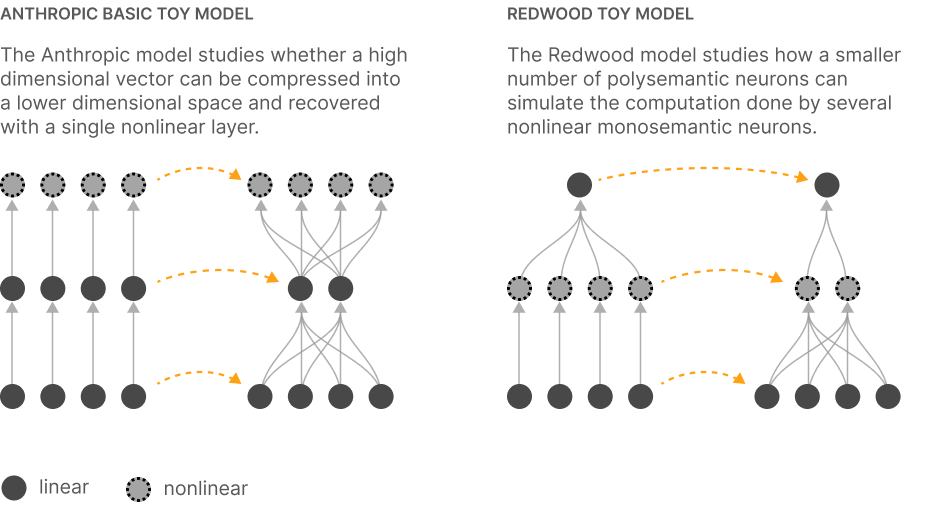

### [复现和进一步结果](index.html#comment-deepmind)

[Tom McGrath](https://tommcgrath.github.io/) 是 [DeepMind](https://www.deepmind.com) 的研究科学家。

本文中的结果是重要的贡献——它们真正进一步推进了我们对可能对口译性研究和更一般地理解网络表示至关重要的现象的理论理解。令人惊讶的是，如此简单的设置可以产生这些丰富的现象。我们已经复现了 [展示超定位](index.html#demonstrating) 和 [超定位作为相变](index.html#phase-change) 部分中的实验，并有一个小的额外结果要贡献。

可以精确求解基本 [ReLU 输出玩具模型](index.html#demonstrating-setup-model) 的 n=2, m=1 情况的期望损失（忽略偏置项）。推导在数学上很简单，但有些冗长："技巧"是 (1) 用 delta 函数表示输入分布的稀疏部分，(2) 用积分域的限制替换 ReLu：

\int_D \text{ReLU}(f(x)) dx = \int_{D \cap f(x)>0} f(x) dx

进行这种替换使积分在分析上可处理，这允许我们绘制完整的损失表面并直接求解损失最小值。我们在下面展示了一些示例损失表面：


虽然这些损失表面中的许多（图 1a, 1b）具有与 [超定位作为相变](index.html#phase-change) 一节中使用的网络权重之一在质量上相似的最小值，但我们也发现了一个新的相，其中 W_1\simeq W_2 \simeq \frac{1}{\sqrt{2}}：权重相似而不是反向（antipodal）。这种"困惑特征"（confused feature）机制在稀疏性低且两个特征都重要时出现（图 1c）。（这与 [超定位的几何——相关特征的坍缩](index.html#geometry-collapsing) 中描述的行为略有相似，但在没有特征相关的情况下发生！）此外，虽然我们找到的解通常在质量上与 [超定位作为相变](index.html#phase-change) 中使用的权重相似，但它们在数量上可能不同，如图 1a 所示。从图 1a 到图 1b 的转变是连续的：随着稀疏程度的改变，最小值在权重空间中平滑移动。这解释了相图中三重（triple point）点周围的"模糊"区域。

如图 1c 所示，稀疏性和相对特征重要性的一些组合导致损失表面具有两个最小值（一旦考虑了对称性 (W_1, W_2) \to (-W_1, -W_2)）。如果这种模式对更大的 n 和 m 值成立（我们没有理由认为它不会），这可以解释 [离散"能级"跳跃现象](index.html#learning-jumps)，因为解在最小值之间跳跃。在某些情况下（例如当参数接近相变所需的参数时），全局最小值可能具有比局部最小值小得多的吸引盆（basin of attraction）。反向和困惑特征解之间的转变似乎是不连续的。

原作者回应：这种对 n=2, m=1 情况的闭式分析很迷人。我们没有意识到 W_1\simeq W_2 \simeq \frac{1}{\sqrt{2}} 可以在没有相关特征的情况下成为解！对"模糊行为"的澄清和对局部最小值的观察也非常有趣。更一般地说，我们非常感激对我们核心结果的独立复现。

### [复现](index.html#comment-openai)

[Jeffrey Wu](https://www.wuthejeff.com/) 和 [Dan Mossing](https://dmossing.github.io/) 是 [OpenAI](https://openai.com/) 对齐团队的成员。

我们对这些多元语义性的玩具模型感到非常兴奋。这项工作处于一个罕见的交叉点，既可能对训练更可解释的模型非常重要，又非常简单和优雅。结果出人意料地容易复现——我们已经复现了（几乎没有麻烦）类似于 [展示超定位——基本结果](index.html#demonstrating-basic-results)、[几何——特征维度](index.html#geometry-dimensionality) 和 [学习动态——离散"能级"跳跃](index.html#learning-jumps) 部分中的图。

原作者回应：我们真的很感谢对我们基本结果的复现。我们的一些发现对我们来说相当令人惊讶，这让我们更有信心，它们不是我们实现中特殊怪癖或错误的结果。

### [复现](index.html#comment-becker-kahn)

[Spencer Becker-Kahn](https://spencerbeckerkahn.wixsite.com/stbk) 是未来人类研究所（Future of Humanity Institute）的高级研究学者，也是 SERI 机器学习对齐理论学者。

在看到初步结果后，我独立复现了 [展示超定位——基本结果](index.html#demonstrating-basic-results) 中的一些关键图表，并使用非常小的玩具模型，生成了一系列与 [几何——特征维度](index.html#geometry-dimensionality) 和 [超定位和学习动态](index.html#learning) 中出现的概念图景一致的图。

另见 [Twitter 线程](https://twitter.com/sbeckerkahn/status/1572255478666649602)。

### [在玩具模型中工程化单语义性](index.html#comment-jermyn)

[Adam Jermyn](https://adamjermyn.com/) 是一位独立研究人员，专注于 AI 对齐和可解释性。他之前是 Flatiron 研究所计算天体物理中心的研究员。[Evan Hubinger](https://evhub.github.io/) 是 MIRI 的研究员。[Nicholas Schiefer](https://nicholasschiefer.com/) 是 Anthropic 的技术团队成员，也是原始论文的作者。

受到本文结果和 [之前论文](https://transformer-circuits.pub/2022/solu/index.html) 中引入 SoLU 激活的启发，我们一直在调查是否可以通过改变模型架构或训练过程来减少玩具模型中的超定位。在独立复现了其中几个结果后，我们在这个方向上进行了以下扩展：

- 一个修改后的玩具模型，试图更准确地表示非玩具情况，其中稀疏特征被投影到维度较少的模型的非稀疏输入中。
- 一个"多神经元"架构，为模型提供足够的容量以完全避免多元语义性。
- 一种训练和初始化方法，实际上使这些玩具模型成为单语义的（monosemantic）。
- 对这些模型中倾向于出现的多元语义神经元的系统探索，这指导了我们对训练方法的探索。

至少在某种程度上，这表明单语义性可能不需要付出代价。详细结果可以在我们的论文 Engineering Monosemanticity in Toy Models（[Alignment Forum](https://www.alignmentforum.org/posts/LvznjZuygoeoTpSE6/engineering-monosemanticity-in-toy-models)，[ArXiV](https://arxiv.org/pdf/2211.09169.pdf)）中找到。

### [分数维度和"压力"](/index.html#comment-pressure)

Tom Henighan 和 Chris Olah 是原始论文的作者。

在 ["特征维度"部分](index.html#geometry-dimensionality)，我们发现当特征数量超过可以轻松表示在嵌入维度中的数量时，特征组织成干净的多胞形（polytopes）。

我们对此进行了简要调查，发现竞争表示的特征数量显著影响这种现象。当有更多"压力"时——更多特征竞争表示——通常会出现更清晰的结构。在高稀疏度水平下尤其如此。此外，训练更长时间似乎也会产生更清晰的结构。

需要更多调查才能真正理解这种现象。

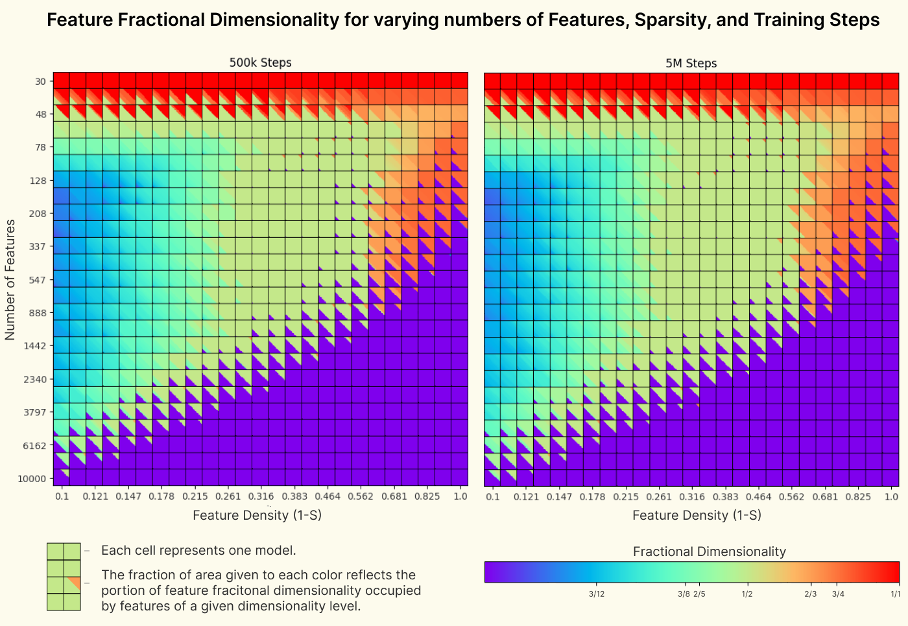

### [复现](index.html#comment-hobbhahn)

[Marius Hobbhahn](https://www.mariushobbhahn.com/) 是图宾根大学的博士生。

我复现了"玩具模型超定位"论文 [第 2 节（"展示超定位"）](index.html#demonstrating) 中的 ["基本结果"](index.html#demonstrating-basic-results) 和 [第 7 节（"特权基中的超定位"）](index.html#privileged-basis) 中的所有内容。我的所有发现都与论文中描述的相同。我复现了后续 ["超定位、记忆化和双重下降"](https://transformer-circuits.pub/2023/toy-double-descent/index.html) 论文中的大多数发现。

我复现的详细信息可以在我的总结 ["关于记忆化和双重下降的更多发现"](https://www.lesswrong.com/posts/KzwB4ovzrZ8DYWgpw/more-findings-on-memorization-and-double-descent) 中找到。

### [使用稀疏自编码器提取特征](index.html#comment-sharkey)

Lee Sharkey、Dan Braun 和 Beren Millidge 是 Conjecture 的研究人员。

本文的结果及其描绘的战略图景，激发了我们的 [初步后续工作](https://www.alignmentforum.org/posts/z6QQJbtpkEAX3Aojj/interim-research-report-taking-features-out-of-superposition)，旨在解决标题为 '[方法 2：寻找过完备基](index.html#comment-jermyn:~:text=APPROACH%202%3A%20FINDING%20AN%20OVERCOMPLETE%20BASIS)' 一节中描述的一些挑战。

在研究真实神经网络的激活之前（我们不确定什么是"真实"特征），我们研究了一个玩具示例。我们生成了一组玩具真实特征，并使用它们的稀疏组合创建了一个数据集。我们发现，具有 L\_1 惩罚的单层稀疏自编码器在其隐藏激活上学到的特征几乎与真实特征相同。这是令人鼓舞的，因为它表明相对简单的方法应该能够恢复神经网络使用的特征，只要它们有这些特征。

对于玩具数据集，我们知道有多少真实特征。但我们最终想要计算真实神经网络使用的特征数量，其中特征数量未知。我们探索了三种方法来计算玩具数据集中的特征：a) 计算自编码器中的死亡神经元；b) 查看自编码器损失；c) 比较不同大小的自编码器学到的特征。我们发现迹象表明，这些方法可能适合计算真实神经数据中超定位中的特征数量。

我们还将我们的方法应用于来自小型语言模型的真实激活。我们最初的初步调查得出了不确定的结果，可能是由于使用的自编码器太小或训练不足。在撰写本文时，调查仍在进行中。

### [Othello 中的线性表示](index.html#comment-nanda)

Neel Nanda 是机制可解释性（mechanistic interpretability）的外部研究人员。这是他的博文 [实际上，Othello-GPT 具有线性涌现世界表示](https://neelnanda.io/othello) 的描述。

我描述了本文描述的 [线性表示假说](index.html#motivation-directions) 的自然实验——即特征对应于神经网络中的方向的想法。

背景：Martin Wattenberg（本文的作者）和同事们 [最近发现](https://arxiv.org/pdf/2210.13382.pdf)，如果训练 transformer 语言模型在合成 Othello 游戏中预测下一个标记（其中每个移动是随机选择的合法移动），它会形成棋盘状态的涌现模型（尽管仅被训练预测下一步移动！）。他们表明，可以通过一个隐藏层 MLP 探针高精度地恢复棋盘状态（每个单元格是空、黑还是白）。他们进一步表明，可以使用世界模型对模型的残差流（residual stream）进行因果干预。通过选择另一个棋盘状态，并使用梯度下降改变残差流，使得探针指示新的棋盘状态，他们导致模型在新的棋盘状态下输出合法移动，即使编辑的棋盘状态无法通过合法 Othello 游戏达到！

预注册假说：探针和因果干预一起提供了强有力的证据，证明模型已经学会表示对应于棋盘上每个单元格状态的特征。然而，值得注意的是，线性探针无法恢复棋盘状态。由于线性特征应该可以通过单层探针恢复，并且因果干预表明模型既计算又使用棋盘状态，这似乎是对线性表示假说的重大反证。

然而，Chris Olah（本文的作者）认为，如果模型使用不同的特征集，它可能仍然线性表示特征，并且探针和因果干预可能正在捕捉这个不同的特征集。这创建了对该假说的非正式预注册预测，与当时的证据相反。

结果：我独立得出了与 Chris 相同的结论，并调查了 [Othello 游戏模型](https://www.neelnanda.io/othello)。我发现模型确实形成了棋盘状态的涌现模型，该模型是线性表示的，并且可以用线性探针提取。但随着模型同时玩黑色和白色移动，模型将单元格的状态表示为是否具有"我的颜色"与"对手的颜色"。此外，我发现了这些特征被模型使用的间接证据，因为我们可以使用探针给出的方向线性干预残差流以编辑表示的棋盘状态，并且模型在新的棋盘状态下玩合法移动。
我认为这些结果值得注意，因为论文的结果提供了反对线性表示假设的证据，并且该假设面临着被证伪的真实风险。而且该假设做出了非平凡的预测，这些预测与证据指向的方向相反，但最终被证明是正确的。这既是一个概念验证，表明神经网络存在具有预测能力的基本原理，也是一个支持线性表示假设的自然实验。

我认为还有更多工作可以解释 Othello 对弈模型，可以测试本文中的其他假设以及我们关于神经网络和 transformers 的更广泛概念框架，例如通过在其 MLP 层中寻找单语义神经元与叠加神经元。该模型既足够复杂以变得有趣并揭示 transformers 如何学习算法的原理，同时任务本身的算法性质和 probe 的存在表明寻找 circuits 将是可处理的。我在 [一篇后续文章](https://www.alignmentforum.org/posts/qgK7smTvJ4DB8rZ6h/othello-gpt-future-work-i-am-excited-about) 中详细阐述了我认为有前景的未来工作方向。

### [Leverage Score 和 Feature Dimensionality](index.html#comment-zhang)

[Fred Zhang](https://fredzhang.me/) 是加州大学伯克利分校 EECS 系 Theory Group 的博士生。

在 [Geometry of Superposition](index.html#geometry) 部分，论文定义了 feature dimensionality 的概念：

 D_i ~=~ \frac{||W\_i||^2}{\sum_j (\hat{W\_i} \cdot W\_j)^2}, 

其中 W\_i 是第 i 个 feature，\hat{W\_i}=W\_i / \| W\_i \|_2 是其归一化版本。为简化符号，我们假设有 n 个 features，每个都是 d 维实向量。

根据这个定义，论文指出"根据经验，当 features 在某种意义上'高效打包'时，所有 features 的 dimensionality 之和似乎等于 embedding 维度数。"在这条评论中，我指出了对这一观察的自然理论解释。该论证是通过矩阵近似中的 leverage score 概念进行的。我会先定义它，然后解释它如何与 feature dimensionality 联系起来。

在概念层面上，leverage score 是衡量某一行在构成矩阵行空间时的重要性度量。例如，如果一行与所有其他行正交，其 leverage score 为 1，意味着它最重要。这是自然的，因为移除它会降低矩阵的秩并完全改变行空间。形式上，如果 W 是 n×d 矩阵（可以认为是高而窄的，所以 n > d），那么第 i 行 W\_i 的 leverage score 是：

 \tau_i = \max_{x : \|x\|_2 = 1} \frac{\langle W\_i , x \rangle^2}{\sum_{j=1}^n \langle W\_j , x \rangle^2}. 

注意分母项等于 \| Wx \|_2^2。因此，W\_i 的 leverage score 是 \langle W\_i, x\rangle^2 对 || Wx ||^2 所能做出的最大贡献（在所有可能的方向 x 上）。这是一个介于 0 和 1 之间的分数。还可以观察到，这确实具有一个很好的性质：如果 W\_i 与所有其他行正交，\tau_i 等于 1，因为分母求和中除第 i 项外的所有项都为 0。

关于这个定义的三个简要说明：

- 它与 Chris Olah 在 [Data Dimensionality of MNIST](https://transformer-circuits.pub/2023/toy-double-descent/index.html#comment-mnist) 评论中提出的 maximal data dimensionality 概念一致，这是 [Superposition, Memorization, and Double Descent](https://transformer-circuits.pub/2023/toy-double-descent/index.html) 后续工作的一部分。
- leverage score 还有其他等价定义；见 [这里](https://arxiv.org/abs/1408.5099) 的第 3.3 节。
- leverage score 出现在数值线性代数中。众所周知，按 leverage score 比例采样行会产生一个近似原始的近乎方阵，即使原始矩阵可能非常高。形式化陈述见 Theorem 17 of [https://arxiv.org/abs/1411.4357](https://arxiv.org/abs/1411.4357)。

回到我的主要观点，关于 leverage score 的另一个很好的事实是它们的和等于矩阵的秩。在上述高而窄的情况下，它们的和等于 d（如果矩阵是满秩的）。鉴于此，论文做出经验观察就很自然了：如果向量"高效打包"，D_i 的和大致等于 embedding 维度 d。具体来说，表述它们高效打包的一种形式化方式是它们大致处于各向同性位置，即沿任何方向 x 的方差 \langle W\_j, x\rangle^2 接近于 1。换句话说，embedding 向量的协方差结构接近单位矩阵。（几何上，这意味着它们分布良好。例如，如果向量形成正单纯形，就会出现这种情况，正如本文实验中发生的那样。）那么在上述 leverage score 的定义中，对于任何 x，分母中的每个求和项都是 1。因此，为了最大化分子，我们只需取 x 为 W\_i 本身——这正好恢复了 feature dimensionality D_i 的定义。因此，在这种良好分布的情况下，这两个概念大致相同，并且它们的和都等于 d。

### [Code](index.html#code)

我们提供了一个 notebook 来复现本文的一些核心图表 [这里](https://colab.research.google.com/github/anthropics/toy-models-of-superposition/blob/main/toy_models.ipynb)。（它并不全面，因为我们需要重写代码以便实验在我们的代码库之外运行。）我们为理论 phase change 图表提供了一个 [单独的 notebook](https://github.com/wattenberg/superposition/blob/main/Exploring_Exact_Toy_Models.ipynb)。

请注意，上述评论中提到的其他研究人员的复现并非基于此代码，而是完全独立的复现，使用根据本文早期草稿描述编写的干净代码。

### [Acknowledgments](index.html#acknowledgments)

我们非常感谢来自多个组织的许多同事在我们撰写本文时提供的宝贵支持。

Jeff Wu、Daniel Mossing、Tom McGrath 和 Kshitij Sachan 独立复现了我们的许多实验，极大地增强了我们对结果的信心。Kshitij Sachan 和 Tom McGrath 的额外调查和富有洞察力的问题都促使我们澄清对 superposition phase change 的理解（既反映在本文中，也反映在我们从他们那里学到的进一步理解中，尽管这些未在此捕获）。Buck Shlegeris、Adam Scherlis 和 Adam Jermyn 分享了关于这个 toy problem 数学性质和相关工作的宝贵见解。Adam Jermyn 还创造了"virtual neurons"这个术语。

Gabriel Goh、Neel Nanda、Vladimir Mikulik 和 Nick Cammarata 提供了详细的反馈，改进了论文，同时也起到了激励作用。Alex Dimakis、Piotr Indyk、Dan Yamins 慷慨地抽出时间与我们讨论这些结果，并就它们如何与他们的专业领域联系起来提供建议。最后，我们受益于 James Bradbury、Sebastian Farquhar、Shan Carter、Patrick Mineault、Alex Tamkin、Paul Christiano、Evan Hubinger、Ian McKenzie 和 Sid Black 的反馈和评论。我们特别感谢 Trenton Bricken 和 Manjari Narayan 向我们推荐了我们最初遗漏的有价值的相关工作。感谢 Ken Kahn 的拼写错误更正。

最后，我们非常感谢 Anthropic 的所有同事提供的建议和支持：Daniela Amodei、Jack Clark、Tom Brown、Ben Mann、Nick Joseph、Danny Hernandez、Amanda Askell、Kamal Ndousse、Andy Jones、Timothy Telleen-Lawton、Anna Chen、Yuntao Bai、Jeffrey Ladish、Deep Ganguli、Liane Lovitt、Nova DasSarma、Jia Yuan Loke、Jackson Kernion、Tom Conerly、Scott Johnston、Jamie Kerr、Sheer El Showk、Stanislav Fort、Rebecca Raible、Saurav Kadavath、Rune Kvist、Jarrah Bloomfield、Eli Tran-Johnson、Rob Gilson、Guro Khundadze、Filipe Dobreira、Ethan Perez、Sam Bowman、Sam Ringer、Sebastian Conybeare、Jeeyoon Hyun、Michael Sellitto、Jared Mueller、Joshua Landau、Cameron McKinnon、Sandipan Kundu、Jasmine Brazilek、Da Yan、Robin Larson、Noemí Mercado、Anna Goldie、Azalia Mirhoseini、Jennifer Zhou、Erick Galankin、James Sully、Dustin Li、James Landis。

### [Author Contributions](index.html#author-contributions)

**Basic Results** - 展示 superposition 存在性的基本 toy model 结果由 Nelson Elhage 和 Chris Olah 完成。Chris 提出了 toy model，Nelson 运行了实验。

**Phase Change** - Chris Olah 运行了经验 phase change 实验，Nelson Elhage 提供了帮助。Martin Wattenberg 引入了理论模型，其中可以计算特定权重配置的精确损失。

**Geometry** - uniform superposition geometry 结果由 Nelson Elhage 和 Nicholas Schiefer 发现，Chris Olah 提供了帮助。Nelson 发现了原始的 m/||W||_F^2 神秘的"stickiness"。Chris 引入了 feature dimensionality 的定义。然后 Nicholas 和 Nelson 研究了形成的多胞形。至于 non-uniform superposition，Martin Wattenberg 对所得几何进行了初步研究，重点关注 correlated features 的行为。Chris 通过研究 relative feature importance 和 sparsity 的作用扩展了这一点。

**Learning Dynamics** - Nelson Elhage 发现了"energy level jump"现象，与 Nicholas Schiefer 和 Chris Olah 合作。Martin Wattenberg 发现了"geometric transformations"现象。

**Adversarial Examples** - Chris Olah 和 Catherine Olsson 发现了 superposition 和 adversarial examples 之间联系的证据。

**Superposition with a Privileged Basis / Doing Computation** - Chris Olah 对 privileged basis 中的 superposition 进行了基本研究。Nelson Elhage 在 Chris 的帮助下研究了"absolute value"模型，这提供了更原则性的 superposition 演示，并表明可以在 superposition 中进行计算。Nelson 发现了"asymmetric superposition"motif。

**Theory** - 本文阐述的理论图景（特别是在"mathematical understanding"部分）是在所有作者之间的对话中发展起来的，尤其是 Chris Olah、Jared Kaplan、Martin Wattenberg、Nelson Elhage、Tristan Hume、Tom Henighan、Catherine Olsson、Nicholas Schiefer、Dawn Drain、Shauna Kravec、Roger Grosse、Robert Lasenby 和 Sam McCandlish。Jared 引入了通过按 active features 数量分组项来重写 loss 的策略。Jared 和 Martin 都独立地注意到研究 n=2、m=1 情况作为最简单的理解案例的价值。Nicholas 和 Dawn 澄清了我们对与 compressed sensing 联系的理解。

**Strategic Picture** - 本文中阐述的战略图景——superposition 对 interpretability 和 safety 意味着什么？什么是合适的解决方案？如何解决它？——是在作者之间的广泛对话中发展起来的，特别是 Chris Olah、Tristan Hume、Nelson Elhage、Dario Amodei、Jared Kaplan。Nelson Elhage 认识到"enumerative safety"的潜在重要性，由 Dario 进一步阐述。Tristan 广泛地头脑风暴了解决 superposition 的方法，并在这个主题上推动了 Chris。

**Writing** - 论文主要由 Chris Olah 起草，部分章节由 Nelson Elhage、Tristan Hume、Martin Wattenberg 和 Catherine Olsson 撰写。所有作者都参与了编辑，其中 Zac Hatfield Dodds、Robert Lasenby、Kipply Chen 和 Roger Grosse 的贡献尤为显著。

**Illustration** - 论文主要由 Chris Olah 绘制插图，Tristan Hume、Nelson Elhage 和 Catherine Olsson 提供了帮助。

### [Citation Information](index.html#citation)

请引用为：

Elhage, et al., "Toy Models of Superposition", Transformer Circuits Thread, 2022.

BibTeX Citation:

```
@article{elhage2022superposition,
  title={Toy Models of Superposition},
  author={Elhage, Nelson and Hume, Tristan and Olsson, Catherine and Schiefer, Nicholas and Henighan, Tom and Kravec, Shauna and Hatfield-Dodds, Zac and Lasenby, Robert and Drain, Dawn and Chen, Carol and Grosse, Roger and McCandlish, Sam and Kaplan, Jared and Amodei, Dario and Wattenberg, Martin and Olah, Christopher},
  year={2022},
  journal={Transformer Circuits Thread},
  note={https://transformer-circuits.pub/2022/toy_model/index.html}
}
```

### [Nonlinear Compression](index.html#nonlinear-compression)

本文专注于表示是线性的假设。但是如果模型不使用线性 feature 方向来表示信息呢？这样的东西具体会是什么样子？

神经网络具有非线性，使得理论上可以比线性 superposition 更紧凑地压缩信息。我们有理由认为模型不太可能普遍使用非线性压缩方案：

- 模型需要在自然计算之前解压缩内容：模型中的大多数计算是线性的，因此这种压缩可能只值得用于在 residual stream 中跨越多层节省空间，然后在再次线性计算之前解压缩。
- 它们可能难以学习：非线性压缩方案可能需要精细调整的不连续性近似，并且压缩和解压缩需要对齐，梯度下降可能难以学习。
- 它们可能需要足够多的神经元，以至于相对于 superposition 的好处不值得：

- 使用 ReLU 神经元表示简单示例中的分段线性函数，使用通用函数逼近结果（每个线段需要两个神经元），每个 Z 段将需要 12 个神经元，因此只有在压缩和解压缩总共 36 个神经元时才开始优于线性压缩。
- 这种比较只有一个隐藏维度和 dense features，这对于 superposition 来说有点退化。Superposition 在压缩高维稀疏 features 时强大得多。我们怀疑在大型模型中，scaling 有利于 superposition，尽管这只是直觉，非线性压缩的 scaling 也可能是有竞争力的。

无论大型模型最终是否使用非线性压缩，都应该可以将使用非线性压缩的方向视为线性 feature 方向，并像任何其他 circuit 一样逆向工程用于压缩的计算。如果这种编码在整个网络中普遍存在，那么它可能需要某种自动解码。除非模型学习了一种在复杂的非线性表示中进行复杂计算的方案（我们怀疑这不太可能），否则它不应该对 interpretability 构成根本性挑战。

为了帮助提供直觉，非线性压缩方案可能是什么样子的最简单示例是将两个 [0,1) 维度 x 和 y 压缩到单个 [0,1) 维度 t：

 t = \frac{\lfloor Zx \rfloor + y}{Z} 

这是通过使用某个整数 Z 量化 x 维度来实现的，使得 t 的浮点精度在 x 和 y 之间分配。这个特定函数需要不连续的 floor 函数来计算，需要不连续的 fmod 函数来反转，但模型无法计算不连续函数。然而，可以用仅 epsilon 值宽的陡峭线性段来替换不连续性。

我们可以比较 x 和 y 的随机均匀 dense 值上的均方误差损失，并看到即使 epsilon 大到 0.1 且 Z 值小到 3，非线性压缩也优于线性压缩，例如选择其中一个维度或使用平均值：

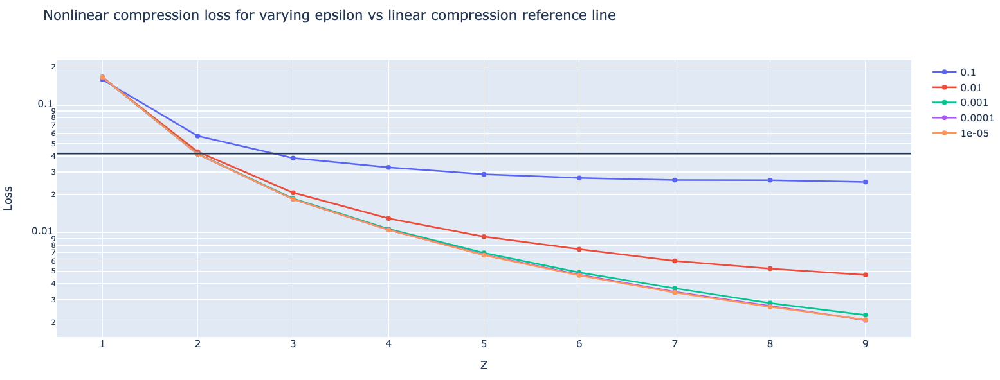

### [Connection between compressed sensing lower bounds and the toy model](index.html#compressed-sensing-connection-proof)

在这里，我们形式化了 compressed sensing lower bound 和 toy model 之间的关系。

令 T(x) : \mathbb{R}^n \to \mathbb{R}^n 为由 T(x) = \mathrm{ReLU}(W_2 W_1 x - b) 定义的完整 toy model autoencoder，其中 W_1 是 m×n 矩阵，W_2 是 n×m 矩阵。

我们推导出以下定理：

**Theorem 1.** 假设 toy model 通过 T(x) 恢复所有 x，使得 \|T(x) - x\|_2 \leq \varepsilon 对于足够小的 \varepsilon 成立，且 W_1 具有 (\delta, k) restricted isometry property。投影矩阵 W 的内部维度为 m = \Omega(k log(n/k))。

我们通过将 toy model 框架化为 compressed sensing 算法来证明这个结果。这样做的主要障碍是我们的优化只搜索与原始向量在 \ell_2 距离上接近的向量，而本身可能不完全是 k-sparse。以下引理通过去噪步骤解决了这个担忧：

**Lemma 1.** 假设我们有一个具有 Theorem 1 中性质的 toy model T(x)。那么存在一个针对测量矩阵 W_1 的 compressed sensing 算法 f(y) : \mathbb{R}^m \to \mathbb{R}^n。

**Proof.** 我们按如下方式构造 f(y)。首先，计算 \tilde{x} = \mathrm{ReLU}(W_2 y - b)，如 T(x) 中所示。这产生向量 \tilde{x} = T(x)，因此根据假设 \|T(x) - x\|_2 \leq \varepsilon。接下来，我们对 \tilde{x} 进行阈值处理以获得 \tilde{x}'，方法是从中删除除其 k 个最大条目外的所有内容。最后，我们求解优化问题：\min_{x'} \|x' - \tilde{x}'\| 受限于 W_1 x' = y，这是凸的，因为 x' 和 \tilde{x}' 具有相同的 support。对于足够小的 \varepsilon（具体来说，\varepsilon 小于 x 中第 (k+1) 个最大条目），\tilde{x} 和 x 的最近 k-sparse 向量具有相同的 support，因此凸优化问题有唯一解：x 的最近 k-sparse 向量。因此，f 是 W_1 的 compressed sensing 算法，近似因子为 1。\qed。

最后，我们使用 Do Ba、Indyk、Price 和 Woodruff 的确定性 compressed sensing lower bound：

**Theorem 2** (Corollary 3.1 in )。给定具有 restricted isometry property 的 k×n 矩阵 A，稀疏恢复算法从 Ax 中找到 x \in \mathbb{R}^n 的 k-sparse 近似 \hat{x}，使得

\|x - \hat{x}\|_1 \leq C(k) \min_{x', \|x'\|_0 \leq k} \|x - x'\|_1

对于近似因子 C(k)。如果 C(k) = O(1)，则稀疏恢复算法仅当 m = \Omega(k \log (n/k)) 时存在。

Theorem 1 直接从 Lemma 1 和 Theorem 2 得出。
