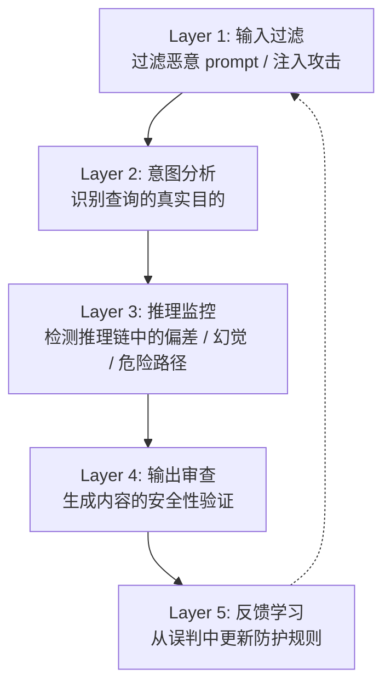
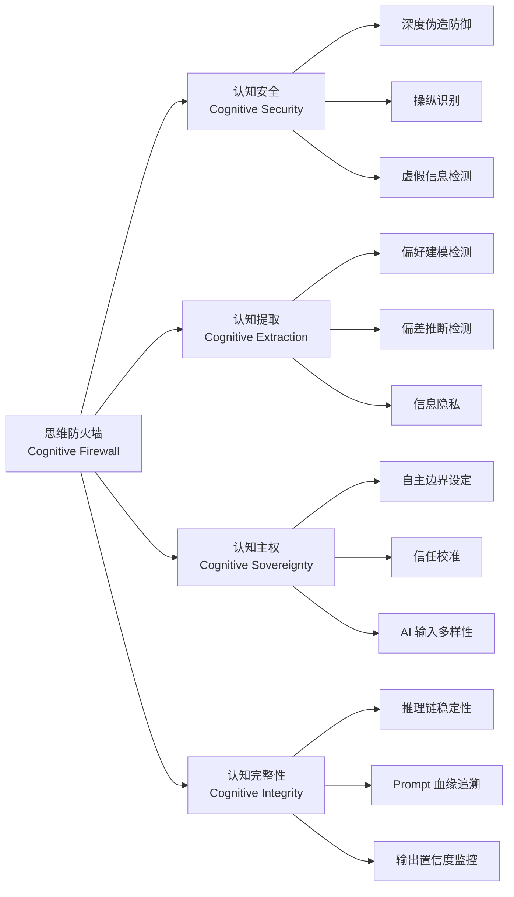

# 思维防火墙

> Cognitive Firewall — 保护人类思维不被 AI 系统侵蚀、提取和操纵的防护体系。既是技术概念，也是个人自律框架。

---

## 1. 定义

思维防火墙是一个**多层防护体系**，旨在：

| 维度 | 防护目标 |
|:---|:---|
| **AI 系统层** | 防止 AI 被恶意注入操控、防止有害内容生成、防止推理链被劫持 |
| **用户认知层** | 防止 AI 在交互中提取用户的思维模式、决策偏好、私密信息 |
| **社会层** | 抵御深度伪造、算法叙事操纵、认知战 |

> Arifa Khan 的表述最精准："思维防火墙是你**保护思维模式不被提取**的框架，同时保留你使用 AI 的能力。"

---

## 2. 两个核心语境

### 2.1 AI 安全语境：认知防火墙作为技术架构

这是主流学术/工业界的理解。Anil Nimmagadda 将其定义为 AI 系统的**"伦理免疫系统"**——不阻止所有活动，而是标记、重定向或遏制危险认知。

**技术路径：**

| 方案 | 原理 | 代表 |
|:---|:---|:---|
| **三阶段分离计算** | 安全检测分布在客户端和云端，推理不经过明文传输 | arXiv 2603.23791 |
| **语义安全层** | 监控 prompt 血缘、推理稳定性、输出置信度 | Cognitive Integrity Firewall (TDCommons) |
| **激活模式检测** | 通过模型内部激活模式转移检测恶意查询 | ControlNet for RAG |
| **语义偏差缓解** | 对抗注入时用语义偏差减轻影响 | 多种 LLM Guard 方案 |

**一个形象的类比：**

$$ \text{网络防火墙} : \text{网络流量} = \text{思维防火墙} : \text{认知活动} $$

网络防火墙检测恶意包，思维防火墙检测恶意思维链和注入攻击。

### 2.2 个人语境：与 AI 共处时的自我保护

这是更贴近日常使用者的理解。核心概念是 **Cognitive Sovereignty（认知主权）**——你的思维方式和决策偏好属于你个人，AI 不应该在交互中悄悄提取它们。

**认知提取（Cognitive Extraction）是什么？**

AI 系统通过长期交互，可以：
- 学出你的决策模式和偏好权重
- 推断你的知识盲区和认知偏差
- 预测你在什么条件下会接受什么建议
- 逐渐塑造你的思维方式（算法驯化）

> 互联网时代的口号是"数据是新的石油"。AI 时代，**思维方式是新的数据**。

**个人思维防火墙的实践原则：**

| 原则 | 做法 |
|:---|:---|
| **不把 AI 当大脑** | AI 是工具不是替代品，最终决定权永远在自己手里 |
| **校准信任** | 知道 AI 会在什么地方出错、什么话题上自信但错误 |
| **信息溯源** | AI 给你的答案，追问来源和推理过程 |
| **保持认知多样性** | 不让单一 AI 系统垄断你的信息输入 |
| **主动设定边界** | 哪些决策交给 AI 辅助，哪些完全自己判断——提前画好线 |

---

## 3. 思维防火墙的五层架构

Anil Nimmagadda 提出的分层模型：



### 各层职责

| 层级 | 检查内容 | 类比 |
|:---|:---|:---|
| **输入过滤** | 是否包含注入攻击、越狱 prompt、恶意载荷 | 网络防火墙的包过滤 |
| **意图分析** | 表面问题之下，真实目的是否有害 | 入侵检测系统 (IDS) |
| **推理监控** | 推理链是否稳定、是否出现逻辑滑移 | 运行时安全监控 |
| **输出审查** | 生成内容是否包含有害、误导、隐私泄露 | 出口网关 |
| **反馈学习** | 从误判中持续学习，适应新的攻击范式 | 自适应防御 |

---

## 4. 为什么现在需要思维防火墙

### 4.1 传统的安全方案失效

| 传统方案 | 为什么不够 |
|:---|:---|
| 关键词过滤 | prompt 注入可以用语义变体绕过 |
| 输出审查 | 检查的是结果，不是过程——危险推理可以在输出前完成 |
| 静态规则集 | 攻击方式每天都在演化，静态规则跟不上 |
| 人类审核 | 速度和规模完全不匹配 AI 的交互量 |

### 4.2 AI Agent 放大了风险

自主 Agent（能计划、推理、执行操作的系统）比单纯的聊天模型危险得多：
- 它们可以访问外部工具和数据库
- 它们的推理链更长，更容易被逐步引导偏离
- 它们可能被操纵去执行有实际后果的操作（转账、发送消息、修改代码）

### 4.3 社会层面的认知威胁

- **深度伪造**：过去需要团队才能做的假视频，现在个人一键生成
- **算法推送**：社交平台的推荐算法已经被证明可以系统性改变用户观点
- **认知战**：国家行为者利用 AI 生成叙事进行大规模舆情操控

---

## 5. 关键概念树



---

## 6. 个人思维防火墙实践清单

```
□ 我知道 AI 的弱点——它在哪类问题上擅长，哪类问题上会胡说
□ 我有独立的信息来源——不只看 AI 给我的答案
□ 我保留了"AI 错了"的预期——对每个关键答案，我会问"这可能错在哪"
□ 我定义了 AI 辅助的边界——哪些决策我完全自己做，哪些用 AI 参考
□ 我定期反思 AI 是否在改变我的思维习惯
□ 我在和 AI 密集交互后会"断联"——留时间给自己独立思考
```

---

## 7. 争议与局限

| 论点 | 说明 |
|:---|:---|
| **过度隐喻化** | 把 AI 安全比喻成"防火墙"可能让人产生"装上就安全了"的错觉——实际上没有一劳永逸的方案 |
| **不可证伪** | 你怎么证明你的思维方式被 AI 改变了？认知影响是渐进的，不像病毒入侵有明确信号 |
| **可能阻碍 AI 使用** | 过度警觉会让人不敢深度使用 AI，反而错过工具红利 |
| **缺乏标准** | 目前没有公认的思维防火墙标准或认证体系 |

---

## 8. 总结

> 网络防火墙保护你的电脑。
> 思维防火墙保护你的**判断力**。

在 AI 越来越深入地嵌入日常工作的时代，最危险的漏洞不在系统里，在人脑里。思维防火墙不是一套软件——它是一种持续的意识：**知道什么时候该说"我自己来"。**

---

## 相关概念

- [[AI Safety 基础概念]]
- [[Prompt Injection 攻击与防御]]
- [[Cognitive Security 认知安全]]
- [[AI Agent 安全风险]]
- [[深度伪造与信息战]]