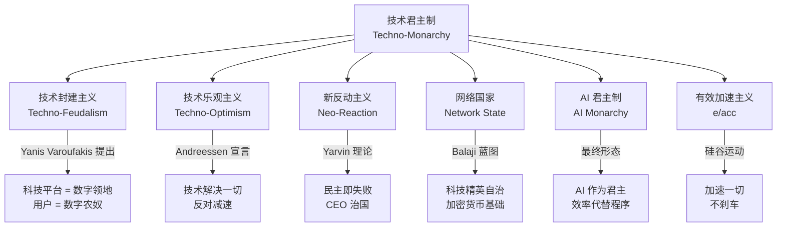

# 技术君主制（Techno-Monarchy）

> 当权力不再征求同意。

---

## 1. 一句话定义

**技术君主制**是一种治理哲学——主张社会应该像公司一样运营，最有钱、最有技术权力的人应该统治，民主程序只是效率的障碍。

$$ \text{公司治理} \xrightarrow{\text{应用到}} \text{国家治理} \implies \text{CEO 即君主} $$

---

## 2. 思想谱系

```mermaid
graph LR
    CY[Curtis Yarvin<br/>Dark Enlightenment / NRx<br/>用 CEO 式专制取代民主]
    PT[Peter Thiel<br/>"我不再相信自由和民主相容"<br/>资助 JD Vance]
    BS[Balaji Srinivasan<br/>Network State<br/>科技精英自治城市/国家]
    MA[Marc Andreessen<br/>Techno-Optimist Manifesto<br/>2023]
    EM[Elon Musk<br/>xAI / DOGE<br/>效率 > 程序]
    
    CY --> PT
    CY --> BS
    PT --> MA
    PT --> EM
    BS --> MA
```

### 思想源头：Dark Enlightenment（黑暗启蒙）

Curtis Yarvin（笔名 Mencius Moldbug）在 2007-2014 年间提出了一套完整的反民主理论：

| 核心主张 | 说明 |
|:---|:---|
| 民主是"大教堂" | 民主是一套自我延续的意识形态骗局 |
| CEO 君主制 | 国家应该由 CEO 式的独裁者统治，像管理公司一样管理社会 |
| 退出 > 改革 | 不试图改革民主，而是建立新的"创业型国家" |
| 进步 = 效率 | 技术进步的障碍是政治协商，需要消除 |

---

## 3. 现代形态

### 3.1 Techno-Optimist Manifesto（2023）

Marc Andreessen 的万言宣言，核心论点：

> "我们是技术乐观主义者。我们相信增长、丰裕和进步。我们相信市场，不相信计划。我们相信技术，不相信官僚。"

**"敌人清单"**（原文如此）：
- 监管机构
- AI 减速主义者
- 社会公平倡导者
- 任何阻碍 AI 增长的人

**批评者的解读**：这不是技术乐观主义，而是技术封建主义的宣言——把"进步"偷换成"科技寡头不受约束的权力"。

### 3.2 Network State（网络国家）

Balaji Srinivasan 的蓝图：科技精英应该建立自己的城市/国家，像创业公司一样 A/B 测试政府形式，绕过传统民主程序。

关键特征：
- 云端社区 → 实体领土 → 外交承认
- 加密货币作为经济基础
- AI 作为治理决策引擎
- 公民 = 用户/股东

### 3.3 AI Monarchy（AI 君主制）

最终形态——AI 作为君主：

| 维度 | 传统君主制 | AI 君主制 |
|:---|:---|:---|
| 合法性来源 | 血统 / 神权 | 技术能力 / 效率 |
| 决策方式 | 个人意志 | 数据驱动 / 预测分析 |
| 权力约束 | 贵族 / 教会 | 无（由创造者定义） |
| 核心论证 | "上帝选的" | "算法比人更不会出错" |

---

## 4. 关键人物与言论

| 人物 | 角色 | 标志性言论/行动 |
|:---|:---|:---|
| **Elon Musk** | xAI, Tesla, SpaceX, DOGE | "效率部"直接裁撤政府机构 |
| **Peter Thiel** | Palantir, Founders Fund | "我不再相信自由和民主是相容的" |
| **Marc Andreessen** | a16z | Techno-Optimist Manifesto, 私下群聊中称大学将"付出代价" |
| **Balaji Srinivasan** | 前 Coinbase CTO | Network State 概念, 号召科技精英建立主权城市 |
| **Curtis Yarvin** | NRx 理论家 | 原始理论提供者, 被 Thiel 和 JD Vance 引用 |
| **Sam Altman** | OpenAI | 公开推动快速部署、私下警告末日场景——批评者认为是在用恐惧巩固权力 |

---

## 5. 操作路径：从思想到政治

技术君主制的实践路径：

```
硅谷财富 → 收购媒体（Twitter/X）→ 塑造 discourse 
         → 资助候选人（JD Vance）→ 获取政治权力
         → 控制关键基础设施（AI 算力、卫星通信）→ 不可替代性
         → 削弱监管机构（DOGE 裁员）→ 消除制衡
```

### Louis XV 类比

NYT 专栏作家 Michael Hirschorn 将科技亿万富翁比作法王路易十五：

> 路易十五的奢靡和鲁莽无能创造了法国大革命的条件。今天的科技寡头正在重演这一幕——炫耀权力、极度荒谬的行为、对公众愤怒的完全漠视。

> "好像这种规模的财富——甚至超过了镀金时代——催生了一种**阶级反社会人格**。"

**数据对比：**

| 比较 | 数据 |
|:---|:---|
| 美国亿万富翁总数 | 902 人 |
| 美国总人口 | 3.4 亿 |
| 902 人决定 3.4 亿人的生活 | 这不是民主定义 |

---

## 6. 批评与反驳

### 核心批判

| 论点 | 说明 |
|:---|:---|
| **技术能力 ≠ 治理合法性** | 会写代码不会让你懂得分配公共资源 |
| **效率 ≠ 公平** | 公司追求利润，国家追求公正——目标不同 |
| **输出不可问责** | 如果 AI 做决策错了，谁能被弹劾？ |
| **财富→权力→更多财富** | 这是一个自我加强的寡头循环，不是"进步" |
| **民主不是障碍，是保险** | 民主程序慢，因为它在防止权力集中——这是 feature，不是 bug |

### 辩护者的论点

| 论点 | 说明 |
|:---|:---|
| 民主太慢 | AI 时代需要快速决策，民主程序跟不上技术发展速度 |
| 精英治理最有效 | 最聪明的人应该做最重要的决定 |
| 市场已经证明了他们 | 如果市场选了 Musk/Altman 来领导 AI，为什么要民主干涉？ |
| 退出权就是自由 | 不喜欢可以离开（Network State 的逻辑） |

---

## 7. 相关概念链



---

## 8. 为什么这个问题现在变得重要

### 时间线

| 时间 | 事件 |
|:---|:---|
| 2007-2014 | Yarvin 提出 Dark Enlightenment 理论 |
| 2016 | Thiel 在 RNC 演讲支持 Trump |
| 2022 | Musk 收购 Twitter ($440亿), Balaji 出版 Network State |
| 2023 | Andreessen 发表 Techno-Optimist Manifesto |
| 2024 | Trump 当选, Musk 领导 DOGE, Vance 当选副总统 |
| 2025-2026 | xAI 估值千亿, OpenAI 向 Cerebras 签 $200亿 合同, AI 算力集中度历史最高 |

**趋势线清晰**：科技财富 → 政治权力 → 消除监管 → 更多财富 → 更多权力。

---

## 9. 与思维防火墙的联系

技术君主制的本质是**权力不对等**——少数人控制 AI 基础设施，多数人只能接受。思维防火墙正是在这种不对等下保护个体认知主权的防线：

- **技术君主制** = 少数人拥有做决策的 AI
- **思维防火墙** = 多数人保护自己不被这种 AI 操纵

$$ \text{权力} \uparrow \implies \text{需要更强的认知防护} \uparrow $$

---

## 10. 总结

> 技术君主制不是科幻，是一套已经在执行中的政治哲学。它的拥护者不是在开玩笑——他们真的认为民主过时了、效率更重要、科技精英应该统治。
>
> 问题不是"它会不会发生"，而是"当它发生时，普通人还剩什么"。

### 你的思考清单

```
□ 我使用的 AI 基础设施——算力、模型、数据——掌握在谁手里？
□ 这些掌控者的政治信仰是什么？
□ 我有没有替代选择？
□ 我的认知主权在什么程度上已被算法塑造？
```