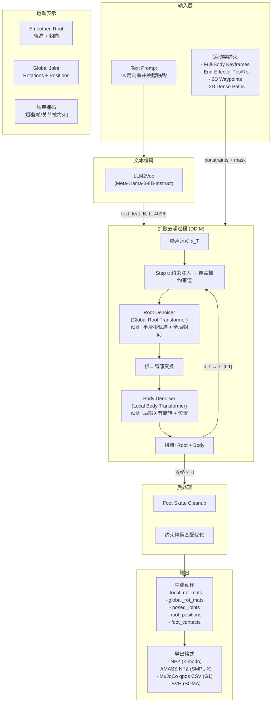
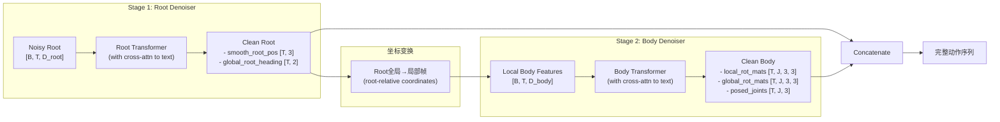
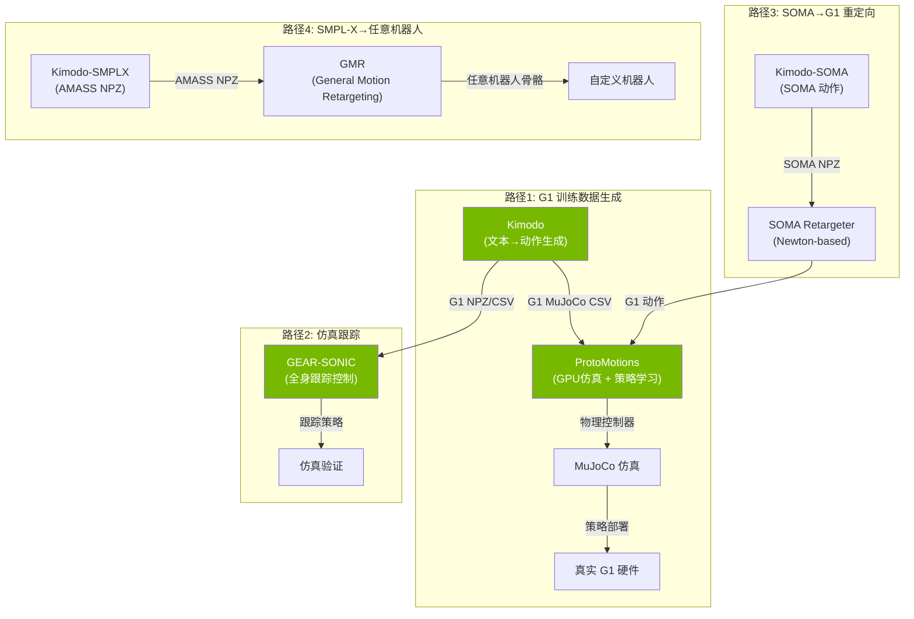

## Overview

Kimodo（**Ki**nematic **Mo**tion **D**iffusi**o**n）是 NVIDIA 于 2026 年 3 月开源的运动扩散模型，从文本提示和运动学约束生成高质量 3D 人形/机器人动作。

**核心数据**: 在 **Bones Rigplay** 数据集（700 小时光学动捕，170+ 受试者）上训练，远超此前公开数据集的规模（通常 <100 小时）。支持 SOMA、SMPL-X、Unitree G1 三种骨骼。

**关键数字**:
- GitHub Stars: 2,413 | Forks: 253
- PyTorch 实现 | Python 73.8%, C++ 25.6%
- Apache 2.0 许可证（模型 NVIDIA Open Model License）
- VRAM 需求: ~17GB（全 GPU），<3GB（text encoder 放 CPU）
- 生成时长: 最长 10 秒/段，支持多段拼接

**主要贡献**:
1. 首个 700 小时级商用友好动捕数据训练的扩散模型
2. 统一的文本 + 多类型运动学约束控制
3. 两阶段去噪器消除 foot skating 等常见 artifact
4. 原生支持人形机器人骨骼（G1），直连 ProtoMotions/MuJoCo
5. 完整的开源生态：CLI、Interactive Demo、Benchmark、API

---

## Architecture



### 两阶段去噪器详解



**设计动机**: 根运动（全局位移/朝向）和身体姿态（局部关节旋转）遵循不同的物理规律。分离预测避免了 single-stage 模型中常见的 foot sliding 和 floating 问题。Root 先确定整体轨迹，Body 在这个稳定基础上生成自然姿态。

---

## 关键创新点

### 1. 运动表示（Motion Representation）

| 组件 | 描述 | 维度 |
|------|------|------|
| `smooth_root_pos` | Catmull-Rom 平滑根轨迹，模拟动画工具中的路径绘制 | `[T, 3]` |
| `global_root_heading` | 全局朝向角度 | `[T, 2]` |
| `global_rot_mats` | 各关节的全局旋转矩阵 | `[T, J, 3, 3]` |
| `posed_joints` | 世界坐标系下的关节位置 | `[T, J, 3]` |
| `local_rot_mats` | 父关节相对旋转矩阵 | `[T, J, 3, 3]` |
| `foot_contacts` | 脚部接触标签 [左脚跟, 左脚尖, 右脚跟, 右脚尖] | `[T, 4]` |

**创新**: Smoothed root 是关键——传统方法直接预测 pelvis 位置，导致抖动和不自然的轨迹。Kimodo 用平滑曲线参数化根轨迹，生成的路径更接近动画师手工绘制的效果。

### 2. 两阶段 Transformer 去噪器

- **Root Denoiser**: 先预测全局根运动（位置 + 朝向），使用 Transformer Encoder + cross-attention 到文本嵌入
- **Body Denoiser**: 接收 Root 输出，转换为 root-relative 局部坐标，预测身体关节姿态
- **约束注入**: 约束值与噪声运动使用相同表示，在每步去噪前用约束值覆盖对应位置，并在输入中拼接约束掩码

### 3. 多类型约束注入

| 约束类型 | 描述 | 稀疏度 |
|----------|------|--------|
| Full-Body Keyframes | 指定帧的完整关节位置 | ≤20 帧 |
| Sparse Joints | 指定帧的部分关节位置/旋转 | ≤20 帧 |
| 2D Waypoints | 地面 2D 路径关键点 | 稀疏 |
| Dense 2D Paths | 密集 2D 路径跟随 | 密集 |
| End-Effectors | 手/脚的 3D 位置和旋转 | ≤20 帧 |

约束使用与输入运动相同的表示，在每步去噪前直接覆盖噪声运动中的对应值。约束掩码作为额外通道拼接到运动输入中。

### 4. Bones Rigplay 700h 动捕数据集

- **规模**: 700+ 小时光学动捕，170+ 受试者
- **质量**: 制片级质量（production-quality），远超学术数据集
- **覆盖**: 行走、跑动、跳舞、打斗、手势、物体交互、风格化运动（醉酒、受伤、儿童、老人等）
- **标注**: 细粒度时序文本描述（timeline annotations）
- **商用友好**: 训练出的模型可商用（NVIDIA Open Model License）
- **公开子集**: BONES-SEED（288 小时，用于学术对比和 Benchmark）

### 5. SOMA + G1 双骨骼支持

- **SOMA**: NVIDIA 统一参数化人体模型，77 关节骨骼 (`somaskel77`)
- **G1**: Unitree G1 人形机器人骨骼，通过 SOMA Retargeter（Newton-based）从 SOMA 动捕数据重定向
- **SMPL-X**: 学术标准人体模型（R&D 许可证，非商用）

### 6. 文本编码

- 使用 **LLM2Vec**（基于 Meta-Llama-3-8B-Instruct）对文本提示编码
- 输出 4096 维嵌入向量
- 支持 bfloat16（默认）和 float32（v1.1 训练精度）
- 可独立运行为 text-encoder 服务（`kimodo_textencoder`），供多个生成请求共享

### 7. Classifier-Free Guidance

- 支持三种 CFG 模式: `nocfg`（无条件）、`regular`（单尺度）、`separated`（文本/约束独立尺度）
- `separated` 模式: `cfg_weight=[text_weight, constraint_weight]`，分别控制文本跟随和约束跟随强度
- 典型值: `[2.0, 2.0]`

### 8. 后处理

- **Foot Skate Cleanup**: 基于物理的脚部滑动修正
- **约束精确匹配**: 对生成的运动进行约束优化，确保精确命中约束点
- 注意: G1 骨骼后处理效果不如 SOMA

---

## 模型家族

| 模型 | 骨骼 | 训练数据 | 发布日期 | 许可证 |
|------|------|----------|----------|--------|
| **Kimodo-SOMA-RP-v1.1** | SOMA | Rigplay 700h | 2026-04-10 | NVIDIA Open Model |
| **Kimodo-SOMA-SEED-v1.1** | SOMA | SEED 288h | 2026-04-10 | NVIDIA Open Model |
| Kimodo-SOMA-RP-v1 | SOMA | Rigplay 700h | 2026-03-16 | NVIDIA Open Model |
| **Kimodo-G1-RP-v1** | Unitree G1 | Rigplay 700h | 2026-03-16 | NVIDIA Open Model |
| Kimodo-SOMA-SEED-v1 | SOMA | SEED 288h | 2026-03-16 | NVIDIA Open Model |
| Kimodo-G1-SEED-v1 | Unitree G1 | SEED 288h | 2026-03-16 | NVIDIA Open Model |
| Kimodo-SMPLX-RP-v1 | SMPL-X | Rigplay 700h | 2026-03-16 | NVIDIA R&D Model |

**推荐**: 生产使用选择 RP（Rigplay）系列；学术对比使用 SEED 系列。

**v1.1 改进**: 主要为 Benchmark 兼容性，同时包含小幅度质量提升。

---

## Python API

### 基本用法

```python
from kimodo import load_model

# 加载模型
model = load_model("kimodo-soma-rp", device="cuda")

# 文本→动作生成
output = model(
    prompt="A person walks forward and picks up a box.",
    num_frames=150,      # 30fps × 5s
    num_denoising_steps=100,
    cfg_weight=[2.0, 2.0],
)

# output 字典包含:
# - local_rot_mats: [T, J, 3, 3]
# - global_rot_mats: [T, J, 3, 3]
# - posed_joints: [T, J, 3]
# - root_positions: [T, 3]
# - smooth_root_pos: [T, 3]
# - foot_contacts: [T, 4]
# - global_root_heading: [T, 2]
```

### 多段提示（Multi-Prompt）

```python
output = model(
    prompt=["A person walks forward.", "A person stops and waves."],
    num_frames=[90, 60],           # 3s 行走 + 2s 挥手
    multi_prompt=True,
    num_transition_frames=5,       # 过渡帧数
    num_denoising_steps=100,
)
```

### 带约束生成

```python
output = model(
    prompt="A person walks forward and picks something up.",
    num_frames=150,
    constraint_lst=[constraint_dict],  # 从 JSON 加载或代码构建
    cfg_weight=[2.0, 2.0],
)
```

### 加载其他骨骼模型

```python
# G1 机器人
model = load_model("kimodo-g1-rp", device="cuda")

# SMPL-X
model = load_model("kimodo-smplx-rp", device="cuda")
```

---

## CLI 用法

### 安装

```bash
# 方式1: 包安装
pip install "kimodo[all] @ git+https://github.com/nv-tlabs/kimodo.git"

# 方式2: 源码安装
git clone https://github.com/nv-tlabs/kimodo.git
cd kimodo
conda create -n kimodo python=3.10
conda activate kimodo
pip install -e ".[all]"

# HuggingFace Token 设置 (需要 Llama-3 访问权限)
hf auth login
```

### 启动文本编码器服务（推荐后台运行）

```bash
kimodo_textencoder &
# VRAM < 16GB 时:
TEXT_ENCODER_DEVICE=cpu kimodo_textencoder &
```

### 文本→动作

```bash
# 单段
kimodo_gen "A person walks forward." \
    --model Kimodo-SOMA-RP-v1 \
    --duration 5.0 \
    --output output

# 多段
kimodo_gen "A person walks forward. A person stops and turns around." \
    --duration "5.0 4.0" \
    --output output

# G1 机器人动作
kimodo_gen "A robot walks forward." \
    --model Kimodo-G1-RP-v1 \
    --duration 5.0 \
    --output g1_walk
```

### 带约束生成

```bash
kimodo_gen "A person walks forward and picks up a box." \
    --model Kimodo-SOMA-RP-v1 \
    --duration 5.0 \
    --constraints constraints.json \
    --output constrained_output
```

### CFG 调参

```bash
# 无 CFG
kimodo_gen "A person walks." --cfg_type nocfg

# 标准 CFG
kimodo_gen "A person walks." --cfg_type regular --cfg_weight 2.5

# 分离 CFG（推荐）
kimodo_gen "A person walks." --cfg_type separated --cfg_weight 2.0 1.5
```

### 导出 MuJoCo CSV（G1 专用）

```bash
kimodo_gen "A robot walks forward." \
    --model Kimodo-G1-RP-v1 \
    --duration 5.0 \
    --output g1_walk

# 自动生成 g1_walk.csv (MuJoCo qpos 格式)
```

### 格式转换

```bash
kimodo_convert --input motion.npz --output motion --format csv
```

### 可视化 MuJoCo

```bash
python -m kimodo.scripts.mujoco_load
# 编辑脚本指向 CSV 文件路径
```

### Interactive Demo

```bash
kimodo_demo
# 浏览器打开 http://localhost:7860
```

Demo 功能:
- 多骨骼支持（SOMA, G1, SMPL-X）
- Timeline 编辑: 文本提示 + 约束轨道
- 约束编辑模式: 手动调整关键帧姿态和路径点
- 3D 可视化: 骨骼 + 蒙皮网格
- 多采样对比
- 加载预设示例
- 导出约束和生成的动作

---

## 输出格式

| 格式 | 骨骼 | 内容 | 用途 |
|------|------|------|------|
| NPZ (Kimodo) | SOMA/G1/SMPL-X | posed_joints, global/local_rot_mats, foot_contacts, root_positions, smooth_root_pos | 默认格式，兼容 Demo |
| MuJoCo qpos CSV | G1 | qpos 关节角度序列 | MuJoCo 仿真，ProtoMotions |
| AMASS NPZ | SMPL-X | 标准 AMASS 格式 | 兼容现有 motion 管线、GMR |
| BVH | SOMA | 标准 BVH 格式 | 动画软件导入 |

---

## 与 Jingcheng 现有项目衔接分析

### 整体集成路径



### 1. humanoid-control（MuJoCo 仿真）集成

**场景**: Kimodo 生成 G1 训练数据 → ProtoMotions → MuJoCo 策略训练

```bash
# Step 1: Kimodo 生成 G1 动作
kimodo_gen "A robot walks forward, turns, and squats." \
    --model Kimodo-G1-RP-v1 \
    --duration 10.0 \
    --num_samples 100 \
    --output g1_training_data

# Step 2: 导出为 MuJoCo CSV (自动生成 g1_training_data.csv)
# 或使用多采样时，在文件夹中每个 sample 生成独立 CSV

# Step 3: 导入 ProtoMotions 训练
# ProtoMotions 原生支持 Kimodo NPZ 和 CSV 格式
# 参考: https://github.com/NVlabs/ProtoMotions#motion-authoring-with-kimodo
```

**关键优势**:
- 无需遥操作（teleoperation）采集数据，文本即可生成
- G1 模型直接在目标骨骼上生成，免去重定向误差
- 可批量生成大量多样化训练数据

### 2. mujoco-learn 集成

- Kimodo 输出的 MuJoCo qpos CSV 可直接作为 mujoco-learn 的参考轨迹
- 用于 Imitation Learning 或 reward shaping 的 reference motion

### 3. GEAR-SONIC 集成

- NVIDIA 已完成概念验证：Kimodo 生成 G1 运动 → GEAR-SONIC 在仿真中跟踪
- 参考: `https://nvlabs.github.io/GEAR-SONIC/demo.html`
- 代码: `https://github.com/NVlabs/GR00T-WholeBodyControl`

### 4. SOMA Retargeter 骨骼映射

- Kimodo-SOMA 生成的动作可通过 SOMA Retargeter 重定向到 G1
- 重定向器: `https://github.com/NVIDIA/soma-retargeter`
- Newton-based 优化方法，保证物理合理性

### 5. 扩展路径：GMR 通用重定向

```bash
# Kimodo-SMPL-X → AMASS NPZ → GMR → 任意机器人
python scripts/smplx_to_robot.py \
    --smplx_file /path/to/kimodo_amass.npz \
    --robot booster_t1
```

---

## 实操步骤

### 环境搭建

```bash
# 1. 创建环境
conda create -n kimodo python=3.10 -y
conda activate kimodo

# 2. 安装 PyTorch (根据 CUDA 版本)
pip install torch torchvision --index-url https://download.pytorch.org/whl/cu121

# 3. 安装 Kimodo
pip install "kimodo[all] @ git+https://github.com/nv-tlabs/kimodo.git"

# 4. HuggingFace 登录 (需 Llama-3 访问权限)
pip install huggingface_hub
hf auth login

# 5. 验证安装
kimodo_gen --help
```

### 快速测试

```bash
# 启动文本编码器（后台）
TEXT_ENCODER_DEVICE=cpu kimodo_textencoder &

# 生成第一个动作
kimodo_gen "A person walks forward." \
    --model Kimodo-SOMA-RP-v1 \
    --duration 3.0 \
    --output test_output

# 查看输出
ls test_output*
# test_output.npz
```

### G1 动作生成 + MuJoCo 可视化

```bash
# 生成 G1 动作
kimodo_gen "A robot walks forward then squats." \
    --model Kimodo-G1-RP-v1 \
    --duration 8.0 \
    --output g1_squat

# MuJoCo 可视化
# 编辑 kimodo/scripts/mujoco_load.py，指向 g1_squat.csv
python -m kimodo.scripts.mujoco_load

# 查看输出 CSV 内容
head g1_squat.csv
```

### 批量生成训练数据

```python
# batch_generate.py
from kimodo import load_model

model = load_model("kimodo-g1-rp", device="cuda")

prompts = [
    "A robot walks forward at normal speed.",
    "A robot walks forward then turns left.",
    "A robot squats down and stands back up.",
    "A robot walks sideways to the right.",
    "A robot walks forward while waving its right arm.",
]

for i, prompt in enumerate(prompts):
    output = model(
        prompt=prompt,
        num_frames=150,
        num_denoising_steps=100,
        num_samples=10,  # 每个 prompt 生成 10 个变体
    )
    # 保存为 MuJoCo CSV
    # ...
```

### 约束文件创建

使用 Interactive Demo 创建约束：
```bash
kimodo_demo
# 在 Timeline 编辑器中:
# 1. 添加文本提示
# 2. 添加 Full-Body Keyframes / End-Effector / Root 约束
# 3. 保存约束为 constraints.json
# 4. 用约束文件 CLI 批量生成
kimodo_gen "A person walks and reaches for an object." \
    --constraints constraints.json \
    --num_samples 50
```

---

## 局限与最佳实践

### 已知局限

| 局限 | 详情 |
|------|------|
| 运动时长 | 单段最长 10 秒 |
| 约束数量 | 每类型 ≤20 帧（Root path 除外） |
| 多段提示 | 过渡发生在第二段开头，会消耗部分时长 |
| G1 后处理 | Foot skate cleanup 对 G1 效果不佳 |
| 文本复杂度 | 过长的提示会模糊运动意图 |
| 特定动作 | 未训练过的动作（如棒球）质量差 |
| 冲突约束 | 可能导致 artifact 或约束被忽略 |

### 文本提示最佳实践

- 以 "A person..." 开头（与训练数据分布一致）
- 中等详细程度——不要太简短也不要过于冗长
- 每段提示聚焦 1-2 个行为
- 多段提示时每段包含足够上下文（如 "A person walking carrying an object comes to a stop"）
- 可添加风格词: "An old person...", "A drunk person..."
- 参考 BONES-SEED 数据集中的 prompt 粒度

### 硬件要求

| GPU | VRAM | 配置 |
|-----|------|------|
| RTX 3090 | 24GB | 全 GPU 运行 |
| RTX 4090 | 24GB | 全 GPU 运行 |
| A100 | 40/80GB | 全 GPU 运行 |
| RTX 3070/4060 | 8-12GB | `TEXT_ENCODER_DEVICE=cpu` |

---

## 相关项目生态

| 项目 | 描述 | 与 Kimodo 关系 |
|------|------|---------------|
| [SOMA](https://github.com/NVlabs/SOMA-X) | NVIDIA 统一参数化人体模型 | Kimodo 训练骨骼基础 |
| [BONES-SEED](https://huggingface.co/datasets/bones-studio/seed) | 288h 公开动捕数据集 | SEED 系列训练数据 |
| [ProtoMotions](https://github.com/NVlabs/ProtoMotions) | GPU 加速人形仿真+策略学习 | 接收 Kimodo 输出训练策略 |
| [SOMA Retargeter](https://github.com/NVIDIA/soma-retargeter) | SOMA→G1 Newton 重定向 | G1 训练数据生成 |
| [GEM](https://github.com/NVlabs/GEM-X) | 单目视频→3D 运动重建 | 同属 NVIDIA 运动 AI 生态 |
| [GEAR-SONIC](https://github.com/NVlabs/GR00T-WholeBodyControl) | 人形全身控制基础模型 | Kimodo 生成参考运动→GEAR 跟踪 |
| [GMR](https://github.com/YanjieZe/GMR) | 通用运动重定向 | SMPL-X→任意机器人 |
| [TMR-SOMA-RP-v1](https://huggingface.co/nvidia/TMR-SOMA-RP-v1) | 运动嵌入模型 | Benchmark 中计算 R-precision/FID |

---

## 参考文献

1. **Kimodo Technical Report**: Rempe, Petrovich et al., "Kimodo: Scaling Controllable Human Motion Generation", arXiv:2603.15546, 2026.
   - [arXiv](https://arxiv.org/abs/2603.15546)
   - [PDF](https://research.nvidia.com/labs/sil/projects/kimodo/assets/kimodo_tech_report.pdf)

2. **Project Page**: [https://research.nvidia.com/labs/sil/projects/kimodo/](https://research.nvidia.com/labs/sil/projects/kimodo/)

3. **GitHub**: [https://github.com/nv-tlabs/kimodo](https://github.com/nv-tlabs/kimodo)

4. **HuggingFace Collection**: [https://huggingface.co/collections/nvidia/kimodo-v1](https://huggingface.co/collections/nvidia/kimodo-v1)

5. **Documentation**: [https://research.nvidia.com/labs/sil/projects/kimodo/docs](https://research.nvidia.com/labs/sil/projects/kimodo/docs)

6. **Motion Generation Benchmark**: [https://huggingface.co/datasets/nvidia/Kimodo-Motion-Gen-Benchmark](https://huggingface.co/datasets/nvidia/Kimodo-Motion-Gen-Benchmark)

7. **SEED Timeline Annotations**: [https://huggingface.co/datasets/nvidia/SEED-Timeline-Annotations](https://huggingface.co/datasets/nvidia/SEED-Timeline-Annotations)

8. **Bones Rigplay Dataset**: [https://bones.studio/datasets#rp01](https://bones.studio/datasets#rp01)

9. **相关项目**:
   - ProtoMotions: [https://github.com/NVlabs/ProtoMotions](https://github.com/NVlabs/ProtoMotions)
   - SOMA Retargeter: [https://github.com/NVIDIA/soma-retargeter](https://github.com/NVIDIA/soma-retargeter)
   - GEAR-SONIC: [https://github.com/NVlabs/GR00T-WholeBodyControl](https://github.com/NVlabs/GR00T-WholeBodyControl)
   - GMR: [https://github.com/YanjieZe/GMR](https://github.com/YanjieZe/GMR)

10. **第三方分析**:
    - [NVIDIA Kimodo: AI-Powered 3D Motion Generation (HowAIWorks)](https://howaiworks.ai/blog/nvidia-kimodo-3d-motion-generation)
    - [NVIDIA Kimodo Turns Text Into Motion (TheQuery)](https://www.thequery.in/articles/nvidia-kimodo-motion-generation-release)