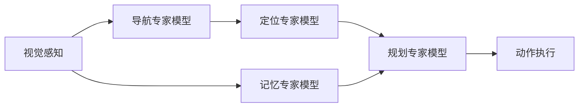

## 概述

**Vesta** 是 NVIDIA 联合伊利诺伊大学、UCSD、港理工、密歇根大学、南洋理工、JHU、蒂宾根大学等机构于 2026 年 6 月发布的统一具身推理模型，论文编号 arXiv:2606.20905。

核心主张：用一个模型取代传统机器人系统中「专家模型拼凑」架构，将**定位、导航、空间推理、长期规划**四大能力统一到单一基础模型中。

## 问题背景

传统机器人系统架构：



痛点：
- **级联失败**：任一个专家输出错误，后续专家放大错误，导致全局崩溃
- **计算冗余**：多个大型模型同时运行，资源消耗高
- **信息延迟**：专家间传递信息引入延迟
- **灾难性遗忘**：纯导航专家模型面对非导航问题只会输出转向指令，完全丧失通用能力

## 技术方案

### 基座模型

基于 **Qwen3-VL-8B**，在原有视觉语言能力基础上做增强训练。

### 训练数据配方

| 数据类型 | 占比 | 作用 |
|:---|:---|:---|
| 空间智能 | 27.1% | 理解三维空间物体位置关系 |
| 导航 | 21.8% | R2R / RxR / ScaleVLN 数据集 |
| 物体定位 | 20.8% | Objects365 + COCO + LVIS + 机器人视角数据 |
| 通用 VLM | 16.2% | 防止专项训练中遗忘通用能力 |
| 具身推理 | 9.8% | 认知 + 定位类推理 |
| 真实机器人数据 | 4.3% | 落地校准 |

设计哲学：**大头给空间能力，保留通用能力防遗忘，少量真实数据做校准**。

### 定位训练策略

「主干加尾巴」策略：
- **主干**：通用检测数据集（Objects365 / COCO / LVIS），覆盖数千类物体
- **尾巴**：机器人视角数据 —— 第一人称观察、以操作为中心的标注、时序交互序列

### 记忆模块

```
每步 → 打包存档:
  ├─ 步骤编号
  ├─ 时间戳
  ├─ 视觉画面
  ├─ 决策内容
  └─ 整体目标

下一步决策时 → 注入历史记录到模型输入
```

关键设计：
- 历史帧数量有上限，通过**均匀采样**或**偏向近期采样**选取
- **第一帧永远保留**（起始状态对理解进度至关重要）
- **图像 + 文字混合记忆** > 纯图像 > 纯文字
  - 纯图像：难以理解任务进度，过早切换行动
  - 纯文字：过度依赖文字捷径，频繁输出「继续当前任务」

### 链式思考（Chain of Thought）

每个子任务预测前经历四阶段：

```
观察 → 进度评估 → 推理 → 行动
```

仅行动指令写入记忆，前三阶段为辅助思考过程。

## 实验结果

### 导航（R2R，1839 个未见场景任务）

| 模型 | 成功率 |
|:---|:---|
| Vesta | **55.5%** |
| InternVLA-N1（导航专家） | 55.4% |
| RynnBrain / RoboBrain 2.5 / Qwen3-VL | 0% |

**消融实验**：纯导航训练 54.1%，统一训练 55.5% → 联合训练产生**正向迁移**，比纯专家高 1.4pp。

### 具身推理

| 维度 | Vesta | 最强对手 |
|:---|:---|:---|
| 认知类（10 基准均值） | **68.7** | RynnBrain 64.8 |
| 定位类（5 基准均值） | **69.9** | RoboBrain 2.5 69.4 |
| Open-X VQA | **89.3** | RynnBrain 74.0 |
| MindCube 空间推理 | **80.9** | RynnBrain 56.6 |
| EgoTaskQA | **81.9** | 基础 Qwen3-VL +24pp |
| CrossPoint 跨视角 | **76.0** | RynnBrain 44.3 |

### 动作规划（AgiBot + Egocentric Human-Hand）

| 任务 | Vesta | 最强对手 |
|:---|:---|:---|
| 总体平均 | **75.4** | RoboBrain 2.5 38.5 |
| 清理桌面 | **74.4** | 38.7 |
| 放置水果 | **91.0** | 81.6 |
| 分拣零件 | **64.0** | 18.1 |
| 折叠衬衫 | **80.3** | 38.3 |
| 补充货架 | **82.3** | 33.0 |
| 零样本人手任务（60类） | **60.5** | 27.0 |

**过渡时刻处理**：子任务切换时刻天然稀疏 → 2x 过采样，显著提升过渡准确率（3x 收益递减）。

### 真实机器人测试

平台：I2RT 双臂 YAM 夹持机器人，三项任务各测 20 次：

1. **寻找物品**：四个抽屉中找物品，不能重复开同一抽屉
2. **数水果**：按要求放入指定数量水果
3. **记住糖果**：糖放盒子 → 盒子放匹配颜色托盘（糖不可见后凭记忆）

| 配置 | 平均成功率 |
|:---|:---|
| 纯执行模型 | baseline |
| + Qwen3-VL 规划器 | +13.3% |
| + Vesta 规划器 | **+38.3%**（vs baseline），**+25%**（vs Qwen3-VL） |

统计置信度 > 4σ。失败案例中多数来自执行模型动作错误，而非规划器判断失误。

## 局限与未来方向

- 仅一种机器人平台、三种任务验证
- 仅 8B 参数，更大规模未探索
- 记忆模块依赖人工规则，未从数据中自我学习
- 真实世界场景远比实验复杂

## 关键洞察

1. **Generalist > Specialist**：一个模型同时精通所有任务，不仅可行，而且比专家团队更强
2. **正向迁移**：联合训练产生正向交互，而非互相干扰
3. **记忆是核心**：图像+文字混合记忆解决了长时程非马尔可夫任务
4. **架构简化趋势**：未来机器人内部设计可能大幅简化，部署成本降低，可靠性提升

## 相关链接

- 论文：[[arXiv:2606.20905]]
- 基础模型：[[Qwen3-VL]]
- 相关概念：[[具身智能-VLA-学习清单]]、[[Diffusion-Policy-扩散策略]]、[[Inner-Monologue-环境反馈规划]]