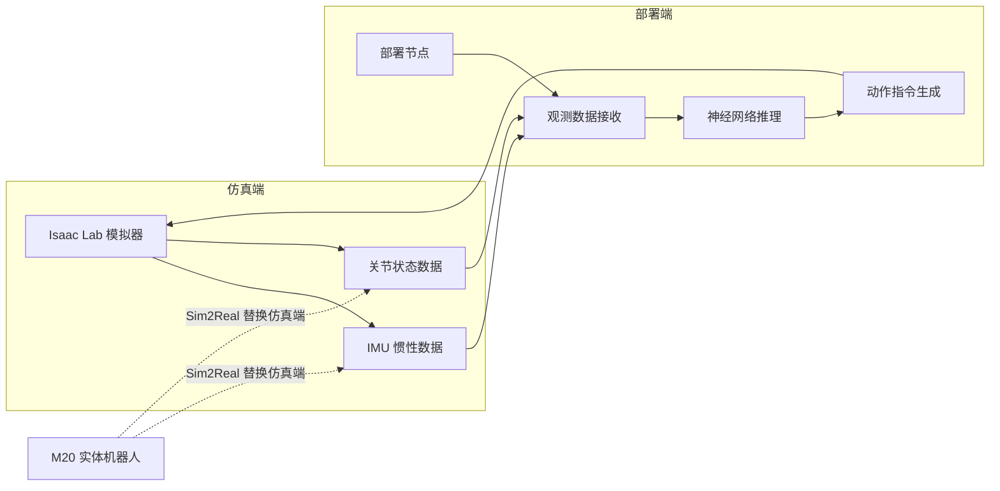
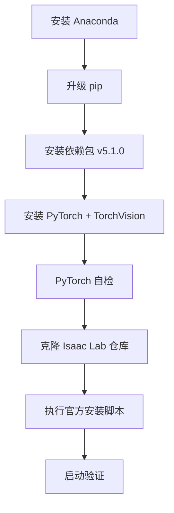
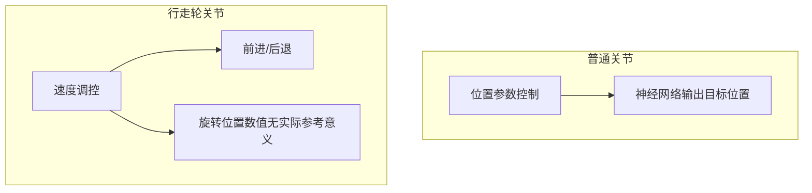
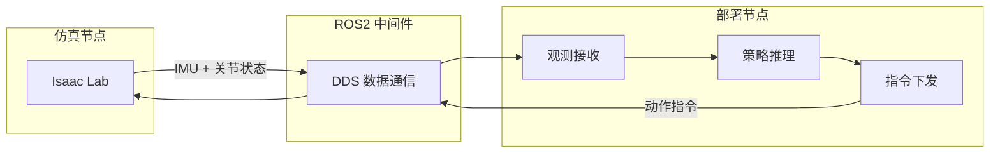

## 概述

本文基于具身智能系列视频第一期，完整记录从仿真环境搭建、强化学习训练到真机部署的全流程。以山猫 M20 四足轮式机器人为例，整个 pipeline 适用于全系机型（包括后续人形机器人）。相关训练细节可参考 [[机器人控制]] 系列内容。

## 系统架构

整套系统基于 ROS2 Humble，采用**双节点交互模式**：



核心逻辑：仿真端负责环境数据采集，部署端负责决策运算与指令下发。切换实体机器人时，仅替换数据源，控制逻辑保持不变。

## 环境搭建：Isaac Lab

Isaac Lab 由英伟达维护，是目前全球使用度最高的机器人仿真模拟器，基于 Omniverse (OM) 底层框架搭建。

### 安装流程



注意事项：
- Windows 系统需切换适配版本，务必保证软件版本匹配
- 首次启动会自动下载大量文件并编译，CPU 会满载，等待数分钟
- 启动后 20 核 CPU 全速工作是正常现象

### 验证

运行简易训练示例，训练任务启动成功即代表 Isaac Lab 环境可用，可自主创建并训练专属任务。

## 训练流程

### 代码仓库

深度机器人实验室 GitHub 仓库的训练板块存放全部训练示例代码。视频所用算法是运动算法的**最简实现版本**，并非顶尖/量产级别，适合作为自研算法基础。

### M20 训练实操

```bash
# 1. 克隆训练仓库
git clone <repo-url>

# 2. 安装 Python 依赖
pip install -r requirements.txt

# 3. 查看可用仿真环境（当前：Lite3、M20）
python scripts/list_envs.py

# 4. 启动 M20 训练
<train-command>
```

### 训练监控

- 单轮训练耗时约 2 秒（双 RTX 4090 配置）
- 日志文件查看训练进程
- TensorBoard 可视化：训练曲线、各项奖励数值变化

### 强化学习核心模块

训练包含以下模块：课程参数配置 → 奖励机制 → 权重配比 → 任务终止判定条件 → 机器人观测数据 → 动作指令 → 设备启停/重置等事件触发。

## 奖励函数设计

### M20 vs Lite3 差异

| 项目 | Lite3 | M20 |
|------|-------|-----|
| 自由度 | 12 | **16**（单腿 4 DOF，新增膝关节+行走轮） |
| 轮式关节 | 无 | 有（速度控制，非位置控制） |
| 基座高度参数 | 有 | **无**（改用关节姿态惩罚） |
| 目标线速度 | 常规 | -5 ~ 5 m/s |

### 轮式关节的特殊处理



- **普通关节**：位置参数控制，神经网络输出目标位置指令
- **行走轮**：只能依靠关节**速度**调控行进、后退，轮体旋转位置数值无参考意义
- 奖励机制、环境配置需针对性优化：单独划分轮式关节命名参数，观测数据模块拆分普通关节与轮体关节数据，**两类数据分开采集运算**

### 高度稳定策略

M20 取消基座高度参数，改用**关节姿态惩罚机制**：

$$
\text{penalty} = \sum_{i} \| q_i - q_i^{\text{default}} \|
$$

- 关节运行位置偏离默认标准值 → 触发惩罚
- 机体关节基本保持固定姿态，仅靠轮子转动行进 → 机身高度稳定
- 适用于**四足轮式机器人**，无轮腿式不适用（运动时关节姿态动态变化）

> 硬件结构不同，奖励函数设计思路也需对应调整。

## M20 vs Lite3 核心差异总结

| 维度 | Lite3 | M20 |
|------|-------|-----|
| 行走机构 | 纯腿式 | 腿 + 行走轮 |
| 自由度/单腿 | 3 DOF | 4 DOF（膝 + 轮） |
| 总自由度 | 12 | 16 |
| 体型 | 较小 | 更大 |
| 速度上限 | 较低 | 更高 |
| 行进模式 | 迈步 | 迈步 + 滚动自适应 |
| 控高方式 | 基座高度参数 | 关节姿态惩罚 |

## Sim2Real：模型导出与真机部署

### 模型导出

Isaac Lab 训练完成后自动导出 **ONNX** 格式模型文件，可直接用于真机部署。

### 部署流程


### 关键配置

- 仿真设备 **X86**，M20 板载计算机 **ARM** → 编译时切换硬件适配平台，其余流程一致
- 通信频率推荐 **200Hz**（必须为 1000 的约数），500Hz 也可用，不建议更高
- 默认手动控制 / SDK 算法控制**互斥**，并行下发会引发设备故障
- 项目内置深度机器人 DDS 数据通信架构，封装关节数据、控制指令等消息格式

### 操控方式

| 按键 | 功能 |
|------|------|
| Z | 直立起身 |
| C | 切换至自主控制模式 |
| WASD | 前后行进 / 横向移动 |
| QE | 原地转向 |

### Isaac Lab + ROS2 通信拓扑



## M20 硬件配置

- 配件清单：动力电池、充电底座、各类连接线材、操控手柄
- 充电：底座摆放到位即可自动充电
- 开机：长按电源键 → 风扇运转 → 灯光变白 → 就绪
- 搬运：双手托举腿部，轻放至平整地面

## 安全注意事项

- 仿真可设高速参数，**真机不建议以 5 m/s 运行**——简易策略缺少安全防护逻辑，高速极易失控
- 首次使用需充满电池
- 遇到问题可联系官方售后、Discord 社群或 GitHub Issues

## 关键要点

1. **Isaac Lab** 是目前最主流的机器人仿真平台，基于 NVIDIA Omniverse
2. **M20 是四足轮式机器人**，16 自由度（单腿 4 DOF），轮式关节需速度控制而非位置控制
3. **奖励函数需适配硬件结构**：轮式机器人用姿态惩罚控高，纯腿式用基座高度参数
4. **Sim2Real 通过 ONNX 导出**：仿真训练 → ONNX → X86 编译 → SSH → ARM 编译 → 真机部署
5. **ROS2 双节点闭环**：仿真端/真机端采集 → 部署端推理 → 指令回传，切换数据源即可通用
6. **通信频率 200Hz**，手动/自主模式互斥
7. 两套算法本质目标一致：让机器人精准跟随设定线速度、角速度完成移动