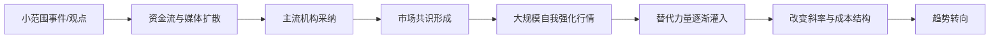
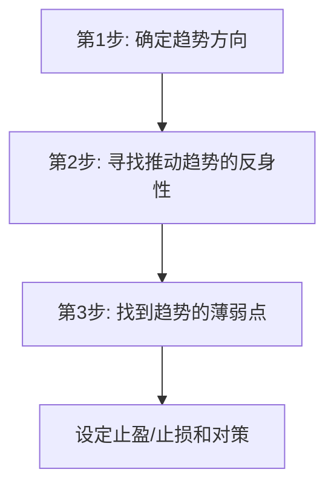
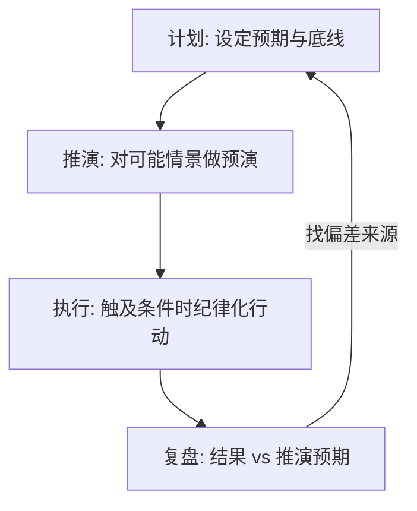

# 反身性、交易计划与心态实战指南

## 缩写与术语表

| 缩写/术语 | 全称 | 含义 |
|-----------|------|------|
| 反身性 | Reflexivity | 参与者预期影响市场现实，市场现实又反过来影响参与者预期，形成自我强化的循环 |
| 最小阻力方向 | Path of Least Resistance | 价格沿阻力最小的方向运动，即均线运行成本的方向 |
| 推演 | Scenario Analysis | 对可能发生的市场情景进行预演，设定预期与底线 |
| 预期 | Expectations | 推演中对行情发展的合理预测（价格区间、时间窗口、触发事件等） |
| 底线 | Floor / Stop | 推演中明确能接受的最大损失或触发撤出的条件 |
| 散漫观点 | Scattered Opinions | 市场认知第一层：个人零散意见，影响微弱且局部 |
| 主流意见 | Mainstream View | 市场认知第二层：大型机构、央行等能左右市场的力量 |
| 市场共识 | Market Consensus | 市场认知第三层：被大多数参与者广泛接受的认知，自我强化最猛烈 |
| 薄弱点 | Weak Point | 趋势中最脆弱的位置，最可能触发转向的条件或事件 |
| Chart | — | 图形/图表，直接反映市场行为与人性的工具 |

---

## 一、市场没有真相，只有反身性

### 内幕消息的局限

长期接触所谓"股市内幕预测"，会发现大部分是谎言——有些是故意散布的假消息，剩下多为个人毫无价值的观点。在现代美股市场上，传统内幕交易已不被允许存在，真正的"秘密"不易长久存留。成熟投资者应把关注点从寻找"幕后真相"转移到识别和利用反身性上。

### 索罗斯的三步策略

> 认清假象 → 投入其中 → 在假象为公众认知前退出

这不是在追求真相，而是在利用假象：承认市场的表象往往被扭曲或误导，在扭曲存在时采取行动获取收益，在大众意识到之前撤出避免被修正。

### 反身性的核心

"市场上有没有真相？"——答案是**没有真相，只有反身性**。市场参与者的预期与行为会影响市场现实，而市场现实的变化又反过来影响参与者的预期与行为，形成循环互动。看似"真相"的市场状态，可能只是参与者相互强化的结果。

---

## 二、反身性的形成机制与三层认知

### 反身性的运作

反身性类似"条件反射"——通过一系列相关事件或刺激，改变参与者的认知，让原本不相关的事物发生关联，这个关联被不断强化，进而改变市场行为和价格走势。它是一个**持续强化刺激的过程**，而非单次事件。

### 市场认知三层级

| 层级 | 内容 | 影响力 |
|------|------|--------|
| 第一层：散漫观点 | 个人零散意见（"你的、我的、他的观点"） | 微弱且局部 |
| 第二层：主流意见 | 大型机构、央行等能左右市场的力量 | 影响力放大 |
| 第三层：市场共识 | 被大多数参与者广泛接受的认知 | 大规模、强烈、自我强化 |

**任何一个层级的认知都可能是错误的，都可能只是暂时的假象。** 投资者的任务是判断当前趋势与哪一层认知发生了关联——层级越高，行情越大，但反转也可能更猛烈。

### 反身性的扩散与替代

先有推动力强化某一方向，然后反向力量逐渐灌入并改变斜率与成本结构，最终实现趋势转向。识别认知处于哪个层级，决定了行情的强弱与持续性。

---

## 三、计划与推演：把错误限制在可控框架内

### 为什么需要计划

没有计划，或有计划但不执行 → 错误呈现为随机、不可控状态，难以累积经验和针对性修正。通过计划，把错误限制在可控框架中，利于迭代改进。

> "一个人犯错时唯一能做的就是不要再错下去。"

### 推演的核心：预期与底线

| 要素 | 作用 | 特性 |
|------|------|------|
| 预期 | 对行情发展的合理预测（价格区间、时间窗口、触发事件） | 动态调整，非固定 |
| 底线 | 明确能接受的最大损失或触发撤出的条件 | 触及即执行，不可拖延 |

预期与底线构成"有天花板有地板"的活动空间——圈内波动被允许且可承受，超出上限触发止盈，超出下限触发止损。

### 孙悟空画圈的比喻

计划就像孙悟空给唐僧画的圈：圈内活动安全可控，跳出圈外则危险。**止损不是错误，而是计划内的正确执行**；亏损的交易有时反而是正当的，因为它避免了更大的不可控风险。相反，偶然赚钱但没有框架支撑的交易，不能视为好计划的证明。

### 框架内犯错的学习价值

| 错误类型 | 特征 | 学习价值 |
|----------|------|----------|
| 框架内错误 | 可观察、可复盘、可定位偏差来源 | 高——可针对性改进 |
| 随机化错误 | 无可比性、无结构、无规律 | 低——难以形成学习曲线 |

---

## 四、最小阻力方向与图形的保护作用

### 最小阻力方向

> **最小阻力方向 = 市场移动平均成本运行的方向**

价格沿阻力最小的方向运动：上涨阻力小于下跌阻力 → 价格上涨；反之则下跌。这是反身性在价格层面的表现——市场通过选择性放大或忽略信息来强化当前趋势：

- **牛市**：利空被忽略，利多被放大
- **熊市**：利多被忽略，利空被放大

### 做推演时的核心

判断市场运行成本（均线）的方向 → 确定"最小阻力方向"：

- 趋势方向与持仓一致 → 尽量持有，不轻易放弃
- 可能扭转趋势的因素出现 → 提前准备对策（调整仓位、保护性止损、对冲）

### 图形（Chart）是最可靠的保护工具

当消息面、基本面和图形冲突时，**图形优先**——因为图形直接反映市场行为与人性。

图形揭示两类关键信息：

1. **异常信号**：不寻常的图形（大量缺口、典型假动作）表明市场内部发生了重要事件，即便你不知道背后原因，也必须作出反应
2. **人性极端**：图形反映过度贪婪或恐慌，而这恰恰是交易机会所在

### 图形应用的两个原则

| 原则 | 做法 |
|------|------|
| 不对抗趋势 | 找到最小阻力方向，顺势而为 |
| 在极端处反向操作 | 疯狂上涨时思考卖出，恐慌下跌时思考买入 |

---

## 五、开放心态与灵活转向

### 索罗斯的故事

索罗斯在聚会上表示看好房地产，朋友听后买入房地产股票，但很快下跌。朋友没有卖，而索罗斯**早已卖出并反手做空获利**。

两层启示：

1. 不要随便向朋友询问买卖建议（容易伤感情）
2. 更重要：索罗斯的观点并非一成不变——当市场事实与判断不一致时，他迅速转向并执行新操作

### 开放思维的要点

- **不僵化持有观点**：交易者必须保持灵活性，愿意在证据出现时改变立场
- **有计划、有框架**：当行情在框架之外运行（尤其触及底线），不管之前怎么看，都要执行事先设定的计划
- **否则就是与市场争执**：市场最终会以价格惩罚固执

### 信息优先级

当信息面、图形、基本面三者冲突时：

> **图形 > 基本面 > 消息面**

图形直接反映市场行为与人性，是最可靠的参考。开放心态意味着不把任何单一数据神圣化，始终通过价格行为来检验与调整认知。

---

## 六、三步趋势分析与等待的价值

### 做空的观点

- **股票**：尽量只做多不做空（价格理论无上限，做空有无限风险）
- **期货**：可以双向操作（价格有社会运营成本天花板，极端时也创造双向机会）

这是个人偏好与风险管理选择，非普适规则。

### 三步走趋势分析

| 步骤 | 内容 | 目的 |
|------|------|------|
| 1. 确定方向 | 看均线排列（多头/空头），判断最小阻力方向 | 不逆势操作 |
| 2. 识别反身性 | 什么因素推动趋势持续？这种驱动力是否会被替代？ | 判断行情可持续性 |
| 3. 找薄弱点 | 如果趋势要反转，哪里最脆弱？什么条件/事件最可能触发？ | 设定止盈止损与对策 |

### 等待的比率

> **90% 时间等待 → 9% 时间学习与复盘 → 1% 时间扣动扳机**

等待不是消极，而是纪律的一部分——把机会与风险分离。只有符合计划与图形信号时才行动，避免被情绪驱使。

### 利弗莫尔的警示

Jesse Livermore 的方法很多时候是成功的，但最终因个人性格与人性弱点导致多次起落，最后以自杀结束。**方法容易，难的是执行与自我管理**——交易技术和方法并非全部，人的性格与人性控制才是决定成败的关键。

---

## 七、两大心智模型总结

### 模型一：计划—推演—执行的循环

**心态内核**：

| 原则 | 含义 |
|------|------|
| 接受错误的必然性 | 重点不是避免所有错误，而是把错误控制在可管理范围并从中获取信息 |
| 纪律优先于自信 | 纪律化执行比短期正确更重要，因为纪律带来结构化的学习机会 |
| 动态适应 | 预期与底线随市场变化调整，但必须通过有记录、有理由的方式，而非情绪驱动 |

### 模型二：反身性识别与分层认知

| 操作步骤 | 内容 |
|----------|------|
| 1. 观察价格行为 | 图形、缺口、大量成交是否显示某种被强化的方向？ |
| 2. 观察消息面与资金面 | 机构行为、政策信号、资金流入/流出是否支撑该方向？可持续性如何？ |
| 3. 评估层级扩散 | 推动力量处于散漫观点、主流意见、还是市场共识阶段？ |
| 4. 预判替代力量 | 寻找可能替代当前驱动力的因素，设定触发条件与对策 |

**心态与应对**：

- 不迷恋"真相"——市场行为由参与者共识塑造，"真相"难以在价格之外独立存在
- 灵活与耐心并重——识别反身性需要耐心观察扩散路径，证据出现时迅速调整
- 以图形为检验工具——价格行为是检验反身性存在与强度的最直接信号

---

## 参考

- 来源：YouTube vafgXqM3Uc0
- 交易计划与系统：[[建立完整交易策略系统实战指南]]
- 趋势判断与均线：[[K线形态]]、[[用均线与抵扣价理解趋势的交易观察系统]]
- 斐波那契与回调：[[斐波那契回撤交易指标实战详解]]
- 反身性与金融理论：[[有效市场假说 - EMH 详解]]