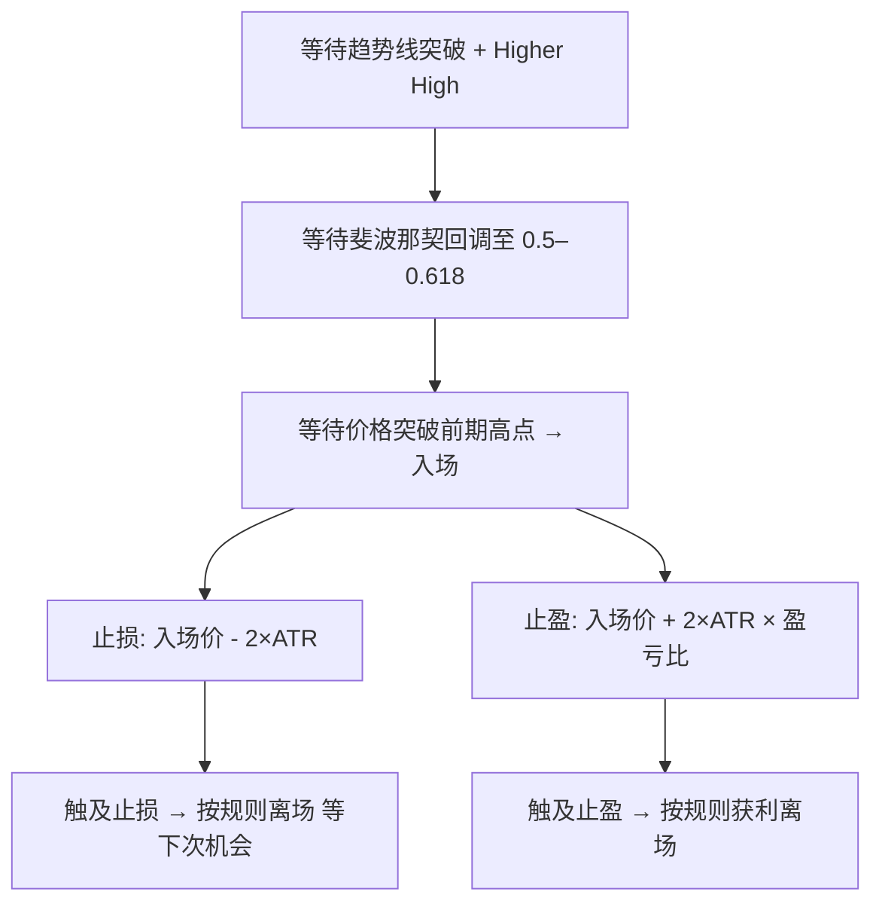
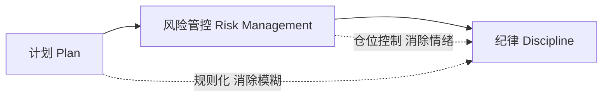

# 建立完整交易策略系统实战指南

## 缩写与术语表

| 缩写/术语 | 全称 | 含义 |
|-----------|------|------|
| EV | Expected Value | 期望值，长期多次交易的平均预期收益。正 EV = 长期赚钱，负 EV = 长期亏钱 |
| ATR | Average True Range | 平均真实波幅，衡量个股波动大小的经典指标，本策略用 2×ATR 设止损 |
| MA | Moving Average | 移动均线，判断趋势方向的常用工具 |
| 盈亏比 | Reward-to-Risk Ratio | 止盈潜在收益 / 止损潜在亏损，建议 ≥ 1.5:1 |
| 斐波那契回调 | Fibonacci Retracement | 用斐波那契比率（0.5、0.618 等）判断价格回调位置的工具 |
| Higher High | — | 更高高点，价格突破前一个高点，是趋势转升的确认信号 |
| Drawdown | — | 回撤，账户从峰值到谷底的最大跌幅；也指连续亏损期 |
| KPI | Key Performance Indicator | 关键绩效指标，如胜率、平均盈亏、最大回撤等 |
| Trendline | — | 趋势线，连接价格高点或低点画出的方向线 |

---

## 一、为什么大多数人长期亏损

多数交易者亏损的根源不是运气差或工具不够，而是**没有完整可执行的交易系统**。无系统时，交易被情绪主导：

- **贪婪**：涨了不愿卖，期待更高收益
- **厌恶损失（Loss Aversion）**：回到成本价时匆忙卖出不认亏，结果两头落空
- **祈祷式交易**：买入后只能"希望"股价走好，像比大小一样毫无判断依据

交易系统的作用就是把这些情绪排除在决策之外——把"买什么、何时买、何时止损止盈"全部规则化。有明确止损点时，下跌不会慌张盯盘，按规则执行即可；有明确止盈点时，上涨不会因贪婪迟迟不退出。

**心态转变**：与其试图每次都准确预测市场，不如建立能在概率层面长期占优的系统。交易不再是单一操作的胜负，而是长期执行许多次正 EV 决策的累积过程。

---

## 二、计划：交易前必须完成的五步规划

每一次交易在入场前都要完整规划好所有可能情况与对应规则。

### 第1步：确认趋势

趋势分三种：

| 趋势类型 | 应对策略 |
|----------|----------|
| 上升趋势 | 做多 |
| 横盘趋势 | 观望（回报率低且易被套牢） |
| 下跌趋势 | 坚决不买 |

**趋势判断必须规则化**，不能模糊。常见工具包括 MA、趋势线、形态（下降楔形、三角形、双底、头肩底等）。选择工具后要把定义细化成可执行规则，例如：

> "若价格突破下降趋势线并且形成 Higher High，则认为趋势转为上升。"

很多人误以为在"上涨趋势中买入"却仍被套，原因就是对趋势的判定不够详细或规则不明确。

### 第2步：设定交易条件

用具体指标量化进场条件。本视频以**斐波那契回调**为例：

- 回调必须落在 **0.5 ~ 0.618** 区间才考虑进场
- 跌破 0.618 → 不交易（回调过深，趋势可能已反转）
- 未到 0.5 就反弹 → 不交易（回调不够，进场位置不理想）

这样把模糊的"回调至合理位置"量化为可执行的区间。

### 第3步：入场点

以**突破前期高点**为入场触发，作为对趋势的二次确认。结合趋势线突破 + 斐波回调条件，形成双重确认机制，降低误判概率。

### 第4步：止损点

止损是认输离场以保存资金。**用 ATR 衡量波动性**，止损距离设为 **2 × ATR**：

- 不同股票波动性差异大，固定点数止损不合理
- ATR 让止损距离自适应个股的波动特征
- 给价格足够的"呼吸空间"，避免被正常波动震出局

### 第5步：止盈点

用**盈亏比**设定止盈位置。视频建议 ≥ 1.5:1（止盈潜在收益至少是止损潜在亏损的1.5倍），也可用 2:1、3:1：

> 止损设为 2×ATR → 止盈距离 = 2×ATR × 盈亏比（如 1.5:1 → 止盈距离 = 3×ATR）

长期保持正盈亏比 + 合理胜率 → 正 EV。

### 完整流程一图看懂

---

## 三、正 EV 决策：概率思维的核心

### 什么是 EV

$$EV = \text{胜率} \times \text{平均盈利} - \text{失败率} \times \text{平均亏损}$$

- EV > 0 → 长期赚钱
- EV < 0 → 长期亏钱

### 箱子类比

箱子 A：3红球（赢1000）+ 2白球（输1000）→ 选 A 是正 EV 选择。箱子 B：白球多于红球 → 负 EV。

回到交易：**在上涨趋势中顺势交易**，等于选了"红球更多的箱子"——概率上有利。在下跌趋势中逆势买入，等于选了白球多的箱子——长期负 EV。

### 关键认知

1. **正 EV 不保证每笔都赚**：即便系统是正 EV，你仍会遇到止损出局后股价暴涨的情况。这是概率游戏的正常现象，不是系统失败的证据
2. **提高 EV 的两条路**：提高胜率（顺势交易）和提高盈亏比（严格止损 + 高止盈目标），两者可同时下手
3. **样本量很重要**：单次交易结果有随机性，必须用足够多的样本（回测 + 实盘）来判断策略是否真正正 EV，切忌用几笔交易断定系统优劣

---

## 四、资金与风险管控

### 核心原则：保存资金优先

没有资金就无从盈利。首要目标不是赚钱，而是**保住本金**。

### 小亏 vs 重亏的恢复难度

| 亏损幅度 | 回本所需涨幅 |
|----------|-------------|
| 10% | 11.11% |
| 50% | 100% |
| 90% | 900% |

小亏损可迅速恢复，重亏则极难翻身。止损的意义就在这里——把每笔亏损控制在可恢复范围内。

### 仓位应该多大

不设固定数值，而是遵循原则：**仓位大小应使得无论股价涨跌，生活不受影响，能淡定执行计划**。

具体计算方法：

1. 设定单次最大可亏百分比（如总资金的 1% 或 2%）
2. 止损距离 = 2 × ATR
3. 仓位 = (可亏金额) / (止损距离)

> 例：总资金 10000，可亏 1% = 100 元，止损距离 2 元/股 → 买入 50 股

这样无论市场如何波动，风险都是可控的。

### 仓位还影响情绪

单笔投入过大时，小幅波动就影响心理 → 频繁盯盘、偏离计划、过早或迟迟不执行止损。合理仓位让交易者在金钱波动下仍能冷静，专注于执行系统。

### 整体风险敞口

同时持仓数量和总仓位也需控制，避免多笔相互关联或单一事件导致巨大损失。

---

## 五、纪律：系统成功的最终保证

纪律不是单纯的自律，而是**建立在"有计划 + 有资金管理"基础上的自然结果**。当你有清晰的计划与风险控制后，遵守纪律更容易——因为这些工具给了你信心与情绪缓冲。

### 让纪律落地的三个理由

1. **信心来源于系统完整**：知道自己在做什么、为什么这样做
2. **情绪被风险管控限制**：仓位合理 → 波动不影响生活 → 不会恐慌操作
3. **回测带来对胜率的充分认识**：知道系统历史上表现如何，连败时能坚持

### 回测与实测

- **回测**：把策略套用在历史数据上，检验胜率、回撤、不同市场环境下的表现
- **实测**：在真实或纸上交易中验证
- 数据建立信心，让交易者在连续亏损时仍能坚持规则

### 不要随意改参数

短期不佳就急于调整 → "随时改规则、无据可依"。正确做法：

1. 先通过回测找到合理参数
2. 实盘小仓位测试
3. 只有在统计显著且样本充分时才考虑调整

### 交易日志

每次交易后记录：入场理由、止损止盈、情绪状态、结果。在回测基础上优化系统并增强执行力。

> **核心口诀：Trade your plan; Plan your trade（交易你的计划，计划你的交易）**

---

## 六、三大心智模型总结

### 模型一：三层结构

把不确定性里的可控部分事先固定，让执行变成机械化规则而非感性判断。

### 模型二：正 EV 思维

$$EV = P_{win} \times \text{Avg Win} - P_{loss} \times \text{Avg Loss}$$

- 顺势交易 → 提高胜率
- 严格止损 + 高盈亏比 → 提高每次获利的倍数
- 足够样本 → 检验策略是否真正正 EV
- 接受连败和错过行情 → 概率游戏的正常部分

### 模型三：规则化与可复制性

| 原则 | 做法 |
|------|------|
| 规则够详尽 | 陌生人按规则也能执行并得出相似结果 |
| 量化模糊概念 | "趋势转升" → "突破趋势线 + Higher High"；"波动性" → "ATR 数值"；"回调" → "斐波那契 0.5–0.618" |
| 可复制 → 可回测 | 明确规则后可自动化回测，得到胜率、平均盈亏、最大回撤等 KPI |
| 降低情绪干扰 | 所有情形和对应动作事先写明，执行像运行流程图 |

**本质：把交易从"艺术"转为"工程"，用规则和流程保证可靠性与可持续性。**

---

## 参考

- 来源：YouTube yHreyPWX0Y0
- 斐波那契回调实战：[[斐波那契回撤交易指标实战详解]]
- 止损与 ATR：[[Futures Position Management]]
- 趋势判断工具：[[K线形态]]、[[MACD背离策略：从基础到实战交易指南]]
- 交易心态：[[反身性、交易计划与心态实战指南]]