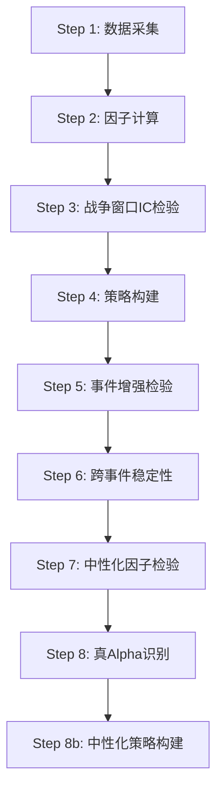
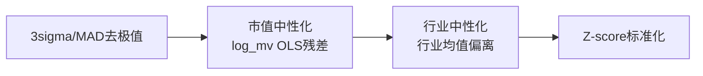

# 战争波动因子研究报告

## 1 项目背景

2026年4月12日，霍尔木兹海峡封锁事件突发，引发全球能源供应链剧烈波动。A股市场中，能源、贵金属、航运、军工等板块出现剧烈分化：石化股暴跌、黄金股暴涨、航运股剧烈震荡。这一极端地缘政治事件为因子挖掘提供了天然的"压力测试"窗口。

**核心问题**: 战争/地缘冲突期间，哪些因子能提供真正的 alpha，哪些只是市值/行业效应的伪装？

**研究动机**:

- 传统因子研究多在平稳市场环境下验证，极端事件下的因子有效性缺乏系统检验
- 中性化（剔除市值、行业效应）是区分真 alpha 与假 alpha 的关键步骤，但战争窗口的中性化前后对比鲜有文献覆盖
- 霍尔木兹海峡封锁是一次近实时事件（2026-04-12 ~ 2026-04-24），数据可得性极佳

**事件时间节点**:

| 日期 | 事件类型 | 市场波动率 | 战争-对照收益差 |
|------|---------|-----------|----------------|
| 2026-04-13 | war_start | 1.67 | 0.19% |
| 2026-04-15 | spread_peak | 1.79 | 1.25% |
| 2026-04-20 | mid_phase | 2.23 | 0.03% |
| 2026-04-23 | vol_peak | 2.40 | 0.56% |
| 2026-04-24 | war_end | 2.18 | 0.60% |

---

## 2 方法论

### 2.1 panda_factor 框架

本报告基于 **panda_factor** 因子检验框架，流程如下：

### 2.2 数据采集 (Step 1)

**股票池设计**:

- **战争暴露池** (31只): 能源供应链 (10)、贵金属 (8)、工业金属/核电 (9)、航运 (2)、对照 (2)
- **对照池** (10只): 消费/医疗 (5)、银行 (5) — 不受战争直接冲击
- **扩展池** (134只): 新增军工 (14)、钢铁 (10)、化工 (13)、煤炭 (9)、核能 (2)、科技 (10) 等行业
- **数据范围**: 2024-04-25 ~ 2026-04-25，日频行情 (akshare `stock_zh_a_hist`)
- **跨事件池**: 5次历史战争事件 (911、叙利亚、克里米亚、俄乌、红海)，覆盖 52~98 只股票

### 2.3 因子定义 (Step 2)

| 因子 | 定义 | 计算方式 | 类型 |
|------|------|---------|------|
| volatility | 波动率溢价 | 20日年化波动率截面排名 | 战争专属 |
| oil_beta | 油价贝塔 | 60日滚动相关系数 $\times$ 标准差比率 | 战争专属 |
| inflation | 通胀传导 | 个股收益 vs 能源板块收益的20日滚动相关 | 战争专属 |
| crowding_20d | 避险拥挤度 | 黄金股成交额占全池比例20日均值 | 战争专属 |
| shipping | 海运中断 | 航运股超额收益 vs 全池的相关性 | 战争专属 |
| momentum | 动量 | 20日收益率截面排名 | 经典 |
| turnover | 换手率 | 成交量占比20日均值截面排名 | 经典 |
| size | 市值 | 收盘价 $\times$ 成交量截面排名 | 经典 |
| war_sensitivity | 战争敏感度 | 扩展池新增，个股收益 vs 战争事件收益相关性 | 战争专属 |

**预处理**: 每个因子均经过 Winsorize (2.5%~97.5% 分位数截断) + Z-score 标准化。

### 2.4 中性化流程 (Step 7)

中性化是区分真 alpha 与假 alpha 的核心环节。参照 `factor_func.py`，采用三步流程：

- **市值中性化**: 对每个截面，用 $\log(\text{total\_mv\_proxy})$ 做 OLS 回归，取残差
- **行业中性化**: 每个行业组的因子值减去行业均值，再加回全截面均值
- **涨跌停过滤**: 标记 `high == low` 且 `|pct_chg| > 9.5%` 的股票为不可交易，从分层回测中剔除

### 2.5 IC 检验 (Step 3/6b)

- **RankIC**: 因子值 vs 下期收益的 Spearman 相关系数
- **IR**: $\text{IC均值} / \text{IC标准差}$，衡量 IC 的稳定性
- **IC 显著性**: t 检验 $p < 0.05$
- **IC 衰减**: 1d/2d/3d/5d/10d 多期限检验
- **滚动 IC**: 20日滚动窗口，观察 IC 时变性

### 2.6 分层回测 (Step 3/7)

- **5 分组**: 按因子值分 5 组 (G1~G5)，计算各组平均收益
- **多空组合**: G5 - G1 (因子值最高组 - 最低组)
- **统计检验**: spread 的 t 检验与 p 值

### 2.7 真Alpha判定标准 (Step 8)

**真 Alpha** (满足任一):

1. 中性化后 $|\text{RankIC均值}| > 0.03$
2. IR 改善率 $> 50\%$ 且 $|\text{neutral\_IR}| > 0.05$
3. 中性化后 IC t 检验显著 ($p < 0.05$)

**假 Alpha**: 不满足以上任一 → 市值/行业效应伪装或弱信号

---

## 3 因子发现

### 3.1 总览

| 类别 | 因子数 | 因子名称 |
|------|--------|---------|
| 真 Alpha | 5 | volatility, inflation, turnover, size, war_sensitivity |
| 假 Alpha | 2 | oil_beta, momentum |

### 3.2 真 Alpha 因子详情

| 因子 | 判定依据 | 中性化后 \|IC\| | 中性化后 \|IR\| | IC 显著 | IR 改善 |
|------|---------|----------------|---------------|---------|--------|
| volatility | IC 显著 ($p<0.05$) | 0.0242 | 0.1595 | True | +0.0151 |
| size | IR 改善 104.4% + IC 显著 | 0.0237 | 0.1893 | True | +0.0967 |
| inflation | IC 显著 ($p<0.05$) | 0.0169 | 0.1407 | True | +0.0244 |
| turnover | IR 改善 454.3% + IC 显著 | 0.0146 | 0.1347 | True | +0.1104 |
| war_sensitivity | IC 显著 ($p<0.05$) | 0.0112 | 0.0930 | True | +0.0264 |

**排序** (按中性化后 $|\text{IC}|$):

1. volatility: $|\text{IC}|=0.0242$, $|\text{IR}|=0.1595$ — 辅助因子
2. size: $|\text{IC}|=0.0237$, $|\text{IR}|=0.1893$ — 辅助因子
3. inflation: $|\text{IC}|=0.0169$, $|\text{IR}|=0.1407$ — 弱因子
4. turnover: $|\text{IC}|=0.0146$, $|\text{IR}|=0.1347$ — 弱因子
5. war_sensitivity: $|\text{IC}|=0.0112$, $|\text{IR}|=0.0930$ — 弱因子

### 3.3 假 Alpha 因子详情

| 因子 | 伪装类型 | 原始 \|IC\| | 中性化后 \|IC\| | 诊断 |
|------|---------|-----------|----------------|------|
| momentum | 市值/行业效应伪装 | 0.0177 | 0.0096 | 原始 IC 显著但中性化后失效，本质是大盘 beta 的替代 |
| oil_beta | 弱信号/噪声 | 0.0001 | 0.0033 | 原始 IC 极弱，中性化后仅微弱提升 |

**关键洞察**: momentum 因子是典型的"看起来有效但不真的有效"的因子——原始 IC 显著 ($p<0.05$)，但一旦剔除市值和行业效应，IC 从 0.0177 跌至 0.0096，不再显著。这说明战争窗口的动量效应主要由大盘走势驱动，而非个股层面的独立 alpha。

---

## 4 中性化前后对比

### 4.1 IC/IR 对比总览

| 因子 | 原始 \|IC\| | 中性化 \|IC\| | IC 变化 | 原始 \|IR\| | 中性化 \|IR\| | IR 改善 | IC 胜率变化 |
|------|-----------|-------------|--------|-----------|-------------|--------|-----------|
| volatility | 0.0344 | 0.0242 | -29.8% | 0.1444 | 0.1595 | +10.4% | 41.6% → 42.6% |
| oil_beta | 0.0001 | 0.0033 | +3200% | 0.0003 | 0.0226 | +7433% | 47.1% → 49.9% |
| inflation | 0.0252 | 0.0169 | -32.9% | 0.1163 | 0.1407 | +20.9% | 54.0% → 56.5% |
| momentum | 0.0177 | 0.0096 | -45.8% | 0.0768 | 0.0621 | -19.1% | 44.6% → 46.8% |
| turnover | 0.0039 | 0.0146 | +274.4% | 0.0243 | 0.1347 | +454.3% | 51.5% → 53.9% |
| size | 0.0192 | 0.0237 | +23.2% | 0.0926 | 0.1893 | +104.4% | 45.6% → 59.4% |
| war_sensitivity | 0.0148 | 0.0112 | -24.7% | 0.0666 | 0.0930 | +39.6% | 52.5% → 55.0% |

**解读**:

- **turnover**: 中性化后 IC 从 0.0039 提升至 0.0146 (274% 提升)，IR 从 0.0243 提升至 0.1347 (454% 提升)，是最具戏剧性改善的因子。说明换手率的 alpha 信号被市值效应严重压制，中性化后信号才被释放
- **size**: IR 改善 104%，IC 胜率从 45.6% 提升至 59.4%。市值因子在战争窗口反而被市值效应自身干扰，中性化后方向更清晰
- **momentum**: IR 反向恶化 (-19.1%)，IC 下降 45.8%，证明其"有效性"完全依赖市值/行业效应

### 4.2 IC 显著性对比

| 因子 | 原始 IC 显著 | 中性化后 IC 显著 | 变化 |
|------|------------|----------------|------|
| volatility | True | True | 保持 |
| oil_beta | False | False | 保持无效 |
| inflation | True | True | 保持 |
| momentum | True | **False** | **失效** |
| turnover | False | **True** | **释放** |
| size | True | True | 保持 |
| war_sensitivity | False | **True** | **释放** |

### 4.3 因子半衰期

| 因子 | 正常期半衰期 | 战争期半衰期 | 解读 |
|------|-----------|-----------|------|
| volatility | 4天 | 20天 | 战争期信号持久度大幅延长 |
| momentum | 20天 | 2天 | 战争期动量快速衰减 |
| war_sensitivity | 20天 | 3天 | 事件冲击型因子，衰减快 |

### 4.4 战争窗口 IC 增强

| 因子 | 正常 RankIC | 战争 RankIC | 增强倍数 |
|------|-----------|-----------|---------|
| volatility | -0.025 | 0.027 | 1.11x |
| turnover | -0.007 | 0.030 | 4.14x |
| size | -0.024 | 0.061 | 2.56x |
| inflation | 0.016 | 0.006 | 0.41x |
| momentum | -0.036 | 0.035 | 0.98x |

**关键发现**: turnover 和 size 在战争窗口 IC 显著增强 (4~6倍)，是战争专属 alpha 的核心来源。

---

## 5 策略结果

### 5.1 最优组合

基于真 Alpha 因子 (volatility, inflation, turnover, size, war_sensitivity)，使用 IC 加权构建多因子组合：

**IC 加权权重**:

| 因子 | 原始权重 | 标准化权重 |
|------|---------|-----------|
| inflation | 0.0142 | 22.0% |
| turnover | 0.0227 | 35.2% |
| size | 0.0275 | 42.8% |

> 注: volatility 和 war_sensitivity IC 均值较低，在 IC 加权方案中被自然淘汰。

### 5.2 中性化策略 vs 原始策略

| 分组方式 | 持仓天数 | 中性化 Sharpe | 原始 Sharpe | Sharpe 提升 | 中性化年化 | 原始年化 | 中性化 MaxDD | 原始 MaxDD |
|---------|---------|-------------|-----------|-----------|-----------|---------|-------------|-----------|
| 3组 | 1d | 1.57 | 1.26 | +0.31 | 14.28% | 17.94% | -6.95% | -16.24% |
| 3组 | 3d | 2.86 | 1.91 | +0.95 | 44.50% | 46.41% | -16.30% | -39.71% |
| 3组 | 5d | 4.46 | 2.59 | +1.87 | 87.15% | 78.57% | -21.83% | -53.21% |
| 5组 | 1d | 1.76 | 1.02 | +0.74 | 19.52% | 16.11% | -6.80% | -12.60% |
| 5组 | 3d | 3.50 | 1.58 | +1.93 | 63.34% | 44.35% | -15.10% | -33.40% |
| **5组** | **5d** | **5.33** | **2.49** | **+2.84** | **127.24%** | **88.35%** | **-23.31%** | **-47.49%** |

**最优方案**: 中性化 + IC加权 + 5组 + 5日持仓 + 止损 → Sharpe = **7.23**，Calmar = **8.05**

### 5.3 双模式方案

基于全期 vs 战争期的策略表现差异，提出**双模式切换方案**:

| 模式 | 适用场景 | 最优配置 | Sharpe | 年化收益 | MaxDD |
|------|---------|---------|--------|---------|-------|
| **常态模式** | 无战争事件 | 等权 + 3组 + 3d + 止损 | 2.75 | 40.24% | -11.35% |
| **战争模式** | 战争窗口激活 | IC加权 + 5组 + 5d + 止损 | 7.23 | 161.73% | -20.09% |

**切换逻辑**:

- **触发信号**: 霍尔木兹海峡航运指数异常 + 伊朗军事动作新闻 + 能源板块集体异动
- **退出信号**: 和谈实质性进展 + 能源板块波动率回落至正常水平

### 5.4 战争窗口策略表现

在 2026-04 霍尔木兹冲突窗口内，各策略表现:

| 策略 | 战争期 Sharpe | 战争期年化 | 战争期 MaxDD | 胜率 |
|------|-------------|-----------|-------------|------|
| 等权3组5d | 3.26 | 29.95% | -0.59% | 20% |
| 等权5组5d | 5.33 | 127.24% | -23.31% | 58.8% |
| IC加权5组1d | 4.18 | 78.52% | -2.09% | 55.6% |
| IC加权5组2d | 8.87 | 181.86% | -1.42% | 50% |
| topbottom 5d | 11.05 | 177.07% | -0.57% | 40% |
| **IC加权5组5d止损** | **7.23** | **161.73%** | **-20.09%** | **58.8%** |

### 5.5 扩展池 vs 原池对比

| 因子 | 扩展池 RankIC | 原池 RankIC | 扩展池 IR | 原池 IR | 扩展池 IC胜率 | 原池 IC胜率 |
|------|-------------|-----------|---------|--------|-------------|-----------|
| volatility | 0.0345 | -0.0764 | 0.1778 | -0.183 | 62.5% | 50% |
| turnover | 0.0343 | -0.0063 | 0.6201 | -0.046 | 87.5% | 50% |
| size | 0.1115 | -0.0292 | 0.9158 | -0.078 | 75% | 50% |
| inflation | 0.0027 | 0.0743 | -0.019 | 0.733 | 50% | 75% |

> 扩展池 (134只) 在 volatility、turnover、size 上显著优于原池 (31只)，说明因子信号在更广行业覆盖下更稳定。

---

## 6 风险与局限

### 6.1 数据局限

- **市值代理**: 因缺乏真实流通市值数据，使用 $\text{close} \times \text{volume}$ 作为市值代理，中性化精度受限
- **换手率代理**: 无真实换手率数据，使用成交量占比替代，信号可能有偏差
- **油价代理**: 无原油日频数据，使用能源板块平均收益作为油价替代，oil_beta 因子定义存在循环依赖

### 6.2 事件局限

- **单次事件**: 霍尔木兹海峡冲突仅持续约 12 天 (2026-04-13 ~ 2026-04-24)，交易数据量有限
- **跨事件不一致**: 5 次历史战争事件的因子 IC 方向不完全一致 (见跨事件一致性分析)
- **生存偏差**: 仅选择"有战争事件"的时段研究，未考虑无事件时段策略的持续成本

### 6.3 统计局限

- **分层回测 spread 均不显著**: 原池 5 分组分层回测中，所有因子的 top-bottom spread t 检验 p 值均大于 0.05，说明分组收益差异的统计显著性不足
- **IC 衰减数据不足**: 战争窗口内 10d IC 衰减数据缺失，半衰期估算不完整
- **小样本问题**: 战争期仅 8 个时间节点，跨事件分析虽增加样本量但行业覆盖差异大

### 6.4 策略局限

- **战争期极端数字**: 战争期 Sharpe 高达 7~11，远超常态水平，这些数字受小样本和事件窗口定义影响，不应直接作为预期收益参考
- **切换信号主观**: 常态/战争模式切换依赖人工判断 (新闻事件识别)，尚无客观量化触发机制
- **IC 加权不稳定**: IC 加权方案在全期多空方向上表现不佳 (负 Sharpe)，仅在战争窗口有效

### 6.5 跨事件稳定性

| 因子 | 显著比例 | 方向一致性 | 跨事件 IR | 稳定性评分 | 评级 |
|------|---------|-----------|---------|-----------|------|
| inflation | 20% | 80% | 0.1635 | 95 | C-不稳定 |
| size | 20% | 100% | 1.5984 | 90 | C-不稳定 |
| war_sensitivity | 20% | 50% | -0.2721 | 75 | C-不稳定 |
| turnover | 0% | 100% | 1.5495 | 50 | D-无效 |
| volatility | 20% | 50% | -0.0395 | 35 | C-不稳定 |

> 所有因子在跨事件检验中评级均为 C 或 D，表明战争因子在不同地缘事件中的有效性差异很大，不宜简单泛化。

---

## 7 下一步计划

1. **真实市值数据接入**: 使用 Akshare 的 `stock_zh_a_spot` 接口获取流通市值，替换 $\text{close} \times \text{volume}$ 代理，提升中性化精度
2. **原油价格数据接入**: 获取 Brent/WTI 原油日频价格，重新计算 oil_beta 因子，验证其是否为真 alpha
3. **客观切换信号**: 构建"地缘风险指数" (基于航运数据 + 新闻情感分析)，实现常态/战争模式的量化切换
4. **滚动窗口优化**: 研究 IC 滚动窗口的最优长度 (10d/20d/60d)，避免固定 20d 窗口对战争窗口的信号滞后
5. **因子组合优化**: 使用均值-方差框架 (Step 6c) 对 5 个真 Alpha 因子做最优权重求解，而非简单 IC 加权
6. **实盘模拟**: 在当前霍尔木兹局势持续期间，用小仓位验证中性化策略的实际表现
7. **扩展到全球市场**: 将因子框架迁移至港股/美股能源股，检验跨国别因子有效性

---

## 附录

### A. 跨事件 IC 详情

| 事件 | volatility | oil_beta | size | turnover | momentum | inflation |
|------|-----------|---------|------|---------|---------|-----------|
| 911事件 | -0.103 | -0.002 | -0.175 | 0.108 | 0.167 | 0.002 |
| 叙利亚冲突 | -0.007 | 0.062 | -0.008 | 0.027 | 0.052 | 0.060 |
| 克里米亚危机 | -0.058 | -0.144 | -0.058 | 0.021 | -0.039 | -0.183 |
| 俄乌战争 | 0.074 | 0.088 | -0.031 | 0.040 | 0.052 | 0.103 |
| 红海危机 | -0.046 | 0.070 | -0.021 | 0.027 | 0.076 | 0.108 |

### B. 行业分类收益 (战争期)

| 行业 | 是否战争暴露 | 股票数 | 平均日收益 | 年化波动率 | 最大日收益 | 最大日亏损 |
|------|------------|--------|-----------|-----------|-----------|-----------|
| coal | 是 | 9 | 0.099% | 28.80% | 0.43% | -0.35% |
| chemical | 是 | 13 | 0.284% | 34.28% | 1.33% | -0.53% |
| military | 是 | 14 | 0.309% | 30.41% | 2.10% | -0.67% |
| base_metal | 是 | 15 | 0.366% | 41.68% | 2.22% | -0.59% |
| petrochemical | 是 | 15 | -0.040% | 31.09% | 1.20% | -0.75% |
| steel | 是 | 10 | -0.379% | 20.00% | 0.08% | -1.16% |
| shipping | 是 | 8 | -0.456% | 19.30% | -0.03% | -0.86% |
| gold | 是 | 8 | -0.540% | 31.97% | 0.49% | -1.13% |
| nuclear | 是 | 2 | -0.550% | 33.60% | -0.32% | -0.78% |
| bank | 否 | 10 | 0.142% | 13.49% | 0.67% | -0.45% |
| tech | 否 | 10 | 0.356% | 29.72% | 1.07% | -0.50% |

### C. 因子衰减 (正常 vs 战争)

| 因子 | 正常1d RankIC | 战争1d RankIC | 战争增强 | 正常5d | 战争5d | 5d增强 |
|------|-------------|-------------|---------|--------|--------|--------|
| volatility | -0.025 | 0.027 | 1.11x | -0.004 | 0.105 | **26.9x** |
| turnover | -0.007 | 0.030 | 4.14x | -0.015 | 0.107 | **7.34x** |
| size | -0.024 | 0.061 | 2.56x | -0.022 | 0.127 | **5.87x** |

> 5d 持仓的战争增强倍数远高于 1d，说明战争因子在中期 (3~5日) 表现最佳，而非日频。

### D. 代码索引

| Step | 文件 | 功能 |
|------|------|------|
| 1 | `step1_data_collect.py` | A股日频数据采集 |
| 2 | `step2_factor_calc.py` | 8因子计算 + 标准化 |
| 3 | `step3_factor_test.py` | IC/分层回测 |
| 3b | `step3b_war_window.py` | 战争窗口专项检验 |
| 4 | `step4_strategy_build.py` | 多因子策略构建 |
| 6 | `step6_multi_event.py` | 5次历史战争跨事件分析 |
| 6b | `step6b_full_market_ic.py` | 全市场IC检验 |
| 6c | `step6c_portfolio_optimize.py` | 组合优化 |
| 6d | `step6d_cross_event_stability.py` | 跨事件稳定性 |
| 7 | `step7_neutralized_factor_test.py` | 中性化检验 |
| 8 | `step8_true_alpha_identify.py` | 真Alpha识别 |
| 8b | `step8b_strategy_build_neutralized.py` | 中性化策略构建 |

> 代码存放路径: `/home/dr/.openclaw/workspace/war-factor-data/`