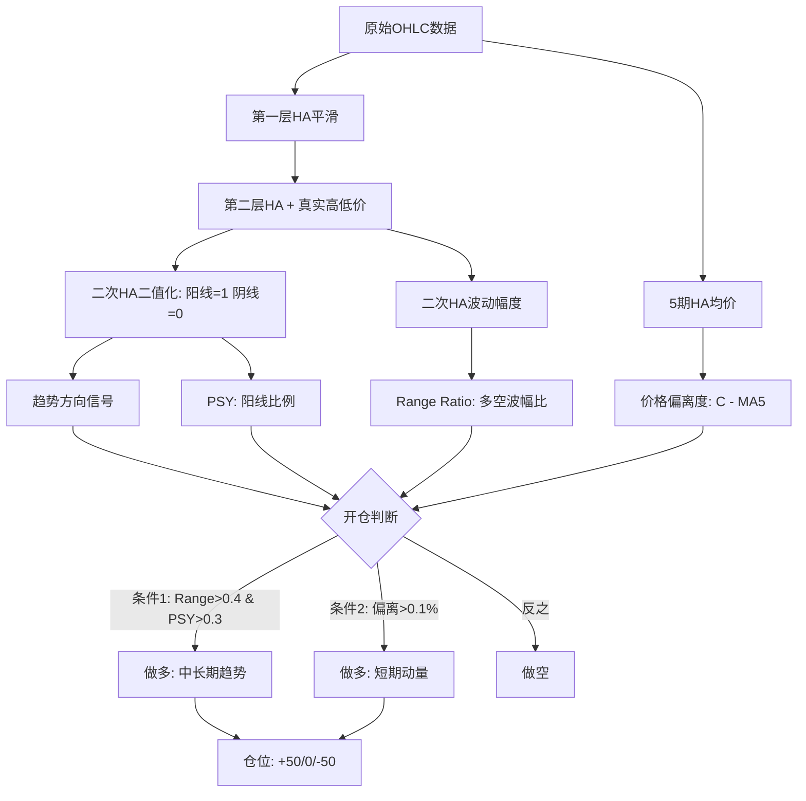

# 重构K线策略详解：双层HA平滑与趋势动量突破

## 策略概览

该策略出自某量化比赛第一名，核心思路是通过**双层 Heikin-Ashi (HA) 平滑**降低数据噪音，使价格序列更平稳，再基于**趋势确认 + 动量突破**的双条件逻辑开仓。

| 指标 | 数值 |
|------|------|
| 总收益 | 524.09% |
| 年化收益 | 787% |
| 最大回撤 | ~10% |
| 夏普比率 | 3.95 |
| 卡玛比率 | 3.36 |

回测区间：2023-01-01 ~ 2025-12-31，同一资金、无限品种/市场。

## 缩写表

| 缩写 | 全称 | 含义 |
|------|------|------|
| HA | Heikin-Ashi | 日语"平均K线"，Heikin=平均，Ashi=足（K线蜡烛），用均值合成替代真实价格以滤噪音 |
| PSY | Psychological Line | 心理线指标，最近N根阳线数量占比，反映多空心理偏向 |
| OHLC | Open, High, Low, Close | 开高低收四价 |
| ATR | Average True Range | 平均真实波幅，衡量价格波动大小的经典指标 |
| MA | Moving Average | 均线 |
| AU | — | 黄金期货 |
| AG | — | 白银期货 |
| CU | — | 铜期货 |
| RB | — | 螺纹钢期货 |
| M | — | 豆粕期货 |
| TA | — | PTA（精对苯二甲酸）期货 |
| Range UP | — | 最近N根多头K线波幅之和（本策略自定义） |
| Range DN | — | 最近N根空头K线波幅之和（本策略自定义） |

---

## 核心原理：重构K线

**重构K线**的本质是将传统 OHLC K线按某种规则重新切割，使数据噪音减少、序列更平稳。常见的重构方式：

- **等成交量K线**：每根K线包含相同成交量
- **等时间均分**：均匀切割最小时间单位
- **Heikin-Ashi**：用均值合成替代真实价格（本策略采用）

> 在期货策略中，信号胜率的关键往往不在于信号本身有多强，而在于**信号处理前对数据平稳性的处理有多好**。

---

## 双层 HA 平滑机制

### 第一层 HA

经典 Heikin-Ashi 计算，将四价取均值：

$$\text{HA Close} = \frac{Open + High + Low + Close}{4}$$

$$\text{HA Open} = \frac{\text{prev HA Open} + \text{prev HA Close}}{2}$$

> **递推说明**：HA Open 是递推计算的，不是凭空设定。第一根K线的 HA Open = 当根真实开盘价（初始值）；之后每根都依赖上一根已算出的 HA Open 和 HA Close。这使得历史信息不断"拖进"当前值，短期跳变被稀释，这正是 HA 能滤噪音的关键——它不是只看当前一根K线，而是通过递推把整个历史序列的平滑效果累积进来。

第一层 HA 的作用：过滤短期噪音，平滑趋势方向。

### 第二层 HA

用第一层 HA 值与**真实高低价**组合再做一遍平滑：

$$\text{二次 HA} = \frac{\text{HA Open} + \text{HA Close} + \text{真实 High} + \text{真实 Low}}{4}$$

二次 HA 的处理：
- 阳线计为 **1**，阴线计为 **0**（二值化趋势方向）
- 单根二次 HA 的实际大小 → 定义**真实波动幅度**

两层平滑层层递进：先去噪音，再保留真实极值信息，兼顾平稳性与波动度量。

---

## 信号体系（三层）

### 1. 趋势方向

二次 HA 的阳线/阴线二值化结果 → 判断当前趋势方向。

### 2. 波动占比（Range Ratio + PSY）

**Range UP**：最近 $N$ 根中所有多头K线的波幅之和

**Range DN**：最近 $N$ 根中所有空头K线的波幅之和

**Range Ratio**：

$$\text{Range Ratio} = \frac{\text{Range UP}}{\text{Range DN}}$$

**PSY**：最近 $N$ 根中阳线K线数量占比，反映多空心理偏向

Range Ratio 衡量**多空力量对比**，PSY 衡量**方向一致性**。

### 3. 动量偏离

用5期 HA 均价度量当前价格偏离：

$$\text{偏离度} = \frac{C - \text{MA}_5(\text{HA Close})}{\text{MA}_5(\text{HA Close})}$$

- 偏离度 > 0 → 价格高于短期均值（短期动量向上）
- 偏离度 < 0 → 价格低于短期均值（短期动量向下）

---

## 开仓逻辑

### 做多条件

| 条件 | 公式 | 捕捉的逻辑 |
|------|------|------------|
| 条件1：趋势确认 | Range Ratio > 0.4 且 PSY > 0.3 | 中长期趋势向上（多头波动占优+阳线比例高） |
| 条件2：动量突破 | 价格偏离短期均值 > 0.1% | 短期价格快速向上突破均值 |

**任一条件满足即开多**——趋势确认抓长期行情，动量突破抓短期急涨，两者互补不遗漏。

### 做空条件

反之则开空（Range Ratio < 0.4 或 PSY < 0.3，或价格向下偏离均值 > 0.1%）。

---

## 仓位管理

- 仅三个档位：**+50手 / 0 / -50手**
- 满仓做多、空仓、满仓做空，无中间过渡

### AI 优化建议

1. **动态仓位**：基于 ATR（平均真实波幅）和当前资金动态调整开仓手数，而非固定50手
2. **止盈止损**：当前策略是纯方向信号框架，缺乏止盈止损机制，应增加风控层

---

## 交易品种配置

| 品种 | 行业 | 类型 |
|------|------|------|
| AU (黄金) | 贵金属 | 有色/贵金属 |
| AG (白银) | 贵金属 | 有色/贵金属 |
| CU (铜) | 有色金属 | 有色/贵金属 |
| RB (螺纹钢) | 黑色 | 黑色产业 |
| M (豆粕) | 农业 | 农产品 |
| TA (PTA) | 化工 | 化工产业 |

六个品种横跨贵金属、有色、黑色、农业、化工——**多行业均衡配置**，避免单一品种过度集中。

---

## 策略架构总结

---

## 关键启示

1. **数据预处理优先**：信号能力不是第一位，数据平稳性处理才是期货策略胜率的根基。双层 HA 不是无脑平滑——第二层把真实高低价混回去，说明它知道全磨平会丢失真实拐点信息，所以"滤到刚好够用"
2. **HA 递推的本质**：HA Open 通过递推把历史信息累积进当前值，相当于一条自带记忆的平滑曲线。理解这一点就能理解为什么 HA 比简单均线更适合做趋势过滤——它同时吸收了价格水平和方向信息
2. **趋势+动量互补**：长周期趋势确认与短周期动量突破双条件，兼顾两种行情
3. **多行业分散**：品种配置横跨五大行业，自然降低系统性风险
4. **简洁仓位**：三档位仓位虽然粗放，但避免了过度优化的参数依赖
5. **待完善点**：缺少止盈止损、缺少 ATR 动态仓位调整

---

## 参考

- 来源：B站视频 BV17XosBVE75（7分13秒，Whisper 转录）
- Heikin-Ashi 原理：[[K线形态]]
- 均线偏离与动量：[[MACD背离策略：从基础到实战交易指南]]
- 仓位管理：[[Futures Position Management]]
- 量化策略系统：[[建立完整交易策略系统实战指南]]