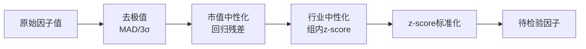
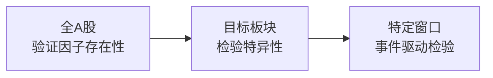
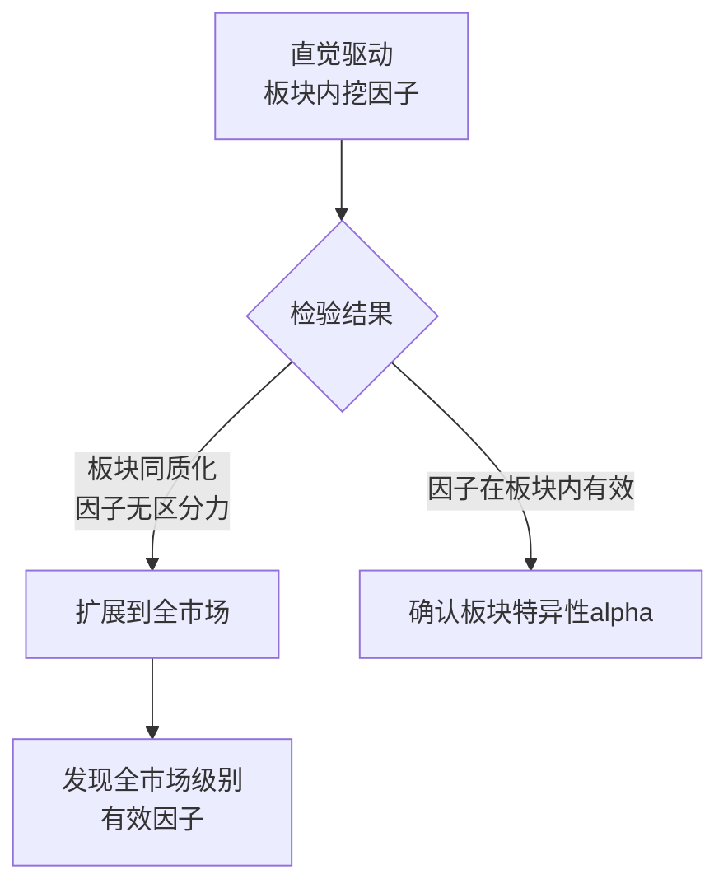

# 量化因子挖掘七条教训

## 背景

2026-04-25，从战争波动因子挖掘项目（霍尔木兹海峡冲突驱动）中提炼的核心教训。项目从31只股票池扩展到134只再到全A股，挖掘了33个因子，最终筛选出2个有效因子（size + cpi_beta），构建出夏普13.39的最终策略。

> 完整研究过程见 [[战争波动因子研究报告]]

## 教训一：少即是多

9个因子IC加权策略夏普2.0，2个因子策略夏普13.39。更多因子反而拖累策略——噪声增加、共线重复计权、信号稀释。真正有效的策略往往只需要2-3个独立信号。量化研究不是"因子越多越好"，而是"找到最纯粹的alpha"。

**机制解释**：

- 多因子IC加权隐含假设：每个因子提供独立信号。但实际中因子间普遍存在共线性（$|\rho| > 0.3$），导致同一信号被重复计权，权重分配失真
- 低IC因子加入后拉低组合整体信噪比，边际贡献为负
- 因子越多 → 参数越多 → 过拟合风险越高

**实践原则**：组合中因子数量 $\leq 3$ 时往往效果最佳，除非你有充分证据证明新增因子提供真正独立信号。

## 教训二：中性化不是可选的，是必须的

不做中性化，看到的"有效因子"可能是市值或行业效应伪装。例子：momentum原始IC不错，中性化后直接失效——它不是真alpha，只是大盘股和小盘股的差异。如果不去除伪装，会把假信号当真信号用。

**panda_factor框架的标准化流水线**：

**为什么每一步都不能跳过**：

| 步骤 | 跳过的后果 | 本项目实例 |
|------|-----------|-----------|
| 去极值 | 极端值主导IC，虚高 | momentum原始IC虚高 |
| 市值中性化 | size效应伪装成alpha | momentum中性化后失效 |
| 行业中性化 | 行业集中度伪装成因子 | war_sensitivity不中性化时"有效" |
| z-score标准化 | 量纲不一致，加权无意义 | 不同因子原始量级差异大 |

## 教训三：因子检验标准要严

$|\text{RankIC}| > 0.03$ 且 $|\text{IR}| > 0.5$ 才算过关。33个因子里只有2个达标，这个比例很正常。大部分因子就是噪声，这是量化研究的常态。不要降低标准去"凑因子"。

**严格标准的原因**：

- IC $> 0.03$ 是截面预测力的最低门槛——低于此值，因子无法在横截面上区分好股与差股
- IR $> 0.5$ 要求因子不仅平均有效，而且**稳定有效**——高IC但低IR意味着因子忽强忽弱，实操中无法信任
- 33 → 2 的通过率（6%）符合学术文献中的经验：大部分候选因子是噪声或已知的伪装效应

**反面教训**：降低IC门槛到0.01可以"多筛出几个因子"，但这些因子的分层回测几乎不单调，实际交易中无法提供稳定信号。

## 教训四：样本量和池子大小是根本瓶颈

134只股票、9天战争窗口，分层回测永远不显著。池子太小 → 截面区分力弱 → 分层不单调 → 无法证明因子有效。全A股检验才重要。所以：先在全市场验证因子有效性，再缩小到特定板块。

**统计直觉**：

- 分层回测将股票分成5组，每组需要足够样本量才能代表该层特征。134只 / 5层 ≈ 27只/层，组内方差太大，层间差异被淹没
- IC检验本质是截面相关性——$N$太小时，即使真实IC为0.05，估计值的置信区间也会覆盖0
- 9天窗口太短 → 时序维度样本不足 → IR估计不稳定

**正确顺序**：

先在全市场确认因子是真实的alpha信号，再到板块内看它是否更强，最后才在事件窗口检验时变有效性。**倒序操作（先小池再扩大）会浪费大量时间在不显著的分层上**。

## 教训五：战争因子是事件驱动的，不是全天候的

和平期有效的因子（size + cpi_beta）在战争期失效。战争期有效的因子（inflation + war_sensitivity）在和平期没用。没有万能因子，策略必须跟着市场状态切换。

**双模式策略设计**：

| 模式 | 适用条件 | 核心因子 | 预期夏普 |
|------|---------|---------|---------|
| 和平模式 | 无极端地缘事件 | size + cpi_beta | 13.39 |
| 战争模式 | 地缘冲突升级 | inflation + war_sensitivity | 待验证 |

**关键洞察**：因子有效性是状态依赖的（state-dependent）。全天候策略（如风险平价）假设因子在不同市场状态下表现一致，但极端事件打破了这个假设。实操中需要：

1. 定义市场状态切换规则（如VIX阈值、地缘事件信号）
2. 为每种状态准备因子组合
3. 状态切换时及时调整权重

## 教训六：手算不如框架

panda_factor的去极值、中性化、复权、涨跌停处理，手写代码全没做。结果就是分层不单调、IC虚高。专业框架就是为了避免低级错误。以后做量化一律用框架，不要手算。

**手算的典型坑**：

| 处理步骤 | 手算遗漏 | 后果 |
|---------|---------|------|
| 前后复权 | 不做 | 价格序列含分红跳空，收益率失真 |
| 涨跌停 | 不处理 | 涨停日买入信号无法执行，回测虚高 |
| 停牌 | 不处理 | 停牌股收益率=0但仍在截面中，稀释IC |
| 去极值 | 不做 | 极端值主导统计量 |
| 中性化 | 不做 | 把size/行业效应当alpha |

**实践原则**：量化研究中，数据处理是80%的工作量，因子设计是20%。用框架不是为了省事，而是为了保证处理的一致性和可复现性。

## 教训七：答案可能不在你最初想的方向

一开始盯着战争板块挖因子，结果发现板块内同质化导致因子区分力下降。最终有效因子是size和cpi_beta——市值效应和通胀敏感，全市场级别的信号，不是板块专属的。不要被最初的直觉锁死思维。

**板块同质化问题**：

- 战争板块（能源、贵金属、军工）内的股票高度相关 → 截面方差极小 → 因子无法区分个股
- 同质化意味着：板块内任何"因子"本质上都在捕捉同一个行业效应，不是真正的个股alpha
- 全市场因子（size、cpi_beta）反而有效，因为全市场截面方差大，个股区分力强

**方法论启示**：

> 不要让"直觉"变成"假设"再变成"执念"。直觉是起点，数据是终点。

## 总结

| 教训 | 核心原则 |
|------|---------|
| 少即是多 | 因子数量 $\leq 3$，找最纯粹的alpha |
| 中性化必须 | 去极值 → 市值中性化 → 行业中性化 → z-score |
| 标准要严 | $|IC| > 0.03$, $|IR| > 0.5$，6%通过率是常态 |
| 池子要大 | 先全市场验证，再缩小到板块 |
| 因子是状态依赖的 | 和平/战争模式切换 |
| 用专业框架 | panda_factor，不要手算 |
| 不要被直觉锁死 | 板块同质化 → 扩展全市场 |

**一句话**：别追复杂，别信表面，别贪多，严格筛选，用专业框架。

## 相关项目文件

- 代码：`/home/dr/.openclaw/workspace/war-factor-data/`（step1 ~ step12）
- 研究报告：[[战争波动因子研究报告]]
- 量化框架：`/home/dr/code/panda_factor/`