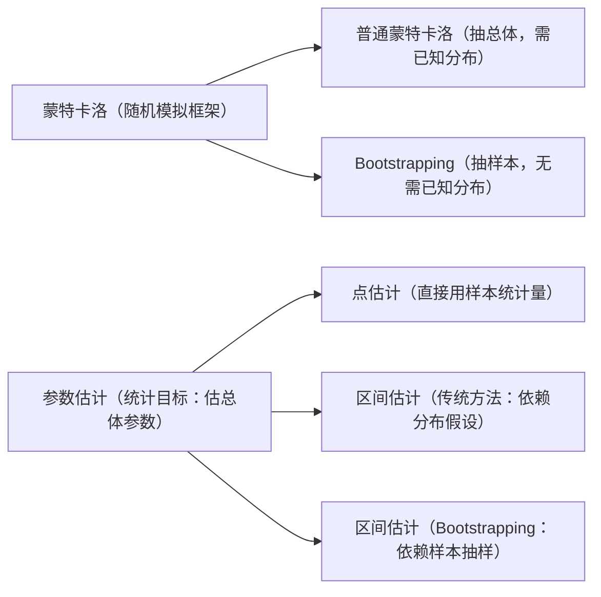

在**计算机科学**和**数学（含统计学）** 领域，“Bootstrapping”（常译为“自举”）是两个紧密关联但场景不同的核心技术，核心逻辑均为“用简单基础构建复杂系统，或用有限信息推断可靠结论”，具体如下：

### 一、计算机科学中的 Bootstrapping（自举技术）

核心是**“用极简工具逐步构建复杂系统”**，解决“如何从无到有开发复杂软件/硬件”的问题，最典型场景有两个：

### 1. 编译器自举（Compiler Bootstrapping）

这是计算机科学中“自举”最经典的应用，解决“用目标语言开发该语言编译器”的“循环问题”。

比如要开发 C 语言编译器，直接用 C 语言写是不可能的（因为没有能运行 C 代码的工具），因此需要“分步自举”：

- **第一步：手写“最小编译器”**
用底层语言（如机器码、汇编语言）写一个极简版 C 编译器——仅支持 C 语言的核心语法（如变量、简单函数、赋值语句），功能极有限，但能编译少量 C 代码。
- **第二步：用 C 语言扩展编译器**
用第一步支持的“核心 C 语法”，写一个功能更完善的 C 编译器（支持循环、数组、指针等更多特性），然后用第一步的“最小编译器”去编译这个新的 C 代码，得到“功能更强的编译器”。
- **第三步：迭代到成熟**
重复第二步：用更完善的 C 语法写更复杂的编译器，再用前一版编译器编译，逐步迭代出支持完整 C 语言标准（如 C99、C11）的成熟编译器。

最终实现“**用 C 语言写 C 编译器**”的闭环——相当于“用自己的早期版本，构建出更强大的自己”。

典型案例：早期 Unix 系统的 C 编译器、GCC 编译器的初始开发，均依赖此逻辑。

### 2. 系统引导（System Bootstrapping）

即我们常说的“电脑开机启动流程”，核心是“**用极简硬件程序唤醒复杂操作系统**”，解决“硬件如何加载软件”的问题：

电脑通电后，硬件本身没有“智能”，必须通过“自举程序”逐步启动：

- **第一步：执行 BIOS/UEFI（固件自举）**
电脑通电后，首先运行主板上的 **BIOS（基本输入输出系统）** 或 **UEFI（统一可扩展固件接口）**——这是固化在硬件中的极简程序（仅几 KB 到几十 KB），功能只有一个：检测内存、硬盘、CPU 等硬件是否正常，然后找到硬盘中“引导程序”的位置。
- **第二步：加载 Bootloader（引导程序）**
BIOS/UEFI 找到硬盘的“引导分区”后，加载其中的 **Bootloader（如 Windows 的 NTLDR、Linux 的 GRUB）**——这是比 BIOS 复杂的程序，负责解析硬盘分区、找到操作系统内核文件（如 Windows 的 `ntoskrnl.exe`、Linux 的 `vmlinuz`）。
- **第三步：启动操作系统内核**
Bootloader 将操作系统内核加载到内存中，内核再启动驱动、进程管理、文件系统等模块，最终完成整个系统的“自举启动”。

简单说：从“硬件自带的极简程序”开始，一步步“唤醒”更复杂的软件，直到完整系统运行。

### 二、数学（含统计学）中的 Bootstrapping（自助法）

核心是**“用样本自身模拟总体，推断统计量的可靠性”**，解决“样本量小、总体分布未知时，无法用传统统计方法估算误差”的问题，属于非参数统计方法。

### 1. 核心思想

传统统计（如计算均值的置信区间）需要假设总体服从某种分布（如正态分布），或依赖大样本数据；而自助法不做分布假设，直接用“现有样本”模拟“多个虚拟样本”，通过样本的“自我复制”推断总体特征。

### 2. 具体步骤（以“估算某群体平均身高”为例）

假设我们仅调研了 50 人（样本量小，未知总体分布），要估算这一群体平均身高的 95% 置信区间：

1. **生成自助样本**：从 50 人的原始样本中，**有放回地随机抽取 50 个数据**（即部分人会被重复抽取，部分人可能不被抽取），得到 1 个“自助样本”。
2. **计算统计量**：对这个自助样本，计算“平均身高”（目标统计量），记录结果。
3. **重复抽样**：重复步骤 1-2 数千次（通常 1000~10000 次），得到数千个“自助平均身高”。
4. **估算置信区间**：将这数千个“自助平均身高”排序，去掉最小的 2.5% 和最大的 2.5%（对应 95% 置信度），剩余范围就是“总体平均身高的 95% 置信区间”。

### 3. 应用场景

- 小样本数据：如医学研究中仅能获取几十例患者数据，无法用传统方法估算药效的可信范围；
- 非正态分布数据：如收入、用户活跃度等偏态数据，不满足传统统计的“正态分布假设”；
- 复杂统计量：如估算中位数、分位数、相关系数的误差，传统方法难以计算时，自助法更灵活。

### 总结：计算机科学 vs 数学中的 Bootstrapping 共性

两者均遵循“**从简单/有限的起点出发，不依赖外部复杂资源，通过“自我循环/复制”逐步构建复杂系统或推断可靠结论**”的逻辑——本质是“用自己的基础，解决自己的复杂问题”。

---

要判断“蒙特卡洛（Monte Carlo）”和“参数估计”是否属于“Bootstrapping（自举）”，需要先明确三者的核心定义、逻辑差异与关联——结论是：**三者均为统计学/计算科学中的重要方法，但蒙特卡洛是更通用的“随机模拟框架”，参数估计是“目标任务”，Bootstrapping是实现参数估计的“特定手段之一”，三者并非从属关系，而是“框架-任务-手段”的交叉关联关系**。

### 一、先理清三者的核心定义

在分析关联前，需先明确各自的本质，避免概念混淆：

| 概念 | 核心定位 | 核心逻辑 |
| --- | --- | --- |
| **蒙特卡洛（Monte Carlo）** | 通用随机模拟框架 | 通过“大量随机抽样”模拟复杂系统的概率分布，用“频率近似概率”解决难以解析计算的问题。 |
| **参数估计（Parameter Estimation）** | 统计目标任务 | 从样本数据中估算“总体分布的未知参数”（如正态分布的均值μ、方差σ²），核心是“由样推总”。 |
| **Bootstrapping（自举）** | 实现参数估计的特定方法 | 不假设总体分布，通过“对原始样本有放回抽样”生成大量“自助样本”，用自助样本的统计量推断总体参数。 |

### 二、关键判断：蒙特卡洛 ≠ Bootstrapping，但 Bootstrapping 属于蒙特卡洛的“特例”

蒙特卡洛是**更宽泛的随机模拟思想**——只要方法依赖“随机抽样”来近似概率/统计量，都可归为蒙特卡洛框架；而 Bootstrapping 是蒙特卡洛框架下，针对“样本有限、总体分布未知”场景的**具体抽样策略**。

### 1. 蒙特卡洛的通用性（以参数估计为例）

比如要估计正态总体的均值μ，若用蒙特卡洛思想，抽样策略可以是多样的：

- **策略1（传统蒙特卡洛）**：直接从“**假设的正态总体**”中随机抽取N个样本（前提是已知总体分布类型），计算样本均值，重复多次后用均值的分布估计μ的置信区间；
- **策略2（Bootstrapping）**：**若未知总体分布，不直接抽总体，而是从“原始样本”中有放回抽样生成自助样本，再计算均值**——这本质是“**用样本模拟总体**”的蒙特卡洛抽样，属于蒙特卡洛框架的一个具体实现。

### 2. Bootstrapping 与“普通蒙特卡洛”的核心差异

| 对比维度 | 普通蒙特卡洛（参数估计场景） | Bootstrapping（参数估计场景） |
| --- | --- | --- |
| 抽样来源 | 假设的“总体分布”（需已知分布类型） | 已有的“原始样本”（无需假设总体分布） |
| 适用场景 | 总体分布已知（如明确是正态、泊松分布） | 总体分布未知、样本量小 |
| 核心依赖 | 对总体分布的先验假设 | 原始样本的“代表性”（样本需能反映总体特征） |

### 三、关键判断：参数估计 ≠ Bootstrapping，Bootstrapping 是实现参数估计的“手段之一”

参数估计是“目标”（比如要算总体均值、方差、相关系数），而 Bootstrapping 是实现该目标的“工具”——类似“做饭（目标）”和“用烤箱（工具）”的关系，烤箱是做饭的手段之一，不是唯一手段。

### 1. 实现参数估计的常见手段（不止 Bootstrapping）

除了 Bootstrapping，参数估计还有多种经典方法，比如：

- **点估计**：直接用样本统计量作为总体参数的估计值（如用样本均值$\bar{x}$估计总体均值μ），但无法给出估计的“可靠性”（如误差范围）；
- **区间估计（传统方法）**：基于总体分布假设（如正态分布），用样本统计量计算置信区间（如通过t分布、z分布推导μ的95%置信区间）；
- **Bootstrapping 区间估计**：不假设总体分布，用自助样本的统计量分布计算置信区间——这是对“区间估计”的补充，尤其适用于传统方法不适用的场景（如非正态、小样本）。

### 2. 示例：用不同手段实现“参数估计”

假设要估计某班级学生（总体）的平均成绩（参数μ），仅收集到20个学生的成绩（样本）：

- **点估计**：直接算20个样本的平均成绩（如85分），说“总体平均成绩是85分”——但不知道这个估计的误差有多大；
- **传统区间估计**：若假设成绩服从正态分布，用t分布计算置信区间（如80~90分）；
- **Bootstrapping 区间估计**：若不确定成绩是否正态，从20个样本中“有放回抽20个”生成自助样本，算自助样本均值，重复1000次后，取排序后均值的2.5%~97.5%分位数（如79~91分），作为μ的置信区间。

### 四、总结：三者的关系图谱

简单说：

- **蒙特卡洛**是“大框架”，Bootstrapping 是该框架下的“一种抽样策略”；
- **参数估计**是“目标任务”，Bootstrapping 是完成该任务的“一种工具”；
- 三者既不互相从属，也不完全独立，而是在“用随机方法解决统计推断”的场景下交叉关联。
