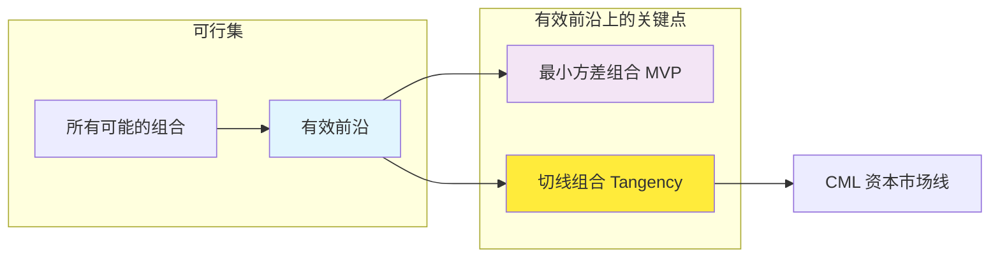
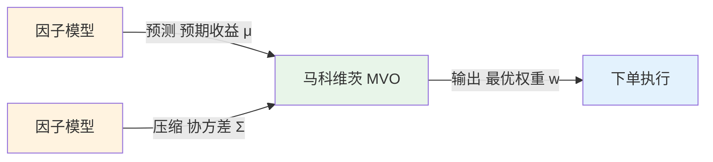

## 一句话总结

**马科维茨均值方差模型** 回答一个问题：给你一堆资产，怎么分配仓位，才能在**给定风险下收益最高，或给定收益下风险最低**。

核心洞察：**分散投资不只是"别把鸡蛋放一个篮子"，而是利用资产间的低相关性，在数学上消灭掉不必要的那部分风险。**

---

## 历史背景

- **1952 年**，哈里·马科维茨（Harry Markowitz）发表论文 *"Portfolio Selection"*，首次用数学语言描述投资组合优化
- **1990 年**，因此获得诺贝尔经济学奖
- 这篇文章只有 14 页（含 4 页参考文献），开创了整个现代金融的定量化时代

在 1952 年之前，投资建议基本是："挑好股票，分散一点"。马科维茨第一次告诉你：**分散多少、怎么分散，是可以精确计算的。**

---

## 核心公式

### 两个资产的情形

先从最简单的两个资产开始理解本质：

**组合收益：**

$$
R_p = w_1 R_1 + w_2 R_2
$$

简单的加权平均，线性叠加。

**组合方差（关键）：**

$$
\sigma_p^2 = w_1^2 \sigma_1^2 + w_2^2 \sigma_2^2 + 2 w_1 w_2 \rho_{12} \sigma_1 \sigma_2
$$

$$
= w_1^2 \sigma_1^2 + w_2^2 \sigma_2^2 + 2 w_1 w_2 \text{Cov}(R_1, R_2)
$$

**这一项 $2 w_1 w_2 \rho \sigma_1 \sigma_2$ 是整个模型的核心。**

- 如果 $\rho = 1$（完全正相关）→ 方差退化为 $\sigma_p = w_1\sigma_1 + w_2\sigma_2$，分散不降风险
- 如果 $\rho = -1$（完全负相关）→ 存在一个权重组合让 $\sigma_p = 0$，风险完全消除
- 现实中 $\rho$ 介于 (-1, 1)，分散化总能降风险，但降不到零

### 推广到 $n$ 个资产（矩阵形式）

$$
\begin{aligned}
\text{最小化} \quad & \frac{1}{2} \mathbf{w}^\top \Sigma \mathbf{w} \quad \text{（组合方差）} \\
\text{约束} \quad & \mathbf{w}^\top \mathbf{1} = 1 \quad \text{（权重和为1）} \\
& \mathbf{w}^\top \boldsymbol{\mu} = \mu_{\text{target}} \quad \text{（目标收益）}
\end{aligned}
$$

其中：
- $\mathbf{w} \in \mathbb{R}^{n}$：资产权重向量
- $\Sigma \in \mathbb{R}^{n\times n}$：协方差矩阵
- $\boldsymbol{\mu} \in \mathbb{R}^{n}$：预期收益向量

### 解析解（无约束）

拉格朗日乘子法求解，得到最优权重：

$$
\mathbf{w}^* = \frac{\Sigma^{-1} \mathbf{1}}{\mathbf{1}^\top \Sigma^{-1} \mathbf{1}} \quad \text{（最小方差组合）}
$$

加入目标收益约束后：

$$
\mathbf{w}^* = \Sigma^{-1} \begin{bmatrix} \boldsymbol{\mu} & \mathbf{1} \end{bmatrix} \begin{bmatrix} A & B \\ B & C \end{bmatrix}^{-1} \begin{bmatrix} \mu_{\text{target}} \\ 1 \end{bmatrix}
$$

其中 $A = \boldsymbol{\mu}^\top \Sigma^{-1} \boldsymbol{\mu}$, $B = \boldsymbol{\mu}^\top \Sigma^{-1} \mathbf{1}$, $C = \mathbf{1}^\top \Sigma^{-1} \mathbf{1}$。

**关键：最优权重依赖于 $\Sigma^{-1}$。** 而协方差矩阵对噪声极度敏感——这是模型在实操中最大的问题。

---

## 有效前沿（Efficient Frontier）



**有效前沿**：在每一个给定的风险水平下，收益最高的那组组合构成的曲线。

**最小方差组合（MVP）**：有效前沿左端，风险最低的组合。任何理性投资者不会持有比它风险更大的组合却获得比它更低的收益。

**切线组合（Tangency Portfolio）**：无风险资产 $R_f$ 出发与有效前沿的切线。加入无风险资产后，最优组合永远是 $R_f$ 与切线组合的某种配比。

---

## 资本市场线（CML）与分离定理

$$
R_p = R_f + \frac{R_T - R_f}{\sigma_T} \cdot \sigma_p
$$

**分离定理（Tobin's Separation Theorem）**：
- 第一步：找到切线组合 $T$（独立于个人偏好）
- 第二步：根据风险偏好，决定 $R_f$ 与 $T$ 的配比

> 激进投资者借钱加仓 $T$（$\text{杠杆} > 100\%$），保守投资者多配 $R_f$。

---

## 局限性（实操中的问题）

### 1. "垃圾进、垃圾出"——参数估计误差

最致命的问题。$\Sigma$ 和 $\boldsymbol{\mu}$ 是估计出来的，而 MVO 是一个 **误差最大化器**：

- 预期收益被高估的资产 → 获得过多权重
- 风险被低估的资产 → 获得过多权重
- 相关性被高估的资产对 → 分散化不足

> **Chopra & Ziemba (1993)**：预期收益的估计误差对组合的影响，是方差估计误差的 **~10 倍**。

### 2. 协方差矩阵退化

当 $n$ 很大时，$\Sigma$ 接近奇异，$\Sigma^{-1}$ 极不稳定。常见的补救：
- **Shrinkage**（Ledoit-Wolf）：向结构性先验"收缩"样本协方差
- **因子模型降维**：$\Sigma = B \Sigma_f B^\top + D$，用因子结构压缩协方差
- **正则化**：在优化目标中加惩罚项

### 3. 静态假设

模型假设 $\boldsymbol{\mu}$ 和 $\Sigma$ 不变。现实中它们随时间剧烈变化。扩展方案：滚动窗口估计、GARCH 时变波动率、贝叶斯动态更新。

### 4. 没有考虑交易成本和约束

实际投资有：整数手数、涨跌停、流动性约束、卖空限制、行业集中度限制。需要引入不等式约束，此时没有解析解，需要数值优化（如 `cvxpy`、`scipy.optimize`）。

---

## 与因子模型的关系：上下游

马科维茨的模型和因子模型**不是互相替代**，而是**上下游配合**：



具体来说：

| 步骤 | 用什么 | 产出 |
|:---|:---|:---|
| 预测每只股票的未来收益 | 多因子模型（IC加权/Ridge/LASSO） | $\hat{\mu}$ |
| 估计资产间协方差 | 因子协方差模型（$\Sigma = B\Sigma_f B^T + D$） | $\hat{\Sigma}$ |
| 优化仓位 | 马科维茨 MVO | $\mathbf{w}^*$ |
| 执行调仓 | 交易执行系统 | 订单 |

**因子模型回答"哪只股票会涨"，MVO 回答"涨的股票里，仓位怎么分配给不互相炸"。**

---

## Python 示例：两个资产的有效前沿

```python
import numpy as np
import matplotlib.pyplot as plt

# 两个资产的参数
mu = np.array([0.10, 0.15])      # 预期年化收益
sigma = np.array([0.20, 0.30])   # 年化波动率
rho = 0.2                         # 相关系数

cov = rho * sigma[0] * sigma[1]

# 遍历权重
ws = np.linspace(0, 1, 100)
port_ret = ws * mu[0] + (1 - ws) * mu[1]
port_vol = np.sqrt(
    ws**2 * sigma[0]**2 
    + (1 - ws)**2 * sigma[1]**2 
    + 2 * ws * (1 - ws) * cov
)

# 最小方差组合
w_mvp = (sigma[1]**2 - cov) / (sigma[0]**2 + sigma[1]**2 - 2 * cov)
mvp_ret = w_mvp * mu[0] + (1 - w_mvp) * mu[1]
mvp_vol = np.sqrt(
    w_mvp**2 * sigma[0]**2 
    + (1 - w_mvp)**2 * sigma[1]**2 
    + 2 * w_mvp * (1 - w_mvp) * cov
)

print(f"最小方差组合: w1={w_mvp:.2%}, "
      f"收益={mvp_ret:.2%}, 波动={mvp_vol:.2%}")
```

---

## 关键概念速查

| 概念 | 一句话 |
|:---|:---|
| 有效前沿 | 给定风险下收益最高的组合曲线 |
| 最小方差组合 (MVP) | 全局风险最低的组合 |
| 切线组合 | 夏普比率最高的风险资产组合 |
| CML | 加入无风险资产后的最优投资线 |
| 分离定理 | 风险资产选择和对风险资产配比是两个独立决策 |
| 协方差矩阵 | 模型的阿喀琉斯之踵——差一点输入放大十倍输出 |

---

## 相关笔记

- [[CAPM - Capital Asset Pricing Model]] — 用 MVO 推导出的第一个资产定价模型
- [[有效市场假说 - EMH 详解]] — EMH 下 MVO 的隐含假设
- [[回测四大技术笔记]] — 协方差矩阵的滚动估计与收缩
- [[卡尔曼滤波在量化中的应用]] — 动态权重 vs 静态 MVO
