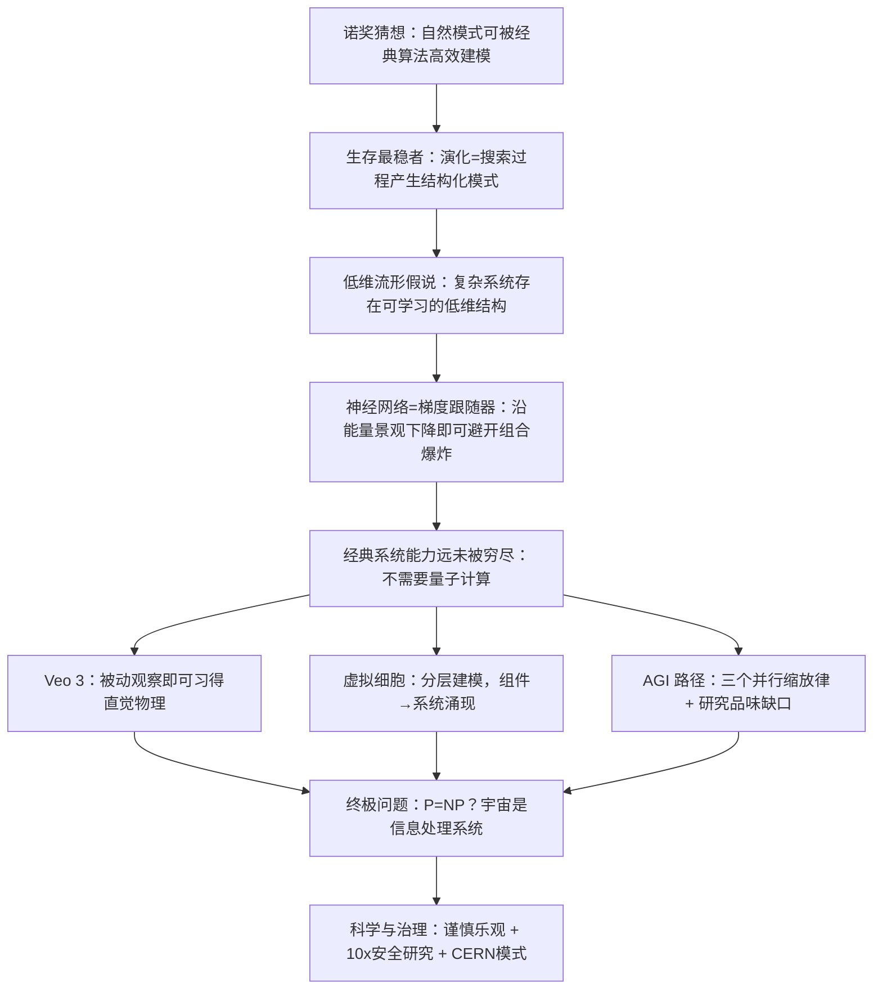
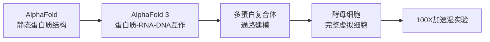

# Demis Hassabis 诺奖访谈：核心逻辑链与量化启示

> 访谈来源：Lex Fridman Podcast #468，Demis Hassabis 第二次受访（2025年）
> 地位：Google DeepMind CEO，2024年诺贝尔化学奖得主（AlphaFold），AlphaGo/AlphaZero/AlphaFold 系列缔造者

---

## 一、访谈逻辑链总览



---

## 二、核心论点与原文引用

### 2.1 诺奖猜想——Hassabis 猜想

> **"Any pattern that can be generated or found in nature can be efficiently discovered and modeled by a classical learning algorithm."**
> ——Demis Hassabis，2024年诺贝尔奖演讲

Hassabis 在诺贝尔奖演讲中有意提出一个挑衅性的猜想。其核心逻辑：

1. **自然系统 ≠ 随机系统**：自然中存在的模式（蛋白质结构、围棋最优解、地质形态、行星轨道）都经历了某种选择压力，因此具有**内在结构**
2. **结构 = 可学习性**：只要有结构，就存在一个可以被神经网络捕捉的流形（manifold），沿此流形搜索可使问题从指数复杂度降为多项式复杂度
3. **反例：大数分解**：如果问题空间是均匀随机的（如分解大质数），没有模式可学，则经典系统无能为力——这时可能需要量子计算机

> "So it may not be possible for manmade things or abstract things like factorizing large numbers, because unless there's patterns in the number space... if there's not and it's uniform, then there's no pattern to learn."

### 2.2 "生存最稳者"（Survival of the Stablest）

Hassabis 将达尔文演化论推广到所有自然系统：

- **生物演化**：4 billion years of selection → 蛋白质折叠模式
- **地质演化**：风化过程数千年 → 山脉形状的模式
- **宇宙演化**：轨道力学、小行星形状 → 稳定的天体结构

> "I sometimes call it survival of the stablest... the shape of mountains shaped by weathering processes over thousands of years... the orbits of planets, the shapes of asteroids — these have all survived kind of processes that have acted on them many, many times."

**关键推论**：如果一个系统经历了足够长的"选择"过程，它必然具有某种**低维结构**——这正是经典学习算法可以捕捉的东西。

### 2.3 神经网络 = 梯度跟随器（Gradient Follower）

AlphaGo 和 AlphaFold 成功的本质：

| | Go | 蛋白质折叠 |
|---|---|---|
| 搜索空间 | $10^{170}$ 可能位置 | $10^{300}$ 可能结构 |
| 宇宙原子数 | $\sim 10^{80}$ | $\sim 10^{80}$ |
| 暴力破解 | 不可行 | 不可行 |
| DeepMind做法 | 学习环境模型 → 引导搜索 | 学习能量景观 → 引导搜索 |

> "What neural networks are very good at is following gradients. And so if there's one to follow and you can specify the objective function correctly, you don't have to deal with all that complexity."

核心insight：**神经网络不必穷举所有可能性，只需学习到正确的梯度方向**。如果自然系统存在能量景观（energy landscape），NN就能沿此梯度下降，将指数级搜索变为多项式时间。

### 2.4 经典系统的能力远未被穷尽

> "I think we haven't really even sort of scratched the surface yet of what classical systems so-called could do."

Hassabis 认为：
- 10-20年前人们认为蛋白质折叠需要量子计算机
- 结果经典系统（神经网络在GPU/TPU上）就解决了
- **AGI 本身就是经典系统能力极限的终极表达**
- 他正在业余时间与同事研究：是否存在一个新的复杂度类——**可学习自然系统类（LNS, Learnable Natural Systems）**

### 2.5 Veo 3 的深层含义：被动观察足以建立世界模型

这是 Hassabis 本人最惊讶的发现：

> "If you were to ask me five, ten years ago... I would've said, well, yeah, you probably need to understand intuitive physics... there's a lot of theories in neuroscience, it's called action in perception where you need to act in the world to really, truly perceive it in a deep way. But it seems like you can understand it through passive observation, which is pretty surprising to me."

Veo 3 仅通过观看 YouTube 视频就学会了：
- 流体动力学（液体被挤压、飞溅的行为）
- 镜面光照（specular lighting）
- 材料物理（不同物质的碰撞行为）

> "Perhaps there is some kind of lower dimensional manifold that can be learned."

**推论**：如果被动视频观察就足以推断物理定律的低维表示，那么任何具有时序结构的数据——包括金融市场数据——都应该存在可学习的低维流形。

### 2.6 虚拟细胞——"拆解宏大梦想"的方法论

> "The trick is how do you break it down into manageable, achievable, interim steps that are meaningful and useful in their own right."

Hassabis 25年来一直在思考如何建模一个完整细胞。方法：



**层级建模原则**：
- 蛋白质层面建模，不需要下沉到原子/量子层面
- 不同时间尺度的过程用不同层级的模拟系统
- **每个中间步骤必须有独立价值**（不是只能等最终目标实现）

### 2.7 AGI 定义与时间线

> "My estimate is sort of 50% chance by in the next five years. So, by 2030 let's say."

Hassabis 的 AGI 标准（远高于主流说法）：
1. **认知功能全覆盖**：匹配人脑所有认知能力
2. **一致性（consistency）**：不能是"锯齿状智能"——某些领域超强、某些领域有明显缺陷
3. **真正的创造力**：提出新猜想（conjecture），而非仅解决已有问题
4. **测试方法**：数万项认知任务 + 数百位各领域顶级专家（Terence Tao 级别）数月的测试

> "The sort of lighthouse moments like the Move 37... inventing a new conjecture or a new hypothesis about physics like Einstein did."

**AGI 的灯塔时刻**：
- 提出如爱因斯坦相对论级别的新物理假说
- 发明如围棋般深度和美感的游戏
- 不是辅助人类做这些，而是**独立创造**

### 2.8 研究品味（Research Taste）——最难建模的能力

> "Picking the right question is the hardest part of science and making the right hypothesis. And that's what today's systems definitely they can't do."

> "It's harder to come up with a conjecture, a really good conjecture, than it is to solve it."

**品味** = 判断什么方向值得研究、什么实验值得做。

**假设空间对分原则**：
> "Splitting the hypothesis space into two... whether if it's true or not true, you've learned something really useful."

好的实验设计应该像一个二分搜索——无论结果如何，都能排除一半的可能性空间。

### 2.9 缩放律与突破的关系

> "I would say it's kind of 50/50 whether new things are needed or whether the scaling of the existing stuff is gonna be enough."

三条并行缩放线：
1. **Pre-training 缩放**：更多数据、更大模型
2. **Post-training 缩放**：RLHF、微调
3. **Inference-time 缩放**：thinking systems（推理时计算）

目前系统擅长**增量爬山（incremental hill climbing）**——在现有S曲线上爬坡，但不擅长**跳转到新S曲线**（大突破）。

> "We have a lot of systems that do the hill climbing of the S-curve that you're currently on."

### 2.10 风险观：P(doom) 与谨慎乐观

> "I don't have a p doom number. The reason I don't is because I think it would imply a level of precision that is not there."

> "It's definitely non-zero and it's probably non-negligible."

**两大风险类别**（不同时间尺度）：
| 风险类型 | 时间尺度 | 应对 |
|---------|---------|------|
| Bad actors 滥用 | 近期 | 限制访问 vs 开放科学的矛盾 |
| AGI 自主失控 | 远期 | 对齐研究、护栏、可控性 |

> "The best thing to do is to use the scientific method to do more research to try and more precisely define those risks and of course address them."

**治理愿景**：CERN 模式 > 曼哈顿计划模式——国际科学家合作完成最后步骤，而非军事竞赛。

### 2.11 信息本体论

> "Information is the most sort of fundamental unit of the universe, more fundamental than energy and matter. I think they can all be converted into each other, but I think of the universe as a kind of informational system."

如果宇宙本质上是信息处理系统：
- P=NP 是一个物理学问题，而非纯数学问题
- 构建 AGI 是理解宇宙信息处理本质的途径
- 可能所有自然现象都可以统一在信息处理的框架下

### 2.12 意识与经典计算

> "My betting is... it is just classical computing that's going on in the brain, which suggests that all the phenomena are modelable or mimicable by a classical computer."

Hassabis 对 Penrose 量子意识假说的回应：
- 神经科学尚未在脑中找到令人信服的量子力学机制
- 但"qualia"（感受质）的最终问题可能依赖于**基底**（碳基 vs 硅基）
- 脑机接口（如 Neuralink）可能让我们直接体验"在硅上计算是什么感觉"

---

## 三、数学/计算/科学方法框架

### 3.1 搜索复杂度框架

$$
\text{暴力搜索代价} = O(b^d) \quad \text{vs} \quad \text{引导搜索代价} = O(\text{poly}(d))
$$

其中 $b$ 为分支因子，$d$ 为深度。引导搜索的关键是学习一个**启发式模型** $h(s) \rightarrow \mathbb{R}$，将指数级搜索变为多项式时间。

### 3.2 流形学习假说

自然系统 $\mathcal{N}$ 的表观复杂度远高于其内在维度：

$$
\dim(\mathcal{M}_{\text{true}}) \ll \dim(\mathcal{X}_{\text{observed}})
$$

- 蛋白质：20种氨基酸组合 → 3D折叠空间 → 实际有效维度远低于表观维度
- Veo 3：像素空间 → 物理约束流形 → 流体、光照的低维表示
- **类比到金融**：数千只股票 × 数百个因子 → 实际定价核（pricing kernel）可能只有几个维度

### 3.3 能量景观与梯度下降

对于任何可微目标函数 $\mathcal{L}(\theta)$，如果其景观具有足够的结构（不是白噪声），则：

$$
\theta_{t+1} = \theta_t - \eta \nabla_\theta \mathcal{L}(\theta_t)
$$

可以从任意初始点收敛到有意义的局部最小值。

**关键条件**：目标函数必须正确指定（objective function specified correctly）。

### 3.4 假设空间对分（Binary Search in Hypothesis Space）

最优实验设计的本质：

$$
\text{InfoGain}(\text{exp}) = \max \left( -\log_2 |H_{\text{remaining}}| \right)
$$

每次实验将假设空间减半 → 对数级收敛到真相。

**在金融中**：每做一个因子测试，应该设计成无论结果如何（显著/不显著），都能排除一半关于市场结构的错误假设。

### 3.5 层级建模的粒度选择

$$
\text{Level chosen} = \arg\min_l \left\{ l \mid \text{Dynamics captured at } l, \text{ but granularity} \geq \text{minimum needed} \right\}
$$

对细胞建模选蛋白质层级（不选原子/量子层级）。
对金融市场建模选因子层级（不选逐笔成交层级）。

> "You got to make a decision when you're modeling any natural system, what is the cutoff level of the granularity that captures the dynamics you're interested in."

### 3.6 增量突破 vs 范式跳跃

当前NN擅长：$\text{Improve}(x) = x + \epsilon \cdot \nabla f(x)$ （局部梯度改进）

当前NN不擅长：$\text{Invent}(\text{domain}) \rightarrow \text{new paradigm}$ （新范式创造）

介于两者之间的可能是 **AlphaEvolve 式程序搜索**：在程序空间中通过演化+基础模型引导，可能产生涌现性新能力。

---

## 四、量化/金融映射——A股因子投资对应

### 4.1 核心映射表

| Hassabis 论点 | 量化对应 | A股796池具体应用 |
|:---|:---|:---|
| 自然系统有结构 → 可学习 | 市场微观结构 + 行为偏差 → 存在可建模的alpha模式 | 利用A股散户主导、反转效应强的结构特征 |
| 低维流形假说 | 有效因子维度远低于表观因子数量 | 796池数百个候选因子 → 实际有效维度可能 < 10 |
| 梯度跟随 → 避开组合爆炸 | 因子组合优化不必穷举 | AlphaEvolve式遗传规划 → 在因子程序空间中引导搜索 |
| 能量景观 = 目标函数 | IC/IR最大化即目标函数，需正确指定 | 注意夏普率陷阱；目标函数应结合最大回撤、换手率约束 |
| 被动观察足以建立世界模型 | 价格/成交量数据已包含足够的时序结构 | 不需要另类数据作为必要条件；OHLCV + 逐笔可能足够 |
| Veo 3 习得直觉物理 | 时序模型（Transformer/SSM）可习得"市场物理" | 用 decoder-only Transformer 预测收益率排序，而非精确值 |
| 虚拟细胞的分层构建 | 因子 → 因子组 → 风格 → 完整策略 | 先验证单因子稳定性，再组合，再添加择时/风控层 |
| 假设空间对分 | 每个因子测试应有二元分支意义 | 拒绝"数据挖掘式"多重测试；设计证伪性检验 |
| 每个中间步骤必须有独立价值 | 每个因子模块必须能独立贡献alpha | 避免"黑箱集成"幻觉——集成后IC提升但每个模块都不显著 |
| 生存最稳者 | 长期存活的因子 = 经历了市场选择压力 | A股注册制改革后的因子存活率 > 改革前的历史回测 |
| 经典系统能力远未被穷尽 | 简单模型+正确目标函数可能打败复杂模型 | LGB/Ridge + 正确IC目标 > 复杂DL + 错误目标 |
| 增量爬山 vs 范式跳跃 | 常规因子优化 vs 发现新因子类型 | 99%的工作是爬山（因子参数微调），1%的工作产生跳跃 |

### 4.2 Hassabis猜想在金融中的推论

**金融版Hassabis猜想**：
> 任何由市场参与者反复博弈产生的价格模式，都可以被经典学习算法高效发现和建模。

**成立条件**：
1. 市场存在演化压力（套利者消除错误定价）
2. 价格不是纯随机游走（存在可预测的结构）
3. 目标函数（alpha定义）可以被正确指定

**不成立的情况**：
1. 纯效率市场（无结构 = 无模式可学）
2. 高频世界（微观噪声 = 类似大数分解，无低维流形）
3. 数据已被过度挖掘（模式已因自我毁灭而消失）

### 4.3 三个层次的量化策略对应

```
L1: 因子层（= AlphaFold的静态蛋白质结构）
    - 单因子ICIR、分组收益单调性
    - 对应A股：估值、动量、质量、波动率等传统因子
    
L2: 互作层（= AlphaFold 3的蛋白-RNA-DNA互作）
    - 因子间交互、动态因子权重、行业/市值中性化
    - 对应A股：行业轮动 + 因子择时的联合建模
    
L3: 策略层（= 虚拟细胞的完整涌现）
    - 多策略组合、风险预算、资金分配
    - 对应A股：796池中300/500/1000的差异配置
```

### 4.4 "生存最稳者"与因子衰变

Hassabis 的"survival of the stablest"映射到因子投资：

- **因子存活时间** = 因子经历了多少轮市场选择压力的考验
- 短期有效的因子（1-3年）→ 可能是过拟合/运气
- 长期有效的因子（跨市场周期）→ 反映了真正的行为偏差或风险溢价
- A股特别适合检验：2007/2015/2024 三轮牛熊提供了丰富的选择压力样本

> **操作建议**：对796池，任何新因子至少需要在2018去杠杆、2020疫情、2024量化危机三个压力事件中不失效，才能纳入实盘。

### 4.5 合成数据与A股回测

Hassabis 提到"需要足够真实数据来创建数据生成器，之后可以生成正确的合成数据"：

- **A股应用**：用真实796池数据训练生成模型 → 生成符合A股统计特性的合成价格序列 → 在合成数据上做极端压力测试
- **避免的问题**：直接用历史回测 as 唯一检验（历史只有一条路径）
- **方法**：GAN/扩散模型生成价格路径 → 确保包括历史上未发生但可能的尾部场景

---

## 五、可操作方向——Claude Code 可实现的具体项目

### 5.1 短期（1-2周内可用 CC 实现）

#### 项目1：AlphaEvolve 风格的因子程序搜索
```
目标：在因子表达式的程序空间中，用演化+启发式搜索发现A股有效因子
方法：
  1. 定义因子程序语言（运算符：+, -, *, /, rank, ts_mean, ts_std, cross_sectional_zscore 等）
  2. 用遗传规划生成候选因子程序
  3. 模型（LGB）作为适应度评估器
  4. LLM（CC）作为变异/交叉建议引擎
输入：796池 OHLCV + 基础财务数据
输出：排名前10的新型因子程序及其ICIR
```

#### 项目2：假设空间对分的因子检验框架
```
目标：设计一个检验流程，确保每次因子测试都有二分排除意义
CC角色：
  1. 为每个候选因子自动生成对立假设（null hypothesis的精确陈述）
  2. 设计证伪检验（哪些条件下因子必须失效才能被否定）
  3. 生成"实验设计备忘录"：无论结果如何，我们能学到什么？
```

#### 项目3：低维因子流形提取
```
目标：验证Hassabis的低维流形假说在A股的适用性
方法：
  1. 对796池的100+候选因子做PCA/t-SNE/UMAP
  2. 使用CC分析每个主成分的经济含义
  3. 评估：需要多少个主成分才能解释90%的因子方差？
  4. 如果有效维度 << 表观维度 → 过度因子挖掘的实证证据
```

### 5.2 中期（1-3个月策略研究）

#### 项目4：Veo风格的"市场物理"时序模型
```
目标：训练一个预测A股截面收益率排序的时序模型
架构：Decoder-only Transformer（类似LLM但预测收益率而非token）
输入序列：[日期t, 股票i, 因子向量f_i(t)] → 输出：未来收益率排名
关键设计原则（来自Veo启示）：
  - 不需要预测精确收益率（精确值不可预测）
  - 只需学习正确的排序（相对优劣）
  - 被动观察（只用历史数据，不依赖另类数据）
```

#### 项目5：生存最稳者——因子选择压力测试平台
```
目标：系统化评估因子在不同市场体制下的存活能力
CC角色：
  1. 自动识别A股历史中的体制切换点（用CC分析市场结构断点）
  2. 对每个候选因子生成跨体制的存活报告
  3. 使用"自然选择"逻辑：只保留在所有体制下一致的因子
  4. 输出：每个因子的"半衰期"估计
```

### 5.3 长期基础设施

#### 项目6：因子-策略分层建模框架（虚拟细胞类比）
```
L1 层：因子库（蛋白质静态结构）
  - 标准化因子计算pipeline
  - 每月自动更新

L2 层：因子互作（蛋白-蛋白互作）
  - 动态因子权重（IC衰减加权）
  - 行业中性化 + 市值中性化

L3 层：策略涌现（完整细胞）
  - 多策略组合优化
  - 风险预算分配
  - 换手率约束下的最优执行
```

---

## 六、关键方法论总结

### 6.1 Hassabis 科学方法论10条

1. **结构假定**：自然系统有结构，不是白噪声 → 找到结构即可建模
2. **流形搜索**：不穷举，学习低维表示 + 沿梯度搜索
3. **目标函数优先**：正确的目标函数 > 复杂的模型架构
4. **分层构建**：宏大目标 → 有独立价值的中间步骤 → 渐进逼近
5. **假设对分**：每次实验排除一半可能性 → 对数时间收敛
6. **经典系统不设限**：不要预设什么需要量子计算
7. **多缩放律并行**：不赌单一缩放路径（pre/post/inference同时推进）
8. **研究品味不可替代**：当前AI最缺的是"选对问题"的能力
9. **sweet spot** = 难到有用但可被现有工具解决的问题
10. **CERN > Manhattan**：合作式治理优于军事竞赛式

### 6.2 量化策略设计的直接推论

1. **不要过度复杂化模型** — 如果目标函数正确，简单模型就够
2. **因子维度灾难是假象** — 有效维度远低于表观维度
3. **每个模块必须独立可证伪** — 不能依赖黑箱集成
4. **生存检验 > 回测夏普** — 跨体制存活能力是真正的质量指标
5. **被动数据足够** — OHLCV + 基础财务可能已包含足够结构
6. **正确的问题形式**：排序 > 精确值，截面 > 时序，可解释 > 黑箱

---

## 七、Hassabis 原文金句摘录

> "What neural networks are very good at is following gradients."

> "We haven't really even sort of scratched the surface yet of what classical systems so-called could do."

> "It's harder to come up with a conjecture, a really good conjecture, than it is to solve it."

> "Picking the right question is the hardest part of science."

> "In true blue sky research, there's no such thing as failure really as long as you are picking experiments and hypotheses that meaningfully split the hypothesis space."

> "Information is the most sort of fundamental unit of the universe, more fundamental than energy and matter."

> "Survival of the stablest."

> "The trick is how do you break it down into manageable, achievable, interim steps that are meaningful and useful in their own right."

> "I think it's gonna be 10 times the impact the industrial revolution had but 10 times faster as well."

> "The best thing to do is to use the scientific method to do more research to try and more precisely define those risks and of course address them."

> "What I cannot create, I do not understand." — Richard Feynman（Hassabis 引述）

---

## 八、延伸阅读与交叉引用

- [[因子词典]] — 对照检验哪些A股因子符合"自然选择存活"标准
- [[卡尔曼滤波在量化中的应用]] — 状态空间模型 = 时序低维流形学习
- [[量化交易终极框架-尾部风险与生存系统]] — 压力测试 + 跨体制存活
- [[量化因子挖掘七条教训]] — 与 Hassabis 方法论的对勘
- [[有效市场假说 - EMH 详解]] — Hassabis 猜想在效率市场边界上的适用条件
