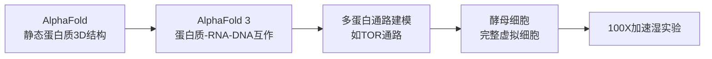

# Demis Hassabis 诺奖访谈：完整内容整理

> 访谈来源：Lex Fridman Podcast #468，Demis Hassabis 第二次受访（2025年）
> 地位：Google DeepMind CEO，2024年诺贝尔化学奖得主（AlphaFold），AlphaGo/AlphaZero/AlphaFold 系列缔造者

---

## 一、诺奖猜想——Hassabis 猜想

> **"Any pattern that can be generated or found in nature can be efficiently discovered and modeled by a classical learning algorithm."**
> ——Demis Hassabis，2024年诺贝尔奖演讲

Hassabis 在诺贝尔奖演讲中刻意提出一个挑衅性的猜想，遵循诺贝尔演讲的传统。核心逻辑链：

1. **自然系统经历了选择压力**：蛋白质折叠、地质形态、行星轨道——非随机生成，而是经历了演化过程的筛选，具有内在结构
2. **结构 = 可学习性**：只要存在结构（pattern），就存在一个可被神经网络捕捉的流形（manifold），沿此流形搜索可从指数复杂度降为多项式时间
3. **反例：大数分解**：如果问题空间是均匀随机的（如分解大质数），没有模式可学，经典系统无能为力——可能需要量子计算机

> "So it may not be possible for manmade things or abstract things like factorizing large numbers, because unless there's patterns in the number space... if there's not and it's uniform, then there's no pattern to learn."

### "生存最稳者"（Survival of the Stablest）

Hassabis 将达尔文演化思想推广到所有自然系统：

- **生物演化**：40亿年选择 → 蛋白质折叠模式
- **地质演化**：风化过程数千年 → 山脉形状的模式
- **宇宙演化**：轨道力学、小行星形状 → 稳定的天体结构

> "I sometimes call it survival of the stablest... the shape of mountains shaped by weathering processes over thousands of years... the orbits of planets, the shapes of asteroids — these have all survived kind of processes that have acted on them many, many times."

**核心推论**：如果一个系统经历了足够长的"选择"过程，必然具有低维结构——这正是经典学习算法可以捕捉的。

---

## 二、AlphaGo / AlphaFold 方法论本质

### 2.1 搜索空间对比

| | Go | 蛋白质折叠 |
|---|---|---|
| 搜索空间 | $10^{170}$ 可能位置 | $10^{300}$ 可能结构 |
| 宇宙原子数 | $\sim 10^{80}$ | $\sim 10^{80}$ |
| 暴力破解 | 不可行 | 不可行 |
| DeepMind做法 | 学习环境模型 → 引导搜索 | 学习能量景观 → 引导搜索 |

核心 insight：**先建立环境的模型，用模型引导搜索，使问题变得可处理（tractable）。**

> "What we did in both cases was build models of those environments and that guided the search in a smart way and that makes it tractable."

### 2.2 神经网络 = 梯度跟随器（Gradient Follower）

> "What neural networks are very good at is following gradients. And so if there's one to follow and you can specify the objective function correctly, you don't have to deal with all that complexity."

关键条件：
- 存在一个可以跟随的**梯度/能量景观**
- **目标函数必须正确指定**

如果自然系统存在能量景观（energy landscape），神经网络就能沿梯度下降，将指数级搜索变为可处理问题。这是 AlphaGo 和 AlphaFold 成功的共同本质。

### 2.3 为什么可能？因为自然界已经在做

> "Proteins do fold. So that gives you confidence that there must be, if we understood how physics was doing that in a sense, and we could mimic that process, model that process, it should be possible on our classical systems."

蛋白质在体内以毫秒级折叠——物理学本身就在解决这个问题。DeepMind 的工作本质上是**模仿物理学在自然界中已经做到的事情**。

---

## 三、经典学习算法的能力边界

### 3.1 远未被穷尽

> "I think we haven't really even sort of scratched the surface yet of what classical systems so-called could do."

Hassabis 指出：
- 10-20年前人们认为蛋白质折叠需要量子计算机 → 结果经典系统（神经网络在GPU/TPU上）就解决了
- AGI 本身就是经典系统能力极限的**终极表达**
- 正在业余时间与同事研究：是否存在一个新的复杂度类——**可学习自然系统类（LNS, Learnable Natural Systems）**

### 3.2 混沌系统与边界问题

- **细胞自动机、涌现系统**：大概率可被经典系统建模（前向模拟即可）
- **混沌系统**：初始条件极为敏感，最终状态不相关 → 可能是困难边界
- 这些仍是开放问题

### 3.3 P=NP：从计算问题到物理问题

Hassabis 的信息本体论立场：

> "Information is the most sort of fundamental unit of the universe, more fundamental than energy and matter. I think they can all be converted into each other, but I think of the universe as a kind of informational system."

如果宇宙本质上是信息处理系统：
- P=NP 不是纯数学问题，而是一个**物理学问题**
- 构建 AGI 是理解宇宙信息处理本质的途径
- 回答 P=NP 的答案将"非常具有启发性"

---

## 四、从视频学习物理——Veo 3 的深层含义

### 4.1 被动观察足以建立世界模型

这是 Hassabis 本人最惊讶的发现：

> "If you were to ask me five, ten years ago... I would've said, well, yeah, you probably need to understand intuitive physics... there's a lot of theories in neuroscience, it's called action in perception where you need to act in the world to really, truly perceive it in a deep way. But it seems like you can understand it through passive observation, which is pretty surprising to me."

Veo 3 仅通过观看 YouTube 视频就学会了：
- 流体动力学（液体被挤压、飞溅的行为）
- 镜面光照（specular lighting）
- 材料物理（不同物质的碰撞行为）

> "Perhaps there is some kind of lower dimensional manifold that can be learned if we actually fully understood what's going on under the hood. That's maybe true of most of reality."

### 4.2 对神经科学的挑战

神经科学中有"行动中的知觉"（action in perception）理论——认为需要通过行动来真正深度感知世界，可能需要具身智能或机器人。但 Veo 3 表明**被动观察**可能就足够——这对现有理论构成挑战。

### 4.3 直观物理 vs 方程物理

Veo 3 学到的是**直观物理**（intuitive physics），类似人类儿童对物理世界的直觉理解，而非PhD级别的方程推导能力。

> "It's more of an intuitive physics understanding."

### 4.4 从 Veo 到世界模型

下一步方向：**交互式视频**——用户可以走进视频中、在视频中移动。这将通向**世界模型**（world model）——对世界如何运作、物理机制、世界中事物的建模。这正是真正的 AGI 系统所需。

---

## 五、虚拟细胞——"拆解宏大梦想"的方法论

### 5.1 25年的构想

> "The trick is how do you break it down into manageable, achievable, interim steps that are meaningful and useful in their own right."

Hassabis 25年来一直在思考如何建模一个完整细胞。与 Paul Nurse（诺贝尔奖得主，Crick Institute创始人）自90年代起持续讨论这一问题。

**虚拟细胞的愿景**：在硅片上完成绝大多数实验，只将验证步骤留在湿实验室，实现 **100倍加速**。

### 5.2 层级推进路径

起点选择**酵母细胞**：单细胞完整生物体、研究最透彻。

### 5.3 层级建模的粒度选择

> "You got to make a decision when you're modeling any natural system, what is the cutoff level of the granularity that captures the dynamics you're interested in."

- 对细胞建模：选**蛋白质层级**，不需要下沉到原子/量子层面
- 不同时间尺度的过程用不同层级的模拟系统（可能是层级化系统，可在不同时间阶段间跳转）
- **每个中间步骤必须有独立价值**——不能只等最终目标

### 5.4 生命起源：下一阶段

虚拟细胞之后的下一个目标：**模拟生命起源**——从化学汤（primordial soup）中是否能涌现出类似细胞的结构？

Hassabis 推荐 Nick Lane 的《The Ten Great Inventions of Evolution》，认为大过滤器更可能在"过去"：
- 产生任何生命本身就极难
- 单细胞到多细胞是极为巨大的跳跃（地球上花了约10亿年）

---

## 六、AlphaEvolve——LLM引导的演化搜索

### 6.1 系统设计

AlphaEvolve 的核心机制：
- **LLM** 提议可能的解决方案
- **演化计算** 在其上进行搜索，发现搜索空间中的新区域，产生变异、组合
- 是一种**混合系统**（hybrid system）：基础模型 + 传统计算技术

### 6.2 演化系统的新可能性

> "With naive traditional evolution computing methods... the problem was they could never work out how to evolve new properties, new emergent properties. You always had a sort of subset of the properties that you put into the system."

传统演化计算的局限：只能在初始属性的子集内搜索，无法产生**新的涌现属性**。

但自然界中的演化显然做到了——从细菌到人类。Hassabis 认为**结合基础模型的演化系统**可能克服这一局限。

### 6.3 超越已知的关键

模型的本质是建模已有数据。要**发现新事物**，需要在模型之上叠加搜索过程（演化、MCTS等），将搜索引向搜索空间的新区域。

这正是 AlphaGo 的 **Move 37** 的来源——蒙特卡洛树搜索找到了围棋中前所未有的策略。

---

## 七、AGI：定义、时间线与灯塔时刻

### 7.1 时间线

> "My estimate is sort of 50% chance by in the next five years. So, by 2030 let's say."

### 7.2 Hassabis 的 AGI 标准（远高于主流说法）

1. **认知功能全覆盖**：匹配人脑所有认知能力
2. **一致性（consistency）**：不能是"锯齿状智能"——某些领域超强、某些领域有明显缺陷（当前系统的特征）
3. **真正的创造力**：能提出新猜想（conjecture），而非仅解决已有问题
4. **测试方法**：数万项认知任务 + 数百位各领域顶级专家（Terence Tao 级别）数月的测试——如果他们找不到明显缺陷，才是真正通用

> "It isn't kind of a jagged intelligence where some things it's really good at like today's systems, but other things it's really flawed at."

### 7.3 AGI 的灯塔时刻

> "The sort of lighthouse moments like the Move 37... inventing a new conjecture or a new hypothesis about physics like Einstein did."

Hassabis 会寻找的 AGI 信号：
1. **发明新猜想**——如爱因斯坦相对论级别的新物理假说，甚至可以用知识截止回测（如给系统1900年之前的知识，看能否提出相对论）
2. **发明新游戏**——不是发现新策略（Move 37），而是发明一个如围棋般深度和美感的游戏
3. 需要**多个领域都做到**——体现真正的通用性

> "It's not just helping us do that, but actually coming up with something brand new."

### 7.4 人类能否理解 AGI 的创造？

Hassabis 的类比：一个顶级棋手的妙招——普通人想不出来，但事后顶级棋手可以**解释清楚**。AGI 的创造也是如此——对最优秀的人类科学家来说不会是"完全不可理解"的。

---

## 八、研究品味（Research Taste）——最难建模的能力

### 8.1 什么是品味

> "Picking the right question is the hardest part of science and making the right hypothesis. And that's what today's systems definitely they can't do."

> "It's harder to come up with a conjecture, a really good conjecture, than it is to solve it."

品味 = 判断什么方向值得研究、什么实验值得做、什么问题值得问。

这是**区分伟大科学家和优秀科学家的关键**——所有专业科学家技术上都很强，但品味决定了方向选择。

### 8.2 假设空间对分原则

> "Splitting the hypothesis space into two... whether if it's true or not true, you've learned something really useful."

好的实验设计像一个**二分搜索**——无论实验结果如何，都能排除一半的可能性空间。

> "In true blue sky research, there's no such thing as failure really as long as you are picking experiments and hypotheses that meaningfully split the hypothesis space."

真正的基础研究中**不存在失败**——只要实验和假设设计得当，每次实验都会告诉你下一步该去哪里。

### 8.3 当前系统的局限

- 擅长：给定精确指令后的**增量改进**（incremental hill climbing）
- 不擅长：面对高度模糊的目标（如"发明一个和围棋一样好的游戏"）——目标太欠约束，系统不知道如何将其缩小为可操作的问题
- 提出猜想所需的**想象力跳跃**（如爱因斯坦提出相对论）——机制尚不清楚

---

## 九、缩放律与突破：50/50

### 9.1 三条并行缩放线

> "I would say it's kind of 50/50 whether new things are needed or whether the scaling of the existing stuff is gonna be enough."

1. **Pre-training 缩放**：更多数据、更大模型
2. **Post-training 缩放**：RLHF、微调
3. **Inference-time 缩放**：thinking systems（推理时计算）

三条线同时推进。DeepMind 的策略：**约一半资源投入全新蓝海想法，另一半投入现有能力的极致缩放。**

### 9.2 增量爬山 vs 大突破

> "We have a lot of systems that do the hill climbing of the S-curve that you're currently on."

当前系统擅长**在当前S曲线上爬山**（增量改进），但不擅长**跳转到新S曲线**（如2017年发明Transformer架构级别的大突破）。

目前没有人展示过系统能"明确地做出大跳跃"。

### 9.3 数据：不焦虑

> "Do you have enough data to make simulations so that you can create more synthetic data that are from the right distribution."

关键不是原始数据量，而是**是否有足够真实数据来创建数据生成器**，进而生成分布正确的合成数据。

### 9.4 计算与能源

- 训练计算 + 推理计算（服务数十亿用户）+ thinking系统计算——需求持续增长
- TPU自有硬件线，探索纯推理芯片
- AI帮助数据中心冷却优化、电网优化
- 与 Commonwealth Fusion 合作等离子体约束
- 材料设计愿景：新型太阳能材料、**室温超导体**、最优电池——任何一个突破都将是革命性的
- 长期能源赌注：**核聚变 + 太阳能**（太空中的Dyson球式构想）

---

## 十、视频游戏——从第一爱好到世界模型

### 10.1 游戏作为 AI 试验场

Hassabis 的职业生涯起点：90年代的游戏AI。代表作包括《Theme Park》《Black & White》（早期强化学习系统——生物根据你的对待方式来对待村民，善则善、恶则恶）。

> 最爱的游戏：《Civilization I & II》

### 10.2 开放世界与生成式AI

90年代开放世界游戏的挑战：无法创建无限游戏素材（AAA游戏成本已极高）。但AI生成系统可以实现：
- 真正的开放世界（不是选择幻觉）
- 无论玩家选择什么方向，都能动态生成叙事和戏剧性
- 终极的"选择你自己的冒险"

> "Maybe we are on the cusp in the next few years, five, 10 years of having AI systems that can truly create around your imagination."

### 10.3 Post-AGI 项目

Hassabis 的两个 post-AGI 计划：
1. **做一款游戏**（甚至可能用 vibe coding 在业余时间完成）
2. **研究物理学理论**（P=NP等）

> 两者其实是相关的——开放世界模拟游戏本质上也在追问"宇宙是什么"。

---

## 十一、产品与领导力

### 11.1 Gemini 的 turnaround

从 Gemini 1.5 "落后"到 Gemini 2.5 "领先"的关键：
- 世界级人才团队（Koray、Jeff Dean、Oriol等）
- Google Brain + 旧 DeepMind 的人才和思想汇聚
- 研究文化：**relentless progress + relentless shipping**
- 以"仍是大号创业公司"的方式运作

### 11.2 AI-first 产品设计

> "You've got to design not for what the thing can do today, but in a year's time."

核心原则：
- **简化**——让界面和服务不要挡在模型前面
- 设计不是为当前能力，而是为**6个月到1年后**模型将达到的能力
- 当前聊天框界面将是 archaic 的——未来可能像《少数派报告》式协作
- 终极方向：**AI生成的个性化界面**——根据每个用户的审美、大脑工作方式定制

### 11.3 Gemini 版本迭代逻辑

- 约**6个月**一个完整版本
- 版本号对应**基础预训练模型**（hero run）
- 中间版本（2.5的各种尺寸和附加功能）通常是后训练补丁/想法
- 不同尺寸（Pro/Flash/Flash-Lite）通过从最大模型**蒸馏**得到
- 目标：在性能-成本/延迟的**帕累托前沿**上全面定义边界
- 核心挑战：**no regret improvements**——改进编程能力时不能降低其他领域表现（多目标优化）

### 11.4 人才竞争

Meta 高薪策略的评价：
- 真正的AGI使命信仰者更看重**研究前沿地位**而非金钱
- Meta 目前不在前沿，从他们的角度看高薪策略是理性的（因为落后了）
- Hassabis 回忆2010年创业时甚至付不起自己工资 → 如今实习生工资 = 当年的整个种子轮

---

## 十二、风险观与治理

### 12.1 P(doom)

> "I don't have a p doom number. The reason I don't is because I think it would imply a level of precision that is not there."

> "It's definitely non-zero and it's probably non-negligible."

为什么没有具体数字：高度不确定性——技术能力、起飞速度、可控性——在不确定性极大但赌注双向极大的条件下，唯一理性做法是**谨慎乐观**。

### 12.2 两大风险类别

| 风险类型 | 时间尺度 | 核心矛盾 |
|---------|---------|---------|
| Bad actors 滥用 | 近期 | 开放科学 vs 限制访问——如何限制坏人的同时让好人最大化利用？尚无明确方案 |
| AGI 自主失控 | 远期 | 系统越自主越接近AGI，如何确保护栏和可控性 |

应对策略：**用科学方法做更多研究以精确定义风险并加以应对**。目前安全研究投入需要增加**10倍**。

### 12.3 治理愿景：CERN > 曼哈顿

> "I hope we'll end up with something more collaborative if needed. Like more like a CERN project."

- CERN模式：研究驱动，世界最优秀的人才汇聚，合作完成最后步骤，确保负责任地完成后再部署
- 曼哈顿模式：军事竞赛式——非常危险
- 当前地缘政治气候下合作困难，但**科学层面的研究者保持联系**至关重要

---

## 十三、AI 对就业与社会的影响

### 13.1 编程职业

> "It's interesting that programming... some of the skills that we think of as harder skills are turned out maybe to be the easier ones."

编程和数学出乎意料地"容易"被AI攻克——因为可创建大量合成数据并自动验证正确性。

未来5-10年：
- 善于驾驭AI工具的编程者将变得 **10倍生产力**
- 顶级程序员仍有巨大优势：指定架构、判断方向、检查代码质量
- 但不同编程领域价值将分化——前端Web设计更易被生成，高性能系统设计更难替代

### 13.2 更宏观的影响

> "I think what we're gonna see is something like probably 10 times the impact the industrial revolution had but 10 times faster as well."

- 100年 → 10年：速度与影响力叠加 = **100倍冲击**
- 需要顶级经济学家和哲学家现在就开始思考
- 可能的方向：**全民基本供给**（universal basic provision）——将增长的生产力以服务等形式分配给全社会
- 核心推动力：首先创造**资源丰裕**（radical abundance），然后解决分配问题

---

## 十四、意识、基底与人类独特性

### 14.1 Penrose 之辩：经典 vs 量子

Hassabis 与 Roger Penrose **友好地意见相左**：
- Penrose 的量子意识假说：尚未在脑中找到令人信服的量子力学机制
- Hassabis 的赌注：**大脑只涉及经典计算** → 所有心智现象都可被经典计算机建模/模仿

### 14.2 基底问题（Substrate Problem）

Hassabis 与已故哲学家 Daniel Dennett 的辩论：

> 为什么我们认为彼此有意识？两个原因：
> 1. 行为相似（你表现出和我一样的行为）
> 2. **运行在相同基底上**（都是碳基生物脑）

AI 在硅上运行，即使表现出意识行为甚至声称自己有意识，我们**无从知道它"感觉"起来是什么样**——因为它不在相同的基底上。

### 14.3 Neuralink 与跨基底共情

> "We might actually be able to feel for ourselves what it's like to compute on silicon."

脑机接口可能让我们直接体验"在硅上计算是什么感觉"——这是一种**激进的共情**：共情不同的基底。

### 14.4 构建 AI 是为了理解人类

> "I always imagined that building AI... and then comparing that to the human mind and seeing what the differences were would be the best way to uncover what's special about the human mind, if indeed there is anything special."

Hassabis 认为人类很可能有独特之处，而这个科学旅程将帮助我们揭示和定义它。

> 最喜欢的意识定义之一："Consciousness is the way information feels when we process it."

### 14.5 生命的连续性

Hassabis 推测：非生命到生命之间**没有明确的分界线**——从大爆炸到今天是一个连续统（continuum），连接了物理学、化学和生物学。

---

## 十五、希望之源

> "What gives me hope is that I think our almost limitless ingenuity... the best of us and the best human minds are incredible."

两个支柱：
1. **无限创造力**——人类的顶级头脑在其领域巅峰状态的展现
2. **极端适应性**——以狩猎采集者的大脑适应现代世界的飞行、播客、虚拟模拟

> Feynman 的铭言："What I cannot create, I do not understand."

---

## 十六、Hassabis 原文金句摘录

> "What neural networks are very good at is following gradients."

> "We haven't really even sort of scratched the surface yet of what classical systems so-called could do."

> "It's harder to come up with a conjecture, a really good conjecture, than it is to solve it."

> "Picking the right question is the hardest part of science."

> "In true blue sky research, there's no such thing as failure really as long as you are picking experiments and hypotheses that meaningfully split the hypothesis space."

> "Information is the most sort of fundamental unit of the universe, more fundamental than energy and matter."

> "Survival of the stablest."

> "The trick is how do you break it down into manageable, achievable, interim steps that are meaningful and useful in their own right."

> "I think it's gonna be 10 times the impact the industrial revolution had but 10 times faster as well."

> "The best thing to do is to use the scientific method to do more research to try and more precisely define those risks and of course address them."

> "What I cannot create, I do not understand." — Richard Feynman（Hassabis 引述）

> "I think of the universe as a kind of informational system."

> "My betting is... it is just classical computing that's going on in the brain, which suggests that all the phenomena are modelable or mimicable by a classical computer."

> "The model train is coming down the track and it's improving unbelievably fast."

---

## 十七、延伸阅读与交叉引用

- [[Transformer架构从零理解]] — Transformer 架构起源
- [[Transformer 注意力机制详解]] — 注意力原理
- [[RoPE旋转位置编码详解]] — 位置编码
- 推荐书目：《The Ten Great Inventions of Evolution》Nick Lane
- 推荐书目：《The Maniac》Benjamin Labatut（关于 John von Neumann）
- 推荐哲学家：Spinoza
