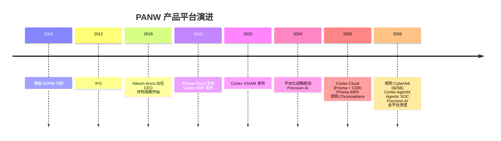

# Palo Alto Networks (PANW) 深度调研报告

> 调研日期: 2026-05-25

---

## 一、公司概览

| 项目 | 内容 |
|------|------|
| **全称** | Palo Alto Networks, Inc. |
| **股票代码** | NASDAQ: PANW |
| **成立时间** | 2005 年 |
| **创始人** | Nir Zuk (前 Check Point 工程师) |
| **总部** | Santa Clara, California, USA |
| **CEO** | Nikesh Arora (2018 年 6 月上任) |
| **IPO** | 2012 年 7 月 |
| **员工规模** | ~15,000+ |
| **市值** | ~$135B (2026 年 4 月) |
| **营收规模** | FY2025 $8.0B → FY2026E $11.28-11.31B |
| **客户数量** | ~80,000，含 85 家 Fortune 100 |

### 历史沿革

- **2005**: Nir Zuk 创立，推出全球首款 Next-Generation Firewall (NGFW)，以 App-ID 识别应用层流量，颠覆了传统基于端口/协议的五元组防火墙
- **2012**: 纽交所上市，彼时已是企业防火墙市场标杆
- **2018**: Nikesh Arora (前 Google 高管、SoftBank COO) 出任 CEO，战略转向「云+AI」
- **2018-2021**: 连续并购 RedLock (云安全)、Demisto (SOAR)、Twistlock (容器安全)、Bridgecrew (IaC 安全) 等，构建 Prisma 和 Cortex 两大平台
- **2024**: 推出 **平台化 (Platformization)** 战略——通过免费试用/捆绑折扣，推动客户将分散的安全工具整合到 PANW 三大平台
- **2025**: 发布 Precision AI 战略，Prisma Cloud 升级为 **Cortex Cloud**，收购 Koi (agentic endpoint security) 和 Chronosphere (可观测性)
- **2026 年 2 月**: $25B 收购 CyberArk，Identity 成为第四大支柱；发布 Cortex AgentiX (Agentic SOC)

---

## 二、产品矩阵：三大平台 + 新兴第四支柱

PANW 从单一防火墙公司演进为四平台安全体系，覆盖企业安全全生命周期。

### 2.1 Strata — 网络安全 (Network Security)

**定位**: 传统核心业务，覆盖网络边界到云端接入

| 产品 | 说明 |
|------|------|
| **PA-Series / VM-Series NGFW** | 物理/虚拟下一代防火墙，基于 App-ID、User-ID、Content-ID 三层识别 |
| **Strata Cloud Manager** | 统一策略管理平台，AI 驱动的策略优化和安全策略自动化 |
| **Cloud NGFW** | AWS/Azure/GCP 原生防火墙即服务 |
| **Advanced Threat Prevention** | 入侵防御 (IPS)、反恶意软件、C2 检测 |
| **DNS Security** | DNS 层威胁检测与阻断 |
| **WildFire** | 云沙箱恶意软件分析，全球最大威胁情报网络之一 |
| **SASE (Secure Access Service Edge)** | Prisma Access + Prisma SD-WAN 整合，2026 年品牌化为 Prisma SASE 3.0 |
| **Hardware/Software Firewall ARR** | 近年软件防火墙采用加速，受益于 AI 部署安全需求 (Prisma AIRS) |

**FY2024 估算营收**: ~$3.5B

### 2.2 Prisma / Cortex Cloud — 云安全 (Cloud Security)

**定位**: 从 Code to Cloud 的云原生全栈安全 (CNAPP + CDR)

2025 年 2 月，Prisma Cloud 与 Cortex CDR 合并为 **Cortex Cloud**，整合到统一 Cortex 平台：

| 能力模块 | 说明 |
|----------|------|
| **CSPM** (Cloud Security Posture Management) | 多云配置合规检查，AI 驱动的风险优先级排序 |
| **CWP** (Cloud Workload Protection) | 虚拟机、容器、K8s、Serverless 运行时保护 |
| **CIEM** (Cloud Infrastructure Entitlement Management) | 云身份权限管理 |
| **DSPM** (Data Security Posture Management) | 数据安全态势管理 |
| **AI-SPM** | AI 管道和模型安全态势 (如 LLM 部署安全) |
| **ASPM** (Application Security Posture Management) | 从代码到部署的全应用安全 |
| **KSPM** (Kubernetes Security Posture Management) | K8s 配置和运行时安全 |
| **CDR** (Cloud Detection & Response) | 实时云威胁检测与响应，集成 Cortex XDR agent |
| **Prisma AIRS** (AI Runtime Security) | 保护企业自建的 AI 应用，防御 prompt injection、数据投毒等新型攻击，已有 100+ 客户 |

**亮点**: Cortex Cloud 将 CNAPP 纳入 CDR 免费提供，降低客户采用门槛，防御策略从「和平时期」被动扫描转变为实时攻击拦截。

**FY2024 估算营收**: ~$0.8B (Prisma Cloud) + 增长中

### 2.3 Cortex — 安全运营 (Security Operations / SecOps)

**定位**: AI 驱动的安全运营中心 (SOC) 平台，从检测到自动响应闭环

PANW 增长最快、也最具 AI 叙事的分部：

| 产品 | 说明 |
|------|------|
| **Cortex XSIAM** (Extended Security Intelligence and Automation Management) | 旗舰 AI SOC 平台，替代传统 SIEM (Splunk/IBM QRadar)。融合 SIEM + XDR + SOAR + ASM，AI 原生架构 |
| **Cortex XDR** | 跨端点、网络、云的扩展检测与响应 |
| **Cortex XSOAR / AgentiX** | SOAR (安全编排自动化与响应)，2026 年升级为 AgentiX —— 引入 Agentic AI 自主执行调查和修复 |
| **Cortex Xpanse** | 攻击面管理 (ASM)，发现和评估企业暴露在外的资产 |
| **Cortex Advanced Email Security** | 邮件安全，2026 年 5 月新增单按钮跨平台删除恶意邮件功能 |
| **Cortex Exposure Management** | 漏洞/暴露管理，新增第三方扫描器数据接入 API |
| **Cortex Data Lake (XDL)** | AI 数据底座，每天摄入 >15PB 遥测数据，1100+ 集成 |
| **Cortex AgentiX Agents** | Case Investigation Agent、Cloud Posture Agent、Automation Engineer Agent 等 Agentic AI 代理 |

**XSIAM 关键指标**:
- 客户报告 MTTR 从数天降至数分钟 (10x 提升)
- 分析师工单量减少 75-90%
- Precision AI 可实现 95% 攻击无人工介入自动拦截
- 2026 年 5 月发布 XSIAM 3.5，新增 Idira 集成实现身份感知响应

**FY2024 估算营收**: ~$1.2B

### 2.4 Identity (新兴第四支柱)

2026 年 2 月以 $25B 收购 CyberArk (身份安全领导者)，将 Identity 确立为第四大支柱。

- **理念**: 身份即新边界 (Identity is the new perimeter)
- **整合**: CyberArk 的 PAM (特权访问管理) + PANW 网络/端点/云安全 = 全栈身份感知安全
- **预期贡献**: FY2026 Q3 起贡献 $340M 季度收入

### 产品演进时间线

---

## 三、技术架构

### 3.1 整体架构理念

PANW 从单一设备走向 **平台型安全操作系统**。核心设计原则：

**三个统一**:
1. **统一数据底座**: Cortex XDL (Data Lake) 为所有安全数据提供单一数据源，日摄入量 >15PB，1100+ 集成
2. **统一 AI 引擎**: Precision AI 内置到所有产品中，包括传统 ML (威胁检测) + GenAI (安全分析助手) + Agentic AI (自动响应)
3. **统一代理**: Cortex XDR Agent 统一终端、云工作负载、容器保护，替代多点方案的 agent 膨胀

**关键技术组件**:

| 层级 | 组件 | 职能 |
|------|------|------|
| **数据层** | Cortex XDL, Chronosphere Telemetry Pipeline | 采集、过滤、路由、存储海量遥测数据 |
| **AI/ML 层** | Precision AI (inline ML + GenAI + Agentic) | 实时威胁检测、工单优先级排序、自动调查与修复 |
| **检测与响应** | Cortex XSIAM, XDR, CDR | 跨域威胁检测和事件响应 |
| **执行层** | Strata NGFW, Prisma SASE, Prisma Cloud agents | 策略执行点 (防火墙/代理/API) |
| **自动化** | Cortex AgentiX (SOMA → Agentic SOAR) | 自动化 playbook + 自主决策 |

### 3.2 Precision AI 体系

2024 年推出的 Precision AI 是 PANW 区别于竞品的核心技术叙事：

- **Inline ML**: 实时流量/文件检测，无需云往返，95% 攻击自动拦截
- **Generative AI**: AI 助手 (Agentic Assistant) 辅助分析师调查、生成安全建议
- **Agentic AI**: 2026 年重点 —— AI Agent 自主执行威胁调查、漏洞修复、策略调整，无需人工介入
- **数据优势**: 80,000+ 客户网络效应，威胁情报实时共享

### 3.3 Agentic SOC (2026 年核心创新)

2026 年 2 月，PANW 提出「Agentic Remediation」概念：

- **Cortex AgentiX**: 从 SOAR (预定义 playbook 自动化) 升级到 Agentic (AI Agent 自主推理并行动)
- **Case Investigation Agent**: 分析案件上下文，推荐下一步，提取关键证据
- **Cloud Posture Agent**: 自主发现、分类和修复云配置风险
- **Automation Engineer Agent**: 用自然语言生成自动化工作流
- **Koi 收购**: 补充 agentic endpoint security，在 AI 应用运行环境实现自我保护

### 3.4 平台架构 vs 竞品对比

| 维度 | PANW (XSIAM) | Splunk | CrowdStrike Falcon | Microsoft Sentinel |
|------|-------------|--------|-------------------|-------------------|
| **架构哲学** | AI 原生统一平台 | 传统 SIEM + 拼接 | 端点原生 + 扩展 | 云原生 + 生态绑定 |
| **数据底座** | XDL 统一数据湖 | 索引存储，昂贵 | 威胁图谱 | Log Analytics + Data Lake |
| **控制台数量** | 3 (Strata/Cortex/Prisma → 趋于统一) | 多个拼接 | 1 (单一控制台) | 多个 Azure 服务 |
| **AI 能力** | Precision AI (inline + GenAI + Agentic) | Splunk AI Assistant | Charlotte AI | Security Copilot |
| **自动化深度** | Agentic (自主决策) | SOAR (预定义) | SOAR + 部分 Agentic | Logic Apps + Copilot |

**核心优劣势**:
- PANW 优势: 平台广度无出其右 (网络+云+端点+SOC)、AI 投入最深、客户锁定效应最强
- PANW 劣势: 三控制台体验不如 CRWD 单控制台统一、平台化部署周期长 (18-36 个月)

---

## 四、商业模式分析

### 4.1 从硬件到订阅的转型

PANW 在过去十年经历了网络安全行业最彻底的商业模式转型之一：

| 阶段 | 时期 | 商业模式特征 |
|------|------|------------|
| **硬件主导期** | 2005-2018 | NGFW 硬件销售 + 年度维护/订阅，硬件占比 >50% |
| **云转型期** | 2018-2024 | 订阅占比持续提升，建立 Prisma 和 Cortex SaaS 平台 |
| **平台化期** | 2024-今 | 平台捆绑销售，订阅+支持收入占比超 80% |

**当前收入结构 (FY2026 H1)**:

| 类型 | H1 FY2026 收入 | 占比 | YoY 增长 |
|------|---------------|------|---------|
| **Subscription** | $2,768M | 54.6% | +14.1% |
| **Support** | $1,352M | 26.7% | +13.0% |
| **Product (硬件)** | $948M | 18.7% | +22.3% |
| **Total** | $5,068M | 100% | +15.3% |

> 硬件占比已从历史上 >50% 压缩到 <20%，订阅+支持占比超 80%。硬件增长包含 CyberArk 影响。

**NGS ARR (下一代安全年度经常性收入)** — PANW 最核心的经营指标:

| 时期 | NGS ARR | YoY 增长 | 备注 |
|------|---------|---------|------|
| FY2024 | $4.2B | +43% | 平台化启动年 |
| FY2025 Q2 | $4.76B | — | — |
| FY2026 Q1 (Oct 2025) | $5.9B | +29% | 有机增长 |
| FY2026 Q2 (Jan 2026) | $6.33B | +33% (有机+28%) | 含 Chronosphere $200M |
| FY2026 Q3 Guide | $7.94-7.96B | +56% | 含 CyberArk $1.47B |
| FY2026 Full Year Guide | $8.52-8.62B | +53-54% | 含 M&A $1.52B |

**有机 NGS ARR 增长轨迹**: FY2024 43% → FY2026 Q1 29% → FY2026 Q2 28% (增速自然收敛但仍强劲)。

### 4.2 平台化 (Platformization) — 增长引擎

> **「平台化」** = 鼓励客户将分散的安全支出整合到 PANW 的 Strata + Prisma + Cortex + Identity 四大平台。

**机制**:
- 提供免费试用期和捆绑折扣，降低客户切换成本
- 用单一平台替换 60-80 个分散安全工具 → 客户 TCO 大幅降低
- 平台化部署周期 18-36 个月，前期销售投入大，后期 ARR 爆发

**目标与里程碑**:
- **目标**: 2030 年达到 2,500-3,500 个平台化客户
- **单客户 ARR**: 每个平台化客户 $5-15M/年
- **远期展望**: 3,000 客户 × $8M 均价 = $24B NGS ARR (5x FY2024)
- **当前进展**: 平台化客户数稳步增长 (具体数字未公开)，Q2 80%+ 新 logo 购买多产品

**平台化护城河**:
- 客户一旦部署 Strata + Prisma + Cortex + Identity 全栈，替换需同时更换四个产品线 → 多年安全工程，几乎不可撤销
- 云安全 + 网络安全 + SOC + 身份无其他厂商能完整覆盖
- 但前期投入期 (discounting/Trial) 可能压制短期账单增长 → 2024 年 2 月曾因软性指引导致股价大跌

### 4.3 RPO (剩余履约义务) — 未来收入可见度

| 时期 | RPO | YoY | 12 个月内可确认 |
|------|-----|-----|---------------|
| FY2026 Q1 | $15.5B | +24% | — |
| FY2026 Q2 | $16.0B | +23% | ~$7.1B |
| FY2026 Guide | $20.2-20.3B | +28% | — |

RPO 是未来收入的先行指标，$16B 的 RPO 按当前 pace 约覆盖 1.4 年收入。

---

## 五、财务表现

### 5.1 核心财务指标

**FY2026 Q2 (截至 2026/1/31) 亮点**:

| 指标 | Q2 FY2026 | Q2 FY2025 | YoY |
|------|-----------|-----------|-----|
| **总营收** | $2.594B | $2.257B | **+15%** |
| **订阅收入** | $1.404B | $1.233B | +14% |
| **支持收入** | $676M | $603M | +12% |
| **产品收入** | $514M | $421M | +22% |
| **GAAP 毛利率** | 73.6% | 73.5% | +10bps |
| **Non-GAAP 毛利率** | 76.1% | — | — |
| **Non-GAAP 经营利润率** | 30.3% | 28.4% | +190bps |
| **GAAP 净利** | $432M | $267M | +62% |
| **Non-GAAP 净利** | $732M | $566M | +29% |
| **Non-GAAP EPS** | $1.03 | $0.81 | +27% |
| **TTM Adj. FCF** | $3.75B | — | 37.9% 利润率 |
| **NGS ARR** | $6.33B | — | +33% |
| **RPO** | $16.0B | — | +23% |

**FY2026 H1 (6 个月累计)**:

| 指标 | H1 FY2026 | H1 FY2025 | YoY |
|------|-----------|-----------|-----|
| 总营收 | $5.068B | $4.396B | +15.3% |
| GAAP 净利 | $766M | $618M | +24% |
| Non-GAAP 净利 | $1.394B | $1.111B | +25.5% |
| Non-GAAP 经营利润率 | 30.2% | 28.6% | +160bps |

**FY2026 全年指引**:

| 指标 | FY2026 Guide | FY2025 | YoY |
|------|-------------|--------|-----|
| 总营收 | $11.28-11.31B | ~$8.0B | +22-23% |
| NGS ARR | $8.52-8.62B | ~$4.2B | +53-54% |
| RPO | $20.2-20.3B | — | +28% |
| Non-GAAP 经营利润率 | 28.5-29.0% | — | — |
| Non-GAAP EPS | $3.65-3.70 | — | — |
| Adj. FCF 利润率 | 37% | — | — |

### 5.2 区域收入分布 (Q2 FY2026)

| 区域 | 收入 | 占比 |
|------|------|------|
| Americas (US) | $1.588B | 61.2% |
| Americas (Other) | $124M | 4.8% |
| EMEA | $560M | 21.6% |
| APAC | $322M | 12.4% |

### 5.3 盈利能力趋势

- **订阅+支持占收入**: 80.2% (H1 FY2026)
- **Non-GAAP 毛利率**: 76-78% 趋势 (软件占比提升驱动)
- **Non-GAAP 经营利润率**: 28.4% (FY2025 Q2) → 30.3% (FY2026 Q2)，连续三季度 30%+
- **长期目标**: 经营利润率 25-30%，S&M 费用率从 40% 压缩至 25-30%
- **FCF 利润率**: ~37% (顶级软件效率)，TTM $3.75B

### 5.4 关键收购整合

| 时间 | 标的 | 金额 | 战略意义 |
|------|------|------|---------|
| 2018 | RedLock | ~$173M | CSPM 能力 → Prisma Cloud 基础 |
| 2019 | Demisto | ~$560M | SOAR → Cortex XSOAR |
| 2019 | Twistlock | ~$410M | 容器安全 → Prisma Cloud CWP |
| 2020 | CloudGenix | ~$420M | SD-WAN → Prisma SD-WAN |
| 2022 | Cider Security | ~$200M | ASPM → Prisma Cloud 代码安全 |
| 2024 | IBM QRadar SaaS 资产 | — | SIEM 客户迁移加速 XSIAM |
| 2025 | Chronosphere | — | 可观测性/遥测管道 → XDL 增强 |
| 2025 | Koi | — | Agentic Endpoint Security |
| 2026 年 2 月 | **CyberArk** | **~$25B** | 身份安全 → Identity 第四支柱 |

---

## 六、竞品对比

### 6.1 主要竞品矩阵

| 维度 | **PANW** | **CrowdStrike (CRWD)** | **Fortinet (FTNT)** | **Zscaler (ZS)** |
|------|---------|----------------------|---------------------|-----------------|
| **市值 (Apr 2026)** | ~$135B | ~$109B | ~$62B | ~$26B |
| **营收 (TTM)** | ~$9.9B | ~$3.7B | ~$6.2B | ~$2.7B |
| **收入增速** | ~15-23% | ~24-33% | ~14-20% | ~25-26% |
| **毛利率** | 76% | 78% | 80% | 77% |
| **经营利润率 (GAAP)** | ~14% | ~1% | ~19% | 负值 |
| **FCF 利润率** | ~37% | ~31-33% | ~38% | ~25% |
| **NGS ARR/ARR** | $6.33B NGS ARR | $5.25B ARR | — | $3.36B ARR |
| **核心起源** | 网络防火墙 | 端点安全 (EDR) | 网络安全硬件 | 云安全 Web Gateway |
| **平台覆盖** | 网络+云+SOC+身份 | 端点+云+身份+SIEM | 网络+端点+SD-WAN | SASE+ZTNA |
| **架构** | 多平台(3 控制台) | 单一代理+平台 (Falcon) | Security Fabric (自有芯片) | 云原生零信任交换 |
| **Gartner 领导者** | 6+ 类别 | 4+ 类别 | 2-3 类别 | 1-2 类别 |
| **客户数** | ~80,000 | — | 680,000+ | — |
| **Fortune 100 渗透** | 85/100 | — | — | — |
| **模块采纳** | — | 平均 7+ 模块/客户 | — | — |
| **DBNRR** | — | >120% | — | >115% |

### 6.2 竞品深度对比

#### PANW vs CrowdStrike: 平台巨人 vs 端点之王

这是网络安全领域最经典的对决：
- **PANW**: 多品类平台整合者，从网络 → 云 → SOC → 身份全栈覆盖。优势在广度、客户锁定、盈利规模。劣势在增速较慢 (15%)、多控制台体验不如 CRWD 统一
- **CRWD**: Falcon 单代理架构成为行业标杆，每日处理 >2 万亿安全事件。优势在增速 (24%)、技术品牌、网络效应 (Threat Graph)。劣势在盈利稀薄 (GAAP)、需要证明平台扩张能力

**结论**: PANW 赢在规模/利润/锁定，CRWD 赢在增速/创新/端点粘性。两者是 Tier 1 唯二纯安全平台 (第三是 Microsoft)。

#### PANW vs Fortinet: 高端 vs 性价比

- **FTNT**: 自研 ASIC 芯片 (NP7) 的硬件防火墙，680K+ 客户，毛利率 80%+，在中小企业市场强势。增速与 PANW 接近 (~14-20%)，但更依赖硬件周期
- **PANW**: 在大企业和高端防火墙市场更有优势，云/SaaS 占比更高

#### PANW vs Zscaler: 混合架构 vs 云原生 SASE

- **ZS**: 云原生 Zero Trust Exchange，日处理 300B+ 交易，纯 SaaS 交付。增速最快 (26%) 但估值已从 2025 年高点腰斩 (下跌 50%+)
- **PANW**: 从硬件 NGFW 出发，SASE 是增量业务而非全部。Prisma SASE 3.0 保持竞争力

### 6.3 竞争格局总结 (Tier 分级)

| Tier | 公司 | 特征 |
|------|------|------|
| **Tier 1** (全平台, $100B+ 市值) | PANW, CRWD, Microsoft | 唯一三家具全平台能力的安全厂商 |
| **Tier 2** (品类领导者) | Fortinet (网络安全), Zscaler (SASE), Okta (IAM), SentinelOne (端点) | 各自在核心品类领先，面临"深耕 vs 做平台"的战略选择 |
| **新兴挑战者** | Wiz (CNAPP, $500M+ ARR), Orca, Lacework | 云安全创业公司对 Prisma Cloud 构成竞争压力 |

---

## 七、市场地位

### 7.1 定量维度 (2026)

| 指标 | PANW 排名 |
|------|----------|
| 纯安全厂商营收 | **#1** (~$11B FY2026E) |
| 纯安全厂商市值 | **#1** (~$135B) |
| Gartner Magic Quadrant 领导者 | **#1** (6+ 类别同时领先) |
| NGFW 市场份额 | **#1** |
| CNAPP 市场份额 | **#1** (Prisma Cloud) |
| SOAR 市场份额 | **#1** (Cortex XSOAR/AgentiX) |
| SASE | Top 3 (with Zscaler, Fortinet) |
| SIEM 替代 (XSIAM) | 增长最快 |
| Fortune 500 渗透 | 最广 (无其他安全厂商可比) |

### 7.2 定性维度

**品牌**: "网络安全操作系统"——不仅是防火墙公司，而是企业安全基础设施的标准制定者

**行业趋势顺风**:
1. **Vendor Consolidation (供应商整合)**: 企业从管理 60-80 个安全工具 → 3-5 个平台。PANW 是最大受益者
2. **AI vs AI**: 网络攻击者使用 AI 实现自动化攻击 → 防御者必须用 AI 自动响应。PANW 的 Agentic SOC 叙事最强
3. **网络安全支出成长性**: 全球支出 $213B (2025) → 预期 $500B by 2030 (Gartner)。刚性支出，受宏观影响小
4. **Cyber Insurance 合规**: 保险公司越来越多要求企业部署 XDR/自动化响应 → 利好 PANW/CrowdStrike
5. **零信任架构普及**: 身份即边界、持续验证 → 利好 PANW (Identity + SASE + NGFW)

### 7.3 风险与挑战

| 风险 | 级别 | 说明 |
|------|------|------|
| **平台化执行风险** | Medium | 免费试用和折扣短期压制账单，前期投入到 ARR 实现的 18-36 月滞后 |
| **云安全竞争** | High | Wiz、Orca、Lacework 等云原生创业公司对 Prisma Cloud 构成直接威胁 |
| **增速放缓** | Medium | 15% 营收增速在网络安全板块偏慢 (vs CRWD 24%, ZS 26%) |
| **CyberArk 整合** | Medium | $25B 天价收购的整合风险，身份安全能否真正融入平台 |
| **多控制台体验** | Medium | 3 个独立控制台 vs CRWD 单控制台，客户体验有差距 |
| **AI 安全竞争** | Medium | Microsoft Security Copilot + Sentinel 借 Azure 生态优势竞争 |
| **估值压力** | Medium | Forward P/E 仍然不低，需要持续兑现 NGS ARR 增长和利润率扩张 |

---

## 八、投资要点总结

### Bull Case (看多逻辑)

1. **网络安全「操作系统」定位**: 无其他厂商能覆盖网络+云+SOC+身份四层
2. **平台化锁定效应**: 客户替换成本极高，ARR 可见度高 ($16B RPO)
3. **行业顺风**: AI 驱动的攻击增加 → 安全支出从可选变为必须
4. **利润扩张**: NGS ARR 增速 > 营收增速，经营利润率从 28% 向 30%+ 扩张
5. **XSIAM 替代 SIEM**: Splunk/IBM QRadar 合约到期 → XSIAM 成为首选替代方案
6. **FCF 机器**: 37% FCF 利润率在科技公司中极稀缺

### Bear Case (看空逻辑)

1. **增速纵向放缓**: 有机 NGS ARR 从 FY2024 的 43% 降至 FY2026 Q2 的 28%，未来可能进一步收敛
2. **平台化依赖 M&A**: $25B CyberArk 收购使指引含大量 M&A 贡献 ($1.52B)，有机增长才是真正的试金石
3. **短期催化剂缺失**: 2026 年机构观点偏谨慎 (KoalaGains: PASS, HeyGotrade: WAIT)
4. **CRWD 更受成长股偏好**: 增速更快、架构更现代、单平台叙事更简洁
5. **15% 营收增速**: 在网络安全板块中最慢

### 核心关注指标

- **NGS ARR (有机增速)**: 是否能维持 20%+ 有机增长
- **平台化客户数**: 2,500-3,500 里程碑进展
- **XSIAM 赢单率**: vs Splunk/CRWD Falcon Complete
- **经营利润率**: 向 30% 目标收敛
- **CyberArk 整合**: Identity 能否成为真正的第四支柱

### 估值参考 (Apr 2026)

- 市值: ~$135B
- FY2026E 营收: ~$11.3B → P/S ~12x
- FY2026E Non-GAAP EPS: ~$3.68 → P/E ~50x
- FCF: ~$3.75B TTM → P/FCF ~36x

**历史估值**: 2024 年 2 月平台化战略发布时因软性账单指引出现抛售，估值一度压缩至 Forward P/E 35-40x，随后修复。当前估值处于历史中上区间，反映市场对平台化战略的部分认可，但仍需等待进一步验证。

---

> **免责声明**: 本报告仅为个人学习研究之用，不构成任何投资建议。数据来源包括 PANW 官方财报 (FY2026 Q1/Q2)、SEC 10-Q、Finterra/InvestingWithPurpose/KoalaGains 第三方分析，截至 2026 年 5 月。