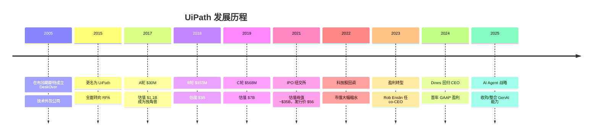
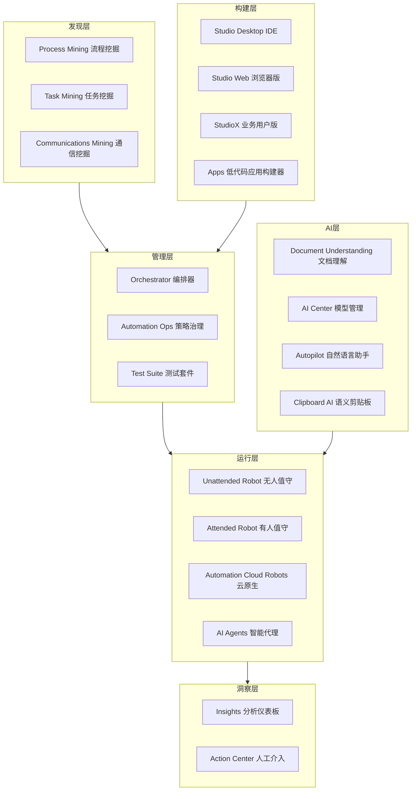
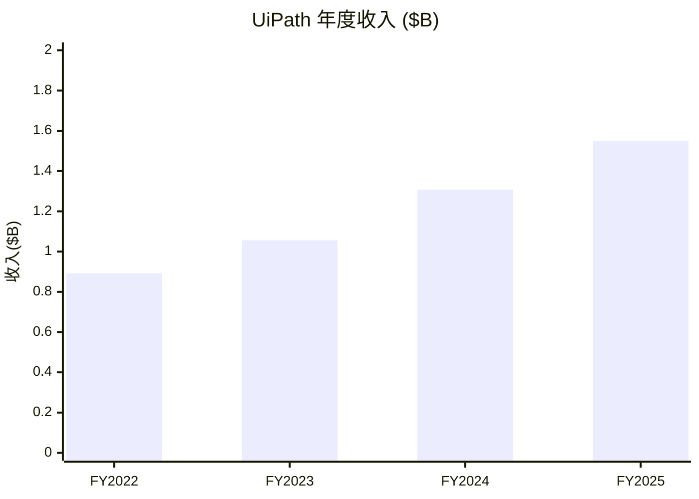

# UiPath 公司深度调研报告

## 一、公司背景

### 1.1 基本信息

| 项目 | 详情 |
|------|------|
| **公司全称** | UiPath Inc. |
| **股票代码** | PATH (NYSE) |
| **成立时间** | 2005 年（原名 DeskOver） |
| **创始人** | Daniel Dines（罗马尼亚） |
| **总部** | 纽约，美国 |
| **核心工程** | 布加勒斯特，罗马尼亚 |
| **行业** | 企业自动化 / RPA / AI |

### 1.2 发展历程



**创始人故事**：Daniel Dines 生于 1972 年罗马尼亚奥内什蒂，曾在微软西雅图担任软件工程师，后回国创业。公司早期险些破产，Dines 曾刷爆个人信用卡维持运营。UiPath 被誉为"罗马尼亚第一家十角兽"，Dines 成为罗马尼亚科技创业的象征性人物。

### 1.3 管理层

- **Daniel Dines** — 创始人 / CEO（2024 年回归）。2023 年曾退居 co-CEO 兼 Chief Innovation Officer，Rob Enslin（前 Google Cloud 总裁）接任 co-CEO。2024 年 Dines 重新担任 CEO。
- **Ashim Gupta** — CFO（2024 年之后）
- **团队规模**：全球约 4,000 名员工（经多轮裁员调整后）

---

## 二、产品矩阵

### 2.1 平台全景

UiPath 定位为**端到端企业自动化平台**，覆盖从发现到运行的完整生命周期。



### 2.2 核心产品详解

| 产品 | 功能 | 目标用户 |
|------|------|----------|
| **UiPath Studio** | 自动化工作流 IDE，支持低代码与专业开发 | RPA 开发者 |
| **Studio Web** | 浏览器端可视化开发、跨平台 | 业务用户/开发者 |
| **StudioX** | Excel 风格界面，最简自动化 | 业务用户/Citizen Developer |
| **Orchestrator** | Robot 管理、任务调度、资产/凭证管理 | IT 管理员 |
| **Unattended Robot** | 后台无人值守执行 | 后台流程 |
| **Attended Robot** | 桌面端用户触发执行 | 一线员工 |
| **Automation Cloud Robots** | 全托管 Serverless 云执行 | 云原生流程 |
| **AI Agents** | 基于 LLM 的自主决策代理，处理非结构化任务 | 复杂流程 |
| **Autopilot** | GenAI 驱动的自然语言开发助手 | 所有用户 |
| **Document Understanding** | AI 文档理解与提取（发票、合同等） | 文档密集型业务 |
| **Process Mining** | 基于事件日志的流程可视化与优化 | 流程分析师 |
| **Task Mining** | 桌面端记录用户操作、自动发现自动化机会 | 流程分析师 |
| **Communications Mining** | AI 分析邮件/工单/客服对话 | 客服/运营 |
| **Apps** | 低代码构建自动化交互界面 | 应用构建者 |
| **Integration Service** | 800+ SaaS 连接器，API 自动化 | 开发者 |
| **Test Suite** | 自动化测试（含 RPA 测试） | QA/测试工程师 |
| **Insights** | 嵌入式运营分析仪表板 | 管理者 |
| **Data Service** | 无代码持久化数据存储 | 所有用户 |
| **Action Center** | 人工审核/确认的长流程协同 | 流程参与者 |
| **Automation Ops** | 策略驱动的集中治理引擎 | IT 治理 |

### 2.3 产品战略趋势（2025）

1. **Agentic Automation**：从确定性 RPA 规则 → LLM 驱动的自主 AI Agent，处理非结构化、需要推理的任务。
2. **Autopilot 差异化**：自然语言→自动化的桥接能力，降低使用门槛。
3. **垂直行业方案**：金融、医疗、制造等行业专属 AI 解决方案。
4. **Clipboard AI**：语义级智能剪贴板，理解上下文自动填充表单/报告。

---

## 三、技术架构

### 3.1 平台架构总览

UiPath Automation Cloud 采用**云原生 SaaS + 混合部署**架构。

```
┌─────────────────────────────────────────────────┐
│                  UI / CLI / API                   │
├─────────────────────────────────────────────────┤
│  Studio │ Studio Web │ StudioX │ Apps │ Autopilot │
├─────────────────────────────────────────────────┤
│              Integration Service                  │
│         (800+ 预置 SaaS 连接器)                     │
├─────────────────────────────────────────────────┤
│  Orchestrator (控制面 — 多租户 SaaS)               │
│  ├ Robot 管理  ├ 任务调度  ├ 资产管理              │
│  ├ 凭证存储    ├ 流程版本  ├ 队列管理              │
├─────────────────────────────────────────────────┤
│  Robots (执行面)                                    │
│  ├ Unattended (后台)  ├ Attended (桌面触发)        │
│  ├ Cloud Robots (Serverless) ├ AI Agents (LLM)    │
├─────────────────────────────────────────────────┤
│  平台服务层 (微服务)                                │
│  ├ AI Center  ├ Document Understanding             │
│  ├ Data Service  ├ Insights  ├ Action Center      │
│  ├ Test Suite  ├ Automation Ops                   │
├─────────────────────────────────────────────────┤
│  Azure / AWS / GCP 多云基础设施                     │
└─────────────────────────────────────────────────┘
```

### 3.2 关键技术特性

| 特性 | 说明 |
|------|------|
| **多租户架构** | Folders + Tenants 逻辑隔离，RBAC 权限控制 |
| **混合部署** | Cloud Orchestrator 可管理本地 Robot，通过出站连接（无需开防火墙入站端口） |
| **高可用** | 多区域冗余，自动故障转移，灾难恢复 |
| **身份安全** | SAML/OIDC SSO、MFA、IP 过滤，支持 Azure AD、Okta 集成 |
| **凭证管理** | 内置凭证存储 + CyberArk/HashiCorp Vault 集成 |
| **无服务器 Robot** | Automation Cloud Robots 全托管，按需弹性扩缩 |
| **AI Trust Layer** | AI 输出的治理和安全层 |

### 3.3 技术演进方向

- **LLM 深度集成**：将 GPT-4o/Claude 等模型嵌入自动化决策流
- **语义自动化**：从 UI 元素识别过渡到语义意图理解
- **多模态 AI**：视觉+文本+结构化数据的联合处理
- **联邦学习**：跨企业的模型训练隐私保护

---

## 四、商业模式

### 4.1 收入模式

UiPath 主要采用**订阅制 SaaS + 传统许可混合**模式：

| 收入类别 | 占比（估算） | 说明 |
|----------|-------------|------|
| **订阅许可费** | ~55-60% | Cloud SaaS 订阅 + 本地 Term License |
| **维护与支持** | ~25-30% | 附属于本地许可的年度维护费 |
| **专业服务及其他** | ~10-15% | 培训、实施咨询、合作伙伴服务 |

### 4.2 定价模式

- **Robot 许可**：按 Unattended / Attended Robot 数量计费
- **平台许可**：Automation Cloud 基础平台订阅
- **消费模式**：新兴的基于用量的弹性定价
- **Land-and-Expand**：从小部门试点 → 企业级部署，Net Dollar Retention ~112%

### 4.3 转型趋势

- 积极从传统本地许可转向 Cloud ARR（Automation Cloud ARR 增长 50%+ YoY）
- 推动从"卖 robot 许可"向"卖平台订阅"的转型
- 引入消费型计费，降低入场门槛

---

## 五、竞品对比

### 5.1 核心竞品矩阵

| 维度 | **UiPath** | **Automation Anywhere** | **SS&C Blue Prism** | **Microsoft Power Automate** |
|------|------------|------------------------|---------------------|------------------------------|
| **成立/总部** | 2005 罗马尼亚→纽约 | 2003 圣何塞 | 2001 英国→奥斯汀 | 2016 雷德蒙德 |
| **市场份额** | ~30%（领导者） | ~20%（第二） | ~10%（企业利基） | ~15-20%（快速追赶） |
| **部署模式** | Cloud/On-Prem/Hybrid | Cloud-Native/On-Prem | On-Prem 为主，Cloud 新兴 | Cloud-Native SaaS |
| **目标客户** | 大企业+中端市场 | 大企业+SMB | 银行/金融/政府（重监管） | M365 用户，所有规模 |
| **定价定位** | $$$$ 高端 | $$$ 中高端 | $$$$$ 通常最贵 | $$ M365 用户极低门槛 |
| **AI 能力** | Autopilot, AI Agents, Document Understanding | Co-Pilot, AI Agent Studio, Document Automation | Process Intelligence, Copilot, Decision | Copilot, AI Builder, Azure OpenAI |
| **连接器数量** | 800+ 原生 + 1500+ 市场 | 700+ 预置 + Bot Store | 银行/主机专用连接器 | 1000+ 连接器（M365 深度集成） |
| **低代码应用** | UiPath Apps | App Builder | ❌ 无 | Power Apps 深度集成 |
| **流程挖掘** | ✅ Process Mining + Task Mining | ✅ Process Discovery | ✅ Process Intelligence (ABBYY) | ✅ Process Advisor |
| **测试自动化** | ✅ Test Suite | 依赖合作伙伴 | ❌ 无 | ✅ Power Apps Test Engine |
| **Agentic Automation** | ✅ UiPath Agents | ✅ AI Agents (APA) | ✅ Digital Workers 2.0 | ✅ Autonomous Agents (Copilot Studio) |

### 5.2 各自优劣势

**UiPath 优势**：
- 最完整的端到端自动化平台
- 最强的 AI + 文档理解能力
- 成熟的治理和规模化能力

**UiPath 劣势**：
- 价格显著高于竞品（尤其 vs Power Automate）
- 对小型部署过于复杂
- 股价持续低迷，面临增长压力

**Automation Anywhere 优势**：
- 云原生架构更纯粹
- GenAI Co-Pilot 能力强
- 消费型定价更灵活

**Automation Anywhere 劣势**：
- 市场份额被 UiPath 压制
- 缺少流程挖掘等自研能力
- 尚未上市，透明度有限

**Blue Prism 优势**：
- 重监管行业信任度高（银行/政府）
- 最强的主机/遗留系统连接能力
- 审计追踪完善

**Blue Prism 劣势**：
- SS&C 收购后创新节奏放缓
- 云化进程缓慢
- 缺少低代码/公民开发者能力

**Microsoft Power Automate 优势**：
- M365 生态绑定，零边际部署成本
- Copilot AI 能力快速渗透
- 按用户定价，极低门槛

**Microsoft Power Automate 劣势**：
- 严重依赖微软生态
- 大企业级 RPA 深度不如 UiPath
- 对非 Windows 环境支持有限

### 5.3 行业趋势

1. **Agentic Automation 趋同**：所有厂商均在从规则式 RPA 向 AI Agent 演进，竞争从 feature 转向生态+定价+垂直深度
2. **价格战压力**：Power Automate 的捆绑策略正在压低全市场价格
3. **行业整合预期**：Blue Prism 已被 SS&C 收购，市场预计进一步 M&A
4. **三强格局形成**：企业自动化市场正演变为 UiPath v.s. AA v.s. Microsoft 的三方竞争

---

## 六、市场地位

### 6.1 市场份额

| 排名 | 公司 | 全球 RPA 市场份额（估计） | 部署模式 |
|------|------|--------------------------|----------|
| 1 | **UiPath** | ~27-30% | Cloud/On-Prem/Hybrid |
| 2 | Automation Anywhere | ~18-20% | Cloud-Native/On-Prem |
| 3 | Microsoft (Power Automate) | ~15-20% | Cloud-Native SaaS |
| 4 | SS&C Blue Prism | ~8-10% | On-Prem 为主 |
| 5 | Others (Appian, Pega, IBM, NICE 等) | ~20-30% | 多种 |

> 注：Gartner Magic Quadrant 连续多年将 UiPath 评为 RPA 领域 **Leader**（愿景完整度 + 执行力均最高）。

### 6.2 客户基础

- **FY2025 客户指标**（2025 年年报）：
  - $1M+ ARR 客户：**288 家**
  - $100K+ ARR 客户：**2,153 家**
  - 美元净留存率：**112%**
  - 已在 **30+ 国家** 销售产品
  - 收入 ~60% 来自商业客户，~35% 来自国际客户

### 6.3 市场总规模

| 年份 | 全球 RPA/智能自动化市场规模 | 来源 |
|------|---------------------------|------|
| 2024 | ~$4.5-5.0B | 行业估算 |
| 2026E | ~$9-11B | CAGR ~25-30% |
| 2030E | $50-125B+ | McKinsey/BCG 预测 |

主要增长驱动：GenAI 嵌入自动化、Agentic Automation 兴起、云原生 RPA 普及、企业对降本增效需求增加。

---

## 七、财务表现

### 7.1 核心财务数据

| 指标 | FY2023 | FY2024 | FY2025（截止2025.01） |
|------|--------|--------|----------------------|
| **GAAP 收入** | $1.056B | $1.308B | ~$1.55B |
| **收入增速 (YoY)** | +18% | +24% | ~+19% |
| **ARR** | — | $1.464B | $1.666B |
| **ARR 增速** | — | +22% | +18% |
| **GAAP 运营利润** | -$142.0M | -$142.0M | +$54.1M |
| **经营现金流** | +$44.2M | +$249.3M | +$349.6M |
| **Non-GAAP 自由现金流** | — | — | +$353.0M |
| **美元净留存率** | — | ~120% | 112% |
| **$1M+ ARR 客户** | — | ~264 | 288 |
| **$100K+ ARR 客户** | — | ~2,053 | 2,153 |

> 注：FY2025 为 UiPath 首次实现 GAAP 全年运营盈利的财年（截止 2025 年 1 月 31 日）。ARR $1.666B，同比增长 18%。

### 7.2 收入趋势



### 7.3 股票表现

| 时间 | 事件 | 价格区间 |
|------|------|----------|
| **2021.04** | IPO | 发行价 $56，首日 $65.50 |
| **2021 峰值** | 科技股泡沫 | 市值 ~$35B，股价 ~$80+ |
| **2022-2023** | 科技股大幅回调 | $10-$16 |
| **2024** | 盈利改善，Gaap 全年盈利 | $12-$16 |
| **2025** | CEO 变动，AI 战略转型 | $10-$15 |
| **2025.03** | FY2025 年报后股价下跌 ~16% | Q1 指引不及预期 |
| **2026.05 (近期)** | — | ~$10-$14 |

IPO 以来从未回到 $56 发行价。当前市值约 $6-8B。

### 7.4 关键财务洞察

1. **首次实现 GAAP 全年盈利**：FY2025 运营利润转正（+$54.1M），标志着从烧钱扩张到盈利平衡的转折点。

2. **ARR 增速放缓从 24%→18%**：增长减速是核心挑战。企业客户在当前经济环境下缩减 IT 预算，大单销售周期拉长。

3. **现金流健康**：经营现金流 +$349.6M，自由现金流 +$353.0M。公司有充裕的自我造血能力。

4. **Cloud ARR 占比提升**：Automation Cloud ARR 增长 50%+ YoY，SaaS 转型加速中，带动长期收入可预测性提高。

5. **留存率仍健康但略有下滑**：美元净留存率从 ~120% 降至 112%，反映现有客户扩展速度放缓，但仍高于 100% 健康线。

---

## 八、风险与挑战

### 8.1 核心风险

| 风险类别 | 具体风险 | 严重程度 |
|----------|----------|----------|
| **竞争压力** | Microsoft Power Automate 利用 M365 生态零成本获客，长期侵蚀市场份额 | 🔴 高 |
| **增长放缓** | ARR 增速从 24% → 18%，经济下行周期企业削减自动化预算 | 🔴 高 |
| **AI 替代风险** | GenAI Agent 可直接执行任务，绕过传统 RPA 层，使 RPA 工具价值缩水 | 🔴 高 |
| **定价压力** | Power Automate 捆绑 M365 的策略迫使全行业降价 | 🟡 中 |
| **Zoominfo/竞品数据风险** | 人才流失、核心工程师被挖角至 AA/Microsoft | 🟡 中 |
| **CEO 变动** | Daniel Dines 2024 年回归 CEO，领导层频繁变动影响战略连续性 | 🟡 中 |
| **整合风险** | 过往多起收购（ProcessGold、Re:infer 等）的整合与变现 | 🟡 中 |
| **宏观经济** | 企业 IT 预算收紧，大单销售周期拉长 | 🟡 中 |

### 8.2 乐观因素

1. **市场领导者**：最大的纯 RPA 平台，最完整的端到端产品矩阵
2. **AI 布局**：Autopilot + AI Agents + Document Understanding 构成 AI 驱动的自动化生态
3. **盈利拐点**：FY2025 首年 GAAP 盈利，现金流健康（+$353M FCF）
4. **客户粘性高**：112% 净留存率，大型企业客户迁移成本高
5. **生态壁垒**：800+ 连接器、1500+ 市场组件、培训认证体系形成护城河
6. **Agentic Automation 浪潮**：企业在从传统 RPA 升级到 AI Agent 时，首选在同一平台内升级，对 UiPath 有利

---

## 九、投资视角总结

### 9.1 估值对比（2025 年末近似值）

| 指标 | UiPath (PATH) | Automation Anywhere | SS&C Blue Prism | Microsoft |
|------|--------------|---------------------|-----------------|-----------|
| 估值/市值 | ~$7-8B | ~$7B（最后一轮私募） | 被 SS&C 收购 | $2,900B+ |
| P/S (TTM) | ~5-6x | N/A（未上市） | N/A | ~11x |
| 收入增速 | ~19% | ~30-50% | 低单位数 | ~15% |
| 盈利状态 | GAAP 盈利 | 亏损 | 盈利 | 高盈利 |

### 9.2 核心判断

- **短期 (6-12月)**：盈利拐点确立 + AI Agent 叙事，但增长放缓（18% ARR 增速）是主要矛盾。FY2025 财报后股价下跌 16% 反映市场对 Q1 指引的担忧。
- **中期 (1-3年)**：关键观察点：AI Agents/Autopilot 的商业化速度、Cloud ARR 占比能否超过 50%、能否在 Power Automate 扩张下守住大企业市场份额。
- **长期 (3-5年)**：RPA 市场正从"机器人流程自动化"向 "AI 驱动的智能自动化平台"演进。UiPath 的护城河取决于：能否把客户从 Robot 许可稳稳迁移到平台订阅，以及 AI Agent 产品能否有效对抗 Microsoft Copilot 生态。

> **关键投资论题**：UiPath 不是高速增长的 SaaS 故事（增速 ~19%），而是一个**盈利转型 + AI 升级**的价值故事。如果 Agentic Automation 能在现有 2,153 家大客户中成功 upsell，收入增速可能重新加速到 25%+。否则，在 Microsoft 的低成本碾压下，增长可能继续降速。

---

## 参考资料

- UiPath Investor Relations: https://ir.uipath.com
- UiPath Annual Report FY2024 (10-K), filed March 2024
- UiPath Q4 FY2025 Earnings Release, March 2025
- Gartner Magic Quadrant for Robotic Process Automation, 2024
- Forrester Wave: Robotic Process Automation, 2024
- SEC Filings (Form 10-K, 10-Q): https://www.sec.gov
- Macrotrends - UiPath Revenue: https://www.macrotrends.net/stocks/charts/PATH/uipath/revenue