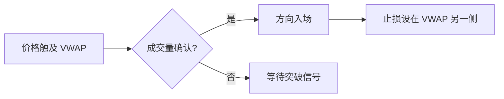

# VWAP 详解

> 核心：VWAP 是机构执行基准 + <span style="color:rgb(255, 77, 77)">动态支撑阻力</span>，理解它就理解了"大钱怎么进出"

---

## 定义与公式

**VWAP**（<span style="color:rgb(255, 77, 77)">Volume Weighted Average Price，成交量加权平均价</span>）= 用成交量做权重的平均成交价。

$$\text{VWAP} = \frac{\sum_{i} P_i \times V_i}{\sum_{i} V_i}$$

其中 $P_i$ 是第 $i$ 笔成交价，$V_i$ 是对应的成交量。

$V_i$ 的单位取决于市场：

| 市场 | $V_i$ 单位 | 说明 |
|:---|:---|:---|
| A股 | 股数（或成交金额） | 1手=100股，VWAP 算的是逐笔成交的股数 |
| 期货 | 手数（合约数） | 1手=1份合约 |
| 美股 | shares | 逐笔成交的股数 |

还有一种等价写法，用**成交金额**替代股数：

$$\text{VWAP} = \frac{\text{总成交金额}}{\text{总成交量}}$$

分子是金额（元/$），分母是股数/手数，结果还是价格单位——两种写法数学上完全等价。很多数据平台直接用"成交额÷成交量"来算，因为成交金额比逐笔股数更容易获取。

直觉：不是简单的"今天均价"，而是**大单在哪成交、成交了多少**都算进去——成交量大的价格点对 VWAP 影响更大。

---

## 为什么 VWAP 重要

### 1. 机构执行基准

机构交易员（基金、券商自营）的绩效考核标准就是 VWAP：

- **买在<span style="color:rgb(195, 117, 255)"> </span>VWAP 以下** → 执行好，省了钱
- **卖在 VWAP 以上** → 执行好，多赚了
- **偏离 VWAP** → 执行差，说明买卖时机不对或滑点过大

为什么用 VWAP 而不是简单均线？因为机构关心的不是"价格平均"，而是<span style="color:rgb(255, 77, 77)">"大单成交的平均"</span>——这才是<span style="color:rgb(255, 77, 77)">真正的市场成本基准</span>。

### 2. 动态支撑/阻力

日内交易中 VWAP 是最重要的动态锚点：

| 场景           | 含义           |
| :----------- | :----------- |
| 价格在 VWAP 上方  | 买方控制，偏多头     |
| 价格在 VWAP 下方  | 卖方控制，偏空头     |
| 价格触及 VWAP 回弹 | VWAP 作为支撑/阻力 |
| 价格突破 VWAP    | 多空力量切换       |

---

## 标准 VWAP 计算方式

日内 VWAP 通常从开盘开始累计，到收盘结束：

$$\text{CumVWAP}_t = \frac{\sum_{i=1}^{t} P_i \times V_i}{\sum_{i=1}^{t} V_i}$$

关键点：
1. **每个交易日重新开始**——<span style="color:rgb(255, 77, 77)">昨天的 VWAP 和今天无关</span>
2. **累计计算**——<span style="color:rgb(255, 77, 77)">越接近收盘，新成交对 VWAP 的影响越小</span>（因为累计量已经很大）
3. **开盘前30分钟 VWAP 最不稳定**——成交量少，少数大单就能大幅拉偏

---

## VWAP 交易策略

### 1. VWAP Bounce（回弹策略）

价格触及 VWAP 后回弹，VWAP 作为支撑/阻力：



- **多头回弹**：价格跌到 VWAP 附近，出现放量企稳 → 买入，止损在 VWAP 下方
- **空头回弹**：价格涨到 VWAP 附近，出现放量受阻 → 卖出，止损在 VWAP 上方

### 2. VWAP Break（突破策略）

价格突破 VWAP 并站稳，多空力量切换：

- **向上突破**：价格放量突破 VWAP → VWAP 从阻力变支撑 → 多头入场
- **向下突破**：价格放量跌破 VWAP → VWAP 从支撑变阻力 → 空头入场

<span style="color:rgb(195, 117, 255)">确认条件：突破后至少停留 2~3根 K 线，且伴随放量。<br></span>
### 3. VWAP Reject（拒绝策略）

价格接近 VWAP 但无法触及就转向——说明 VWAP 一侧的力量更强：

- 价格从下方接近 VWAP，还没碰到就掉下去 →<span style="color:rgb(195, 117, 255)"> 空头极强</span>
- 价格从上方接近 VWAP，还没碰到就弹上去 → <span style="color:rgb(195, 117, 255)">多头极强</span>

---

## VWAP 偏离带（Deviation Bands）

<span style="color:rgb(195, 117, 255)">在 VWAP 基础上加减若干标准差，形成"轨道"：</span>

$$\text{Upper Band} = \text{VWAP} + n \times \sigma_{\text{VWAP}}$$
$$\text{Lower Band} = \text{VWAP} - n \times \sigma_{\text{VWAP}}$$

常用设置：

| Band | 用途 |
|:---|:---|
| ±1σ | 正常波动范围，触及后大概率回弹 |
| ±2σ | 异常波动，触及后可能趋势延续也可能反转 |
| ±3σ | 极端波动，统计上仅 ~0.3% 概率触及 |

策略应用：
- 价格在 ±1σ 内 → 正常日内波动，以 VWAP 为锚做回弹
- 价格触及 ±2σ → 考虑均值回归（回弹到 VWAP）或趋势跟随（突破极端）
- 价格触及 ±3σ → 极端事件，谨慎处理

---

## Anchored VWAP（AVWAP）

标准 VWAP 每天从开盘重算。**AVWAP** 从你指定的"锚点"开始累计——可以是某个关键日期、事件、反转点。

| VWAP 类型 | 起算点 | 用途 |
|:---|:---|:---|
| 标准 VWAP | 每日开盘 | 日内执行基准 |
| AVWAP | 任意指定日期 | 长期成本追踪 |

AVWAP 的核心用途：

1. **追踪大钱的成本线**：从财报发布日/关键反转日起算 AVWAP，价格回到 AVWAP = 大钱回到成本位
2. **判断趋势强弱**：价格持续在 AVWAP 上方 → 买入力量强；下方 → 卖出力量强
3. **跨日锚点**：不像标准 VWAP 每天重算，AVWAP 可以跨越多天，更适合波段交易

---

## VWAP vs TWAP

| 指标 | VWAP | TWAP |
|:---|:---|:---|
| 权重 | 成交量加权 | 时间加权（每分钟等权） |
| 特点 | 大单成交影响更大 | 所有时间段等价 |
| 适用 | 高流动性市场 | 低流动性/成交量波动大 |
| 机构偏好 | **主流基准** | 补充参考 |

TWAP（Time Weighted Average Price）简单取每个时间段的价格平均，不考虑成交量。在成交量分布均匀的市场中，TWAP ≈ VWAP；在成交量集中（如开盘/收盘放量）的市场中，两者差异明显。

---

## 机构算法执行中的 VWAP

机构用 VWAP 算法拆单执行大额交易：

```mermaid
flowchart TD
    A[大额订单: 100万股] --> B[VWAP 算法拆单]
    B --> C[按历史成交量分布分配]
    C --> D[开盘 15% | 上午 10% | 下午 10% | 收盘 15% | ...]
    D --> E[目标: 执行均价 ≈ 日内 VWAP]
```

**成交量分布模式**（典型美股日内）：
- 开盘30分钟：~15% 日成交量
- 中午时段：~5%（低迷）
- 收盘30分钟：~15%

算法按这个分布分配下单量 → 在成交量大的时段多买/卖 → 自然向 VWAP 靠拢。

**执行质量衡量**：
- Implementation Shortfall = 实际执行价 − 决策时价格
- VWAP Slippage = 实际执行均价 − 日内 VWAP

---

## 常见误区

| 误区 | 正确理解 |
|:---|:---|
| VWAP 是"支撑阻力线" | VWAP 是动态锚点，支撑/阻力效果取决于成交量确认 |
| 任何市场都适用 VWAP | 低流动性市场 VWAP 不可靠（少数大单就能拉偏） |
| VWAP 可以跨日使用 | 标准 VWAP 每日重算；跨日用 AVWAP |
| 收盘时 VWAP 最有用 | 收盘 VWAP 几乎不变（累计量大），开盘附近更有参考价值 |
| VWAP 偏离 = 执行失败 | 偏离可能来自策略性选择（如急速建仓），需结合市场环境判断 |

---

## VWAP 的局限

1. **滞后性**：累计计算使 VWAP 越来越"钝"——下午的 VWAP 对新成交几乎不动
2. **低流动性失效**：成交量少的市场，少数大单就能把 VWAP 拉到不合理的位置
3. **无方向信息**：VWAP 只告诉你"平均成本在哪"，不告诉你"趋势往哪走"
4. **每日重置**：标准 VWAP 不能跨日，波段交易者需要 AVWAP
5. **后视偏差**：只有在收盘后才能确认"今天的 VWAP"，盘中 VWAP 是动态变化的

---

## 实战要点

### 日内交易者

1. 开盘30分钟让 VWAP 稳定后再用
2. 价格触及 VWAP 时看**成交量**——放量回弹有效，缩量穿越无效
3. 结合偏离带判断极端位置
4. VWAP 突破后等 2~3根 K 线确认

### 机构执行

1. 用 VWAP 算法拆单，按历史成交量分布分配
2. 避免在开盘/收盘集中执行（虽然成交量高，但滑点也大）
3. 执行质量用 VWAP Slippage 评估
4. 小盘股/低流动性标的慎用 VWAP 基准，改用 TWAP 或限价单

### 波段/趋势交易者

1. 用 AVWAP 从关键事件/反转点起算
2. 价格持续在 AVWAP 上方 → 持有多头
3. 价格持续在 AVWAP 下方 → 持有空头或观望
4. AVWAP 偏离带用于判断趋势极端程度

---

## 与其他指标的配合

| 组合 | 用途 |
|:---|:---|
| VWAP + RSI | VWAP 定方向锚点，RSI 定超买超卖时机 |
| VWAP + MACD | VWAP 定成本基准，MACD 定趋势动量 |
| VWAP + Volume Profile | VWAP 定平均成本，Volume Profile 定大单集中区 |
| VWAP + ATR | VWAP 定锚点，ATR 定止损距离 |
| 多周期 VWAP | 日内 VWAP + AVWAP 确认多级锚点共振 |

---

*创建日期：2026-04-28*
*标签： #量化 #VWAP #交易执行 #技术分析 #机构算法 #AVWAP *