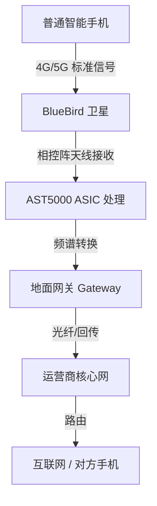

# AST SpaceMobile (NASDAQ: ASTS) 深度调研报告

> 让普通智能手机直接连卫星上网/通话——不依赖地面基站，不改造手机硬件。

---

## 1. 公司概况

| 维度 | 详情 |
|------|------|
| **全称** | AST SpaceMobile, Inc.（原名 AST & Science） |
| **成立** | 2017 年 5 月 31 日 |
| **创始人/CEO** | Abel Avellan（委内瑞拉裔美国人，卫星通信老兵，曾以 $550M 出售前公司 EMC） |
| **总部** | Midland, Texas, USA |
| **上市方式** | 2021 年 4 月通过 SPAC 合并（NPA）上市 |
| **股票代码** | NASDAQ: ASTS |
| **员工数** | ~1,126 人（2025 年底），全球近 1,800 人 |
| **制造设施** | 近 500,000 平方英尺（Texas + Florida），月产能 6 颗卫星 |
| **专利** | 3,800+ 项专利及申请 |
| **市值** | ~$25-30B（2026 年 5 月，股价 ~$65-75） |
| **52 周范围** | $18.22 - $129.89 |

Abel Avellan 是典型的连续创业者。2016 年出售 Emerging Markets Communications（$550M）后，2017 年创立 AST，目标是建造"太空中的蜂窝基站"——让普通 4G/5G 手机直接连卫星。公司获得 AT&T、Verizon、Vodafone、Google、Rakuten、American Tower、Bell Canada 等战略投资者支持。

---

## 2. 核心技术

### 2.1 核心理念："超大天线 = 手机能连"

AST 的技术路线可以一句话概括：**地面手机不改，卫星天线做到最大**。

链路预算（Link Budget）是 D2C（Direct-to-Cellular）的根本物理约束。普通手机发射功率极小（~0.2W），卫星在几百公里外要收到这个微弱信号，要么卫星天线足够大（AST 路线），要么卫星足够多（Starlink 路线）。

### 2.2 BlueWalker 3 测试卫星（2022-2023）

| 里程碑 | 时间 | 详情 |
|--------|------|------|
| **发射** | 2022 年 11 月 | 搭载 Falcon 9 入轨 |
| **天线展开** | 2022 年底 | 693 平方英尺（64 m²），当时 LEO 最大商业通信阵列 |
| **首次双向语音通话** | 2023 年 4 月 | 从 Texas 打到日本 Rakuten，AT&T 频谱，Samsung Galaxy S22 |
| **4G LTE 下载** | 2023 年 6 月 | 夏威夷测试，10.3 Mbps，使用 AT&T 频谱 + Nokia RAN |
| **首次 5G 语音通话** | 2023 年 9 月 | 夏威夷 → 西班牙 Madrid（Vodafone 工程师），Samsung Galaxy S22 |
| **最高下载速度** | 2023 年 9 月 | ~14 Mbps（4G 频谱视频通话） |
| **兼容性** | 全部验证 | 兼容所有主流手机厂商，支持 2G/4G LTE/5G |

**关键结论**：BW3 成功验证了核心专利架构——标准手机 + 运营商频谱 + 空间蜂窝宽带，全部可行。测试后确认 BlueBird Block 1 设计无需重大修改。

### 2.3 BlueBird 卫星星座

#### Block 1（第一代，已发射）

| 参数 | 详情 |
|------|------|
| 数量 | 5 颗（BlueBird 1-5） |
| 发射时间 | 2024 年 9 月（Falcon 9 一箭五星） |
| 天线面积 | ~693 平方英尺（与 BW3 相似） |
| 现状 | 在轨运行，已用于运营商测试（视频通话等） |

#### Block 2（第二代，在产/在发）

| 参数 | Block 2 详情 | vs Block 1 |
|------|-------------|-----------|
| **天线面积** | ~2,400 平方英尺（220 m²） | **3.5 倍** |
| **数据容量** | 10 倍于 Block 1 | — |
| **单星峰值速度** | 高达 120 Mbps/cell | — |
| **覆盖小区数** | >2,000 个 active cells/星 | — |
| **重量** | ~6,100 kg | — |
| **设计寿命** | 7 年 | — |
| **核心芯片** | AST5000 ASIC（台积电代工，10 GHz 处理带宽） | 全新 |
| **单星成本** | $21-23M（含制造+发射） | 比 Block 1 略高 |

**发射进展**（截至 2026 年 5 月）：

| 卫星 | 状态 | 发射时间 | 火箭 | 备注 |
|------|------|----------|------|------|
| BlueBird 6 | ✅ 在轨运行 | 2025.12.24 | 印度 LVM3 | 首颗 Block 2，已展开天线 |
| BlueBird 7 | ❌ 已损失 | 2026.04.19 | Blue Origin New Glenn | 二级故障，入轨高度不足（154×494 km vs 目标 460 km），已脱轨 |
| BlueBird 8-11 | 🔜 即将发射 | 2026 中 | Falcon 9 | 一箭四星 |
| BlueBird 12-32 | 🏭 制造中 | 2026 陆续 | 多提供商 | — |

#### 星座规模目标

| 阶段 | 卫星数 | 覆盖能力 |
|------|--------|---------|
| **间歇服务** | 25 颗（含 5 颗 Block 1 + 20 颗 Block 2） | 非连续覆盖，可开始运营商试用和产生运营现金流 |
| **连续美国覆盖** | 45-60 颗 | 美国、欧洲、日本连续覆盖，启动正式商用 |
| **全球目标市场** | ~90 颗 | 覆盖所有目标市场 |
| **长期规划** | 243 颗（FCC 授权上限） | 全球全天候覆盖 |

### 2.4 关键技术原理

- **超大相控阵天线**：2,400 平方英尺，是 AST 的核心壁垒。面积越大，增益越高（克服手机弱信号），波束越窄（频率复用效率高）。
- **AST5000 ASIC**：自研专用芯片，10 GHz 处理带宽，实现软件定义波束赋形（beamforming），一颗星同时服务数千个地面小区。
- **频谱策略**：使用 MNO 合作伙伴授权的低/中频段频谱（850 MHz、700 MHz、L-band、S-band 等），覆盖范围达 1,150 MHz。另有自有 L/S-band 频谱。
- **与现有手机完全兼容**：3GPP 标准协议，手机无需软硬件修改，运营商网络无需改造。

---

## 3. 商业模式

### 3.1 盈利方式

AST 不是直接面向消费者（B2C），而是**批发模式（Wholesale / B2B2C）**：

1. **运营商分成**：MNO 将 AST 的卫星服务作为网络延伸，用户在地面基站覆盖外自动漫游到卫星，运营商向用户收费，与 AST 分成。
2. **网关设备销售**：运营商需购买地面网关（Gateway）连接卫星网络与地面核心网（2025 年 Q4 收入主力）。
3. **美国政府合同**：国防/应急通信服务（已与 U.S. Government 签约，且与 FirstNet 合作）。
4. **咨询服务**：向 MNO 提供网络集成咨询。

**单位经济模型展望**（管理层指引）：
- 长期 EBITDA 利润率可达 **90% 或更高**（卫星在轨后增量成本极低）。
- 2027 年收入机会接近 **$10 亿**，其中大部分为长期合同或高复购收入。
- 政府业务也有数十亿年收入潜力。

### 3.2 已签署运营商

| 运营商 | 合作类型 | 金额/承诺 | 时间 |
|--------|---------|----------|------|
| **AT&T** | 商业协议（至 2030） | 含 $20M 收入承诺 + gateway 订单 | 2024.05 |
| **Verizon** | 商业协议（2026 起） | $100M（$65M 预付款 + $35M 可转债） | 2024.05/2025.10 |
| **Vodafone** | 10 年协议（至 2034） | 含 $25M 预付款，欧洲合资 SatCo | 2024.12 |
| **stc（沙特）** | 10 年区域独家 | $175M 预付款 | 2025 |
| **Rakuten Mobile** | 日本合作 | 投资者 + 测试合作伙伴 | 早期 |
| **Bell Canada** | 扩展合作 | 投资者 + 商业协议 | 2025 |
| **FirstNet** (AT&T) | 公共安全 beta | H1 2026 面向急救人员和商业用户 | 2026 |

- **总计**：50+ MNO 合作伙伴，覆盖 ~30 亿用户
- **已签约合同收入承诺**：**$12 亿+**

### 3.3 目标市场

- **公司自称 TAM**：$1 万亿（含全球移动连接市场）
- **第三方预测**（ABI Research）：D2C 服务收入市场 **2030 年超 $160 亿**
- **核心场景**：
  - 美国/欧洲农村和偏远地区（消除信号死区）
  - 非洲/发展中国家（跳过地面基建，直接卫星覆盖）
  - 政府和国防（战场、救灾、边境通信）
  - 海事/航空（海上、飞机上连接）
  - 物联网（远程传感器、资产追踪）

---

## 4. 营收与财务

### 4.1 核心财务数据

| 指标 | FY2024 | FY2025 | 同比 |
|------|--------|--------|------|
| **营收** | $4.4M | **$70.9M** | **+1,511%** |
| **Q4 营收** | $1.9M | $54.3M | +2,731% |
| **营业亏损** | -$247.2M | **-$358.6M** | 扩大 |
| **净亏损** | -$300.1M | **-$341.9M** | 扩大 |
| **每股亏损** | -$1.94 | -$1.34 | 改善 |
| **研发费用** | ~$122M | ~$170.6M | +52% |
| **资本支出** | ~$174M | **$1.06B** | — |
| **自由现金流** | — | **-$1.19B** | — |

### 4.2 资产负债

| 指标 | 2025 年底数值 |
|------|-------------|
| **现金及等价物** | $2.8B |
| **Pro Forma 流动性**（含 2026.02 可转债） | **~$3.9B** |
| **2025 年总融资** | **$3.5B+** |
| **总资产** | ~$2.55B |
| **总负债** | ~$924.9M |
| **每股净资产** | ~$4.56 |
| **已签约合同积压** | $1.2B+ |

### 4.3 烧钱分析

**年度固定成本底线 ~$2.98 亿**：

| 固定成本项目 | 年化金额 |
|-------------|---------|
| Ligado L-band 频谱义务 | ~$96M |
| 工程和研发 | ~$170.6M |
| 利息支出 | ~$31.8M |
| **合计** | **~$298M** |

在此基础上还要加上卫星制造成本（Block 2 单星 $21-23M，2026 年目标 45-60 颗意味着额外 $1.2-1.4B CapEx）。

**现金跑道**：按 FY2025 总烧钱速度，约 **4-4.8 年**。管理层称现有现金足够建设 100+ 颗卫星的全部星座，近期无需额外可转债融资。

### 4.4 2026 年指引

| 指标 | 指引范围 |
|------|---------|
| **全年营收** | **$150M - $200M**（至少翻倍） |
| Q1 调整后 OpEx（不含 COGS） | $70M - $80M |
| Q1 资本支出 | $350M - $425M |
| 收入构成 | 网关交付 + 政府里程碑 + 咨询 + 潜在初期商业服务收入 |
| 催化剂 | 约一半收入已合同锁定，上行空间来自额外政府和商业合同 |

**2027 年**：管理层认为年收入有机会接近 $10 亿。

### 4.5 估值

| 估值指标 | 数值 |
|---------|------|
| **市值** | ~$25-30B（2026.05） |
| **市销率（Trailing P/S）** | ~**380-400x** |
| **远期 P/S（基于 2026 指引中值）** | ~**140-170x** |
| **市净率（P/B）** | ~**20x** |
| **机构平均目标价** | ~$52.94（显著低于现价） |
| **评级共识** | Reduce（偏负面） |

> 对一个年营收 $71M、净亏损 $342M 的公司，$25-30B 市值意味着市场在赌 5-10 年后的现金流。Tile> 这估值没有安全边际——任何执行上的闪失都会引发估值的剧烈收缩。

---

## 5. 竞争格局

### 5.1 核心竞争对手对比

| 维度 | **AST SpaceMobile** | **SpaceX Starlink D2C** | **Lynk Global** | **Apple/Globalstar** |
|------|-------------------|------------------------|-----------------|---------------------|
| **技术路径** | 超大天线（~2,400 sq ft） | 小天线（~65 sq ft）+ 大量卫星 | 极小卫星（鞋盒大小） | 专用 MSS 频谱 + 定制芯片 |
| **当前服务** | 预商用（2026 H2 目标） | **已商用**：短信 + 部分 App | 已商用：短信 + 警报（多国） | 已商用：紧急 SOS/信息 |
| **服务等级** | **完整 4G/5G 宽带**（语音+视频+数据） | 短信 → 语音/数据（2025+） | 短信（非实时，延迟可达 30 分钟） | 紧急消息 + 低带宽 |
| **D2C卫星在轨** | 6 颗（1 颗损失） | **650 颗** | ~3 颗（计划 5,000） | ~17 颗（Globalstar 现有） |
| **总卫星产能** | 月产 6 颗 | 月产 ~340 颗（所有型号） | 极少 | 17 颗新卫星计划中 |
| **天线面积比** | **35-40x** Starlink D2C 天线 | 基线 | 更小 | 不适用 |
| **频谱** | MNO 伙伴频谱 + L/S-band | EchoStar AWS-4/H-block（~$17B 收购）+ T-Mobile 频谱 | 无自有频谱，依赖 MNO | MSS 频谱 |
| **美国运营商** | **AT&T + Verizon** | T-Mobile | 无美国运营商 | Apple 独占 |
| **用户覆盖** | ~30 亿（MNO 伙伴） | **1,600 万+** 已连接用户 | 多国小规模 | 数百万 iPhone 用户 |
| **核心壁垒** | 专利（3,800+）+ 硬件 + 运营商关系 | **垂直整合（发射+卫星+频谱）+ 规模** | 低成本 + 多国 MNO | 设备生态锁定 |
| **下一代** | BlueBird Block 2（更轻、更便宜） | Gen 2 NR NTN（2027） | — | Amazon Leo（2028，收购 Globalstar） |

### 5.2 差异化分析

**AST vs Starlink 的核心差异不是"谁更快"，而是设计哲学的根本分歧：**

| 维度 | AST（少而大） | Starlink（多而小） |
|------|------------|-----------------|
| 卫星天线 | **2,400 sq ft** | ~65 sq ft |
| 覆盖每颗星 | >2,000 cells | 约 7-10 cells |
| 峰值速度/cell | 120 Mbps | 当前短信为主 |
| 需要完整覆盖 | ~45-60 颗 | 数千颗 |
| 轨道碎片风险 | 低 | 高（34,000 颗计划） |

**AST 的结构性优势**：
1. **AT&T + Verizon 是独家合作伙伴**（不与 Starlink 签约）。美国第二大和第一大运营商是 AST 的盟友，这对 Starlink D2C 在美国构成事实上的用户上限。
2. **天线大 35-40x** = 物理定律级别的优势。Starlink 靠数量弥补，但 V2/V3 卫星升级前单星能力差距客观存在。
3. **3,800+ 专利**可能构成法律护城河。

**Starlink 的结构性优势**：
1. **已经在收钱**：650 颗 D2C 卫星已入轨，1,600 万用户在用（2026 年 4 月数据）。
2. **产能碾压**：月产 340 颗卫星 vs AST 月产 6 颗。
3. **垂直整合**：自造火箭、自造卫星、自有频谱（$17B EchoStar 收购），不依赖外部提供商。
4. **品牌和资金**：Musk/Starlink 品牌 + 几乎无限的资金。

### 5.3 其他竞争者

| 竞争者 | 定位 | 状态 |
|--------|------|------|
| **Amazon Leo (Project Kuiper)** | 收购 Globalstar 后进入 D2C，获 MSS 频谱 + Apple 关系 | 2028 年部署目标 |
| **Lynk Global** | "太空基站"低成本路线，专注短信，合并 Omnispace + SES 背书 | 已商用（短信），融资存疑 |
| **Skylo** | 与 Google 合作 Android 紧急消息，已有数百万活跃设备 | 已商用 |
| **中国** | 两个大型星座计划（对标 Starlink） | 建设中 |

---

## 6. 风险因素

### 6.1 发射执行风险 ⚠️ **最核心风险**

- **BlueBird 7 损失**（2026.04.19）：New Glenn 二级故障，卫星脱轨。虽然保险覆盖了 $30M 卫星成本，但 **timeline 受损**。
- New Glenn 调查可能导致该火箭停飞数月，影响后续密集发射计划。
- 2026 年目标 45 颗卫星在轨，目前仅 6 颗在轨（BW3 + BB 1-5 + BB 6），按最大算术极限可能只有 12-13 颗实际入轨。
- 发射延迟 = 收入推后 = 烧钱继续 = 估值压力。

### 6.2 技术未完全验证

- Block 2 卫星（2400 sq ft）比 BW3 大 3.5x，天线展开机构尚未在 Block 2 上完全验证规模量产可靠性。
- AST5000 ASIC 未经验证大批量在轨表现。
- 2025 年 Q3 营收仅 $1.15M vs 预期 $6.4M，显示商业收入节奏仍极不确定。

### 6.3 竞争威胁

- Starlink 已经跑在前面：650 颗 D2C 卫星 + 1,600 万用户。
- Starlink Gen 2 NR NTN（2027）可能大幅缩小单星能力差距。
- Amazon Leo 2028 年加入战场，财力雄厚 + Apple 生态系统。
- **最坏的场景**：AST 还在爬坡的时候，Starlink 和 Amazon 用规模和资金优势把价格战打到 AST 无利可图。

### 6.4 资金和稀释

- 2025 年融资 $3.5B+，主要通过可转债（$2.2B）和 ATM 股票增发。
- 股份数从 2024 年 8 月的 **1.485 亿 → 现在 3.8 亿**（两年稀释 **213%**）。
- 2025 年 10 月和 2026 年 2 月两轮可转债共 ~$2B，转股价 $116.30/股。
- American Tower 等内部投资者在大举套现减持（过去 6 个月卖了 230 万股，~$160M）。

### 6.5 监管和频谱

- FCC 已批准 248 颗 LEO 卫星的星座运行许可（2026 年）。
- 但各国频谱审批分步进行，欧洲/非洲等地区监管进程可能慢于预期。
- Ligado L-band 频谱义务 $96M/年，是固定成本负担。

### 6.6 天文光污染争议

- 大型卫星天线展开后亮度极高，天文学家持续抗议。
- 目前已与 NSF（美国国家科学基金会）达成协调协议，但这可能限制未来星座规模和运行方式。

### 6.7 估值风险

- P/S ~400x，几乎没有安全边际。
- 如果 2026 年发射节奏不及预期，股价可能回撤 50-70%（对标卫星同业平均估值）。
- "Show me" 年——市场在要求执行兑现，不兑现就重估。

---

## 7. 近期催化剂

### 2026 年关键时间线

| 时间 | 事件 | 重要性 |
|------|------|--------|
| **2026 Q2** | BlueBird 8-11 发射（Falcon 9 一箭四星） | 🔴 关键——验证多星发射和快速部署能力 |
| **2026 H1** | AT&T FirstNet beta 服务启动（面向急救人员和商业用户） | 🔴 关键——首个商用级服务 |
| **2026 年持续** | 每 1-2 个月一次发射 | 🟡 跟踪发射节奏是否兑现 |
| **2026 H2** | 正式商用服务激活 | 🔴 关键——收入模式的真正转折 |
| **2026 年底** | 目标 45 颗卫星在轨（25 颗 Block 2 + 5 颗 Block 1 + BW3） | 🔴 关键——持续覆盖的前提条件 |

### 潜在超预期因素

- 额外的美国政府/国防合同签署
- 新运营商加入（中东、拉美、亚洲）
- Starlink New Glenn 调查比预期更短，快速恢复发射
- 与 AT&T/Verizon 的具体定价公告

---

## 8. 投资总结

### 牛市论

> AST 拥有真正的技术壁垒（超大相控阵天线），不可复制的运营商关系（AT&T + Verizon = 美国两强独家），1.2B 已锁定合同，3.9B 现金支撑 100+ 颗卫星建设。如果 2026-2027 年顺利部署 45-90 颗卫星并启动商用，这家公司就是"太空中的 Verizon"——高毛利（90% EBITDA）、全球覆盖、牢不可破的运营商绑定。

### 熊市论

> 这家公司年营收 $71M、亏损 $342M、烧钱 $1.2B，却值 $25-30B。Starlink 已有 1,600 万用户而 AST 一颗 Block 2 刚刚丢在海上。发射延迟几乎注定发生，每延迟一年多烧 $1.2B，两年股份稀释 213%。执行的落差一旦显现，400x P/S 可以在一周内变成 50x。

### 核心观察

这是一个**极端不对称**的赌注：
- **上行**：如果成功，可能是未来十年最重要的电信基础设施公司之一，市场空间数千亿。
- **下行**：如果失败（发射频频延迟、Starlink 压制、资金链断裂），归零风险不可忽视。
- **最可能的路径**：介于两者之间——部分成功，成为利基市场的"随时连接"选项，但 Starlink 仍然是规模和市占率之王。

**关键判断变量**：
1. **发射节奏**：2026 年到底能发几颗 Block 2？BB 7 损失后 timeline 还能保吗？
2. **运营商转化**：AT&T/Verizon 何时、以什么价格推出商用服务？用户实际渗透率如何？
3. **Starlink Gen 2**：2027 年 NR NTN 标准卫星上线后，单星 D2C 能力是否追平或接近 AST？
4. **现金消耗**：2026-2027 年是否需要新一轮融资？如果需要在什么价格稀释？

---

## 参考来源

- AST SpaceMobile 官方 IR 页面（investors.ast-science.com）
- SEC 10-K/10-Q 文件（FY2025）
- SEC 8-K 文件（BlueBird 7 损失公告，2026.04.19）
- AST SpaceMobile Investor Presentation (May 2025)
- New Space Economy: "Direct-to-Device Satellite Services" (2025.06)
- NASASpaceFlight: "BlueBird 7 declared lost" (2026.04.19)
- SpaceNews: 多篇 BW3 测试、Vodafone 协议、FCC 审批报道
- PCMag / TechCrunch / Fast Company / LightReading: 多篇 D2C 行业对比分析
- MetricDuck Research: 10-K 深度分析 (2026.03.22)
- ABI Research: "AST Eyes Commercial Liftoff" (2026.05.01)
- Yahoo Finance / StockAnalysis / MarketBeat: 股价和估值数据