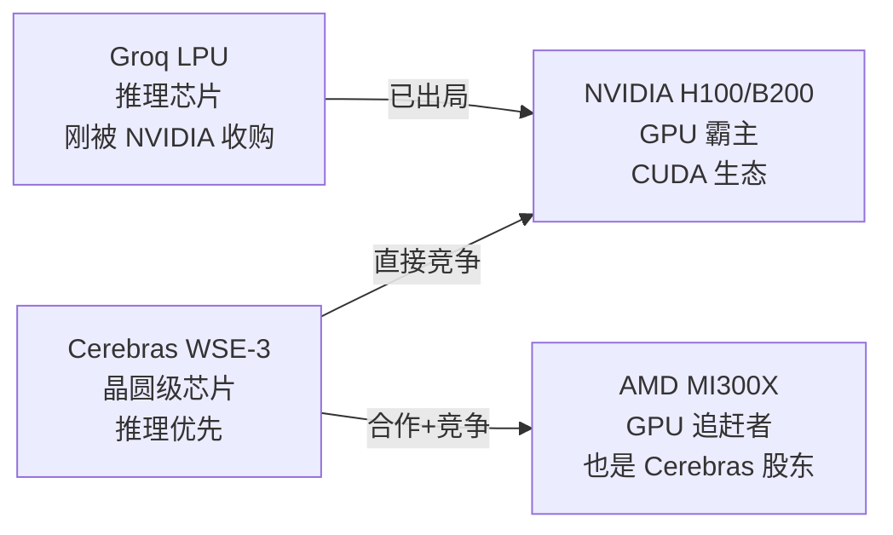

# Cerebras Systems IPO 分析

## 一句话总结

晶圆级 AI 芯片的唯一玩家，技术独一份，但客户集中度是致命伤。首日 +108% 是市场对"NVIDIA 替代品"叙事的饥渴定价，基本面撑不住 $564亿。

---

## 公司概览

| 项目 | 详情 |
|:---|:---|
| 全称 | Cerebras Systems, Inc. |
| 成立 | 2015年，Sunnyvale, CA |
| CEO | Andrew Feldman（前 SeaMicro 创始人，2012 年被 AMD $3.34亿收购） |
| CTO | Sean Lie |
| 核心产品 | Wafer Scale Engine (WSE-3) + CS-3 超算系统 |
| 定位 | NVIDIA GPU 的替代方案，聚焦 AI 推理 + 训练 |
| 总融资额 | $46.2亿 |
| 上市 | **2026年5月14日，Nasdaq: CBRS** |

---

## IPO 核心数据

| 指标 | 数据 |
|:---|:---|
| 首次申报 | 2026年4月17日（第二次申报，2024年曾撤回） |
| 初始定价区间 | $115–$125 |
| 第一次上调 | $150–$160 |
| 最终定价 | **$185** |
| 募资额 | **$55亿**（3000万股 × $185） |
| 首日收盘涨幅 | **+108%** |
| 完全稀释估值 | **$564亿** |
| CEO 持股 | 1030万股，约 $12.8亿（不卖老股） |
| 承销商 | Morgan Stanley, Citi, Barclays, UBS, Mizuho 等 |

### 股权结构（三类股票）

| 类别 | 投票权 |
|:---|:---|
| Class A | 1 票/股 |
| Class B | 20 票/股（创始人控制权） |
| Class N | 无投票权（OpenAI 持有 warrant） |

---

## 核心技术：晶圆级引擎 WSE-3

芯片行业的异类——别人把 12 寸晶圆切成几百个小芯片分别封装，Cerebras **一整片晶圆就是一个芯片**。

### WSE-3 vs NVIDIA H100

| 参数 | WSE-3 | NVIDIA H100 | 倍数 |
|:---|:---|:---|:---|
| 制程 | TSMC 5nm | TSMC 4nm | — |
| 晶体管 | **4万亿** | 800亿 | 50× |
| AI 核心 | 90万个 | 1.68万 CUDA | 53× |
| 片上内存 | 44GB SRAM | 80GB HBM | — |
| 内存带宽 | **21 PB/s** | 3.35 TB/s | **6,270×** |
| 算力 (FP8) | ~125 PFLOPS | ~2 PFLOPS | 63× |
| 芯片面积 | **56倍于 H100** | 814 mm² | 56× |
| 单系统价格 | ~$250万 | ~$30万 (DGX) | 8× |

### 技术路线的哲学

$$
\text{传统 GPU 集群} = \text{几百个小芯片} + \text{慢速片间互联} \implies \text{内存带宽是瓶颈}
$$

$$
\text{Cerebras WSE} = \text{一整片晶圆} + \text{片上 SRAM 直连} \implies \text{消除 off-chip 延迟}
$$

**优点：**
- 推理速度快 —— 声称比 NVIDIA 快 20 倍
- 片上 21 PB/s 带宽，不受 HBM 容量和带宽限制
- 数据并行训练近线性扩展

**缺点：**
- 44GB SRAM 太小 —— 只能装 ~20B 参数模型（FP16），大模型需要 MemoryX 外部流式权重
- 单芯片 $250 万，比 8×H100 的 DGX 贵 5-8 倍
- 没有 CUDA 生态，软件适配是巨大隐性成本

---

## 财务分析

### 收入与利润

| 年份 | 收入 | 净利润 | 备注 |
|:---|:---|:---|:---|
| 2024 | ~$2.9亿 | **-$4.01亿** | G42 优先股会计处理导致巨亏 |
| 2025 | **$5.1亿** | **+$2.38亿** | 同比增 76%，扭亏为盈 |

> ⚠️ 2025 年净利润有水分：G42 的优先股负债在 2024 年被计为 $4.01亿亏损，2025 年消除后产生 $3.63亿 纸面收益。

### 收入结构（致命问题）

| 客户来源 | 2025 年占比 |
|:---|:---|
| **阿联酋（G42）** | **86%** |
| 美国 | 14% |

| 美国客户收入 | 2024 | 2025 | 变化 |
|:---|:---|:---|:---|
| 美国 | $2.83亿 | $1.88亿 | **-34%** |

**86% 收入来自一个地缘敏感的阿联酋实体**——这在 IPO 公司里几乎独一无二。

### 订单积压与未来预期

| 指标 | 数据 |
|:---|:---|
| 合同订单积压 | **$246亿** |
| 其中 OpenAI 合同 | $200亿+（750MW 至 2028） |
| 分析师预估 2026 收入 | $11亿（+118%） |
| 分析师预估 2027 收入 | $23亿（+108%） |
| 预估 2025 营业利润率 | -28.6% |
| 预估 2026 营业利润率 | -20.8% |
| 预估 2027 营业利润率 | -13.7% |

---

## 融资历程

| 轮次 | 日期 | 金额 | 估值 | 关键投资者 |
|:---|:---|:---|:---|:---|
| 多轮早期 | 2016–2024 | ~$25亿 | — | Benchmark, Vy Capital, Fidelity |
| Series G | 2025年10月 | $11亿 | $81亿 | 超额认购 |
| Series H | 2026年2月 | $10亿 | $230亿 | **AMD**, Fidelity, Benchmark |
| IPO | 2026年5月 | $55亿 | $564亿 | 公开市场 |

---

## 重大合作

| 合作方 | 金额 | 内容 |
|:---|:---|:---|
| **OpenAI** | $200亿+ | 750MW 算力 (2026–2028)，可选扩展至 3GW (2030前) |
| OpenAI 贷款 | $10亿 | 6% 利率，secured promissory note |
| **AWS** | $10亿 | Trainium3 + CS-3 联合推理方案 |
| **G42** | — | 最大股东/客户，阿联酋 AI 公司 |
| **AMD** | 投资 | Series H 参投 |

---

## 竞争格局

| 维度 | Cerebras | NVIDIA | AMD |
|:---|:---|:---|:---|
| 芯片架构 | 晶圆级单片 | 小芯片 GPU | 小芯片 GPU |
| 软件生态 | 自研编译器 | **CUDA（不可撼动）** | ROCm（追赶中） |
| 推理速度 | ⭐⭐⭐ | ⭐⭐ | ⭐⭐ |
| 训练生态 | ⭐ | ⭐⭐⭐ | ⭐⭐ |
| 客户多样性 | ⭐ | ⭐⭐⭐ | ⭐⭐ |
| 估值/收入 | 110× PS | ~30× PS | ~10× PS |

---

## 风险评估

### 🔴 致命风险

**1. 客户集中度极端**

86% 收入来自阿联酋 G42。2024 年 CFIUS（美国外资投资委员会）审查 G42 对 Cerebras 的投资，直接导致第一次 IPO 撤回。地缘政治稍有风吹草动，股价可能腰斩。

**2. 美国客户在逃离**

美国客户收入从 $2.83亿（2024）降至 $1.88亿（2025），降幅 34%。美国客户不买账是很糟糕的信号。

### 🟡 中等风险

**3. CUDA 护城河**

NVIDIA 的 CUDA 生态积累 15 年，全球 AI 研究者默认用 CUDA。Cerebras 有自己的编译器，但生态差距是数量级的。这不是硬件性能能解决的问题。

**4. OpenAI 单一大合同**

$200亿订单听着唬人，但如果 OpenAI 自研芯片成功（他们正在做），或者转向其他供应商，Cerebras 的增长故事瞬间崩塌。

**5. SRAM 容量硬伤**

44GB SRAM 决定了 WSE-3 只能装中小模型。大模型需要 MemoryX 外挂 + 流式权重加载，架构复杂度剧增。

### 🟢 相对可控

**6. 估值泡沫**

$564亿对应 $5.1亿收入，PS 110×。但这是 AI 芯片赛道目前的常态，不算独有风险。

---

## 估值分析

### 可比公司

| 公司 | 市值 | 2025 收入 | PS |
|:---|:---|:---|:---|
| NVIDIA | ~$3万亿 | $1300亿 | ~23× |
| AMD | ~$2000亿 | $280亿 | ~7× |
| Broadcom | ~$9000亿 | $540亿 | ~17× |
| CoreWeave | ~$300亿 | $32亿 | ~9× |
| **Cerebras** | **$564亿** | **$5.1亿** | **110×** |

### 分析师目标价

Douglas Research（Substack 独立分析师）：
- 基础估值：$417亿（$192/股，+54% vs IPO 区间上限）
- 2026 收入预估：$11亿
- 2027 收入预估：$23亿

---

## 综合判断

**技术上值得尊敬，但作为投资标的是个大赌注。**

Cerebras 的晶圆级芯片确实是过去十年半导体行业最有想象力的架构创新之一。21 PB/s 片上带宽消除了 AI 推理的核心瓶颈，这是 NVIDIA 用任何先进封装都做不到的。

但投资不是投技术，是投商业。三个问题无解：

1. **G42 依赖** — 86% 收入来自阿联酋，CFIUS 随时可以卡第二次
2. **美国客户不买账** — 收入下降 34%，NVIDIA 生态锁定太深
3. **OpenAI 赌注** — $200亿合同占订单积压大头，单一客户风险极高

**结论：** 首日 +108% 后的 $564亿 估值太贵。等回调到 PS 30–40× 区间（对应 $150–200亿市值）才是值得认真考虑的入场点。但必须密切关注 CFIUS 动向和 G42 收入占比的变化趋势——如果美国客户收入能回到增长轨道，估值逻辑才站得住。

---

## 后续关注

- [ ] CFIUS 是否有新一轮审查消息
- [ ] Q2 2026 财报 — 美国客户收入是否止跌
- [ ] OpenAI 自研芯片进展
- [ ] AWS Trainium3 + CS-3 合作落地情况
- [ ] WSE-4 发布节奏