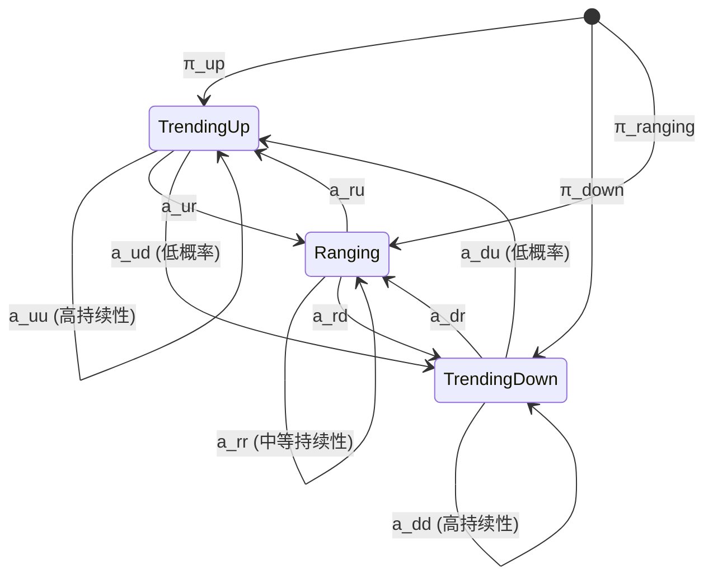
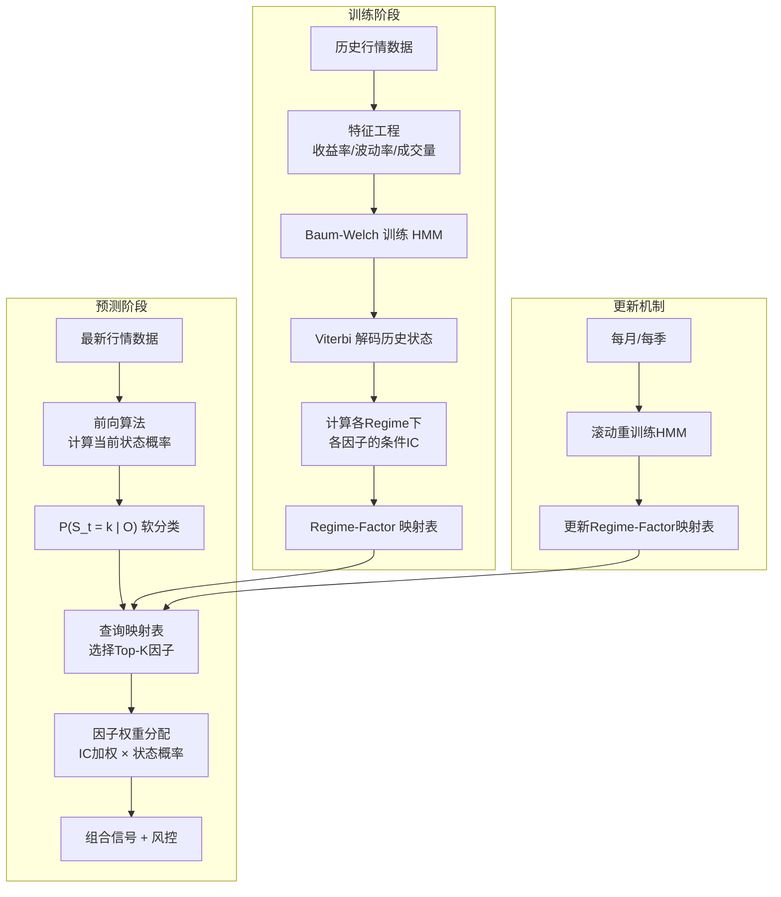

# HMM市场状态识别与因子择时

> **Motivation**: "We don't just pick stocks — we pick the right strategy for the right regime." — 源自 Citadel GQS (Global Quantitative Strategies) 的核心理念。市场在不同状态下，同一因子的表现天差地别：动量因子在趋势市中 IC 显著，在震荡市中失效；低波动因子在熊市中抗跌，在牛市中跑输。**识别当前市场状态 → 选择该状态下最优因子**，是实现因子择时（Factor Timing）的核心路径。

---

## 1. 为什么需要 Regime Detection？

### 1.1 因子表现的 Regime 依赖性

panda_factor 已有实证（见 [[panda_factor-下一步规划]] 3.3 节）：

| Regime | 最强因子 | Rank IC |
|--------|---------|---------|
| Bear_HighVol | roe_change | -0.142 |
| Bear_HighVol | gross_margin_change | -0.134 |
| Bear_NormalVol | volatility_20d | -0.140 |
| Bull_NormalVol | volatility_20d | -0.113 |
| Bull_HighVol | momentum_20d | -0.106 |
| Bear_LowVol | block_discount_20d | +0.111 |

**同一因子在不同 regime 下的 IC 分化显著**——不区分状态的平均 IC 会掩盖大量信息。

### 1.2 静态因子配置的缺陷

等权或固定权重配置忽略了一个基本事实：**市场状态会切换**。panda_factor 的 Regime Rotation 实验（训练 2017-2019，测试 2020-2024）表明：

| 方法 | Sharpe | 最大回撤 | 累积收益 |
|------|--------|---------|---------|
| EW Fixed (14因子) | -0.303 | -67.7% | -34.8% |
| **Rotation Kalman** | **0.034** | **-37.2%** | **+1.8%** |

Regime Rotation 将回撤降低了近一半（-67.7% → -37.2%）。但 14 因子池本身质量不足，限制了上行——这正是本笔记要系统性解决的问题。

---

## 2. HMM 数学框架

### 2.1 模型定义

隐马尔可夫模型由以下要素定义：

$$
\lambda = (S, O, \pi, A, B)
$$

| 符号 | 含义 | 金融语境 |
|------|------|---------|
| $S = \{s_1, \ldots, s_N\}$ | 隐藏状态集合 | 市场状态（如 3 状态：Trend Up / Trend Down / Ranging） |
| $O = \{o_1, \ldots, o_M\}$ | 观测序列 | 收益率、波动率、成交量等可观测市场数据 |
| $\pi = [\pi_i]$ | 初始状态分布 | 初始时刻处于各状态的概率 |
| $A = [a_{ij}]$ | 转移矩阵 $N \times N$ | 市场从一个状态转移到另一个状态的概率 |
| $B = [b_j(o_t)]$ | 发射概率分布 | 给定状态 $j$，观测到 $o_t$ 的概率（常用高斯分布） |

#### 转移矩阵

$$A = \begin{bmatrix} a_{11} & a_{12} & a_{13} \\ a_{21} & a_{22} & a_{23} \\ a_{31} & a_{32} & a_{33} \end{bmatrix}, \quad a_{ij} = P(q_{t+1} = s_j \mid q_t = s_i)$$

- **对角线元素** $a_{ii}$ 高 → 该状态持续性强（persistent regime）
- <span style="color:rgb(255, 77, 77)">在金融市场中，趋势状态通常比震荡状态更持久</span>

#### 发射概率（高斯 HMM）

$$b_j(o_t) = \mathcal{N}(o_t \mid \mu_j, \Sigma_j) = \frac{1}{(2\pi)^{d/2}|\Sigma_j|^{1/2}} \exp\left(-\frac{1}{2}(o_t - \mu_j)^T \Sigma_j^{-1}(o_t - \mu_j)\right)$$

- $\mu_j$: 状态 $j$ 下观测变量的均值向量
- $\Sigma_j$: 状态 $j$ 下观测变量的协方差矩阵
- 金融中常取 `covariance_type="full"` 以捕捉收益率与波动率的相关性

### 2.2 三大核心算法

```mermaid
graph TD
    A[观测序列 O] --> B{任务类型}
    B -->|"P(O｜λ) = ?"| C[前向-后向算法<br/>Forward-Backward]
    B -->|"λ* = argmax P(O｜λ)"| D[Baum-Welch算法<br/>EM参数估计]
    B -->|"Q* = argmax P(Q｜O, λ)"| E[Viterbi算法<br/>最优状态解码]
    
    C --> C1[前向α: 递推计算局部概率]
    C --> C2[后向β: 反向递推计算]
    C1 --> C3["P(O｜λ) = Σ α_T(i)"]
    
    D --> D1["E-step: 计算 γ_t(i), ξ_t(i,j)"]
    D --> D2["M-step: 更新 π, A, μ, Σ"]
    D1 --> D2
    D2 --> D1
    D2 --> D3[收敛? → 返回 λ*]
    
    E --> E1["δ_t(j) = max_i[δ_{t-1}(i)·a_{ij}]·b_j(o_t)"]
    E --> E2[回溯指针 ψ_t(j)]
    E1 --> E3[最优状态序列 Q*]
```

#### 算法 1: 前向-后向（概率计算）

**前向算法** — 计算 $P(O \mid \lambda)$：

$$\alpha_t(i) = P(o_1, o_2, \ldots, o_t, q_t = s_i \mid \lambda)$$

递推：
$$\alpha_1(i) = \pi_i \cdot b_i(o_1)$$
$$\alpha_{t+1}(j) = \left[\sum_{i=1}^N \alpha_t(i) \cdot a_{ij}\right] \cdot b_j(o_{t+1})$$

终止：
$$P(O \mid \lambda) = \sum_{i=1}^N \alpha_T(i)$$

**后向算法** — 从末尾反向计算：

$$\beta_t(i) = P(o_{t+1}, o_{t+2}, \ldots, o_T \mid q_t = s_i, \lambda)$$

递推：
$$\beta_T(i) = 1$$
$$\beta_t(i) = \sum_{j=1}^N a_{ij} \cdot b_j(o_{t+1}) \cdot \beta_{t+1}(j)$$

#### 算法 2: Baum-Welch（EM 参数估计）

用于**无监督学习** HMM 参数。核心是 EM (Expectation-Maximization)：

**E-step** — 用当前参数估计隐藏状态概率：

$$\gamma_t(i) = P(q_t = s_i \mid O, \lambda) = \frac{\alpha_t(i) \beta_t(i)}{\sum_{j=1}^N \alpha_t(j) \beta_t(j)}$$

$$\xi_t(i, j) = P(q_t = s_i, q_{t+1} = s_j \mid O, \lambda) = \frac{\alpha_t(i) \cdot a_{ij} \cdot b_j(o_{t+1}) \cdot \beta_{t+1}(j)}{\sum_{k=1}^N \sum_{l=1}^N \alpha_t(k) \cdot a_{kl} \cdot b_l(o_{t+1}) \cdot \beta_{t+1}(l)}$$

**M-step** — 最大化期望，更新参数：

$$\pi_i^* = \gamma_1(i)$$

$$a_{ij}^* = \frac{\sum_{t=1}^{T-1} \xi_t(i, j)}{\sum_{t=1}^{T-1} \gamma_t(i)}$$

$$\mu_j^* = \frac{\sum_{t=1}^T \gamma_t(j) \cdot o_t}{\sum_{t=1}^T \gamma_t(j)}$$

$$\Sigma_j^* = \frac{\sum_{t=1}^T \gamma_t(j) \cdot (o_t - \mu_j^*)(o_t - \mu_j^*)^T}{\sum_{t=1}^T \gamma_t(j)}$$

**收敛判断**: $\max |a_{ij}^{\text{new}} - a_{ij}^{\text{old}}| < \text{tol}$ 或达到最大迭代次数。

#### 算法 3: Viterbi（最优状态解码）

找出最可能的隐藏状态序列 $Q^* = \{q_1^*, q_2^*, \ldots, q_T^*\}$：

$$\delta_t(j) = \max_{q_1, \ldots, q_{t-1}} P(q_1, \ldots, q_{t-1}, q_t = s_j, o_1, \ldots, o_t \mid \lambda)$$

递推（用对数避免下溢）：
$$\delta_1(j) = \log \pi_j + \log b_j(o_1)$$
$$\delta_t(j) = \max_i \left[\delta_{t-1}(i) + \log a_{ij}\right] + \log b_j(o_t)$$
$$\psi_t(j) = \arg\max_i \left[\delta_{t-1}(i) + \log a_{ij}\right]$$

回溯：
$$q_T^* = \arg\max_j \delta_T(j)$$
$$q_t^* = \psi_{t+1}(q_{t+1}^*), \quad t = T-1, \ldots, 1$$

---

## 3. 市场三状态定义



### 状态的经济含义

| 状态 | 观测特征 | 因子行为 |
|------|---------|---------|
| **Trending Up** (S=0) | 收益率为正、波动率中等或偏低、成交量温和放大 | 动量因子 IC↑，反转因子 IC↓，低波因子 IC 中性 |
| **Trending Down** (S=1) | 收益率为负、波动率升高、成交量放大（恐慌） | 低波动/质量因子 IC↑，动量因子可能失效，反转因子在极端时有效 |
| **Ranging** (S=2) | 收益率接近零、波动率低、成交量萎缩 | 反转因子 IC↑，均值回复策略有效，趋势因子 IC↓ |

### 观测变量选择

训练 HMM 的观测向量 $o_t = [r_t, \sigma_t, v_t]$：

| 变量 | 计算方式 | 窗口 | 作用 |
|------|---------|------|------|
| $r_t$ | 指数对数收益率 | 1d | 捕捉方向 |
| $\sigma_t$ | 20日年化波动率 | 20d rolling | 区分高/低波动 |
| $v_t$ | 成交量 Z-score（相对20日均值） | 20d rolling | 区分恐慌/冷清 |
| $\Delta \sigma_t$ (可选) | 波动率变化率 | 5d diff | 捕捉 regime 转换早期信号 |
| $r_t / \sigma_t$ (可选) | Sharpe-like 比率 | 20d | 风险调整后趋势强度 |

---

## 4. 因子择时策略框架

### 4.1 整体架构



### 4.2 条件 IC 评估框架

对每个 regime $k$ 和每个因子 $f$：

$$\text{IC}_{k,f} = \text{corr}\left(\text{factor\_rank}_f^{(t)}, \text{fwd\_return}^{(t+1)} \mid S_t = k\right)$$

$$\text{ICIR}_{k,f} = \frac{\text{mean}(\text{IC}_{k,f})}{\text{std}(\text{IC}_{k,f})}$$

**Regime-Factor 映射表**：

```
Regime   | momentum_20d | reversal_5d | volatility_20d | turnover_rate | ...
---------+--------------+-------------+----------------+---------------+-----
TrendUp  |   0.085      |   -0.032    |    -0.078      |    -0.045     | ...
TrendDown|   -0.042     |    0.018    |    -0.140      |     0.067     | ...
Ranging  |   -0.015     |    0.062    |    -0.023      |    -0.038     | ...
```

### 4.3 权重分配方案

**方案 A: Hard Assignment（硬分配）**

取 Viterbi 解码的确定状态 $s_t^*$，只使用该状态下 IC 最强的 3 个因子：

$$w_f = \begin{cases} \frac{|\text{IC}_{s_t^*, f}|}{\sum_{g \in \text{top-3}} |\text{IC}_{s_t^*, g}|}, & f \in \text{top-3}_{s_t^*} \\ 0, & \text{otherwise} \end{cases}$$

**方案 B: Soft Assignment（软分配，推荐）**

用前向算法计算状态概率 $P(S_t = k \mid O)$，按概率加权各状态下因子的 IC：

$$w_f = \sum_{k=1}^K P(S_t = k \mid O) \cdot \frac{|\text{IC}_{k,f}|}{\sum_g |\text{IC}_{k,g}|}$$

Soft assignment 避免了硬分配在 regime 切换边界的不稳定性。

### 4.4 回测验证设计

| 维度 | 设计 |
|------|------|
| **训练窗口** | 滚动 3 年（约 750 个交易日） |
| **测试窗口** | 训练后 1 年 |
| **重训练频率** | 每月 |
| **对比基准** | (1) 等权因子池 (2) Kalman 固定权重 (3) Hard HMM 择时 |
| **核心指标** | Sharpe、最大回撤、Calmar、条件 IC 时序稳定性、换手率 |

---

## 5. 与 panda_factor 的集成方案

### 5.1 复用现有架构

panda_factor 已有 `regime/` 模块和 `regime_rotation_backtest.py` 脚本。本方案在此基础上的增强：

```python
# 核心类设计
class HMMRegimeClassifier:
    """HMM 市场状态分类器，输出状态概率 + Viterbi 路径"""
    
    def __init__(self, n_regimes=3, covariance_type='full'):
        self.model = GaussianHMM(
            n_components=n_regimes,
            covariance_type=covariance_type,
            n_iter=1000,
            random_state=42,
            params='stmc',  # startprob, transmat, means, covars
            init_params='stmc'
        )
    
    def fit(self, features: pd.DataFrame) -> 'HMMRegimeClassifier':
        """features: MultiIndex (date, symbol) or index-level
        包含 returns, volatility, volume_zscore 等列"""
        self.model.fit(features.values)
        # 按均值排序状态标签 (0=Ranging, 1=TrendUp, 2=TrendDown)
        self._label_states()
        return self
    
    def predict_state(self, features: pd.DataFrame) -> np.ndarray:
        """Viterbi 解码 — 硬分配"""
        return self.model.predict(features.values)
    
    def predict_proba(self, features: pd.DataFrame) -> np.ndarray:
        """前向算法 — 软分配，返回 P(S=k|O)"""
        # hmmlearn: 需用 model.score_samples 或手写 forward
        return self._forward_proba(features.values)
    
    def decode_most_recent(self, features: pd.DataFrame) -> int:
        """给定最新观测，返回当前最可能状态"""
        # 方案：截取最近 L 天窗口做 Viterbi，取最后一天
        return self.predict_state(features.iloc[-60:])[-1]


class RegimeFactorSelector:
    """Regime → Factor 映射 + 权重计算"""
    
    def __init__(self, hmm: HMMRegimeClassifier):
        self.hmm = hmm
        self.regime_ic_map = {}  # {(regime, factor_name): avg_IC}
    
    def build_ic_map(self, factors: Dict[str, pd.Series], 
                     fwd_returns: pd.Series,
                     states: np.ndarray) -> 'RegimeFactorSelector':
        """历史回测：按 regime 分组计算各因子条件 IC"""
        for regime in np.unique(states):
            mask = states == regime
            for fname, fseries in factors.items():
                ic = fseries[mask].corr(fwd_returns[mask])
                self.regime_ic_map[(regime, fname)] = ic
        return self
    
    def select_factors(self, regime_probs: np.ndarray, 
                       top_k: int = 3, 
                       method: str = 'soft') -> Dict[str, float]:
        """给定当前 regime 概率分布，返回因子权重字典"""
        weights = {}
        for regime, prob in enumerate(regime_probs):
            regime_factors = {
                fname: abs(ic) for (r, fname), ic in self.regime_ic_map.items()
                if r == regime
            }
            sorted_factors = sorted(regime_factors.items(), 
                                    key=lambda x: x[1], reverse=True)[:top_k]
            total_ic = sum(v for _, v in sorted_factors) or 1.0
            for fname, ic in sorted_factors:
                weights[fname] = weights.get(fname, 0) + prob * (ic / total_ic)
        return weights
```

### 5.2 与现有 Kalman 框架的关系

```
HMM Regime 分类
      │
      ├──→ 输出当前状态 → 选择 Regime-Factor 映射中的 Top-K 因子
      │                                    │
      │                                    ▼
      │                    这些因子进入 Kalman 动态权重优化
      │                    （用 Kalman-smoothed λ 替代静态 IC 权重）
      │
      └──→ 输出状态概率 → 仓位信号联动
                           Bull+LowVol → 满仓
                           Bear+HighVol → 空仓/低仓
                           Ranging     → 半仓
```

HMM 管"选什么因子"，Kalman 管"每个因子给多少权重"——两者互补。

### 5.3 落地方案（分三期）

**Phase 1: 基础验证（1-2天）**

```python
# 用 hmmlearn 快速在指数层面验证
# 输入: 沪深300 2015-2024 日频数据
# 输出: 三状态分类 + 转移矩阵 + regime 序列图

features = pd.DataFrame({
    'returns': index_returns,
    'volatility_20d': index_returns.rolling(20).std() * np.sqrt(252),
    'volume_zscore': (volume - volume.rolling(20).mean()) / volume.rolling(20).std()
}).dropna()

hmm = GaussianHMM(n_components=3, covariance_type='full', n_iter=1000)
hmm.fit(features.values)
states = hmm.predict(features.values)

# 可视化
import matplotlib.pyplot as plt
fig, axes = plt.subplots(4, 1, figsize=(14, 10), sharex=True)
axes[0].plot(index_close)
axes[0].set_title('Price')
for s in range(3):
    mask = states == s
    axes[1].fill_between(features.index, 0, 1, where=mask,
                         alpha=0.3, label=f'State {s}')
axes[1].legend()
axes[2].plot(features['volatility_20d'])
axes[3].plot(features['volume_zscore'])
```

**Phase 2: 因子-IC-Regime 映射（2-3天）**

```python
# 对 panda_factor 的 25 个因子, 分别计算在每个 regime 下的条件 IC
factors = load_factors_from_mongodb()  # 利用现有 panda_data 模块
states = hmm.predict(features.values)

# Regime-Factor IC 矩阵
ic_matrix = pd.DataFrame(index=range(3), columns=factors.keys())
for regime in range(3):
    regime_mask = states == regime
    for fname, fseries in factors.items():
        aligned = pd.concat([fseries, fwd_returns], axis=1).dropna()
        ic_matrix.loc[regime, fname] = aligned.iloc[:, 0].corr(aligned.iloc[:, 1])

# 输出: 各 regime 下 IC |IC|>0.05 的因子 + 排名
```

**Phase 3: 策略集成（1周）**

```python
# 每日运行流程
def daily_regime_factor_timing():
    # 1. 加载最新数据
    index_features = load_latest_index_features(lookback=60)
    
    # 2. 识别当前 regime
    regime_probs = hmm.predict_proba(index_features)
    current_regime = np.argmax(regime_probs)
    
    # 3. 选择因子 + 计算权重
    weights = selector.select_factors(regime_probs, top_k=5, method='soft')
    
    # 4. 用 Kalman-smoothed λ 替代静态 IC 权重（可选增强）
    # weights = kalman_adjust(weights, historical_lambda)
    
    # 5. 仓位管理：基于 regime 调整总仓位
    position_scale = {
        'Trending Up': 1.0,
        'Ranging': 0.5,
        'Trending Down': 0.0  # 或 0.2 如果做空
    }[regime_labels[current_regime]]
    
    # 6. 生成目标组合
    target_portfolio = build_portfolio(weights, position_scale)
    return target_portfolio
```

---

## 6. 关键风险与应对

| 风险 | 说明 | 应对 |
|------|------|------|
| **Regime 滞后识别** | HMM 需要累积几期观测才能确认状态切换，存在 ~3-5 天滞后 | 引入波动率变化率等先行指标；用 `predict_proba` 而不是硬分类 |
| **样本外过拟合** | 在历史数据上找到 state 3 下最优因子，但未来该 state 可能变 | 滚动重训练 + walk-forward validation |
| **状态数选择** | 3 状态 vs 6 状态（加低/中/高波动维度） | 用 AIC/BIC 选择；优先保证每个状态有足够样本（≥200 天） |
| **单指数局限** | 只对沪深300训练，中小盘 regime 可能不同 | 对中证500、创业板分别训练；或直接对个股截面做 HMM |
| **与 Kalman 的冲突** | HMM 选因子 + Kalman 调权重，两层优化可能过拟合 | Walk-forward 验证，确保 OOS Sharpe 改善 |

---

## 7. 参考文献与延伸阅读

### 核心论文

| 论文 | 作者 | 核心贡献 |
|------|------|---------|
| *A Tutorial on Hidden Markov Models* (1989) | Rabiner | HMM 三大算法的经典教程，必读 |
| *Regime Changes and Financial Markets* (2012) | Ang & Timmermann | 金融市场 regime switching 综述 |
| *A New Approach to the Economic Analysis of Nonstationary Time Series* (1989) | Hamilton | Markov-switching 模型的原始提出者 |
| *Regime Shifts: Implications for Dynamic Strategies* (2012) | Kritzman, Page, Turkington | HMM 在战术资产配置中的应用 |
| *Volatility-Managed Portfolios* (2017) | Moreira & Muir | 波动率择时——与 HMM regime detection 互补 |

### 行业实践

- **AQR**: Antti Ilmanen 的因子投资框架中大量讨论 regime-based factor timing
- **BlackRock Systematic**: Andrew Ang 的 factor-based asset allocation 体系
- **Citadel GQS**: 多条独立策略线，regime detection 用于策略切换

### 本地相关笔记

- [[panda_factor-下一步规划]] — panda_factor 现状与路线图
- [[马尔可夫链-量化金融讲座笔记]] — 马尔可夫链基础
- [[PandaFactor 调研报告]] — 因子平台全貌

### Python 库

| 库 | 用途 |
|----|------|
| `hmmlearn` | 通用 HMM（Gaussian/GMM/Multinomial） |
| `statsmodels.tsa.MarkovRegression` | Markov-switching 回归 |
| `pomegranate` | GPU 加速 HMM |
| `arch` | Markov-switching GARCH |

---

## 8. 总结

HMM 在因子择时中的核心价值在于：**将"一个因子池打天下"变为"不同环境用不同因子"**。

panda_factor 已有的 Regime Rotation 实验证明了 regime-aware 方法能大幅降低回撤（-67.7% → -37.2%），但 Sharpe 仍未转正——问题在于因子池质量而非方法论本身。

结合 HMM 软分类 + Regime-Factor 映射 + Kalman 动态权重，预期路径：
- **Phase 1**: 系统性建立 Regime-Factor IC 映射表，识别各状态下的有效因子
- **Phase 2**: 在精选因子池（5-8 个）上做 HMM 择时，OOS 验证
- **Phase 3**: 接入每日流水线，与 Kalman 动态权重联动

> **核心洞察**: "Don't predict the market — predict which strategy works in the current market." HMM 不是预测市场涨跌，而是识别当前环境，然后匹配最优策略。