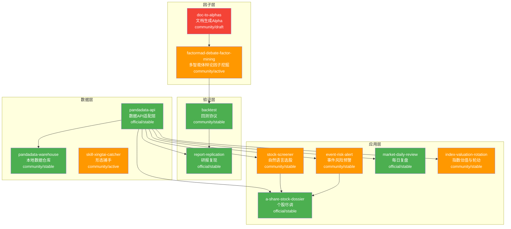
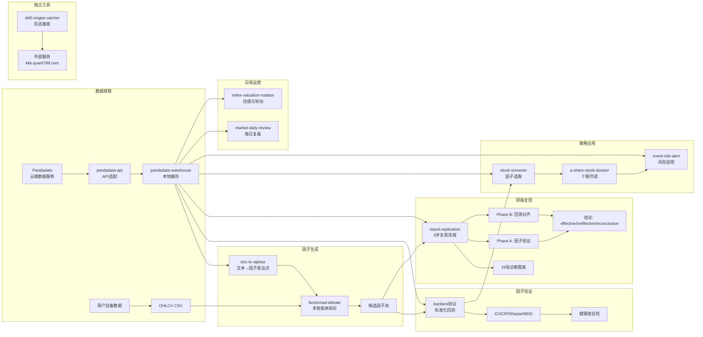
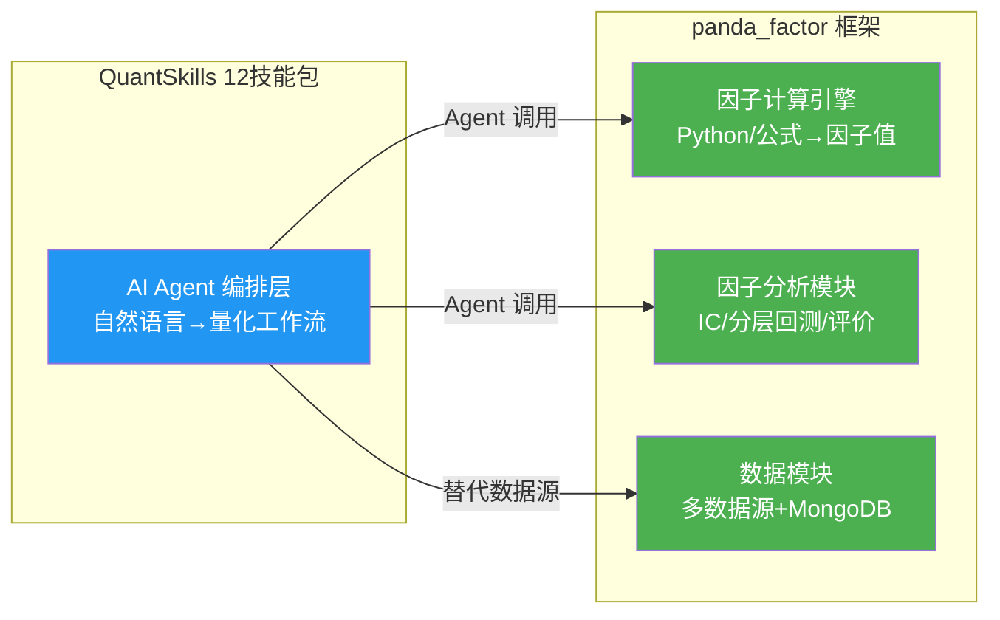

# QuantSkills 12技能包深度调研

## 目录

1. [总体概述](#一总体概述)
2. [12个Skill逐一深度分析](#二12个skill逐一深度分析)
3. [技能关系图](#三技能关系图)
4. [数据流图：从数据获取到最终回测的完整链路](#四数据流图从数据获取到最终回测的完整链路)
5. [按成熟度分档汇总](#五按成熟度分档汇总)
6. [与panda_factor框架的互补性分析](#六与panda_factor框架的互补性分析)
7. [存在的问题和风险](#七存在的问题和风险)
8. [总结与建议](#八总结与建议)

---

## 一、总体概述

QuantSkills 12技能包是一套基于 AI Agent（Claude Code、Codex、Cursor 等）的量化研究工具链，覆盖从**数据获取 → 因子挖掘 → 回测验证 → 研报复现 → 选股/风控 → 每日复盘**的完整量化工作流。所有技能由社区维护者 `abgyjaguo` 创建，以 GPL-3.0 协议开源。

**核心定位**：不是替代传统量化框架，而是让 AI Agent 具备"调用量化工具"的能力——通过自然语言触发专业的量化分析流程。

**数据依赖**：深度绑定 Pandadata（pandaaiquant.com）数据服务，12个技能中 7 个直接依赖 `pandadata-api`。仅有 `doc-to-alphas`、`factormad-debate-factor-mining`、`backtest`、`skill-xingtai-catcher` 4 个可独立运行。

---

## 二、12个Skill逐一深度分析

### 2.1 pandadata-api（数据API层）

**一句话定位**：Pandadata 数据服务的 AI Agent 接口适配层，将自然语言数据需求路由到正确的 `panda_data.get_*` 方法。

**核心功能清单**：
- 提供 185 个 Pandadata API 方法的完整索引（`method-index.md`）
- 方法搜索脚本 `search_api_docs.py`，支持按关键词和行号查询
- 统一的 API 调用入口 `call_api.py`，自动处理凭证加载和初始化
- 交互式运行时安装脚本 `setup_runtime.py`
- 全量 API 文档 `api-docs.md`（20982行），覆盖 A股/期货/期权/港股/美股/因子/宏观

**能做什么**：精确路由自然语言查询到 Pandadata 方法，生成可运行的 Python 调用代码，处理凭证管理
**不能做什么**：本身不提供数据，只是 Pandadata SDK 的 Agent 适配层；不负责数据清洗和存储

**输入 × 输出契约**：
- 输入：自然语言数据需求（如"获取平安银行2025年日线行情"）
- 输出：包含方法名、参数、返回字段的精确 Python 调用代码

**依赖关系**：外部依赖 `panda_data==0.0.9` Python SDK（需 Pandadata 账号凭证）；无内部 skill 依赖
**技术亮点**：
- `call_api.py` 在同进程内完成凭证初始化+API调用，避免了 Agent 常见的多进程凭证传递问题
- 方法索引精确到行号，Agent 可通过 `sed -n '<line>,+120p'` 直接定位文档
- 支持 `--correction-context` 模式，允许 Agent 根据错误信息自动修正 API 调用

**成熟度评估**：stable / runnable / official — 实际可跑，是整个技能包的基础设施
**实际使用场景**：
1. Agent 用户说"查一下茅台最近一年的日线数据" → 自动路由到 `get_stock_daily`
2. 配合其他 skill（如 stock-screener）时，作为底层数据调用层
3. 开发量化策略时，快速验证某个 Pandadata 方法的参数和返回格式

---

### 2.2 pandadata-warehouse（本地数据仓库）

**一句话定位**：用 DuckDB + Parquet 构建 Pandadata 数据的本地缓存仓库，支持增量刷新和查询。

**核心功能清单**：
- 本地 Parquet 分区存储，支持 11 种数据表族（日线/分钟线/指数/期货/期权/港股/美股/复权因子/因子等）
- DuckDB 视图层，通过 SQL 直接查询 Parquet 文件
- 增量刷新策略：仅拉取缺失交易日的数据
- 元数据管理（`_meta.json`）：记录分区覆盖范围、行数、刷新时间、状态
- 数据校验：行数、日期范围、主键重复、与新鲜 API 结果对比

**能做什么**：缓存 Pandadata 数据到本地，避免重复 API 调用；为回测和因子研究提供持久化数据层
**不能做什么**：不提供数据本身，只缓存已获取的 Pandadata 数据；不处理实时数据

**输入 × 输出契约**：
- 输入：目标数据族、标的范围、日期范围、仓库路径
- 输出：本地 Parquet 文件 + DuckDB 视图 + 元数据文件

**依赖关系**：依赖 `pandadata-api`（获取数据）；需要 DuckDB、PyArrow
**技术亮点**：
- 区分"追加稳定"和"历史可变"两种数据集，采用不同的刷新策略
- 分区设计完善：`stock_daily/year=2026/part.parquet`，分钟线按 `symbol/year/month` 三级分区
- 安全规则严格：禁止静默删除/覆盖已有分区，先列出受影响文件再确认

**成熟度评估**：stable / runnable / community — 设计完善但无独立脚本，主要靠 Agent 按 playbook 执行
**实际使用场景**：
1. 回测前批量下载全市场日线数据到本地，后续回测直接读本地
2. 每日定时增量更新，保持本地数据与 Pandadata 同步
3. 因子研究中，避免每次计算都重新拉取数据

---

### 2.3 backtest（回测协议）

**一句话定位**：不是回测框架，而是一套标准化的截面多头回测协议，包含算法骨架、假设声明、诊断图表和健康度自检。

**核心功能清单**：
- 标准回测算法：Top 10% 等权、T+1 开盘成交、滚动持仓（H 日重叠）、双边 15bp
- 涨跌停/停牌自动剔除（`trade_status==1` 或 `close >= limit_up*0.99`）
- 四联/六联诊断图：净值曲线、累计 IC、分组收益、回撤、月度热图、换手
- 5 项健康度自检：持仓股数、换手率、Sharpe vs IC_IR 量级一致性、MDD 合理性、全仓时间占比
- 反模式清单：未来函数、生存者偏差、T+0 成交、零手续费等 10 种常见错误
- Benchmark 对照：等权选股池、市值加权指数、随机 Top 组合

**能做什么**：提供标准化的回测假设和算法骨架，确保不同因子之间的回测结果可比
**不能做什么**：不提供可运行的完整回测脚本（需用户自行实现或调用项目内 `backtest()` 函数）；不支持多空组合、行业中性等复杂回测

**输入 × 输出契约**：
- 输入：`signal`（[date × symbol] 截面 z-score 矩阵）、`panel`（OHLCV + 涨跌停 + 停牌状态）
- 输出：`nav_curve`、`daily_ret`、`positions`、`turnover_series`、年化收益/Sharpe/MDD/年化换手

**依赖关系**：无外部依赖，但需要用户提供数据和信号
**技术亮点**：
- 时序细节极其严格：T 日收盘后生成信号 → T+1 开盘成交 → T+1+H 开盘平仓，彻底杜绝未来函数
- 健康度自检设计精妙：Sharpe/IC_IR 比值 0.3~0.5 是正常范围，>1.0 则几乎一定是 bug
- 反模式清单实战价值高，每个反模式都给出了具体代码示例和修复方法

**成熟度评估**：stable / listed / community — 协议成熟但无独立脚本，算法骨架代码完整可参考
**实际使用场景**：
1. 新因子开发后，按此协议回测，确保与已有因子可比
2. 回测结果异常时，用健康度自检诊断问题
3. 代码审查时，用反模式清单检查回测代码

---

### 2.4 doc-to-alphas（文档生成Alpha因子）

**一句话定位**：从研报/论文/文档文本中自动提取 Alpha 因子表达式，并通过玩具数据验证器检查语法和数值稳定性。

**核心功能清单**：
- 27 个允许函数 + 6 个字段（open/high/low/close/volume/amount）的严格因子契约
- 玩具数据验证器：30 日期 × 5 股票的合成 OHLCV 数据，评估每个表达式
- 前视偏差检测：截断测试（去掉最后 20% 数据重跑）+ 静态扫描
- 数值稳定性检查：NaN 比例 >50%、Inf 比例 >1%、输出 std >10× 输入规模、零方差输出
- 自动修正循环：失败因子获得分类错误诊断 + 修正提示，最多重试 5 次

**能做什么**：从文本中批量生成可计算的因子表达式，自动验证语法正确性和数值稳定性
**不能做什么**：生成的是 OHLCV 范围纯量价因子，不支持基本面/另类数据因子；玩具数据验证≠真实市场有效性

**输入 × 输出契约**：
- 输入：文档文本 + 期望生成的因子数量 N
- 输出：JSON 数组，每个因子含 `name`、`expression`、`description`、`rationale`，通过验证的标注 `ok: true`

**依赖关系**：完全自包含（仅需 numpy + pandas），无外部 API 依赖
**技术亮点**：
- 契约设计源自 WorldQuant 101 Formulaic Alphas 的传统，27 个函数覆盖了截面和时间序列操作
- 截断测试是检测前视偏差的巧妙方法——如果去掉最后 20% 数据后结果不同，说明表达式偷看了未来
- `--correction-context` 生成可直接喂给 LLM 的修正提示，实现自动化修正循环

**成熟度评估**：draft / listed / community — 功能完整但 status 为 draft，验证器可跑但生成质量依赖 LLM
**实际使用场景**：
1. 读到一篇量化研报，要求 Agent 提取其中的因子公式并验证
2. 批量生成 100 个候选因子，通过验证器筛选出语法正确的进行后续研究
3. 教学场景：用验证器检查学生写的因子表达式是否有前视偏差

---

### 2.5 factormad-debate-factor-mining（多智能体辩论因子挖掘）

**一句话定位**：FactorMAD 风格的 LLM 多智能体辩论流程，多个 Agent 在生成、辩论、验证、评分的循环中挖掘代码型 Alpha 因子。

**核心功能清单**：
- 多智能体辩论：proposer 生成因子，critic 质疑，validator 验证，循环多轮
- 轻量级 IC/ICIR 评估：在用户提供的 in-sample 时间段上计算，用于内部因子筛选
- 因子去重：基于相关系数阈值排除相似因子
- 种子因子支持：可注入已知因子作为 few-shot 示例
- 因子库管理：可读/写本地因子库，支持增量积累
- 输出：`accepted_factors.json`、`debate_rounds.json`、`factormad_debate_result.json`

**能做什么**：利用 LLM 的代码生成能力自动挖掘 Python 代码型 Alpha 因子
**不能做什么**：轻量 IC/ICIR 仅用于内部筛选，不能替代严谨的样本外验证；依赖 OpenAI API

**输入 × 输出契约**：
- 输入：OHLCV 市场数据 CSV + 可选的种子因子 + LLM 配置
- 输出：接受的因子代码（Python 函数）、辩论记录、评估指标（IC/ICIR/O-IC/O-ICIR）

**依赖关系**：需要 OpenAI API（或兼容的 base_url）；支持 `dry_run=true` 无 LLM 验证模式
**技术亮点**：
- 辩论机制模拟了量化团队的因子评审流程：提出 → 质疑 → 验证 → 筛选
- 因子代码包含安全检查：禁止函数内 import、要求输出 pandas Series 对齐、符号顺序稳定性检查
- 种子因子注入机制允许注入领域知识，引导 LLM 生成特定风格的因子

**成熟度评估**：active / runnable / community — 有可运行的脚本和示例，但 status 为 "activate"（非 stable），且仅标注支持 Codex 平台
**实际使用场景**：
1. 给定一个行业/风格，让 Agent 自动挖掘该领域的候选因子
2. 用已知有效因子作为种子，探索因子变体
3. 批量生成因子候选池，供后续人工筛选和严格回测

---

### 2.6 report-replication（研报复现）

**一句话定位**：将一篇量化研报或论文端到端复现为完整的研究交付包，含翻译、因子重构、有效性验证、回测和最终交付摘要。

**核心功能清单**：
- 6 步标准化流程：初始化 → 翻译 → 因子重构 → 因子验证（Phase A）→ 回测策略（Phase B）→ 最终交付
- 19 张标准图表：因子分布、IC 序列、IS/OOS 对比、净值曲线、回撤、分位数收益、年度热图、换手率、参数稳定性、成本敏感性、Walk-forward 等
- 基准对比：反向因子、随机因子、等权买入持有、零收益基线
- 质量关卡：每步有对应的检查脚本（`check_step2_translation.py` 等），最终 `quality_gate_check.py`
- 完整输出契约：19 个 CSV 数据文件、19 个 PNG 图表、策略代码、回测日志、交付摘要

**能做什么**：系统化复现量化研报，产出可审计的完整研究报告
**不能做什么**：不保证复现成功（数据不足时标记 inconclusive）；图表文本必须是英文 ASCII（中文不嵌入图片）

**输入 × 输出契约**：
- 输入：研报 PDF/链接/文本 + Pandadata 凭证
- 输出：`/home/coder/project/replication/report-replication/{report_id}/` 下的完整项目目录

**依赖关系**：依赖 Pandadata 获取市场数据；依赖 `local_backtest.py` 进行回测；需要 Python 3.10+
**技术亮点**：
- 两阶段验证设计：Phase A 独立因子验证 → Phase B 回测对齐验证，确保因子验证和回测结果可互相校验
- 19 张图表覆盖了从因子分布到 Walk-forward 的完整验证链路
- 中文可读性要求严格：图表像素英文、HTML 中文、每张图配"阅读指南"说明
- 诚实规则：不编造结果，数据不足时标记为 inconclusive，每步失败如实记录

**成熟度评估**：stable / runnable / official — 流程完整、脚本齐全、质量关卡严格
**实际使用场景**：
1. 读到一篇券商金工研报，要求 Agent 复现其因子并进行 A 股验证
2. 学术论文中的因子想在中国市场验证有效性
3. 教学场景：完整展示因子研究从理论到回测的全流程

---

### 2.7 a-share-stock-dossier（A股个股尽调报告）

**一句话定位**：输入一个 A 股代码，输出一份可溯源的个股尽调报告，覆盖基本面、财务、分红、股东行为、风险事件和资金面。

**核心功能清单**：
- 7 大分析模块：公司概况、财务分析、分红与资本运作、股东结构、风险事件、资金面、风险信号清单
- 风险规则引擎：质押率 ≥50% 高风险、解禁 >10% 流通盘高风险、审计非标意见高风险等
- 组合信号分析：识别"质押率高 + 解禁临近"、"减持计划 + 业绩预告下修"等叠加风险
- 全溯源：每个数据点标注来源方法、查询窗口、数据日期、是否为派生计算

**能做什么**：一站式 A 股个股深度分析，替代人工翻阅财报和公告
**不能做什么**：不提供估值定价或投资建议；分析质量受 Pandadata 数据覆盖范围限制

**输入 × 输出契约**：
- 输入：A 股代码（如 `000001.SZ`）
- 输出：结构化 Markdown 报告，含 9 个章节 + 数据附录

**依赖关系**：依赖 `pandadata-api`（所有数据调用）
**技术亮点**：
- 风险规则引擎具有可配置阈值，既支持默认规则也支持用户自定义
- 组合信号分析不是简单罗列，而是识别多信号叠加场景
- 附录要求逐方法标注查询窗口和返回行数，确保报告可审计

**成熟度评估**：stable / runnable / official — 流程完整，实际可生成报告
**实际使用场景**：
1. 快速了解一只陌生股票的基本面全貌
2. 持仓个股的定期风险排查
3. 选股结果的二次验证（screener 筛出后，对候选股做尽调）

---

### 2.8 stock-screener（自然语言选股）

**一句话定位**：用自然语言描述筛选条件，自动翻译为 Pandadata API 调用序列，返回可溯源的股票列表。

**核心功能清单**：
- 自然语言 → 原子化筛选条件解析（metric、operator、threshold、window、date_basis）
- 筛选漏斗：按选择性和 API 成本排序执行，记录每层筛选的输入/输出/剔除数量
- 13 种常见筛选意图映射：分红、估值、质押、北向、行业、财务增长、股东变化等
- 前视偏差防护：财报、分红、质押等数据只使用不晚于筛选日的披露数据
- 输出包含个股的实际命中值，而非仅通过/未通过标记

**能做什么**：将自然语言选股条件转化为可执行的 Pandadata 查询链
**不能做什么**：条件必须能映射到 Pandadata 有数据的字段；多条件组合的 AND/OR 逻辑需明确解析

**输入 × 输出契约**：
- 输入：自然语言筛选条件 + 筛选日期
- 输出：筛选口径说明 + 筛选漏斗表 + 结果清单（含代码、名称、条件命中值、报告期、方法）

**依赖关系**：依赖 `pandadata-api`
**技术亮点**：
- 筛选漏斗设计：每层后记录存活股票数，可追溯筛选效果
- 保守原则：数据缺失的股票标记为"数据缺失"而非静默排除
- 对模糊条件主动询问澄清（如"连续3年分红"是财年还是自然年）

**成熟度评估**：stable / runnable / community — 流程完整，依赖 Pandadata
**实际使用场景**：
1. "找出连续3年分红、PE<15、北向持续加仓、质押率<30%的A股"
2. "筛选沪深300成分股中ROE>15%且股东户数下降的股票"
3. 定期按固定条件做全市场扫描

---

### 2.9 event-risk-alert（事件风险预警）

**一句话定位**：A 股持仓和自选股的事件风险监控，覆盖解禁、质押、减持、ST、业绩预告、审计意见、股东户数变化。

**核心功能清单**：
- 7 类风险事件扫描：限售解禁、股权质押、股东增减持、ST/退市风险、业绩预告、审计意见、股东户数变化
- 三级严重度分级（high/medium/low）+ 自定义规则阈值
- 状态文件去重：仅在新事件出现、严重度升级、时间窗口缩紧时重新告警
- Watchlist JSON 合约：支持持仓成本、标签、自定义风险阈值
- 支持一次性扫描和定时监控两种模式

**能做什么**：持仓风险事件的自动化监控和告警
**不能做什么**：不提供实时行情监控；事件数据依赖 Pandadata 披露数据，存在 T+N 滞后

**输入 × 输出契约**：
- 输入：Watchlist JSON（含股票代码和可选的自定义规则）
- 输出：Markdown 告警报告（含严重度汇总、逐条告警详情、数据说明）

**依赖关系**：依赖 `pandadata-api`；依赖 `scripts/validate_watchlist.py` 验证输入
**技术亮点**：
- 状态文件去重设计：避免同一事件反复告警，但严重度变化时升级告警
- 告警事件规范化为 12 字段标准格式，便于跨系统对接
- 定时监控规范：要求明确时区、频率、幂等性、数据过期处理

**成熟度评估**：stable / runnable / community — 流程完整，可实用
**实际使用场景**：
1. 每日盘前检查持仓股是否有新增解禁/减持/质押风险
2. 每周全量扫描自选股的基本面风险变化
3. 配合 cron 定时任务，实现自动化风险监控

---

### 2.10 market-daily-review（每日市场复盘）

**一句话定位**：收盘后自动生成 A 股当日复盘报告，覆盖指数估值、市场宽度、热点行业/概念、龙虎榜、大宗交易、两融、北向资金。

**核心功能清单**：
- 8 大复盘模块：指数概览与估值、市场宽度与情绪、行业与概念热点、龙虎榜、大宗交易、两融、北向持股、异动与风险提示
- 自动判断交易日/休市日
- 报告模板：标准化 Markdown 格式，所有数据可溯源
- 报告验证脚本：检查缺失章节、缺失来源注释、缺失数据日期标签
- 定时自动化支持：建议 18:30 Asia/Shanghai 后执行，等待延迟数据到位

**能做什么**：每日收盘后自动生成专业复盘报告
**不能做什么**：不提供预测或交易建议；部分数据（两融、北向）T+1 披露，有滞后

**输入 × 输出契约**：
- 输入：目标日期（默认最新交易日）
- 输出：`reports/daily/YYYYMMDD.md` 格式的 Markdown 复盘报告

**依赖关系**：依赖 `pandadata-api`；依赖 `scripts/validate_report.py` 验证报告完整性
**技术亮点**：
- 休市日自动检测：若目标日期非交易日，返回"今日休市"简版
- 数据降级策略：某个接口不可用时保留可用部分，在数据说明中标注缺失
- 模板变量化设计：`{{trade_date}}`、`{{index_summary}}` 等，便于程序化填充

**成熟度评估**：stable / runnable / official — 流程完整，实际可生成报告
**实际使用场景**：
1. 每日收盘后自动生成复盘报告，替代人工写复盘笔记
2. 周末生成一周市场回顾
3. 配合定时任务，实现每日自动化复盘推送

---

### 2.11 index-valuation-rotation（指数估值与行业轮动）

**一句话定位**：指数估值分位与行业轮动分析，提供 PE/PB 分位、估值温度计、宽基定投参考、行业动量排名。

**核心功能清单**：
- 估值分位计算：至少 5 年历史数据，PE/PB 分位独立计算
- 估值温度带：<20% 低估、20%-80% 中性、>80% 高估
- 行业动量排名：20/60/120 交易日动量、排名变化、持续性分析
- 指数成分股权重归因：当用户问及轮动对指数影响时使用
- 支持指数估值快照、估值仪表盘、定投参考、行业轮动报告四种模式

**能做什么**：指数估值的定量分析和行业轮动的动量跟踪
**不能做什么**：不提供择时信号；估值分位受历史窗口长度影响（窗口短则分位参考价值低）

**输入 × 输出契约**：
- 输入：指数/行业列表 + 分析类型
- 输出：估值分位表 + 动量排名表 + 中文解读

**依赖关系**：依赖 `pandadata-api`；无独立脚本
**技术亮点**：
- 估值分位和动量排名分离呈现：先展示客观数据，再标注为研究解读
- 窗口不足时降级标注：若可用历史 <5 年，明确说明并下调标签可信度
- 行业聚合规则透明：等权还是市值加权明确标注

**成熟度评估**：stable / runnable / community — 流程完整，但无 references 目录和独立脚本
**实际使用场景**：
1. "现在沪深300贵不贵？" → 生成估值分位报告
2. "最近哪些行业在走强？" → 生成行业动量排名
3. 定投前参考宽基指数的估值温度

---

### 2.12 skill-xingtai-catcher（形态捕手）

**一句话定位**：通过文字描述、K线截图或手绘图形，搜索 A 股和期货中形态相似的标的。

**核心功能清单**：
- 三种输入模式：文字描述（含 6 种雷达模板）、K线截图、手绘/草图
- 支持日线和 60 分钟线，30/60/120 BAR 窗口
- 两种接入方式：MCP 协议（`https://kkk.quant789.com/mcp`）和直接脚本 `xingtai_search.py`
- 6 种服务器雷达模板：强趋势延续、底部反转、W底、趋势回踩、震荡整理、M头/顶部反转
- 自动重试：截图识别失败时自动切换为 drawing 模式

**能做什么**：基于形态相似度的标的搜索，类似"看图选股"的自动化版本
**不能做什么**：形态相似度≠投资价值；结果不包含基本面分析；服务器端搜索逻辑不透明

**输入 × 输出契约**：
- 输入：文字描述/图片路径 + universe/timeframe/window_bars/top_n
- 输出：候选列表（代码、名称、评分、数据日）+ 结果页 URL + 分享页 URL

**依赖关系**：完全自包含，依赖外部服务 `kkk.quant789.com`（无需用户配置）
**技术亮点**：
- 输出模式适配 AI 平台：非交互环境下写 `.xingtai_result.txt` 而非 stdout，避免被平台截断
- 雷达模板预设：6 种常见形态映射到服务器端预计算模板，结果来自最新行情而非临时计算
- 手绘模式支持高精度匹配，且会提示用户添加前趋势段以提升匹配质量

**成熟度评估**：active / runnable / community — 有可运行脚本和外部服务，但依赖第三方服务可用性
**实际使用场景**：
1. "找 A 股中 W 底右侧抬升的股票" → 雷达模板搜索
2. 手绘一个趋势形态，搜索相似标的
3. 截图某只股票的 K 线走势，找形态相似的标的

---

## 三、技能关系图

**图例**：绿色=official/stable，橙色=community，红色=draft。实线=直接依赖，虚线=逻辑关联。

---

## 四、数据流图：从数据获取到最终回测的完整链路

**关键数据流说明**：
1. **Pandadata 是核心数据源**：除 `doc-to-alphas`、`factormad`（可用自备数据）、`backtest`（协议层）、`xingtai-catcher`（外部服务）外，其余 8 个技能全部依赖 Pandadata
2. **因子生成→验证→应用**：`doc-to-alphas` 和 `factormad` 生成候选因子 → `backtest` 协议标准化验证 → `stock-screener` 将有效因子用于选股
3. **研报复现是完整闭环**：从数据获取到因子重构到验证到回测到交付，覆盖了量化研究的完整生命周期
4. **日常运营线独立**：`market-daily-review` 和 `index-valuation-rotation` 不需要因子，直接基于 Pandadata 数据生成报告

---

## 五、按成熟度分档汇总

### 生产可用（stable + runnable + official）

| Skill | 定位 | 核心价值 | 风险提示 |
|---|---|---|---|
| **pandadata-api** | 数据基础设施 | 185 个 API 方法的 Agent 适配层，是整个技能包的基石 | 深度绑定 Pandadata 商业服务；`panda_data==0.0.9` 版本固定 |
| **market-daily-review** | 每日运营 | 一键生成专业复盘报告，替代人工笔记 | 部分数据 T+1 滞后；报告质量取决于 Pandadata 数据覆盖 |
| **a-share-stock-dossier** | 个股分析 | 一站式尽调报告，多维度风险扫描 | 风险规则默认阈值需根据实际调整；分析深度受 API 数据量限制 |
| **report-replication** | 研报复现 | 完整的量化研究交付流水线，19 图 + 质量关卡 | 对数据要求高，数据不足时结论为 inconclusive；输出路径硬编码 `/home/coder/` |

### 可验证（stable/active + runnable + community）

| Skill | 定位 | 核心价值 | 风险提示 |
|---|---|---|---|
| **pandadata-warehouse** | 数据工程 | DuckDB+Parquet 本地缓存，减少重复 API 调用 | 无独立脚本，需 Agent 按 playbook 执行；需自行管理磁盘空间 |
| **stock-screener** | 选股工具 | 自然语言→Pandadata 查询链，筛选漏斗可追溯 | 条件必须能映射到 Pandadata 字段；复杂多条件 AND/OR 逻辑可能需人工确认 |
| **event-risk-alert** | 风险监控 | 7 类风险事件自动扫描 + 状态文件去重 | 依赖 Pandadata 披露数据，存在 T+N 滞后；告警规则阈值需定制 |
| **index-valuation-rotation** | 估值分析 | 指数估值分位 + 行业动量排名 | 无 references 目录和独立脚本；估值分位对历史窗口长度敏感 |
| **skill-xingtai-catcher** | 形态搜索 | 文字/图片/手绘三种输入，6 种雷达模板 | 依赖外部服务 `kkk.quant789.com`；形态相似度评分逻辑不透明 |
| **factormad-debate-factor-mining** | 因子挖掘 | LLM 多智能体辩论自动生成代码型因子 | 仅标注支持 Codex 平台；轻量 IC/ICIR 不能替代严格验证；依赖 OpenAI API |

### 概念阶段（draft + listed）

| Skill | 定位 | 核心价值 | 风险提示 |
|---|---|---|---|
| **doc-to-alphas** | 因子生成 | 从文本提取因子表达式 + 玩具数据验证 | status 为 draft；仅支持 OHLCV 纯量价因子；玩具数据验证≠真实有效性 |
| **backtest** | 回测协议 | 标准化回测假设和健康度自检，反模式清单 | 无独立可运行脚本；协议依赖用户自行实现或调用项目内 `backtest()` |

---

## 六、与 panda_factor 框架的互补性分析

### panda_factor 是什么

panda_factor（`/home/dr/code/panda_factor/`）是 PandaAI 旗下的底层因子计算框架，提供：
- **因子编写引擎**：Python 类继承 `Factor` + `calculate()` 方法，或公式 DSL（如 `RANK((CLOSE/DELAY(CLOSE,20))-1)`）
- **因子计算算子**：截面/时序函数库（RANK、STDDEV、CORRELATION、DELAY 等）
- **因子分析**：IC 分析、分层回测、因子评价指标
- **数据模块**：多数据源接入（Tushare、RiceQuant、迅投等）+ MongoDB 本地数据库
- **信号组合**：因子合成、组合优化
- **Web 界面**：`panda_web` 前端 + `panda_factor_server` API 后端
- **LLM 接入**：`panda_llm` 模块，支持 OpenAI 协议

### 互补关系（不是竞争关系）

**QuantSkills 的核心价值在于"Agent 编排"**：让 AI 理解用户意图，自动编排量化工作流。它不是计算框架，不替代 panda_factor 的因子计算能力。

**panda_factor 的核心价值在于"因子计算"**：提供高性能的因子计算引擎和严谨的统计分析。它不是 Agent 工具，不能通过自然语言交互。

### 具体互补点

| 维度 | QuantSkills 12技能包 | panda_factor | 互补关系 |
|---|---|---|---|
| **交互方式** | 自然语言 → Agent 编排 | Python API / 公式 DSL | QuantSkills 可作为 panda_factor 的自然语言前端 |
| **因子生成** | LLM 生成因子表达式 + 辩论验证 | 手工编写 Python 类或公式 | QuantSkills 的 `doc-to-alphas` 和 `factormad` 可为 panda_factor 生成候选因子 |
| **因子验证** | 标准化回测协议 + 19 图诊断 | IC 分析 + 分层回测 + 因子评价 | 互补：QuantSkills 提供流程规范，panda_factor 提供计算引擎 |
| **数据源** | Pandadata（单一数据源） | Tushare/RiceQuant/迅投等多源 | 互补：panda_factor 数据源更丰富，QuantSkills 可扩展对接 |
| **研报复现** | 端到端 6 步流程 + 质量关卡 | 无此功能 | QuantSkills 独有 |
| **选股/风控/复盘** | stock-screener + event-risk-alert + market-daily-review | 无此功能 | QuantSkills 独有 |
| **本地数据仓库** | DuckDB+Parquet（轻量） | MongoDB（生产级） | 互补：QuantSkills 更轻量，panda_factor 更企业级 |
| **Web 界面** | 无 | panda_web 前端 | panda_factor 独有 |
| **LLM 集成** | 深度集成（本身就是 Agent skill） | panda_llm 模块 | 互补：不同层次的 LLM 集成 |

### 理想集成方案

1. **数据层打通**：QuantSkills 的 `pandadata-warehouse` 可扩展支持 panda_factor 的 MongoDB 数据库
2. **因子层打通**：`factormad-debate-factor-mining` 生成的因子代码可直接提交到 panda_factor 的因子库进行严格验证
3. **回测层打通**：`backtest` 协议可作为 panda_factor 因子分析模块的标准化输出规范
4. **前端打通**：QuantSkills 的 Agent 编排能力可作为 panda_web 的智能助手

---

## 七、存在的问题和风险

### 7.1 数据依赖风险（CRITICAL）

- **Pandadata 单点依赖**：12 个技能中 7 个直接依赖 Pandadata API。如果 Pandadata 服务不可用、凭证过期、或数据覆盖范围不满足需求，大部分技能将无法工作
- **`panda_data==0.0.9` 版本锁定**：固定版本号意味着无法享受新版本的 bug 修复和功能改进
- **无数据回退策略**：除 `pandadata-warehouse` 外，其他技能没有本地数据缓存，每次调用都依赖实时 API

### 7.2 成熟度不一致

- **backtest 是协议不是工具**：它提供了极其完善的假设声明和健康度自检，但没有可独立运行的脚本。用户需要自己实现算法骨架，这限制了它的实用性
- **doc-to-alphas 标记为 draft**：虽然功能完整，但 status 仍是 draft，说明作者认为还需要打磨
- **factormad-debate-factor-mining 仅标注 Codex 平台**：限制了在其他 Agent 平台上的可用性

### 7.3 硬编码路径问题

- **report-replication 输出路径硬编码**：`/home/coder/project/replication/report-replication/` 是硬编码的，在非 Coder 环境下需要大量修改
- **pandadata-warehouse 默认路径**：`~/.pandadata/warehouse` 可能不适合所有用户

### 7.4 缺乏跨 skill 编排

- 各 skill 独立运行，没有统一的编排层。例如：`stock-screener` 选出股票后，不能自动触发 `a-share-stock-dossier` 对每只股票做尽调
- 没有统一的配置管理：每个 skill 需要单独配置 Pandadata 凭证

### 7.5 外部服务依赖

- **skill-xingtai-catcher** 依赖 `kkk.quant789.com` 外部服务，服务的可用性、响应速度、数据质量均不在 QuantSkills 控制范围内
- **factormad-debate-factor-mining** 依赖 OpenAI API（或兼容 API），需要额外的 API 费用

### 7.6 文档与实现差距

- **index-valuation-rotation** 没有 references 目录和独立脚本，完全依赖 Agent 按 SKILL.md 描述执行，缺乏可验证的代码
- **pandadata-warehouse** 没有 scripts 目录，所有的仓库操作依赖 Agent 理解和执行 playbook 中的指令
- **部分 README.md 文件**可能是模板化的，实际内容与 SKILL.md 重复

### 7.7 index-valuation-rotation 的缺失

- 没有独立的 `references/` 目录，估值分位计算逻辑全部在 SKILL.md 中描述
- 没有 `scripts/` 目录，估值计算依赖 Agent 自行实现或通过 Pandadata 直接获取
- 如果 Pandadata 的 `get_index_indicator` 不提供分位计算，Agent 需要自行实现，可能出错

### 7.8 审计和可复现性

- 所有技能依赖 Agent（LLM）理解并执行 SKILL.md 中的指令，LLM 的不确定性可能导致同一输入产生不同输出
- 除了 `report-replication` 有严格的质量关卡外，其他技能缺乏自动化的输出验证

---

## 八、总结与建议

### 核心发现

1. **QuantSkills 12 技能包是一个"AI Agent 时代的量化研究操作系统"**，它的核心创新不是算法本身，而是让 AI Agent 能够理解和编排量化工作流
2. **数据层是最大瓶颈**：深度绑定 Pandadata 单一数据源，缺乏数据多样性和容错能力
3. **成熟度两极分化**：4 个 official 技能完整可用，6 个 community 技能功能完整但缺乏独立脚本，2 个技能处于概念阶段
4. **与 panda_factor 高度互补**：QuantSkills 提供 Agent 编排层，panda_factor 提供因子计算引擎，两者结合可形成完整的 AI 驱动量化研究平台

### 建议优先级

1. **P0 — 立即可用**：`pandadata-api` + `market-daily-review` + `a-share-stock-dossier` 三个技能已具备生产使用条件
2. **P1 — 快速验证**：`stock-screener` + `event-risk-alert` 补充选股和风控能力
3. **P2 — 需要投入**：`report-replication` 需要配置 Pandadata 凭证和 Python 环境，但一旦配置完成，研报复现能力极强
4. **P3 — 需要开发**：`backtest` 需要实现可运行的脚本；`pandadata-warehouse` 需要开发自动化脚本；`doc-to-alphas` 和 `factormad` 需要更多验证
5. **P4 — 探索性**：`skill-xingtai-catcher` 作为独立工具使用，不依赖其他 skill

### 最大的机会

**将 QuantSkills 的 Agent 编排能力与 panda_factor 的因子计算引擎整合**，可以构建一个从"自然语言需求 → Agent 理解 → 因子生成 → 严谨验证 → 回测报告 → 策略部署"的完整 AI 量化平台。QuantSkills 提供"怎么问"，panda_factor 提供"怎么算"。

---

> **调研说明**：本报告基于 2026-06-25 对 `/tmp/quantskills_12/quantskills_12技能包/skills/` 下全部 12 个 skill 的 SKILL.md、references/、scripts/ 文件的系统阅读和分析。所有信息均来自源文件，未编造数据。标注"待验证"处为源文件信息不完整或需要实际运行确认的部分。