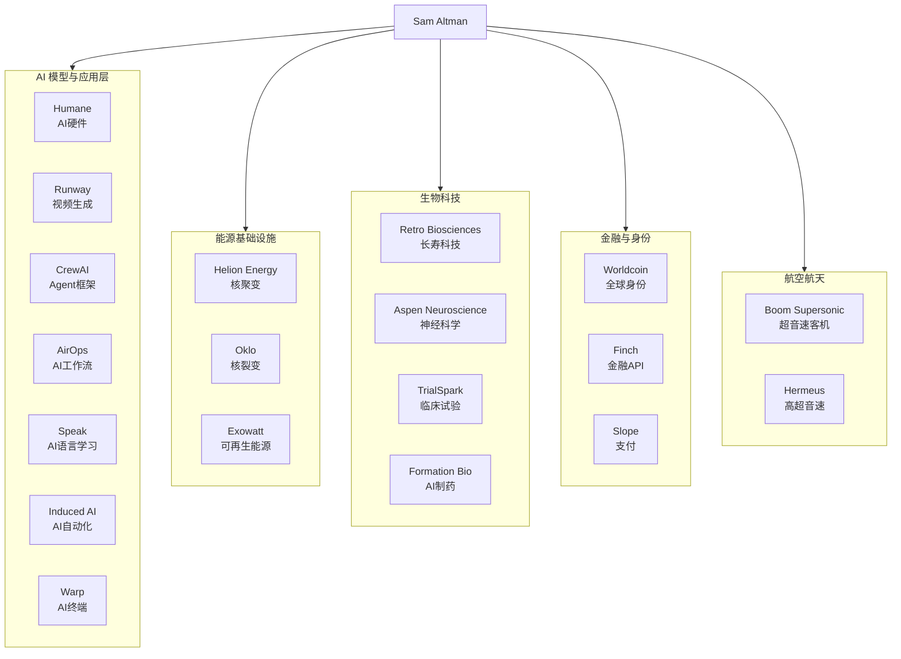
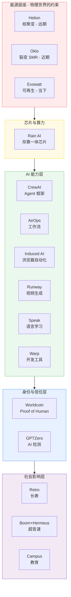

# Sam Altman 投资版图全解析

> Sam Altman 投的不是公司，而是下一代 AI 文明的基础设施。

---

## 1. 一句话总结

Sam Altman 通过个人资金和 Hydrazine Capital，构建了一张覆盖 **AI 模型 → Agent 基础设施 → 能源 → 生物科技 → 全球身份** 的投资网络。这张图的逻辑不是"撒网捕鱼"，而是**围绕 AI 文明的全栈布局**——从芯片到核聚变，从 AI 员工到人类身份验证。



---

## 2. 投资哲学：全栈 AI 文明论

Sam Altman 的投资逻辑可以拆解为三层：

| 层级 | 投资方向 | 核心问题 |
|:---|:---|:---|
| **L1 算力层** | 核聚变 (Helion)、核裂变 (Oklo)、AI 芯片 (Rain AI) | AI 的电从哪里来？芯片够不够？ |
| **L2 能力层** | Agent 框架 (CrewAI)、AI 自动化 (Induced AI)、视频生成 (Runway) | AI 能做什么？怎么让 AI 干活？ |
| **L3 社会层** | 全球身份 (Worldcoin)、长寿科技 (Retro)、超音速旅行 (Boom) | AI 时代的人类社会如何重构？ |

这三层环环相扣：**算力决定能力上限，能力决定社会变革的深度**。

---

## 3. 按领域逐一解析

---

### 3.1 AI / Agent / 模型生态

这是 Altman 投资版图中数量最多的板块，覆盖从底层模型到上层应用的全链条。

#### Humane — AI 硬件入口 ★★★

| 维度 | 详情 |
|:---|:---|
| **做什么** | AI Pin：无屏幕的可穿戴 AI 设备，通过语音、手势和激光投影交互 |
| **为什么投** | AI 不会永远停留在"聊天框"里。Humane 代表的是 **post-smartphone 交互范式** |
| **现状** | 产品口碑两极分化，2024 年被 HP 以 1.16 亿美元收购部分资产 |
| **战略意义** | 即使 Humane 本身不成功，方向是对的——**AI 需要一个脱离手机的存在形式** |

#### Runway — AI 视频生成

| 维度 | 详情 |
|:---|:---|
| **做什么** | Gen-1/Gen-2/Gen-3 系列视频生成模型，AI 视频编辑工具 |
| **为什么投** | 视频生成是 AI 多模态的关键战场。Runway 与 OpenAI Sora 直接竞争 |
| **核心能力** | 文生视频、图生视频、视频风格迁移、实时视频编辑 |
| **战略意义** | 内容创作的下一个范式——从"拍摄"到"生成" |

#### CrewAI — Agent 编排框架 ★★★

| 维度 | 详情 |
|:---|:---|
| **做什么** | 多 Agent 协作框架，让多个 AI Agent 像团队一样分工协作 |
| **为什么投** | 单个 AI 能力有限，真正的自动化需要**多 Agent 协同** |
| **核心概念** | Agent（角色）、Task（任务）、Crew（团队）、Tool（工具）四层抽象 |
| **战略意义** | 这是 **AI 员工系统** 的基础设施——不是聊天机器人，是能组队干活的数字员工 |

#### AirOps — AI 工作流自动化

| 维度 | 详情 |
|:---|:---|
| **做什么** | 企业级 AI 工作流平台，用 LLM 构建、测试和部署自动化流程 |
| **为什么投** | 企业需要的不只是"调用 API"，而是把 AI 嵌入业务流程 |
| **核心能力** | 可视化工作流构建、A/B 测试 prompt、批量数据处理 |
| **与 CrewAI 的区别** | AirOps 偏向**流程自动化**（workflow），CrewAI 偏向**角色协作**（agent team） |

#### Induced AI — AI 浏览器自动化

| 维度 | 详情 |
|:---|:---|
| **做什么** | AI 驱动的浏览器自动化，让 AI 像人一样操作网页完成复杂任务 |
| **为什么投** | 大量企业工作本质上是"打开网页 → 填表 → 点按钮"。Induced AI 直接替代这个环节 |
| **核心能力** | 自然语言指令 → 浏览器操作、自动处理异常、人机协同审核 |
| **战略意义** | RPA (Robotic Process Automation) 的 AI 原生替代品 |

#### Warp — AI 原生终端

| 维度 | 详情 |
|:---|:---|
| **做什么** | 用 Rust 重写的现代终端，内置 AI 命令补全、协作和知识共享 |
| **为什么投** | 开发者工具是 AI 的天然入口——终端是开发者最高频的交互界面 |
| **核心能力** | AI 命令建议、团队共享终端会话、Warp Drive（命令知识库） |
| **战略意义** | 抢占了开发者工作流中最底层的入口 |

#### Speak — AI 语言学习

| 维度 | 详情 |
|:---|:---|
| **做什么** | AI 驱动的英语口语学习应用，主打韩国和日本市场 |
| **为什么投** | 语言教育是 AI 最自然的应用场景——实时语音交互、个性化纠错、无限练习 |
| **估值** | 2024 年估值约 5 亿美元 |
| **战略意义** | 教育是 AI 最先落地的消费场景之一，Speak 证明了 PMF |

#### Rain AI — AI 芯片

| 维度 | 详情 |
|:---|:---|
| **做什么** | 模拟 AI 芯片（neuromorphic chips），用存算一体架构大幅降低 AI 推理功耗 |
| **为什么投** | OpenAI 需要摆脱对 NVIDIA 的依赖。Altman 本人曾试图募集 7 万亿美元造芯片 |
| **核心思路** | 模拟计算而非数字计算，模仿人脑的能效比 |
| **战略意义** | **AI 算力自主可控**——这是 Altman 芯片棋局中的重要一子 |

#### GPTZero — AI 内容检测

| 维度 | 详情 |
|:---|:---|
| **做什么** | 检测文本是否由 AI 生成，主要面向教育市场 |
| **为什么投** | AI 生成内容的泛滥创造了对"真实性验证"的需求 |
| **悖论** | Altman 一边造最强 AI，一边投检测 AI 的公司——本质是在做 **AI 时代的信任基础设施** |

#### Context — AI 知识管理

| 维度 | 详情 |
|:---|:---|
| **做什么** | AI 驱动的企业知识库和文档搜索 |
| **为什么投** | 企业内部的"暗数据"（dark data）巨大——知识散落在 Slack、Notion、邮件中无人能找 |

#### Beacon AI — 航空 AI

| 维度 | 详情 |
|:---|:---|
| **做什么** | AI 航空助手，为飞行员提供实时决策支持、燃油优化和安全管理 |
| **为什么投** | 航空是高度复杂、高风险的决策场景，AI 辅助决策有明确价值 |

#### Owner.com — 餐厅 SaaS

| 维度 | 详情 |
|:---|:---|
| **做什么** | 为独立餐厅提供在线点单、会员管理和营销的一站式 SaaS |
| **为什么投** | 本地商业的数字化程度极低，AI 可以大幅提升效率 |

#### Durable — AI 建站

| 维度 | 详情 |
|:---|:---|
| **做什么** | AI 在 30 秒内为小企业生成完整网站 |
| **为什么投** | 长尾小企业市场——大部分小企业没有网站或网站质量极差 |

#### Flexpa — 医疗数据 API

| 维度 | 详情 |
|:---|:---|
| **做什么** | 患者授权的医疗数据 API，连接保险理赔数据和健康应用 |
| **为什么投** | 医疗数据是 AI 的"原料"——没有结构化的医疗数据，AI 医疗应用就是空中楼阁 |

#### Dock — B2B 销售协作

| 维度 | 详情 |
|:---|:---|
| **做什么** | B2B 销售的数字化工作空间（digital sales room） |
| **为什么投** | B2B 销售流程的数字化是 AI 代理可以大幅优化的领域 |

#### Champify — 销售智能

| 维度 | 详情 |
|:---|:---|
| **做什么** | 分析客户的人事变动（入职/离职/晋升）来触发销售机会 |
| **为什么投** | AI 辅助销售线索挖掘——把信号从噪音中提取出来 |

#### Envy — B2B 销售平台

| 维度 | 详情 |
|:---|:---|
| **做什么** | 现代化的 B2B 销售管理和协作平台 |
| **为什么投** | 与 Dock/Champify 形成销售工具矩阵 |

#### Coframe / Correlated — AI 增长优化

| 维度 | 详情 |
|:---|:---|
| **做什么** | AI 驱动的产品增长和用户转化优化 |
| **为什么投** | 增长黑客的 AI 化——用 AI 自动 A/B 测试、优化转化漏斗 |

#### Expertlead — 技术招聘

| 维度 | 详情 |
|:---|:---|
| **做什么** | 技术人才招聘和技能评估平台 |
| **为什么投** | AI 人才稀缺，高效筛选技术人才是 AI 公司的刚需 |

#### Roman AI / Romtra — AI 生产力工具

| 维度 | 详情 |
|:---|:---|
| **做什么** | AI 驱动的个人知识管理和生产力工具（公开信息较少） |
| **为什么投** | 个人生产力是 AI 最直接的应用场景 |

#### 44.01 — 碳矿化

| 维度 | 详情 |
|:---|:---|
| **做什么** | 将 CO2 注入地下岩层通过矿化反应永久封存 |
| **为什么投** | AI 数据中心的碳足迹问题——算力越强，能耗越大，需要碳移除技术来平衡 |
| **命名来源** | 44.01 是 CO2 的摩尔质量 |

---

### 3.2 生物科技 / 长寿科技

#### Retro Biosciences — 长寿科技 ★★★

| 维度 | 详情 |
|:---|:---|
| **做什么** | 细胞重编程（cellular reprogramming）、自噬（autophagy）和血浆再生，目标延长人类健康寿命 10 年 |
| **为什么投** | Altman 个人出资 1.8 亿美元，是他最大的单笔投资之一 |
| **科学基础** | 山中因子（Yamanaka factors）的受控表达，将老细胞部分重置为年轻状态 |
| **战略意义** | Altman 公开说过"AI + 生物 = 人类下一个重大突破"。这就是那个方向的最直接押注 |

#### Aspen Neuroscience — 帕金森治疗

| 维度 | 详情 |
|:---|:---|
| **做什么** | 自体 iPSC 衍生多巴胺神经元移植治疗帕金森病 |
| **为什么投** | 神经退行性疾病是老龄化社会的最大挑战之一 |
| **技术路线** | 从患者自身细胞诱导多能干细胞 → 分化多巴胺神经元 → 移植回患者大脑 |

#### TrialSpark (Formation Bio) — AI 制药

| 维度 | 详情 |
|:---|:---|
| **做什么** | 用 AI 和软件重构临床试验流程，从招募到数据分析全链条 |
| **为什么投** | 临床试验是制药行业最大的瓶颈——传统模式慢、贵、成功率低 |
| **更名** | TrialSpark 已更名 Formation Bio，由 Altman 与 a16z 等共同投资 |

#### ExcepGen — 基因药物

| 维度 | 详情 |
|:---|:---|
| **做什么** | 开发 RNA 疗法，使用专有技术提高基因药物的表达效率和安全性 |
| **为什么投** | mRNA 疫苗的成功证明了 RNA 疗法的潜力，ExcepGen 在表达效率上做了工程优化 |

#### Heimdal — 碳捕获

| 维度 | 详情 |
|:---|:---|
| **做什么** | 直接空气捕获（DAC）碳移除技术 |
| **为什么投** | 与 44.01 一样，这是 AI 能源消耗的"对冲"——碳中和对大型科技公司越来越重要 |

#### Planetary — 海洋碳移除

| 维度 | 详情 |
|:---|:---|
| **做什么** | 海洋碱度增强（Ocean Alkalinity Enhancement），通过调节海水化学吸收更多大气 CO2 |
| **为什么投** | 海洋是地球上最大的碳汇，利用海洋做碳移除的规模上限远超陆地方法 |

#### ValueBase — 地产估值

| 维度 | 详情 |
|:---|:---|
| **做什么** | 用数据和 AI 做大规模房地产估值 |
| **为什么投** | 地产估值是高度依赖经验的劳动密集型行业，AI 化想象空间大 |

#### Yue Health — 健康科技

| 维度 | 详情 |
|:---|:---|
| **做什么** | 个性化健康管理和预防医学平台 |
| **为什么投** | 从"治病"到"预防"，AI 驱动个性化是健康管理的趋势 |

#### Karius — 感染病检测

| 维度 | 详情 |
|:---|:---|
| **做什么** | 通过血液中的微生物游离 DNA（mcfDNA）检测 1000+ 种病原体，一次检测覆盖所有可能感染 |
| **为什么投** | 感染病诊断长期依赖培养法（慢、不敏感），Karius 的革命性在于**一次抽血识别一切** |

---

### 3.3 能源 / 工业 / 航空航天

#### Helion Energy — 核聚变 ★★★

| 维度 | 详情 |
|:---|:---|
| **做什么** | 磁惯性约束核聚变，目标 2028 年向微软供电 |
| **为什么投** | Altman 个人出资 3.75 亿美元，是他最大的单笔投资 |
| **技术路线** | 场反转位形 (FRC) + 直接能量转换（不用蒸汽轮机，直接电磁感应发电） |
| **战略意义** | **AI 的终极能源瓶颈**。训练一个 GPT-5 级别模型可能消耗一座小型城市一天的电力。核聚变是唯一能满足 AI 能源需求的技术方案 |

#### Oklo — 先进核裂变

| 维度 | 详情 |
|:---|:---|
| **做什么** | 小型模块化核反应堆（SMR），使用液态金属快堆技术 |
| **为什么投** | 核聚变没那么快，在此之前需要清洁的基载电力填补缺口 |
| **上市** | 已通过 SPAC 在纽交所上市（OKLO） |
| **战略意义** | Helion 做远期（核聚变），Oklo 做近期（先进裂变）——**能源时间轴的左右手** |

#### Exowatt — 可再生能源

| 维度 | 详情 |
|:---|:---|
| **做什么** | 为数据中心提供模块化可再生能源解决方案（太阳能 + 储热） |
| **为什么投** | AI 数据中心需要清洁电力，而且需要就地部署、快速扩容 |
| **定位** | 填补电网扩容速度跟不上数据中心需求的窗口期 |

#### Boom Supersonic — 超音速客机

| 维度 | 详情 |
|:---|:---|
| **做什么** | 开发 Overture 超音速客机，速度 1.7 马赫，使用 100% 可持续航空燃料（SAF） |
| **为什么投** | 物理世界的速度上限是 AI 时代的瓶颈——信息可以光速传递，但人还是要飞 |
| **客户** | United、American、Japan Airlines 已下单 |

#### Hermeus — 高超音速飞行器

| 维度 | 详情 |
|:---|:---|
| **做什么** | 5 马赫高超音速飞机，先从军用（无人侦察/打击）切入，再推民用 |
| **为什么投** | 如果 Boom 解决"快一点"的问题，Hermeus 解决的是"快到不可思议"——纽约到伦敦 90 分钟 |
| **核心技术** | 涡轮基组合循环发动机 (TBCC)，在涡轮和冲压模式间切换 |

#### Apex — 卫星制造

| 维度 | 详情 |
|:---|:---|
| **做什么** | 标准化卫星平台 (satellite bus)，批量生产卫星本体 |
| **为什么投** | 卫星产业正在从"定制手工艺品"变成"流水线产品"，Apex 吃的是标准化红利 |

#### ALT Carbon — 碳移除

| 维度 | 详情 |
|:---|:---|
| **做什么** | 通过增强岩石风化（ERW）方式移除大气中的碳 |
| **为什么投** | 与 44.01、Planetary、Heimdal 一样——碳移除是 AI 能源消耗的"环保对冲" |

---

### 3.4 Enterprise / SaaS / 基础设施

#### Coda — 文档即应用

| 维度 | 详情 |
|:---|:---|
| **做什么** | 新一代协作文档，融合文档、电子表格和应用构建 |
| **为什么投** | "文档"是工作流的最基本单元，AI 可以让文档从"静态内容"变成"活的应用" |

#### Pave — 薪酬数据平台

| 维度 | 详情 |
|:---|:---|
| **做什么** | 实时薪酬基准和市场数据分析，帮助企业制定薪酬策略 |
| **为什么投** | AI 人才薪酬是科技公司最大的成本之一，精准定价是刚需 |

#### Meter — 网络基础设施

| 维度 | 详情 |
|:---|:---|
| **做什么** | 企业级网络即服务（NaaS），从硬件到软件到管理的全套网络解决方案 |
| **为什么投** | AI 需要大量数据传输，底层的网络基础设施是隐形的关键瓶颈 |

#### Rescale — 高性能计算云

| 维度 | 详情 |
|:---|:---|
| **做什么** | 高性能计算（HPC）云平台，为工程仿真和科学计算提供按需算力 |
| **为什么投** | 科学计算和 AI 训练在底层是同一个需求——海量算力 |

#### TrueNorth — 卡车 SaaS

| 维度 | 详情 |
|:---|:---|
| **做什么** | 独立卡车司机的运营管理 SaaS，覆盖财务、调度、合规 |
| **为什么投** | 货运物流的数字化程度极低，是巨大的潜在市场 |

#### Fairlift — 物流平台

| 维度 | 详情 |
|:---|:---|
| **做什么** | 物流和货运的数字化平台 |
| **为什么投** | 与 TrueNorth 呼应——物流领域的 AI 化改造 |

#### Coco Robotics — 配送机器人

| 维度 | 详情 |
|:---|:---|
| **做什么** | 人行道配送机器人（sidewalk delivery robots），主打本地短距配送 |
| **为什么投** | 最后一公里配送是物流最贵的环节，机器人是解决之道 |

#### Uncommon — 办公空间

| 维度 | 详情 |
|:---|:---|
| **做什么** | 高端灵活办公空间 |
| **为什么投** | 疫情期间的布局——远程办公兴起后，办公空间需要重新定义 |

#### Brinc — 无人机/硬件孵化器

| 维度 | 详情 |
|:---|:---|
| **做什么** | 无人机、机器人和硬件创业的孵化器和投资平台 |
| **为什么投** | 硬件是 AI 物理化的重要出口——AI 需要"身体" |

---

### 3.5 金融 / Crypto / Fintech

#### Worldcoin (World) — 全球身份系统 ★★★

| 维度 | 详情 |
|:---|:---|
| **做什么** | 通过虹膜扫描（Orb 设备）建立全球唯一的"人类身份证明"，发放 World ID |
| **为什么投** | Altman 是联合创始人。核心命题：**当 AI 可以完美模仿人类，你怎么证明你是人？** |
| **经济模型** | World ID 持有者定期获得 WLD 代币作为 UBI（全民基本收入）雏形 |
| **争议** | 隐私（虹膜数据）、中心化风险、代币在多个国家受监管限制 |
| **战略意义** | **这是 AI 时代的社会契约基础设施**——Proof of Human |

#### Finch — 金融数据 API

| 维度 | 详情 |
|:---|:---|
| **做什么** | 统一的雇主人力资源和薪酬数据 API，连接就业系统和金融应用 |
| **为什么投** | 金融科技的基础设施——贷款、薪酬、保险都需要就业数据做决策 |

#### Slope — B2B 支付

| 维度 | 详情 |
|:---|:---|
| **做什么** | B2B 先买后付（BNPL）和支付自动化 |
| **为什么投** | B2B 支付链路比 B2C 复杂几个数量级，有巨大的效率提升空间 |

#### TipTop — 二手交易

| 维度 | 详情 |
|:---|:---|
| **做什么** | 以旧换新/二手设备即时估价和交易平台 |
| **为什么投** | 消费电子设备更新换代快，二手市场的流动性和定价效率有待提升 |

#### Curtn — AI 面试/招聘

| 维度 | 详情 |
|:---|:---|
| **做什么** | AI 驱动的视频面试和招聘匹配平台 |
| **为什么投** | 招聘的核心瓶颈是匹配效率，AI 可以从简历筛选到面试评估全链路优化 |

#### Beek — 拉丁美洲有声书

| 维度 | 详情 |
|:---|:---|
| **做什么** | 拉丁美洲市场的有声书和音频内容平台 |
| **为什么投** | 新兴市场的音频内容消费正在爆发，AI 还可以降低有声书制作成本 |

#### Prime Trust — 加密托管

| 维度 | 详情 |
|:---|:---|
| **做什么** | 加密货币托管和金融基础设施（注：2023 年已申请破产） |
| **为什么投** | 加密经济需要传统金融级别的托管和合规基础设施 |
| **教训** | 加密货币托管是高风险赛道，Prime Trust 的失败是典型案例 |

---

### 3.6 教育 / Consumer

#### Campus — 在线教育

| 维度 | 详情 |
|:---|:---|
| **做什么** | 在线社区大学，提供可负担的学分制高等教育 |
| **为什么投** | 传统高等教育的成本结构不可持续，在线教育 + AI 辅导可以大幅降本增效 |

#### Routeable — 物流路线优化

| 维度 | 详情 |
|:---|:---|
| **做什么** | 最后一公里配送的路线优化和调度 |
| **为什么投** | 配送效率直接影响电商平台的成本结构 |

#### Wave — 非洲金融科技

| 维度 | 详情 |
|:---|:---|
| **做什么** | 非洲移动支付和金融服务，主打极低费率 |
| **为什么投** | 非洲是下一个十亿互联网用户的来源地，金融基础设施是刚需 |

#### Techmate — IT 支持

| 维度 | 详情 |
|:---|:---|
| **做什么** | 按需 IT 支持和技术服务 |
| **为什么投** | 分布式办公需要新的 IT 支持模式 |

---

## 4. 五大核心节点深度分析

### 4.1 Humane — AI 脱离手机的实验

Humane 的 AI Pin 是一个"正确的问题、不完美的答案"：

**正确的问题**：AI 不应该被困在手机里。语音、视觉、环境感知需要一种新的硬件形态。iPhone 是 2007 年为触控优化的设备，不是为 AI 优化的设备。

**不完美的答案**：AI Pin 的销量和口碑都不好，后被 HP 收购。但这不证明"AI 硬件"不对，只证明 Humane 的具体执行有问题——Apple、Meta、Google 都在做 AI 硬件。

**Altman 的赌注**：他不是在赌 Humane 这家公司，而是在赌"AI 需要新硬件"这个方向。

---

### 4.2 Helion Energy — AI 的电力保险公司

Helion 是 Altman 投资组合中最"疯狂"也最"理性"的一笔。

**疯狂**：核聚变是公认的"永远还差 30 年"的技术。没有人类曾成功从受控核聚变中净输出能量。

**理性**：如果 AI 算力需求按现在的速度增长，到 2030 年全球数据中心耗电量将超过大多数国家。**没有核聚变级别的能源突破，AI 的增长会碰到天花板**。

Helion 的独特优势：
- 已经与微软签署了实际供电协议（2028 年目标）
- 使用直接能量转换，不依赖传统的蒸汽轮机
- Altman 既是最大投资者，也是董事会主席

**这笔投资本质上不是"投资核聚变公司"，而是"为 OpenAI 的未来买一份能源保险"。**

---

### 4.3 Retro Biosciences — 想活到看到 AGI 那一天

Altman 在多个场合说过：如果 AGI 能实现，他希望活到那天。Retro 是他"个人理想"的体现。

技术方向：
1. **细胞重编程**：用山中因子部分逆转细胞年龄
2. **自噬增强**：让细胞更有效地清理垃圾蛋白
3. **血浆因子置换**：换年轻血浆中的"因子"

Altman 的 1.8 亿美元不是"投资回报"逻辑，而是"我想让这个技术存在"的逻辑。这与 Jeff Bezos 投资 Altos Labs 如出一辙。

---

### 4.4 Worldcoin — AI 时代的社会契约

Worldcoin 是 Altman 唯一亲自参与创立的公司之一。它不是在卖产品，而是在**定义 AI 时代的基本社会规则**。

核心问题链：

```
AI 可以生成逼真的人类内容、语音、视频
        ↓
在线上，你无法分辨对方是人还是 AI
        ↓
数字身份系统崩溃
        ↓
需要一种"这不是 AI"的证明
        ↓
World ID：基于虹膜的唯一人类身份
```

**批评**：隐私、中心化、代币经济学、道德问题
**辩护**：如果你认为"在线身份不重要"，那你就小看了 AI 的能力——当 AI 可以用你的脸、你的声音、你的写作风格在网络上做任何事情时，身份验证就成了生存问题

**UBI 暗线**：Worldcoin 的长期愿景是 AI 取代大量人类劳动后，WLD 代币作为全民基本收入的分配通道。

---

### 4.5 CrewAI + AirOps + Induced AI — AI 员工三件套

这三家公司合在一起，代表了 Altman 对"AI 如何工作"的看法：

| 公司 | 解决的问题 | 类比 |
|:---|:---|:---|
| **CrewAI** | 如何让多个 AI 像团队一样协作？ | AI 的组织架构 |
| **AirOps** | 如何把 AI 嵌入企业的业务流程？ | AI 的工作流引擎 |
| **Induced AI** | 如何让 AI 直接操作现有的软件系统？ | AI 的手和眼睛 |

三者加起来 = **AI 员工系统**：
- CrewAI 定义"谁做什么"
- AirOps 定义"按什么流程做"
- Induced AI 定义"怎么操作工具"

这是 Altman 对"AI 取代工作"的正面押注——不是取代单一任务，而是取代整个工作流程。

---

## 5. 整体格局：一张图看懂投资逻辑



---

## 6. 总结：Altman 投资版图的核心叙事

Sam Altman 的所有投资，可以总结为以下叙事：

1. **AI 需要无限电力** → Helion、Oklo、Exowatt
2. **AI 需要自主芯片** → Rain AI
3. **AI 需要脱离手机** → Humane
4. **AI 需要新的组织方式** → CrewAI、AirOps、Induced AI
5. **AI 需要人类身份验证** → Worldcoin、GPTZero
6. **AI 创造者想活到 AGI 时代** → Retro Biosciences
7. **物理世界也需要加速** → Boom、Hermeus、Apex

**一句话总结**：

> 这张图不是"Sam Altman 投了哪些公司"，
> 而是"Sam Altman 认为 AI 文明需要什么样的基础设施"。

从能源、芯片、Agent 框架到全球身份、长寿科技——这些投资彼此之间不是独立的，而是**围绕同一个 AI 文明蓝图的全栈布局**。