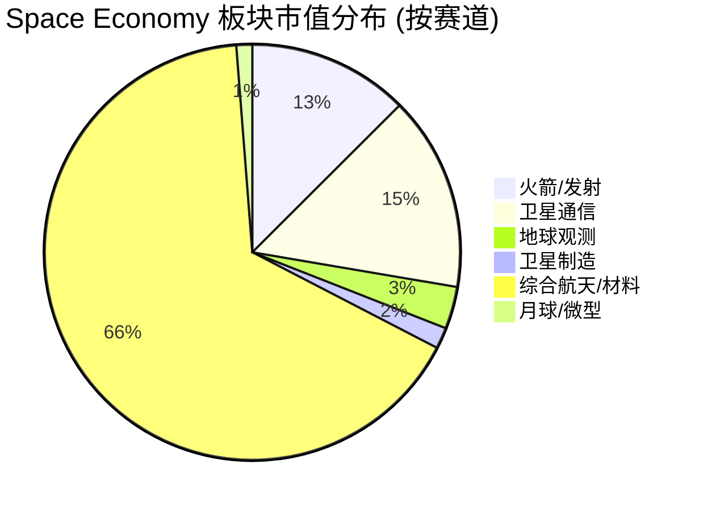

# Space Economy 航天板块全面调研

> 数据来源：@speculator_io "The Space Economy" dashboard (2026-05-08)，板块平均 P/S 23.37，P/E 63.19。

---

## 0. 板块总览

### 0.1 标的概览

| # | Ticker | 公司 | 赛道 | 股价 | 市值 | P/S | 1Y涨幅 |
|:---|:---|:---|:---|:---|:---|:---|:---|
| 1 | RKLB | Rocket Lab | 火箭/发射 | $98.68 | $57.0B | 83.82 | +0.9% |
| 2 | FLY | Firefly Aerospace | 火箭/发射 | $38.92 | $6.3B | 33.95 | +47.6% |
| 3 | FJET | Starfighters Space | 火箭/空射 | $5.67 | $253M | — | -82.0% |
| 4 | SPCE | Virgin Galactic | 太空旅游 | $2.67 | $252M | 163.27 | -94.7% |
| 5 | YSS | York Space Systems | 卫星制造 | $35.81 | $4.6B | 25.11 | -19.6% |
| 6 | RDW | Redwire Space | 航天基础设施 | $10.72 | $2.1B | 5.74 | -59.8% |
| 7 | VOYG | Voyager Technologies | 国防/空间站 | $28.02 | $1.7B | 9.93 | -62.1% |
| 8 | PL | Planet Labs | 地球观测 | $38.21 | $13.6B | 44.25 | -8.4% |
| 9 | BKSY | BlackSky Technology | 实时情报 | $37.84 | $1.48B | 14.38 | -11.5% |
| 10 | SATL | Satellogic | 高分辨率遥感 | $7.31 | $1.0B | 59.14 | -62.5% |
| 11 | SPIR | Spire Global | 气象/海事数据 | $17.76 | $620M | 8.66 | -24.7% |
| 12 | ASTS | AST SpaceMobile | 手机直连卫星 | $69.46 | $27.0B | 380.02 | -46.5% |
| 13 | VSAT | Viasat | 卫星宽带 | $69.25 | $9.4B | 2.03 | +0.5% |
| 14 | TSAT | Telesat | LEO星座 | $54.02 | $2.8B | 7.17 | -3.0% |
| 15 | SATS | EchoStar | 卫星+无线 | $124.58 | $36.3B | 2.42 | -9.4% |
| 16 | GILT | Gilat Satellite | 地面终端 | $19.07 | $1.4B | 3.19 | -7.3% |
| 17 | BA | Boeing | 综合航天/航空 | $236.05 | $186.2B | 2.02 | -5.7% |
| 18 | AIR | Airbus | 综合航天/航空 | $119.22 | ~$147B | 1.51 | -6.3% |
| 19 | MTRN | Materion | 特种材料 | $197.89 | $4.1B | 2.15 | -2.0% |
| 20 | LUNR | Intuitive Machines | 月球探测 | $27.82 | $6.0B | 28.79 | -10.7% |
| 21 | SIDU | Sidus Space | 微型卫星+AI | $3.29 | $264M | 77.90 | -82.6% |
| 22 | UFO | Procure Space ETF | 航天ETF | $53.52 | — | — | — |

### 0.2 赛道分类与市值分布



> 注：综合航天（BA+AIR+MTRN）虽然市值大，但航天业务占比有限。纯航天标的实际可投资市值约 $150-200B。

### 0.3 行业主要趋势

**1. 政府支出是核心驱动力**

SDA（太空发展局）的 PWSA（扩散作战人员太空架构）是商业航天最大单一需求来源，Tranche 2/3/4 累计合同超 $500亿。RKLB、YSS 等直接受益。

**2. 发射频次急剧上升**

2025年全球入轨发射超过 280 次，其中 SpaceX 占 ~150 次，Rocket Lab 21 次。2026年预计总发射超 350 次。

**3. IPO 窗口打开**

2025-2026年迎来航天 IPO 潮：Firefly (Aug 2025), Voyager (Jun 2025), York Space (Jan 2026), Starfighters (Dec 2025)。市场对航天资产的接受度提升。

**4. 手机直连卫星成为新战场**

AST SpaceMobile、Starlink Direct-to-Cell、Lynk Global 等竞争激烈。T-Mobile/AT&T/Vodafone 等运营商深度参与。

**5. 月球经济启动**

NASA CLPS 项目、Artemis 计划推动月球着陆器、巡视器、通信中继等多层次需求。IM-1（2024.02）是 50 年来首次美国重返月球。

**6. 估值分化极端**

纯航天板块估值范围极大：从 P/S 2x（VSAT）到 380x（ASTS）到亏损/无收入（SPCE）。市场在"未来巨大 TAM"和"当前微小收入"之间剧烈摇摆。

---

## 1. 火箭/发射赛道

### 1.1 赛道概览

| 公司 | 市值 | FY营收 | P/S | 核心火箭 | 竞争优势 |
|:---|:---|:---|:---|:---|:---|
| RKLB | $57.0B | $602M (FY25) | 83.8x | Electron + Neutron(研) | 唯一成功商业化的中小型专用发射 |
| FLY | $6.3B | IPO中 | 34.0x | Alpha + MLV(研) | 月球着陆+发射+国防全栈 |
| FJET | $253M | 极小 | — | STARLAUNCH(空射) | 全球最大商用超音速机队 |
| SPCE | $252M | ~$5-10M | 163.3x | Delta(研) | 品牌+先发（但基本无商业化） |

**赛道核心逻辑**：发射是航天经济的入口。SpaceX 未上市 → RKLB 是最大且唯一可投资的纯发射标的。FLY 刚 IPO 进入第二梯队。FJET 和 SPCE 属于高风险微型/烧钱末期。

---

### 1.2 RKLB — Rocket Lab（详见 [[RocketLab深度调研]]）

| 项目 | 详情 |
|:---|:---|
| **CEO** | Sir Peter Beck |
| **总部** | Long Beach, CA |
| **上市** | 2021.08 SPAC (NASDAQ) |
| **FY2025 营收** | $6.02亿 (+38% YoY) |
| **FY2025 毛利** | 34.4% GAAP, ~39.7% Non-GAAP |
| **现金** | $8.29亿 |
| **Backlog** | $18.5亿 |

**核心业务三支柱**：
1. **Electron** — 小型专用发射，21次/年（2025），$7.5-10M/次，基本垄断小型发射市场
2. **Neutron** — 中型可复用火箭，对标 Falcon 9，首飞目标 Q4 2026（已从 2024 延期多次），$4亿研发投入，一级储箱 2026.01 试验破裂延期
3. **空间系统** — FY2025 占比 57%，通过并购（Geost $275M, OSI, PCL, Mynaric拟收购）构建垂直整合，SDA 累计 $13亿+ 合同

**投资要点**：Neutron 成功则值 $200+（乐观$25亿营收×15x），失败则可能回 $15-20（纯 Electron+空间系统）。当前 $57B 市值对应 ~70x trailing P/S，极度定价 Neutron 成功概率。14 位分析师覆盖，共识 Moderate Buy，目标价中位数 $90。

> 完整分析见 [[RocketLab深度调研]] (499行)

---

### 1.3 FLY — Firefly Aerospace

| 项目 | 详情 |
|:---|:---|
| **CEO** | Jason Kim |
| **总部** | Cedar Park, TX |
| **上市** | 2025.08 IPO @ $45 (NASDAQ: FLY)，募资 $932M（净额） |
| **当前** | $38.92（-13.5% vs IPO），$6.3B 市值 |

**核心业务**：
- **Alpha 火箭** — 小型液体火箭，～1 ton to LEO，年发射频次 ~2-3次。直接竞品是 Electron
- **MLV（Medium Launch Vehicle）** — 与 Northrop Grumman 合作开发中型火箭，对标 Neutron/Falcon 9
- **Blue Ghost 月球着陆器** — 2025年3月成功实现首次商业月球软着陆，NASA CLPS 合同
- **SciTec 收购** — 2025.10 完成，导弹预警/跟踪传感器，国防数据处理

**客户**：Lockheed Martin, Northrop Grumman, L3Harris, Space Force

**优势**：月球着陆能力全球唯一（除中国），全栈能力（发射+着陆+国防传感器）。风险：Alpha 频次远低于 Electron，MLV 研发或晚于 Neutron，IPO 后股价低于发行价。

---

### 1.4 FJET — Starfighters Space

| 项目 | 详情 |
|:---|:---|
| **CEO** | Tim Franta (2026.02 接替创始人 Rick Svetkoff) |
| **总部** | Cape Canaveral, FL (NASA KSC) |
| **上市** | 2025.12 Reg A IPO @ $3.59 (NYSE American)，募资 $40M |
| **当前** | $5.67（+58% vs IPO 但 1Y -82%），$253M 市值 |

**商业模式**：运营全球最大商用超音速机队（改装 F-104 Starfighter），可维持 MACH 2 飞行，从 NASA 肯尼迪航天中心出发。STARLAUNCH 平台作为第一级空射平台，将载荷运至 45,000 英尺后发射入轨。同时做高超音速 R&D 测试、飞行员训练、科研支持。

**风险**：$253M 微型市值，商业验证几乎为零，空射火箭市场曾经失败（Virgin Orbit 破产），CEO 刚换，管理层不稳定。唯一亮点是极低成本进入航天发射的想象空间。

---

### 1.5 SPCE — Virgin Galactic

| 项目 | 详情 |
|:---|:---|
| **CEO** | Michael Colglazier |
| **总部** | Tustin, CA |
| **当前** | $2.67（-94.7% 1Y），$252M 市值 |

**现状**：VSS Unity 已于 2024 年退役，目前无运营飞行器。Delta 级新一代飞船在研发中，预计 2026 年首飞，每次可载 6 人。公司的烧钱速度(~$100M+/季度)与现金储备之间存在巨大张力，持续股权稀释。

**核心问题**：太空旅游 TAM 远小于预期。VSS Unity 商业运营期间仅飞了 6 次付费任务，年化收入微乎其微。Delta 即使成功，商业模式也存疑（$450K/座位 vs 需求不明）。这是一个**市值陷阱**——品牌认知度 > 商业可行性。

---

## 2. 卫星/航天器制造赛道

### 2.1 赛道概览

| 公司 | 市值 | FY营收(估) | P/S | 定位 |
|:---|:---|:---|:---|:---|
| YSS | $4.6B | IPO (2026.01) | 25.1x | 军用小卫星标准化量产 |
| RDW | $2.1B | ~$300-350M | 5.7x | 航天组件+在轨基础设施 |
| VOYG | $1.7B | $225-255M (2026E) | 9.9x | 国防技术+商业空间站 Starlab |

---

### 2.2 YSS — York Space Systems

| 项目 | 详情 |
|:---|:---|
| **CEO** | Dirk Wallinger |
| **总部** | Denver, CO |
| **上市** | 2026.01.29 IPO @ $34 (NYSE)，募资 $629M |
| **当前** | $35.81（+5.3% vs IPO），$4.6B 市值 |

**业务**：标准化小型卫星批量生产，主要为美国政府和国防客户提供任务关键解决方案。核心客户是 SDA（太空发展局），参与 PWSA 星座建设。定位为"现代国防 prime"——用商业速度和规模化生产挑战传统军工巨头（Lockheed/Boeing/NGC）。

**优势**：SDA 星座需求确定且持续（Tranche 2/3/4），York 的标准化平台 vs 传统定制化卫星有成本和速度优势。风险：刚 IPO 两月，公开数据极少，$4.6B 估值 vs 未知营收基础。

---

### 2.3 RDW — Redwire Space

| 项目 | 详情 |
|:---|:---|
| **CEO** | Peter Cannito |
| **总部** | Jacksonville, FL |
| **上市** | 2021 SPAC (NYSE) |
| **当前** | $10.72（-59.8% 1Y），$2.1B 市值 |

**业务**：航天基础设施组件/子系统制造商。产品包括太阳能电池阵列（ROSA）、星敏感器、在轨制造/装配技术、空间相机和传感器。通过并购（Made In Space, Deployable Space Systems 等）构建产品组合，是典型的航天供应链"滚雪球"策略。

**估值分析**：P/S 5.74x 在航天板块中属于最低之一，反映市场对其增长可持续性和盈利能力的质疑。SPAC 热潮后多数航天股深度回调，RDW 也未能幸免。优势在于产品已装在数百颗卫星上（包括 ISS），但增长需要依赖更多航天任务和星座部署。

---

### 2.4 VOYG — Voyager Technologies

| 项目 | 详情 |
|:---|:---|
| **CEO** | Dylan Taylor |
| **总部** | Denver, CO |
| **上市** | 2025.06.11 IPO @ $31 (NYSE)，募资 $402M |
| **当前** | $28.02（-9.6% vs IPO，-62.1% 1Y），$1.7B 市值 |

**业务三大支柱**：
1. **国防技术** — 任务关键型国防解决方案，客户包括 Palantir, Lockheed Martin, NASA
2. **Starlab 商业空间站** — 与 Airbus 合作（后全资收购其股份），计划接替 ISS，目标 2028 运营
3. **子公司矩阵** — Nanoracks（空间站商业利用）、Pioneer Astronautics（推进/生命支持）、ZIN Technologies（工程服务）

**财务**：2025 Q4 营收 $225-255M（2026E 指引），backlog $265.6M，$700M+ 流动性（含 IPO 资金）。CEO Dylan Taylor 是航天创投领域知名人物。

**风险**：Starlab 是一个巨大的资金黑洞（空间站开发 $B 级别），2028 目标非常激进。股价从 IPO 后首日高点 $74 → 当前 $28，反映了市场对长期烧钱的担忧。

---

## 3. 地球观测/遥感赛道

### 3.1 赛道概览

| 公司 | 市值 | FY营收(最新) | P/S | 卫星数(估) | 特色 |
|:---|:---|:---|:---|:---|:---|
| PL | $13.6B | $308M (FY26) | 44.3x | 200+ | 全球最大遥感星座，日覆盖 |
| BKSY | $1.48B | ~$120-140M | 14.4x | ~20 | AI驱动实时情报分析 |
| SATL | $1.0B | $17.7M (FY25) | 59.1x | ~40 | 高分辨率+星座即服务(CaaS) |
| SPIR | $620M | $71.6M (FY25) | 8.7x | ~100+ | 无线电掩星气象+海事数据 |

---

### 3.2 PL — Planet Labs（遥感龙头）

| 项目 | 详情 |
|:---|:---|
| **CEO** | Will Marshall |
| **总部** | San Francisco, CA |
| **上市** | 2021 SPAC (NYSE) |
| **FY2026 营收** | $307.7M (+26% YoY)，Q4 $86.8M (+41%) |
| **FY2027 指引** | $415-440M (+35-43%) |
| **Adj EBITDA** | FY2026 首次全年盈利 $2.4M |
| **现金** | $640.1M |
| **Backlog** | $900M (+79% YoY) |
| **RPO** | $672M (+361% YoY) |

**业务**：200+ Dove 卫星 + SkySat 高分辨率卫星，每日全球成像。核心产品是"变化监测"——不是卖图片，是卖"地球上每天哪里变了"的洞察。Pelican 下一代卫星已发射 2 颗。2025 年收购 Bedrock Research（AI 解决方案），与 Google 合作"太空 AI 计算"。

**竞争**：vs Maxar（更高分辨率但更贵更慢）、vs BlackSky（更快回访但星座更小）、vs Airbus（欧洲对手）。Planet 的规模优势（200+卫星 → 日覆盖全球 → 数据飞轮）难以复制。

**估值**：$13.6B / $308M = 44x P/S trailing，但 FY2027E 营收 $415-440M → forward ~31x。首次 EBITDA 盈利是重要拐点。

---

### 3.3 BKSY — BlackSky Technology

| 项目 | 详情 |
|:---|:---|
| **CEO** | Brian O'Toole |
| **总部** | Herndon, VA |
| **上市** | 2021 SPAC (NYSE) |
| **当前** | $37.84（-11.5% 1Y），$1.48B 市值 |

**业务**：小卫星星座（~20颗）+ AI 驱动分析平台，专注实时情报。核心客户是政府/军方（NGA、DoD），做的是"监测+预警"而非"拍照片"——自动检测军舰、飞机、导弹发射器等目标的变化并实时告警。

**差异化**：回访频率极高（多颗卫星接力覆盖同一目标），AI 分析层价值高于原始影像。Gen-3 卫星分辨率 0.35m。风险：星座规模远小于 Planet（20 vs 200+），政府客户依赖度高。

---

### 3.4 SATL — Satellogic

| 项目 | 详情 |
|:---|:---|
| **CEO** | Emiliano Kargieman |
| **总部** | Montevideo, Uruguay / New York |
| **上市** | 2022 SPAC (NASDAQ) |
| **FY2025 营收** | $17.7M (+38%)，Q4 $6.2M (+94%) |
| **现金** | $94.4M（+ 2026.01 $35M 融资） |
| **RPO** | $65.1M |
| **净亏损** | -$4.8M（同比改善 $111.5M） |

**业务**：高分辨率（0.7m）遥感 + CaaS（Constellation-as-a-Service，星座即服务）。正在向"持续性监测"转型——不是卖单张图片，而是卖对特定区域的持续监控能力。卫星 40+ 颗在轨。

**优势**：垂直整合（自研卫星+传感器+数据平台），成本低于西方竞争对手。拉丁美洲市场的独特定位。风险：$17.7M 年营收 vs $1.0B 市值（59x P/S），规模太小，$94M 现金支撑不了太久。CaaS 模式尚未在大客户中得到验证。

---

### 3.5 SPIR — Spire Global

| 项目 | 详情 |
|:---|:---|
| **CEO** | Theresa Condor |
| **总部** | Vienna, VA |
| **上市** | 2021 SPAC (NYSE) |
| **FY2025 营收** | $71.6M，Q4 $15.8M (-27% YoY，含海事出售) |
| **Adj EBITDA** | -$9.7M (Q4 2025, improving) |
| **现金** | $81.8M |
| **2026 指引** | 收入（不含海事）增长 50%+ |

**业务**：100+ 颗卫星通过射频（RF）技术观测地球。三大数据集：无线电掩星（天气/气候模型）、海事 AIS（船舶追踪）、航空 ADS-B（飞机追踪）。2025.04 出售海事业务后更聚焦气象/空间服务（NOAA 合同是核心）。

**独特之处**：Spire 的数据不由传统光学相机产生，而是通过 RF 技术"聆听"地球——GPS 信号穿过大气层的变化（掩星）用于天气预报，船舶/飞机广播信号用于追踪。这种数据源不可替代性构成了护城河。风险：营收规模小（$71.6M），NOAA 合同依赖度高。

---

## 4. 卫星通信赛道

### 4.1 赛道概览

| 公司 | 市值 | FY营收(估) | P/S | 定位 |
|:---|:---|:---|:---|:---|
| ASTS | $27.0B | 极小(pre-rev) | 380x | 手机直连卫星（最大想象空间） |
| VSAT | $9.4B | ~$4.5B | 2.0x | 卫星宽带+军用通信 |
| TSAT | $2.8B | ~$200-250M | 7.2x | LEO 企业级宽带 (Lightspeed) |
| SATS | $36.3B | $15.0B (FY25) | 2.4x | 卫星电视/宽带+无线通信 |
| GILT | $1.4B | ~$300-350M | 3.2x | 卫星地面终端/VSAT 设备 |

---

### 4.2 ASTS — AST SpaceMobile（赛道明星/最大争议）

| 项目 | 详情 |
|:---|:---|
| **CEO** | Abel Avellan |
| **总部** | Midland, TX |
| **上市** | 2021 SPAC (NASDAQ) |
| **当前** | $69.46（-46.5% 1Y），$27.0B 市值 |

**业务**：建设大型 LEO 卫星星座（BlueBird），让普通手机无需任何改装即可直连卫星通话/上网。BlueWalker 3 测试卫星已成功证明技术可行性（2023 年完成首次手机→卫星语音通话）。合作伙伴：AT&T、Vodafone、Rakuten 等全球运营商。

**想象空间**：70 亿+ 手机用户 × $X/月附加费 = 天文数字 TAM。如果成功，ASTS 可能是航天板块中 TAM 最大的标的。

**现实问题**：几乎零收入。$27B 市值对应 380x P/S（其实 P/S 没有意义——根本没有 meaningful revenue）。2025-2026 年的核心任务是发射首批商业 BlueBird 卫星 + 获得 FCC 全面批准 + 运营商商业化。竞争威胁：SpaceX Starlink Direct-to-Cell（与 T-Mobile 合作）进展迅速，可能在 ASTS 大规模部署前抢占市场。

**投资判断**：这是**二元期权**——成功则 10-20x，失败则归零。不适合保守投资者。

---

### 4.3 VSAT — Viasat

| 项目 | 详情 |
|:---|:---|
| **CEO** | Mark Dankberg (Chairman+CEO) |
| **总部** | Carlsbad, CA |
| **上市** | 1996 IPO (NASDAQ) |
| **当前** | $69.25（+0.5% 1Y），$9.4B 市值 |

**业务**：ViaSat-3 超高通量卫星星座（每颗 >1 Tbps）、机载 Wi-Fi（与美国航空等合作）、军用战术数据链（Link 16）。2023 年收购 Inmarsat（$7.3B）后成为全球最大移动卫星服务商之一。

**财务状况**：Inmarsat 收购带来大量债务（$2B+），整合仍在进行中。P/S 仅 2.03x，PE n/a（亏损），反映市场对高债务+卫星行业结构性变化的担忧。Starlink 在航空 Wi-Fi 和宽带市场的竞争对 VSAT 传统业务构成直接威胁。

**优势**：Ka 波段频谱资源（稀缺且受保护），政府/军事业收入稳定（美国政府是最大客户之一），ViaSat-3 美洲星已于 2023 年发射（尽管天线问题导致部分容量损失）。

---

### 4.4 TSAT — Telesat

| 项目 | 详情 |
|:---|:---|
| **CEO** | Dan Goldberg |
| **总部** | Ottawa, Canada |
| **上市** | 2021 (NASDAQ + TSX) |
| **当前** | $54.02（-3.0% 1Y），$2.8B 市值 |

**业务**：现有 13 颗 GEO 卫星提供广播/宽带服务。核心故事是 **Lightspeed**——198 颗 LEO 宽带卫星星座（从原计划 298 颗优化缩减），由 MDA Space 制造（CAD $2.1B 合同），加拿大政府提供 CAD $1.44B 贷款/投资。

**时间线**：卫星制造中，发射计划 2026 年开始，商业服务 2027 年。相比 Starlink/OneWeb/Project Kuiper，Lightspeed 定位企业级市场而非消费者宽带——差异化在于高价值 B2B 连接。

**优势**：加拿大政府强力支持（降低融资风险），MDA 是可靠制造商，企业级定位避开了与 Starlink 的正面竞争。风险：LEO 宽带市场竞争激烈，延迟多次，总投入 ~$3.5B（对 $2.8B 市值公司来说巨大）。

---

### 4.5 SATS — EchoStar

| 项目 | 详情 |
|:---|:---|
| **CEO** | Hamid Akhavan |
| **总部** | Englewood, CO |
| **FY2025 营收** | $15.0B |
| **当前** | $124.58（-9.4% 1Y），$36.3B 市值 |

**业务复杂**：2023.12 与 DISH Network 合并，现在是卫星服务（HughesNet）+ 付费电视（DISH TV 5.02M + Sling TV 1.98M）+ 无线通信（Boost Mobile）+ S-band 频谱的组合体。HughesNet 是北美最大卫星宽带服务商之一。

**最新动态（关键）**：2026.03 与 >82% 债务持有人签署重组支持协议（RSA），显著去杠杆。DISH DBS 之前面临严重流动性压力，此次重组 + 偿还 $1.6B 债务缓解了破产风险。

**S-band 频谱价值**：EchoStar 持有宝贵的 S-band 频谱（2GHz），可用于卫星→手机直连。这在 ASTS/Starlink D2C 热潮中是重要战略资产。风险：付费电视结构性衰退（每季度流失订户），无线业务（Boost）面临 Verizon/T-Mobile/AT&T 碾压，债务仍然高企。

---

### 4.6 GILT — Gilat Satellite Networks

| 项目 | 详情 |
|:---|:---|
| **CEO** | Adi Sfadia |
| **总部** | Petah Tikva, Israel |
| **上市** | NASDAQ + TASE |
| **当前** | $19.07（-7.3% 1Y），$1.4B 市值 |

**业务**：卫星地面终端和 VSAT 网络设备制造商。核心产品：卫星调制解调器、固态功率放大器、VSAT 天线系统。客户包括卫星运营商（SES、Telesat、Intelsat）、电信公司、政府和军方。

**增长逻辑**：多轨道（GEO+MEO+LEO）卫星扩展 → 需要更多地面终端。Lightspeed、O3b mPOWER、Project Kuiper 等 LEO/MEO 星座都需要大量用户终端。GILT 是"卖铲子的人"——不管哪个星座赢，地面设备需求都增长。

**P/S 3.19x** 为板块最低之一。风险：以色列地缘政治风险（总部+部分制造），终端市场竞争激烈（对手包括 ST Engineering iDirect、Comtech 等）。

---

## 5. 综合航天+材料

### 5.1 BA — Boeing（航天业务约占 15-20%）

| 项目 | 详情 |
|:---|:---|
| **CEO** | Kelly Ortberg |
| **总部** | Arlington, VA |
| **当前** | $236.05（-5.7% 1Y），$186.2B 市值 |

**航天业务**（Defense, Space & Security 部门约 $25B 年收入）：
- **Starliner** — 商业乘员飞船，CST-100 首次载人飞行 2024.06 成功但推进器问题导致返回时使用备份方案。后续载人任务暂停/不确定
- **SLS (Space Launch System)** — NASA Artemis 登月火箭的核心级制造，单枚 ~$2B
- **卫星制造** — 军用通信卫星（WGS）、GPS III 等
- **X-37B 太空飞机** — 美军无人轨道试验平台
- **国际空间站** — NASA ISS 主承包商

**投资视角**：Boeing 的航天业务对其总估值的贡献有限（核心看点是 737 MAX 恢复 + 787 交付），但如果 Artemis 项目收缩/SLS 取消，对航天收入是负面。Starliner 的不确定性也是风险。

---

### 5.2 AIR — Airbus（航天业务约占 10-15%）

| 项目 | 详情 |
|:---|:---|
| **CEO** | Guillaume Faury |
| **总部** | Toulouse, France |
| **交易** | Euronext Paris (AIR) / OTC: EADSY |
| **当前** | ~€110 / $119.22（-6.3% 1Y），市值 ~€135B / ~$147B |

**航天业务**（Airbus Defence and Space）：
- OneWeb 卫星制造（与 OneWeb 合资，交付了 600+ 颗卫星）
- 地球观测卫星（Pléiades Neo, TerraSAR-X）
- Ariane 火箭（ArianeGroup 合资企业）
- 军用运输机（A400M）、Eurofighter 战斗机
- 原与 Voyager 合作 Starlab（已退出，股份还给 Voyager）

**投资视角**：Airbus 的航天业务更多是防御性/政府合同驱动，增长不如纯商业航天。但 OneWeb 制造经验使其在星座制造领域有独特竞争力。欧洲太空预算（ESA）的增长趋势利好。

---

### 5.3 MTRN — Materion（特种材料隐形冠军）

| 项目 | 详情 |
|:---|:---|
| **CEO** | Jugal Vijayvargiya |
| **总部** | Mayfield Heights, OH |
| **当前** | $197.89（-2.0% 1Y），$4.1B 市值 |

**业务**：高性能合金、铍（beryllium）、精密涂层、复合材料。航天/国防是核心终端市场。产品用于卫星结构件、火箭喷嘴、红外传感器窗口（铍的独特性质——轻、刚性高、热稳定性好）。也是半导体、医疗设备的关键材料供应商。

**护城河**：铍材料的加工技术壁垒极高，全球仅少数公司具备。MTRN 是 SpaceX、NASA、国防 prime contractors 的核心材料供应商。P/S 仅 2.15x → 航天板块中估值最合理的之一。

**投资逻辑**：航天材料是"卖铲子"策略——无论谁造火箭卫星，都需要高性能材料。但 MTRN 并非纯航天标的（工业+医疗+半导体也重要），航天敞口有限。

---

## 6. 月球探测 + 微型航天

### 6.1 LUNR — Intuitive Machines

| 项目 | 详情 |
|:---|:---|
| **CEO** | Steve Altemus |
| **总部** | Houston, TX |
| **上市** | 2023.02 SPAC (NASDAQ) |
| **当前** | $27.82（-10.7% 1Y），$6.0B 市值 |
| **Backlog** | $3B+ |

**业务三大引擎**：

1. **NASA CLPS 月球着陆器** — IM-1（2024.02）成功着陆但侧翻（仍算 50 年来美国首次重返月球），IM-2（2025.02）同样侧翻提前结束，IM-3 计划 2026 年着陆 Reiner Gamma 区域（合同 ~$117M）

2. **NSN（Near Space Network）** — NASA $4.8B 上限合同，为月球轨道提供通信/导航中继卫星。首批任务订单 $150M+。这才是 LUNR 的真正价值引擎——从"一次性着陆器"转型为"月球通信基础设施运营商"

3. **OMES（工程服务）** — 为 NASA 提供系统工程和集成服务

**风险**：IM-1 和 IM-2 都侧翻了，"成功但不够成功"。每次着陆失败都消耗投资者信心。NSN 合同的执行能力存疑。但如果有一次"完美着陆"→ 大幅重估。

---

### 6.2 SIDU — Sidus Space

| 项目 | 详情 |
|:---|:---|
| **CEO** | Carol Craig |
| **总部** | Cape Canaveral, FL |
| **上市** | 2021 IPO (NASDAQ) |
| **当前** | $3.29（-82.6% 1Y），$264M 市值 |

**业务**：LizzieSat 3D 打印微型卫星平台。Space-as-a-Service 模式——自己发射卫星→卖在轨数据服务（AIS 海事追踪、多光谱成像、边缘 AI 计算）。客户包括 NASA、SpaceX、Parsons Corporation。

**残酷现实**：年营收 ~$6M，现金消耗快，持续股权融资稀释股东。$264M 市值 vs $6M 营收（~44x P/S）估值不低。最大的风险是能否活着等到卫星数据订阅模式规模化。微型航天中，大部分最终破产或被收购——SIDU 的存活概率是真实风险因子。

---

## 7. ETF 工具

### UFO — Procure Space ETF

| 项目 | 详情 |
|:---|:---|
| **当前** | $53.52 |
| **费用率** | 0.75% |
| **策略** | 被动跟踪 S-Network Space Index，覆盖 30+ 航天相关股票 |

**持仓**（通常包括）：RKLB, PL, ASTS, BA, AIR, VSAT, SATS, GILT, LUNR, SPCE 等。本质上就是本文分析的这些标的的一键买入版。适合不想选股的投资者，但 0.75% 费用率偏贵。

---

## 8. 投资总结与排序建议

### 8.1 综合排序

按**风险调整后收益潜力**排序（结合估值合理性、业务确定性和成长空间）：

| 梯队 | 公司 | 推荐 | 理由 |
|:---|:---|:---|:---|
| **Tier 1: 核心持仓** | RKLB, PL | ★★★★★ | 赛道龙头，已验证商业模式，清晰盈利路径 |
| **Tier 2: 高成长溢价** | FLY, YSS, LUNR | ★★★★ | 新品/新市场驱动，高不确定性但想象空间大 |
| **Tier 3: 价值/卖铲子** | GILT, MTRN, VSAT | ★★★ | 估值合理，航天敞口存在但非纯正标的 |
| **Tier 4: 投机性持有** | ASTS, TSAT, VOYG, BKSY | ★★ | 二元结果，大赢或归零 |
| **Tier 5: 观察/避雷** | RDW, SATL, SPIR, SATS | ★ | 估值陷阱、商业模式存疑或核心业务衰退 |
| **Tier 6: 高风险微型** | FJET, SPCE, SIDU | ☆ | 大概率归零，仅适合极端风险偏好 |

### 8.2 Top 3 Picks 详解

**1. Planet Labs (PL)** — 遥感龙头，首次 EBITDA 盈利 + FY2027E 营收 $415-440M (+38% at midpoint) + $640M 现金 + $900M backlog + AI 催化。44x P/S 不便宜但 forward ~31x 且首次盈利后估值框架可切换至利润指标。

**2. Rocket Lab (RKLB)** — 详见 [[RocketLab深度调研]]。Neutron 是"免费期权"，即使 Neutron 失败现有的 Electron + 空间系统业务也值 $15-20/股。关键催化剂 2026 Q4 Neutron 首飞。

**3. Gilat Satellite (GILT)** — 估值最低（P/S 3.2x），业务最稳定（地面终端制造，不赌任何单一星座成败），LEO/MEO 多轨道扩张的铲子卖家。下行有底（有利润、有股息），上行有限但确定。

### 8.3 组合构建建议

**进取型组合**（航天信仰者）：
```
40% RKLB + 25% PL + 15% LUNR + 10% ASTS + 10% FLY
```

**平衡型组合**（航天敞口+防御）：
```
25% RKLB + 20% PL + 20% GILT + 15% MTRN + 20% UFO ETF
```

**保守型组合**（低波动+分红）：
```
40% UFO ETF + 25% MTRN + 20% GILT + 15% VSAT
```

### 8.4 关键观察

1. **板块分化严重**：RKLB $57B vs FJET $253M，72x vs no revenue。不要把它们当同一个板块对待。
2. **IPO 泡沫普遍**：FLY/ VOYG / YSS / FJET 四个新 IPO 中 3 个低于发行价。市场对航天 IPO 的定价越来越理性。
3. **政府客户是双刃剑**：提供稳定收入但也造成客户集中风险。SDA 预算变化可能同时影响 RKLB+YSS+RDW。
4. **手机直连卫星是 2026-2027 最大结构性机会**：ASTS vs Starlink D2C 是板块中不确定性最高但赔率最大的赌局。
5. **估值回归风险**：板块平均 P/S 23.37，排除无收入/微收入标的后仍 >10x。如果市场风险偏好下降，高估值可能承压。

---

*报告生成日期：2026年5月10日。数据来源：SEC EDGAR filings (10-K, 10-Q, S-1, 8-K), SpaceNews, Yahoo Finance, speculator.io dashboard, Exa Search。不构成投资建议。*