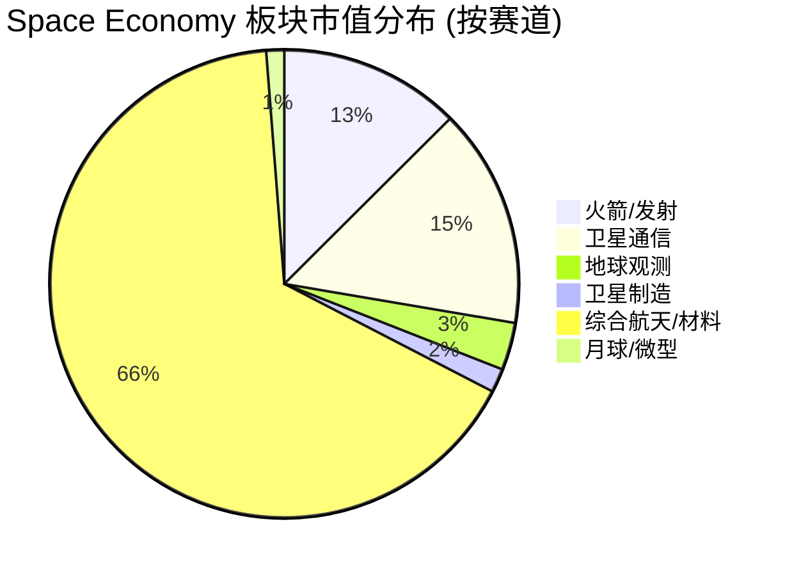

# Space Economy 航天板块全面调研

> 数据来源：@speculator_io "The Space Economy" dashboard (2026-05-08)，板块平均 P/S 23.37，P/E 63.19。

---

## 0. 板块总览

### 0.1 标的概览

| # | Ticker | 公司 | 赛道 | 股价 | 市值 | P/S | 1Y涨幅 |
|:---|:---|:---|:---|:---|:---|:---|:---|
| 1 | RKLB | Rocket Lab | 火箭/发射 | $98.68 | $57.0B | 83.82 | +0.9% |
| 2 | FLY | Firefly Aerospace | 火箭/发射 | $38.92 | $6.3B | 33.95 | +47.6% |
| 3 | FJET | Starfighters Space | 火箭/空射 | $5.67 | $253M | — | -82.0% |
| 4 | SPCE | Virgin Galactic | 太空旅游 | $2.67 | $252M | 163.27 | -94.7% |
| 5 | YSS | York Space Systems | 卫星制造 | $35.81 | $4.6B | 25.11 | -19.6% |
| 6 | RDW | Redwire Space | 航天基础设施 | $10.72 | $2.1B | 5.74 | -59.8% |
| 7 | VOYG | Voyager Technologies | 国防/空间站 | $28.02 | $1.7B | 9.93 | -62.1% |
| 8 | PL | Planet Labs | 地球观测 | $38.21 | $13.6B | 44.25 | -8.4% |
| 9 | BKSY | BlackSky Technology | 实时情报 | $37.84 | $1.48B | 14.38 | -11.5% |
| 10 | SATL | Satellogic | 高分辨率遥感 | $7.31 | $1.0B | 59.14 | -62.5% |
| 11 | SPIR | Spire Global | 气象/海事数据 | $17.76 | $620M | 8.66 | -24.7% |
| 12 | ASTS | AST SpaceMobile | 手机直连卫星 | $69.46 | $27.0B | 380.02 | -46.5% |
| 13 | VSAT | Viasat | 卫星宽带 | $69.25 | $9.4B | 2.03 | +0.5% |
| 14 | TSAT | Telesat | LEO星座 | $54.02 | $2.8B | 7.17 | -3.0% |
| 15 | SATS | EchoStar | 卫星+无线 | $124.58 | $36.3B | 2.42 | -9.4% |
| 16 | GILT | Gilat Satellite | 地面终端 | $19.07 | $1.4B | 3.19 | -7.3% |
| 17 | BA | Boeing | 综合航天/航空 | $236.05 | $186.2B | 2.02 | -5.7% |
| 18 | AIR | Airbus | 综合航天/航空 | $119.22 | ~$147B | 1.51 | -6.3% |
| 19 | MTRN | Materion | 特种材料 | $197.89 | $4.1B | 2.15 | -2.0% |
| 20 | LUNR | Intuitive Machines | 月球探测 | $27.82 | $6.0B | 28.79 | -10.7% |
| 21 | SIDU | Sidus Space | 微型卫星+AI | $3.29 | $264M | 77.90 | -82.6% |
| 22 | UFO | Procure Space ETF | 航天ETF | $53.52 | — | — | — |

### 0.2 赛道分类与市值分布

> 注：综合航天（BA+AIR+MTRN）虽然市值大，但航天业务占比有限。纯航天标的实际可投资市值约 $150-200B。

### 0.3 行业主要趋势

**1. 政府支出是核心驱动力**

SDA（太空发展局）的 PWSA（扩散作战人员太空架构）是商业航天最大单一需求来源，Tranche 2/3/4 累计合同超 $500亿。RKLB、YSS 等直接受益。

**2. 发射频次急剧上升**

2025年全球入轨发射超过 280 次，其中 SpaceX 占 ~150 次，Rocket Lab 21 次。2026年预计总发射超 350 次。小型发射（Electron, Alpha, RS1）逐步商业化。

**3. IPO 窗口打开**

2025-2026年迎来航天 IPO 潮：Firefly (Aug 2025), Voyager (Jun 2025), York Space (Jan 2026), Starfighters (Dec 2025)。市场对航天资产的接受度提升。

**4. 手机直连卫星成为新战场**

AST SpaceMobile、Starlink Direct-to-Cell、Lynk Global 等竞争激烈。T-Mobile/AT&T/Vodafone 等运营商深度参与。这是航天板块中增长潜力最大的细分市场之一。

**5. 月球经济启动**

NASA CLPS 项目、Artemis 计划推动月球着陆器、巡视器、通信中继等多层次需求。Intuitive Machines 的 IM-1（2024.02）是 50 年来首次美国重返月球。

**6. 估值分化极端**

纯航天板块估值范围极大：从 P/S 2x（VSAT）到 380x（ASTS）到亏损/无收入（SPCE）。市场在"未来巨大 TAM"和"当前微小收入"之间剧烈摇摆。

---

## 1. 火箭/发射赛道