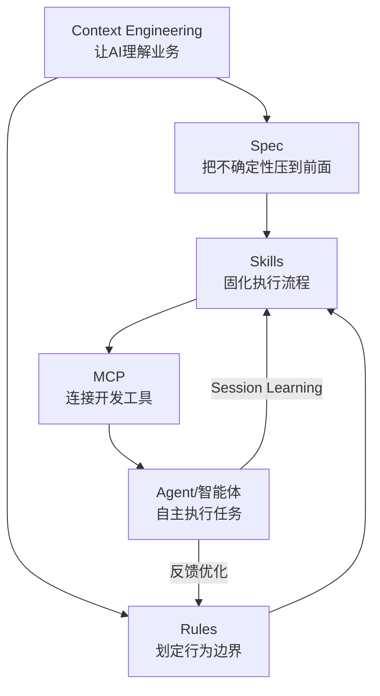

## 概述

文章《顷刻炼化！我把字节20篇AI编程手册嚼碎了喂你》由字节跳动工程师 br1an_tsang 撰写，基于字节内部 **20 篇 AI 编程手册** 和 **《2026 企业级 AI 编程实践手册》** 提炼出六大核心方法论。

**核心论点**: AI 编程真正的分水岭不在模型，在上下文。你的 AI 不好用，不是模型的问题——而是你没有给它正确的上下文、没有建立有效的协作体系。

这一判断与 TRAE 团队的实践高度一致。在模型能力趋同的背景下，**Context Engineering（上下文工程）** 被视为"真正的护城河"——它无法被模型升级替代，只能通过持续实践积累。

---

## 六大方法论详析

### 一、Context Engineering（上下文工程）——真正的护城河

**核心思想**: AI 编程的效率瓶颈不在于模型能力，而在于**如何让 AI 获得足够且精准的上下文**。

> "Context Engineering 不是简单地'把代码扔给 AI'，而是一套系统化的方法：如何识别关键信息、如何结构化地组织项目级和模块级的上下文、如何在有限的 token 窗口内精准传递最相关的信息，以及随着项目发展如何持续优化这些上下文。"

**三个层次**:
- **全局上下文** (Global Context): 始终存在的信息——核心架构图、通用工具库定义、编码规范
- **动态上下文** (Dynamic Context): 基于当前任务自动检索的相关文件，按需加载
- **临时上下文** (Ephemeral Context): 当前会话的对话历史和临时指令

**关键技术**: 字节采用**渐进式索引 (Progressive Indexing)** 机制，借鉴 Anthropic Skills 的"渐进式披露"思想——先提供轻量级"目录"，让 AI 根据任务精准定位并读取最相关信息，避免上下文过载。

**实践建议**:
- 建立 CLAUDE.md / AGENTS.md 作为全局索引，但控制在 200 行以内
- 用 `docs/` frontmatter 索引系统标记每份文档的适用场景
- 代码优先，文档补充代码里没有的关键业务逻辑
- **让上下文可以被检索，而不是全量喂入**

---

### 二、Skills（技能封装）——从"工具调用"到"业务 Context 封装"

**核心思想**: 通用 AI 模型擅长通用任务，但企业开发充满特定场景。Skills 是连接**通用 AI 能力**与**企业特定需求**的抽象层，将团队的 SOP（标准操作流程）固化为可复用的"技能包"。

> "Skill 不是'再写一段更长的 Prompt'，而是把专家的经验流程从对话里搬出来，变成一个可以被安装、被复用的'工作包'。"

**一个好的 Skill 包含四个闭环**:
1. **任务理解**: 将自然语言需求转化为结构化任务
2. **上下文获取**: 自动收集所需的代码、文档和配置
3. **执行策略**: 针对特定场景优化执行流程
4. **结果验证**: 提供自动化质量检查

**Skill 编写原则**:
- 不写散文，写**可执行流程**（Steps → Checks → Rollback → Output Format）
- 每步有检查点、失败有回滚策略、输出用结构化格式
- 明确**停止条件与升级策略**: 权限不足/输入缺失/风险动作时必须停下问人
- 做到幂等——中断后随时可重来

**数据验证**: 在 TRAE Loop 实验中，修复 **32 个业务 Bug** 时，使用 Skills 成功率达 **100%**，不使用仅为 **59%**。

**实践建议**:
- 将编译、测试、验证这类固定动作封装为 Skill
- 把团队的"隐性习惯"变成可被 AI 执行的标准流程
- 按业务域分类管理 Skill，避免单个 Skill 过于庞大
- 定期用文档自动维护 Prompt 更新 Skill 内容，防止过期

---

### 三、Spec（规格说明）——把不确定性压到前面

**核心思想**: Spec Coding 是一种**先规格后实现**的编程范式。在让 AI 写代码之前，先用结构化文档把"要做什么、怎么做、有什么约束"说清楚。

> "企业级开发中，模糊的需求描述是质量问题的根源。Spec 通过精确定义意图，把不确定性压到编码之前。"

**协作分工**:
- **人类负责 Spec（What）** — 需求边界、业务逻辑、验收标准
- **AI 负责实现（How）** — 代码编写、测试生成、部署配置

**关键的渐进式 Spec 原则**（避免瀑布陷阱）:
- 不是所有需求都值得写完整 Spec——**70% 的需求是 ≤5 人日的小需求**
- 小需求走轻量 Spec（PRD + 验收标准即可）
- 大需求拆分为 15 项以内的 tasks，每项改动控制在 400 行以内
- 避免 AI 生成几百行的 Spec 文档——会让任务膨胀，反而失去灵活性

**实践建议**:
- 配合 Spec 使用 Plan Mode + TODO 工具实现轻量级规划
- "代码即文档"——关键设计背景通过命名、注释内置在代码中
- 不要让过度 Spec 限制 AI 的创造力，保留探索空间
- Spec 是"活文档"，需要随代码同步更新

---

### 四、Rules（规则约束）——企业编码标准的 AI 化

**核心思想**: Rules 是**企业编码标准、架构原则和最佳实践的形式化表达**。让 AI 不仅写出"能跑"的代码，更能写出"企业级"的代码。

> "Rule 的价值很直白：让模型遵循开发者意愿，把开发者的'隐性习惯'变成'可显式执行'的表达。这是 AI Coding 产品从能用到好用的关键。"

**Rules 覆盖维度**:
- **编码规范**: 命名约定、文件组织、代码风格
- **架构原则**: 分层规则、依赖方向、设计模式约束
- **安全合规**: 敏感信息处理、加密要求、权限边界
- **技术标准**: 禁止使用的 API、必须使用的框架/库

**Rules 的三层管理**:
- **全局 Rules**: 所有项目通用的安全/合规底线
- **项目 Rules**: 特定技术栈/业务域的约束
- **场景 Rules**: 仅在特定条件下生效（如"涉及资金交易时"）

**Rule vs Skill 的区别**:
- Rules 是**被动约束**（始终生效，如"刹车"）
- Skills 是**主动执行**（按需调用，如"司机"）
- Rules 不能被 Skills 替代——安全与合规的最后防线

**实践建议**:
- Rules 要小而精，不要写成长篇建议——用"可以做/不可以做"的表达
- 多规则拆分管理，按范围精细化控制生效时机
- 支持导入 AGENTS.md / CLAUDE.md 降低迁移成本
- 从团队反馈中持续优化规则库

---

### 五、MCP（Model Context Protocol）——标准化 AI 与开发环境的交互接口

**核心思想**: AI 编程不是孤立的代码生成。MCP 定义了 AI 模型如何与 IDE、Git、CI/CD、数据库、API 等开发工具进行**标准化交互**。

> "没有标准化的交互协议，每个工具都需要单独适配，这会严重限制 AI 编程的生态发展。MCP 解决的是基础设施问题。"

**MCP 的价值**:
- **统一接口**: 读取文件、执行命令、查询数据库都用同一套协议
- **权限控制**: 明确访问边界，安全可控
- **状态同步**: AI 感知项目状态（构建结果、测试通过率、部署状态）
- **工具扩展**: 支持企业自定义工具的快速接入

**当前主流 MCP 应用场景**:
- 代码仓库操作（GitHub/GitLab MCP）
- 数据库查询（Supabase/Postgres MCP）
- 文档搜索（Context7/飞书 MCP）
- 浏览器自动化（Playwright MCP）
- 监控数据查询（Grafana MCP）

**实践建议**:
- 先使用社区已有的 MCP Server，再考虑自建
- MCP 工具要遵循"单一职责"——一个工具只做一件事
- 设计时有故障降级——辅助工具的失败不应阻塞核心流程

---

### 六、Agent/智能体——从被动工具到主动协作者

**核心思想**: 当前的 AI 编程工具大多是被动响应模式——你问一句，它答一句。但真正的协作应该是 AI 能**主动理解项目目标、发现问题、提出建议、自主完成子任务**。

> "智能体具备目标理解、环境感知、自主决策和学习进化的能力。它代表 AI 编程从工具到伙伴的进化。"

**智能体的四个核心能力**:
1. **目标理解**: 从高层需求推导出可执行的任务计划
2. **环境感知**: 持续监控代码库、测试结果和部署状态
3. **自主决策**: 根据当前状态选择最优行动策略
4. **学习进化**: 从反馈中优化行为模式（Session Learning）

**多智能体协作模式**:
- **编排模式**: 一个主控 Agent 拆解任务，分发给专业化子 Agent
- **对抗模式**: 编码 Agent + 评审 Agent 分离，互相校验（Anthropic 推荐）
- **流水线模式**: 需求分析 → 方案设计 → 编码 → 审查 → 测试 → 部署

**关键原则**（来自 Anthropic 工程博客）:
> "将做事的 Agent 和评判的 Agent 分开，是一个强有力的杠杆。Agent 存在一个根本性限制——它们无法准确评估自身产出的质量。因此，外部化的约束和反馈不是可选的增强，而是 Agent 可靠运行的必要条件。"

**实践建议**:
- 不要让同一个 Agent 既写代码又审代码
- 给 Agent 设置明确的质量门禁（Quality Gates）：理解 → 规划 → 执行 → 验证
- 每个阶段之间必须通过审核才能进入下一阶段
- 将 Agent 的决策过程记录为可审计日志

---

## 六大方法论的关系

这六个方法论不是孤立的，而是从**理解 → 约束 → 执行 → 进化**的完整闭环：

**一句话总结**: Context Engineering 让 AI 懂业务，Spec + Rules 约束 AI 守规矩，Skills 封装企业能力，MCP 连接工具链，Agent 让整个体系自主运转。

---

## 关键数据

| 数据指标 | 数值 | 来源 |
|----------|------|------|
| 使用 Skills 的 Bug 修复率 | **100%** | TRAE Loop 实验 (32 个业务 Bug) |
| 不使用 Skills 的 Bug 修复率 | 59% | 同上对照组 |
| AI 代码占比（Harness 体系） | **95.47%** | Harness Engineering 实践 |
| 无 Harness 体系的 AI 代码占比 | 24.86% | 同上对照组 |
| TRAE 月活跃用户 | 超 **100 万** | 2025 火山引擎 FORCE 大会 |
| 字节内部 AI 辅助开发覆盖率 | 超 **80%** | 同上 |
| SOLO 模式一次性跑通率 | **92%** | 2026 Q1 数据 |
| 代码采纳率提升 | 38% → **72%** | 同上 |
| 中大型 Java 项目效率提升 | **2.3 倍** | 同上 |
| Claude Code 用户 Token 消耗倍率 | 用 **10 倍 token** 换 **2 倍智能** | 社区实践 |

---

## 对量化/工程开发的启示

### 1. 量化研究的 AI 编程适配

量化研究的特点——数据处理管线、回测框架、因子计算——天然适合 AI 辅助开发:
- **Context Engineering**: 将数据 Schema、因子定义、回测配置组织为可检索的上下文
- **Skills**: 封装"因子开发→回测→绩效分析"的标准流程为 Skill
- **Spec**: 在写因子逻辑前，先明确因子公式、数据源、Look-ahead bias 防护

### 2. 策略代码的质量保障

金融策略代码对正确性要求极高。字节的方法论直接适用:
- **Rules**: 禁止未来函数、强制 OOS 验证、限制最大回撤/杠杆
- **多 Agent 审查**: 编码 Agent 写策略 + 审查 Agent 检查 look-ahead / survivorship bias
- **Spec 先行**: 在实现前定义清楚信号逻辑和风控规则

### 3. 从"写代码"到"定义规则"的转变

最根本的启示: **程序员的价值从"写代码"转移到"定义什么是好代码"**。量化工程师的价值不再体现在亲手实现回测框架，而体现在:
- 能定义正确的因子构造方法
- 能设计防止过拟合的验证流程
- 能判断 AI 生成策略的统计有效性

这正是 br1an_tsang 文章的核心主张在量化领域的映射。

---

## 总结

br1an_tsang 这篇文章的核心洞察——**"AI 编程的分水岭不在模型，在上下文"**——已经在字节的工程实践中得到充分验证。六大方法论（Context Engineering → Skills → Spec → Rules → MCP → Agent）构成了一套完整的 AI 编程体系，从让 AI"懂业务"到让 AI"能自主干活"。

**三个最反直觉的教训**:
1. **慢就是快**: 花时间建好 Context/Rules/Skills 的前期投入，让后续每个需求高效运转。质量优先的"慢"，长期看是最快的。
2. **代码是廉价的消耗品，文档 (Spec) 才是昂贵的核心资产**。AI 可以随时生成和丢弃代码，但正确的上下文和约束才是持续产生价值的资产。
3. **不要迷信更大的上下文窗口**。真正的效率提升来自掌握正确的协作方式，而不是依赖模型窗口的扩展。

对于量化/金融工程领域的开发者，这套方法论的意义在于: **当 AI 能写出 95% 的代码时，你的竞争优势不再是写代码的速度，而是定义"什么是正确的代码"的能力。**