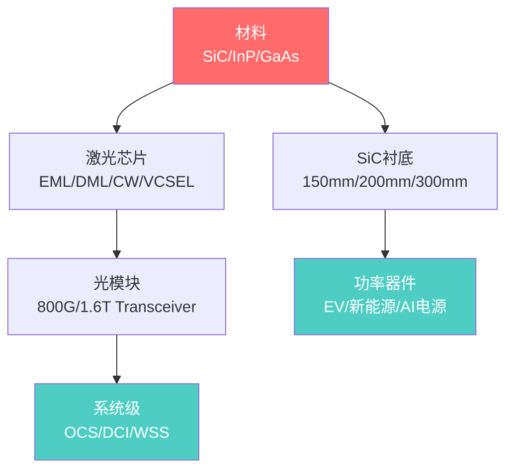

# Coherent Corp. (NYSE: COHR) 深度调研报告

> 更新日期: 2026-05-12 | 股价: ~$380 (5月11日) | 市值: ~$67B

---

## 一、公司基本概况

### 1.1 公司简介

Coherent Corp. 是全球最大的光子学平台公司之一，总部位于宾夕法尼亚州 Saxonburg。公司由 **II-VI Incorporated** 与 **Coherent, Inc.** 于 2022年7月合并而成，是材料科学、光网络和激光技术领域垂直整合程度最高的企业。

- **股票代码**: NYSE: COHR
- **前身**: II-VI Incorporated (1971年成立)、Finisar (2019年被II-VI收购)
- **CEO**: Jim Anderson (2024年上任，曾任Lattice Semiconductor CEO)
- **CFO**: Sherri Luther
- **全球布局**: 14个国家60个生产基地，半数在美国本土
- **业务**: 光收发器、碳化硅衬底、工业激光器

### 1.2 商业模式

Coherent 的核心商业模式是 **全栈平台型光子学供应商**，覆盖"材料 → 芯片 → 组件 → 子系统 → 模块"的完整链条：



Coherent 的独特之处在于：**同时支持SiPh（硅光子）+ InP EML + GaAs VCSEL三种激光技术路线**，能为不同客户需求提供一站式解决方案。2026年OFC大会上展示了搭配三家不同DSP厂商芯片的1.6T收发器，彰显平台型战略。

### 1.3 关键并购历程

| 时间 | 标的 | 金额 | 战略意义 |
|------|------|------|----------|
| 2019 | Finisar | ~$32亿 | II-VI从材料商升级为光模块供应商，获得数据中心客户直达能力 |
| 2022.07 | Coherent, Inc. | ~$70亿 | 合并工业激光器巨头，创建全栈光子学平台 |

### 1.4 II-VI与Coherent整合效果评估

合并已逾三年半，整合成效可归纳为：

| 维度 | 评级 | 说明 |
|------|------|------|
| 成本协同 | ✓ 基本达标 | 目标年化$250M+协同，FY2025 GAAP毛利率从2023年的水平大幅回升，Non-GAAP毛利率~39% |
| 品牌统一 | ✓ 已完成 | 统一为Coherent品牌，II-VI管理层主导（CEO为II-VI方，2024年换为Jim Anderson） |
| 业务梳理 | ✓ 积极 | 出售航空国防业务（$4亿）、材料加工工具业务给Bystronic，集中资源于核心增长领域 |
| 报表简化 | 有争议 | FY2026改为两分部（Datacenter & Communications + Industrial），透明度下降 |
| 财务减负 | 进行中 | 债务从峰值$4.2B降至$3.2B，杠杆率从2.3x降至1.7x，NVIDIA $20亿股权注资 |

**关键管理变动**: 2024年Jim Anderson接任CEO是重要转折点。Anderson来自Lattice Semiconductor，带来了"聚焦核心、削减杂项"的投资思路，体现在册中将"低ROI、非战略性项目"的资源重新配置到高增长核心产品线（Investor Day 2025）。

---

## 二、财务数据分析

### 2.1 季度收入与盈利趋势

| 指标 | Q3 FY2026 | Q2 FY2026 | Q1 FY2026 | Q4 FY2025 | Q3 FY2025 |
|------|-----------|-----------|-----------|-----------|-----------|
| **收入** | $1.81B | $1.69B | $1.58B | $1.44B | $1.50B |
| **YoY增速 (报告)** | 21% | 17% | --- | --- | --- |
| **YoY增速 (Pro Forma)** | 27% | 22% | --- | --- | --- |
| **GAAP毛利率** | 37.7% | 36.9% | 36.6% | 31.1% | 35.2% |
| **Non-GAAP毛利率** | 39.6% | 39.0% | 36.8% | 36.0% | 38.3% (约) |
| **GAAP Net Income** | $191.4M | ~$147M | ~$202M | --- | $15.7M |
| **GAAP EPS** | $0.97 | $0.76 | --- | --- | -$0.11 |
| **Non-GAAP EPS** | $1.41 | $1.29 | --- | --- | $0.91 |

**TTM (截至Dec 2025)**: 收入$6.60B | 毛利$2.44B | 营业利润$798M | 净利润$401M | EBITDA $1.31B | EPS $2.40

### 2.2 分部收入拆分

| 分部 | Q3 FY2026 | 占比 | Q2 FY2026 | 占比 | 趋势 |
|------|-----------|------|-----------|------|------|
| Datacenter & Communications | $1,361.7M | 75% | $1,208.0M | 72% | 持续上升 |
| Industrial | $444.0M | 25% | $477.6M | 28% | 稳中趋平 |

> 重要变化: 自FY2026起，公司从三分部（Networking / Materials / Lasers）改为两分部。原Materials（SiC衬底等）和Lasers合并为Industrial。这使得追踪SiC业务变得困难。

### 2.3 毛利率趋势与驱动因素

```
Non-GAAP Gross Margin 趋势:
  Q3 FY2025: ~38.3%
  Q4 FY2025: 36.0%
  Q1 FY2026: 36.8%
  Q2 FY2026: 39.0%
  Q3 FY2026: 39.6%
  
  趋势: 显著爬升通道，受益于:
  1. 高毛利的Datacenter业务占比从~60%提升至75%
  2. 硅光子方案带来10-20%成本优势
  3. 6英寸InP产线: 宣称>60%芯片成本降低
  4. 运营杠杆改善（合并协同递延释放）
```

### 2.4 资产负债表与债务情况

**关键节点: Q3 FY2026 (截至2026年3月31日)**

| 项目 | 金额 | 对比FY2025末 |
|------|------|--------------|
| 现金及等价物 + 短期投资 | ~$2.42B | $909M (暴增) |
| 流动资产合计 | $6.45B | $3.93B |
| 长期债务 (净流动部分) | $3.18B | $3.50B |
| 总股东权益 | $10.68B | $5.64B |
| 总资产 | $17.29B | $14.91B |

**资产负债表结构变化解读 (Q3 FY2026)**:

1. **NVIDIA $20亿战略投资**: 对现金和权益产生重大影响
2. **B类优先股转股**: $25亿优先股转为普通股，消除相关股息支出
3. **航空国防业务出售**: ~$4亿现金流入
4. **债务持续下降**: 长期债务从峰值$4.2B (FY2023) 降至$3.2B

**债务结构**:

| 工具 | 金额 | 利率 | 到期 |
|------|------|------|------|
| Term A + Revolver | ~$3.5B总额度 | SOFR+1.50% | 2030 |
| Term B-3 | ~$1.08B | SOFR+1.75% (floor 0.50%) | 2031 |
| 高级无担保票据 | $990M | 固定 | 2029 |
| 其他 | ~$20M | --- | --- |
| **总计** | ~$3.35B | --- | --- |

**债务杠杆率**: 1.7x (Q2 FY2026), 低于2.0x管理目标。对比合并后峰值约4x+，改善显著。

### 2.5 现金流状况

| 时期 | 经营性现金流 | CapEx | 自由现金流特征 |
|------|-------------|-------|---------------|
| FY2026前六个月 | $104M | 高 | 自由现金流受限，因产能扩张投入大 |
| FY2025前六个月 | $340M | 较低 | 较充裕 |

> FY2026现金流受压主因：为满足AI数据中心爆发需求，大幅增加库存（inventories增至$1.85B vs FY2025末$1.44B）和应收账款。管理层的解释是"为支持强劲需求前景而主动提前备货"。

---

## 三、核心业务拆分

### 3.1 Datacenter & Communications (占总收入75%+)

这是 Coherent 的核心增长引擎，涵盖数据中心光互联 + 电信网络两大类。

#### 3.1.1 数据中心光收发器

Coherent 是全球最大的光收发器供应商之一（与Innolight、Lumentum、Broadcom竞争），在AI数据中心建设浪潮中处于核心受益位置。

**产品矩阵**:

| 速率 | 技术路线 | 状态 | 备注 |
|------|----------|------|------|
| 800G | SiPh + InP EML | 大规模量产 | 当前主力产品 |
| 1.6T | SiPh/InP EML/VCSEL | 量产爬坡 | OFC 2026展示三种DSP芯片方案 |
| 3.2T | 路线图 | 研发中 | 下一代 |

**技术路线的战略意义**:
- **SiPh (硅光子)**: Coherent的核心差异化优势，成本比EML方案低10-20%，使用廉价CW激光器
- **InP EML**: 长距离/高性能场景，当前供不应求，但Coherent正在建造6英寸InP产线替代外购
- **GaAs VCSEL**: 短距离应用（含Apple消费电子），差异化覆盖

**收入贡献与增长**:
- Q2 FY2026: 数据中心收入增长14% QoQ / 36% YoY
- Q2 FY2026: 通信市场收入增长9% QoQ / 44% YoY
- 管理层指引: Q3和Q4（即Mar/Jun 2026季度）数据业务将维持双位数QoQ增长

#### 3.1.2 Datacenter光电路交换机 (OCS)

新一代AI计算集群对光电路交换的需求爆发，这是Coherent vs Lumentum激战的新战场。

| 维度 | Coherent | Lumentum |
|------|----------|----------|
| 技术 | 液晶基OCS | MEMS微镜OCS |
| 端口规模 | 64×64 和 320×320 | 300×300 |
| 客户进展 | 10+客户，book-to-bill >4x | $400M+可见订单 |
| 定位 | 下一代AI机架互联 | 成熟技术路径 |

管理层称OCS backlog在Q2继续环比增长，多数backlog偏向大端口系统(320×320)。CEO强调这是一个"超过$20亿的可寻址市场机会"。

#### 3.1.3 CPO (共封装光学)

Coherent在Q2 FY2026电话会中披露了一个重要数据点: 从一家"领先的AI数据中心客户"获得了大型CPO采购订单，由6英寸InP产线制造，预计2026年内产生初始收入。具体金额未披露。

#### 3.1.4 电信

传统电信业务受益于全球市场复苏，增长引擎包括:
- 相干ZR收发器 (DCI数据中心互联)
- 5G基础设施部署
- 泵浦激光器、放大器、线卡系统
- 获得行业奖项的新型多轨技术平台

**DCI (数据中心互联)**: 这是一条Lumentum不具备的独立增长曲线。

### 3.2 Industrial (占总收入25%)

包含三个核心子板块:

#### 3.2.1 碳化硅 (SiC) 衬底

Coherent是全球仅有的五家高质量SiC衬底供应商之一，但市场份额已从早期高位有所下滑。

| 维度 | 数据 |
|------|------|
| 全球SiC衬底市场 (2024) | $10.4亿 (同比-9%，TrendForce) |
| Coherent市场份额 | 13.9% (第四位) |
| 主要竞争对手 | Wolfspeed 33.7%, TanKeBlue 17.3%, SICC 17.1% |
| 产品尺寸 | 150mm量产, 200mm扩张, 300mm宣称中 |
| 终端市场 | EV功率模块、可再生能源、工业电源、AI数据中心电源 |

**SiC行业格局变化 (2026年)**:
- EV市场增速放缓叠加中国产能爆发，导致全球SiC衬底价格大幅下跌
- 2024年全球SiC衬底收入反而下降9%
- AI数据中心电源成为继EV之后的**第二增长引擎**
- Coherent的300mm SiC平台押注下一代高功率AI基础设施

**Coherent的300mm SiC押注**: 这是今年估值故事的核心部分。公司声称300mm平台能提供"低电阻率、低缺陷密度、高均匀性"，目标AI数据中心的热管理瓶颈和电网电气化。但这条路需要跨越从200mm到300mm的技术与良率鸿沟。

#### 3.2.2 工业激光器

| 子类 | 应用 | 状态 |
|------|------|------|
| 超快激光器 | 微电子加工、显示切割 | FY2026 Q2增长驱动力 |
| 光纤激光器 | 切割、焊接、标记 | 传统业务 |
| 准分子激光器 (Excimer) | 显示退火（OLED/LCD） | 成熟但重要 |
| 工程材料产品 | 特种光学材料 | 稳定贡献 |

**前瞻**: 工业激光器面临中国竞争对手的价格压力（如锐科激光/Raycus、创鑫激光/Maxphotonics），但在高端超快和准分子领域有技术壁垒。管理层在Q2业绩电话会中称"预期工业需求将改善"。

#### 3.2.3 Portfolio优化

已完成的剥离:
- **航空国防业务**: ~$4亿出售 (Q1 FY2026)
- **材料加工工具**: 出售给Bystronic (2026年初)

效果: 瘦身资产负债表，剥离低利润非核心资产，将资本集中到Datacenter增长领域。

---

## 四、近期催化剂与分析

### 4.1 AI数据中心光模块需求（核心催化剂）

**市场规模**: Jefferies预计AI收发器市场到2028年接近$500亿，LightCounting估计2025年整个光收发器市场超过$230亿（YoY ~+50%）。

**Coherent的优势**:
1. 全技术平台（SiPh + InP EML + VCSEL）意味着对各路客户"一站式"能力，不押注单一路线
2. 垂直整合制造能力在大规模交付中抗风险、保交期
3. 与NVIDIA的战略联盟（$20亿股权投资）是深层次客户关系的信号

**Book-to-Bill数据**: Q2 FY2026数据中心book-to-bill超过4x，意味着新增订单是当季收入的4倍以上——需求远超当前产能。

### 4.2 6英寸InP晶圆产线

| 维度 | 说明 |
|------|------|
| 位置 | Sherman, Texas |
| 进度 | 已投入运营 |
| 效果 | "每片晶圆4倍器件数，芯片成本降低>60%" (公司2024年3月宣称) |
| 战略意义 | 降低对外部InP EML（包括从Lumentum）采购的依赖，提升自供率和毛利率 |

如果6英寸产线良率和产量达到目标，Coherent将从"部分依赖外购InP芯片"变为全面自供，这将改变InP供应链格局。Lumentum当前受益于InP供给紧张带来的稀缺性溢价，一旦Coherent 6英寸产线全速运转，2027-2028年InP供应弹性将显著提升，稀缺性溢价开始压缩。

### 4.3 NVIDIA战略合作

2026年Q3期间，**NVIDIA向Coherent投资$20亿**（股权形式），同时Coherent完成了$25亿B类优先股转普通股。这是Coherent作为NVIDIA生态系统核心供应商地位的强力背书。

NVIDIA在GTC 2025宣布了Quantum-X Photonics InfiniBand交换机（2025年下半年）和Spectrum-X Photonics Ethernet交换机（2026年），这些都需要大规模高带宽光互联。Coherent的1.6T收发器和OCS产品直接受益。

### 4.4 产能扩张

| 项目 | 状态 |
|------|------|
| 1.6T收发器产能 | 急速扩张中，book-to-bill >4x推动 |
| InP 6英寸产线 | Sherman工厂爬坡 |
| SiC 200mm → 300mm | 研发到生产转化阶段 |
| OCS产能 | 快速扩产以满足">$20亿市场机会" |

### 4.5 FY2026 Q4及FY2027指引

| 指标 | Q4 FY2026指引 |
|------|-------------|
| 收入 | $1.91B - $2.05B |
| Non-GAAP EPS | $1.52 - $1.72 |
| Non-GAAP毛利率 | 预计持续在39%附近或更高 |

**分析师共识 (Yahoo Finance)**:
- FY2026 (截至Jun 2026): 收入$7.05B, EPS $5.45
- FY2027: 收入$9.32B, EPS $8.02
- 长期EPS增速预期: ~47% YoY

---

## 五、估值分析

### 5.1 当前估值指标

| 指标 | 数值 | 备注 |
|------|------|------|
| 股价 | ~$380 (5月11日) | YTD +~38% |
| 市值 | ~$67B | |
| 企业价值 (EV) | ~$66.6B | |
| **Trailing PE** | ~140x | 基于TTM EPS $2.40; 受早期低利润期拖累 |
| **Forward PE (FY2026)** | ~45x | 基于$5.45 EPS共识 |
| **Forward PE (FY2027)** | ~42x | 基于$8.02 EPS共识 |
| PEG Ratio | ~1.09 | 基于FY2026-2027增速 |
| EV/Sales (TTM) | ~10.1x | |
| EV/EBITDA (TTM) | ~50.7x | |
| Forward EV/EBITDA | ~30x | 基于FY2026 EBITDA估计$1.7B |
| Price/Book (MRQ) | ~3.4x | Q3 FY2026权益大增后 |
| Price/FCF (TTM) | n/a | 因CapEx大增自由现金流受压 |

> 注意: TTM PE严重高估（因为FY2025前几个季度利润较低），Forward PE更有意义。以FY2027 Forward PE 42x和PEG 1.09来看，估值在"高增长合理溢价"和"估值偏贵"之间。

### 5.2 同业估值对比

#### Coherent vs 直接竞争对手

| 公司 | 市值 | TTM收入 | 收入增速 | 毛利率 | 营业利润率 | PE(TTM) | PS(TTM) | EV/EBITDA |
|------|------|---------|----------|--------|------------|---------|---------|-----------|
| **COHR** | ~$67B | $6.6B | ~19% | 36.2% | 9.0% | ~140x | ~10x | ~51x |
| **LITE** | ~$60-64B | $2.1B | ~65% | 33.4% | 0.5% | ~240x | ~30x | ~189x |
| **FN** | 较小 | ~$3B+ | ~17% | 较低 | --- | 较低 | 较低 | 较低 |

#### Coherent vs II-VI合并前历史估值

| 时期 | EV/EBITDA | 说明 |
|------|-----------|------|
| II-VI 合并前 (3年均值) | ~14.4x | 传统工业半导体公司估值 |
| II-VI 合并前 (5年均值) | ~11.8x | 更早期的低成长估值 |
| 行业均值 (电子元件) | ~17.3x | |
| **当前 COHR** | ~52.4x | AI狂潮重估 |

**关键对比**: 如果Coherent的EV/EBITDA回到合并前3年均值(14.4x)，按照Alpha Spread计算，将意味着约72%的下行空间($87.63)。但关键在于——公司已不再是那家II-VI了，AI数据中心业务的爆发式增长意味着更高的增长率和更快的利润扩张速度，高估值存在一定的基本面支撑。

#### 与Fabrinet (FN) 对比

Fabrinet作为合约制造商，本质上是一个不同的商业模式（代工vs技术平台），但作为NVIDIA光模块组装伙伴受益于同一AI浪潮。Fabrinet估值相对合理（~22x Forward PE），但技术壁垒和利润率远低于垂直整合的Coherent。

### 5.3 分析师共识

| 来源 | 评级 | 目标价 | 日期 |
|------|------|--------|------|
| TD Cowen | Buy | $340→$395 | 2026-05-07 |
| Rosenblatt | Buy | $375→$425 | 2026-05-07 |
| Stifel | Strong Buy | $275→$412 | 2026-05-05 |
| Rothschild & Co | Strong Buy | $455 (首次覆盖) | 2026-05-01 |
| Citigroup | Strong Buy | $250→$420 | 2026-04-21 |
| Morgan Stanley | Hold | $250→$290 | 2026-04-20 |
| JP Morgan | Buy | $245→$300 | 2026-04-09 |
| Northland | Outperform | $80→$85 | 2025-06-02 |
| **共识** | **Strong Buy** | **~$289-312** | |

**目标价区间**: $85 (最熊) ~ $455 (最牛)。近期多数上调至$395-455区间，反映Q3超预期后分析师追赶尝试。

### 5.4 DCF隐含估值

Alpha Spread的DCF估值给出$96.94的"内在价值"，意味着当前价格高估69%。但这基于常规假设，未必充分反映AI基础设施建设的非线性增长。

---

## 六、Coherent vs Lumentum 全面对比

这是一个投资者必须在两者之间和/或都配置的核心二元选择。

### 6.1 战略性对比

| 维度 | Coherent (COHR) | Lumentum (LITE) |
|------|-----------------|-----------------|
| **市值** | ~$67B | ~$60-64B |
| **TTM收入** | $6.6B (大3倍) | $2.1B |
| **商业模式** | 全栈平台型 | 聚焦型InP专精 |
| **光模块技术** | SiPh + InP EML + VCSEL 全覆盖 | 以InP EML为核心 |
| **核心增长驱动** | AI光模块 + 电信DCI + SiC二重曲线 | AI光模块 + CPO激光 + OCS |
| **OCS技术** | 液晶基 (下一代) | MEMS微镜 (成熟) |
| **SiC业务** | 有 (第四大全球供应商) | 无 |
| **工业激光** | 有 (成熟但成长慢) | 无 |
| **资产负债表** | 有杠杆 (但快速下降) | 几乎无债务 |
| **盈利能力** | Operating margin ~9% (TTM) | Operating margin ~0.5% (TTM) |
| **净利率** | 4.7% | 12.0% |
| **估值 (PS)** | ~10x | ~30x |
| **估值 (Forward PE)** | ~45x | ~54x |

### 6.2 投资逻辑区别

**Coherent = 重型装备**
- 类似投资一家"全栈光子学基础设施供应商"
- 优势: 技术全覆盖，DCI独有增长曲线，工业激光/SiC提供额外期权
- 劣势: 债务负担、业务复杂度高、部分业务透明度低
- 2027-2028的EPS惊喜可能超出当前共识，但需要耐心等待减负完成

**Lumentum = 尖刀**
- 类似投资"InP激光器稀缺性"的纯粹表达
- 优势: 聚焦专精，在2026-2027 CPO从0到1阶段有更高经营杠杆，无债务拖累
- 劣势: 估值更贵(PS 30x)，比Coherent更依赖单一技术路径的市场接受度，无SiC/DCI对冲

### 6.3 关键差异: 6英寸InP的意义

这是两家公司之间最核心的结构性差异:

- **当前**: Lumentum受益于InP EML供不应求，享受稀缺性溢价高毛利
- **未来 (2027-2028)**: 一旦Coherent 6英寸InP产线全面量产，InP整体供给弹性增加，Lumentum的稀缺性溢价将开始压缩
- Coherent对外宣称不再从Lumentum采购EML的时点是2027年中

这不是说Lumentum会崩塌，而是说InP供给面的结构性变化是市场尚未充分定价的长期变量。

---

## 七、风险因素

### 7.1 估值风险 (HIGH)

当前Forward PE ~45x (FY2026), ~42x (FY2027)，即使在高增长赛道中也不算便宜。任何增速放缓的信号都会引发剧烈估值压缩。

- Forward PE从45x跌至30x → 股价跌幅~33%
- Forward PE从45x跌至历史均值~15x → 股价跌幅~67%

### 7.2 客户集中度风险 (HIGH)

公司未披露单一客户占比，但基于AI数据中心市场结构，可合理推断Microsoft、Google、Amazon、Meta等少数hyperscalers贡献了数据业务的大部分收入。任一客户削减capex都将造成实质冲击。

### 7.3 SiC行业周期风险 (MEDIUM)

- 2024年全球SiC衬底收入下降9%，面临中国产能爆发式增长的价格竞争
- Coherent市场份额从历史高位下滑至13.9%
- 300mm SiC是一个昂贵的赌注，技术转化存在不确定性
- 但AI数据中心电源需求可能成为超出EV的增量驱动力

### 7.4 光通信竞争格局 (HIGH)

| 竞争来源 | 强度 | 说明 |
|----------|------|------|
| Lumentum | 极高 | 直接竞争InP EML和OCS |
| Innolight/中际旭创 | 高 | 中国光模块巨头，成本优势，1.6T量产领先 |
| Eoptolink | 中高 | 中国光模块新势力，同样受AI驱动 |
| Broadcom | 中 | 在DSP和交换芯片有巨大优势 |
| Hyperscaler自研 | 中 | 谷歌/微软/亚马逊开发自制光互联方案 |
| Acelink等 | 低中 | 新进入者试图追赶 |

### 7.5 技术路线风险 (MEDIUM)

Coherent同时在三条技术路线上投入(SiPh/InP EML/VCSEL)，虽然这提供了客户覆盖广度，但也意味着R&D资源分散。如果某一技术路线最终成为压倒性主流，Coherent可能"样样都做但都不够精"。

### 7.6 债务与再融资风险 (MEDIUM → 下降中)

- 2029年到期$9.9亿高级票据是未来的再融资风险
- 但杠杆率已降至1.7x，NVIDIA股权注资、业务出售均增强了财务弹性
- Z-Score为1.75（distress zone），但考虑到行业特征和快速改善的趋势，这更多是历史遗留而非当前危机

### 7.7 地缘政治/关税风险 (MEDIUM)

Coherent在14个国家运营，中美贸易摩擦和关税政策变化直接影响全球供应链。公司称"当前关税政策对业务影响不显著"，但格局变化是一个不确定因素。

### 7.8 执行风险 (MEDIUM)

- 6英寸InP产线良率爬坡速度
- 1.6T收发器大规模量产的一致性
- OCS从"客户engagement"到实质性收入的转化
- 300mm SiC工业化生产的时间表
- 需求暴增下供应链管理（库存+应收激增已经显现压力）

---

## 八、投资结论

### 8.1 核心投资叙事

Coherent是一个 **"AI基础设施光子学层的一站式全栈押注"**: 既投资于当前800G/1.6T光模块的爆炸式增长，又投资于CPO/OCS等下一代互联技术，外加工碳化硅的工业/能源期权。它在三个维度上同时暴露于AI建设:

1. **数据中心的"血管"** - 光收发器 (800G→1.6T→3.2T)
2. **数据中心的"接线板"** - OCS电路交换
3. **数据中心的"心脏供血"** - SiC功率电源管理

### 8.2 合理估值区间估算

采用分部估值法 (SOTP, 基于FY2027估计):

| 业务 | FY2027估算收入 | 适用倍数 | 隐含价值 | 逻辑 |
|------|--------------|----------|----------|------|
| Datacenter & Comm | ~$7.5B | 5-7x EV/S | $37.5-52.5B | 增长型光通信平台估值 |
| Industrial (含SiC) | ~$1.8B | 2-3x EV/S | $3.6-5.4B | 周期性工业+SiC材料 |
| Minus: 净债务 | | | ~$1.0B | |
| **隐含市值** | | | **$40-57B** | |
| **隐含每股** | | | **~$225-320** | (基于约178M稀释股数) |

> 当前$380/股处于SOTP合理估值区间的上沿偏上。在牛市情景(Non-GAAP EPS超$9, 市场给予50x → $450)，仍有上涨空间；但当前价格已经计入了较多乐观预期。

### 8.3 与Lumentum的配置建议

| 投资者风格 | 建议 |
|------------|------|
| **寻求Alpha/稀缺性暴露** | 配置Lumentum (更纯的CPO/激光器叙事) |
| **寻求Beta/全栈暴露** | 配置Coherent (更广泛的AI基础设施暴露) |
| **风险偏好低** | 两者都贵。等待回调或在AI光互联主题中寻找更上游的标的（如MOCVD设备商Veeco/Aixtron） |
| **多主题配置** | 二者组合持有，因为它们在技术路径(EML vs SiPh)、增长曲线(CPO激光 vs DCI+SiC)、资本结构(无债 vs 去杠杆中)上形成互补 |

### 8.4 价格观察点

| 事件 | 预期时间 | 关注点 |
|------|----------|--------|
| Q4 FY2026财报 | 2026年8月 | 全年收入能否达$7.05B，Q4是否超$2B |
| OFC 2027 | 2027年3月 | 3.2T光模块进展、CPO量产状态 |
| 6英寸InP产线全面投产 | 2026H2-2027 | 良率、成本下降轨迹、自供率 |
| NVIDIA Blackwell/后续平台 | 2026-2027 | Coherent在NVIDIA生态的份额 |
| OCS大额订单披露 | 持续跟踪 | 从"engagement"到具体金额 |

### 8.5 总体评分

| 维度 | 评分 (1-10) | 备注 |
|------|------------|------|
| 行业赛道 | 9/10 | AI光互联是最确定的长期增长方向之一 |
| 竞争护城河 | 8/10 | 全栈垂直整合 + 三技术路线 + 材料/芯片/模块全链 |
| 财务质量 | 7/10 | 毛利率爬升中，债务快速下降，现金流短期承压 |
| 估值合理性 | 5/10 | Forward PE ~45x不便宜，但PEG ~1.09尚可 |
| 催化确定性 | 8/10 | AI capex持续、Book-to-Bill >4x、NVIDIA背书 |

**综合**: **具有长期投资价值的AI基础设施核心标的，但当前估值已大部分反映近期利好。** 建议在价格回调至$300-320区间时积极配置；$380以上的追高风险较大。与Lumentum相比，Coherent的优点是更全面的AI光互联暴露+SiC/Industrial提供下行对冲，缺点是债务负担和业务复杂度的认知成本。

---

> **关联研报**: [[lumentum-2026-05-12|Lumentum深度调研]]
> **数据来源**: Coherent Corp. SEC Filings (10-Q, 8-K), Earnings Press Releases FY2026 Q1-Q3, Investor Day 2025 Presentation, Yahoo Finance, StockAnalysis.com, Alpha Spread, TrendForce SiC Market Report, Jefferies Optical Model, AInvest, The Motley Fool Transcripts, ZScoreX